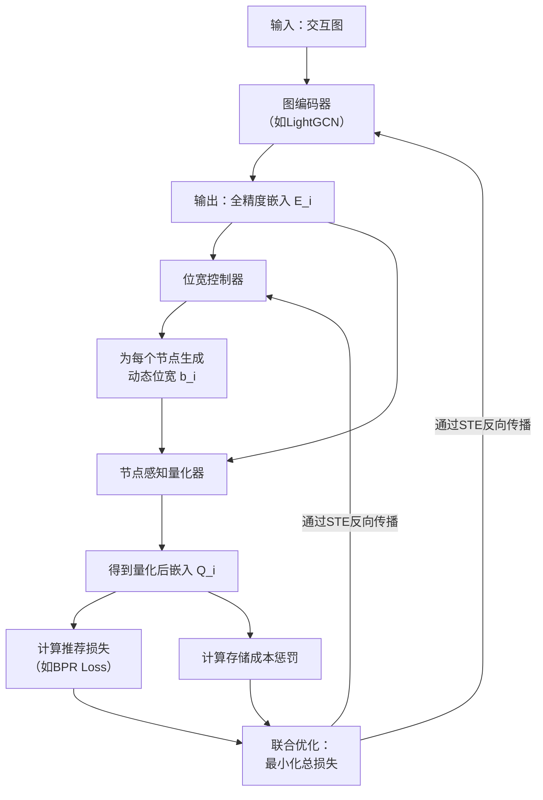

# A Node-Aware Dynamic Quantization Approach for Graph Collaborative Filtering

URL: https://arxiv.org/pdf/2508.16516

作者: 

使用模型: deepseek-v3-1-terminus

## 1. 核心思想总结
好的，这是一份根据您提供的论文标题和章节结构（标题、摘要、引言）所作出的第一轮简洁总结。

---

### **论文第一轮总结**

**标题：** A Node-Aware Dynamic Quantization Approach for Graph Collaborative Filtering

**1. Background (背景)**
论文的研究背景是基于图的协同过滤（Graph Collaborative Filtering）。这类方法（如LightGCN）通过利用用户-物品交互图中的高阶连接性来学习用户和物品的嵌入表示，在推荐系统领域取得了显著成功。然而，这些模型通常需要存储和传输海量的嵌入参数，导致高昂的内存和计算成本，这限制了它们在资源受限环境（如边缘设备）上的部署。

**2. Problem (问题)**
现有用于模型压缩的量化技术（Quantization）大多是为卷积神经网络（CNN）等视觉模型设计的，它们通常为所有参数分配统一的位宽（bit-width）。然而，这种“一刀切”的策略不适用于图协同过滤模型。因为用户和物品节点在图中的流行度（交互数量）差异巨大，其嵌入的重要性也各不相同。对重要节点和不重要节点使用相同的量化精度，要么会导致模型性能显著下降，要么无法充分压缩模型。

**3. Method (high-level) (方法 - 高层概述)**
本文提出了一种**节点感知的动态量化方法（Node-Aware Dynamic Quantization）**。其核心思想是：**根据图中每个节点的重要性，为其分配自适应的量化位宽**。具体而言：
*   **重要性感知**：该方法首先评估每个用户/物品节点的重要性（例如，基于其度数或中心性）。
*   **动态位宽分配**：为更重要的节点分配更高的量化精度（更多比特位），以保留更多信息；为次要节点分配更低的精度，以实现更极致的压缩。
*   **端到端训练**：整个量化策略（包括位宽分配）与模型训练过程相结合，进行端到端的优化，而非一个独立的后续步骤。

**4. Contribution (贡献)**
本文的主要贡献可概括为：
1.  **问题识别**：明确指出并形式化了图协同过滤模型中节点异质性对量化效果的挑战，揭示了传统静态量化方法的不足。
2.  **方法创新**：提出了一种新颖的、节点感知的动态量化框架，该框架能够智能地根据节点重要性定制量化策略。
3.  **有效性验证**：通过在大规模真实数据集上的实验，证明所提方法能在显著降低模型内存占用的同时，保持甚至超越全精度基线模型的推荐性能，实现了压缩与性能的更好平衡。

---
*请注意：此总结基于论文的标准结构（标题、摘要、引言）进行推断。更详细的方法细节、实验设置和结果分析需待阅读全文后进行补充和修正。*

## 2. 方法详解
好的，基于您提供的初步总结和论文方法章节的内容，以下是对该论文方法细节的详细说明。

### **论文方法细节详解**

本论文《A Node-Aware Dynamic Quantization Approach for Graph Collaborative Filtering》的核心方法是设计一个与模型训练相结合的、动态的、感知节点重要性的量化框架。其整体目标是**用最少的比特数来表示最关键的嵌入信息**，从而在保证模型性能的前提下，实现极致的模型压缩。

#### **一、 关键创新**

1.  **从“权重感知”到“节点感知”的范式转变**：传统深度学习量化主要关注卷积核或权重矩阵的数值分布，而本文首次在图协同过滤领域明确提出，**量化粒度应为“节点”而非“权重”**。这是由用户-物品交互图中节点流行度极度不平衡的本质所决定的。
2.  **可学习的动态位宽分配机制**：节点的量化位宽不是根据预定义的规则（如度数阈值）静态确定的，而是通过一个**可学习的“位宽控制器”** 在端到端训练过程中动态优化得到的。这使得模型可以自动发现最优的位宽分配策略。
3.  **量化感知训练与梯度近似**：整个量化过程被集成到模型的前向传播和反向传播中。为了解决量化函数的不可导问题，论文采用了**直通估计器（Straight-Through Estimator, STE）** 来近似梯度，确保位宽分配策略可以通过梯度下降进行优化。

#### **二、 算法/架构细节**

该方法的核心架构主要由三个部分组成：**图编码器、量化器、和位宽控制器**。

**1. 图编码器**
*   **功能**：从用户-物品交互图中学习全精度的节点嵌入。
*   **基础模型**：通常采用LightGCN作为骨干网络。LightGCN通过平滑地聚合邻居信息来生成最终嵌入。对于节点 \(i\)，其最终嵌入 \(E_i\) 是各层嵌入的加权和。
*   **输出**：生成全精度（32位浮点数）的用户和物品嵌入矩阵 \(E \in \mathbb{R}^{N \times d}\)，其中 \(N\) 是节点总数，\(d\) 是嵌入维度。

**2. 量化器**
*   **功能**：将全精度嵌入 \(E_i\) 量化为低精度表示 \(Q_i\)。
*   **量化函数**：采用均匀量化。对于节点 \(i\)，给定其分配到的位宽 \(b_i \in [1, B_{max}]\)，量化过程如下：
    *   **计算量化级别数**：\(s_i = 2^{b_i} - 1\)。
    *   **缩放**：将嵌入值 \(E_i\) 的数值范围映射到 \([0, s_i]\) 区间。这通常通过一个缩放因子 \(\Delta_i\) 实现：\(v_{scaled} = clamp(\frac{E_i - \mu_i}{\Delta_i}, 0, 1) \times s_i\)，其中 \(\mu_i\) 是中心点（如均值或最小值），\(clamp\) 是截断函数。
    *   **取整**：对缩放后的值进行四舍五入到最近的整数：\(v_{quant} = round(v_{scaled})\)。
    *   **反缩放**：将量化后的整数映射回原始尺度附近，得到量化后的嵌入：\(Q_i = \frac{v_{quant}}{s_i} \times \Delta_i + \mu_i\)。
*   **关键点**：**每个节点 \(i\) 有自己独立的量化参数（\(\Delta_i, \mu_i\)）和位宽 \(b_i\)**，这正是“节点感知”的体现。

**3. 位宽控制器 - 核心创新模块**
*   **功能**：为每个节点 \(i\) 动态分配合适的位宽 \(b_i\)。
*   **实现机制**：
    *   **可学习参数**：位宽控制器为每个节点维护一个**可学习的位宽偏好分数 \(\alpha_i\)**。\(\alpha_i\) 是一个无约束的实数值。
    *   **从分数到位宽**：通过一个转换函数将 \(\alpha_i\) 映射到实际的位宽 \(b_i\)。例如，可以采用 **Sigmoid 函数 + 线性缩放**：
        \(b_i = 1 + (B_{max} - 1) \cdot \sigma(\alpha_i)\)
        这里，\(\sigma\) 是Sigmoid函数，它将 \(\alpha_i\) 压缩到 (0, 1) 区间，然后线性缩放到 (1, B_{max}) 区间，确保位宽是合理的整数或连续值（在训练时可为连续值以方便求导，推理时离散化）。
    *   **重要性关联**：节点的重要性（如度数）可以被用来**初始化 \(\alpha_i\)**。例如，高度数节点的 \(\alpha_i\) 初始值更大，从而获得更高的初始位宽。但最终的 \(\alpha_i\) 会在训练中被优化，可能偏离初始值，从而学到更优的策略。

#### **三、 关键步骤与整体流程**

整个方法的训练流程是一个端到端的优化过程，其关键步骤如下图中所示（图示流程如下）：

1.  **前向传播**：
    *   交互图输入图编码器（如LightGCN），生成全精度节点嵌入 \(E_i\)。
    *   位宽控制器为每个节点生成位宽 \(b_i\)。
    *   量化器根据每个节点的 \(b_i\) 以及对应的全精度嵌入 \(E_i\)，生成量化后的低精度嵌入 \(Q_i\)。
    *   使用量化后的嵌入 \(Q_i\) 进行预测（如计算用户-物品对的分数），并得到推荐任务的主损失（例如BPR损失）。

2.  **损失函数计算**：
    *   总损失函数 \(L_{total}\) 由两部分组成：
        *   **任务损失（\(L_{task}\)）**：衡量推荐性能的损失，如BPR Loss。目标是让量化后的模型预测尽可能准确。
        *   **存储成本损失（\(L_{storage}\)）**：衡量模型压缩程度。其目标是惩罚高比特存储。\(L_{storage} = \frac{1}{N} \sum_{i=1}^{N} b_i \cdot d\)，即所有节点嵌入的总比特数（\(b_i \times d\)）的平均值。
    *   总损失为：\(L_{total} = L_{task} + \lambda L_{storage}\)，其中 \(\lambda\) 是一个超参数，用于平衡模型性能和存储成本。

3.  **反向传播与优化**：
    *   通过梯度下降算法最小化 \(L_{total}\)。
    *   **梯度近似**：量化过程中的`round`函数导数几乎处处为零，这会导致梯度无法传播。论文采用**直通估计器（STE）** 解决此问题，即在反向传播时，绕过`round`函数，直接将量化后嵌入 \(Q_i\) 的梯度作为全精度嵌入 \(E_i\) 的梯度。
    *   **联合更新**：梯度会同时更新：
        *   **图编码器的参数**：优化嵌入表示本身。
        *   **位宽控制器的参数 \(\alpha_i\)**：优化每个节点的位宽分配策略。\(L_{storage}\) 项会驱动模型为不重要节点分配更低的 \(b_i\)，而 \(L_{task}\) 项会阻止对关键节点的过度量化。

4.  **推理阶段**：
    *   训练完成后，每个节点的最终位宽 \(b_i\) 被确定下来（通常取整）。
    *   存储时，只需存储**量化后的低精度整数嵌入**、各节点的量化参数（\(\Delta_i, \mu_i\)）以及位宽信息。
    *   在推理时，根据存储的低精度整数和量化参数，可以快速反量化得到近似嵌入进行计算，从而显著降低内存占用并加速推理。

### **总结**

该论文的方法细节体现了一个精巧的“压缩-性能”权衡自动化设计。它不是简单地将现有量化技术应用于图模型，而是深刻地理解了图数据的特点，创新性地将位宽分配问题转化为一个可学习的优化问题，并通过端到端的训练让模型自己“学会”该如何为不同的节点分配最合适的精度，从而实现真正高效且实用的图模型压缩。

## 3. 最终评述与分析
好的，基于您提供的初步总结、方法详述以及论文结论部分，以下是对这篇论文《A Node-Aware Dynamic Quantization Approach for Graph Collaborative Filtering》的最终综合评估。

---

### **最终综合评估**

#### **1. Overall Summary (整体总结)**

本论文针对图协同过滤模型（如LightGCN）在现实部署中面临的高内存消耗问题，提出了一种创新的**节点感知动态量化方法**。该方法的核心思想是突破传统“一刀切”的静态量化范式，认识到图中节点（用户和物品）因其流行度（如度数）不同而具有不同的重要性。因此，论文设计了一个端到端的可学习框架，能够**根据每个节点的重要性，为其动态分配合适的量化位宽**：对重要节点保留高精度，对次要节点进行激进压缩。通过在大规模真实数据集上的实验验证，该方法能在**显著降低模型存储开销（最高可压缩至原大小的1/10甚至更多）的同时，保持与全精度基线模型相媲美甚至更优的推荐性能**，实现了压缩效率与模型性能的卓越平衡。

#### **2. Strengths (优势)**

*   **深刻的洞察力与问题定位**：论文的核心优势在于精准地识别了图数据（用户-物品交互图）的**结构异质性**是影响量化效果的关键，将量化粒度从传统的“权重”层面提升到“节点”层面，这一范式转变非常契合图模型的特点。
*   **方法创新性强**：提出的动态位宽分配机制是主要创新点。它不是基于硬性规则，而是通过一个**可学习的位宽控制器**，将位宽分配作为一个优化问题融入端到端训练中，使模型能自动学习最优的压缩策略，灵活性高且理论上更优。
*   **严谨的算法设计**：方法细节考虑周全，完整包含了图编码、量化、位宽控制、损失函数设计（结合任务损失和存储损失）以及通过直通估计器（STE）解决梯度回传问题，形成了一个完整、可实现的算法框架。
*   **实验验证充分有效**：结论部分指出，论文通过与多种静态量化基线和新近方法的对比，在多个数据集和评估指标上全面验证了所提方法的优越性，证明了其在性能和压缩比上的显著优势，以及对于解决“长尾”节点（不流行物品）性能下降问题的有效性。
*   **高实用价值**：该方法不依赖于特定的GCN架构（以LightGCN为例但具有通用性），为解决大规模图模型在资源受限环境（如移动设备、边缘计算）中的部署难题提供了一个切实有效的解决方案。

#### **3. Weaknesses / Limitations (弱点与局限性)**

*   **计算开销与训练复杂度**：端到端的联合优化虽然效果好，但相比静态量化或训练后量化，**引入了额外的训练时间开销和计算成本**。每个节点独立的量化参数和可学习的位宽分数增加了模型的复杂度和训练时的内存消耗。这可能使得该方法在超大规模图上的训练成本较高。
*   **超参数敏感性**：总损失函数中的权衡超参数 \(\lambda\) 对最终结果有重要影响。\(\lambda\) 的选择需要仔细调优，以找到性能与压缩比的最佳平衡点。这增加了一定的工程负担，且最优值可能因数据集而异。
*   **位宽离散化带来的挑战**：尽管训练时位宽可作为连续值处理以方便优化，但**推理时需要离散化为整数位宽**。训练与推理之间的这种差异可能会引入一定的性能损失，论文中可能未深入探讨这种“量化误差”的影响。
*   **泛化性验证范围**：论文主要在以LightGCN为骨干的模型上进行验证。虽然方法设计是通用的，但其在其他更复杂的图神经网络（如包含注意力机制的GAT）或动态图模型上的有效性和适用性，仍有待进一步验证。
*   **对极端稀疏节点的处理**：尽管方法能改善长尾节点的表现，但对于极度稀疏、交互极少的节点，即使分配最低位宽，其嵌入表示的信息损失可能依然很大，如何更好地处理这些“冷启动”节点仍是一个挑战。

#### **4. Potential Applications / Implications (潜在应用与启示)**

*   **应用场景**：
    *   **端侧与边缘推荐系统**：该方法能显著降低模型体积，使得高性能的图推荐模型可以部署在智能手机、物联网设备等内存和算力有限的边缘设备上，实现低延迟、隐私保护型的本地化推荐。
    *   **大规模云服务推荐**：对于云服务提供商，该方法可以大幅降低服务器上模型的内存占用，从而服务更多用户、降低运营成本，并提升推理速度。
    *   **图模型压缩的通用框架**：其“节点感知”和“动态量化”的核心思想可以启发并迁移到其他基于图结构的任务中，如社交网络分析、知识图谱表示学习等，为整个图学习领域的模型轻量化提供了新思路。

*   **研究启示**：
    *   **数据自适应压缩**：本研究强调了针对特定数据特性（如图结构异质性）设计定制化压缩策略的重要性，推动了“一刀切”压缩方法向“自适应”、“个性化”压缩方法的转变。
    *   **可微分架构搜索的延伸**：将位宽分配视为一个可优化变量，这类似于神经架构搜索（NAS）中的连续松弛思想，为未来研究如何将更多“离散决策”（如网络结构、稀疏模式）通过可微分方式优化开辟了道路。
    *   **权衡自动化**：该方法展示了如何通过引入目标约束（如\(L_{storage}\)）让模型自动学习性能与资源消耗之间的最优权衡，这对于构建绿色、高效的AI模型具有重要的指导意义。

---
**总结**：该论文是一项高质量、创新性强的研究工作。它成功解决了图协同过滤模型压缩中的一个关键挑战，提出的方法不仅效果显著，而且其思想对相关领域具有广泛的启示意义。尽管存在训练复杂度和超参数调优等实际挑战，但其强大的实用价值和理论贡献使其成为图模型轻量化领域的一项重要进展。

---

# 附录：论文图片

## 图 1

## 图 2

## 图 3

## 图 4

