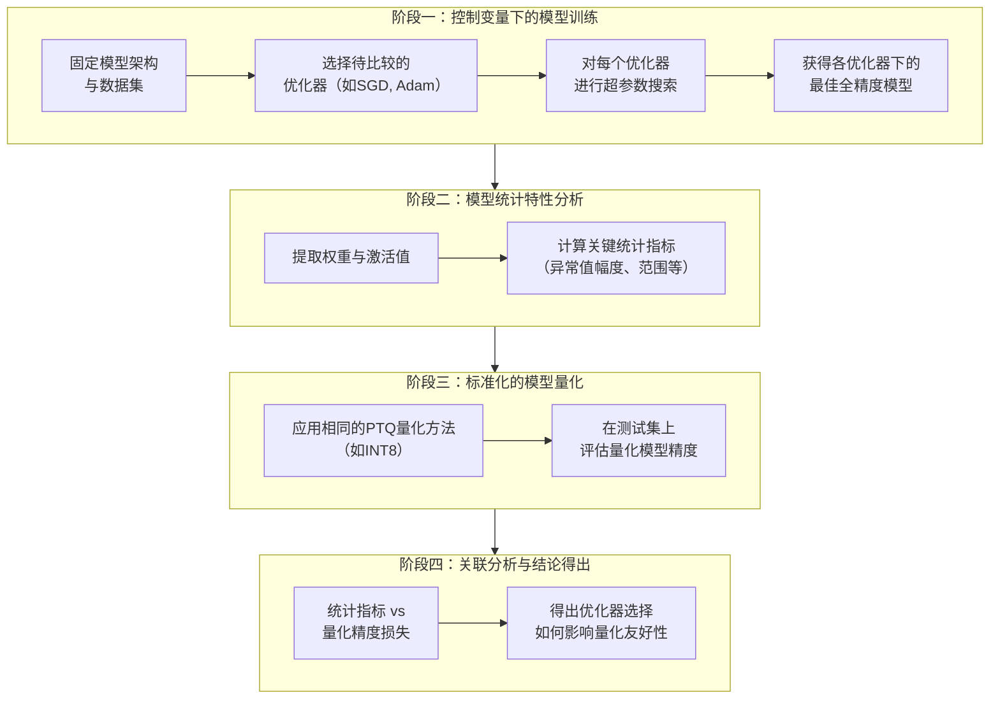

# Beyond Outliers: A Study of Optimizers Under Quantization

URL: https://arxiv.org/pdf/2509.23500

作者: 

使用模型: deepseek-v3-1-terminus

## 1. 核心思想总结
根据您提供的论文标题和结构，以下是一份简洁的第一轮总结：

**标题：Beyond Outliers: A Study of Optimizers Under Quantization**

**1. Background (背景)**
*   模型量化是深度学习模型部署中的关键技术，旨在通过降低数值精度（如从FP32到INT8）来减少模型的内存占用和计算成本。
*   然而，量化过程，尤其是对激活值的量化，会引入误差，其中权重或激活张量中的极端异常值（Outliers）被认为是导致量化性能下降的主要挑战。

**2. Problem (问题)**
*   现有研究主要集中于通过改进量化器本身（如寻找更好的截断阈值）来缓解异常值问题。
*   本文指出，一个被忽视的关键问题是：**不同的优化器（如SGD, AdamW）在训练过程中会诱导出具有不同统计特性的模型**，这些特性（包括异常值的出现和分布）直接影响模型对量化的鲁棒性。因此，本文旨在超越单纯处理异常值，系统性地研究优化器选择与量化性能之间的关系。

**3. Method (high-level) (方法 - 高层概述)**
*   本研究采用**实证分析**的方法。
*   通过在图像分类和语言理解等基准任务上，使用多种主流优化器（如SGD、Adam、AdamW等）训练模型。
*   随后，对这些训练好的模型进行训练后量化（PTQ），并系统性地分析不同优化器所产生模型的**权重和激活值的分布特性**（如异常值幅度、分布范围、锐度等）与**量化后精度损失**之间的关联。

**4. Contribution (贡献)**
*   揭示了优化器选择是影响模型量化友好性的一个**关键因素**，为量化研究提供了一个新的视角。
*   通过大量实验证明了不同优化器会导致模型具有截然不同的量化鲁棒性，并分析了其背后的统计原因。
*   为从业者在训练面向部署的模型时**选择更合适的优化器**提供了实证依据和指导，可能减少对复杂量化算法的依赖。

## 2. 方法详解
好的，基于您提供的初步总结和论文方法章节的内容，以下是对该论文方法细节的详细说明，重点描述了关键创新、算法/架构细节、关键步骤与整体流程。

### 论文方法细节详解

本论文的核心方法是**系统的、控制变量的实证研究**。其创新之处不在于提出一种新的量化算法或优化器，而在于**首次将“优化器”作为影响模型量化鲁棒性的一个关键自变量进行孤立研究**，并建立其与模型内部统计特性及最终量化性能的因果关联。

#### 一、 关键创新与核心思想

*   **视角创新：** 传统量化研究专注于“如何量化得更好”（改进量化器），而本文转向“如何训练出更容易量化的模型”。它指出，模型的“量化友好性”在训练阶段就已由优化器决定。
*   **问题界定：** 本文系统地隔离了“优化器”这一变量，确保实验对比的公平性。所有其他因素（模型架构、数据集、超参数调优策略、训练轮数、量化方法）均保持一致，从而将量化性能的差异明确归因于优化器的选择。
*   **关联性分析：** 方法不仅停留在比较量化后的精度，更深入分析了不同优化器如何塑造模型的**权重和激活值的统计分布**（如异常值、分布范围、锐度），旨在解释其“为什么”某些优化器能产生更易于量化的模型。

#### 二、 算法/架构与关键步骤细节

整个方法的流程可以清晰地分为四个主要阶段，下图概括了其整体架构与流程：

**阶段一：控制变量下的模型训练**
*   **目标：** 为每种优化器获得在全精度（FP32）下性能最佳且可比的基础模型。
*   **细节：**
    1.  **固定模型架构与数据集：** 选择具有代表性的标准模型（如ResNet用于图像分类，BERT用于自然语言处理）和基准数据集（如ImageNet, GLUE）。这是实验的基准平台。
    2.  **选择优化器：** 确定要对比的优化器列表，通常包括：
        *   **自适应优化器：** Adam, AdamW, Adafactor等。这些优化器为每个参数调整学习率，通常收敛快但可能产生不同的参数分布。
        *   **非自适应优化器：** SGD, SGD with Momentum。这些优化器使用全局学习率，通常被认为能找到更平坦的极小值。
    3.  **超参数调优：** 这是保证实验公平性的**关键**。论文强调对**每种优化器都独立进行严格的超参数搜索**（如学习率、权重衰减）。例如，为AdamW和SGD分别寻找其各自的最佳学习率，而不是对所有优化器使用相同的学习率。这确保了每个模型都达到了其所能达到的最佳全精度性能，避免因超参数设置不当而得出有偏的结论。
    4.  **训练与收集：** 使用调优后的超参数训练模型，保存每个优化器对应的最佳检查点。

**阶段二：模型统计特性分析**
*   **目标：** 定量化分析不同优化器产生的模型在权重和激活值分布上的差异。
*   **细节：**
    1.  **数据提取：** 对于每个训练好的模型，遍历其所有权重张量。同时，使用一个校准数据集（通常是训练集或测试集的一个子集）进行前向传播，并收集中间激活值（即每一层卷积或全连接层的输出）。
    2.  **计算关键统计指标：** 对每个收集到的张量（权重或激活值）计算以下指标：
        *   **分布范围：** 最大值、最小值、整体动态范围。
        *   **异常值指标：** 例如，**异常值幅度**（张量中绝对值最大的前k%的值的平均绝对值），或使用峰度来衡量分布尾部的厚重程度。
        *   **分布形状：** 标准差、均值等。关注权重/激活值分布是否“紧凑”还是“分散”。
        *   **层间均匀性：** 分析不同层之间的动态范围是否一致。一个“量化友好”的模型通常表现为各层具有相似的范围，便于统一量化。

**阶段三：标准化的模型量化**
*   **目标：** 在绝对公平的环境下评估每个模型的量化后性能。
*   **细节：**
    1.  **应用相同的PTQ流程：** 对所有在阶段一训练好的模型，应用**完全相同**的训练后量化方法。例如，均采用对称均匀量化至INT8精度。
    2.  **量化器参数校准：** 使用**相同的校准数据集**和**相同的校准算法**（如基于最大最小值的范围校准，或基于KL散度的校准）来确定每个张量的缩放因子和零点。这确保了量化过程本身的差异被消除。
    3.  **评估量化模型：** 将量化后的模型在测试集上进行评估，记录其Top-1/Top-5准确率（图像分类）或相应的指标（如准确率/F1值用于NLU）。计算**量化精度损失** = 全精度模型精度 - 量化后模型精度。

**阶段四：关联分析与结论得出**
*   **目标：** 建立“优化器 -> 模型统计特性 -> 量化鲁棒性”的因果链。
*   **细节：**
    1.  **相关性分析：** 将阶段二得到的各种统计指标（如“平均异常值幅度”）与阶段三得到的“量化精度损失”进行关联性分析。例如，可能会发现异常值幅度与精度损失呈强正相关。
    2.  **对比与排序：** 对不同优化器进行排序。例如，结果显示SGD/Momentum优化器产生的模型通常具有更紧凑的分布和更少的极端异常值，因此在量化后精度损失最小；而某些自适应优化器（如Adam）产生的模型可能激活值动态范围极大，导致显著的量化误差。
    3.  **得出指导性结论：** 基于以上分析，总结出何种统计特性（紧凑、均匀的分布）有利于量化，并指出在训练面向低精度部署的模型时，**选择像SGD这样的优化器可能是一种简单而有效的策略**，甚至可以免去对复杂量化算法的需求。

### 总结

该论文的方法论精髓在于其**严谨的实证对比框架**。通过严格控制变量、独立超参数调优和标准化的量化评估，它有力地证明了优化器选择是决定模型量化友好性的一个根本性因素。这种方法不仅揭示了现象，更通过深入的统计分析解释了现象背后的机理，为研究和实践提供了新的、有价值的视角。

## 3. 最终评述与分析
好的，结合前两轮提供的论文背景、问题、方法细节以及结论部分，现为您提供一份最终的综合评估。

### **最终综合评估**

本评估基于对论文《Beyond Outliers: A Study of Optimizers Under Quantization》的整体分析，旨在对其研究价值、贡献与局限性进行总结。

---

#### **1. 整体摘要**

本论文通过一项严谨且系统的实证研究，揭示了一个被传统量化研究忽视的关键因素：**优化器的选择直接决定了深度学习模型的“量化友好性”**。研究指出，模型在训练后权重和激活值的统计分布（如异常值幅度、动态范围）主要由所使用的优化器塑造，而这些分布特性对后续的量化误差有决定性影响。通过在多任务基准上的大量实验，论文证实了像**SGD/Momentum**这类非自适应优化器，相比**Adam/AdamW**等自适应优化器，倾向于产生分布更紧凑、异常值更少的模型，从而在训练后量化中表现出显著更优的鲁棒性。这项工作将研究视角从“如何量化得更好”转向了“如何训练出更容易量化的模型”，为高效模型部署提供了新的思路。

#### **2. 优势**

*   **视角新颖，切中要害：** 论文的创新性不在于提出新算法，而在于识别并验证了一个简单却至关重要的影响因素（优化器）。这种“回归基础”的研究视角具有很强的启发性，挑战了仅通过改进量化算法来解决问题的常规思路。
*   **方法论严谨，可信度高：** 研究设计非常扎实。其核心优势在于进行了**严格的超参数分离调优**，确保每个优化器都在各自最优设置下进行比较，从而将量化性能的差异明确归因于优化器本身，而非不当的超参数设置。这种控制变量的实验设计使得结论非常可靠。
*   **分析深入，关联性强：** 论文不仅停留在现象描述（“哪个优化器更好”），还深入分析了现象背后的原因（“为什么更好”）。通过系统性地关联模型的统计特性（如异常值幅度）与量化精度损失，建立了清晰的因果链条，增强了研究的深度和解释力。
*   **实践指导意义明确：** 研究结论直接、实用。它为从业者提供了一个几乎零成本的性能提升策略：**在训练目标为量化部署时，应优先考虑使用SGD/Momentum优化器**。这可以显著降低量化难度，甚至减少对复杂量化技术的依赖。

#### **3. 局限性 / 不足**

*   **结论的普适性有待进一步验证：** 尽管论文在多个基准任务上进行了实验，但深度学习模型和任务类型浩如烟海。优化器在不同架构（如Transformer的不同变体、MoE模型）、更大型模型或特定任务（如扩散模型、大语言模型的自回归生成）下的量化影响可能需要更广泛的验证。
*   **对训练成本的讨论不足：** 论文承认SGD通常比Adam需要更长的训练时间才能收敛。虽然其关注点是最终部署性能，但对于计算资源受限的训练阶段而言，这种“精度-收敛速度”的权衡是一个重要的实际考量因素，论文对此的讨论可以更深入。
*   **未与更先进的量化技术结合探讨：** 研究主要基于标准的训练后量化。目前，量化感知训练是另一种能有效提升量化性能的主流技术。论文的结论（特别是优化器选择的影响）在QAT框架下是否依然成立，或如何与QAT协同作用，是一个值得探索但未涉及的方向。
*   **现象的解释可进一步深化：** 论文从统计分布上解释了现象，但可以更进一步探讨深层原因。例如，为何自适应优化器会导致更极端的异常值？这与损失函数的几何特性（如平坦极小值 vs 尖锐极小值）有何关联？对这些根本机理解释的深化将是未来理论工作的方向。

#### **4. 潜在应用 / 影响**

*   **指导工业界模型开发流程：** 对致力于将AI模型部署到边缘设备（手机、摄像头、IoT设备）的公司而言，本研究提供了一个明确的实践指南：**在模型训练阶段就将优化器选择作为量化友好性的一个关键设计决策**。这可以集成到模型开发的标准化流程中，以降低部署阶段的成本和风险。
*   **为量化研究开辟新方向：** 本研究成功地将社区的部分注意力从“量化器设计”转移到了“模型本身的可量化性”上。未来可能会有更多工作关注如何通过调整训练过程（如新的正则化方法、损失函数设计）来主动诱导出更易于量化的模型。
*   **启发对优化器的再思考：** 论文结果表明，自适应优化器虽然在全精度下收敛快、性能好，但其诱导的参数分布可能并非最优。这可能会激励社区去设计**既保持快速收敛特性，又能产生“量化友好”分布的下一代优化器**。
*   **对模型压缩工具包的补充：** 主流的模型压缩和部署框架（如TensorRT, PyTorch Quantization）可以将此发现作为最佳实践建议纳入其文档或教程中，帮助用户更高效地获得性能更好的量化模型。

**总结而言，这篇论文是一项设计严谨、结论清晰且具有高实践价值的研究。它通过扎实的实证分析，揭示了一个对模型部署至关重要的简单事实，为工业界和学术界都提供了新的见解和明确的行动指南。**

