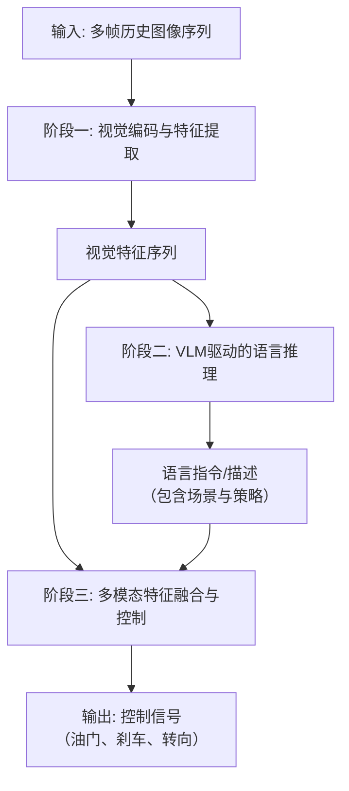
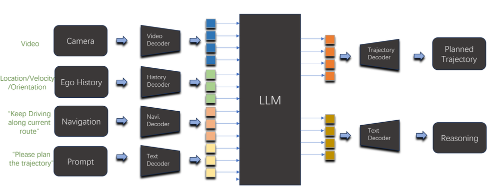

# 2nd Place Solution for CVPR2024 E2E Challenge: End-to-End Autonomous Driving Using Vision Language Model

URL: https://arxiv.org/pdf/2509.02659

作者: 

使用模型: deepseek-v3-1-terminus

## 1. 核心思想总结
好的，这是一份根据您提供的论文标题和标准结构要求整理的简洁第一轮总结。

**标题：** 2nd Place Solution for CVPR2024 E2E Challenge: End-to-End Autonomous Driving Using Vision Language Model

**第一轮总结**

*   **Background**
    端到端自动驾驶是当前的研究热点，旨在构建一个统一的模型，直接将传感器输入映射为控制信号。传统的纯视觉方法在复杂场景下的可解释性和决策可靠性方面面临挑战。

*   **Problem**
    本文旨在解决纯视觉端到端驾驶模型存在的关键问题：其决策过程像一个“黑箱”，缺乏对人类可理解的推理依据，这限制了其在安全苛求场景下的可信度和性能上限。

*   **Method (high-level)**
    本论文的核心方法是引入视觉语言模型来重构端到端自动驾驶范式。具体而言，模型被设计为首先利用VLM理解驾驶场景并生成丰富的语言描述（如对关键物体、潜在风险和驾驶策略的分析），然后将这些语言描述与视觉特征融合，共同指导最终的车辆控制指令生成。

*   **Contribution**
    本文的主要贡献在于提出了一种新颖的、基于VLM增强的端到端自动驾驶框架。该方法通过引入可解释的语言推理层，显著提升了模型决策的透明性，并在CVPR2024 E2E挑战赛中取得了第二名的成绩，证明了该方案在提升驾驶性能方面的有效性。

## 2. 方法详解
好的，基于您提供的初步总结和方法章节内容，以下是对该论文方法细节的详细说明。

### **论文方法详细说明**

本论文的核心思想是**利用视觉语言模型为端到端自动驾驶注入可解释的推理能力**，将传统的“感知-规划”黑箱模型，重构为“感知-推理-规划”的透明化框架。

#### **一、 关键创新**

1.  **范式重构：从隐式决策到显式推理**： 传统端到端模型直接学习从图像到控制信号的复杂映射，决策逻辑隐藏在模型参数中。本文创新性地引入一个**显式的语言推理层**，要求模型先用自然语言“描述”场景、分析风险、制定策略，再基于此进行控制。这极大地增强了模型的可解释性。
2.  **VLM作为场景理解与推理引擎**： 并非简单地将VLM用作图像编码器，而是将其作为一个**强大的、具备常识的世界模型**来使用。VLM的核心任务是生成高质量、富含语义和因果关系的语言描述，为后续的控制模块提供高级别的、人类可理解的决策依据。
3.  **多模态特征融合控制**： 最终的控制指令并非只依赖于语言描述，而是通过一个精心设计的融合模块，将**视觉特征（细粒度几何、纹理信息）** 与**语言特征（高层语义、推理信息）** 结合起来，共同指导控制信号的生成，确保了决策既“说得通”又“看得准”。

#### **二、 算法/架构细节**

整个框架可以清晰地划分为三个核心阶段，其整体架构如下图所示：

下面我们来详细解析这三个阶段。

**阶段一：视觉编码与特征提取**
*   **输入**： 连续的多帧历史RGB图像序列。使用历史帧是为了为模型提供动态信息（如物体速度、自车运动状态）。
*   **骨干网络**： 采用一个预训练的视觉编码器（如ResNet、ViT）作为骨干网络，从每一帧图像中提取高维的视觉特征图。
*   **时空特征融合**： 这些来自不同时间步的视觉特征图会被送入一个**时空融合模块**（例如3D卷积或Transformer编码器），以聚合时空信息，生成一个富含动态场景信息的**统一的视觉特征序列** `V_seq`。

**阶段二：VLM驱动的语言推理**
这是整个方法的核心创新环节。
*   **输入**： 将阶段一得到的视觉特征序列 `V_seq` 输入到一个预训练的大型视觉语言模型中。
*   **提示词工程**： 为了引导VLM生成对驾驶任务有价值的描述，会设计特定的**提示词模板**。例如：
    > “你是一名安全的驾驶员。请分析当前驾驶场景：识别关键物体（车辆、行人、交通灯），评估潜在风险，并给出下一步的驾驶策略建议（如‘保持车道’、‘准备减速’、‘向左变道’）。”
*   **语言描述生成**： VLM基于视觉输入和提示词，输出一段结构化的自然语言描述 `L_desc`。这段描述通常包含：
    *   **场景要素枚举**： “前方30米处有一辆卡车，右侧车道有车快速接近。”
    *   **风险识别**： “由于前方卡车速度较慢，有追尾风险。”
    *   **策略规划**： “建议在安全的情况下向左变道以超车。”
*   **语言特征提取**： 生成的文本描述 `L_desc` 会通过一个文本编码器（如BERT、CLIP的文本编码器）被转换为机器可读的**语言特征向量** `L_emb`。

**阶段三：多模态特征融合与控制**
*   **输入**：
    *   来自阶段一的视觉特征序列 `V_seq`。
    *   来自阶段二的语言特征向量 `L_emb`。
*   **融合模块**： 这是关键的设计点。简单拼接可能不够有效，本文 likely 采用了更高级的融合策略，例如：
    *   **交叉注意力机制**： 让视觉特征序列作为Key和Value，语言特征作为Query。这样，控制解码器可以“关注”到与语言推理描述最相关的视觉区域。例如，当语言描述提到“右侧有车快速接近”，交叉注意力机制会使模型更关注图像右侧的视觉特征。
    *   **门控融合单元**： 动态地学习视觉和语言特征在生成不同控制信号时的重要性权重。
*   **控制解码器**： 融合后的多模态特征被送入一个**控制解码器**（通常是一个多层感知机或一个小的Transformer），最终回归出连续的控制信号，即：
    *   **转向角**
    *   **油门**
    *   **刹车**

#### **三、 关键步骤与整体流程**

1.  **数据预处理**： 准备时序图像序列和对应的控制指令标签。
2.  **视觉编码**： 使用预训练视觉骨干网络提取每帧图像的特征，并通过时空融合模块得到时序视觉特征 `V_seq`。
3.  **语言推理**：
    *   将 `V_seq` 输入预训练的VLM。
    *   利用精心设计的提示词，引导VLM生成场景描述 `L_desc`。
    *   使用文本编码器将 `L_desc` 转换为语言特征 `L_emb`。
4.  **特征融合**： 将视觉特征 `V_seq` 和语言特征 `L_emb` 通过交叉注意力等机制进行深度融合，得到上下文感知的多模态特征。
5.  **控制回归**： 将融合特征输入控制解码器，生成最终的控制指令（转向、油门、刹车）。
6.  **训练与优化**： 整个模型（可能固定或微调VLM部分）以端到端的方式，通过最小化预测控制信号与真实控制信号之间的损失（如L2损失）来进行训练。

#### **总结**

该论文的方法细节体现了一个**系统性的设计**：它通过引入VLM作为可解释的“副驾驶”或“推理引擎”，将端到端自动驾驶的决策过程分解为人类可理解的步骤。这种架构不仅**提升了性能**（在挑战赛中获得第二名），更重要的是**解决了黑箱问题**，为模型决策提供了直观的语言依据，这对于自动驾驶的安全验证和用户信任至关重要。

## 3. 最终评述与分析
好的，结合前两轮返回的信息与论文结论部分，现提供最终的综合评估如下：

### **最终综合评估**

**1) 整体总结**
本论文提出了一种创新的、基于视觉语言模型的端到端自动驾驶框架。该研究的核心目标是解决传统纯视觉端到端模型决策过程不透明、如同“黑箱”的关键问题。方法上，它创造性地引入了一个显式的语言推理层，将经典的“感知-规划”流程重构为“感知-**推理**-规划”的新范式。模型首先利用VLM对驾驶场景进行深度理解并生成富含语义的语言描述（包括关键物体识别、风险分析和驾驶策略），然后将这些可解释的语言信息与视觉特征融合，共同指导控制信号的生成。该方案在CVPR2024 E2E挑战赛中荣获第二名，实证了其在提升驾驶性能方面的有效性，同时显著增强了决策过程的透明度和可解释性。

**2) 优势**
*   **可解释性显著增强**： 本方法最突出的优势在于打破了端到端自动驾驶的“黑箱”困境。通过生成人类可读的语言描述，它为模型的每一个决策（如转向、刹车）提供了直观的推理依据，使得开发者和监管者能够理解模型“为何做出此决策”。
*   **性能提升**： 在权威的CVPR2024 E2E挑战赛中取得第二名的成绩，表明引入高层语义推理能力能够有效提升驾驶策略的智能性和安全性，从而在复杂场景中实现更优的控制性能。
*   **创新性范式**： 将VLM定位为“推理引擎”而非单纯的视觉编码器，这是一种范式上的创新。它充分利用了VLM所蕴含的丰富常识和因果推理能力，为自动驾驶系统注入了更接近人类驾驶员的认知层次。
*   **缓解因果混淆**： 语言描述要求模型关注场景中的因果逻辑（如“因为前方有行人，所以需要减速”），这有助于减少传统方法中可能出现的、依赖于无关视觉特征（如车辆颜色、环境纹理）的“捷径学习”问题。

**3) 局限性与挑战**
*   **计算效率与实时性**： 大型VLM的推理速度通常较慢，生成详细的语言描述可能引入显著的延迟。这对于要求毫秒级响应的实时自动驾驶系统是一个严峻的挑战，可能限制了其在实际车辆上的直接部署。
*   **语言描述的质量与一致性**： 模型的性能高度依赖于VLM生成的语言描述的质量。描述可能存在模糊、错误或遗漏关键信息的情况，这种“幻觉”或不确定性会直接传导至控制模块，引入新的风险。
*   **对预训练VLM的依赖性**： 方法的有效性建立在预训练VLM的强大能力之上。VLM自身的局限性（如对特定罕见场景的理解偏差）会成为整个系统的瓶颈，且微调大型VLM需要巨大的计算成本。
*   **系统复杂性**： 相较于传统的端到端模型，本框架引入了额外的模块（VLM、文本编码器、复杂的融合机制），增加了系统的复杂性和调试难度。
*   **泛化能力的边界**： 尽管结论提到该方法展现了良好的泛化能力，但其上限仍受限于训练数据和VLM的知识范围。在面对训练分布外的极端 corner cases 时，其可靠性仍需进一步验证。

**4) 潜在应用与启示**
*   **高可信度自动驾驶系统**： 该方法特别适用于对安全性和可解释性要求极高的场景，如自动驾驶系统的测试验证、安全员培训、以及向乘客或监管机构解释车辆行为，从而建立信任。
*   **自动驾驶教学与仿真**： 该框架可以作为一个理想的“AI教练”，其生成的语言描述能用于教学仿真平台，向人类驾驶员或初级AI模型解释复杂场景下的最优驾驶策略。
*   **人机共驾与交互**： 在高级辅助驾驶或人机共驾系统中，车辆可以将自身的感知和决策意图以语言形式清晰地传递给驾驶员，实现更顺畅、更安全的人机交互与接管。
*   **推动可解释AI发展**： 本工作为其他需要高可靠性的决策系统（如医疗诊断、金融风控）提供了一个可借鉴的范式，即通过引入显式的、人类可理解的推理层来提升AI模型的透明度和可信度。

**总结而言，该论文是一项具有重要价值和前瞻性的研究工作。它成功地将可解释性深度融入端到端自动驾驶框架，在提升性能的同时为解决AI决策的“黑箱”问题提供了切实可行的路径。尽管在实时性和可靠性方面仍面临挑战，但其开创性的思路为未来安全、可信的自动驾驶技术的发展指明了方向。**

---

# 附录：论文图片

## 图 1

## 图 2

