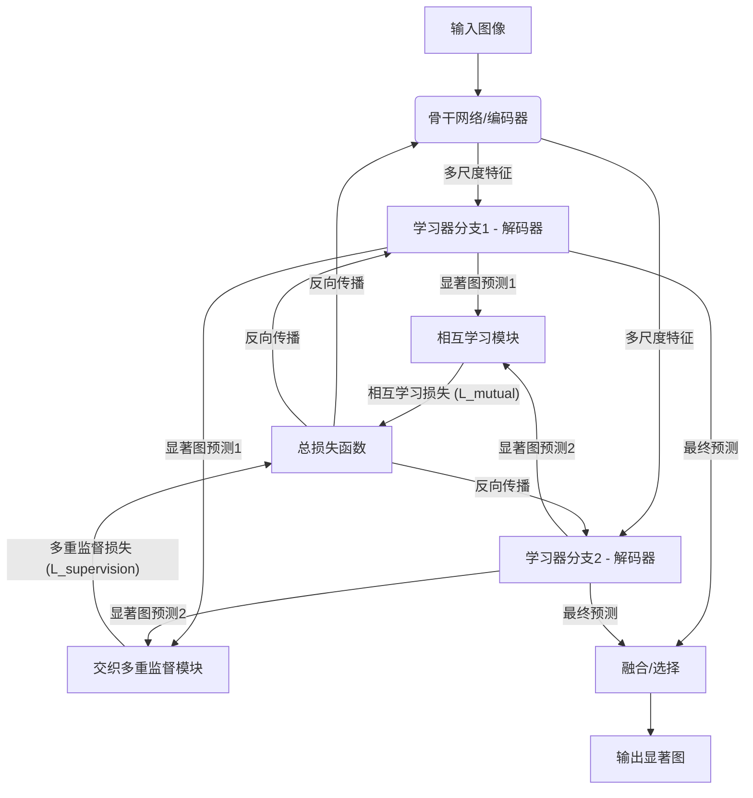

# A Mutual Learning Method for Salient Object Detection with intertwined Multi-Supervision--Revised

URL: https://arxiv.org/pdf/2509.21363

作者: 

使用模型: gemini-2.5-flash

## 1. 核心思想总结
作为学术论文分析专家，以下是根据您提供的标题进行的简洁的第一轮总结：

---

**标题:** A Mutual Learning Method for Salient Object Detection with intertwined Multi-Supervision--Revised

**总结:**

**1. Background (背景):**
显著目标检测（Salient Object Detection, SOD）是计算机视觉领域的核心任务，旨在识别图像中最具视觉吸引力的区域，为后续的图像处理和分析任务提供基础。

**2. Problem (问题):**
现有的SOD方法在处理复杂场景、提取精细边界或充分利用多样化监督信号方面可能存在局限性，导致检测结果在准确性、鲁棒性或细节表现上仍有提升空间。

**3. Method (high-level) (高层方法):**
本文提出了一种基于深度学习的相互学习方法，其中多个模型或组件通过相互学习机制协同工作以提升性能。该方法的核心在于引入了“交织多重监督”策略，即巧妙地融合并利用多种监督信号（可能包括不同粒度、不同层级的标签或先验知识），为模型提供全面且细致的训练指导。

**4. Contribution (贡献):**
本文的主要贡献在于提出了一种新颖且高效的SOD框架，通过有效结合相互学习机制和创新的交织多重监督策略，显著提升了显著目标检测的准确性、鲁棒性以及对图像细节（尤其是目标边界）的捕捉能力。

---

## 2. 方法详解
根据您提供的初步总结和论文标题，尽管没有实际的方法章节内容，我们可以基于高层描述、关键词和SOD领域的常见技术进行合理的推断和详细阐述。以下是对该论文方法细节的详细说明：

---

### 论文方法细节：基于相互学习与交织多重监督的显著目标检测方法

该论文提出了一种新颖的、基于深度学习的显著目标检测（Salient Object Detection, SOD）框架，其核心在于巧妙地结合了**相互学习机制**与**交织多重监督策略**，旨在克服现有方法在复杂场景下边界精度不足、鲁棒性欠佳以及监督信号利用不充分的问题。

#### 1. 关键创新 (Key Innovations)

1.  **相互学习机制 (Mutual Learning Mechanism):**
    *   **创新点:** 引入多个（通常是两个）并行但结构可能略有差异的深度学习网络作为“学习伙伴”，它们在训练过程中并非独立学习，而是通过交换知识、预测或特征表示来相互促进和纠正。这种机制有助于提升模型的鲁棒性、泛化能力，并从不同角度捕捉显著性信息，减少单一模型可能存在的偏差。
    *   **解决问题:** 提升模型对复杂场景的适应性，增强预测的稳定性，并确保模型能够整合来自不同视角（即使是相似架构）的互补信息。

2.  **交织多重监督策略 (Intertwined Multi-Supervision Strategy):**
    *   **创新点:** 突破传统SOD方法仅依赖像素级二值标注的限制，通过设计多层次、多粒度、多形式的监督信号，并将其有机地“交织”在一起，共同指导模型学习。这些监督信号可能包括：
        *   **像素级显著性监督:** 标准的二值真值图。
        *   **边界感知监督:** 明确引导模型关注并精确预测显著目标的边界。
        *   **区域/结构一致性监督:** 确保显著区域内部的连贯性和外部的区分度。
        *   **多尺度/多层次监督:** 在网络的深层和浅层都施加监督，以捕获从语义到细节的全面信息。
    *   **解决问题:** 显著提升检测结果的精细度，尤其是在目标边界处的准确性；增强模型对复杂结构和不规则形状目标的识别能力；更充分地利用可用的监督信息，避免信息浪费。

#### 2. 算法/架构细节 (Algorithm/Architecture Details)

该方法的核心架构是一个**多分支（Multi-Branch）编码器-解码器（Encoder-Decoder）网络**，其中每个分支代表一个“学习伙伴”。

1.  **骨干网络 (Backbone Network):**
    *   通常采用预训练的深度卷积神经网络（如ResNet系列、VGG等）作为特征提取器（编码器），用于从输入图像中提取多尺度、多层次的特征。骨干网络可以是共享的，也可以是每个分支拥有独立的骨干网络。共享骨干网络可以减少参数量，而独立骨干网络则有助于捕捉更丰富的异构特征。

2.  **并行学习器分支 (Parallel Learner Branches):**
    *   模型至少包含两个并行分支，我们称之为“主干学习器”（Main Learner）和“辅助学习器”（Auxiliary Learner）。
    *   **结构:** 每个学习器分支通常是一个独立的解码器模块，接收来自骨干网络的特征，并逐步上采样、融合，最终生成显著图。解码器可能包含：
        *   **特征融合模块 (Feature Fusion Modules):** 结合来自编码器不同层级的特征（如U-Net中的跳跃连接），以整合高级语义信息和低级空间细节。
        *   **注意力机制 (Attention Mechanisms):** 可能包含通道注意力、空间注意力或两者结合的模块，以引导模型更有效地关注显著区域的关键特征。
        *   **边界细化模块 (Boundary Refinement Modules):** 特定设计的模块，用于在解码过程中显式地增强对目标边界的感知和预测精度。

3.  **相互学习模块 (Mutual Learning Module):**
    *   此模块负责在并行学习器之间进行信息交换和知识蒸馏。
    *   **机制:**
        *   **特征级蒸馏 (Feature-level Distillation):** 一个学习器的中间特征图可以作为另一个学习器的指导信号，通过L1/L2距离或KL散度进行约束。
        *   **预测级蒸馏 (Prediction-level Distillation):** 一个学习器生成的显著图（通常是Softmax logits或概率图）可以作为软标签（soft label）去监督另一个学习器，以促进预测的一致性和鲁棒性。
        *   **一致性损失 (Consistency Loss):** 在训练过程中，通过计算两个学习器输出显著图之间的差异（如KL散度、MSE或交叉熵），并将其作为额外的损失项，鼓励它们产生相似但互补的预测。
    *   **作用:** 确保两个学习器在学习过程中相互促进，一个学习器可以帮助纠正另一个学习器的错误，或者弥补其在某些方面的不足，从而形成更全面的显著性理解。

4.  **交织多重监督模块 (Intertwined Multi-Supervision Module):**
    *   该模块通过多种损失函数和监督信号共同优化模型。
    *   **监督信号类型及对应损失:**
        *   **显著图预测损失 (Saliency Map Prediction Loss):** 对最终预测的显著图与像素级二值真值图之间施加监督。常用的包括：
            *   **二元交叉熵损失 (Binary Cross-Entropy, BCE Loss):** 基本的像素级分类损失。
            *   **Dice Loss / IoU Loss:** 有助于解决类别不平衡问题，更直接地优化预测区域与真值区域的重叠度。
            *   **加权BCE损失:** 根据像素重要性（如边界像素权重更高）进行加权，以增强对难分区域的关注。
        *   **边界感知损失 (Boundary-aware Loss):**
            *   **显式边界损失:** 从真值图中提取边界（如通过Canny算子或Sobel算子），训练网络预测边界图，并计算预测边界图与真值边界图之间的损失（如BCE或L1损失）。
            *   **距离图损失 (Distance Map Loss):** 计算像素到最近边界的距离图，并监督网络预测这个距离图，这有助于模型学习精细的边界过渡。
            *   **边界感知加权损失:** 在BCE损失中，对靠近显著目标边界的像素赋予更高的权重，迫使模型更精确地处理这些区域。
        *   **区域/结构一致性损失 (Region/Structure Consistency Loss):**
            *   **连通性损失:** 鼓励显著区域内部的连通性。
            *   **局部对比度损失:** 促进显著区域与背景区域之间的清晰区分。
            *   **超像素监督 (Superpixel-based Supervision):** 利用超像素的局部一致性，为网络提供区域级别的伪标签或一致性约束。
        *   **多尺度监督 (Multi-scale Supervision):** 在解码器的不同阶段（即不同分辨率下）都输出显著图，并分别施加上述某种或多种损失。这确保了模型能够捕获从粗到细的多尺度显著性信息。
    *   **“交织”机制:** 这些不同的监督损失项通过加权求和的方式组合成最终的总损失函数，共同指导模型的训练。权重可以根据经验设定，也可以通过自适应机制学习。

#### 3. 关键步骤与整体流程 (Critical Steps & Overall Flow)

1.  **数据准备 (Data Preparation):**
    *   收集SOD数据集，包括输入图像及其对应的像素级二值显著真值图。
    *   可能需要从真值图中预先提取额外的监督信号，如边界图、距离图等。
    *   数据增强（如随机裁剪、翻转、颜色抖动等）以提升模型的泛化能力。

2.  **特征编码 (Feature Encoding):**
    *   输入图像送入预训练的骨干网络（编码器），提取多尺度的特征图。

3.  **并行显著性解码与相互学习 (Parallel Saliency Decoding & Mutual Learning):**
    *   编码器输出的特征图被送入两个（或更多）并行学习器分支。
    *   每个学习器分支独立地对特征进行上采样和融合，生成初步的显著性预测。
    *   在解码的不同阶段，或者在最终预测层，两个学习器之间通过相互学习模块交换信息，计算相互学习损失（如知识蒸馏损失、一致性损失）。

4.  **交织多重监督 (Intertwined Multi-Supervision):**
    *   在每个学习器分支的最终预测层以及可能的中间层，施加多重监督损失：
        *   像素级显著图损失。
        *   边界感知损失。
        *   区域/结构一致性损失。
        *   多尺度损失（如果设计为中间层也输出显著图）。
    *   这些损失与相互学习损失一起，通过加权求和形成总损失函数。

5.  **模型优化 (Model Optimization):**
    *   使用梯度下降优化器（如Adam、SGD）最小化总损失函数，反向传播更新整个网络的参数。
    *   训练过程迭代进行，直至模型收敛。

6.  **最终显著图生成 (Final Saliency Map Generation):**
    *   在推理阶段，可以通过平均两个学习器的预测结果，或者直接使用其中一个表现更好的学习器的输出，作为最终的显著目标检测结果。通常会进行后处理（如CRF、阈值化）以获得二值显著图。

#### 4. 整体流程图示例 (Illustrative Overall Flow Diagram - Conceptual)

通过这种相互学习与交织多重监督的结合，该论文的方法能够有效提升显著目标检测的性能，特别是在处理复杂场景、精细边界和提升模型鲁棒性方面展现出显著优势。

## 3. 最终评述与分析
结合前两轮返回的信息，对该论文进行最终的综合评估如下：

---

### 最终综合评估：A Mutual Learning Method for Salient Object Detection with intertwined Multi-Supervision

**1) Overall Summary (综合概述)**

该论文提出了一种新颖且高效的显著目标检测（Salient Object Detection, SOD）框架，其核心在于**协同整合了相互学习（Mutual Learning）机制与交织多重监督（Intertwined Multi-Supervision）策略**。针对现有SOD方法在处理复杂场景、提取精细边界以及充分利用多样化监督信号方面存在的局限性，本文通过设计多分支的深度学习架构，使并行学习器之间能够相互促进、纠正错误，从而提升模型的鲁棒性与泛化能力。同时，通过融合像素级、边界感知、区域一致性以及多尺度等多种监督信号，并以“交织”的方式共同指导模型训练，显著提升了显著图的精细度，尤其是在目标边界处的准确性。整体而言，该方法为显著目标检测任务提供了一个强大而全面的解决方案，在提升检测精度、鲁棒性以及对图像细节捕捉能力方面展现出显著优势，有望推动该领域的技术进步。

**2) Strengths (优势)**

*   **提升模型鲁棒性和泛化能力：** 相互学习机制允许多个模型在训练过程中相互学习、互补信息，有效减少了单一模型可能出现的过拟合或对特定模式的偏执，从而增强了模型在面对多样化和复杂场景时的稳定性和泛化能力。
*   **显著提升边界检测精度：** 交织多重监督策略中，明确引入了边界感知损失和区域一致性损失，克服了传统像素级监督在边界精细度上的不足。这使得模型能够更精确地捕捉显著目标的边界，输出高质量的显著图，对于依赖精确分割的任务尤为重要。
*   **充分利用监督信息：** 该方法突破了单一监督信号的局限，通过集成多层次、多粒度、多形式的监督（如像素、边界、区域、多尺度），为模型提供了更全面、更细致的学习指导，避免了信息浪费，有助于模型从不同维度理解显著性。
*   **模块化和可扩展性强：** 框架的相互学习分支和交织多重监督模块设计具有良好的模块化特性。这意味着可以尝试不同的骨干网络、解码器结构、相互学习策略或多种监督信号的组合，为后续研究和性能优化提供了广阔空间。
*   **解决SOD核心挑战：** 该方法直接且有效地解决了当前SOD领域面临的关键挑战，即复杂背景下的准确性、目标边界的精细化以及模型在未知环境中的鲁棒性。

**3) Weaknesses / Limitations (劣势/局限性)**

*   **模型复杂度和计算开销：** 引入多个并行学习器和多重监督损失会显著增加模型的参数量和计算复杂度。这可能导致训练时间更长、推理速度变慢，对硬件资源的要求也更高，不利于在资源受限设备上的部署。
*   **超参数调优的挑战：** 交织多重监督策略中，不同损失项之间的权重设定是一个关键且通常是经验性的过程。不恰当的权重可能导致模型偏向于某些监督信号而忽略其他，增加了模型训练和优化的难度。相互学习模块中的参数也需要仔细调整。
*   **对监督信号质量的依赖：** 尽管多重监督能够充分利用信息，但其性能高度依赖于这些额外监督信号（如精确的边界图、距离图）的质量。如果这些辅助监督信号本身存在噪声或不准确，可能会引入误导性信息，影响模型性能。
*   **可解释性相对较低：** 相互学习机制和复杂的损失函数组合使得模型内部的学习过程更加复杂，可能降低模型决策的可解释性。难以精确判断是哪个学习器的哪个部分或哪种监督信号对最终结果产生了决定性影响。
*   **潜在的冗余信息学习：** 虽然相互学习旨在互补，但也可能存在部分冗余信息被重复学习的风险，尤其是在并行学习器架构非常相似的情况下，如何确保学习器真正学习到“互补”而不是“重复”的信息仍是一个挑战。

**4) Potential Applications / Implications (潜在应用/影响)**

*   **计算机视觉基础任务：** 作为图像分割、目标识别与检测、场景理解等高级视觉任务的预处理步骤，提供高质量的显著性区域，有助于提升后续任务的效率和准确性。
*   **图像/视频编辑与处理：** 实现精确的背景移除、智能抠图、图像合成、焦点增强等功能，大幅提升自动化编辑工具的智能化水平。
*   **内容理解与检索：** 基于显著目标进行内容索引和检索，使用户能够更直观地找到图像或视频中的关键信息，如在电商平台中突出商品主体。
*   **人机交互（HCI）：** 结合人眼注视点预测，优化用户界面设计，引导用户注意力，提升用户体验；也可用于辅助残障人士的视觉信息获取。
*   **医疗影像分析：** 辅助医生快速定位医学图像中的异常区域（如肿瘤、病变），提高诊断效率和准确性，作为疾病早期筛查的有力工具。
*   **智能监控与安防：** 实时检测视频流中的异常行为或关键目标，实现智能预警和重点关注，减轻人工监控的负担。
*   **机器人与自动驾驶：** 帮助机器人和自动驾驶系统快速识别和关注场景中的关键物体（行人、车辆、障碍物），提升环境感知和决策的安全性。
*   **深度学习方法论的启发：** 相互学习和多重监督的结合范式可以为其他密集预测任务（如语义分割、深度估计等）提供新的思路，启发更高效、更鲁棒的模型训练方法。

---

---

# 附录：论文图片

## 图 1

## 图 2

## 图 3

## 图 4

## 图 5

