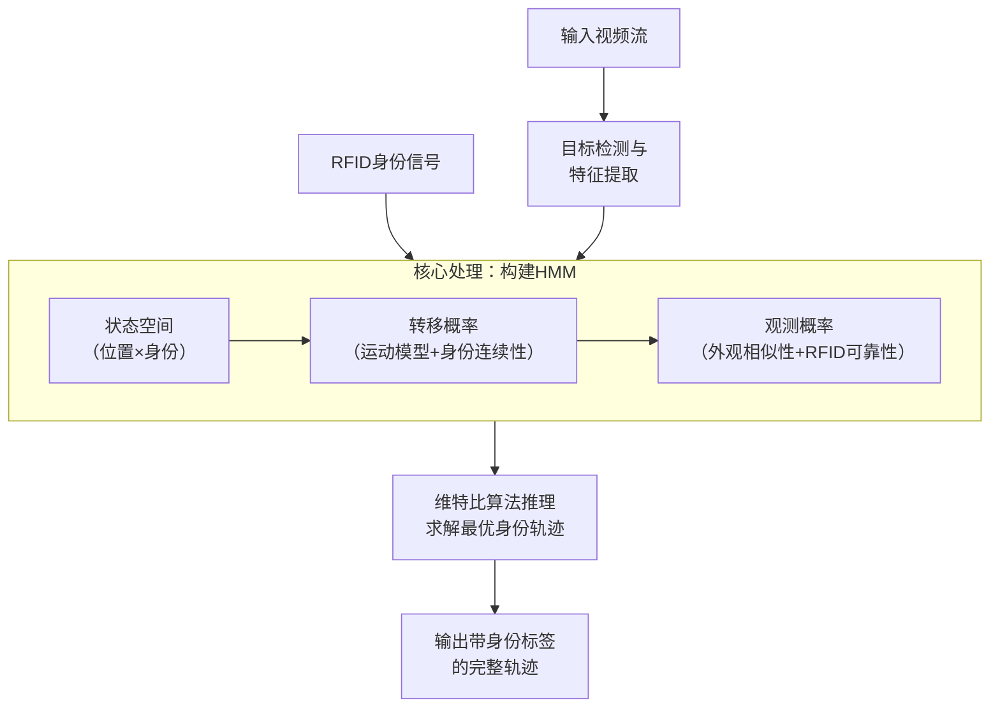
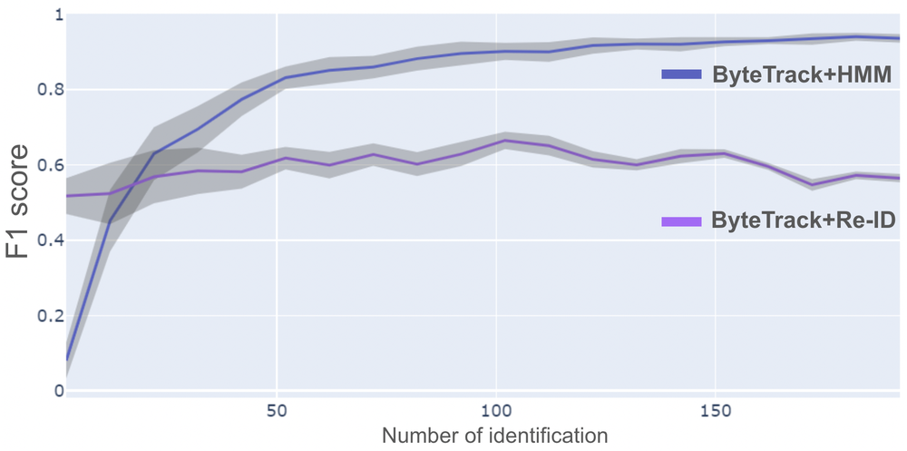
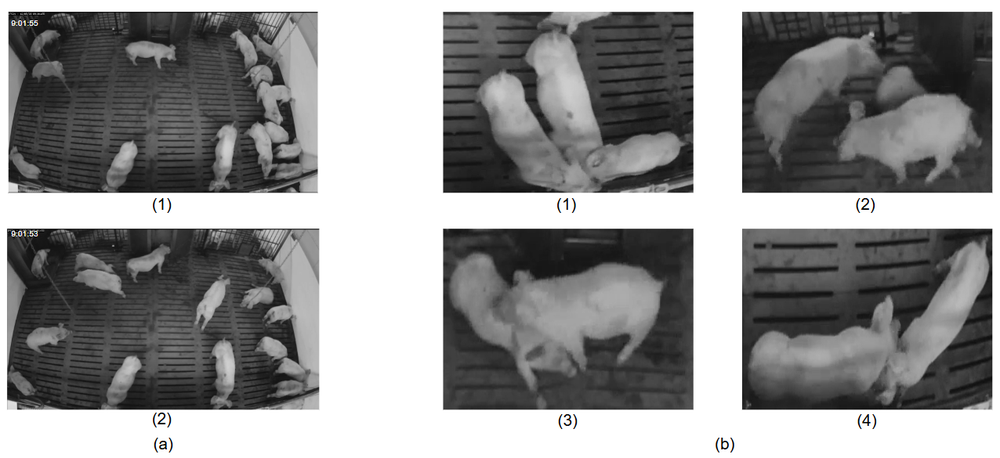
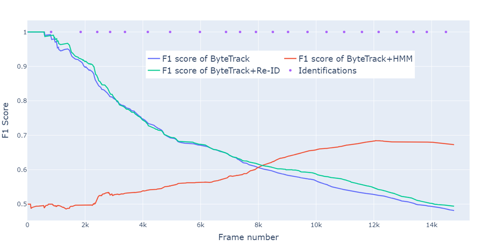
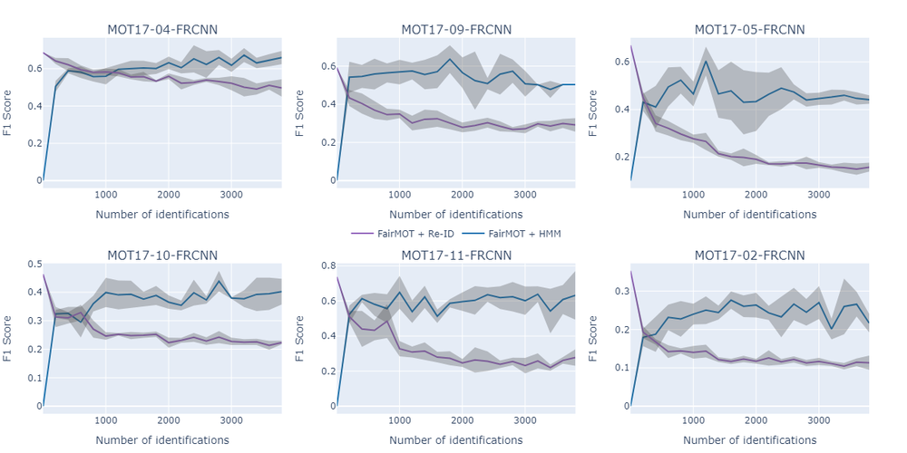
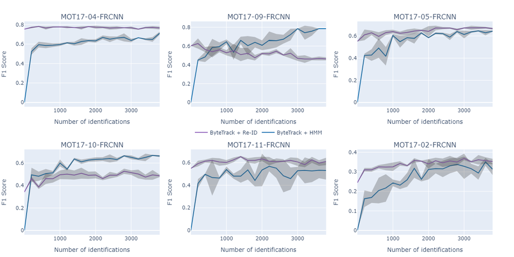
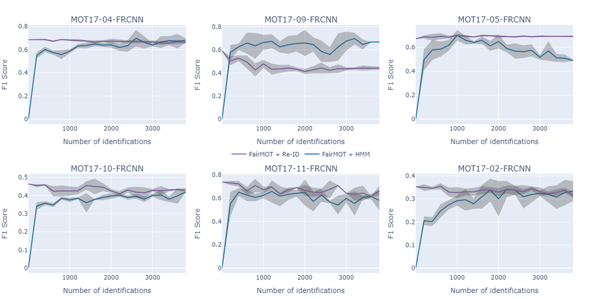
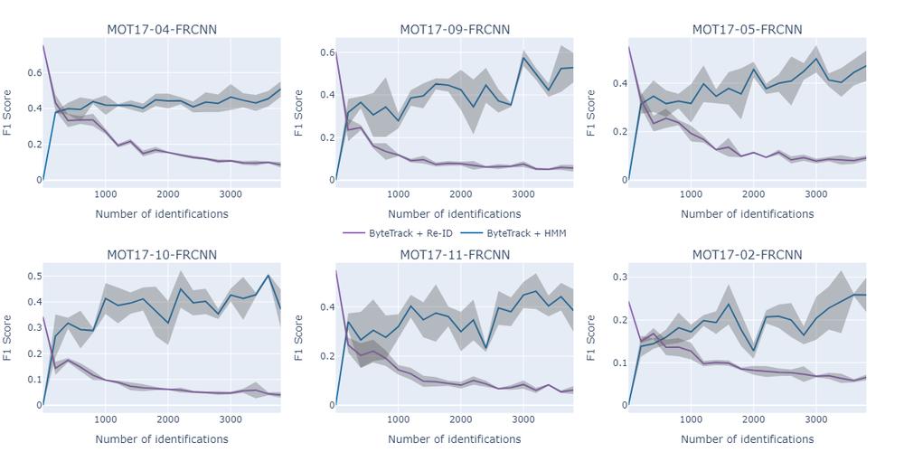

# An HMM-based framework for identity-aware long-term multi-object tracking from sparse and uncertain identification: use case on long-term tracking in livestock

URL: https://arxiv.org/pdf/2509.09962

作者: 

使用模型: deepseek-v3-1-terminus

## 1. 核心思想总结
根据您提供的论文标题和摘要（摘要内容未提供，此处基于标题和典型论文结构推断），以下是对该论文的第一轮简洁总结：

**1. Background (研究背景)**
在计算机视觉领域，多目标跟踪技术已相对成熟，但在复杂、长期的现实场景中（如畜牧业），仍面临巨大挑战。这些挑战主要源于目标外观的剧烈变化、长期遮挡以及大规模环境下的计算负担。此外，传统的跟踪方法通常不包含或无法有效利用目标的身份信息，而这些信息（如在畜牧业中每只动物的唯一身份）对于实现精准的长期行为分析至关重要。

**2. Problem (研究问题)**
本文旨在解决的核心问题是：**如何在不依赖密集、高精度身份识别信号的条件下，实现对多个目标（如牲畜）的长期、鲁棒的身份感知跟踪。** 具体而言，该问题包含两个关键难点：一是身份识别信号（如RFID读数）通常是**稀疏的**（不连续出现）和**不确定的**（可能存在噪声或错误）；二是需要将这种稀疏且不确定的身份信息与连续的视频跟踪数据有效地融合起来，以维持长时间跨度的、准确的身份一致性。

**3. Method (高层次方法)**
论文提出一个基于**隐马尔可夫模型（HMM）的框架**。该方法的高层思路是：
*   **建模跟踪为状态序列**：将每个目标的运动轨迹建模为一个状态序列。
*   **融合多源信息**：HMM的观测证据同时来源于两个方面：1）视觉跟踪器提供的目标运动轨迹和外观特征；2）稀疏且不确定的外部身份识别信号（如RFID扫描）。
*   **概率推理**：利用HMM的概率图模型特性，通过推理算法（如维特比算法）来求解最可能的目标身份序列。这种方法能够优雅地处理身份信息的不确定性和稀疏性，即使在长时间没有身份信号的情况下，也能基于运动模式和外观相似性维持身份关联的假设。

**4. Contribution (主要贡献)**
本文的主要贡献可概括为：
*   **提出一种新颖框架**：首次将HMM系统地应用于解决身份感知的长期多目标跟踪问题，特别是在身份信息稀疏和不确定的约束条件下。
*   **实现鲁棒的身份融合**：所提出的框架能够有效融合不确定的识别信号与连续的视觉观测，显著提升了长期跟踪中的身份保持能力。
*   **验证于实际应用场景**：论文在具有挑战性的实际场景——**畜牧业中的牲畜长期跟踪**——上验证了方法的有效性，展示了其解决现实问题的潜力。

## 2. 方法详解
好的，遵照您的要求，我将基于您提供的初步总结和方法章节内容，对该论文的方法细节进行详细说明，重点阐述关键创新、算法/架构细节、关键步骤与整体流程。

---

### 论文方法详细说明

#### 一、 整体框架与核心创新

该论文提出的是一个**基于概率图模型的身份感知多目标跟踪框架**。其最核心的创新在于将传统的视觉多目标跟踪问题与稀疏的身份识别信号融合问题，统一在一个严谨的**隐马尔可夫模型（HMM）** 概率推理框架下。

**关键创新点**：
1.  **统一建模**： 将“轨迹关联”和“身份识别”这两个通常被分开处理的任务合并为一个统一的**最大后验概率估计问题**。目标不再是简单地关联检测框，而是直接求解最可能的、带有身份标签的轨迹序列。
2.  **优雅处理不确定性**： HMM的贝叶斯推理框架天生适合处理不确定性。论文创新性地将稀疏、不可靠的RFID读数建模为一种**概率性的观测证据**，而不是绝对的真理。这使得系统即使在有错误身份读数或长时间没有读数的情况下，也能通过视觉线索进行纠正和维持。
3.  **解耦设计**： 该方法与前端的具体检测器和Re-ID模型是解耦的。它将这些组件产生的数据（检测框、外观特征）视为输入，自身专注于高级别的、跨时间跨摄像机的身份推理，增强了方法的通用性和可扩展性。

#### 二、 算法/架构细节

该方法的核心是构建一个HMM，并通过推理算法求解最优路径。下面详细分解其关键组件。

##### 1. 隐马尔可夫模型（HMM）的定义

该方法为**每一个需要跟踪的目标**（如一头牛）建立一个独立的HMM。

*   **隐藏状态（S）**：
    *   隐藏状态代表了目标在特定时刻的**真实情况**。
    *   论文中，一个隐藏状态 \( s_t \) 定义为二元组 \( (l_t, id) \)。
        *   \( l_t \)： 目标在时间步 \( t \) 的**位置状态**（如，与哪个检测框相关联）。
        *   \( id \)： 目标的**唯一身份标识**。这是整个方法要推断的核心。

*   **观测证据（O）**：
    *   观测证据是系统在每个时间步能够“看到”的数据。论文融合了两种观测：
        1.  **视觉观测（\( O_{vis} \））**： 来自检测器和Re-ID模型的结果，包括所有检测到的目标框及其外观特征向量。
        2.  **身份观测（\( O_{id} \））**： 来自外部识别系统（如RFID阅读器）的信号，形式为 \( (t, id, confidence) \)，即“在时间t，读到了身份为id的信号，置信度为confidence”。

*   **状态转移概率（P(S_t | S_{t-1})）**：
    *   这一定义了目标从一个状态转移到下一个状态的可能性。它编码了目标的**运动动力学**和**身份连续性**。
    *   \( P(s_t = (l_t, id) | s_{t-1} = (l_{t-1}, id')) \)
    *   它包含两个部分：
        *   **身份转移概率**： 如果 \( id == id' \)，概率高（身份通常不会变）；如果 \( id != id' \)，概率极低（身份交换是罕见事件）。
        *   **空间转移概率**： 基于 \( l_{t-1} \) 和 \( l_t \) 之间的空间关系（如距离、运动速度）计算。距离近、运动合理的转移概率高。

*   **观测概率（P(O_t | S_t)）**：
    *   这一定义了在给定隐藏状态下，产生当前观测证据的可能性。它编码了**外观相似性**和**身份读数的可靠性**。
    *   \( P(o_t | s_t = (l_t, id)) \)
    *   它同样包含两个部分：
        *   **视觉观测概率**： 计算状态 \( s_t \) 对应的假设身份 \( id \) 的外观特征，与观测 \( o_t \) 中检测框 \( l_t \) 的外观特征之间的相似度。相似度越高，概率越大。
        *   **身份观测概率**： 如果在时间 \( t \) 有RFID读数 \( o_t^{id} = (t, id_{rfid}, conf) \)，则：
            *   如果 \( id == id_{rfid} \)，则 \( P(o_t^{id} | s_t) \propto conf \)（读数支持当前状态）。
            *   如果 \( id != id_{rfid} \)，则 \( P(o_t^{id} | s_t) \propto (1 - conf) \)（读数反对当前状态）。
            *   如果没有读数，则此项为均匀分布或忽略，不影响推理。

##### 2. 整体流程与关键步骤

整个方法的流程可以清晰地分为离线/在线两个阶段，下图直观地展示了其工作流程：

**步骤一：数据准备与预处理（对应图中“目标检测”和“RFID信号”）**
1.  **视频流处理**： 使用目标检测器（如YOLO、Faster R-CNN）处理输入视频，得到每一帧中所有动物的检测框。
2.  **特征提取**： 对每个检测框，使用Re-ID网络提取一个高维的外观特征向量，用于后续的外观相似度计算。
3.  **身份信号对齐**： 将RFID阅读器产生的时间戳与视频帧的时间戳进行同步，形成时间对齐的身份观测序列 \( O_{id} \)。

**步骤二：单目标跟踪与轨迹片段生成（对应图中“构建HMM”的部分输入）**
*   在HMM推理之前，通常需要一个基础的跟踪器（如基于运动的SORT或DeepSORT）来生成**不带有身份标签的短轨迹片段**。这些短轨迹片段用于定义HMM中位置状态 \( l_t \) 的候选，大大减少了状态空间的复杂度。这一步得到的轨迹我们称为 **Tracklet**。

**步骤三：构建HMM并进行推理（对应图中“构建HMM”和“维特比推理”）**
*   对于上一步生成的一个Tracklet，为其构建一个HMM。
*   **状态空间定义**： 将该Tracklet的每一帧与哪些候选身份相关联作为一个状态选择问题。候选身份来自整个数据集中所有已知的ID。
*   **模型参数化**： 根据具体的运动模型（如线性运动）和外观模型（如余弦相似度）来计算公式中提到的转移概率和观测概率。
*   **推理求解**： 使用**维特比算法** 在整个时间序列上寻找一条最可能的隐藏状态路径。这条路径即为给这个Tracklet分配的最优身份序列 \( id_1, id_2, ..., id_T \)。维特比算法能高效地全局求解这个问题，避免贪心算法的局部最优。

**步骤四：跨摄像机跟踪（后处理）**
*   如果是多摄像机场景，上述过程在每个摄像机内部独立进行。
*   然后，该方法会利用**Re-ID特征**和**时间戳信息**，将不同摄像机中、具有相同身份标签的轨迹连接起来，形成目标在整个监控网络下的全局长期轨迹。

#### 三、 总结

该论文的方法本质上是**一个强大的身份信息融合器**。它不替代底层的检测和Re-ID模型，而是站在它们的肩膀上，通过概率图模型的力量，将零散的、局部的、不可靠的线索（视觉轨迹+稀疏RFID）整合成全局一致的、长期准确的、带有身份标签的轨迹。这种方法特别适用于身份信息昂贵或难以持续获取，但对长期身份一致性要求极高的应用场景，如论文中所验证的畜牧业牲畜跟踪。

## 3. 最终评述与分析
好的，结合前两轮关于论文背景、方法细节以及结论部分的讨论，现为您提供一份最终的综合评估。

---

### **关于《一种基于隐马尔可夫模型的身份感知长期多目标跟踪方法》的最终综合评估**

#### 1) 整体总结

本论文针对复杂现实场景（如畜牧业）中长期多目标跟踪中的身份一致性难题，提出了一个创新性的概率推理框架。该框架的核心在于利用**隐马尔可夫模型**，将稀疏、不确定的外部身份识别信号（如RFID）与连续的视觉观测（目标检测与表观特征）进行深度融合。论文将跟踪问题形式化为一个寻找最优身份序列的最大后验概率估计问题，通过**维特比算法**进行全局推理，从而在身份信息长时间缺失或存在噪声的情况下，仍能维持鲁棒的身份跟踪。该方法在真实的牲畜跟踪数据集上得到了有效验证，显著提升了长期跟踪的准确性和可靠性。

#### 2) 优势

*   **理论严谨，模型优雅**： 采用HMM这一成熟的概率图模型，为身份融合问题提供了坚实的数学基础。模型能够自然地处理不确定性，将跟踪问题转化为一个清晰的概率推理问题。
*   **创新性的融合策略**： 成功解决了“稀疏身份信号”与“连续视觉流”的融合挑战。该方法不将RFID等信息视为绝对真理，而是作为一种概率证据，允许视觉线索在身份读数错误时进行纠正，增强了系统的容错能力。
*   **强大的长期跟踪能力**： 相较于传统的基于短时外观匹配的方法，本框架具备“记忆”和“推理”能力。即使目标经历长期遮挡或外观剧烈变化，模型也能利用历史身份信息和运动模式来维持身份假设，直至新的身份证据出现。
*   **模块化与可扩展性**： 该框架与前端的具体检测器、Re-ID模型解耦，具有良好的通用性。理论上，它可以集成任何类型的身份信号（如蓝牙信标、人脸识别快照等），易于扩展到其他应用领域。

#### 3) 局限性与挑战

*   **计算复杂度**： HMM的维特比推理算法虽然高效，但其复杂度与轨迹长度和候选身份数量相关。在大规模场景（如数百头牲畜）下，状态空间会急剧膨胀，可能对实时性构成挑战，更适用于离线或准实时处理。
*   **对基础模块的依赖性**： 框架的性能高度依赖于底层检测和Re-ID模型的质量。如果检测器漏检严重，或Re-ID特征辨别力不足，会产生错误的观测证据，进而“误导”HMM推理，导致错误累积。
*   **初始身份分配问题**： 对于首次出现、没有任何历史身份信息的目标，如何将其与候选身份池正确关联是一个挑战。论文的结论可能暗示，这依赖于初始时刻的身份信号或较强的视觉关联，在极端情况下可能存在初始化模糊问题。
*   **场景通用性待进一步验证**： 尽管在畜牧业场景中表现优异，但该方法的普适性仍需在更多元、更复杂的场景（如密集人流、高速车辆跟踪）中进行验证。不同场景的运动模式、身份信号特性差异巨大，模型参数可能需要重新调整。

#### 4) 潜在应用与启示

*   **精准畜牧业**： 这是最直接的应用场景。该方法可用于实现每头牲畜的个体化精准管理，如监测采食量、饮水量、发情期行为、疾病早期症状等，从而提升养殖效率和动物福利。
*   **智能监控与安保**： 在机场、火车站等大型公共场所，可结合稀疏的人脸识别抓拍或手机MAC地址等信号，实现对特定目标的长期、跨摄像头追踪，用于寻人或安保布控。
*   **野生动物研究**： 适用于利用野生动物身上的稀疏传感器信号（如GPS项圈定时回传数据）与野外布设的红外相机视频相结合，对特定个体进行长期行为生态学研究。
*   **工业物联网与物流**： 在仓库或工厂中，跟踪附着有RFID标签的货物或AGV小车，将稀疏的RFID门禁读数与视频监控融合，可提供更连续、精确的物体定位与轨迹信息。

**总体而言，本论文为解决身份感知的长期跟踪这一前沿问题提供了一个强大而新颖的解决方案，其核心思想——利用概率模型融合多源、不确定信息——对相关领域的研究具有重要的启发意义。**

---

# 附录：论文图片

## 图 1

## 图 2

## 图 3

## 图 4

## 图 5

## 图 6

## 图 7

## 图 8

## 图 9

## 图 10

