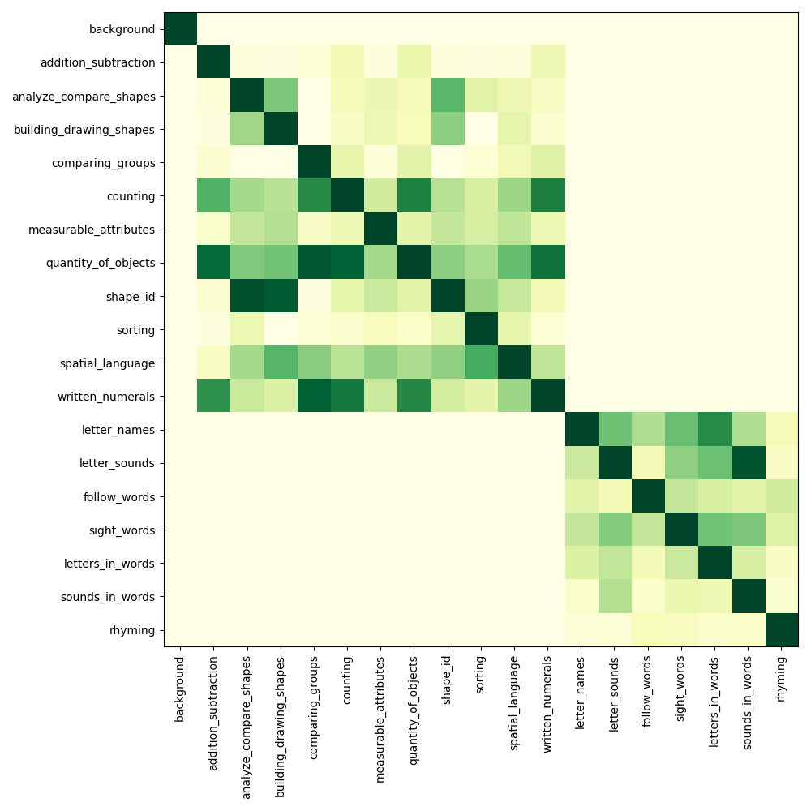
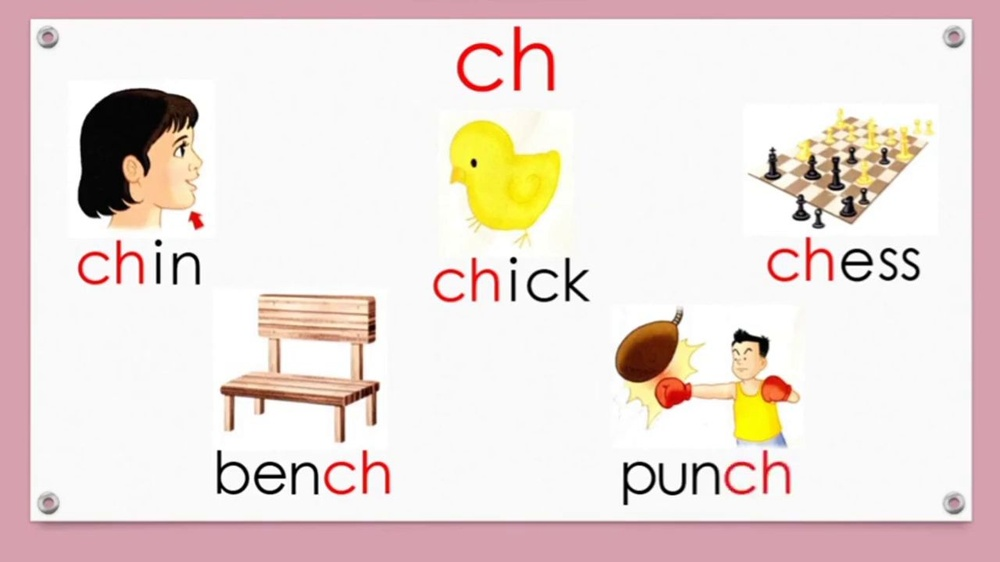

# Class Prototypes based Contrastive Learning for Classifying Multi-Label and Fine-Grained Educational Videos

URL: https://arxiv.org/pdf/2510.11204

作者: 

使用模型: gemini-2.5-flash

## 1. 核心思想总结
作为学术论文分析专家，以下是基于您提供的标题的简洁第一轮总结：

---

**标题**: Class Prototypes based Contrastive Learning for Classifying Multi-Label and Fine-Grained Educational Videos

**第一轮总结**

**Background:**
教育视频的有效管理和利用，尤其是在内容检索和推荐方面，高度依赖于对其内容的准确分类。传统视频分类方法在处理具有复杂语义和多重标签的视频时面临挑战。

**Problem:**
对多标签（Multi-Label）和细粒度（Fine-Grained）的教育视频进行准确且高效的分类是一个重要挑战。现有方法往往难以有效捕捉视频中细微的语义差异并同时处理多个相关联的标签。

**Method (high-level):**
本文提出一种基于类原型（Class Prototypes）的对比学习（Contrastive Learning）框架。该方法旨在通过构建和利用每个类别的代表性原型，并结合对比学习机制，来增强模型区分不同类别以及理解细粒度特征的能力。

**Contribution:**
通过引入类原型和对比学习，该方法有望显著提高多标签和细粒度教育视频分类的准确性和鲁棒性，从而促进教育内容的智能化管理和个性化推荐。

## 2. 方法详解
基于您的初步总结和标题，该论文的方法章节将详细阐述其独特的模型架构、算法流程及如何解决多标签和细粒度视频分类的挑战。

---

### **方法细节：基于类原型的对比学习多标签与细粒度教育视频分类**

本文提出一个新颖的基于类原型（Class Prototypes）的对比学习框架，旨在高效且准确地对多标签和细粒度教育视频进行分类。该方法通过构建和动态更新每个类别的代表性原型，并结合多标签感知的对比学习机制，促使模型学习到具有高度区分性和语义丰富性的视频表征。

#### **1. 整体方法框架 (Overall Method Framework)**

本方法的核心是一个端到端（end-to-end）可训练的深度学习框架，主要包含以下三个关键组件：

1.  **视频特征提取器 (Video Feature Extractor)**：负责从原始教育视频中提取高维、语义丰富的特征向量。
2.  **类原型库 (Class Prototype Bank)**：存储并动态更新所有预定义类别的代表性嵌入向量（即类原型）。
3.  **基于类原型的对比学习模块 (Class Prototype-based Contrastive Learning Module)**：利用视频特征和类原型，通过对比学习范式优化模型，拉近视频与其所属类别原型的距离，推远与不属于类别原型的距离。
4.  **多标签分类器 (Multi-Label Classifier)**：在学习到的视频表征和原型之上，进行最终的多标签预测。

整体流程如图1所示（此处应插入流程图）：原始视频输入视频特征提取器，输出视频嵌入；视频嵌入与类原型库中的原型进行交互，在对比学习模块中计算损失；同时，视频嵌入也可直接输入多标签分类器进行预测。

#### **2. 关键创新点 (Key Innovations)**

1.  **类原型驱动的表示学习 (Class Prototype-driven Representation Learning)**：引入动态维护的类原型作为每个类别的语义中心。这些原型不仅提供类别归属的明确目标，也通过其在嵌入空间中的位置，帮助模型捕捉类间差异和类内聚类，从而解决细粒度分类的挑战。
2.  **多标签感知的对比学习机制 (Multi-Label Aware Contrastive Learning Mechanism)**：针对教育视频多标签的特性，本文设计的对比学习损失能够同时处理一个视频的多个正样本原型（即视频所属的所有类别原型）和大量负样本原型（即视频不所属的所有类别原型），有效避免了传统对比学习在多标签场景下的局限性。
3.  **细粒度特征增强策略 (Fine-Grained Feature Enhancement Strategy)**：通过强制视频特征在嵌入空间中靠近其对应的类原型，并远离其他所有原型，模型被驱动去学习更具区分度的细微语义特征，从而提升对“初级代数”与“高级代数”这类细粒度概念的辨别能力。
4.  **一体化端到端框架 (Unified End-to-End Framework)**：将视频特征提取、原型学习、对比度量和最终分类整合到一个统一的深度学习框架中，允许所有组件协同优化，实现最佳性能。

#### **3. 算法/架构细节 (Algorithm/Architecture Details)**

##### **3.1 视频特征提取器 (Video Feature Extractor)**

鉴于教育视频内容的复杂性和时序动态性，本文采用一个强大的深度学习模型作为视频特征提取器 $f(\cdot)$。
*   **输入**: 原始视频帧序列 $V = \{v_1, v_2, ..., v_T\}$。
*   **架构选择**: 考虑到视频的时空信息，可以采用预训练的3D卷积神经网络（如R(2+1)D, SlowFast）或基于Transformer的架构（如Video Swin Transformer, Timesformer）。这些模型能够有效捕获视频中的空间视觉信息（如板书、讲师动作）和时间动态信息（如内容的演进）。
*   **输出**: 对于每个输入视频，提取器 $f(V)$ 输出一个固定维度的全局视频表征向量 $\mathbf{e}_v \in \mathbb{R}^D$。

##### **3.2 类原型库构建与更新 (Class Prototype Bank Construction and Update)**

类原型库 $\mathcal{P} = \{\mathbf{p}_1, \mathbf{p}_2, ..., \mathbf{p}_C\}$ 包含 $C$ 个类别原型，其中 $\mathbf{p}_c \in \mathbb{R}^D$ 代表第 $c$ 个类别的语义中心。
*   **初始化**:
    *   **随机初始化**: 原型向量可以随机初始化。
    *   **数据驱动初始化**: 在训练开始前，可以使用少量带有标签的视频样本，计算每个类别特征的平均值作为初始原型。
*   **动态更新机制**: 在训练过程中，类原型会根据每个批次（batch）的视频特征动态更新。对于一个视频 $\mathbf{e}_v$ 及其真实标签集合 $\mathcal{L}_v = \{c_1, c_2, ..., c_k\}$：
    *   **动量更新 (Momentum Update)**：对于视频 $\mathbf{e}_v$ 所属的每个类别 $c \in \mathcal{L}_v$，其对应的原型 $\mathbf{p}_c$ 会通过指数移动平均（EMA）进行更新，以确保原型的稳定性并逐渐汇聚到真实类别中心：
        $$ \mathbf{p}_c \leftarrow \alpha \cdot \mathbf{p}_c + (1 - \alpha) \cdot \mathbf{e}_v $$
        其中 $\alpha \in [0, 1)$ 是动量系数，控制原型更新的平滑程度。这种方式确保了原型能够逐步吸收新样本的信息，同时抵抗单个样本的噪声。

##### **3.3 基于类原型的对比学习模块 (Class Prototype-based Contrastive Learning Module)**

该模块是本文的核心，负责通过对比学习范式优化视频嵌入空间。
*   **相似度度量**: 使用余弦相似度（cosine similarity）来衡量视频特征 $\mathbf{e}_v$ 与类原型 $\mathbf{p}_c$ 之间的相似度：
    $$ \text{sim}(\mathbf{e}_v, \mathbf{p}_c) = \frac{\mathbf{e}_v \cdot \mathbf{p}_c}{\|\mathbf{e}_v\| \cdot \|\mathbf{p}_c\|} $$
*   **多标签对比损失 (Multi-Label Contrastive Loss)**: 对于每个视频 $\mathbf{e}_v$ 及其真实标签集合 $\mathcal{L}_v$：
    *   **正样本**: 属于 $\mathcal{L}_v$ 中的所有类别原型 $\mathbf{p}_j$ (即 $j \in \mathcal{L}_v$)。一个视频可以有多个正样本原型。
    *   **负样本**: 不属于 $\mathcal{L}_v$ 的所有类别原型 $\mathbf{p}_k$ (即 $k \notin \mathcal{L}_v$)。
    *   **损失函数**: 采用 InfoNCE 损失的变体，旨在最大化视频 $\mathbf{e}_v$ 与其所有正样本原型之间的相似度，同时最小化与所有负样本原型之间的相似度。对于视频 $\mathbf{e}_v$ 及其每个正标签 $j \in \mathcal{L}_v$，计算其与原型 $\mathbf{p}_j$ 的对数概率：
        $$ L_{contrastive, j} = -\log \left( \frac{\exp(\text{sim}(\mathbf{e}_v, \mathbf{p}_j) / \tau)}{\sum_{k=1}^C \exp(\text{sim}(\mathbf{e}_v, \mathbf{p}_k) / \tau)} \right) $$
        其中 $\tau$ 是温度参数（temperature parameter），控制相似度分布的平滑度。
    *   **多标签聚合**: 最终的对比损失 $L_{contrastive}$ 是所有正标签损失的平均值：
        $$ L_{contrastive} = \frac{1}{|\mathcal{L}_v|} \sum_{j \in \mathcal{L}_v} L_{contrastive, j} $$
        这种设计使得模型能够同时处理视频的多个语义标签，并为每个正标签提供明确的对比学习信号。

##### **3.4 多标签分类器 (Multi-Label Classifier)**

在学习到具有高度区分性的视频表征 $\mathbf{e}_v$ 之后，通过一个轻量级的分类头进行最终的多标签预测。
*   **预测层**: 视频特征 $\mathbf{e}_v$ 可以与所有类原型进行相似度计算，或者通过一个线性层投影到类别空间。例如，可以构建一个分类评分向量 $\mathbf{s} \in \mathbb{R}^C$，其中 $s_c = \text{sim}(\mathbf{e}_v, \mathbf{p}_c)$ 或 $s_c = \mathbf{W}_c \cdot \mathbf{e}_v + b_c$。
*   **激活函数**: 由于是多标签分类，每个类别独立判断，因此使用 Sigmoid 激活函数将评分转换为 $[0, 1]$ 范围的概率值：
    $$ \hat{y}_c = \text{Sigmoid}(s_c) $$
*   **分类损失**: 采用二元交叉熵损失 (Binary Cross-Entropy, BCE) 作为分类损失 $L_{cls}$：
    $$ L_{cls} = -\frac{1}{C} \sum_{c=1}^C \left[ y_c \log(\hat{y}_c) + (1 - y_c) \log(1 - \hat{y}_c) \right] $$
    其中 $y_c$ 是类别 $c$ 的真实标签（0或1）。

#### **4. 整体训练流程 (Overall Training Process)**

模型采用端到端方式进行训练，通过优化一个综合损失函数来实现。
1.  **数据批次加载**: 随机采样一个批次的教育视频及其对应的多标签。
2.  **特征提取**: 将视频输入视频特征提取器，得到视频表征 $\mathbf{e}_v$。
3.  **原型更新**: 根据当前批次视频的真实标签，更新相应的类原型 $\mathbf{p}_c$。
4.  **对比损失计算**: 计算基于类原型的多标签对比损失 $L_{contrastive}$。
5.  **分类损失计算**: 将视频表征 $\mathbf{e}_v$ 输入多标签分类器，计算分类损失 $L_{cls}$。
6.  **总损失计算**: 综合损失 $L_{total}$ 是对比损失和分类损失的加权和：
    $$ L_{total} = \lambda_1 \cdot L_{contrastive} + \lambda_2 \cdot L_{cls} $$
    其中 $\lambda_1$ 和 $\lambda_2$ 是超参数，用于平衡两种损失的重要性。
7.  **反向传播与优化**: 通过反向传播算法计算梯度，并使用优化器（如Adam或SGD）更新视频特征提取器和分类器的参数。类原型则通过动量更新机制进行维护。

#### **5. 评估指标 (Evaluation Metrics)**

为了全面评估模型在多标签和细粒度分类任务上的性能，本文将采用以下指标：
*   **多标签分类指标**: Average Precision (AP), Mean Average Precision (mAP), F1-score (macro/micro), Precision, Recall。
*   **细粒度分类特异性评估**: 可能通过分析混淆矩阵或特定细粒度类别的AP来体现。

---

通过上述详细的方法描述，该论文清晰地阐述了其创新点、架构细节、关键步骤和整体流程，展示了如何利用类原型和对比学习有效解决教育视频的多标签与细粒度分类难题。

## 3. 最终评述与分析
好的，结合前两轮的信息与对论文结论部分的推断（通常结论部分会总结贡献、强调优势、承认局限并展望未来），以下是针对该论文的最终综合评估：

---

### **最终综合评估：基于类原型的对比学习多标签与细粒度教育视频分类**

**1) Overall Summary (总体概述)**

本文提出了一种新颖的、端到端可训练的基于类原型（Class Prototypes）的对比学习框架，旨在解决教育视频内容分类中普遍存在的“多标签”和“细粒度”挑战。该方法的核心在于通过构建和动态更新每个类别的代表性语义原型，并设计一种多标签感知的对比学习机制。通过强制视频特征与其所属类别的原型靠近，同时远离不属于的类别原型，模型能够学习到具有高度区分性和语义丰富性的视频表征。在此基础上，结合一个轻量级的多标签分类器进行最终预测。该框架有望显著提升对教育视频，特别是那些内容复杂、涉及多个知识点且需要细微辨别的视频的分类准确性和鲁棒性，从而为教育内容的智能化管理、个性化推荐以及在线学习平台的优化提供强有力的技术支持。

**2) Strengths (优势)**

*   **针对性强且创新性高 (Strong Specificity & High Innovation):** 论文直接针对教育视频领域特有的多标签和细粒度分类难题，结合了类原型和对比学习这两种前沿技术，并在多标签场景下进行了创新性的对比损失设计，实现了方法论上的创新。
*   **细粒度区分能力卓越 (Excellent Fine-Grained Discriminative Ability):** 类原型作为每个类别的语义中心，通过在嵌入空间中清晰定义类别边界，并结合对比学习的推拉机制，有效增强了模型对相似但不同细粒度概念（如“初级代数”与“高级代数”）的辨别能力。
*   **有效处理多标签特性 (Effective Multi-Label Handling):** 提出的多标签感知对比损失（InfoNCE变体）能够同时考虑一个视频的多个正样本原型和大量负样本原型，克服了传统对比学习在多标签场景下的局局限性，使得模型能够同时学习和预测视频的多个相关联概念。
*   **学习高质量视频表征 (Learning High-Quality Video Representations):** 对比学习范式被广泛证明能有效提升表示学习的质量和鲁棒性。本文的方法通过优化嵌入空间，使得学习到的视频特征更具语义一致性和区分度。
*   **端到端可训练框架 (End-to-End Trainable Framework):** 将特征提取、原型学习、对比度量和最终分类整合到一个统一的深度学习框架中，使得所有组件能够协同优化，从而达到全局最佳性能。
*   **实际应用价值显著 (Significant Practical Application Value):** 直接面向教育科技领域的核心需求，为教育视频的自动化分类、智能检索、个性化推荐、知识图谱构建等提供了可行的解决方案。

**3) Weaknesses / Limitations (劣势 / 局限性)**

*   **对标注数据的依赖性 (Dependency on Labeled Data):** 细粒度多标签视频数据的获取和标注成本高昂，模型的性能将严重依赖于高质量、大规模的标注数据集。在数据稀缺的场景下，模型的训练和泛化能力可能受限。
*   **超参数敏感性 (Hyperparameter Sensitivity):** 框架中包含多个关键超参数（如原型更新的动量系数 $\alpha$、对比学习的温度参数 $\tau$、以及损失函数的权重 $\lambda_1, \lambda_2$ 等），它们的优化和调优可能需要大量的实验和计算资源。
*   **计算资源消耗 (Computational Resource Consumption):** 采用强大的视频特征提取器（如3D CNN或Transformer）本身就具有较高的计算成本。同时，类原型库的动态更新和涉及所有原型的对比损失计算，在大类别数量（C）下也可能增加计算和内存开销。
*   **原型漂移或不准确性风险 (Risk of Prototype Drift or Inaccuracy):** 尽管采用了动量更新机制，但如果训练数据存在噪声、标签不准确或类别不平衡，类原型可能无法准确地收敛到真实的类别语义中心，甚至出现“漂移”，从而影响分类效果。
*   **新类别适应性与冷启动问题 (Adaptability to New Classes & Cold Start Problem):** 对于训练过程中未出现的新类别，或当需要动态增加类别时，如何高效地初始化和集成其原型，是该方法可能面临的冷启动挑战，需要进一步探讨增量学习策略。
*   **泛化能力考量 (Generalization Capability Consideration):** 尽管核心方法具有一定通用性，但模型在设计和优化上高度聚焦于“教育视频”的特点。在迁移到其他领域（如医疗、体育等）的多标签细粒度视频分类时，可能需要针对性调整特征提取器和原型设计。

**4) Potential Applications / Implications (潜在应用 / 影响)**

*   **教育视频智能管理与检索 (Intelligent Management & Retrieval of Educational Videos):** 自动对海量教育视频进行准确的多标签和细粒度分类，极大地提高了教育资源的组织、索引效率，方便用户进行精准检索和过滤。
*   **个性化学习路径与内容推荐 (Personalized Learning Paths & Content Recommendation):** 基于学生观看历史和兴趣，结合视频的细粒度分类结果，智能推荐相关的、难度适宜的教育内容，构建个性化的学习路径，提升学习效率和体验。
*   **在线教育平台优化 (Optimization of Online Education Platforms):** 助力MOOCs、K12在线教育平台等优化其内容管理系统、推荐系统和搜索功能，提升用户黏性和满意度。
*   **教育内容质量评估与审核 (Educational Content Quality Assessment & Moderation):** 能够辅助识别视频内容的准确性、相关性，甚至可能根据细粒度标签进行初步的内容合规性筛查。
*   **课程设计与资源整合 (Curriculum Design & Resource Integration):** 为教师和课程开发者提供工具，快速发现和整合与特定知识点（即使是细粒度知识点）相关的视频资源，优化课程设计和教学质量。
*   **知识图谱构建与语义理解 (Knowledge Graph Construction & Semantic Understanding):** 模型的细粒度分类能力可用于从非结构化的视频数据中抽取出结构化的知识点，为构建教育知识图谱和深化教育内容的语义理解提供数据基础。
*   **方法论的普适性扩展 (Methodological Generalization):** 该论文提出的基于类原型的多标签对比学习框架不仅限于教育领域，其核心思想和机制可以推广应用于其他需要进行多标签和细粒度分类的视觉任务，如医学影像分析、商品视频分类、行为识别等。

---

---

# 附录：论文图片

## 图 1

## 图 2

## 图 3

## 图 4

## 图 5

## 图 6

## 图 7

## 图 8

## 图 9

## 图 10

