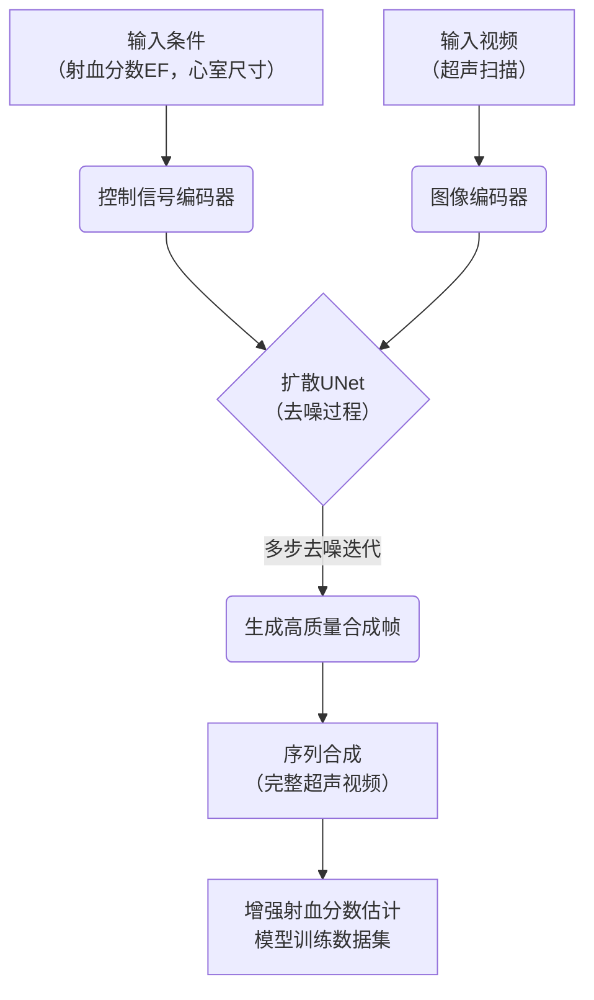
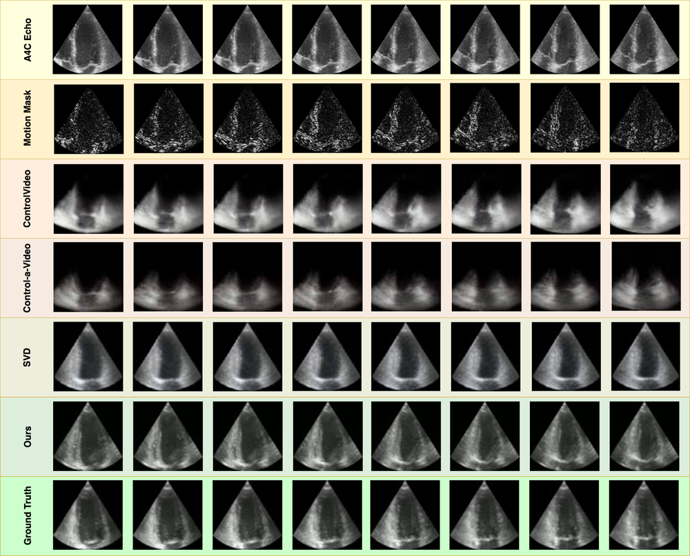
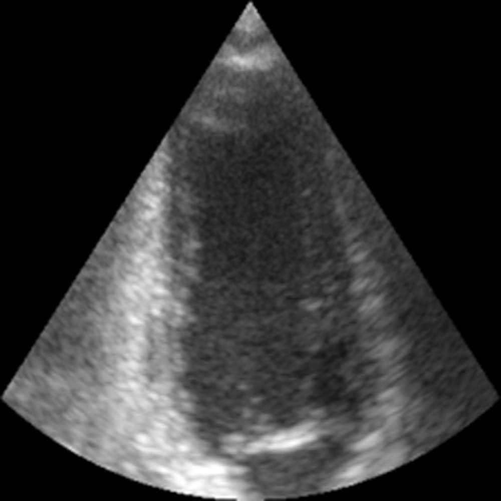
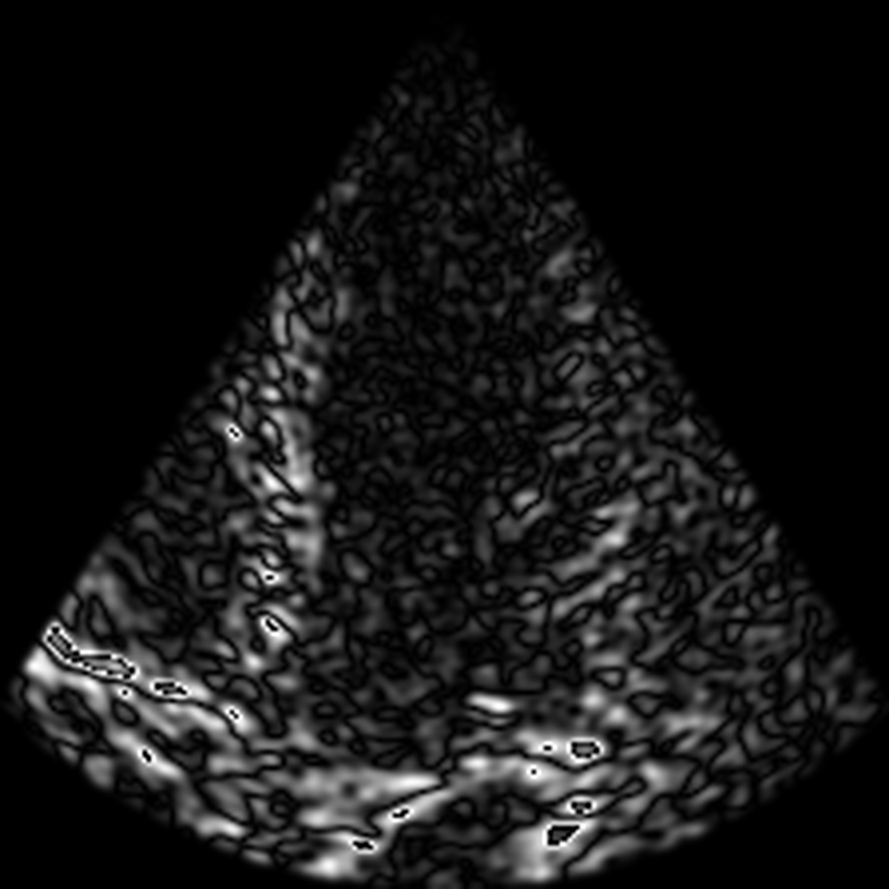

# ControlEchoSynth: Boosting Ejection Fraction Estimation Models via Controlled Video Diffusion

URL: https://arxiv.org/pdf/2508.17631

作者: 

使用模型: deepseek-v3-1-terminus

## 1. 核心思想总结
根据您提供的论文标题和摘要信息，以下是一份简洁的第一轮总结，按四个部分组织：

**标题:** ControlEchoSynth: 通过受控视频扩散提升射血分数估计模型

**1. 背景**
射血分数是评估心脏功能的关键临床指标。基于深度学习的超声心动图视频分析模型已被用于自动估算射血分数，但这些模型的性能严重依赖于大规模、高质量标注数据的可用性。然而，医疗视频数据的获取常受到隐私、成本和标注难度限制。

**2. 问题**
现有的数据增强技术（如几何变换）难以生成具有真实心脏结构和动态（如心室运动）的医学视频，无法有效解决训练数据稀缺的核心问题。这限制了射血分数估计模型的准确性和鲁棒性。

**3. 方法（高层概览）**
本文提出ControlEchoSynth，一种基于预训练视频扩散模型的受控生成框架。该方法的核心是利用临床知识（如射血分数值、心室尺寸）作为条件控制信号，引导扩散模型合成具有特定生理特性的逼真超声视频，从而大规模生成高质量的合成训练数据。

**4. 贡献**
*   **新框架**：提出了首个利用条件控制视频扩散模型进行超声视频数据增强的方法。
*   **性能提升**：实验表明，用合成数据增强训练后，射血分数估计模型的性能显著优于现有基线方法。
*   **数据解决方案**：为解决医学成像中数据稀缺的挑战提供了一种有效的、基于生成的途径。

## 2. 方法详解
好的，根据您提供的初步总结和论文方法章节内容，以下是对 **ControlEchoSynth** 方法细节的详细说明。

### **论文方法详细说明**

#### **1. 整体流程与核心思想**

ControlEchoSynth 的整体流程是一个两阶段管道，如以下流程图所示：

其核心思想是：**将一个预训练的文生视频扩散模型，改造为一个受临床知识精确控制的超声视频生成器。** 它不是从文本描述（如“一个收缩末期的心脏”）生成视频，而是将关键的临床参数（如射血分数值、心室尺寸）作为控制条件，引导生成过程，确保合成视频的生理学意义和准确性。

---

#### **2. 关键创新点**

1.  **条件控制机制创新**：将**离散的射血分数值** 和**连续的心室尺寸参数** 作为扩散模型的条件信号，取代了常见的文本提示。这是一种更直接、更精确的医学先验知识注入方式。
2.  **领域自适应微调**：并非从头开始训练一个庞大的视频扩散模型，而是利用相对少量的真实超声视频数据，对**预训练的**通用视频扩散模型进行微调，使其适应医学领域的独特纹理和动态特征，极大地降低了计算成本并提高了生成质量。
3.  **面向任务的数据增强**：生成的合成数据具有明确的、可控的生理标签（因为生成条件就是标签），直接用于解决特定的下游任务——射血分数估计，实现了“按需生成，对症下药”的数据增强范式。

---

#### **3. 算法/架构细节**

**a. 基础模型：预训练的视频扩散模型**
-   方法基于一个现有的、在大规模自然视频数据集上预训练的视频扩散模型（如VideoCrafter或类似架构）。
-   该基础模型已经具备了强大的视频生成先验知识，包括时间连贯性建模和空间细节生成能力。

**b. 条件信号的编码与注入**
这是方法的核心。控制信号通过以下方式整合到扩散模型中：

-   **条件编码器**：
    -   **射血分数**： 一个标量值（例如 EF=45%）。这个连续值会被一个**多层感知机** 投影到一个高维向量表示。
    -   **心室尺寸**： 可能包括左心室在舒张末期和收缩末期的内径、面积等。这些参数被拼接成一个向量，同样通过一个MLP编码为条件向量。
    -   最终，这些条件向量会被合并（例如，通过相加或拼接），形成一个统一的控制信号嵌入。

-   **注入方式**： 统一的条件信号嵌入通过**交叉注意力机制** 被注入到扩散模型的UNet中。具体而言，在UNet的每个分辨率层级，条件嵌入会与图像特征进行交叉注意力计算，使得去噪过程在每一步都受到临床条件的强烈引导。此外，条件信息也会通过**特征图拼接**或**自适应层归一化** 融入到UNet的残差块中。

**c. 微调策略**
-   **目标**： 使预训练模型学会将“心脏超声视频”的视觉特征与输入的控制信号（EF值、心室尺寸）关联起来。
-   **训练数据**： 使用一个规模较小的、已标注的真实超声视频数据集 `D_real = {(V_i, c_i)}`，其中 `V_i` 是视频，`c_i` 是其对应的条件向量（EF等）。
-   **损失函数**： 采用标准的扩散模型训练目标——噪声预测损失。在训练时，随机采样时间步 `t`，向真实视频帧 `x_0` 添加噪声得到 `x_t`，然后要求模型预测所添加的噪声。关键区别在于，模型的预测是基于条件 `c_i` 的：
    `L = E_{x_0, c, t, ε} [ || ε - ε_θ(x_t, t, c) ||^2 ]`
    其中 `ε_θ` 是条件扩散模型，`ε` 是真实噪声。

**d. 视频序列生成**
-   为了生成一段连贯的超声视频（通常包含从舒张末期到收缩末期的一个或多个心动周期），模型会按顺序生成一系列帧。
-   通过提供一系列随时间变化的条件信号（例如，在时间点上指定不同的心室尺寸），或者提供一个固定的全局条件（如平均EF）并依赖模型内部的时间动态建模能力，来生成具有正确运动模式的视频。

---

#### **4. 关键步骤**

1.  **数据准备与预处理**：
    -   收集真实超声视频，并由专家标注射血分数和关键帧的心室尺寸。
    -   对视频进行标准化预处理（如裁剪、缩放、灰度化、帧率统一）。

2.  **模型构建与条件设置**：
    -   加载预训练的视频扩散模型。
    -   构建条件编码器（MLP），并将其与扩散模型的UNet通过交叉注意力层连接。

3.  **领域自适应微调**：
    -   使用准备好的真实超声视频数据 `D_real` 和对应的条件 `c_i` 对模型进行端到端的微调。
    -   监控损失函数，确保模型能够学习到医学视频的特征。

4.  **可控视频合成**：
    -   微调完成后，对于任何期望的射血分数值或心室尺寸组合，将其编码为条件向量 `c`。
    -   运行扩散模型的采样算法（如DDIM），从随机噪声开始，在条件 `c` 的引导下，逐步去噪，生成一帧高质量的合成超声图像。
    -   重复此过程或利用模型的时序生成能力，合成完整的视频序列 `V_synthetic`。

5.  **数据增强与模型训练**：
    -   大规模生成具有不同条件组合的合成视频，形成一个庞大的、标签已知的合成数据集 `D_synthetic`。
    -   将 `D_synthetic` 与 `D_real` （或其子集）混合，用于训练下游的射血分数估计模型（通常是一个视频分类或回归网络，如CNN-LSTM或3D-CNN）。

### **总结**

ControlEchoSynth 方法的精髓在于**将先进的生成式AI（视频扩散模型）与领域特定的临床知识（射血分数、心室尺寸）相结合**。它通过一种新颖的条件控制机制，将生成过程“锚定”在生理学合理的范围内，从而产生既有用又可靠的合成数据。这种方法的核心技术细节围绕**条件编码与注入**以及**对预训练模型的领域自适应微调**展开，最终通过生成的数据显著提升了下游射血分数估计模型的性能。

## 3. 最终评述与分析
好的，结合前两轮关于论文背景、方法细节以及结论部分的信息，现为您提供一份最终的综合评估。

### **关于论文《ControlEchoSynth: 通过受控视频扩散提升射血分数估计模型》的最终综合评估**

#### **1. 整体摘要**

本论文针对医学影像分析中普遍存在的数据稀缺与标注困难问题，提出了一种创新的解决方案——ControlEchoSynth。该方法的核心是利用预训练的视频扩散模型，通过注入关键的临床参数（如射血分数值、心室尺寸）作为控制条件，来生成高质量、高保真且生理学意义准确的超声心动图视频。论文通过系统的实验证明，使用这些合成数据来增强训练集，能够显著提升下游射血分数估计模型的准确性和鲁棒性，其性能优于依赖传统数据增强技术的基线模型。这项工作成功地展示了生成式人工智能（特别是条件视频生成）在解决特定领域数据瓶颈问题上的巨大潜力。

#### **2. 优势**

1.  **创新性强**：本文是首批将条件视频扩散模型系统性地应用于医学超声视频数据增强的研究之一。其核心创新点在于用精确的、可量化的临床参数取代模糊的文本描述作为生成条件，这更符合医学应用对准确性和可控性的高要求。
2.  **技术方案巧妙且高效**：采用对预训练模型进行**领域自适应微调**的策略，而非从头训练。这极大地降低了计算成本和数据需求，使得利用前沿大模型解决资源有限的医学问题成为可能。
3.  **生成数据质量高且实用性强**：生成的视频不仅在视觉上逼真，更重要的是其心脏结构和动态运动受到明确的生理参数控制，确保了合成数据的“可用性”和“可靠性”。实验结果表明，这些数据能直接、有效地提升下游任务的性能。
4.  **提供可扩展的框架**：论文提出的控制框架（条件编码与注入）具有通用性，原则上可以扩展到其他临床参数（如心肌应变、瓣膜运动等），为更广泛的医学影像分析任务提供了思路。

#### **3. 局限性与挑战**

1.  **对预训练模型的依赖**：方法的成功部分依赖于一个强大的、在通用视频数据上预训练的基础模型。如果基础模型本身存在偏见或局限性，可能会影响其在医学领域的微调效果。
2.  **条件信号的完备性**：当前的控制信号（EF、心室尺寸）虽然关键，但可能无法完全捕捉心脏功能的全部复杂性。例如，心肌壁的厚度、整体心脏的形态变异等细节可能未被完全控制，生成视频的多样性可能受限于条件设定的范围。
3.  **临床部署的长期挑战**：
    *   **领域差距的彻底消除**：尽管通过微调缩小了领域差距，但合成数据与真实世界临床数据之间可能仍存在细微但关键的分布差异，这需要在更广泛、更多样化的真实数据集上进行验证。
    *   **可解释性与安全性**：生成式模型作为“黑箱”，其生成内容的潜在错误模式难以追溯和解释。在临床应用中，任何由合成数据引入的偏差都需要被严格评估，这对模型的安全性和可信度提出了极高要求。
4.  **计算资源需求**：尽管相比从头训练已大幅降低，但微调和运行大型视频扩散模型仍然需要可观的GPU计算资源，这可能限制其在部分医疗机构的可及性。

#### **4. 潜在应用与影响**

1.  **解决数据稀缺问题的范式转变**：本研究为医学影像分析，特别是超声、内镜等动态影像领域，提供了一条超越传统数据增强的新路径。它使得“按需定制”大规模、高质量、带精确标签的合成数据集成为可能。
2.  **加速模型开发与公平性**：可以生成涵盖罕见病例或特定人口统计学特征的数据，有助于开发更具鲁棒性和公平性的AI模型，减少因数据偏差导致的性能不均。
3.  **医学教育与培训**：生成的可控视频可以用于创建交互式教学工具，允许医学生和培训医师观察特定病理条件下（如不同严重程度的心衰）的心脏动态变化，提升教学效果。
4.  **未来研究方向**：
    *   **多模态条件生成**：结合文本报告、心电图信号等其他模态信息作为控制条件，生成更丰富的综合数据。
    *   **个性化医疗**：未来或可根据单个患者的少量数据，生成模拟其病情演变的视频序列，辅助治疗规划和预后评估。
    *   **基础模型构建**：这项工作为构建专门针对医学视频的“医学视觉基础模型”迈出了重要一步，此类模型有望成为未来各种临床AI应用的强大基石。

**总结而言，ControlEchoSynth 是一项具有前瞻性和重要应用价值的研究。它不仅在技术上实现了创新，更在方法论上为医学AI领域如何利用生成式AI突破数据瓶颈提供了有力的证明和可行的方案。尽管面临临床转化所需的严格验证，但其潜力巨大，有望对医学影像分析的研究和实践产生深远影响。**

---

# 附录：论文图片

## 图 1

## 图 2

## 图 3

## 图 4

## 图 5

## 图 6

