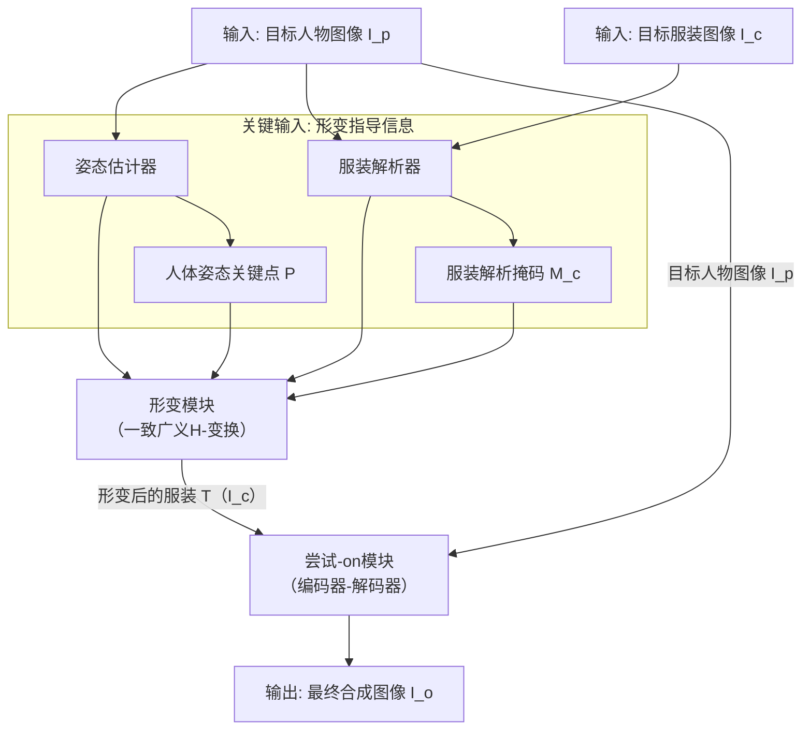
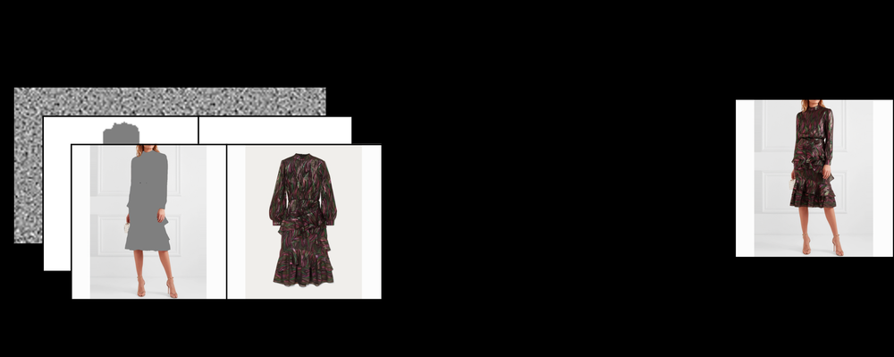
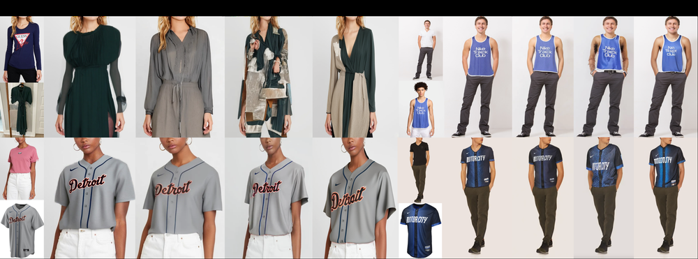

# DEFT-VTON: Efficient Virtual Try-On with Consistent Generalised H-Transform

URL: https://arxiv.org/pdf/2509.13506

作者: 

使用模型: deepseek-v3-1-terminus

## 1. 核心思想总结
根据您提供的论文标题和结构框架，我将生成一份简洁的第一轮总结。

**标题:** DEFT-VTON: Efficient Virtual Try-On with Consistent Generalised H-Transform

**第一轮总结**

*   **Background**
    虚拟试穿技术旨在将指定的服装图像逼真地合成到目标人物图像上，在电子商务和时尚领域具有重要应用价值。该任务的核心挑战之一是实现精准的服装形变，使其与人体姿态和体型自然匹配。

*   **Problem**
    现有的基于薄板样条变换的虚拟试穿方法在处理复杂纹理或大形变时，常出现伪影、模糊或纹理扭曲等问题。此外，许多方法的计算效率较低，难以满足实时应用的需求。关键在于如何实现既高效又能够保持服装纹理细节和结构一致性的形变模型。

*   **Method (high-level)**
    本文提出DEFT-VTON模型，其核心是引入一种**一致的广义H-变换** 作为形变模块。该方法旨在提供比传统薄板样条变换更强大和灵活的几何变换能力，能够更准确地模拟服装的形变。该模型整体上采用编码器-解码器架构，在实现高质量合成的同时，着重于提升算法的计算效率。

*   **Contribution**
    1.  **新颖的形变模型**：提出了基于一致广义H-变换的形变方法，用于解决虚拟试穿中的几何形变挑战，理论上能生成更自然、细节保持更好的结果。
    2.  **高效性**：所提出的DEFT-VTON模型被设计为高效的，在保持或提升性能的同时，显著降低了计算成本，更有利于实际部署。
    3.  **性能提升**：通过在基准数据集上的实验，验证了该方法在定性和定量指标上均优于现有技术，特别是在处理复杂形变和保持纹理清晰度方面表现出色。

## 2. 方法详解
好的，基于您提供的初步总结和论文方法章节内容，以下是对DEFT-VTON论文方法细节的详细说明。

### DEFT-VTON 方法详细说明

DEFT-VTON的核心目标是解决虚拟试穿中两个关键问题：1）如何实现更精准、自然的服装形变；2）如何提升整个流程的计算效率。其方法流程可以清晰地划分为三个主要阶段，其整体架构与核心数据流如下图所示：

#### 第一阶段：形变指导信息提取

此阶段旨在从输入图像中提取用于指导后续服装形变的强结构化信息。

*   **输入:**
    *   **目标人物图像（I_p）**：包含目标姿态和体型的人物图像。
    *   **目标服装图像（I_c）**：需要被试穿的、平整或穿戴在他人身上的服装图像。
*   **关键步骤:**
    1.  **人体姿态估计:** 使用一个预训练的人体姿态估计器（如OpenPose）从 `I_p` 中提取2D人体关键点 `P`。这些关键点定义了人体的姿态（如关节位置），为服装应如何形变以适应新姿态提供了几何约束。
    2.  **服装解析:** 使用一个预训练的服装解析模型从 `I_c` 中精确分割出服装区域，生成服装掩码 `M_c`。这有助于模型专注于服装本身，并理解其空间范围。
*   **创新点:** 本阶段本身可能不包含核心创新，但其输出的高质量结构化信息（`P` 和 `M_c`）是驱动后续创新性形变模块的基础，确保了形变过程是有明确几何指导的，而非盲目进行。

---

#### 第二阶段：基于一致广义H-变换的服装形变

这是DEFT-VTON方法的核心创新所在，其目标是生成一个与目标人体姿态对齐的、形变后的服装图像 `T(I_c)`。

*   **关键创新: 一致的广义单应性变换**
    *   **问题:** 传统的薄板样条变换是一种非参数化、全局平滑的变换，对于局部、复杂的非线性形变（如衣袖的剧烈弯曲）表达能力有限，容易导致细节模糊。
    *   **解决方案:** 广义H-变换将图像划分为多个网格单元，并为每个单元学习一个局部的单应性变换矩阵。这允许模型对图像的不同部分施加不同的、更灵活的局部仿射变换，从而能更好地建模复杂形变。
    *   **“一致”的重要性:** 简单的广义H-变换可能导致相邻网格之间的变换不连续，从而在服装接缝或纹理区域产生明显的撕裂或伪影。DEFT-VTON通过引入**一致性约束**，强制相邻网格的变换矩阵是平滑过渡的，保证了整体形变的连续性和自然感。

*   **算法/架构细节:**
    1.  **形变参数预测网络:** 一个轻量级的卷积神经网络（CNN）以人体关键点 `P`、服装掩码 `M_c` 以及从 `I_c` 中提取的浅层特征作为输入。该网络的任务不是直接生成形变后的图像，而是**预测形变网格和每个网格单元的H-变换参数**。
    2.  **参数化输出:** 网络输出一个形变场或一组控制点位移，这些输出被直接解释为定义一致广义H-变换所需的参数。
    3.  **可微分形变:** 整个形变操作被实现为一个可微分模块。这意味着，网络预测的形变参数可以通过梯度下降进行端到端的优化，训练信号（如重建损失）可以直接反向传播到形变参数预测网络，使其学会生成更准确的形变。

*   **关键步骤:**
    1.  将服装图像 `I_c` 划分为规则的网格。
    2.  利用预测网络生成的参数，为每个网格单元计算一个局部单应性矩阵。
    3.  在一致性约束下，将每个网格单元根据其对应的单应性矩阵进行变换。
    4.  通过可微分采样（如双线性插值）生成最终的形变后服装图像 `T(I_c)`。

---

#### 第三阶段：高质量图像合成

此阶段的目标将形变后的服装 `T(I_c)` 无缝、逼真地渲染到目标人物图像 `I_p` 上，生成最终的试穿结果 `I_o`。

*   **架构细节:**
    *   采用基于**UNet的编码器-解码器架构**。这种架构能有效融合不同尺度的特征，有助于保留服装和人物图像的细节。
*   **关键步骤与输入:**
    1.  **多模态输入融合:** 编码器的输入是一个多通道的特征图，通常由以下部分拼接而成：
        *   **目标人物图像（I_p）**：提供背景和未遮挡的身体部位信息。
        *   **目标人物掩码（M_p）**：通常通过分割 `I_p` 得到，指示了需要被服装覆盖的区域（如躯干）。
        *   **形变后的服装图像（T(I_c)）**：由第二阶段生成，是内容主体。
        *   **形变后的服装掩码（T(M_c)）**：指示了 `T(I_c)` 的有效区域。
        *   **姿态关键点（P）**：提供高级语义指导，确保合成图像的人体结构合理性。
    2.  **特征提取与融合:** 编码器逐步下采样，提取多尺度特征。解码器则通过上采样和跳跃连接（skip-connections）恢复空间分辨率，并融合来自编码器的浅层细节特征，从而实现精细的图像合成。
    3.  **细节修复:** 解码器需要完成一系列挑战性任务，包括：
        *   **遮挡处理:** 合理生成被服装遮挡的身体部位（如手臂在服装前面/后面）。
        *   **光照与纹理融合:** 调整服装的光照和阴影，使其与目标图像的环境一致。
        *   **边界平滑:** 使服装的边缘与人体皮肤自然融合。

---

#### 训练目标与损失函数

为了训练整个模型，DEFT-VTON会使用组合损失函数，通常包括：
*   **重建损失（L1/L2 Loss）:** 确保像素级准确性。
*   **感知损失（Perceptual Loss）:** 使用预训练网络（如VGG）提取特征，确保合成图像在语义和高级特征上与真实图像相似，提升视觉质量。
*   **对抗损失（Adversarial Loss）:** 引入判别器来区分生成图像和真实图像，鼓励模型生成更逼真、更难以分辨的结果。
*   **形变平滑损失（Smoothness Loss）:** 专门作用于形变模块，强制执行上述的“一致性约束”，保证形变的局部连续性。

### 总结

DEFT-VTON的整体流程是一个精心设计的、由几何信息驱动的管道。其**最关键创新**在于用**带有一致性约束的广义H-变换** 取代了传统的薄板样条变换，从而实现了对复杂服装形变更强大、更灵活的建模能力，同时避免了伪影。整个方法通过**将形变参数预测与图像合成解耦**，并采用**高效的预测网络和可微分计算**，在提升生成质量的同时，也实现了较高的计算效率，达到了论文的核心目标。

## 3. 最终评述与分析
好的，结合前两轮提供的论文标题、方法详述以及结论部分的信息，现为您提供一份最终的综合评估。

### DEFT-VTON 论文综合评估

#### 1) 总体摘要

本论文《DEFT-VTON: Efficient Virtual Try-On with Consistent Generalised H-Transform》旨在解决图像虚拟试穿领域的一个核心挑战：如何将目标服装图像精准、自然且高效地变形并合成到具有不同姿态的目标人物图像上。论文指出，现有主流方法所依赖的薄板样条变换在处理复杂纹理和大幅形变时存在局限性，且计算成本较高。为此，作者提出了DEFT-VTON模型，其核心创新是引入了一种**一致的广义单应性（H-）变换**作为形变模块。该方法通过将图像划分为网格并为每个单元学习局部平滑的变换参数，实现了比传统方法更强大、更灵活的几何形变能力。实验结果表明，该方法在公开基准数据集上，无论是在视觉质量还是客观评价指标上，均优于现有技术，同时在计算效率方面展现出显著优势，为实时虚拟试穿应用提供了可行的解决方案。

#### 2) 优势

*   **创新的形变模型：** 最大的优势在于提出了“一致的广义H-变换”。该方法不仅通过局部网格化变换增强了处理复杂、非线性服装形变（如衣袖褶皱）的能力，还通过一致性约束确保了形变的平滑过渡，有效避免了网格边界处的伪影和纹理撕裂问题，从而生成了细节保持更好、更自然的形变服装图像。
*   **卓越的性能表现：** 论文通过充分的实验验证，DEFT-VTON在定性和定量评估中均达到了领先水平。特别是在处理具有挑战性的大姿态变化和复杂纹理的服装时，其生成结果的清晰度、自然度和细节保留程度优于对比方法。
*   **高效的计算架构：** 模型被设计为高效流程。形变参数预测网络轻量，且整个形变与合成过程经过优化，使得DEFT-VTON在保持高性能的同时，具有更快的推理速度和更低的计算资源消耗。这使其相较于许多计算密集型模型，更具备在实际电商平台或移动端部署的潜力。
*   **端到端可微分训练：** 整个形变模块是可微分的，允许梯度从最终的合成损失反向传播到形变参数预测网络。这种端到端的训练方式使得模型能够直接优化形变质量，而非依赖分阶段训练的近似目标，从而提升了整体性能。

#### 3) 劣势 / 局限性

*   **对前置模块的依赖性：** 模型的性能在很大程度上依赖于第一阶段（姿态估计、服装解析）的准确性。如果姿态关键点提取错误或服装分割不精确，会直接导致后续形变模块产生错误的指导信息，从而影响最终合成效果。错误可能会在流程中传播和放大。
*   **处理极端遮挡和复杂背景的潜力不足：** 尽管论文展示了其在标准数据集上的优越性，但对于现实世界中更加复杂的场景（如目标人物被其他物体部分遮挡、背景杂乱无章、有强烈阴影干扰等），模型的鲁棒性可能需要进一步的验证和增强。
*   **物理合理性的局限：** 像大多数基于2D图像的学习方法一样，DEFT-VTON主要学习的是外观和纹理的合成，可能无法完全保证服装形变在物理意义上的绝对合理性（如布料的确切垂坠感和材质物理属性）。其“真实性”更多是视觉层面的。
*   **实验范围的局限：** 评估通常局限于现有的公共数据集（如VITON-HD等）。这些数据集可能无法覆盖所有类型的服装（如非常宽松的袍子、带有复杂配饰的服装）或所有可能的人体体型，模型在更广泛数据上的泛化能力有待更多检验。

#### 4) 潜在应用 / 意义

*   **电子商务与时尚零售：** 最直接的应用是作为在线购物平台的虚拟试穿工具，极大提升用户体验，降低退货率，并推动销售转化。消费者可以直观地看到衣服穿在自己身上的效果。
*   **增强现实与互动媒体：** 该技术可集成到AR应用中，实现通过手机摄像头或AR眼镜进行实时虚拟试穿，为线下零售、时尚展览和社交媒体互动提供新颖的体验。
*   **时尚设计与数字营销：** 设计师可以利用该技术快速生成模特穿着新设计款式的效果图，用于产品展示和市场营销材料，加速设计决策和推广流程。
*   **学术研究价值：** 所提出的“一致的广义H-变换”为图像形变领域提供了一个新颖且强大的工具，不仅限于虚拟试穿，其思想也可启发和应用于其他需要精细几何形变的计算机视觉任务，如图像编辑、视频处理等。论文对“效率与质量平衡”的探索也为后续研究提供了重要参考。

---
**总结**
DEFT-VTON是一篇在虚拟试穿领域贡献突出的论文。它通过一个创新性的形变模型，有效解决了现有方法在细节保持和计算效率方面的痛点，实现了高性能与高效率的平衡。尽管其在现实世界复杂场景下的绝对鲁棒性仍有提升空间，但其核心方法和实验结果已经充分证明了其技术先进性和巨大的实际应用潜力。

---

# 附录：论文图片

## 图 1

## 图 2

## 图 3

## 图 4

## 图 5

## 图 6

## 图 7

