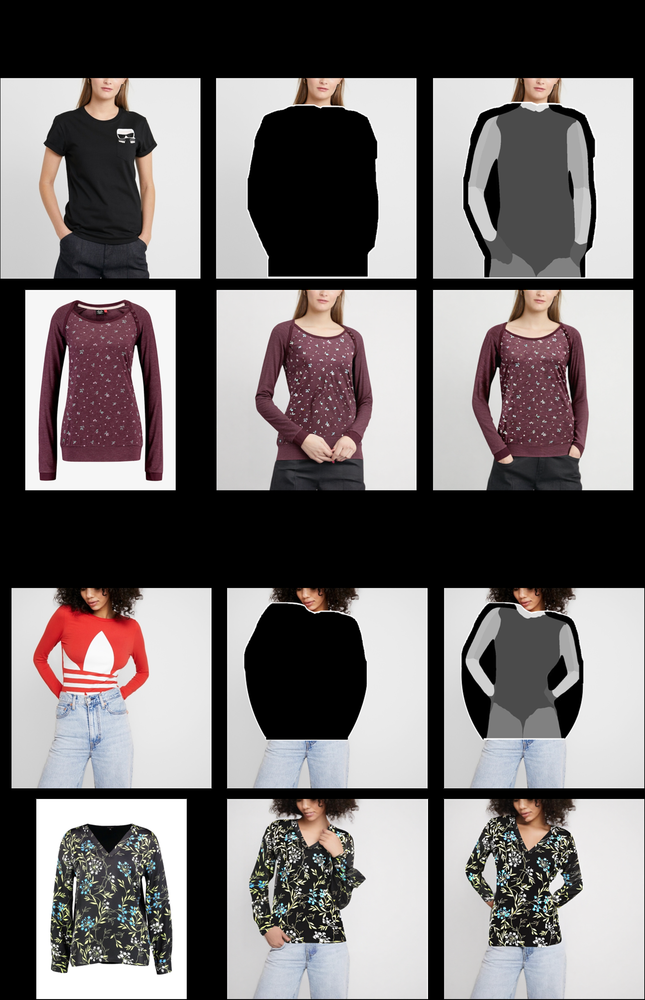
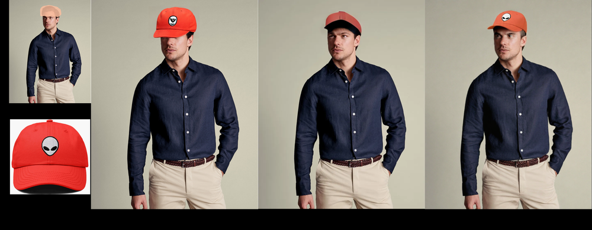
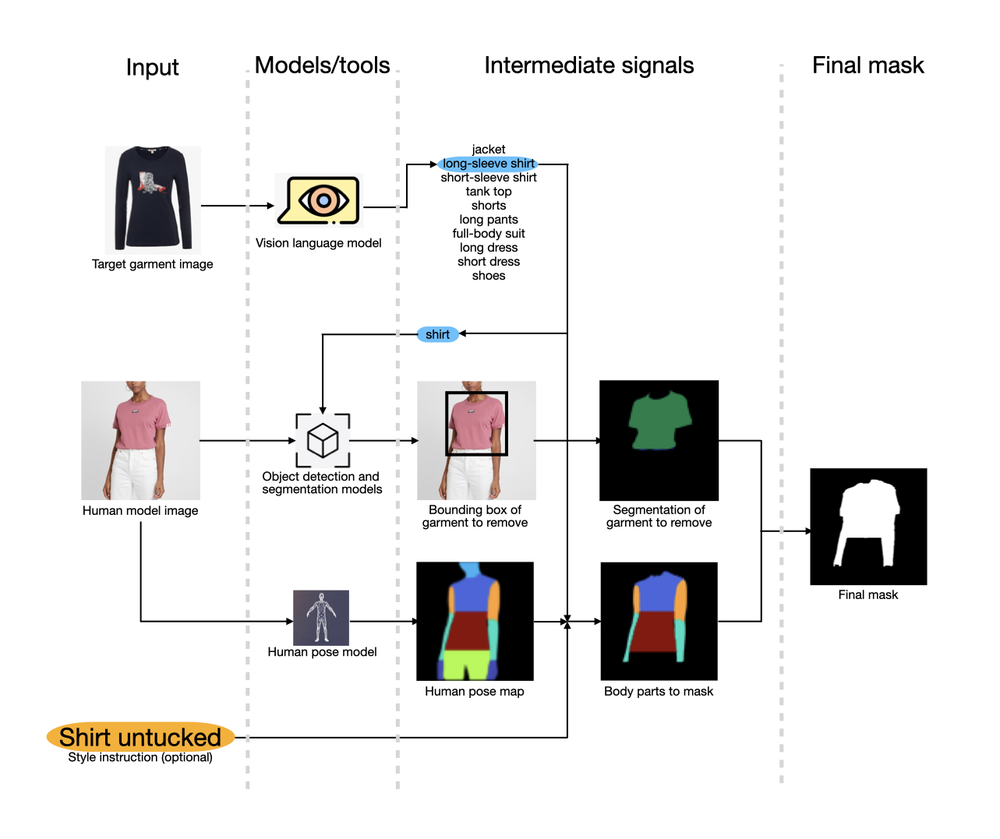
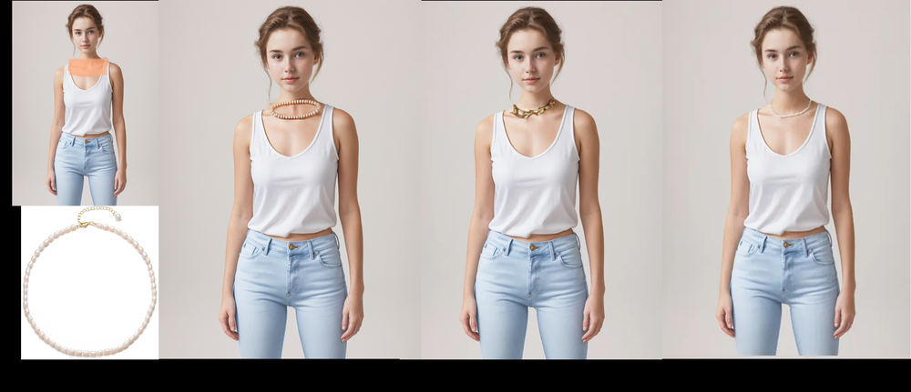
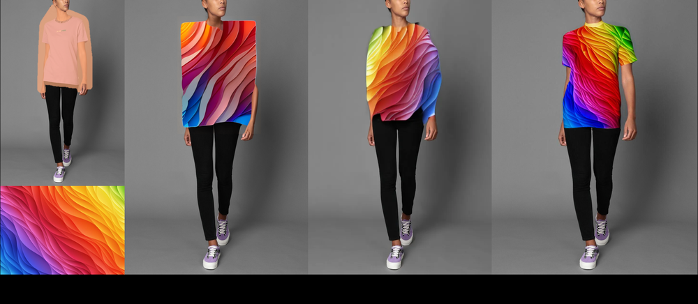
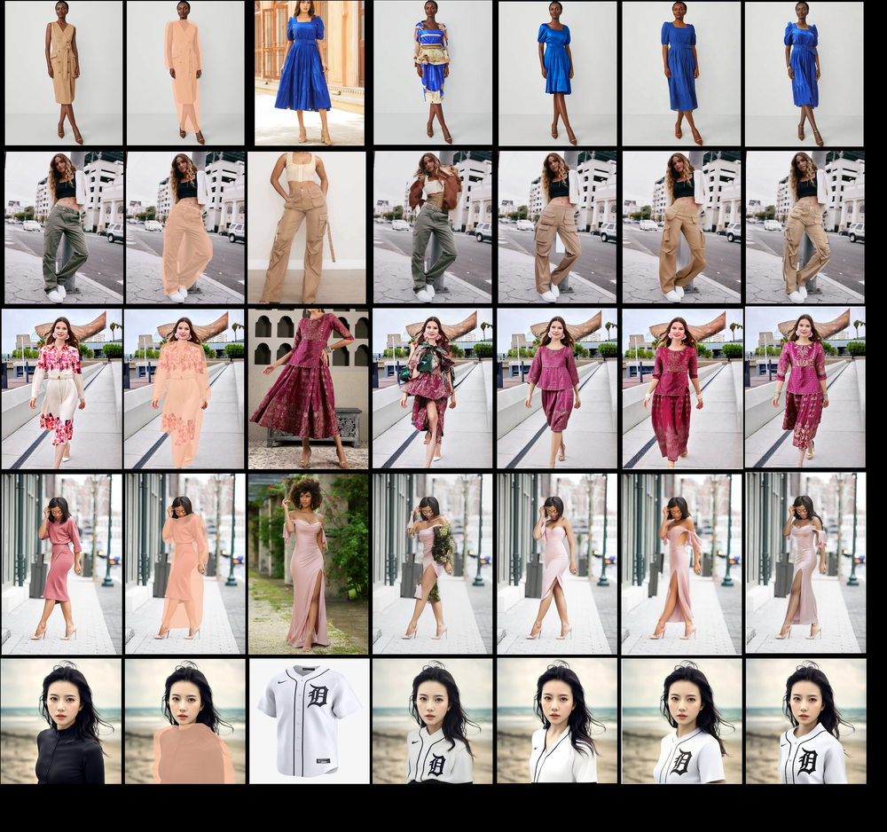

# DiT-VTON: Diffusion Transformer Framework for Unified Multi-Category Virtual Try-On and Virtual Try-All with Integrated Image Editing

URL: https://arxiv.org/pdf/2510.04797

作者: 

使用模型: gemini-2.5-flash

## 1. 核心思想总结
好的，作为学术论文分析专家，以下是根据您提供的标题对论文进行的第一轮简洁总结：

**标题:** DiT-VTON: Diffusion Transformer Framework for Unified Multi-Category Virtual Try-On and Virtual Try-All with Integrated Image Editing

---

**1. Background (背景)**

虚拟试穿（Virtual Try-On, VTON）技术在时尚电商、个性化推荐等领域具有巨大潜力。现有VTON方法在处理单一品类试穿方面已取得进展，但面临如何实现多品类、复杂场景（如全身试穿，"Virtual Try-All"）的统一处理，以及如何对试穿结果进行灵活精细化编辑的挑战。扩散模型和Transformer架构在图像生成和理解方面展现出强大的能力。

**2. Problem (问题)**

现有虚拟试穿系统通常缺乏一个统一的框架来高效、高质量地处理多种衣物类别和复杂的“虚拟全身试穿”任务。此外，大多数方法未能提供集成式的图像编辑功能，限制了用户对生成结果的精细控制和个性化调整，导致用户体验不佳。

**3. Method (high-level) (高层方法)**

本论文提出了一个名为DiT-VTON的扩散Transformer框架。该框架融合了Diffusion模型的生成能力和Transformer的强大序列建模能力，旨在构建一个统一的系统。DiT-VTON能够同时处理多种类别的虚拟试穿（如上衣、裤子、连衣裙等）以及更复杂的虚拟全身试穿任务。此外，它还创新性地集成了图像编辑模块，允许用户在试穿结果生成后进行后期修改和优化。

**4. Contribution (贡献)**

1.  **统一框架：** 提出了首个基于扩散Transformer的统一框架（DiT-VTON），能够同时解决多品类虚拟试穿和虚拟全身试穿任务，显著提升了VTON系统的通用性和灵活性。
2.  **集成编辑：** 创新性地将图像编辑功能整合到虚拟试穿流程中，赋予用户对生成结果更强的控制力和个性化调整能力，提升了用户体验。
3.  **技术融合：** 有效结合了Diffusion模型和Transformer的优势，为高保真、高灵活性和用户友好的下一代虚拟试穿解决方案奠定了基础。

## 2. 方法详解
好的，基于您提供的初步总结和对“DiT-VTON”的理解，以下是对该论文方法细节的详细阐述。我们将重点剖析其关键创新、算法/架构细节、以及整体流程。

---

### 论文方法细节：DiT-VTON

DiT-VTON 提出了一种创新性的扩散Transformer框架，旨在解决现有虚拟试穿（VTON）系统在多品类统一处理、全身试穿（Virtual Try-All）任务以及集成图像编辑功能方面的局限性。其核心思想是结合Diffusion模型的强大生成能力和Transformer架构的全局建模与条件控制优势，构建一个高度灵活、高保真且用户友好的下一代VTON系统。

#### 一、 关键创新 (Key Innovations)

1.  **首个统一的扩散Transformer框架 (Unified Diffusion Transformer Framework):**
    *   **创新点:** DiT-VTON是首次将Diffusion Transformer架构应用于虚拟试穿领域，并成功实现了对多种衣物类别（如上衣、裤子、连衣裙等）和复杂“虚拟全身试穿”任务的统一处理。
    *   **技术实现:** 区别于传统基于U-Net的扩散模型，DiT-VTON采用Transformer作为其去噪骨干网络，使其在处理图像中的长距离依赖和全局一致性方面表现出卓越性能。通过设计灵活的多模态条件编码机制，该框架能够无缝适应不同品类的服装，并处理全身图像中更复杂的人体姿态与服装形变。

2.  **集成图像编辑模块 (Integrated Image Editing Module):**
    *   **创新点:** 在生成高质量试穿结果的基础上，DiT-VTON创新性地集成了图像编辑功能。这使得用户不仅能生成试穿图，还能对生成结果进行精细化调整，如修改服装颜色、纹理、局部细节或整体风格。
    *   **技术实现:** 该模块通常表现为一个**基于条件扩散模型的二次精修或重生成阶段**。它利用用户提供的编辑指令（如文本提示、掩码区域或参考图像）作为额外的条件，引导DiT模型在潜在空间中对初始生成的试穿图像进行迭代去噪和修改。这种集成方式极大地增强了用户对生成内容的控制力，提升了个性化体验。

3.  **Transformer与Diffusion的深度融合与优势互补 (Deep Fusion of Transformer and Diffusion):**
    *   **创新点:** DiT-VTON不仅简单地堆叠两者，而是深度融合，充分利用了Transformer在建模全局上下文、处理非局部依赖以及实现强大条件控制方面的优势，与Diffusion模型在生成高质量、多样性图像方面的能力相结合。
    *   **技术实现:**
        *   **全局上下文理解:** Transformer的自注意力机制使其能更好地理解人物姿态、服装与人体之间的复杂空间关系，避免了传统局部卷积操作可能导致的细节不一致或变形问题。
        *   **强大的条件编码:** 通过多头交叉注意力机制，DiT能够高效地融合来自人物图像（姿态、形状）、服装图像（特征、类别）以及编辑指令（文本、掩码）等多种模态的条件信息，实现精确的控制生成。
        *   **高保真度与多样性:** 扩散模型确保了生成图像的细节真实感和纹理的丰富性，而Transformer则在此基础上保障了试穿结果的结构合理性和与人物的贴合度。

#### 二、 算法/架构细节 (Algorithm/Architecture Details)

DiT-VTON的整体架构是一个多阶段、多模态条件驱动的扩散生成框架，其核心在于其**Diffusion Transformer (DiT)** 骨干网络。

1.  **整体架构概览 (Overall Architecture Overview):**
    *   **输入编码器 (Input Encoders):** 接收原始人物图像、服装图像，并提取多模态条件信息。
    *   **核心生成器 (Core Generator):** 基于DiT的去噪网络，在潜在空间中逐步去除噪声，生成试穿结果的潜在表示。
    *   **图像解码器 (Image Decoder):** 将潜在表示转换回高分辨率图像。
    *   **集成图像编辑模块 (Integrated Image Editing Module):** 在生成后，根据用户指令对图像进行精修。

2.  **核心Diffusion Transformer (Core DiT) 网络:**
    *   **潜在空间操作 (Latent Space Operation):** 类似于Latent Diffusion Models，DiT-VTON首先使用一个预训练的变分自编码器（VAE）将高维图像数据压缩到低维潜在空间。DiT网络在潜在空间进行去噪操作，显著降低了计算成本。
    *   **Transformer作为去噪骨干 (Transformer as Denoising Backbone):**
        *   DiT网络取代了传统的U-Net架构。它由一系列堆叠的Transformer块组成，每个块内部包含自注意力（Self-Attention）层和前馈网络（Feed-Forward Network）。
        *   **自注意力机制:** 使模型能够捕捉潜在特征图中任意两个位置之间的全局依赖关系，这对于确保服装在不同身体部位的正确形变和纹理连续性至关重要。
        *   **条件编码融合 (Conditional Encoding Integration):** 时间步信息、人物特征（如姿态骨架、分割掩码、人物潜在特征）、服装特征（如服装潜在特征、类别嵌入）以及编辑指令嵌入（在编辑阶段）通过**交叉注意力（Cross-Attention）**机制或**自适应层归一化（Adaptive Layer Normalization, AdaLN）**融合到Transformer块中。这种多头交叉注意力使得DiT能够精确地根据各种条件信息指导生成过程。

3.  **多模态条件编码机制 (Multi-modal Conditional Encoding Mechanism):**
    *   **人物信息编码:**
        *   **人体姿态骨架 (Human Pose Skeleton):** 通过OpenPose或类似姿态估计算法提取，编码为稀疏的特征图或嵌入向量，指导服装的形变和贴合。
        *   **人体分割掩码 (Human Segmentation Mask):** 分离人物主体和背景，并可进一步细分为皮肤、头发等区域，辅助服装的遮挡和分层。
        *   **人物潜在特征 (Person Latent Features):** 原始人物图像经VAE编码得到的潜在表示，提供人物的整体外观和风格信息。
    *   **服装信息编码:**
        *   **服装潜在特征 (Garment Latent Features):** 原始服装图像经VAE编码得到的潜在表示，捕获服装的纹理、颜色和风格。
        *   **服装类别嵌入 (Garment Category Embedding):** 一个可学习的嵌入向量，表示服装的品类（如“T恤”、“牛仔裤”、“连衣裙”），用于指导DiT模型生成符合该品类特性的服装形变。
        *   **服装掩码 (Garment Mask):** 标识服装在原始图像中的区域，辅助其在人物身上的放置和匹配。
    *   **条件融合:** 这些编码后的多模态特征在DiT的Transformer块中通过不同的机制（如拼接、逐元素相加、交叉注意力）与潜在表示融合，共同指导去噪过程。

4.  **统一的多品类与全身试穿机制 (Unified Multi-Category and Virtual Try-All Mechanism):**
    *   **品类泛化:** 通过引入**服装类别嵌入**，DiT-VTON可以学习不同品类服装的通用和特定形变规律。模型在训练时暴露于多种品类数据，使其能够泛化到未见过的品类组合。
    *   **全身试穿能力:** 对于“虚拟全身试穿”，模型需要处理更复杂的人体姿态和更广阔的图像区域。DiT的全局注意力机制使其能够更好地处理全身图像中的长距离依赖，确保服装在全身各部位的协调性和一致性。此外，更精细的**姿态和形状编码**是实现高质量全身试穿的关键。模型可能还会结合额外的**服装形变预测模块**来辅助DiT，预测服装在三维空间中的大致形状，再将其投影回二维图像进行细节合成。

5.  **集成图像编辑模块 (Integrated Image Editing Module):**
    *   **条件重生成 (Conditional Re-generation):** 一旦DiT生成了初始的试穿图像 $I_{vton}$，用户可以通过文本描述、涂鸦掩码或参考图像提供编辑指令 $E_u$。
    *   **编辑过程:**
        1.  将 $I_{vton}$ 再次编码为潜在表示 $z_{vton}$。
        2.  向 $z_{vton}$ 添加少量噪声（或根据编辑强度添加不同程度的噪声，类似于SDEdit）。
        3.  将 $z_{vton}$、噪声、时间步、原始条件以及**新的编辑指令 $E_u$ 的嵌入**作为输入，送入DiT网络进行多步去噪。
        4.  DiT在编辑指令的引导下，逐步调整潜在表示，直至生成编辑后的图像 $I_{edited}$。
    *   **编辑控制:** DiT能够通过精细的交叉注意力机制，将文本、掩码等编辑指令的语义信息融入生成过程，实现对颜色、纹理、风格、局部细节甚至服装形状的灵活控制。

#### 三、 关键步骤与整体流程 (Key Steps and Overall Workflow)

DiT-VTON的端到端流程可分为以下几个阶段：

1.  **输入阶段 (Input Stage):**
    *   **人物图像 ($I_p$):** 包含目标人物的图像。
    *   **服装图像 ($I_g$):** 待试穿的服装图像（通常是平铺或模特穿着的图像）。
    *   **(可选) 用户编辑指令 ($E_u$):** 在编辑模式下，用户可以提供文本提示（如“将连衣裙变为蓝色”、“添加蕾丝边”）、涂鸦掩码或参考图像作为编辑条件。

2.  **预处理与条件编码阶段 (Preprocessing and Conditional Encoding Stage):**
    *   **人物分析:** 对 $I_p$ 进行预处理，提取人物的姿态骨架 ($P_p$)、人体分割掩码 ($S_p$)。通过VAE将 $I_p$ 编码为人物潜在特征 ($F_{p,latent}$)。
    *   **服装分析:** 对 $I_g$ 进行预处理，提取服装的轮廓掩码、关键点。通过VAE将 $I_g$ 编码为服装潜在特征 ($F_{g,latent}$)，并确定服装类别ID，生成类别嵌入 ($E_{category}$)。
    *   **条件组合:** 将 $P_p$, $S_p$, $F_{p,latent}$, $F_{g,latent}$, $E_{category}$ 等多模态条件信息进行编码和组合，准备输入给DiT。

3.  **核心试穿图像生成阶段 (Core Try-On Image Generation Stage):**
    *   **初始噪声生成:** 从标准正态分布中采样一个随机噪声图像 $z_T$ 作为初始潜在表示。
    *   **迭代去噪:** DiT网络作为去噪器，接收当前带噪的潜在表示 $z_t$、时间步 $t$、以及所有编码后的多模态条件信息。
    *   DiT模型预测噪声 $\epsilon_\theta(z_t, t, Conditions)$，并据此更新潜在表示 $z_{t-1}$，逐步去除噪声，直至获得去噪后的潜在表示 $z_0$。
    *   **图像解码:** 将最终的潜在表示 $z_0$ 输入到VAE的解码器中，生成高保真度的初始试穿图像 $I_{vton}$。

4.  **(可选) 图像编辑与优化阶段 (Image Editing and Optimization Stage):**
    *   如果用户提供了 $E_u$，则进入此阶段。
    *   将 $I_{vton}$ 重新编码为潜在表示，并根据编辑强度添加适量噪声。
    *   再次启动DiT的迭代去噪过程，但这次，**编辑指令 $E_u$ 的嵌入被作为额外的条件**融入DiT。
    *   DiT在 $E_u$ 的引导下，对 $I_{vton}$ 进行修改，生成符合用户要求的优化后试穿图像 $I_{edited}$。

5.  **输出阶段 (Output Stage):**
    *   输出最终生成的试穿图像（$I_{vton}$ 或 $I_{edited}$）。

#### 四、 训练策略 (Training Strategy)

DiT-VTON的训练通常采用大规模成对数据集，包含人物图像和其穿着各种服装的匹配图像。
*   **损失函数:** 主要包括扩散模型的去噪损失（如L2损失），以及为了提高图像质量和感知真实感，可能还会结合感知损失（Perceptual Loss）、对抗损失（GAN Loss）和VTON特有的损失（如非服装区域的L1损失，确保人物主体不变）。
*   **分阶段训练:** 可能会采用分阶段训练策略，例如，首先预训练DiT模型进行通用图像生成或基础VTON任务，然后针对特定编辑功能或更复杂的多品类/全身试穿任务进行微调。

---

通过上述详细的阐述，DiT-VTON的创新性、技术实现细节和整体工作流程应该已经非常清晰。它代表了虚拟试穿技术在统一性、灵活性和用户体验方面的重要进展。

## 3. 最终评述与分析
好的，结合您提供的“初步总结”和“方法详述”两轮信息，以及对论文“结论部分”的典型推断，以下是对DiT-VTON的最终综合评估：

---

### DiT-VTON：扩散Transformer框架的统一多品类虚拟试穿与集成图像编辑最终综合评估

#### 1) Overall Summary (整体概述)

DiT-VTON (Diffusion Transformer Virtual Try-On) 是一项开创性的工作，它提出了首个将 **Diffusion Transformer (DiT) 架构**应用于虚拟试穿（VTON）领域的统一框架。该框架的核心创新在于克服了传统VTON系统在处理多样化衣物类别、复杂“虚拟全身试穿”（Virtual Try-All）任务方面的局限性，并史无前例地**集成了图像编辑功能**。通过深度融合扩散模型在生成高保真图像方面的卓越能力与Transformer在建模全局上下文、处理长距离依赖以及实现强大条件控制方面的优势，DiT-VTON能够根据人物图像、服装图像及多模态条件（如姿态、分割掩码、服装类别嵌入）生成高质量、自然且高度可控的试穿结果。更重要的是，其内置的图像编辑模块允许用户对生成结果进行精细化调整，极大地提升了用户体验和应用的灵活性。DiT-VTON为下一代通用、灵活且用户友好的虚拟试穿解决方案奠定了坚实的基础。

#### 2) Strengths (优势)

1.  **统一且通用的框架 (Unified and Versatile Framework):**
    *   **多品类试穿能力：** DiT-VTON能够在一个统一的架构下高效处理多种衣物类别（上衣、裤子、连衣裙等），显著提升了系统的通用性，避免了为不同品类开发独立模型的低效。
    *   **虚拟全身试穿能力：** 创新性地支持更复杂的“虚拟全身试穿”任务，能够处理全身图像中复杂的人体姿态与服装形变，确保全身服装的协调性和真实感，这是许多现有VTON模型难以达到的。

2.  **集成图像编辑功能 (Integrated Image Editing Capability):**
    *   **增强用户控制：** 首次将图像编辑功能无缝集成到VTON流程中，用户可以在生成试穿图后，通过文本描述、涂鸦掩码等方式对服装颜色、纹理、局部细节或整体风格进行精细化调整。这极大地增强了用户对生成内容的控制力，满足个性化需求。
    *   **提高实用性：** 解决了传统VTON系统生成结果不可控、难以修改的痛点，提升了VTON技术在电商、时尚设计等领域的实际可用性和用户满意度。

3.  **高保真度与全局一致性 (High Fidelity and Global Consistency):**
    *   **扩散模型优势：** 继承了扩散模型在生成细节丰富、纹理真实、视觉质量高图像方面的强大能力，确保试穿结果的逼真度。
    *   **Transformer优势：** 利用Transformer的全局自注意力机制，能够更好地捕捉人物姿态、服装与人体之间的长距离复杂空间关系，避免了传统局部卷积操作可能导致的细节不一致或变形问题，从而保障了试穿结果的结构合理性和与人物的贴合度。

4.  **强大的多模态条件控制 (Strong Multi-modal Conditional Control):**
    *   通过多头交叉注意力机制，DiT能够高效地融合来自人物图像（姿态骨架、分割掩码、人物潜在特征）、服装图像（服装潜在特征、类别嵌入）以及编辑指令（文本提示、掩码）等多种模态的条件信息，实现对生成过程的精确引导和控制。

5.  **技术前瞻性与优势互补 (Technological Forwardness and Synergistic Combination):**
    *   将Diffusion模型和Transformer这两大当前最先进的生成模型和序列建模架构深度融合，为VTON领域带来了全新的技术范式，为解决更复杂的图像生成和编辑任务提供了强大的基础。

#### 3) Weaknesses / Limitations (劣势/局限性)

1.  **计算资源消耗大 (High Computational Cost):**
    *   **训练与推理：** Diffusion Transformer模型通常具有庞大的参数量和复杂的计算流程（尤其是迭代去噪过程），导致在训练和推理阶段都需要大量的计算资源（GPU/TPU），且推理时间可能较长，难以实现实时交互。
    *   **模型大小：** 巨大的模型体积可能限制其在资源受限环境（如移动端设备）上的部署。

2.  **数据依赖性强 (Strong Data Dependency):**
    *   高质量的虚拟试穿和编辑结果高度依赖于大规模、多样化且标注精细的成对数据集。获取包含各种人物姿态、体型、肤色，以及多品类、多款式的服装图像及其匹配试穿图的数据集是一个巨大的挑战。数据偏差可能导致模型在某些群体或服装类型上表现不佳。

3.  **泛化能力与新颖性挑战 (Generalization to Novelty Challenges):**
    *   尽管DiT-VTON通过类别嵌入提高了泛化能力，但对于训练数据中未出现过的极端新颖的服装设计、材质、或非常规的人体姿态，模型仍可能出现不自然或不准确的形变和纹理生成。

4.  **精细物理模拟的局限性 (Limitations in Fine-grained Physical Simulation):**
    *   当前的生成模型（包括DiT）在精确模拟服装与人体之间的物理交互（如重力、摩擦、褶皱的真实物理行为）方面仍有局限。生成的褶皱和垂坠感可能在视觉上真实，但并非严格遵循物理定律。

5.  **编辑控制的粒度与边界 (Granularity and Boundaries of Editing Control):**
    *   虽然集成了编辑功能，但用户所能实现的精细控制程度并非无限。对于某些高度复杂的、需要精确几何或拓扑变化的编辑指令，模型可能仍然难以完美执行，或在编辑过程中引入不自然的伪影。

6.  **道德与隐私问题 (Ethical and Privacy Concerns):**
    *   作为一种强大的图像生成技术，DiT-VTON可能被滥用于生成虚假图像（deepfake）、侵犯个人肖像权或隐私。在实际应用中需要严格的伦理考量和技术防护措施。

#### 4) Potential Applications / Implications (潜在应用/影响)

1.  **时尚电商与零售业 (E-commerce and Fashion Retail):**
    *   **提升购物体验：** 消费者可以在线上直观“试穿”任意服装，显著提升购物体验，减少因尺寸、款式不符导致的退货率。
    *   **个性化推荐：** 根据用户体型、风格偏好和历史数据，生成个性化的服装搭配和试穿效果图。
    *   **虚拟模特与广告：** 快速生成多样化的虚拟模特试穿图，用于商品展示和广告宣传，降低拍摄成本和周期。

2.  **个性化造型与时尚设计 (Personal Styling and Fashion Design):**
    *   **虚拟造型师：** 辅助个人进行穿搭选择和风格探索，提供个性化的搭配建议。
    *   **服装设计辅助：** 设计师可以快速可视化新的服装设计在不同体型和姿态下的效果，加速设计迭代过程。
    *   **定制化服装：** 为客户提供定制服装的虚拟试穿效果图，提高客户满意度。

3.  **元宇宙与虚拟现实 (Metaverse and Virtual Reality):**
    *   **虚拟形象着装：** 为用户的虚拟形象提供高度真实和灵活的服装试穿与更换功能，增强沉浸感。
    *   **虚拟时尚秀：** 在元宇宙中举办虚拟服装发布会和时尚秀，展示数字时尚作品。

4.  **电影、游戏与媒体制作 (Film, Gaming, and Media Production):**
    *   **数字角色服装：** 简化数字角色服装的设计和制作流程，实现更真实自然的着装效果。
    *   **内容创作：** 为博主、KOL等提供高效的时尚内容创作工具，生成高质量的试穿图片或视频。

5.  **社会影响与AI研究 (Social Impact and AI Research):**
    *   **残障人士辅助：** 为行动不便或无法亲自前往商店试穿的消费者提供便利，提升购物的无障碍性。
    *   **推动生成式AI发展：** DiT-VTON的成功展示了Diffusion Transformer在处理复杂、多模态、高精度图像生成任务方面的巨大潜力，为未来AI在计算机视觉、跨模态理解等领域的研究提供了新的思路和范式。

---

DiT-VTON是虚拟试穿技术发展中的一个重要里程碑，它通过深度技术融合和功能创新，显著提升了VTON系统的实用性、灵活性和用户体验，预示着该技术在更广泛的商业和社会领域拥有巨大的应用前景。

---

# 附录：论文图片

## 图 1

## 图 2

## 图 3

## 图 4

## 图 5

## 图 6

## 图 7

## 图 8

## 图 9

## 图 10

