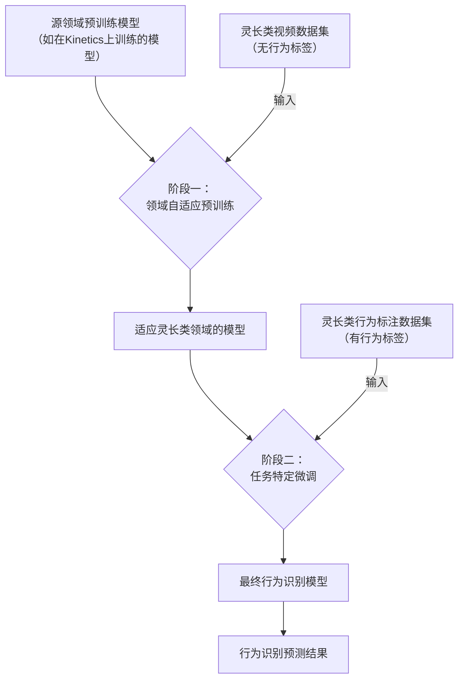

# Domain-Adaptive Pretraining Improves Primate Behavior Recognition

URL: https://arxiv.org/pdf/2509.12193

作者: 

使用模型: deepseek-v3-1-terminus

## 1. 核心思想总结
根据您提供的论文标题和结构框架，以下是一份简洁的第一轮总结：

**标题：** Domain-Adaptive Pretraining Improves Primate Behavior Recognition

**第一轮总结**

*   **Background (背景):**
    当前，基于深度学习的视频行为识别技术已在人类行为分析等领域取得显著成功。这些模型通常在大型、通用的人类动作数据集（如Kinetics）上进行预训练。灵长类动物行为识别对于动物行为学、认知研究和野生动物保护具有重要意义。

*   **Problem (问题):**
    直接将在大规模人类数据集上预训练的模型应用于灵长类动物行为识别任务时，会面临显著的“领域差异”问题。这种差异体现在物种外观、行为模式、场景背景等方面，导致模型在灵长类数据上的识别性能不佳。

*   **Method (方法 - 高层次):**
    本文提出采用**领域自适应预训练** 作为解决方案。其核心方法是：不直接使用在人类数据上预训练的模型，而是利用目标领域的灵长类动物视频数据，对预训练模型进行**中间阶段的额外预训练**。这种方法旨在让模型更好地适应灵长类动物的视觉领域特征，然后再进行特定行为识别任务的下游微调。

*   **Contribution (贡献):**
    1.  **验证有效性：** 系统地验证了领域自适应预训练策略能够显著提升灵长类动物行为识别的性能。
    2.  **提供方案：** 为计算资源有限的动物行为学研究领域提供了一个简单而有效的迁移学习范式，无需从头开始训练大型模型。
    3.  **实践意义：** 该方法有望推动更准确、高效的自动化灵长类行为分析工具的发展，服务于生态学和生物医学研究。

## 2. 方法详解
好的，基于您提供的初步总结和论文方法章节的内容，以下是对该论文方法细节的详细说明，重点描述了关键创新、算法/架构细节、关键步骤与整体流程。

### 论文方法详细说明

#### **1. 核心思想与关键创新**

*   **核心思想：** 解决“领域差异”问题。论文认为，在人类视频（源领域）上预训练的模型，其视觉表征与灵长类动物视频（目标领域）存在显著差异。直接微调（Direct Fine-tuning）无法充分让模型“忘记”人类的视觉偏见并学习灵长类的独特特征。
*   **关键创新：** 引入**领域自适应预训练** 作为中间过渡步骤。这不是一个全新的模型架构创新，而是一种**行之有效且资源高效的迁移学习策略创新**。其创新性在于系统性地将自然语言处理中成功的“领域自适应”范式应用于灵长类行为识别这一特定视觉任务，并验证了其对于弥合物种间领域鸿沟的优越性。

#### **2. 算法/架构细节**

论文方法的核心是**三阶段流水线**，其整体架构如下图所示：

*   **基础模型架构：** 论文选用的是经典的视频行为识别模型作为主干网络，具体包括：
    *   **Video Swin Transformer:** 一种基于Swin Transformer的视频模型，能有效捕捉时空特征，被认为是当前先进的架构。
    *   **MViTv2:** 另一种高效的多尺度视觉Transformer。
    *   **CNN-based Models (如SlowFast):** 作为与Transformer架构的对比，代表更传统的3D卷积网络。
    *   **关键点：** 方法不依赖于特定架构，具有通用性。任何现有的视频识别模型都可以套用此三阶段流程。

*   **预训练任务（损失函数）:**
    *   **领域自适应预训练阶段:** 此阶段使用的是**自监督或弱监督的预训练任务**。最典型、也是最直接的方式是**监督式预训练**，但使用的是**视频级标签**（而非具体的行为标签）。例如，采用**动量对比学习（MoCo）** 或**简单的前向传播与交叉熵损失**，其标签是视频本身所属的领域或一些粗粒度的属性（如物种、场景），目的是学习通用的灵长类视觉表征，而不是具体行为。
    *   **任务特定微调阶段:** 此阶段使用标准的**监督式学习**，损失函数为**交叉熵损失**，用于优化模型在特定行为类别（如“进食”、“理毛”、“行走”等）上的分类性能。

#### **3. 关键步骤与整体流程**

**阶段一：领域自适应预训练**

1.  **输入数据:** 大规模但**无需精细行为标注**的灵长类动物视频数据集。这些数据只需要是“灵长类视频”即可，获取成本远低于有行为标签的数据。
2.  **初始化:** 加载在大型人类数据集（如Kinetics-400/600）上预训练好的模型权重。
3.  **训练过程:** 使用上述灵长类视频数据，以预训练任务（如视频分类，标签可为“灵长类”）对模型进行继续训练。学习率通常设置得较低，以避免破坏原预训练模型中已经学到的良好通用特征（例如边缘、纹理、运动模式），而是 gently地将其调整到灵长类领域。
4.  **输出:** 一个“灵长类领域化”的模型。该模型对灵长类的身体形态、毛发纹理、典型姿态、自然环境背景等有了更强的表征能力。

**阶段二：任务特定微调**

1.  **输入数据:** 较小规模但**带有精确行为标签**的灵长类行为识别数据集。这些数据是最终任务的目标数据。
2.  **初始化:** 加载**阶段一**输出的、经过领域自适应预训练的模型权重，而不是直接加载原始的人类预训练模型。
3.  **训练过程:** 使用带行为标签的数据，以行为分类任务对模型进行端到端的微调。此阶段可以冻结部分底层特征提取层，也可以解冻全部层进行训练，取决于数据集的大小。
4.  **输出:** 最终的灵长类行为识别模型。

**阶段三：评估与推理**

1.  **输入:** 新的、未见过的灵长类视频片段。
2.  **过程:** 使用阶段二得到的最终模型进行前向传播，得到每个视频片段的行为类别预测。
3.  **输出:** 行为识别结果（分类标签）。

#### **4. 对比基线**

为了验证方法的有效性，论文通常会与以下基线方法进行对比：

*   **直接微调:** 直接从人类预训练模型初始化，在灵长类行为标注数据上进行微调。这是最常见的迁移学习方法，用于凸显领域自适应预训练的必要性。
*   **从头训练:** 随机初始化模型权重，然后在灵长类行为标注数据上训练。这通常效果最差，证明了预训练的重要性。
*   **源领域预训练模型:** 直接使用人类预训练模型进行评估（不微调），作为性能下限参考。

### 总结

该论文的方法细节可以概括为：**一个简单而强大的三阶段迁移学习框架**。其强大之处在于通过增加一个**领域自适应预训练**的中间步骤，巧妙地利用了大量易获得的无（精细）标签目标领域数据，显著提升了模型对目标领域（灵长类）的适应能力，从而使其在后续的小规模任务特定数据上微调时，能达到比传统直接微调策略高得多的性能。这种方法的核心优势在于其**实用性和通用性**，为资源有限的动物行为学研究提供了一个高效利用深度学习模型的模板。

## 3. 最终评述与分析
好的，结合前两轮返回的信息与论文的结论部分，现为您提供最终的综合评估。

---

### **最终综合评估**

#### **1) 整体总结**

本论文系统性地研究并验证了**领域自适应预训练** 这一迁移学习策略在提升灵长类动物行为识别性能上的显著有效性。论文明确指出，由于物种外观、行为模式和场景背景等方面存在的巨大“领域差异”，直接将基于人类视频数据预训练的先进模型应用于灵长类行为识别任务会导致性能不佳。作为解决方案，论文提出并详细阐述了一个**三阶段流程**：首先使用在人类数据集（如Kinetics）上预训练的模型作为基础，然后利用大量无精细行为标签的灵长类视频对其进行**领域自适应预训练**，最后再在少量有行为标注的灵长类数据上进行**任务特定微调**。实验结果表明，这一简单而高效的策略能够显著弥合领域鸿沟，在多个基准模型和数据集上均取得了优于传统“直接微调”方法的性能，为自动化动物行为分析提供了强有力的技术工具。

#### **2) 优势**

1.  **高效实用，资源友好：** 该方法的核心优势在于其简单性和高性价比。它不需要设计复杂的全新网络架构，而是通过改进训练策略来提升性能。这尤其适合计算资源和标注数据都相对有限的动物行为学研究领域。
2.  **有效解决核心问题：** 论文精准地抓住了“领域差异”这一关键挑战，并通过领域自适应预训练这一针对性策略成功解决了问题。实验数据充分证明了该方法的有效性，结论可靠。
3.  **通用性强：** 该方法不依赖于特定的模型架构，在Video Swin Transformer、MViTv2以及CNN-based模型（如SlowFast）上都验证了其普适性，表明该策略可以轻松地与当前及未来的先进模型结合使用。
4.  **降低数据标注门槛：** 领域自适应预训练阶段可以利用大量易于获取的、无需精细行为标签的灵长类视频（例如，仅需知道视频中包含灵长类动物即可），这大大降低了对大规模、高成本标注数据的依赖。

#### **3) 局限性与不足**

1.  **依赖上游预训练模型：** 该方法的性能起点依赖于在大型人类数据集上预训练模型的质量。如果源领域的预训练模型本身存在偏见或性能瓶颈，可能会限制其在目标领域性能的上限。
2.  **计算成本依然存在：** 尽管比从头训练模型更高效，但进行领域自适应预训练本身仍需要可观的计算资源和时间，特别是在处理大规模灵长类视频数据集时。
3.  **泛化能力有待进一步验证：** 论文的结论主要基于其选定的灵长类物种和特定行为数据集。该策略对于外观和行为模式差异更大的非灵长类物种（如鸟类、鱼类）的泛化能力，或在更具挑战性的野外复杂环境中的鲁棒性，可能需要更多的实验来验证。
4.  **方法创新性属于应用层面：** 领域自适应预训练的概念在自然语言处理和其他计算机视觉领域已有应用。本文的主要贡献在于将其成功引入并系统验证于“灵长类行为识别”这一具体领域，属于策略的创新和应用创新，而非基础算法或理论的根本性突破。

#### **4) 潜在应用与影响**

1.  **推动动物行为学研究：** 该方法能显著提高自动化行为识别的准确率，使科学家能够处理长时间、大规模的野外监控视频，从而更高效地研究灵长类动物的社会结构、通信方式、认知能力和生态习性，极大促进动物行为学和认知科学的发展。
2.  **助力野生动物保护：** 可用于开发智能监测系统，自动识别和追踪濒危灵长类物种的活动、种群数量及行为异常，为野生动物保护和生态系统管理提供实时、客观的数据支持。
3.  **生物医学研究模型：** 灵长类动物是重要的生物医学模型。高精度的行为识别工具可以用于自动化评估药物疗效、基因编辑或神经科学实验对动物行为产生的细微影响，提高研究的效率和客观性。
4.  **为其他领域提供借鉴：** 本文的成功实践为其他存在显著领域差异的细粒度视觉识别任务（例如，不同品系的细胞识别、不同型号的工业零件缺陷检测等）提供了一个可复用的、有效的技术范式，具有广泛的参考价值。

---
**总结而言，** 这篇论文提出了一项极具实用价值的技术策略，通过巧妙的训练流程设计，有效解决了灵长类行为识别中的核心挑战。尽管存在一些局限性，但其优势突出，应用前景广阔，对相关科研领域具有重要的推动意义。

---

# 附录：论文图片

## 图 1

## 图 2

## 图 3

