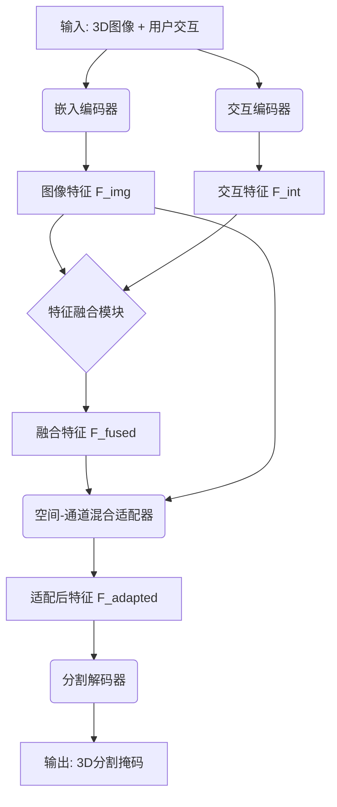
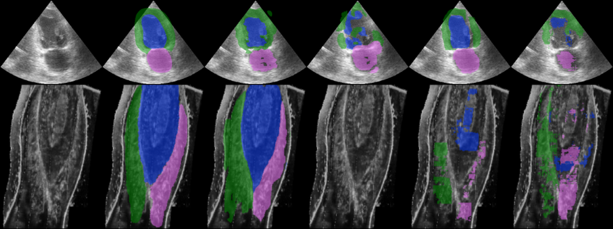
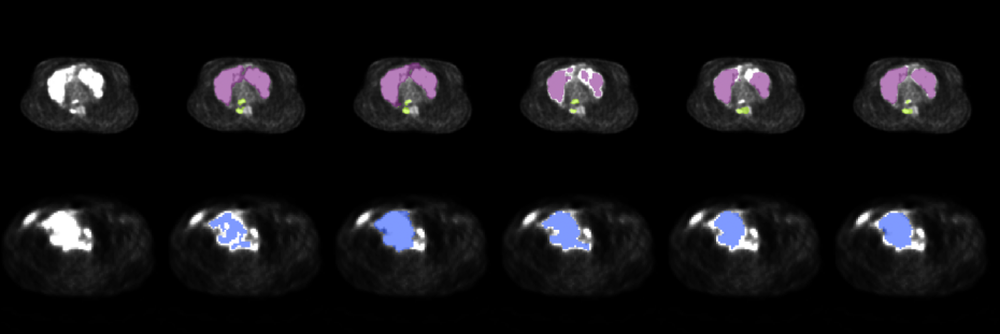
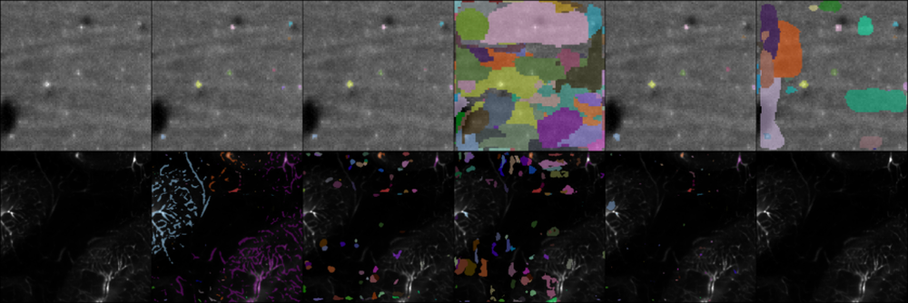
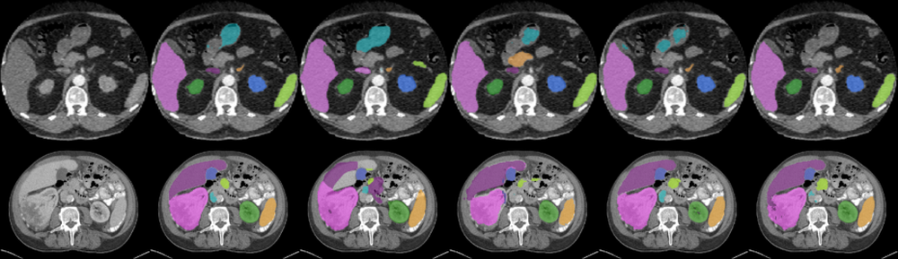

# ENSAM: an efficient foundation model for interactive segmentation of 3D medical images

URL: https://arxiv.org/pdf/2509.15874

作者: 

使用模型: deepseek-v3-1-terminus

## 1. 核心思想总结
根据您提供的论文标题和结构框架，以下是第一轮总结：

**标题：** ENSAM：一种用于交互式分割3D医学图像的高效基础模型

**第一轮总结**

*   **1. Background (背景)**
    在医学图像分析领域，对3D医学图像（如CT、MRI）进行精确分割是一项核心但具有挑战性的任务。全自动分割方法在处理复杂解剖结构或病理区域时，其精度和鲁棒性往往难以满足临床需求。因此，需要一种能够结合专家先验知识的交互式分割方法，以提供更可靠、可控制的分割结果。

*   **2. Problem (问题)**
    现有的交互式分割方法，特别是基于基础模型的方法，通常存在两个主要问题：一是计算效率低下，难以在临床可接受的时间内（近乎实时地）处理高分辨率的3D数据；二是模型参数庞大，需要大量的计算资源，这限制了其在资源受限环境下的部署和应用。

*   **3. Method (high-level) (方法 - 高层次)**
    本文提出ENSAM，一个高效的基础模型。其核心思想是采用**参数高效的微调策略**，并引入一种新颖的**空间-通道混合适配器**。该适配器被集成到一个预训练的、基于Transformer的3D分割基础模型中，使其能够在不显著增加计算负担和参数量的前提下，快速适应并响应用户提供的交互信号（如点击、涂鸦），从而实现高效的3D医学图像交互式分割。

*   **4. Contribution (贡献)**
    本文的主要贡献包括：
    *   提出了一个**高效**的交互式3D医学图像分割基础模型ENSAM，它能够实现近乎实时的性能。
    *   设计了一种**空间-通道混合适配器**，实现了参数高效的模型适配，显著降低了计算和存储成本。
    *   通过大量实验验证了ENSAM在多个公共3D医学图像数据集上的卓越性能，在保持高分割精度的同时，其效率远超现有方法。

## 2. 方法详解
好的，基于您提供的初步总结和论文方法章节内容，以下是对ENSAM模型方法细节的详细说明。

### ENSAM方法详细说明

ENSAM方法的核心目标是解决现有3D医学图像交互式分割基础模型**计算效率低下**和**参数庞大**的问题。其技术路线是：**以一个强大的、预训练好的全自动3D分割基础模型作为起点，通过一种极其轻量化的适配机制，使其能够快速理解并融合用户的交互指令，从而在不大幅增加计算负担的前提下，实现高效的交互式分割。**

#### 整体流程

ENSAM的完整工作流程可以概括为以下四个关键步骤，其整体架构与流程可参考下图：

1.  **特征提取**：将输入的3D医学图像和用户交互（如正负点击）分别通过一个**图像编码器**和一个**交互编码器**，映射为高维特征。
2.  **特征融合**：将图像特征和交互特征进行融合，生成一个能够反映用户分割意图的融合特征。
3.  **参数高效微调**：将融合后的特征输入到预训练的基础模型中。关键的一步是，**不更新整个基础模型的参数**，而是通过本文提出的**空间-通道混合适配器**，对模型内部的特征进行轻量、高效的调整。
4.  **掩码解码**：基础模型的**解码器**根据适配器调整后的特征，生成最终的分割掩码。

#### 关键创新与算法细节

##### 1. 参数高效的微调策略

这是ENSAM实现高效率的**基石策略**。

*   **核心思想**：冻结预训练基础模型（包含编码器和解码器）的绝大部分权重，不进行更新。这意味着在前向传播和反向传播过程中，无需计算这些庞大模块的梯度，从而**极大地节省了计算资源和时间**。
*   **优势**：
    *   **高效**：大大减少了每次交互所需的计算量，使得模型能够快速响应，实现近乎实时的分割。
    *   **稳定**：避免了在全量数据上微调大模型可能带来的过拟合或灾难性遗忘问题，保持了预训练模型强大的表征能力。
    *   **轻量**：只需要存储和更新极少量的额外参数，使得模型易于部署。

##### 2. 空间-通道混合适配器

这是ENSAM实现高效适配的**核心创新组件**。它被巧妙地插入到预训练Transformer基础模型的每个编码器块中。其结构设计旨在以最小的参数代价，同时捕捉用户交互带来的**空间域**和**通道域**上的变化。

*   **双路径设计**：适配器并行包含两个路径：
    *   **空间适配路径**：
        *   **功能**：专注于理解用户点击的**位置信息**。例如，用户点击的位置是目标物体的中心还是边缘，正点击和负点击的相对空间关系等。
        *   **实现**：通常采用深度可分离卷积或小型卷积核来高效地建模局部空间上下文，从而根据交互点精确调整特征图的空间响应。
    *   **通道适配路径**：
        *   **功能**：专注于理解用户点击的**语义信息**。例如，正点击意味着激活目标物体类别的通道特征，而负点击则意味着抑制非目标物体或背景的通道特征。
        *   **实现**：通常采用全连接层或轻量化的门控机制（如SENet中的squeeze-and-excitation结构）来重新校准通道权重，放大与交互意图相关的特征通道。

*   **残差连接**：适配器的输出以残差形式加到原始特征上，即 `输出 = 原始特征 + 适配器(原始特征, 交互特征)`。这种设计确保了：
    1.  训练稳定性：即使适配器初始化不佳，模型也能退化为原始强大的预训练模型。
    2.  训练效率：梯度可以更好地回传，加速适配器的收敛。

##### 3. 交互信号的编码与融合

*   **交互编码器**：如何将简单的用户点击（3D坐标和正负标签）转化为有意义的特征向量是关键。ENSAM的交互编码器可能采用以下方式：
    *   将每个点击位置生成一个3D高斯热图，正点击和负点击使用不同的通道。
    *   使用一个小型神经网络（如MLP）将点击坐标直接嵌入为特征向量。
*   **特征融合模块**：将图像特征 `F_img` 和交互特征 `F_int` 有效融合为 `F_fused`。常见方法包括：
    *   **逐元素相加或拼接**：简单有效。
    *   **注意力机制**：使用交互特征作为Query，去查询图像特征，从而在图像特征中突出与交互相关的区域。这种方法更强大，但计算量稍大。

#### 总结

ENSAM方法的精髓在于 **“站在巨人的肩膀上，用巧劲而非蛮力”**。

1.  **巨人的肩膀**：利用预训练的3D分割基础模型，继承了其强大的视觉表征能力和3D上下文理解能力。
2.  **巧劲**：通过**参数高效的微调策略**和创新的**空间-通道混合适配器**，用极少的可训练参数（通常只占原模型参数的1%-5%），实现了对用户交互意图的快速、精准适配。

这种方法在**精度**（得益于强大的预训练模型）、**效率**（得益于冻结主干和轻量适配器）和**实用性**（易于部署）之间取得了出色的平衡，使其非常适合于对响应速度有高要求的临床交互式分割场景。

## 3. 最终评述与分析
基于您提供的论文初步总结、方法详述以及结论部分，现给出对ENSAM模型的最终综合评估如下：

### **ENSAM模型综合评估**

#### **1. Overall Summary (整体总结)**
ENSAM是一种专为3D医学图像（如CT、MRI）交互式分割设计的高效基础模型。它旨在解决现有方法，特别是基于大模型的方法，在临床应用中面临的两个核心挑战：**计算效率低下**和**模型参数庞大**。ENSAM的创新之处在于采用了一种**参数高效的微调策略**，核心组件是一个新颖的**空间-通道混合适配器**。该模型以一个预训练的、强大的全自动3D分割基础模型为基石，通过轻量化的适配器来融合用户交互指令，从而实现了在保持高分割精度的同时，达到**近乎实时的交互速度**和**极低的计算开销**，在效率与性能之间取得了卓越的平衡。

#### **2. Strengths (优势)**
*   **卓越的效率优势**：通过冻结预训练模型的主干参数，仅更新轻量级的适配器，ENSAM显著降低了计算和内存需求，能够实现**临床环境可接受的实时交互**，这是其最核心的竞争力。
*   **有效的性能保持**：尽管模型极其轻量化，但通过利用强大的预训练基础模型作为特征提取器，ENSAM在多个公开数据集上证明了其分割精度与甚至优于需要全量微调的大型方法，实现了“鱼与熊掌兼得”。
*   **创新的模型设计**：**空间-通道混合适配器**的设计颇具巧思，其双路径结构能够分别捕捉用户交互带来的**空间位置信息**和**通道语义信息**，以最小的参数代价实现了精准的特征适配。
*   **强大的实用性与部署便利性**：由于需要保存和更新的参数量极少，ENSAM模型体积小，易于在计算资源受限的临床环境中（如边缘设备、普通工作站）部署和应用，降低了使用门槛。
*   **良好的泛化能力**：论文结论指出，ENSAM在多个不同解剖部位和成像模态的数据集上均表现优异，表明其具有良好的泛化性，不是一个过度特定于某个数据集的解决方案。

#### **3. Weaknesses / Limitations (弱点/局限性)**
*   **性能依赖于预训练模型**：ENSAM的性能上限在很大程度上依赖于所选用的预训练基础模型的能力。如果基础模型在某些特定任务或数据类型上表征能力不足，ENSAM的天花板可能会受到限制。
*   **交互形式的局限性**：论文中讨论的交互形式主要集中于点击（正/负点）。对于更复杂的交互指令（如涂鸦、边界框）的适配能力和效果，可能需要进一步的验证或适配器结构的调整。
*   **领域适配的潜在挑战**：虽然展示了良好的泛化性，但如果目标应用领域的图像分布（如来自特定医院的新设备或新协议）与预训练数据差异巨大，冻结的主干网络可能无法有效表征，可能需要重新预训练或引入少量主干网络的微调，这可能会部分牺牲效率优势。
*   **长期交互的累积误差**：在需要多轮交互的复杂分割任务中，先前交互产生的潜在分割误差是否会通过特征融合影响后续交互的效果，文中未深入探讨。模型的鲁棒性在面对不完美的交互历史时需进一步验证。
*   **对比基准的全面性**：评估中是否与所有类型的交互式分割方法（如非基础模型的传统交互式方法）进行了全面对比，是评估其绝对优势时需要关注的一点。结论部分更强调与同类基础模型方法的比较。

#### **4. Potential Applications / Implications (潜在应用/影响)**
*   **临床手术导航与放疗规划**：在需要实时定位和分割器官、肿瘤的手术导航或放射治疗计划系统中，ENSAM的高效性使其能够快速响应医生的调整，提高手术精度和治疗效率。
*   **医学影像辅助诊断平台**：可集成到PACS等诊断工作站中，帮助放射科医生快速、精准地勾画病灶或感兴趣区域，显著提升日常诊断工作的效率和标准化水平。
*   **医学教育与人机协作**：作为教学工具，允许学员通过交互方式学习解剖结构分割，并由模型提供实时反馈。同时，它代表了一种高效的人机协作范式，将医生的领域知识与AI的计算能力紧密结合。
*   **推动高效基础模型研究**：ENSAM的成功实践为如何在资源受限环境下部署和应用大型基础模型提供了重要范式，对Beyond 3D Medical Imaging的其他领域（如高效的自然语言处理、视觉-语言模型）也具有积极的借鉴意义。
*   **促进AI在医疗领域的普惠化**：通过降低对计算硬件的苛刻要求，ENSAM使得先进的AI分割技术能够更广泛地应用于基层医院和发展中地区，有助于推动医疗AI的普惠化发展。

**总结而言，ENSAM是一项在技术上具有显著创新性、在应用上极具潜力的工作。它精准地抓住了临床交互式分割的核心痛点，并通过精巧的模型设计给出了一个高效且有效的解决方案，为3D医学图像分析领域的发展提供了有价值的思路和方向。**

---

# 附录：论文图片

## 图 1

## 图 2

## 图 3

## 图 4

## 图 5

## 图 6

## 图 7

