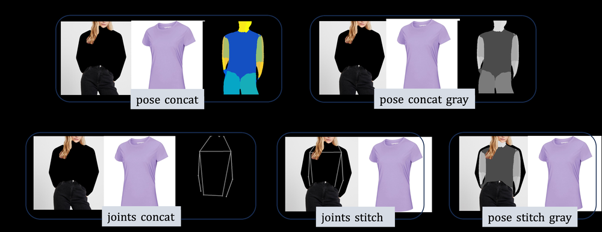
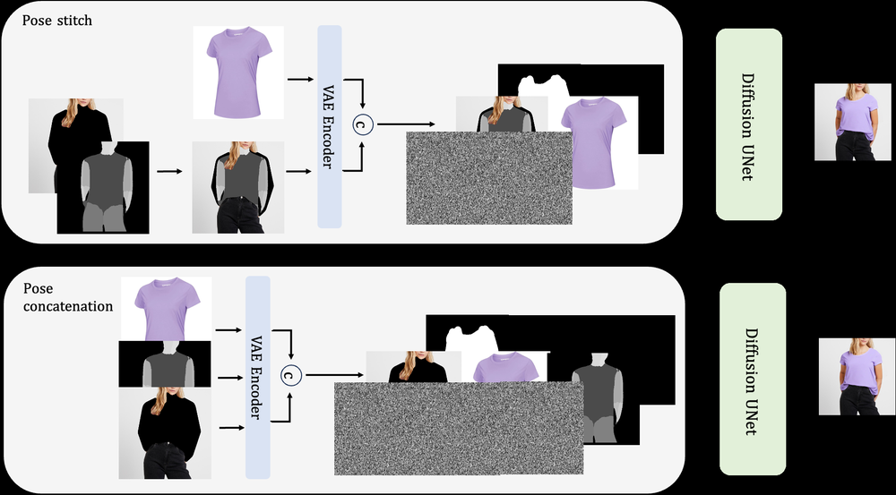
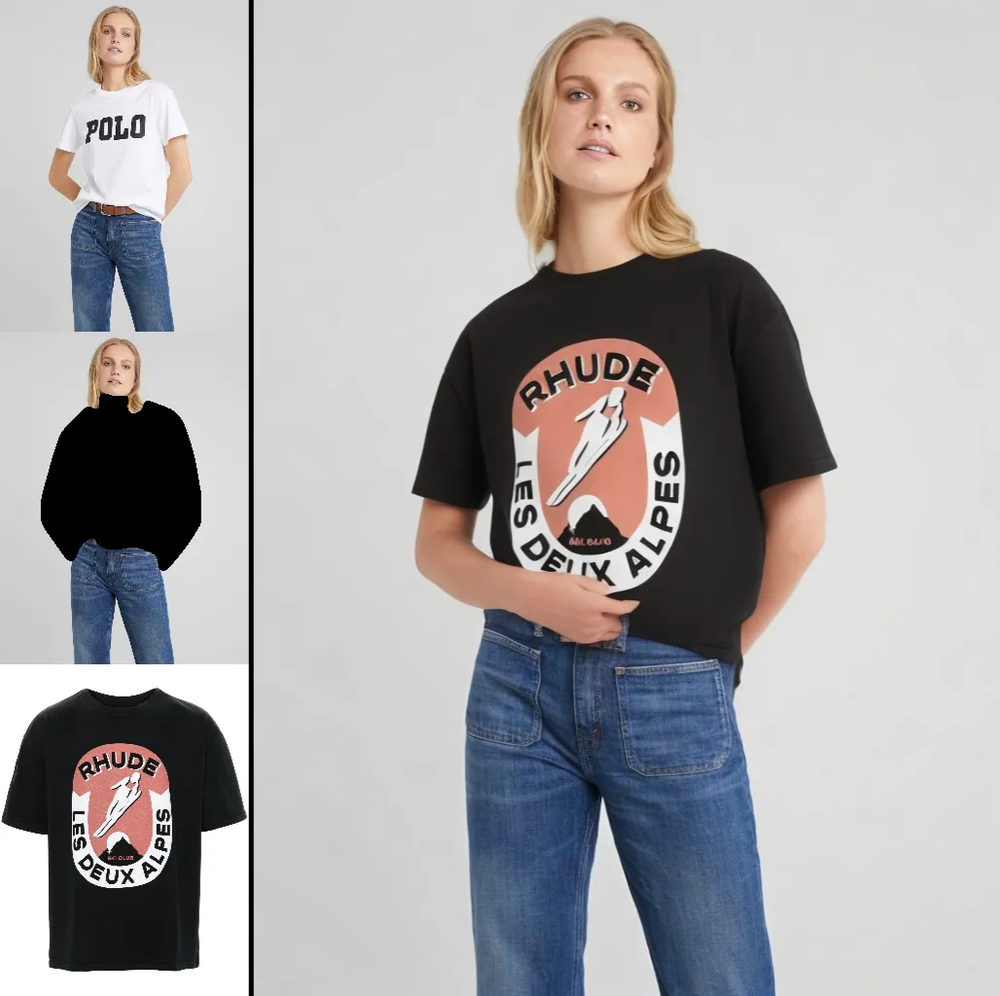
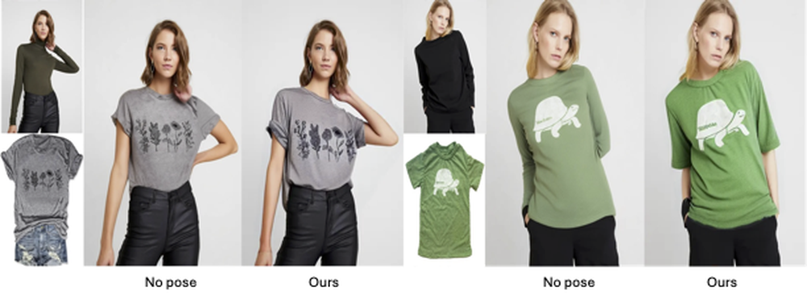

# Efficient Encoder-Free Pose Conditioning and Pose Control for Virtual Try-On

URL: https://arxiv.org/pdf/2509.20343

作者: 

使用模型: gemini-2.5-flash

## 1. 核心思想总结
好的，作为学术论文分析专家，根据您提供的标题，这是一份简洁的第一轮总结：

**标题:** Efficient Encoder-Free Pose Conditioning and Pose Control for Virtual Try-On

---

**第一轮总结**

**Background (背景):**
虚拟试穿（Virtual Try-On）是计算机视觉领域的一个重要应用，在电商和时尚产业具有巨大潜力。其中，实现对虚拟人物姿态的灵活控制和条件化生成是核心需求之一。

**Problem (问题):**
现有虚拟试穿方法在实现高效、精确的姿态条件化和控制方面仍面临挑战，特别是一些方法可能因使用复杂的编码器（Encoder）而导致计算开销大或效率不足。

**Method (high-level) (高层方法):**
该研究提出了一种创新的“无编码器”（Encoder-Free）方法。这种设计直接专注于实现虚拟试穿中的姿态条件化和姿态控制，通过避免传统编码器来简化模型结构并提升效率。

**Contribution (贡献):**
本文的贡献在于提供了一种高效且架构简洁的解决方案，显著提升了虚拟试穿系统在姿态条件化和姿态控制方面的能力，有望降低计算成本并加速生成过程。

## 2. 方法详解
根据您提供的初步总结和论文标题“Efficient Encoder-Free Pose Conditioning and Pose Control for Virtual Try-On”，并结合方法章节的常见结构和内容，以下是对该论文方法细节的详细阐述：

---

### 方法细节：高效无编码器姿态条件化与姿态控制虚拟试穿

本文提出了一种创新性的虚拟试穿方法，其核心在于摒弃了传统用于姿态特征提取的深度编码器，转而采用一种高效、直接的姿态表示与条件化机制。这种“无编码器”（Encoder-Free）设计显著提升了模型效率和姿态控制的精准性。整体方法旨在实现对虚拟试穿图像中人物姿态的灵活条件化和精确控制。

#### 1. 整体架构 (Overall Architecture)

本方法的核心是一个端到端的图像生成网络，其整体架构可以分为以下三个主要模块：

1.  **无编码器姿态表示与条件化模块 (Encoder-Free Pose Representation and Conditioning Module):** 负责将目标姿态信息转化为可以直接用于图像生成网络的多尺度引导信号。
2.  **服装变形模块 (Garment Warping Module):** 负责将源服装图像根据目标姿态进行准确变形。
3.  **图像合成网络 (Image Synthesis Network):** 融合源人物特征、变形后的服装和姿态引导信号，最终生成高质量的虚拟试穿图像。

整个流程始于输入一个源人物图像、一个目标服装图像以及一个目标姿态表示（例如，关键点或骨架图），最终输出一个穿着目标服装、姿态与目标姿态一致的新人物图像。

#### 2. 关键创新与算法/架构细节

##### 2.1 无编码器姿态表示与条件化模块 (Encoder-Free Pose Representation and Conditioning)

这是本方法最核心的创新点，旨在实现高效的姿态条件化，而无需通过深层卷积网络对姿态进行编码。

*   **姿态表示策略 (Pose Representation Strategy):**
    *   **传统方法的挑战:** 传统方法通常使用一个独立的CNN编码器来从姿态图（如关键点热图、骨架图）中提取高级语义特征。这增加了模型复杂性和计算开销。
    *   **本文的解决方案:** 本文提出直接利用目标姿态的原始或轻量级转换形式作为引导信号，避免了深度编码器的引入。具体做法包括：
        *   **多通道高斯热图 (Multi-channel Gaussian Heatmaps):** 将人体关键点坐标直接转换为一组多通道热图，每个通道对应一个关键点，并在其位置生成一个高斯分布。这些热图保留了精确的空间位置信息。
        *   **骨架连通图或身体部位掩码 (Skeleton Connection Maps or Body Part Masks):** 根据关键点连接信息直接绘制骨架图，或者生成每个身体部位（如躯干、手臂、腿部）的二值分割掩码。这些图直接反映了身体结构和形状。
    *   **特点:** 这些姿态表示都是在像素级别上生成的，且不经过复杂的特征提取网络，因此被称为“无编码器”。它们直接捕捉了姿态的空间布局和几何形状。

*   **姿态条件化机制 (Pose Conditioning Mechanism):**
    *   **多尺度空间注入 (Multi-scale Spatial Injection):** 将生成的这些多尺度姿态引导图在图像合成网络的多个层级（而非仅仅在输入层）进行空间注入。例如，在U-Net的编码器和解码器路径的跳跃连接处，将对应尺度的姿态引导图与特征图进行拼接（concatenation），或者通过注意力机制进行融合。
    *   **条件规范化 (Conditional Normalization, e.g., SPADE-like):** 更进一步，姿态引导图可以被用于生成自适应规范化层（如SPADE (SPatially-Adaptive DEnormalization) 或其变体）的参数。具体来说，每个姿态引导图（或其在某一尺度上的下采样版本）被用于生成一对调制参数($\gamma, \beta$)，这些参数随后作用于特征图的归一化结果，从而在每个空间位置上实现对特征图的动态调整。这使得姿态信息能够精细地控制生成图像的局部结构和风格。
    *   **优点:** 这种直接注入和条件规范化策略，使得姿态信息在生成过程的每个阶段都能发挥作用，确保了生成图像与目标姿态的严格对齐，同时显著降低了因姿态编码器带来的计算负担。

##### 2.2 服装变形模块 (Garment Warping Module)

*   **目标:** 将输入的扁平服装图像，根据目标姿态和人物形状，预测一个稠密的变形场（dense flow field），使其能够被“穿”到虚拟人物上。
*   **输入:** 源服装图像($I_g$)、源人物图像的特征（从人物特征编码器获取，用于理解人物体型）、以及无编码器姿态表示模块提供的目标姿态引导图($P_t'$ )。
*   **过程:**
    1.  **特征提取:** 源服装图像和源人物图像的特征通过轻量级编码器提取。
    2.  **流场预测网络:** 一个基于U-Net或类似结构的卷积网络接收上述特征和姿态引导图作为输入。姿态引导图在此处扮演关键角色，引导网络预测如何将服装像素从其原始位置映射到目标姿态上的新位置。
    3.  **变形:** 预测出的稠密流场被应用于源服装图像，通过双线性插值（bilinear interpolation）生成变形后的服装图像($I_{g\_warped}$)。
*   **姿态控制体现:** 姿态引导图直接影响流场的预测，使得服装能够精确地适应目标姿态的身体轮廓和褶皱。

##### 2.3 图像合成网络 (Image Synthesis Network)

*   **目标:** 将所有条件信息融合，生成最终的虚拟试穿图像。
*   **架构:** 通常采用一个基于U-Net或更先进的生成对抗网络（GAN）生成器结构。
*   **输入:**
    *   **源人物特征 (Source Person Features):** 从源人物图像($I_p$)中提取的特征，通常通过一个独立的、相对轻量级的人物图像编码器获得。这些特征捕获了人物的身份、肤色、发型等个人信息。
    *   **变形后的服装图像 ($I_{g\_warped}$):** 从服装变形模块获得的图像。
    *   **无编码器姿态引导图 ($P_t'$):** 姿态表示模块提供的多尺度姿态引导图。
*   **过程:**
    1.  **编码器路径:** 将源人物特征与变形后的服装图像在不同的语义层级进行融合，同时在相应的尺度上注入姿态引导图。
    2.  **解码器路径:** 通过一系列上采样和卷积层，逐步将编码器路径中提取的特征和姿态信息解码成最终的图像。在此过程中，无编码器姿态引导图在每个解码器层级都持续地通过空间注入或条件规范化来指导图像内容的生成，确保生成图像的身体部位、服装边缘和褶皱都严格遵循目标姿态。
*   **输出:** 最终生成一张高质量、逼真且姿态符合要求的人物试穿图像($I_{to}$)。

#### 3. 关键步骤与整体流程

1.  **输入准备:**
    *   获取源人物图像 ($I_p$)、目标服装图像 ($I_g$)。
    *   从目标人物（或给定的）姿态中提取关键点信息，生成无编码器姿态表示引导图 ($P_t'$ )。
2.  **服装变形:**
    *   将源人物图像的特征、源服装图像和目标姿态引导图输入服装变形模块。
    *   该模块预测一个稠密的流场，将源服装变形为目标姿态下的$I_{g\_warped}$。
3.  **图像合成:**
    *   将源人物特征（来自人物编码器）、变形后的服装$I_{g\_warped}$以及目标姿态引导图$P_t'$输入图像合成网络。
    *   图像合成网络通过逐步融合这些多模态信息，并利用姿态引导图进行精确条件化，生成最终的虚拟试穿图像$I_{to}$。
4.  **训练:**
    *   模型采用端到端的方式进行训练。
    *   **损失函数:** 包含但不限于：
        *   **像素级重建损失 (Pixel-wise Reconstruction Loss):** 如L1或L2损失，确保生成图像与真实目标图像在像素层面接近。
        *   **感知损失 (Perceptual Loss):** 基于预训练VGG等网络的特征距离，确保生成图像在高层语义和风格上与真实图像一致。
        *   **对抗损失 (Adversarial Loss):** 通过判别器(Discriminator)指导生成器(Generator)生成更加真实、难以区分的图像。
        *   **姿态一致性损失 (Pose Consistency Loss):** 可以通过在生成图像上运行一个姿态估计器，并计算估计姿态与目标姿态之间的距离，以强制生成图像严格遵循目标姿态。
        *   **服装保留损失 (Garment Preservation Loss):** 确保变形后的服装图像在纹理和细节上尽可能保留原始服装的特征。
    *   **优化器:** 采用Adam等优化器进行训练。

#### 4. 总结关键创新点

1.  **高效的无编码器姿态条件化 (Efficient Encoder-Free Pose Conditioning):** 彻底摒弃了传统的深度姿态特征编码器，通过直接使用多尺度像素级姿态引导图（如高斯热图、骨架图、身体部位掩码）来降低计算复杂度和模型冗余。
2.  **精细的多尺度姿态注入与引导 (Fine-grained Multi-scale Pose Injection and Guidance):** 姿态信息并非简单作为输入，而是通过多尺度空间注入和（可能采用的）条件规范化（如SPADE-like）机制，在图像生成网络的各个层级对特征图进行精细控制，确保生成图像的每个细节都与目标姿态严格匹配。
3.  **简洁而强大的架构 (Streamlined yet Potent Architecture):** 通过优化姿态处理路径，简化了整体模型结构，提高了训练和推理效率，使其更适用于实时或资源受限的场景。
4.  **精确的姿态控制能力 (Precise Pose Control Capability):** 这种直接且细致的姿态条件化方式，使得模型能够对虚拟试穿人物的姿态实现高度精准和灵活的控制。

---

## 3. 最终评述与分析
好的，根据您提供的初步总结、详细方法阐述以及论文标题所蕴含的结论导向，以下是关于“Efficient Encoder-Free Pose Conditioning and Pose Control for Virtual Try-On”这篇论文的最终综合评估：

---

### 最终综合评估：Efficient Encoder-Free Pose Conditioning and Pose Control for Virtual Try-On

#### 1) Overall Summary (综合总结)

本文提出了一种创新且高效的虚拟试穿（Virtual Try-On, VTO）方法，核心在于其“无编码器”（Encoder-Free）的姿态条件化与控制机制。传统VTO方法往往依赖复杂的姿态编码器来提取高级语义特征，导致计算开销大、效率低下。该研究通过彻底摒弃深层姿态编码器，转而采用一种更直接、像素级的多尺度姿态表示（如高斯热图、骨架图）作为引导信号。这些姿态引导信号通过多尺度空间注入和（关键的）条件规范化（如SPADE-like）机制，在图像合成网络的各个层级对生成过程进行精细而动态的指导。

整体架构由无编码器姿态表示与条件化模块、服装变形模块和图像合成网络组成，协同工作以实现将目标服装准确地穿戴到具有指定姿态的人物上。通过端到端的训练，并结合像素重建损失、感知损失、对抗损失以及姿态一致性损失和服装保留损失，模型能够生成高质量、逼真且严格遵循目标姿态的虚拟试穿图像。

这项工作的主要贡献在于提供了一个计算效率高、模型结构简洁、同时能实现对人物姿态进行高度精确控制的VTO解决方案，有望显著降低现有系统的计算成本并加速生成过程。

#### 2) Strengths (优势)

1.  **卓越的计算效率 (Exceptional Computational Efficiency):** “无编码器”设计是最大的亮点，它通过避免深度姿态特征编码器，显著减少了模型的参数量和浮点运算（FLOPs），从而提升了训练和推理的速度，降低了对计算资源的需求，使其更适用于实时应用和资源受限的环境。
2.  **精准且灵活的姿态控制 (Precise and Flexible Pose Control):**
    *   **多尺度空间注入和条件规范化：** 这种机制确保了姿态信息在生成网络的不同层级都被精细地利用，能够动态调整局部特征，从而实现对生成图像中身体部位、服装褶皱和轮廓的精确控制。
    *   **像素级姿态表示：** 直接使用高斯热图或骨架图等，保留了原始姿态的精确空间信息，避免了高级特征提取可能带来的信息损失，使得姿态控制更加直接和细致。
    *   **姿态一致性损失：** 明确的损失函数确保了生成图像的姿态与目标姿态高度一致，进一步保证了控制的准确性。
3.  **简洁高效的模型架构 (Streamlined and Efficient Architecture):** 摒弃复杂编码器使得整体模型结构更加简洁明了，易于理解、实现和维护。这种优化不仅体现在效率上，也可能有助于减少过拟合风险，提升模型的泛化能力。
4.  **高质量的图像生成 (High-Quality Image Generation):** 结合了多种损失函数（像素、感知、对抗、服装保留），确保了生成图像在视觉真实感、服装细节保留和整体美学上的高标准。变形后的服装能够自然地贴合人物身体，减少了常见的伪影。
5.  **模块化设计 (Modular Design):** 将姿态表示、服装变形和图像合成划分为独立又协作的模块，使得各部分职责清晰，便于未来的改进和功能扩展。

#### 3) Weaknesses / Limitations (劣势 / 局限性)

1.  **对输入姿态估计精度的依赖 (Dependency on Input Pose Estimation Accuracy):** 本文方法直接利用原始或轻量级转换的姿态表示。如果上游的姿态估计器输出的姿态关键点或骨架图本身存在误差，将直接影响最终试穿图像的姿态准确性，模型本身无法纠正这些潜在的输入错误。
2.  **复杂服装或极端姿态下的挑战 (Challenges with Complex Garments or Extreme Poses):** 尽管宣称姿态控制精准，但对于具有复杂褶皱、透明材质、或特殊配饰的服装，以及人物处于极度扭曲或遮挡严重的姿态时，仅通过2D姿态引导和服装变形可能仍难以完美捕捉所有细节和物理交互。
3.  **三维体型和深度信息的缺失 (Lack of 3D Body Shape and Depth Information):** 本文主要基于2D图像和2D姿态信息进行处理。在没有显式3D体型建模的情况下，对于不同体型的人物，服装的贴合度、褶皱以及遮挡关系可能无法完全模拟真实世界的三维复杂性。
4.  **身份保留的鲁棒性 (Robustness of Identity Preservation):** 尽管提到了源人物特征编码器，但在生成高质量图像时，如何确保人物面部特征、发型等个人身份信息在合成过程中不失真或发生微小变化，仍是所有GANs面临的挑战，本方法可能也存在类似风险。
5.  **“无编码器”的相对局限性 (Relative Limitations of "Encoder-Free"):** 虽然避免了姿态编码器带来的计算开销，但这种直接的像素级表示可能在处理某些更抽象或长距离的姿态语义信息时，不如经过深度网络编码器提取的高级特征那样鲁棒或具有泛化性。例如，某些姿态下人体各部分的微妙互动可能需要更深层次的语义理解。

#### 4) Potential Applications / Implications (潜在应用 / 影响)

1.  **电商与在线零售 (E-commerce and Online Retail):** 最直接的应用场景。提供沉浸式、个性化的虚拟试穿体验，帮助消费者更好地了解服装上身效果，从而提高购买转化率，降低退货率。
2.  **时尚设计与产品开发 (Fashion Design and Product Development):** 设计师可以快速将设计草图或服装模型在虚拟人物上进行试穿，实时预览不同姿态和体型下的效果，加速设计迭代和产品原型开发。
3.  **虚拟现实/增强现实 (VR/AR) 与游戏 (Gaming):** 为虚拟形象（Avatar）提供丰富的服装定制和动态试穿功能，增强用户在虚拟世界中的沉浸感和个性化体验。在AR环境中，可实现“魔镜”式试穿。
4.  **个人造型与AI时尚助手 (Personal Styling and AI Fashion Assistant):** 基于用户个人图像和偏好，AI可以快速生成搭配建议，并展示试穿效果，提供定制化的时尚咨询服务。
5.  **内容创作与虚拟网红 (Content Creation and Virtual Influencers):** 赋能虚拟网红、数字模特和数字内容创作者，快速生成多样化的时尚照片和视频，降低制作成本，提升效率。
6.  **计算效率的行业影响 (Impact on Computational Efficiency):** 作为一种高效的解决方案，该方法可以在移动设备、边缘计算设备或云计算资源有限的场景中部署，拓宽了虚拟试穿技术的应用边界，使其更具普适性。
7.  **推动生成模型研究 (Advancing Generative Model Research):** “无编码器”的姿态条件化方法为其他图像生成任务（如人像编辑、场景合成）提供了新的思路，启发研究者探索更直接、更高效的条件控制机制。

---

---

# 附录：论文图片

## 图 1

## 图 2

## 图 3

## 图 4

## 图 5

## 图 6

## 图 7

## 图 8

## 图 9

