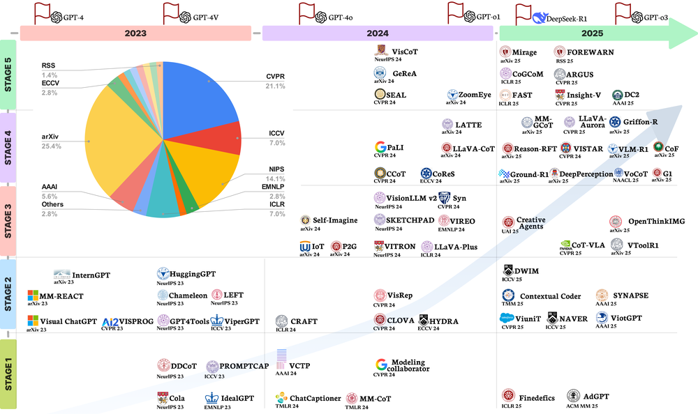
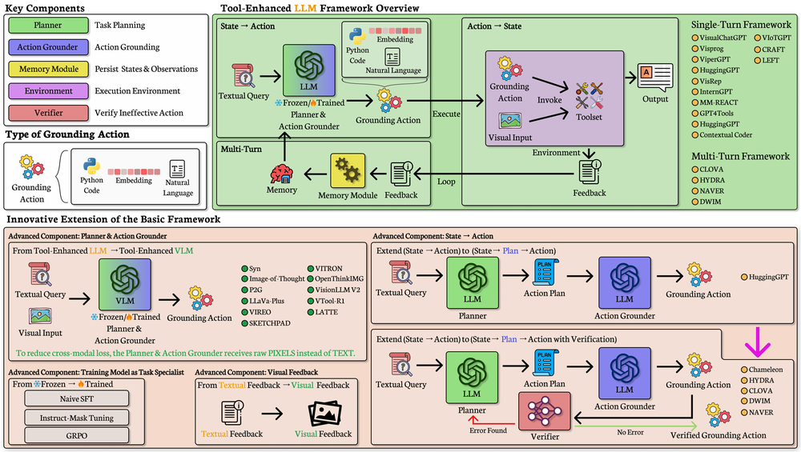
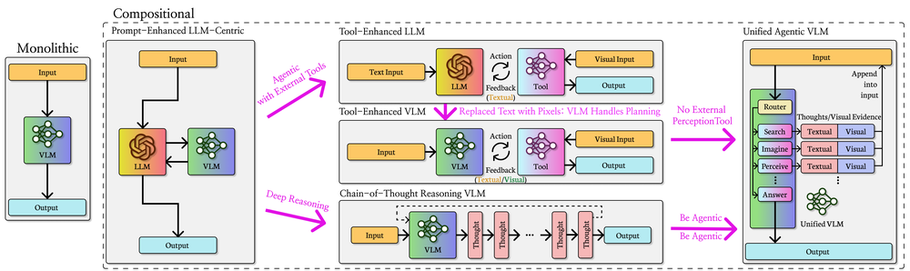
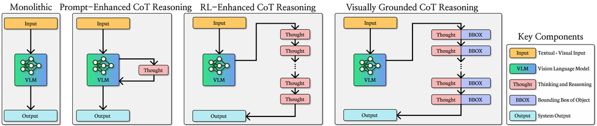
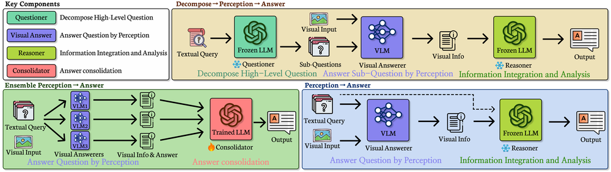
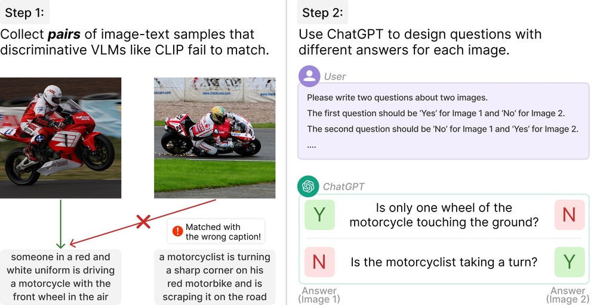
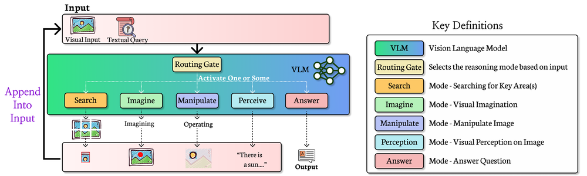
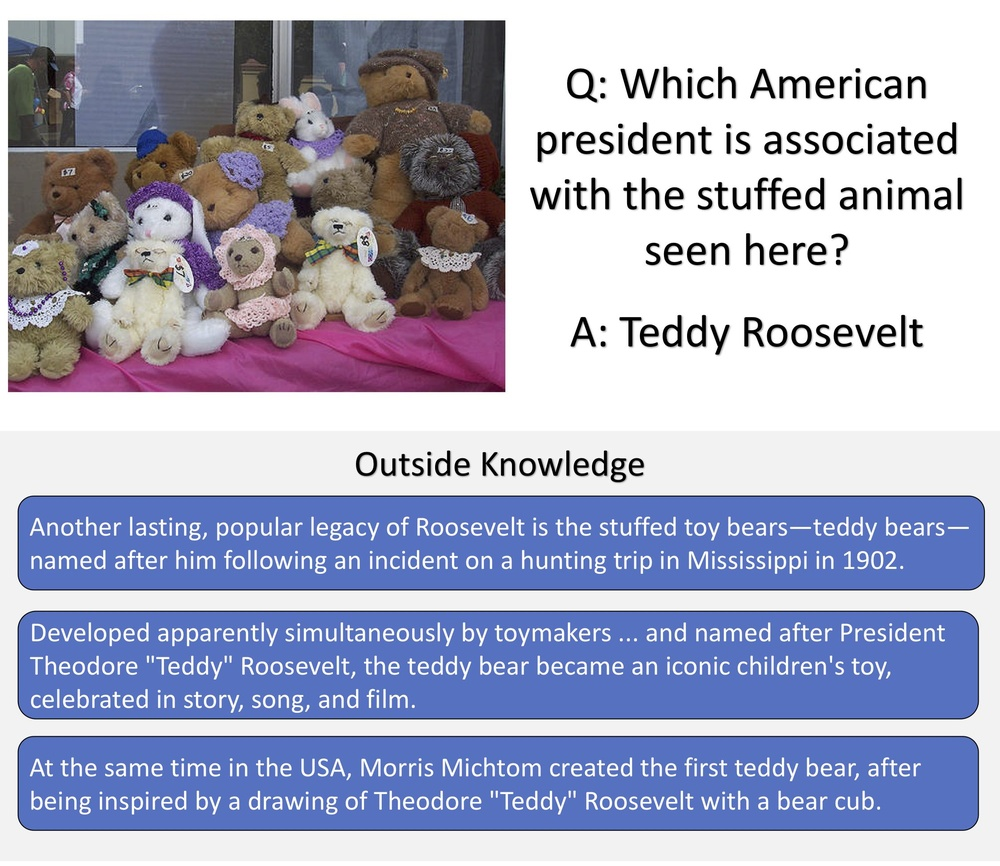
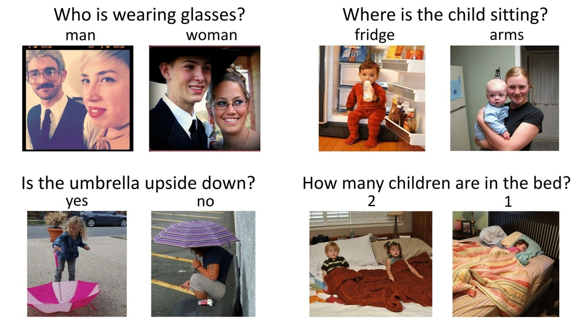
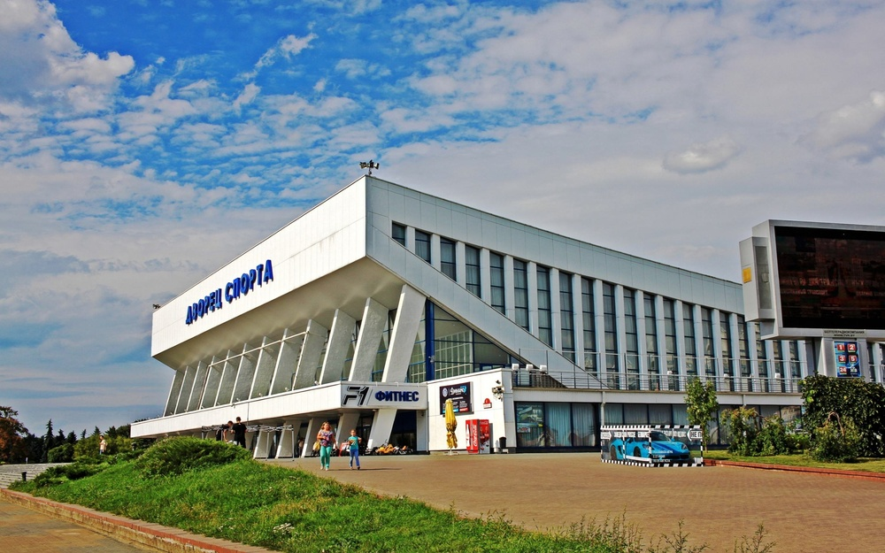

# Explain Before You Answer: A Survey on Compositional Visual Reasoning

URL: https://arxiv.org/pdf/2508.17298

作者: 

使用模型: deepseek-v3-1-terminus

## 1. 核心思想总结
根据您提供的论文标题和结构框架，我将为您整理一份简洁的第一轮总结。

**标题：** Explain Before You Answer: A Survey on Compositional Visual Reasoning

**第一轮总结**

*   **1. Background (背景)**
    该论文的领域是**组合视觉推理**。这一领域关注的是如何让机器模型（如AI）理解和处理需要多步逻辑推理的视觉任务。这些任务通常不能仅通过识别图像内容直接得出答案，而是需要将不同的视觉概念（如物体、属性、关系）像搭积木一样“组合”起来进行思考。

*   **2. Problem (问题)**
    论文指出，尽管现有的视觉问答模型在简单问题上表现良好，但在处理需要深度组合推理的复杂问题时，其性能会显著下降。这些模型往往依赖于数据中的表面关联而非真正的推理能力，导致其决策过程像一个“黑箱”，缺乏可解释性，且难以泛化到新问题。

*   **3. Method (high-level) (方法 - 高层概述)**
    本文是一篇**综述性论文**，因此其核心方法并非提出一个新模型，而是对“组合视觉推理”这一领域进行**系统性的梳理、分类和评述**。它重点探讨了“解释再回答”这一范式，即要求模型在给出最终答案之前，先生成一个中间推理过程或解释。

*   **4. Contribution (贡献)**
    本论文的主要贡献在于：
    *   **系统综述：** 首次对组合视觉推理，特别是与“解释”相关的模型和方法，进行了全面的总结。
    *   **分类框架：** 为该领域的研究建立了一个清晰的分类体系，可能包括按任务类型、推理方法、解释形式等进行划分。
    *   **洞察与展望：** 分析了当前技术的局限性，并指出了未来有价值的研究方向，为该领域的后续发展提供了重要指导。

## 2. 方法详解
好的，基于您提供的初步总结和论文“Explain Before You Answer: A Survey on Compositional Visual Reasoning”的方法章节内容，以下是对该论文方法细节的详细说明。

需要再次强调的是，作为一篇综述性论文，其“方法”并非提出一个新算法，而是**构建一套系统性的分类、比较和分析框架**，用以梳理整个领域。因此，其“方法细节”体现在其如何组织、剖析和呈现现有研究。

### 论文方法细节详解

该论文的方法核心是建立一个多维度、多层级的分类法，对“组合视觉推理”领域的研究进行解构。其整体流程与关键创新点如下：

#### 一、 关键创新与整体方法论框架

论文最核心的创新是提出了一个**以“解释”为中心的分类框架**。它没有停留在传统的“模型架构”或“任务类型”的单维分类上，而是将“**如何生成解释**”作为主线，贯穿整个分析过程。这个框架可以概括为三个关键层面：

1.  **推理的构成要素**：首先解构一个推理任务由哪些基本模块组成。
2.  **解释的生成范式**：核心创新，重点分析模型生成解释的不同策略。
3.  **解释的形式与评估**：对解释本身进行分类，并讨论如何评估解释的质量。

#### 二、 算法/架构细节与关键步骤

论文的方法章节通过以下关键步骤和细节来展开上述框架：

**步骤一：解构组合推理的构成要素**

论文首先将任何组合视觉推理模型抽象为几个核心组成部分，这为后续分类奠定了基础：
*   **视觉编码器**：如何从图像中提取特征（如使用CNN、ViT）。
*   **语言编码器**：如何理解问题文本（如使用RNN、BERT）。
*   **推理机**：**这是核心模块**，负责执行多步推理。论文详细比较了不同推理机的实现方式：
    *   **神经模块网络**：将自然语言问题编译成一序列可执行的、模块化的神经网络（如“查找”、“比较”、“计数”模块）。每个模块负责一个子功能，组合起来完成复杂推理。这是“显式”推理的典型代表。
    *   **图神经网络**：将图像中的物体表示为节点，关系表示为边，构建视觉场景图。推理在图上进行消息传递和更新，模拟逻辑推理过程。
    *   **大型预训练模型**：基于Transformer的VLMs（如GPT-4V），通过注意力机制在图像和文本标记之间进行隐式推理。论文会讨论如何通过提示工程（如思维链）引导其生成显式解释。
*   **解释生成器**：负责产出中间推理步骤。它可能与推理机紧密集成（如NMNs中每个模块的输出即为解释的一部分），也可能是一个独立的组件（如在VLMs中，通过解码器生成解释文本）。

**步骤二：提出并详细分析“解释的生成范式”**

这是论文方法章节的**重中之重**。它系统地分类了现有研究生成解释的不同范式：

1.  **模块化分解**
    *   **关键思想**：将复杂问题显式地分解为一系列子问题，并调用对应的功能模块顺序执行。
    *   **算法细节**：
        *   **语法解析**：首先使用一个“语法解析器”分析问题的句法结构，将其转化为一个程序（如`find(mouse), query(color), filter(white)`）。
        *   **模块执行**：每个程序步骤对应一个预定义的神经网络模块。例如，“查找”模块负责定位物体，“查询”模块负责提取属性。
        *   **解释形式**：解释就是**程序的执行轨迹和每个模块的中间输出**（例如，先找到老鼠，然后查询其颜色，最后筛选出白色）。这种解释结构化、可解释性强。

2.  **中间监督**
    *   **关键思想**：不进行显式的模块分解，而是为模型提供中间推理步骤的“标准答案”作为监督信号，让模型学会隐式地学习推理过程。
    *   **算法细节**：
        *   **数据要求**：训练数据不仅包含`<图像， 问题， 答案>`，还包含`<解释>`。解释可以是文本描述（如“图中有一只白老鼠，所以答案是白色”），或语义图等形式。
        *   **模型训练**：模型被训练同时优化最终答案和中间解释的损失函数。例如，损失函数为 `Loss = λ1 * Loss_answer + λ2 * Loss_explanation`。
        *   **解释形式**：解释是模型生成的、与训练数据中类似的中间结果（如一段文本或一个注意力图）。

3.  **提示与上下文学习**
    *   **关键思想**：针对大型视觉-语言模型，不改变其参数，而是通过设计精巧的输入提示，激发其内部已有的推理能力，使其生成解释。
    *   **算法细节**：
        *   **提示工程**：在输入问题前，添加指令或示例，如“请逐步推理并解释你的答案”。这是最核心的“算法”。
        *   **思维链**：提供一些包含逐步推理的示例作为上下文，让模型进行模仿。
        *   **解释形式**：模型自动生成的、自由形式的文本解释。这种方法的灵活性高，但解释的可靠性和事实性可能存在问题。

**步骤三：对“解释”本身进行多维度分类**

论文进一步深化了对“解释”的分析，从以下几个维度对解释进行细化分类：
*   **形式**：
    *   **符号化/结构化**：如程序、场景图、逻辑表达式。优点是可解释性最强。
    *   **自然语言**：文本描述。优点是与人类沟通最自然。
    *   **视觉化**：如注意力热力图、边界框。优点是直观显示模型“看”哪里。
*   **粒度**：
    *   **全局解释**：对整个决策过程的总结性描述。
    *   **局部解释**：对决策过程中关键步骤或特征的突出显示。
*   **作用时机**：
    *   **事前解释**：在给出答案前生成，用于指导推理。
    *   **事后解释**：在给出答案后生成，用于验证和辩护。

**步骤四：建立评估体系**

论文的方法章节还会讨论如何评估这些方法，通常包括两个层面：
*   **任务性能评估**：最终答案的准确率、精度等标准指标。这是评估推理是否成功的**基础**。
*   **解释质量评估**：
    *   **人工评估**：由人类判断解释是否合理、忠实、有帮助。这是黄金标准，但成本高。
    *   **自动评估**：
        *   **忠诚度**：解释是否真实反映了模型的推理过程？例如，如果遮住解释中提到的物体，模型的答案是否会改变？
        *   **合理性**：解释本身是否在逻辑上成立？可以通过自然语言推理模型来评估。
        *   **对下游任务的帮助**：好的解释是否能帮助模型实现更好的泛化或进行错误诊断？

### 总结

该论文的“方法”是一套**严谨的学术分析框架**。其**关键创新**在于将“解释的生成范式”作为核心分类维度，系统性地梳理了从**模块化分解**到**中间监督**，再到**提示学习**的技术演进。通过**解构推理要素**、**细化解释属性**和**建立评估标准**这三个关键步骤，论文不仅描述了各类模型“是什么”，更深入分析了它们“怎么做”以及“为何有效/无效”，为读者和研究者提供了对该领域全面而深刻的理解，并清晰地指明了未来的研究方向。

## 3. 最终评述与分析
好的，结合前两轮关于论文《Explain Before You Answer: A Survey on Compositional Visual Reasoning》的背景、问题、方法细节以及结论部分的信息，现提供最终的综合评估如下：

---

### **最终综合评估**

#### **1) 整体总结**

本论文是一篇关于**组合视觉推理**领域的系统性综述。它深入探讨了人工智能模型在处理需要多步逻辑推理的视觉问答任务时所面临的挑战，即模型往往表现为“黑箱”，缺乏真正的推理能力和可解释性。论文的核心论点是“**解释再回答**”这一范式是解决这些挑战的关键。通过提出一个以“解释”为中心的创新性分类框架，论文全面梳理并比较了当前主流的技术路径（如模块化分解、中间监督、提示学习），并详细分析了解释的形式、生成方式及评估标准。最后，论文总结了该领域的现状，指出了核心挑战，并为未来的研究方向提供了清晰的路线图。

#### **2) 优势**

1.  **开创性与系统性**：作为该领域的首篇系统性综述，论文填补了一项重要空白，为研究人员提供了不可或缺的入门指南和领域概览。
2.  **创新的分类框架**：论文最大的亮点在于其分类法。它没有停留在传统的模型架构分类上，而是创造性地以“**解释的生成范式**”为主线，深刻揭示了不同技术路径的内在逻辑与演进关系，极具洞察力。
3.  **深度与广度兼备**：分析不仅涵盖经典方法（如神经模块网络），也深入探讨了前沿技术（如基于大型视觉-语言模型的提示工程），并对解释的粒度、形式、评估方法进行了多维度剖析，内容全面而深入。
4.  **清晰的指导性**：论文通过对现有方法的优缺点进行批判性分析，并明确指出现有技术的局限性和未来挑战，对领域发展具有强烈的指导意义，能有效引导后续研究聚焦于关键问题。

#### **3) 劣势 / 局限性**

1.  **综述文章的固有局限**：作为一篇综述，其本身不提出新的算法或提供新的实证结果。它的价值在于对现有工作的整合与评述，其结论的权威性高度依赖于所涵盖文献的全面性和作者分析的客观性。
2.  **领域发展迅速带来的时效性挑战**：组合视觉推理，特别是基于大型基础模型的研究，发展日新月异。任何综述都面临在出版时部分内容可能已略显滞后的风险，难以涵盖最新突破。
3.  **部分分析可能偏重宏观**：尽管分析深入，但对于某些特定技术（如具体的GNN架构或VLM微调技巧）的细节，读者仍需查阅原始文献。论文的优势在于提供宏观框架而非微观实现。
4.  **依赖已有研究的质量**：论文的论点和结论建立在现有公开研究的基础上。如果该领域本身存在可复现性问题或某些方法的评估不够严谨，可能会间接影响综述分析的稳健性。

#### **4) 潜在应用 / 影响**

1.  **推动可信AI发展**：论文强调的“可解释性”是构建可信AI系统的核心。其总结的方法可直接应用于需要决策透明的关键领域，如**自动驾驶（理解为何做出刹车决策）、医疗影像诊断（提供诊断依据）、司法取证**等，增强人类对AI的信任。
2.  **提升AI模型的泛化与稳健性**：通过强制模型进行分步推理而非记忆数据偏差，论文中讨论的技术有助于开发出更通用、更稳健的AI系统，能够更好地处理未知场景和新颖问题。
3.  **作为教育与科研的基石**：该论文是研究生和领域新入行研究人员的理想入门教材，能帮助他们快速建立知识体系。同时，它指出的未来方向（如解释的忠实性、因果推理、人机协作）将为未来数年的研究设定议程。
4.  **促进跨领域融合**：论文的工作架起了计算机视觉、自然语言处理与逻辑推理、认知科学之间的桥梁，其理念和方法可启发AI其他子领域（如机器人学、知识图谱）对可解释性和组合推理的重视。

---
**总结**：这篇论文是一项高质量、影响深远的学术工作。它成功地对一个复杂而重要的领域进行了系统化梳理，并提出了具有高度洞察力的分析框架。尽管存在综述类文章固有的局限性，但其在理清领域脉络、指明未来方向方面的贡献十分突出，预计将对推动可解释、强推理AI系统的发展产生持久而积极的影响。

---

# 附录：论文图片

## 图 1

## 图 2

## 图 3

## 图 4

## 图 5

## 图 6

## 图 7

## 图 8

## 图 9

## 图 10

