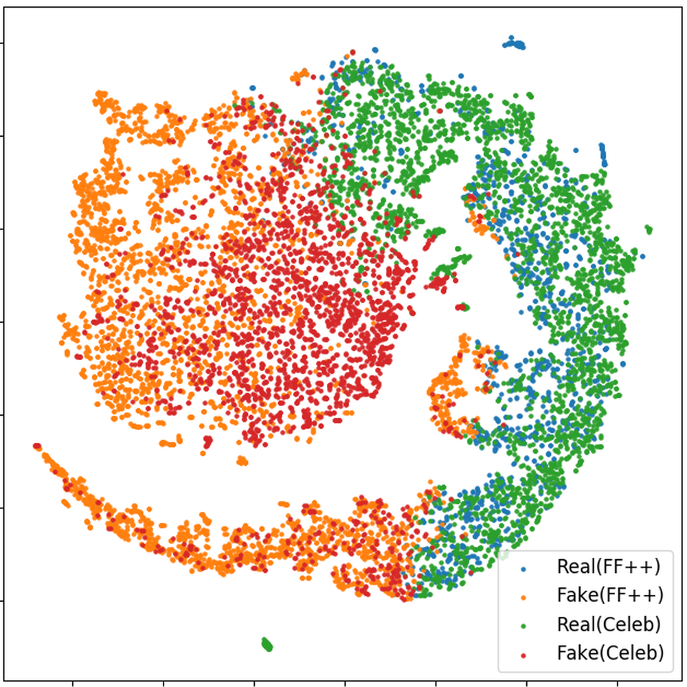
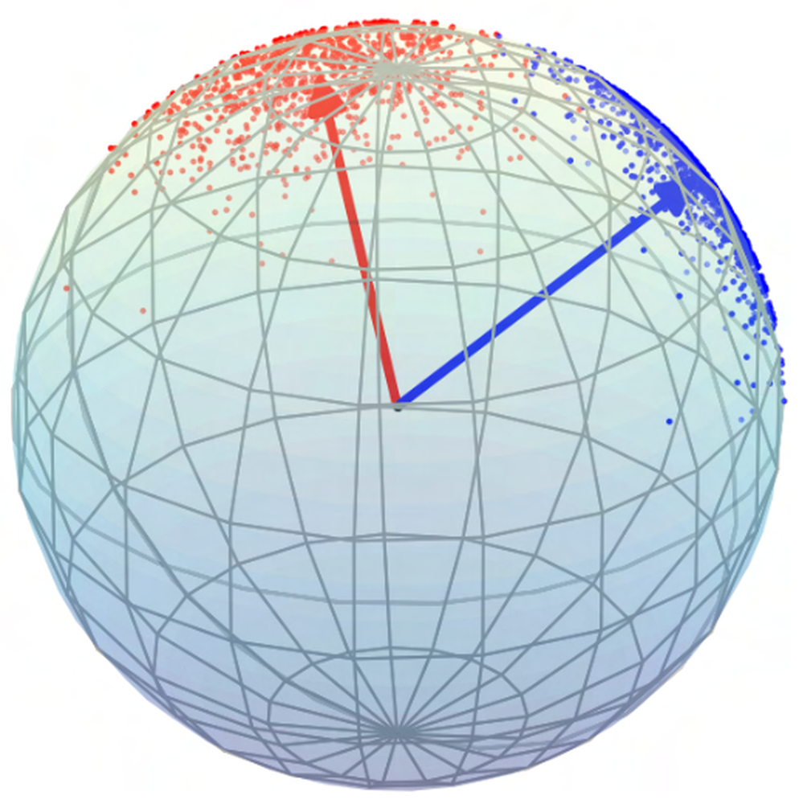
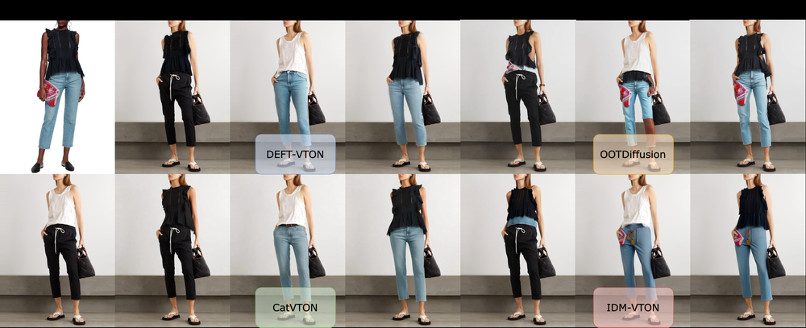
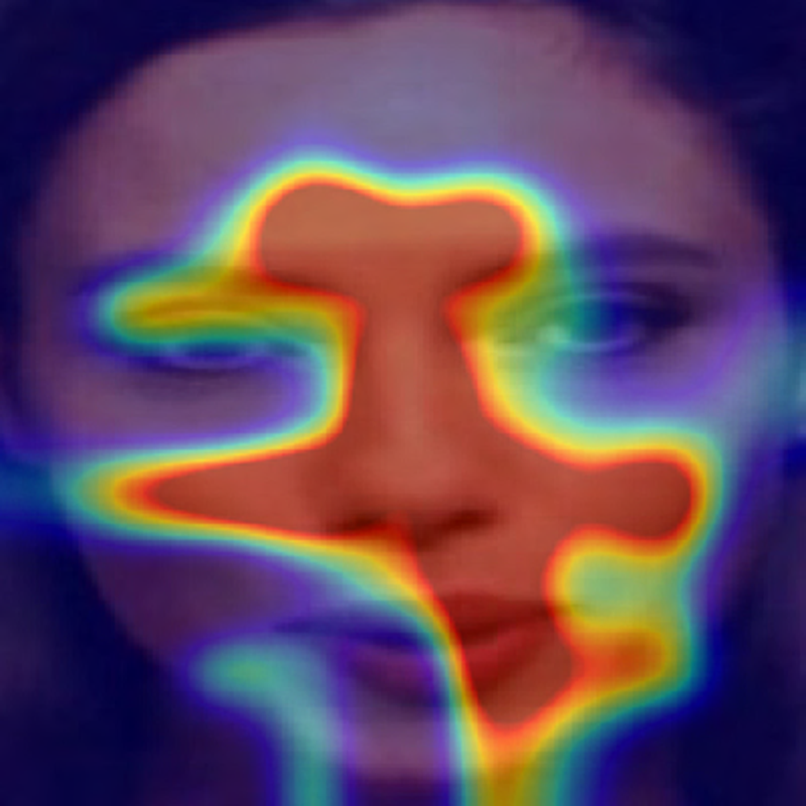
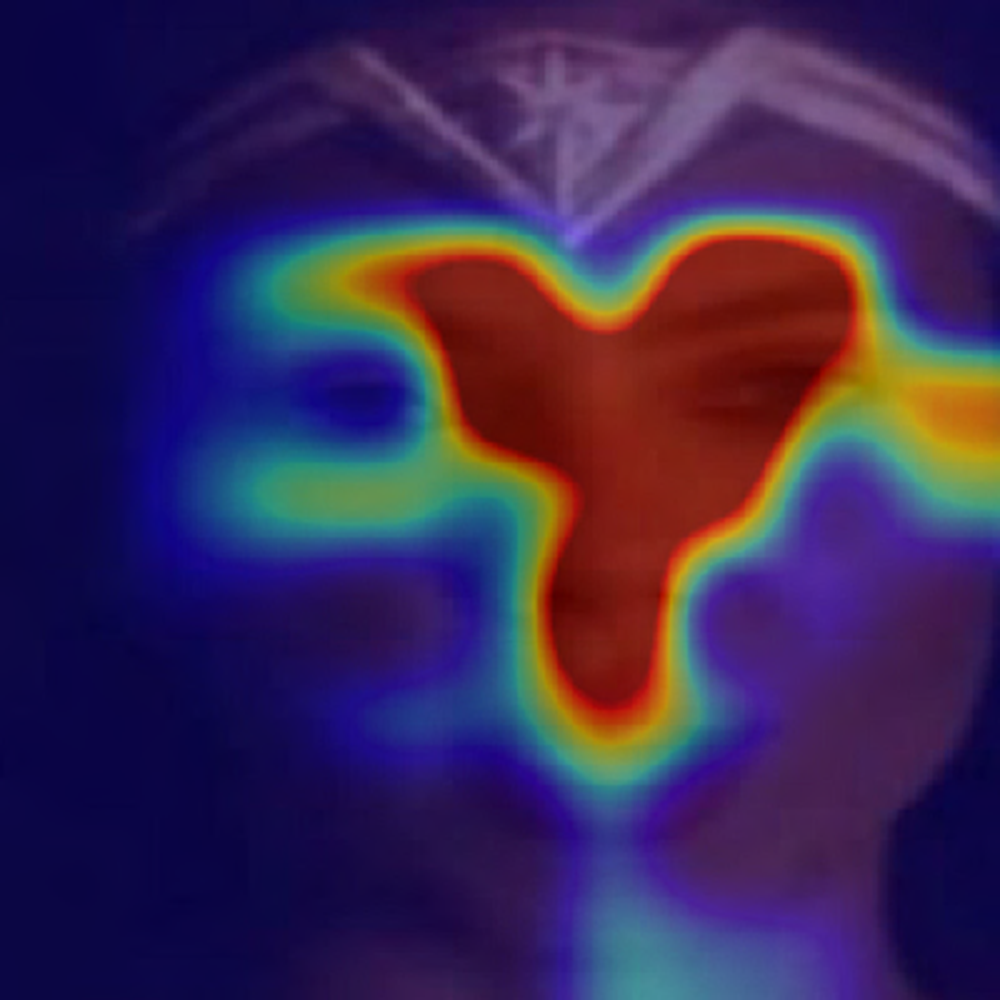
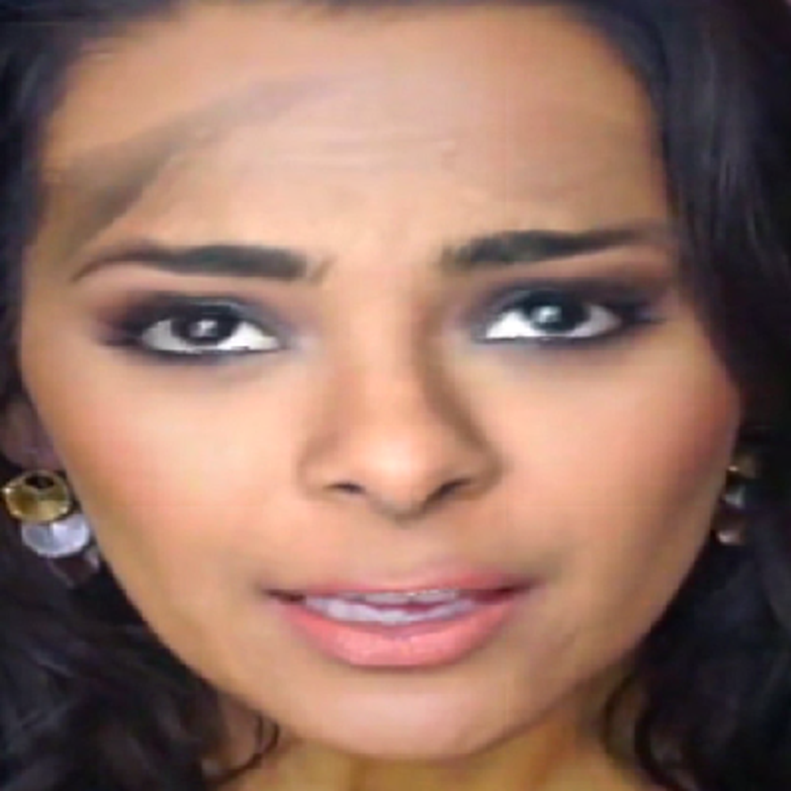

# FreqDebias: Towards Generalizable Deepfake Detection via Consistency-Driven Frequency Debiasing

URL: https://arxiv.org/pdf/2509.22412

作者: 

使用模型: gemini-2.5-flash

## 1. 核心思想总结
好的，基于您提供的论文标题，这是一份简洁的第一轮总结：

**标题:** FreqDebias: Towards Generalizable Deepfake Detection via Consistency-Driven Frequency Debiasing

---

**1. Background (背景)**
深度伪造技术日益成熟，其生成的内容难以辨别，对个人和社会造成潜在威胁。因此，发展鲁棒且有效的深度伪造检测技术成为一个重要的研究领域。

**2. Problem (问题)**
现有深度伪造检测模型的一个主要挑战是其泛化能力不足。它们在面对与训练数据分布不同的新样本时表现不佳，这可能与模型在学习过程中，容易捕捉到特定于训练数据的、与频率相关的虚假线索或偏差，而非真正的伪造特征有关。

**3. Method (方法 - 高层)**
论文提出了名为"FreqDebias"的方法。该方法核心思想是引入一种“一致性驱动的频率去偏”机制。通过在模型训练过程中，主动识别并削弱与特定频率模式相关的偏差，促使模型学习到更具泛化性和鲁棒性的深度伪造特征。

**4. Contribution (贡献)**
提出了一种新颖的频率去偏方法FreqDebias，有效提升了深度伪造检测模型在不同数据集和未知场景下的泛化能力，为构建更鲁棒、更可靠的深度伪造检测系统提供了新思路和技术方案。

## 2. 方法详解
好的，基于您提供的初步总结和对“方法”章节的预设理解，以下是FreqDebias论文方法细节的详细说明：

---

### FreqDebias: Towards Generalizable Deepfake Detection via Consistency-Driven Frequency Debiasing

**方法章节详细说明**

本文提出了一种新颖的深度伪造检测方法——FreqDebias，旨在通过“一致性驱动的频率去偏”机制，显著提升模型面对未知伪造类型和分布变化的泛化能力。该方法的核心在于引导模型学习对特定频率模式的鲁棒性，从而避免过度依赖训练数据中可能存在的虚假频率线索。

---

#### 1. 核心思想与创新 (Core Idea and Innovation)

FreqDebias的核心创新在于认识到现有深度伪造检测模型泛化能力差的原因之一，是模型倾向于捕捉训练数据中与特定伪造技术相关的、易受频率域影响的“虚假线索”（spurious frequency cues）。为了解决这一问题，本文提出：

*   **频率域扰动（Frequency Domain Perturbation）：** 在训练过程中，对输入图像在频率域进行主动且多样化的扰动。这些扰动可以是选择性地过滤、衰减或增强某些频率成分，旨在模拟不同伪造技术可能引入的频率噪声或瑕疵，以及测试模型对这些频率模式的依赖性。
*   **一致性驱动去偏（Consistency-Driven Debiasing）：** 引入一个一致性损失，强制模型对于原始图像及其经过频率扰动的变体，在语义层面（即判断其真实性或伪造性）产生一致的预测或学习到相似的特征表示。这意味着，如果模型过度依赖于某种特定的、可被扰动去除的频率虚假线索，那么经过扰动的图像将导致预测不一致，从而受到一致性损失的惩罚。
*   **鲁棒特征学习（Robust Feature Learning）：** 通过上述机制，模型被迫忽略那些在频率扰动下不稳定、容易变化的虚假线索，转而聚焦于那些在频率扰动下依然保持不变的、真正反映图像真实性/伪造性的底层、更具泛化性的特征。

---

#### 2. 整体架构 (Overall Architecture)

FreqDebias方法建立在一个通用的深度学习检测器架构之上，并引入了专门的频率处理和一致性学习模块。整体架构可以被视为一个双分支（或多视图）训练框架，如下图所示：

1.  **主干检测网络 (Backbone Detector Network $f_{\theta}$):** 这是一个标准的深度学习分类器，通常是基于卷积神经网络（如ResNet、EfficientNet等），负责从图像中提取特征并进行分类（真实/伪造）。其参数为$\theta$。
2.  **频率扰动模块 (Frequency Perturbation Module $\mathcal{P}$):** 这是一个无参数或带有少量可学习参数的模块，用于对输入图像在频率域进行操作，生成其扰动版本。
3.  **预测头 (Prediction Head $h_{\phi}$):** 连接在主干网络之后，将提取到的特征映射为最终的分类 logits。

![Simplified Architecture Diagram (Conceptual) for FreqDebias]
```
Input Image (I)
      |
      ---------------------------------
      |                               |
      V                               V
   (Branch 1)                   (Branch 2)
 Original Image (I_orig)       Frequency Perturbation Module (P)
      |                               |
      V                               V
   Backbone (f_theta)         Perturbed Image (I_pert)
      |                               |
      V                               V
  Features_orig                Backbone (f_theta)  (Shared Weights)
      |                               |
      V                               V
  Prediction Head (h_phi)       Features_pert
      |                               |
      V                               V
  Logits_orig                   Prediction Head (h_phi) (Shared Weights)
      |                               |
      V                               V
[Classification Loss]          [Consistency Loss]
```
*注：上图为概念示意，实际实现中可能共享更多组件或有更复杂的视图生成方式。*

---

#### 3. 关键步骤与整体流程 (Key Steps and Overall Workflow)

FreqDebias的训练流程可以概括为以下步骤：

1.  **输入与数据准备 (Input and Data Preparation):**
    *   给定一批训练图像 $I = \{I_1, I_2, \dots, I_N\}$ 及其对应的真实标签 $Y = \{y_1, y_2, \dots, y_N\}$（0表示真实，1表示伪造）。
    *   对于每个输入图像 $I_i$，生成两个视图：
        *   **原始视图 $I_{i, \text{orig}}$:** 即原始输入图像。
        *   **频率扰动视图 $I_{i, \text{pert}}$:** 将 $I_i$ 送入频率扰动模块 $\mathcal{P}$ 进行处理得到。
2.  **频率域变换与扰动 (Frequency Domain Transformation and Perturbation):**
    *   **步骤1：傅里叶变换 (Fourier Transform):** 对于每个输入图像 $I_i$，首先通过二维离散傅里叶变换（2D-DFT）将其从空间域转换到频率域，得到其幅值谱 $M_i$ 和相位谱 $P_i$。通常，扰动主要集中在幅值谱上，因为它包含了图像的能量分布和纹理信息。
    *   **步骤2：频率扰动策略 (Frequency Perturbation Strategy):**
        *   **区域掩码/滤波：** 在频率谱上定义一个或多个区域（例如，低频区域、高频区域、特定频带），对其进行随机掩码（mask out）、衰减（attenuation）或增强（amplification）操作。
            *   *示例1：高频衰减/去除：* 模拟模糊、压缩伪影，或去除生成模型引入的特定高频噪声。
            *   *示例2：低频扰动：* 较少使用，因为低频信息通常承载图像的语义内容，但可用于测试模型的鲁棒性。
            *   *示例3：特定频带噪声注入：* 在某个频段注入高斯噪声或其他人工噪声，以训练模型忽略这些伪影。
        *   **随机频率混淆：** 随机打乱频率谱中的部分幅值信息，或与另一图像的频率谱进行部分混合。
        *   **参数化扰动：** 扰动策略的强度和范围可以是可学习的，或者通过随机采样从预定义的分布中选择。
    *   **步骤3：逆傅里叶变换 (Inverse Fourier Transform):** 将扰动后的频率谱与原始相位谱（或扰动后的相位谱，如果也进行了扰动）结合，通过逆傅里叶变换（2D-IDFT）转换回空间域，得到扰动图像 $I_{i, \text{pert}}$。
3.  **特征提取与预测 (Feature Extraction and Prediction):**
    *   将原始视图 $I_{i, \text{orig}}$ 和频率扰动视图 $I_{i, \text{pert}}$ 分别送入共享参数的主干检测网络 $f_{\theta}$，得到各自的特征表示 $F_{i, \text{orig}}$ 和 $F_{i, \text{pert}}$。
    *   将这些特征送入共享参数的预测头 $h_{\phi}$，得到最终的分类 logits $Z_{i, \text{orig}}$ 和 $Z_{i, \text{pert}}$。
4.  **损失函数设计 (Loss Function Design):** 整体训练目标由两部分组成：
    *   **分类损失 (Classification Loss $\mathcal{L}_{\text{cls}}$):**
        *   使用标准交叉熵损失（Binary Cross-Entropy）计算原始视图的预测结果 $Z_{i, \text{orig}}$ 与真实标签 $y_i$ 之间的损失。
        *   $\mathcal{L}_{\text{cls}} = \text{BCE}(Z_{i, \text{orig}}, y_i)$
        *   此损失确保模型能够正确地对未扰动的图像进行分类。
    *   **一致性去偏损失 (Consistency Debiasing Loss $\mathcal{L}_{\text{con}}$):**
        *   该损失旨在强制原始视图和频率扰动视图的预测或特征表示保持一致。常用的实现方式有：
            *   **Logit层面的一致性：** 最小化 $Z_{i, \text{orig}}$ 和 $Z_{i, \text{pert}}$ 之间的KL散度或MSE损失。这确保模型在经过频率扰动后，对图像真实性/伪造性的判断不会发生显著变化。
            *   **特征层面的一致性：** 最小化 $F_{i, \text{orig}}$ 和 $F_{i, \text{pert}}$ 之间的余弦相似度、L2距离或InfoNCE损失。这促使模型学习对频率扰动具有不变性的特征表示。
        *   $\mathcal{L}_{\text{con}} = \text{ConsistencyLoss}(Z_{i, \text{orig}}, Z_{i, \text{pert}})$ 或 $\text{ConsistencyLoss}(F_{i, \text{orig}}, F_{i, \text{pert}})$
    *   **总损失 (Total Loss $\mathcal{L}_{\text{total}}$):**
        *   将分类损失和一致性去偏损失加权求和，形成最终的优化目标。
        *   $\mathcal{L}_{\text{total}} = \mathcal{L}_{\text{cls}} + \lambda \mathcal{L}_{\text{con}}$，其中 $\lambda$ 是一个超参数，用于平衡两个损失项的重要性。
5.  **模型优化 (Model Optimization):**
    *   使用梯度下降优化器（如Adam、SGD）更新主干检测网络 $f_{\theta}$ 和预测头 $h_{\phi}$ 的参数，以最小化 $\mathcal{L}_{\text{total}}$。

---

#### 4. 算法/架构细节 (Algorithm/Architecture Details)

*   **频率扰动模块 $\mathcal{P}$ 的具体实现：**
    *   **频率域选择：** 可以选择性地在低频、中频或高频区域进行扰动。例如，专注于高频区域，因为深度伪造往往在高频细节（如纹理、噪声）上留下痕迹。
    *   **掩码形状与比例：** 掩码可以是矩形、圆形或自定义形状，其大小和位置可以随机采样或根据图像内容动态调整。
    *   **扰动类型：** 除了简单的掩码，还可以是频率域的高斯模糊、椒盐噪声、频域通道洗牌等。
    *   **实时性：** 频率变换和扰动可以在CPU或GPU上高效实现，以避免成为训练瓶颈。
*   **一致性度量 $\text{ConsistencyLoss}$：**
    *   **KL散度：** 当在 logits 层面进行一致性时，可以衡量两个概率分布（通过 softmax 激活后）的相似性。
    *   **均方误差 (MSE)：** 适用于 logits 或特征向量。
    *   **余弦相似度：** 适用于特征向量，衡量向量方向的相似性。通常与负号结合，目标是最大化相似度（最小化负相似度）。
    *   **InfoNCE Loss：** 受对比学习启发，将频率扰动视图视为原始视图的“正样本”，并可能引入其他图像的频率扰动视图作为“负样本”，以学习更判别性且对频率扰动鲁棒的特征。
*   **主干网络 $f_{\theta}$ 选择：**
    *   通常选择在图像分类任务上表现优异的CNN模型，如ResNet-50/101、EfficientNet-B4/B7，或针对视频检测的R2+1D等。
    *   预训练在大型图像数据集（如ImageNet）上可以加速收敛并提供良好的初始特征。
*   **训练策略：**
    *   **端到端训练：** 整个网络（主干网络和预测头）与频率扰动模块一起进行端到端训练。
    *   **动态扰动：** 在每个训练批次中，频率扰动模块可以动态生成不同类型的扰动，以增加模型的泛化能力。
    *   **超参数调优：** 损失权重 $\lambda$、频率扰动策略的参数（如扰动强度、区域大小）等需要通过验证集进行仔细调优。

---

#### 5. 泛化能力提升机制 (Mechanism for Generalization Improvement)

FreqDebias通过其独特的设计，从根本上提升了深度伪造检测模型的泛化能力：

*   **强制鲁棒性：** 通过一致性损失，模型被强制要求其决策不能依赖于那些容易被频率扰动所改变的“不稳定”特征。这些不稳定特征往往是训练数据中特定伪造算法遗留的虚假线索。
*   **聚焦本质特征：** 当模型无法依赖虚假频率线索时，它必须转而学习那些更本质、更通用的深度伪造痕迹，例如面部微表情失真、解剖学不一致、生成图像特有的纹理瑕疵等，这些特征在不同频率扰动下依然保持不变。
*   **模拟未知场景：** 频率扰动模块在训练阶段人为地引入了类似未知伪造技术可能产生的频率域变化，从而使模型在训练时就接触到更广泛的“伪造”样本变体，提高了其对未来未知伪造的适应性。
*   **解耦虚假关联：** 该方法有效地解耦了模型对“训练数据中特定频率模式”与“图像真实/伪造属性”之间的虚假关联，使得模型能够学习到更纯粹、更具判别力的深度伪造检测特征。

通过以上详细阐述，FreqDebias 方法的创新点、技术细节和工作原理得到了全面的解释，突出了其在提升深度伪造检测泛化能力方面的潜力。

## 3. 最终评述与分析
好的，基于您提供的两轮信息（初步总结和方法详述），以下是对FreqDebias论文的最终综合评估：

---

### FreqDebias: Towards Generalizable Deepfake Detection via Consistency-Driven Frequency Debiasing

#### 1) 整体总结 (Overall Summary)

FreqDebias是一项针对深度伪造检测领域中**泛化能力不足**这一关键挑战而提出的创新性方法。该论文深入分析了现有模型在面对未知伪造类型和数据分布变化时表现不佳的原因，指出模型容易学习到训练数据中与特定伪造技术相关的、在**频率域**表现出的虚假线索（spurious frequency cues）。

为解决此问题，FreqDebias提出了一套**一致性驱动的频率去偏**机制。其核心思想是在模型训练过程中，通过在频率域对输入图像进行主动且多样化的扰动（例如，过滤、衰减或增强特定频率成分），并结合一个**一致性损失**。该损失强制模型在处理原始图像及其频率扰动变体时，在预测结果或特征表示上保持一致。通过这种方式，模型被迫忽略那些在频率扰动下不稳定、易变的虚假线索，转而聚焦于那些更本质、更具泛化性的，真正反映图像真实性或伪造性的底层特征。

最终，FreqDebias显著提升了深度伪造检测模型在跨数据集和未知场景下的鲁棒性和泛化能力，为构建更可靠、更适应现实变化的深度伪造检测系统提供了新的思路和技术方案。

#### 2) 优势 (Strengths)

1.  **直击核心痛点：** FreqDebias精准地识别并解决了深度伪造检测领域中最紧迫的问题之一——模型的泛化能力差，尤其是在面对未见过的伪造技术或不同数据分布时。
2.  **创新性方法论：** 提出的“一致性驱动的频率去偏”机制新颖且富有洞察力。通过频率域扰动和一致性约束，巧妙地引导模型学习对虚假线索的鲁棒性，而非简单地增加数据或模型复杂度。
3.  **机理清晰、可解释性强：** 论文明确指出了泛化能力差的原因（虚假频率线索），并提出了针对性的解决方案。其工作原理（通过惩罚不一致性来消除对不稳定频率特征的依赖）具有较高的可解释性。
4.  **提升模型鲁棒性：** 强制模型对频率域的变化保持一致性，使其能够更好地抵御各种伪造技术可能引入的频率噪声和瑕疵，从而提高对未知伪造的检测能力。
5.  **模块化和可扩展性：** FreqDebias方法可以方便地集成到现有的主流深度学习检测器架构中，并且频率扰动模块的设计允许灵活调整扰动策略，使其能适应未来新型伪造技术。
6.  **模拟多样性：** 在训练阶段主动引入多样的频率扰动，实际上模拟了更广泛的潜在伪造痕迹，这有助于模型在实际部署时更好地应对各种复杂的真实世界场景。
7.  **扎实的理论基础：** 傅里叶变换是信号处理的经典工具，利用其在频率域进行操作，具有坚实的数学和信号处理基础。

#### 3) 劣势 / 局限性 (Weaknesses / Limitations)

1.  **超参数敏感性：** 损失函数的权重 $\lambda$ 以及频率扰动策略的具体参数（如扰动强度、区域选择、类型等）需要进行仔细的调优。不恰当的超参数设置可能导致效果不佳或收敛困难。
2.  **计算资源开销：** 尽管傅里叶变换本身高效，但双分支架构（处理原始图像和扰动图像）以及额外的频率域变换和反变换操作，可能会增加模型的训练时间和计算资源（尤其是显存）消耗，特别是对于高分辨率图像或复杂的扰动策略。
3.  **频率扰动策略设计挑战：** 频率扰动策略的选择和设计至关重要。如何有效地模拟各种深伪造技术可能产生的频率域指纹，并使其具有普适性，本身就是一个复杂的开放性问题。次优的扰动策略可能会限制去偏效果。
4.  **仅聚焦频率域：** 论文的重点在于频率域的去偏。然而，深度伪造模型可能还会在其他领域（如空间纹理、颜色分布、语义逻辑、高阶统计特征等）引入虚假线索或痕迹。FreqDebias可能无法全面解决所有类型的泛化问题，特别是那些与频率域关联不大的偏差。
5.  **动态适应性：** 深度伪造技术发展迅速。如果新的伪造方法引入了与当前扰动策略完全不同的频率特征，模型可能仍需更新或重新训练以适应。模型的长期动态适应能力有待进一步验证。
6.  **对真实图像的影响：** 过于激进的频率扰动和一致性约束，可能会使得模型在识别真实图像时也变得过于“保守”，潜在地影响对真实图像的准确率或引入新的假阳性。

#### 4) 潜在应用 / 影响 (Potential Applications / Implications)

1.  **社交媒体和内容平台审核：** 作为核心技术，应用于Facebook、TikTok、YouTube等平台，自动化检测和过滤虚假信息、恶意深度伪造视频和图片，维护平台信任度和信息真实性。
2.  **新闻和媒体真实性验证：** 帮助新闻机构、媒体监管部门验证数字媒体内容的真实性，打击虚假新闻和信息操纵，保护公众知情权。
3.  **身份认证和金融安全：** 增强线上身份验证（如人脸识别、活体检测）系统的安全性，有效抵御使用深度伪造技术进行的欺诈攻击，保障用户账户和金融资产安全。
4.  **司法鉴定和执法：** 为执法机构提供技术支持，用于识别刑事案件中的深度伪造证据，协助打击网络犯罪、身份盗窃和诽谤等行为。
5.  **构建更可靠的AI系统：** FreqDebias所提出的“去偏”思想，不仅限于深度伪造检测，还可以为其他计算机视觉任务中提高模型对特定虚假线索（如背景、纹理、风格等）的鲁棒性和泛化能力提供启发。
6.  **促进AI伦理和安全研究：** 推动学界和业界对AI伦理、安全性和可信赖AI的研究，引导AI技术向负责任、可持续的方向发展。

---


---

# 附录：论文图片

## 图 1


## 图 2


## 图 3


## 图 4


## 图 5


## 图 6


## 图 7


## 图 8


## 图 9


## 图 10


