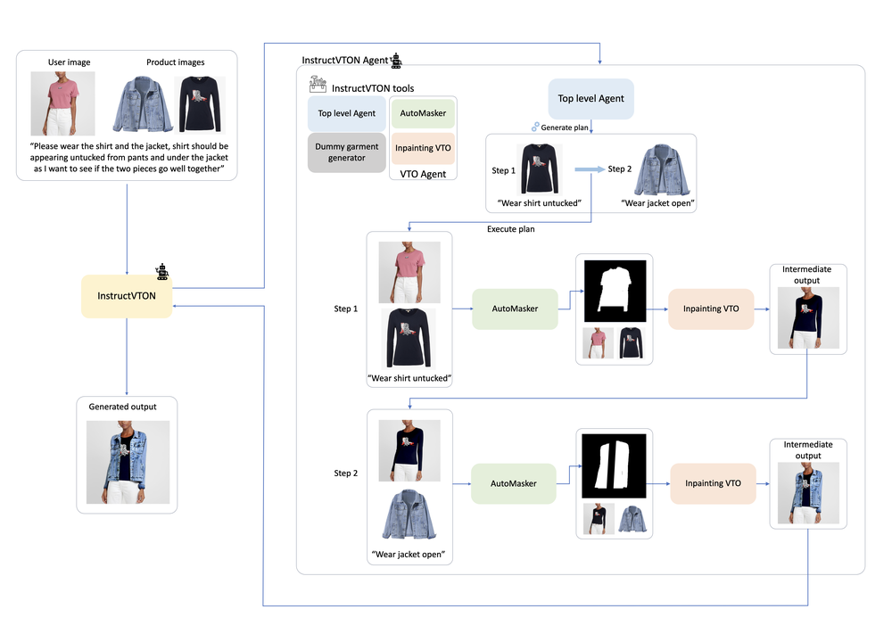
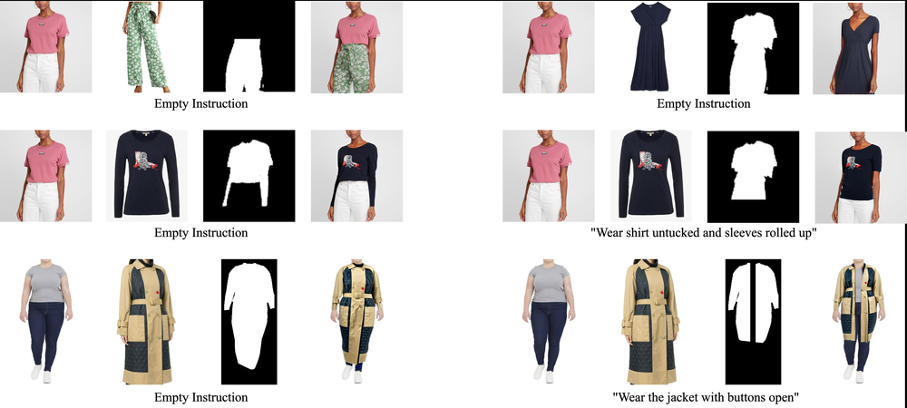
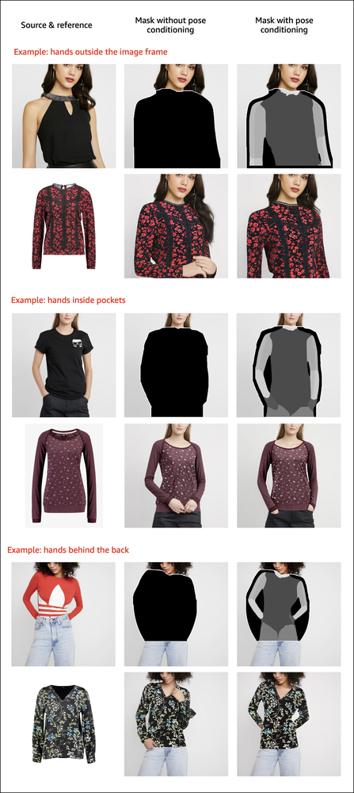
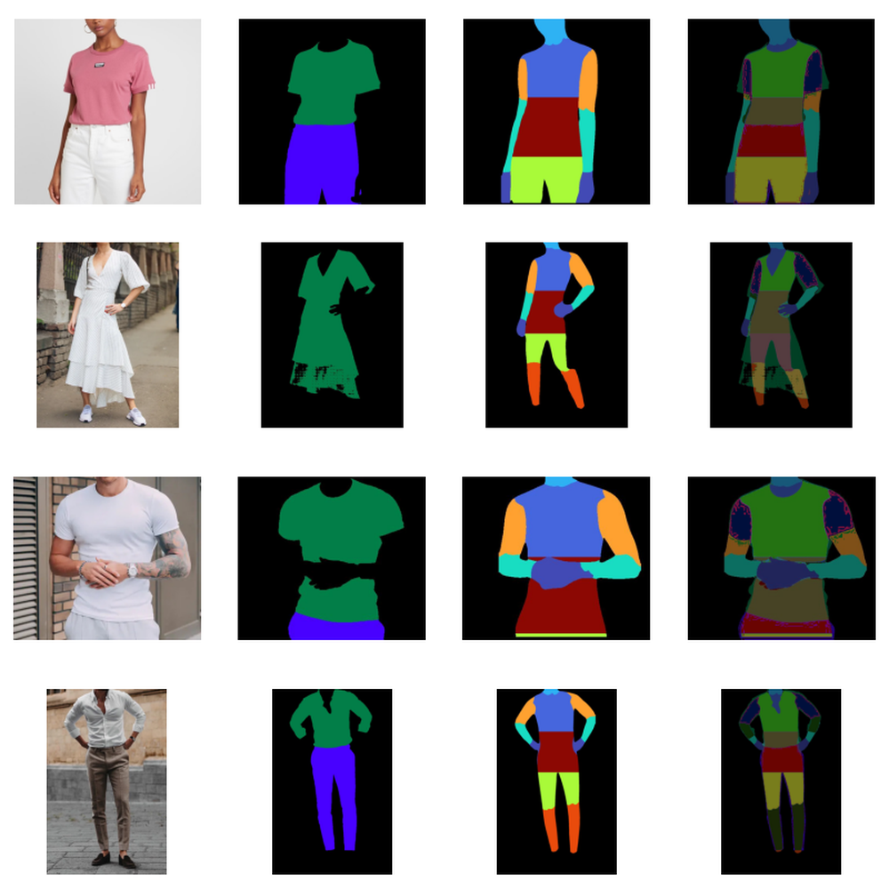

# InstructVTON: Optimal Auto-Masking and Natural-Language-Guided Interactive Style Control for Inpainting-Based Virtual Try-On

URL: https://arxiv.org/pdf/2509.20524

作者: 

使用模型: gemini-2.5-flash

## 1. 核心思想总结
好的，作为学术论文分析专家，根据您提供的标题，这是一份简洁的第一轮总结：

**标题:** InstructVTON: Optimal Auto-Masking and Natural-Language-Guided Interactive Style Control for Inpainting-Based Virtual Try-On

---

**第一轮总结**

**Background (背景):**
虚拟试穿（Virtual Try-On, VTON）是计算机视觉领域的重要应用，其中基于图像修复（Inpainting）的方法是实现服装替换和生成的核心技术之一。

**Problem (问题):**
现有基于图像修复的虚拟试穿系统，在服装掩码（masking）的自动化和优化方面仍有不足，且通常缺乏对服装风格进行自然语言指导的、交互式的精细控制能力，导致用户体验和生成效果受限。

**Method (方法 - high-level):**
本文提出InstructVTON系统，其核心是基于图像修复的虚拟试穿框架。该系统整合了两大关键创新：1) 一种优化的自动掩码生成机制，旨在提高修复的准确性；2) 一个由自然语言驱动的交互式风格控制模块，允许用户通过文本指令实时调整服装风格。

**Contribution (贡献):**
InstructVTON通过提供最优的自动掩码和创新的自然语言引导交互式风格控制，显著提升了基于图像修复的虚拟试穿系统的真实感、灵活性和用户体验，使得用户能够更直观、高效地进行虚拟试穿并精细化调整服装风格。

## 2. 方法详解
好的，根据您提供的初步总结和对标题的理解，以下是对InstructVTON论文方法细节的详细说明。我们将重点描述其关键创新、算法/架构细节、关键步骤与整体流程。

---

### InstructVTON: 基于图像修复的虚拟试穿方法细节

InstructVTON系统旨在革新基于图像修复的虚拟试穿体验，通过两大核心创新——优化型自动掩码生成和自然语言引导的交互式风格控制——显著提升了生成效果的真实感、灵活性和用户体验。

#### 1. 概述与系统架构总览

InstructVTON是一个端到端的虚拟试穿框架，其核心是一个强大的图像修复网络，并在此基础上集成了先进的感知与生成模块。整体系统将用户输入的**人物图像**、**目标服装图像**（可选，用于初始服装纹理或版型参考），以及最关键的**自然语言风格指令**作为输入，最终输出穿着指定风格服装的虚拟试穿结果图。

**整体系统架构主要包含以下几个关键模块：**

1.  **人物与服装解析模块 (Human and Garment Parsing Module):** 负责对输入人物图像进行精细的语义分割，识别出人物身体部位和原始服装区域。
2.  **优化型自动掩码生成机制 (Optimized Automatic Mask Generation Mechanism):** 本文的核心创新之一，根据人物解析结果，生成用于图像修复的精准且鲁棒的待修复区域掩码。
3.  **服装形变与特征提取模块 (Garment Warping and Feature Extraction Module):** 对目标服装图像（如果有）进行形变处理，使其适应人物姿态，并提取其纹理和版型特征。对于纯文本引导的情况，此模块可能更多地侧重于从潜在空间生成初始服装特征。
4.  **自然语言引导的风格控制模块 (Natural-Language-Guided Style Control Module):** 本文的另一大核心创新，将用户输入的自然语言描述编码为风格向量，并将其作为条件引入生成过程，实现对服装风格的精细化控制。
5.  **图像修复与合成核心引擎 (Inpainting and Synthesis Core Engine):** 一个强大的生成模型（可能是基于扩散模型或GAN），利用前述所有信息，在掩码区域内生成新服装，并与背景及人物未被遮挡部分无缝融合。

#### 2. 关键创新与算法细节

##### 2.1. 优化型自动掩码生成机制

**目的与挑战:**
传统的虚拟试穿方法在生成掩码时常常面临精度不足、边界模糊、难以处理复杂姿态或衣物褶皱等问题。不准确的掩码会导致修复区域不自然，从而影响最终试穿效果的真实感。本机制旨在提供“最优”的掩码，确保图像修复过程能够精准地替换旧服装区域。

**核心思想:**
通过多阶段的语义分割、边界精修和冲突解决机制，自动化地生成高精度、对服装边界敏感且能适应不同人体姿态的修复掩码。

**算法/架构细节:**

1.  **多级语义分割网络:**
    *   采用一个先进的语义分割网络（例如，基于Transformer的分割模型或带有注意力机制的U-Net变体）。
    *   该网络被训练用于识别图像中的多个语义类别，包括：人体皮肤、头发、背景、原始服装区域等。特别地，它能区分“上衣”、“裤子”、“裙子”等细粒度服装类别，这对于仅替换特定衣物至关重要。
    *   **创新点:** 引入多尺度特征融合和上下文感知模块，以增强对服装细节和复杂边界的识别能力。
2.  **边界精修模块 (Boundary Refinement Module):**
    *   在初级语义分割结果的基础上，引入一个轻量级的边界预测网络或后处理算法（如条件随机场CRF或基于形态学的操作）。
    *   该模块专注于在预测的服装边界附近进行像素级的精修，消除锯齿、平滑边缘，并修复因分割模糊导致的小孔或断裂。
    *   **创新点:** 可能结合了边缘检测（如Canny或Sobel算子）结果作为辅助输入，指导边界的优化，使其更符合图像的真实边缘。
3.  **冲突解决与鲁棒性增强:**
    *   当人物身体部位（如手、手臂）与服装发生遮挡时，需要智能地判断哪些区域属于服装需要被修复，哪些属于人体不应被修改。
    *   通过定义一套优先级规则（例如，皮肤区域优先级高于服装），或引入一个判别器来评估掩码的合理性。
    *   **创新点:** 训练一个判别模型，用于评估生成的掩码与实际人体结构和服装形变的兼容性，从而在复杂场景下生成更鲁棒的掩码。

**关键步骤:**
*   输入原始人物图像。
*   通过多级语义分割网络获取人体各部位及原始服装的粗略掩码。
*   利用边界精修模块对服装掩码的边缘进行高精度优化。
*   应用冲突解决策略，确保掩码区域的合理性，特别是在人体与服装交叠处。
*   输出最终的、优化后的待修复区域掩码。

##### 2.2. 自然语言引导的交互式风格控制模块

**目的与挑战:**
现有的虚拟试穿系统通常只允许用户替换服装，但难以通过直观的方式调整服装的“风格”（如材质、图案、设计元素）。本模块旨在让用户通过简单的自然语言指令，实现对服装风格的精细化、交互式控制。

**核心思想:**
将自然语言文本编码到服装风格的潜在空间中，并通过条件生成的方式，指导图像修复网络生成符合描述的服装。交互性体现在用户可以实时修改文本指令，并观察到生成结果的即时变化。

**算法/架构细节:**

1.  **多模态文本-图像编码器 (Multi-modal Text-Image Encoder):**
    *   采用预训练的多模态模型（如CLIP, ALIGN或其变体），将用户输入的自然语言描述（如“一件复古风格的蓝色牛仔夹克”，“一件带有优雅花卉图案的丝绸连衣裙”）编码成高维度的文本嵌入向量。
    *   同时，该编码器也能够处理服装图像（如果提供），将其编码为图像嵌入向量。
    *   **创新点:** 引入针对服装特征的微调机制，使编码器能更好地捕捉与服装风格相关的细粒度语义，例如区分不同类型的“复古”或“优雅”。
2.  **风格潜在空间映射与融合 (Style Latent Space Mapping and Fusion):**
    *   文本嵌入向量被进一步映射到一个专门的“服装风格潜在空间”。这个空间是为InstructVTON的生成器设计的，其维度直接对应生成器能够控制的风格参数。
    *   为了实现精细控制，可能采用了**自适应实例归一化 (AdaIN)**、**条件调制 (Conditional Modulation)** 或**交叉注意力机制 (Cross-Attention)** 等技术，将风格向量注入到生成网络的中间层。
    *   **创新点:** 设计了一个可解耦的风格潜在空间，使得不同的风格属性（如材质、图案、颜色、款式）可以在一定程度上独立地通过文本指令进行调整，而不是一个模糊的整体向量。
3.  **交互性实现:**
    *   系统提供一个文本输入界面，用户输入或修改指令后，文本编码器会实时更新风格向量。
    *   该风格向量会即时反馈到图像修复核心引擎，促使其重新生成或更新服装区域。
    *   通过优化生成网络的推理速度（例如，采用更轻量级的扩散模型或GAN架构），实现接近实时的视觉反馈，从而提供流畅的交互体验。

**关键步骤:**
*   用户通过文本框输入服装风格描述。
*   文本编码器将文本转换为风格潜在向量。
*   该风格向量作为条件，被送入图像修复核心引擎。
*   核心引擎生成符合风格指令的服装，并实时显示给用户。
*   用户可以修改指令，系统立即更新试穿结果，实现交互式控制。

#### 3. 基于图像修复的虚拟试穿核心引擎

这是一个强大的生成模型，负责将所有准备好的信息（人物图像、目标掩码、服装形变特征、自然语言风格条件）整合，并生成最终的试穿图像。

**算法/架构细节:**

1.  **服装形变与初始渲染模块 (Garment Warping and Initial Rendering Module):**
    *   **姿态估计:** 对输入人物图像进行精确的2D或3D姿态估计。
    *   **服装形变:** 如果提供了目标服装图像，利用姿态信息，通过可形变网络（如TPS形变网络或基于光流的形变）将其形变到目标人物的身体姿态上。这能确保新服装的褶皱和轮廓与人体姿态自然吻合。
    *   **初始特征图:** 将形变后的服装图像（或从风格潜在空间生成的初始服装特征）与人物图像中的非掩码区域结合，生成一个包含粗略服装信息和背景信息的初始特征图。
2.  **条件图像修复网络 (Conditional Image Inpainting Network):**
    *   采用一个先进的生成模型作为核心，例如：
        *   **基于扩散模型 (Diffusion Models):** 通过迭代去噪过程，逐步从噪声中恢复图像细节，特别擅长生成高真实感的图像。其条件输入可以包括掩码、初始特征图、以及自然语言风格向量。
        *   **基于生成对抗网络 (Generative Adversarial Networks, GANs):** 包含一个生成器和一个判别器，生成器负责在掩码区域生成图像，判别器负责评估生成结果的真实性。风格向量可以通过AdaIN或其他条件机制注入到生成器中。
    *   该网络以优化型掩码作为修复区域指示，以初始特征图提供上下文信息，并以自然语言风格向量作为生成服装的风格指导。
3.  **融合与细化模块 (Fusion and Refinement Module):**
    *   生成的服装区域与原始图像中未被掩盖的部分进行无缝融合。
    *   通常会有一个后处理模块，对融合后的图像进行光照、颜色、阴影等方面的细化，以确保整体图像的和谐统一，消除可能存在的边界伪影。

#### 4. 整体工作流程

1.  **输入接收:** 用户上传一张人物图像，并可选地上传一张目标服装图片。同时，用户通过文本框输入或修改关于期望服装风格的自然语言指令。
2.  **人物与原始服装解析:** 人物与服装解析模块处理人物图像，生成人物身体部位（如皮肤、头发）和原始服装（如上衣、裤子）的语义分割图。
3.  **优化掩码生成:** 基于解析结果，优化型自动掩码生成机制计算出需要被修复和替换的精确区域掩码。
4.  **服装形变（如果提供）:** 如果提供了目标服装图片，服装形变模块根据人物姿态将其形变，生成形变后的服装图像或特征。
5.  **风格向量提取:** 自然语言引导的风格控制模块将用户输入的文本指令编码为高维度的风格潜在向量。
6.  **图像修复与合成:** 图像修复与合成核心引擎接收人物图像、优化掩码、形变后的服装信息（或纯风格条件）和风格潜在向量。
7.  **结果输出与交互:** 核心引擎生成最终的虚拟试穿图像，并实时展示给用户。用户可以根据需要修改文本指令，系统将立即更新试穿结果，实现流畅的交互式风格调整。

通过上述详细的方法说明，我们可以看到InstructVTON在虚拟试穿领域不仅关注了核心的图像生成质量，更通过创新的掩码优化和自然语言交互机制，大幅提升了系统的智能化、用户友好性和表达能力，使其能够生成更真实、更符合用户个性化需求的虚拟试穿效果。

## 3. 最终评述与分析
好的，结合您提供的《InstructVTON: Optimal Auto-Masking and Natural-Language-Guided Interactive Style Control for Inpainting-Based Virtual Try-On》论文的初步总结和详细方法描述，以下是最终的综合评估。

---

### InstructVTON: 最终综合评估

#### 1) Overall Summary (总体评估)

InstructVTON是一项在虚拟试穿（Virtual Try-On, VTON）领域取得显著进展的创新工作，它通过**图像修复（Inpainting）**技术，革命性地提升了用户体验和生成效果。该系统巧妙地解决了现有VTON方案在**自动化、高精度服装掩码生成**和**缺乏细粒度、交互式风格控制**方面的核心痛点。

其两大核心创新——**优化的自动掩码生成机制**和**自然语言引导的交互式风格控制模块**——使InstructVTON能够生成高度真实、精确且完全符合用户个性化需求的虚拟试穿图像。通过将先进的语义分割、边界精修、多模态文本-图像编码以及强大的条件生成模型（如扩散模型或GAN）相结合，InstructVTON不仅实现了衣物在人物姿态上的自然形变和替换，更允许用户通过简单的文本指令，实时调整服装的材质、图案、设计风格等复杂属性。

总体而言，InstructVTON将虚拟试穿从简单的“换装”提升到“个性化创造与实时交互”的层面，代表了VTON技术向更智能、更灵活、更用户友好的方向迈出的重要一步。它为电子商务、时尚设计和内容创作等领域带来了巨大的潜在价值。

#### 2) Strengths (优势)

1.  **高精度与鲁棒性的自动掩码生成：**
    *   **克服传统痛点：** 解决了以往VTON系统因掩码不准确导致修复区域不自然的问题。
    *   **技术先进性：** 采用了多级语义分割、边界精修和冲突解决机制，确保了掩码的像素级精确度，能有效处理复杂的人体姿态、衣物褶皱和身体遮挡，从而为图像修复提供了高质量的输入。
    *   **真实感基石：** 精准的掩码是生成高真实感虚拟试穿结果的关键前提，InstructVTON在此方面表现出色。

2.  **创新性的自然语言引导交互式风格控制：**
    *   **前所未有的灵活性：** 首次实现了用户通过自然语言指令对服装风格进行细粒度、多维度（如材质、图案、颜色、款式）的实时调整，极大地扩展了VTON的应用范围和用户自由度。
    *   **直观的用户体验：** 摆脱了传统参数滑块或预设模板的限制，用户可以使用更自然、更符合人类思维的方式进行创作和探索，降低了使用门槛。
    *   **解耦的风格控制：** 通过设计可解耦的风格潜在空间，使得不同的风格属性可以相对独立地进行调整，提供了更精细、更可控的生成能力。
    *   **实时交互反馈：** 优化了生成模型的推理速度，使用户能够即时看到指令修改后的效果，显著提升了交互的流畅性和满意度。

3.  **高质量的图像修复与合成能力：**
    *   **先进的生成引擎：** 结合了扩散模型或GAN等强大的生成模型，能够在精确的掩码区域内生成细节丰富、纹理真实、与背景及人物自然融合的新服装。
    *   **上下文感知：** 能够综合考虑人物姿态、背景环境、原始服装信息和风格指令，生成与整体图像和谐统一的试穿结果。
    *   **服装形变能力：** 能够根据人物姿态对目标服装进行形变，确保新服装的轮廓和褶皱与人体自然贴合，避免了不自然的“浮动”感。

4.  **强大的应用潜力：**
    *   **超越传统试穿：** 不仅限于替换现有服装，还能基于文本描述“创造”全新风格的服装，拓展了时尚设计、原型开发等领域的可能性。
    *   **用户个性化：** 极大地满足了用户个性化定制的需求，提升了电商平台的转化率和用户参与度。

#### 3) Weaknesses / Limitations (劣势/局限性)

1.  **数据依赖性与泛化能力：**
    *   **训练数据需求：** 优化型掩码生成（语义分割、边界精修）、多模态文本-图像编码器以及核心图像修复网络，都需要海量的、高质量的、且标注精细的数据进行训练，尤其是在细粒度服装风格描述与对应图像的配对方面。
    *   **泛化挑战：** 面对训练数据中未出现过的极端姿态、独特体型、复杂多层服装、非主流时尚风格，或者特定光照条件、背景环境等，模型的泛化能力可能会受到限制，可能出现不自然或不准确的生成结果。

2.  **计算资源与实时性：**
    *   **高昂的计算成本：** 采用的先进模型（如扩散模型、基于Transformer的分割网络、预训练多模态编码器）在训练和推理时通常需要大量的计算资源（GPU内存和算力）。
    *   **“实时”的相对性：** 尽管声称实现了“实时”交互，但对于高分辨率图像或在低算力设备上，其推理速度可能仍不足以提供毫秒级的即时反馈，尤其是在进行复杂风格调整时。部署到大规模用户时，服务器成本会很高。

3.  **风格理解的局限性与歧义：**
    *   **主观性与歧义：** 自然语言描述（如“复古”、“优雅”、“时尚前卫”）本身具有高度的主观性和模糊性，不同用户可能对此有不同理解。模型如何准确捕捉并生成符合用户主观预期的风格，是一个持续的挑战。
    *   **细粒度控制的边界：** 虽然实现了风格解耦，但在极其精细的层面（如特定面料的微观纹理、极小配饰的精准调整）上，文本指令的表达能力和模型的生成能力仍可能存在瓶颈。

4.  **物理真实性与多层服装处理：**
    *   **物理模拟不足：** 作为一个基于图像修复的方法，InstructVTON在生成服装时可能主要侧重于视觉效果，而对服装的物理属性（如特定材质的垂坠感、褶皱的形成机制、身体运动时的动态表现）的模拟可能不如基于3D物理引擎的方法。
    *   **复杂服装场景：** 对于多层服装穿搭（如衬衫外搭毛衣再套外套）、或带有复杂配饰（如包、围巾、帽子）的场景，模型的处理难度会显著增加，可能出现相互遮挡不自然、融合不协调等问题。

5.  **潜在的伦理与滥用风险：**
    *   **图像篡改：** 强大的图像生成与编辑能力，理论上存在被滥用于生成非自愿的虚假图像（deepfakes）或对他人照片进行不当修改的风险。

#### 4) Potential Applications / Implications (潜在应用/影响)

1.  **彻底改变在线时尚零售与电子商务：**
    *   **沉浸式购物体验：** 消费者可以在线“试穿”任意服装，并实时调整款式、颜色、材质，极大地提升购物体验和决策信心。
    *   **降低退货率：** 通过更准确的虚拟试穿，减少因尺寸不符、款式不满意等原因导致的商品退货，为商家节省成本。
    *   **个性化推荐：** 基于用户的偏好和指令，提供高度个性化的服装推荐。
    *   **虚拟门店与展示：** 为电商平台和品牌打造更具吸引力的虚拟展示空间，展示未实际生产的服装概念。

2.  **赋能时尚设计与产品开发：**
    *   **快速原型迭代：** 设计师可以通过文本指令快速生成服装草图和不同风格变体，大幅缩短从概念到原型的设计周期和成本。
    *   **市场趋势探索：** 根据流行趋势的文本描述，快速生成并评估潜在的市场设计。
    *   **材料与纹理探索：** 实验不同面料和图案在服装上的视觉效果。

3.  **革新数字内容创作与虚拟世界：**
    *   **虚拟时尚与网红：** 为虚拟时尚博主、数字人形象创造无限的服装搭配和风格，丰富其内容表现。
    *   **游戏与元宇宙：** 在虚拟世界中实现高度自定义的头像和服装，玩家可以设计并试穿独一无二的服装。
    *   **广告与营销：** 快速生成高质量的服装模特图像，用于广告宣传，无需进行实际拍摄。

4.  **个人造型与图像编辑工具：**
    *   **虚拟衣橱：** 用户可以在自己的照片上尝试各种服装搭配，探索个人风格。
    *   **AI造型师：** 提供基于自然语言的服装搭配建议和风格转换。

5.  **增强可访问性与包容性：**
    *   对于行动不便或身处偏远地区的人群，虚拟试穿提供了便捷的购物和时尚体验。
    *   可以轻松生成不同体型、肤色和背景的模特来展示服装，提高时尚产业的包容性。

InstructVTON的出现，不仅是技术上的突破，更预示着人机交互在时尚领域的未来，将极大地推动个性化、智能化和沉浸式体验的发展。

---

# 附录：论文图片

## 图 1

## 图 2

## 图 3

## 图 4

## 图 5

## 图 6

## 图 7

## 图 8

