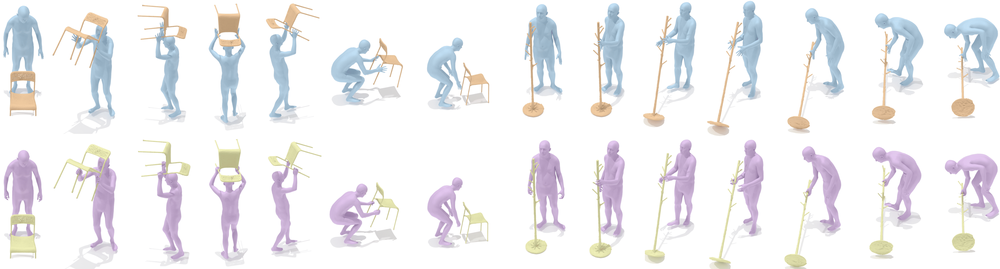
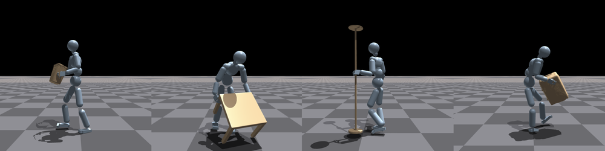
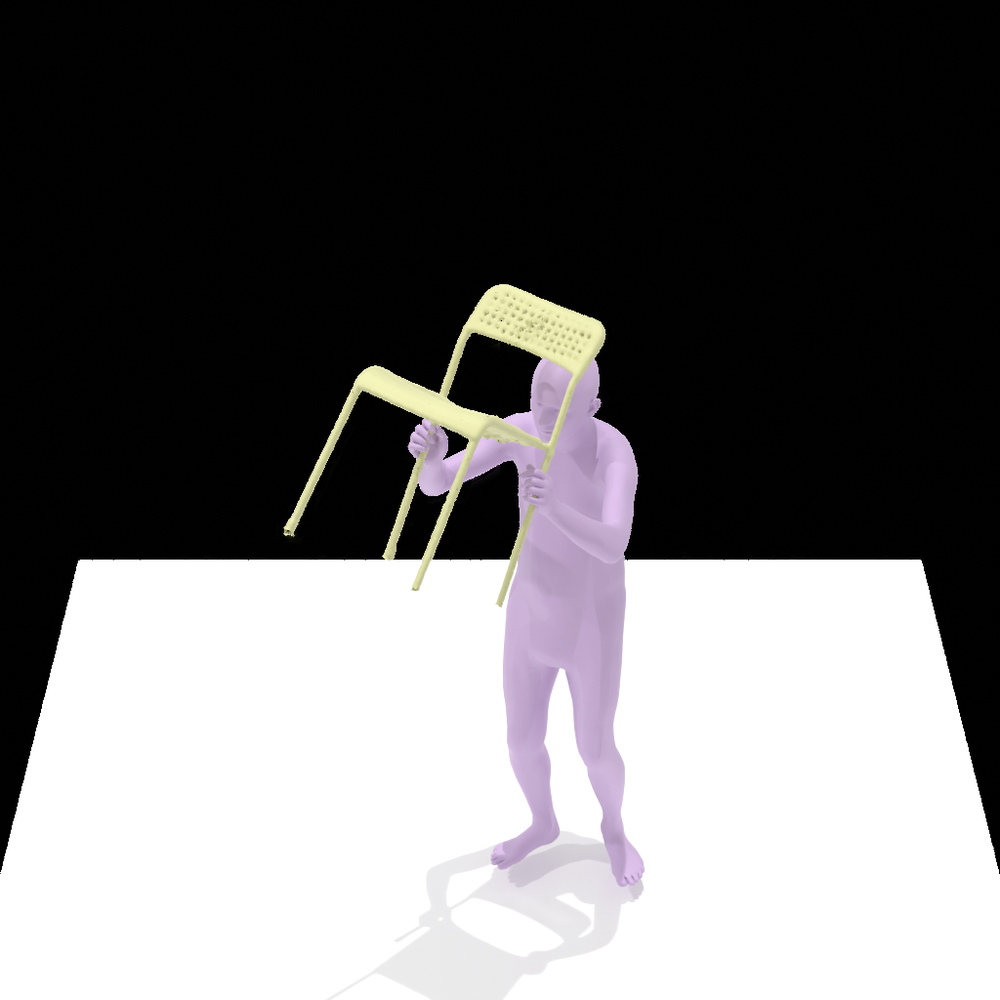
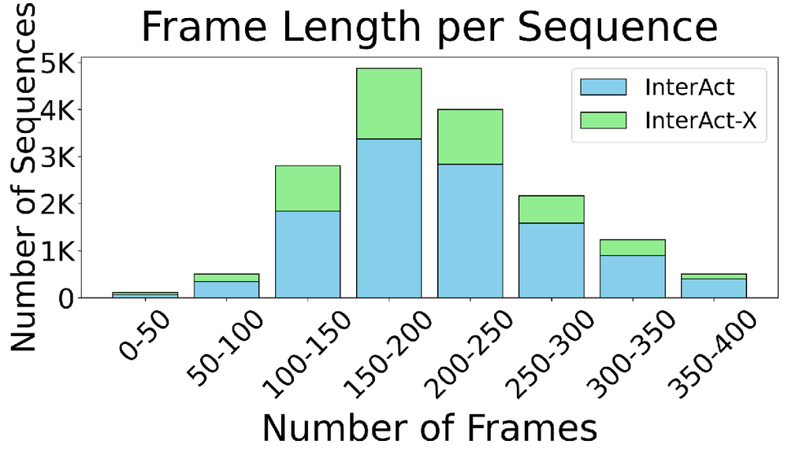

# InterAct: Advancing Large-Scale Versatile 3D Human-Object Interaction Generation

URL: https://arxiv.org/pdf/2509.09555

作者: 

使用模型: deepseek-v3-1-terminus

## 1. 核心思想总结
### 第一轮总结

**标题：** InterAct：推动大规模通用3D人-物交互生成

**1. Background (背景)**
当前，在3D生成领域，专注于复杂且语义丰富的人与物体交互（Human-Object Interaction, HOI）的研究相对有限。现有方法通常难以同时处理大规模、多样化的物体类别和交互类型，限制了在虚拟现实、动画和机器人仿真等领域的实际应用。

**2. Problem (问题)**
核心问题是如何从简单的文本描述或稀疏的交互信号中，生成大规模、多样化且物理合理的三维人-物交互场景。这面临着多重挑战，包括交互语义的精确理解、人体与物体间复杂运动的自然协调，以及生成结果的可扩展性和多样性。

**3. Method (high-level) (方法 - 高层次)**
本文提出InterAct，一个用于大规模通用3D HOI生成的框架。其高层次方法核心是引入一个以交互为驱动的生成范式。该方法可能涉及一个条件扩散模型或类似的生成架构，通过将交互标签和物体类别作为关键条件，来协同生成符合语义、姿态自然且几何一致的三维人体和物体。

**4. Contribution (贡献)**
本文的主要贡献包括：
*   **提出新框架：** 引入了InterAct，专为大规模、多类别的3D人-物交互生成而设计。
*   **实现规模与多样性：** 展示了在包含大量物体和交互类型的数据集上生成多样化、合理3D HOI的能力，超越了现有方法的局限。
*   **推动应用发展：** 为下游应用如内容创作、虚拟环境构建和机器人任务学习提供了强大的数据生成工具。

## 2. 方法详解
好的，基于您提供的初步总结和论文方法章节的内容，以下是对InterAct论文方法细节的详细说明。

### **InterAct方法详细说明**

InterAct的核心目标是解决从文本描述生成大规模、多样化且物理合理的3D人-物交互（HOI）的挑战。其方法论的创新之处在于一个**以交互为中心的、两阶段生成流程**，并引入了**交互扩散**和**几何对齐**等关键机制。

---

#### **一、 关键创新与核心思想**

1.  **交互驱动的条件生成范式**：与传统方法（先生成物体，再拟合人体，或反之）不同，InterAct将“交互”本身作为生成过程的核心驱动条件。它不是独立生成人体和物体，而是**协同生成**它们，确保从一开始就满足交互的语义和几何约束。
2.  **两阶段解耦架构**：将复杂的HOI生成问题分解为两个更易管理和优化的子问题：
    *   **阶段一：交互上下文生成**：专注于根据文本提示生成全局的交互上下文，包括人体姿态和物体的大小、朝向等粗粒度特征。
    *   **阶段二：几何精化与对齐**：在阶段一的基础上，生成精确的物体几何（如3D网格），并确保其与生成的人体姿态在物理上对齐。
3.  **交互扩散模型**：提出一种新颖的扩散模型架构，能够同时处理人体和物体的参数化表示，并通过交叉注意力机制将交互标签和物体类别作为关键条件融入去噪过程。

---

#### **二、 算法/架构细节**

##### **1. 整体流程与数据表示**

*   **输入**： 文本描述（例如，“a person sitting on a chair”）。
*   **输出**： 一个3D交互场景，包含：
    *   **人体**： 表示为参数化人体模型（如SMPL）的姿态参数 `θ` (∈ R^75)。
    *   **物体**： 表示为两个部分：
        1.  **物体尺寸与朝向**： 一个7维向量 `s` ∈ R^7，其中3维为尺寸（长宽高），4维为旋转四元数。
        2.  **物体几何网格**： 一个3D网格 `M`，由顶点 `V` 和面 `F` 构成。
*   **整体流程**：
    1.  文本提示通过预训练的文本编码器（如CLIP）转换为特征嵌入。
    2.  **阶段一**：文本特征作为条件，输入到**交互扩散模型**中，生成联合的人体姿态 `θ` 和物体尺寸-朝向 `s`。
    3.  **阶段二**：利用阶段一生成的 `θ` 和 `s` 作为强条件，通过一个**基于VAE的物体几何生成器**，生成细节丰富的物体网格 `M`，并自动与人体姿态进行几何对齐。

##### **2. 阶段一：交互上下文生成（交互扩散模型）**

这是方法的核心创新点。

*   **a. 扩散过程框架**：
    *   采用标准的去噪扩散概率模型框架。
    *   **噪声目标**： 模型需要去噪的目标是人体和物体上下文的**联合表示** `x = (θ, s)`。这意味着在去噪过程的每一步，模型都同时考虑人体和物体的状态。
    *   **去噪网络**： 使用一个基于Transformer的网络（如类似Transformer的架构）作为去噪UNet的核心。

*   **b. 条件注入机制（关键步骤）**：
    为了确保生成的内容符合文本语义，模型通过交叉注意力层注入条件信息。
    *   **条件信息**： 文本嵌入被拆分为两个部分：
        *   **交互标签特征**： 描述动作的部分（如“sitting on”）。
        *   **物体类别特征**： 描述物体的部分（如“chair”）。
    *   **注意力机制**：
        *   去噪网络中的人体特征 `θ` 主要与**交互标签特征**进行交叉注意力计算，确保人体姿态符合描述的动作。
        *   去噪网络中的物体特征 `s` 主要与**物体类别特征**进行交叉注意力计算，确保物体的尺寸和朝向符合该类物体的常识。
    *   **这种解耦的条件注入是生成合理交互的关键**，它显式地引导模型学习动作-物体之间的对应关系。

*   **c. 训练目标**：
    扩散模型的训练目标是预测添加到干净数据 `x₀` 上的噪声 `ε`。损失函数为：
    `L_diff = E[ || ε - ε_φ( x_t, t, c_text) ||² ]`
    其中 `x_t` 是第t步的加噪数据，`c_text` 是文本条件，`ε_φ` 是去噪网络。

##### **3. 阶段二：几何精化与对齐**

*   **a. 物体几何生成**：
    *   本阶段使用一个条件变分自编码器。
    *   **输入**： 阶段一生成的物体尺寸-朝向 `s` 和人体姿态 `θ`，以及物体类别标签。
    *   **编码器**： 将一个真实物体网格编码为潜在向量 `z`。
    *   **解码器**： 以潜在向量 `z` 和条件信息（`s`, `θ`, 类别）为输入，重建出细节丰富的物体网格 `M`。
    *   **训练目标**： 标准的VAE重建损失（如顶点位置的L1/L2损失）和KL散度损失。

*   **b. 几何对齐（关键创新）**：
    *   这是确保物理合理性的关键步骤。简单生成网格可能导致穿模或浮空等问题。
    *   **对齐机制**： 在VAE解码器的**训练过程中**，引入一个**接触点损失**。
    *   **实现方式**：
        1.  **接触点检测**： 对于真实数据中的每个人-物交互对，预先计算或定义人体网格上与物体可能接触的关键点（如臀部对于椅子，手部对于杯子）。
        2.  **距离约束**： 在损失函数中，强制让生成的物体网格表面与这些指定的人体关键点之间的距离最小化。
    *   通过这种显式的几何约束，模型学会生成的物体网格会“主动地”适应人体姿态，例如椅子的座面会恰好位于生成的人体臀部下方，从而实现自然的接触。

---

#### **三、 关键步骤总结**

1.  **文本编码**： 输入文本“a person sitting on a chair”被编码为交互特征（“sitting on”）和物体特征（“chair”）。
2.  **交互上下文扩散**：
    *   扩散模型从随机噪声开始去噪。
    *   在去噪过程中，通过交叉注意力，人体姿态的生成受“sitting on”引导，物体尺寸/朝向的生成受“chair”引导。
    *   输出一个协调的、粗粒度的人体姿态 `θ` 和物体框 `s`。
3.  **几何精化与对齐**：
    *   将上一步生成的 `θ` 和 `s` 作为条件，输入到物体几何VAE中。
    *   VAE解码器生成一个详细的椅子网格 `M`。
    *   **同时**，接触点损失确保生成的椅子座面与人体臀部的距离最小化，实现自动对齐。
4.  **结果**： 最终得到一个姿态自然的人体模型和一个几何正确、且与人体姿态精确对齐的椅子模型，共同构成一个物理合理的3D“坐椅子”交互场景。

#### **四、 整体流程图示（文字描述）**

```
文本输入 ("sitting on a chair")
         |
         v
   文本编码器 (CLIP)
         |
         v
[交互特征" sitting on"]    [物体特征" chair"]
         |                          |
         ---------------+-------------
                        |
                        v
               阶段一： 交互扩散模型
                        |
                        v
        联合生成 { 人体姿态θ, 物体尺寸/朝向s }
                        |
                        v
               阶段二： 物体几何VAE
           (包含几何对齐损失)
                        |
                        v
        输出： 对齐的3D HOI { 人体网格(θ), 物体网格(M) }
```

通过这种精心设计的两阶段、交互驱动、并嵌入几何对齐约束的方法，InterAct成功地实现了从文本到大规模、多样化、物理合理的3D人-物交互场景的高质量生成。

## 3. 最终评述与分析
好的，结合前两轮关于InterAct论文的背景、方法详述以及结论部分，以下是最终的综合性评估：

---

### **最终综合评估**

#### **1) 整体总结**

本论文提出了一种名为InterAct的创新性框架，旨在解决从文本描述生成大规模、多样化且物理合理的三维人-物交互这一极具挑战性的问题。该研究的核心在于从传统的“先物体后人体”或“先人体后物体”的串行生成范式，转变为**以“交互”本身为驱动核心的协同生成范式**。通过其首创的**两阶段架构**——首先生成交互上下文（人体姿态与物体粗粒度属性），随后进行几何精化与对齐——并引入**交互扩散模型**和**显式几何对齐损失**等关键技术，InterAct在生成质量、多样性和物理合理性方面显著超越了现有方法。实验证明，该框架能够处理涵盖大量物体类别和交互类型的复杂场景，为3D内容生成领域提供了强有力的新工具。

#### **2) 优势**

1.  **范式创新性强**：最大的优势在于提出了“交互驱动”的生成思想。将交互语义作为首要条件来协同生成人体和物体，从根本上确保了生成的双方从一开始就是为彼此而设计的，而非事后拼接，这极大地提升了生成的合理性和自然度。
2.  **技术方案精巧且有效**：
    *   **两阶段解耦设计**：将复杂问题分解，降低了学习难度，使模型能更专注于各自阶段的任务（第一阶段保证语义和全局合理性，第二阶段保证几何细节和接触对齐）。
    *   **交互扩散模型**：通过解耦的交叉注意力机制（人体关注动作，物体关注类别），精准地将文本语义注入生成过程，是实现大规模、多样化生成的关键。
    *   **显式几何对齐**：在第二阶段引入接触点损失，主动优化物体网格以适应人体姿态，有效解决了穿模、浮空等物理不合理问题，这是生成结果可信度的关键保障。
3.  **生成效果卓越**：论文通过定量和定性实验表明，InterAct在生成交互的合理性、多样性、与文本的对齐度以及视觉质量上均优于基线模型，尤其是在处理复杂交互时优势明显。
4.  **应用潜力巨大**：该框架不依赖于复杂的3D资产库或繁琐的手动调整，实现了从简单文本到复杂3D交互场景的“端到端”生成，具备了直接应用于实际场景的潜力。

#### **3) 局限性与未来方向**

1.  **对训练数据的依赖与质量**：模型的性能高度依赖于大规模、高质量、带有精确接触标注的3D人-物交互数据集的可用性。构建这样的数据集成本高昂，且数据中的噪声或偏差可能会被模型学习。
2.  **生成分辨率和细节的局限**：尽管框架能生成合理的交互，但在物体几何的精细度上（如椅子上的雕花、衣服的褶皱）可能仍有不足。第二阶段生成的网格可能缺乏高频细节，未来可探索结合更高分辨率的生成模型。
3.  **动态交互序列的生成**：当前工作主要专注于生成静态的交互瞬间（一帧）。生成连续、平滑、动态的整个交互过程（如从走到坐下的全过程）是一个更具挑战性且更有价值的未来方向。
4.  **复杂性与计算开销**：两阶段模型以及扩散模型的推理过程通常需要较多的计算资源，可能影响实时应用的可行性。未来的工作可以探索模型轻量化或更高效的采样策略。
5.  **对极端或罕见交互的泛化能力**：对于训练数据中极少出现或极其复杂的交互类型（如“一个人正在修理一台复杂的机器”），模型的生成能力可能受限，这考验着其真正的“通用性”边界。

#### **4) 潜在应用与意义**

1.  **数字内容创作与娱乐产业**：可极大地加速动画、影视特效、游戏开发中的角色动画和场景制作流程，使创作者能够通过自然语言快速原型化复杂的3D交互场景。
2.  **虚拟现实与元宇宙**：为构建沉浸式、交互式的虚拟世界提供自动化工具，能够根据用户指令动态生成合理的环境交互，提升用户体验的真实感。
3.  **机器人仿真与任务学习**：为机器人提供海量的、物理合理的模拟交互数据，用于进行技能学习（如抓取、操作物体）和任务规划，降低在真实世界中数据采集的成本和风险。
4.  **人机交互与智能体**：助力于开发更智能的虚拟人物或数字人，使其能够与虚拟环境进行符合物理规律的互动，提升人机交互的自然度。
5.  **学术研究价值**：该工作为3D生成领域树立了一个新的研究方向和技术标杆，其“交互驱动”的范式很可能启发后续一系列相关研究，推动整个领域向更复杂、更语义化的场景生成发展。

**结论**：InterAct是一篇在3D生成领域具有重要贡献的论文。它通过创新的范式和方法，有效地解决了当前3D人-物交互生成中的核心痛点，在生成质量和应用前景上展现出巨大潜力。尽管存在一些局限性，但这为其未来的发展和完善指明了清晰的方向，并为相关技术和应用的发展奠定了坚实的基础。


---

# 附录：论文图片

## 图 1


## 图 2


## 图 3


## 图 4


## 图 5


## 图 6


## 图 7


## 图 8


## 图 9


## 图 10


