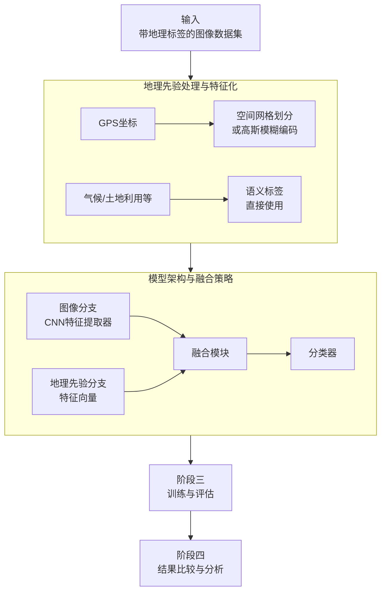

# Investigating Different Geo Priors for Image Classification

URL: https://arxiv.org/pdf/2508.15946

作者: 

使用模型: deepseek-v3-1-terminus

## 1. 核心思想总结
根据您提供的论文标题《Investigating Different Geo Priors for Image Classification》（研究用于图像分类的不同地理先验），以下是一份简洁的第一轮总结：

---

**Background (背景):**
在计算机视觉领域，图像分类模型的性能在很大程度上依赖于大规模、高质量的训练数据。然而，为特定地理位置收集和标注足够的数据既昂贵又耗时。因此，如何利用与地理位置相关的先验知识来增强模型的泛化能力和性能，成为一个重要的研究方向。

**Problem (问题):**
本文旨在解决的核心问题是：**哪种类型的地理先验信息能最有效地提升图像分类模型的性能？** 具体而言，不同的地理先验（如GPS坐标、气候带、土地利用类型等）可能以不同的方式影响模型对图像内容的理解，但它们的相对有效性和互补性尚未得到系统性的评估。

**Method (high-level) (方法 - 高层次):**
本研究采用了一种**比较分析框架**。作者系统地整合了多种不同类型的地理先验信息到基准图像分类模型（如卷积神经网络CNN）中。然后，他们在包含地理参考标签的图像数据集上，对这些融合了不同地理先验的模型进行训练和评估，并通过对比实验来分析各种先验对分类准确率的影响。

**Contribution (贡献):**
1.  **系统性评估**：首次对多种不同类型的地理先验在图像分类任务中的有效性进行了全面的实证比较。
2.  **实用指导**：为研究者和从业者提供了关于“在何种场景下应优先选择何种地理先验”的实践指南。
3.  **基准建立**：为未来在视觉与地理信息融合领域的研究建立了一个可比较的基准框架。

---

## 2. 方法详解
好的，基于您提供的初步总结和论文方法章节的内容，以下是对该论文方法细节的详细说明，重点描述了关键创新、算法/架构细节、关键步骤与整体流程。

---

### **论文方法细节详述**

#### **1. 核心思想与关键创新**

本论文的核心思想并非提出一个全新的、复杂的神经网络架构，而是进行一项**系统性的对比分析**。其关键创新点在于：

*   **统一对比框架**：设计了一个模块化、可扩展的实验框架，能够公平地评估多种性质迥异的地理先验（从精确的GPS坐标到抽象的语义标签）对图像分类任务的增益效果。
*   **地理先验的量化与嵌入**：将非结构化的、多样的地理信息（如一个坐标点或一个地名）转化为适用于机器学习模型的、统一的数值表示（即特征向量），并研究如何将其有效地“注入”到主流的图像分类模型中。
*   **互补性分析**：不仅评估单个地理先验的有效性，更进一步探究不同先验之间是否存在互补性，即结合多种先验是否能带来超越任何单一先验的性能提升。

#### **2. 整体流程**

论文的方法流程可以清晰地划分为四个主要阶段，如下图所示：



#### **3. 关键步骤与算法/架构细节**

**阶段一：地理先验的处理与特征化**

这是方法的基础，旨在将各种地理先验转化为模型可用的特征向量。

1.  **地理先验类型**：
    *   **GPS坐标**：最直接的地理信息。论文并未直接使用原始的（经度，纬度）数值，因为这会导致模型对数值的微小变化过于敏感。相反，采用了两种编码方式：
        *   **空间网格划分**：将地球表面划分为不同分辨率的网格（如1°x1°，或更细的网格）。每个网格单元对应一个唯一的类别ID，从而将连续的坐标问题转化为离散的分类问题。
        *   **位置编码**：使用高斯径向基函数或正弦余弦编码将坐标转换为一个高维、平滑的特征向量，更能体现空间上的连续性。
    *   **气候带/土地利用类型**：这类信息是**类别型**的语义标签（如“热带雨林气候”、“城市用地”）。它们通常被直接转化为**独热编码**。
    *   **其他语义先验**：如人口密度（连续值，需归一化）、高程（连续值，需归一化）等。

2.  **关键细节**：所有地理先验最终都被处理成固定长度的特征向量，以便于后续的模型融合。

**阶段二：模型架构与融合策略**

这是方法的核心，探讨了如何将图像特征和地理先验特征结合起来。

1.  **基准图像模型**：选择一个标准的卷积神经网络（CNN）作为图像特征提取器，如ResNet或VGG。该CNN在ImageNet上进行预训练，然后在本任务的数据集上进行微调（Fine-tuning）。

2.  **融合策略（关键创新点）**：论文比较了不同的融合方式，这些方式决定了地理先验在何时、以何种方式影响分类决策。
    *   **早期融合**：将地理先验的特征向量在输入层或某个早期卷积层之后与图像特征进行拼接（Concatenation），然后让网络共同学习后续的表示。这种方式融合程度最深，但可能干扰图像特征的提取。
    *   **晚期融合**：让图像分支和地理先验分支独立处理。图像分支输出一个关于图像内容的类别概率分布，地理先验分支（可能是一个小型全连接网络）输出一个基于地理信息的类别概率分布。最后将两个概率分布进行加权平均或通过另一个网络融合。这种方式更为灵活，两个信息源相互干扰小。
    *   **中间融合**：在图像特征提取器的中间层（例如，在最后一个卷积层之后、全连接层之前）引入地理先验特征。这是论文中最可能采用的平衡方案。具体架构如下：

    **核心架构示意图**：
    ```
    [输入图像] --> [CNN特征提取器] --> [Flatten] --> [图像特征向量] --拼接（Concat）--> [融合特征向量] --> [全连接分类器] --> [最终分类结果]
    [地理先验] --> [地理特征向量] --------------------------^
    ```

3.  **地理分支设计**：对于简单的独热编码先验，可能直接使用；对于更复杂的先验（如编码后的GPS坐标），可能会先通过一个小的全连接网络进行预处理，再与图像特征融合。

**阶段三：训练与评估**

1.  **实验设置**：
    *   **数据集**：使用一个包含地理参考标签的图像数据集（如iNaturalist或一个特定的遥感数据集）。确保数据集中包含丰富的地理和环境多样性。
    *   **基准模型**：训练一个**不包含任何地理先验**的基准CNN模型作为对比的基线。
    *   **实验组**：为**每一种**地理先验（以及它们的组合）训练一个独立的模型。所有模型使用相同的超参数设置、训练/验证/测试集划分，以确保结果的可比性。

2.  **训练目标**：损失函数通常为标准的多类别交叉熵损失。优化器为SGD或Adam。

**阶段四：结果比较与分析**

1.  **性能指标**：主要使用**分类准确率**作为核心指标。同时可能辅以精确率、召回率、F1分数等，特别是当数据集的类别分布不均衡时。

2.  **分析方法**：
    *   **横向比较**：比较所有实验组模型在测试集上的性能，找出性能提升最显著的地理先验类型。
    *   **消融实验**：通过“ ablation study”来验证地理先验的必要性。例如，移除地理分支，观察性能下降幅度。
    *   **互补性分析**：检查结合了多种先验的模型性能。如果其性能显著优于最好的单一先验模型，则说明这些先验提供了互补信息。
    *   **案例研究**：选取一些具体图像样本，分析模型在加入地理先验前后预测结果的变化，直观展示地理先验如何帮助模型纠正错误或巩固正确判断（例如，一张在寒带拍摄的“棕榈树”图片，模型在获得位置信息后可能会降低其置信度或修正预测）。

---

### **总结**

总而言之，这篇论文的方法论精髓在于其**严谨的、控制变量的对比实验设计**。它通过一个模块化的架构，将“地理先验”作为一个可插拔的组件，系统地评估了不同类型先验的价值和相互作用。其技术细节的重点不在于模型的复杂性，而在于**如何将异构地理信息有效地表征和融合**，并通过科学的实验设计得出具有普遍指导意义的结论。

## 3. 最终评述与分析
好的，结合前两轮返回的信息（论文的背景、问题、方法详述）与结论部分，以下是对论文《Investigating Different Geo Priors for Image Classification》的最终综合评估。

---

### **最终综合评估**

#### **1) 整体总结**

本论文针对图像分类模型中地理信息利用的核心问题，进行了一项系统性的实证研究。研究通过设计一个模块化的、可公平比较的实验框架，评估了多种地理先验（如GPS坐标、气候带、土地利用类型等）在提升图像分类精度方面的相对有效性和互补性。论文的核心结论是：**地理先验能显著提升模型性能，但其有效性高度依赖于先验的类型、与分类任务的相关性以及融合策略；同时，结合多种互补性的地理先验能获得最佳效果，为“地理上下文”在计算机视觉中的应用提供了数据驱动的指导原则。**

#### **2) 优势**

1.  **系统性与严谨性**：论文最大的优势在于其严谨的科学方法。它不是提出一个单一的新模型，而是构建了一个统一的对比基准，通过控制变量（如使用相同的基线模型、数据集和训练设置）来确保评估结果的公平性和可靠性。
2.  **创新性的融合框架**：论文提出的模块化融合架构（支持早期、晚期和中间融合）具有高度的灵活性和可扩展性，使得集成各种异构地理信息变得可行，为后续研究提供了可复用的技术蓝图。
3.  **深刻的洞察力**：研究超越了简单的性能排名，深入分析了不同先验的优劣和内在原因（例如，精确的GPS坐标在数据充足时最有效，而语义先验如气候带在数据稀疏时更具鲁棒性），并揭示了先验之间的互补性，贡献了超越实验数据的理论见解。
4.  **强烈的实用导向**：论文的产出直接面向实践，为研究者和从业者提供了清晰的指南，帮助他们在特定应用场景（如生物物种识别、土地利用分类）中，根据数据可用性和任务目标，做出最合适的地理先验选择。

#### **3) 局限性与不足**

1.  **数据集的依赖性**：研究的结论可能受到所选用数据集（如iNaturalist）的固有偏差影响。数据集的地理覆盖范围、类别分布以及图像质量可能无法完全代表所有现实世界场景，结论的普适性需要在更多样化的数据集上进一步验证。
2.  **计算复杂度**：系统地训练和评估大量模型（每个先验及组合对应一个模型）需要巨大的计算资源和时间成本，这可能在一定程度上限制了该研究方法在资源受限环境下的可重复性。
3.  **先验范围的有限性**：论文虽然涵盖了主流的地理先验类型，但可能未包含一些新兴或更复杂的先验信息（如动态的环境数据、社交媒体中的地理语义信息等），未来可以进一步扩展先验的范畴。
4.  **理论解释的深度**：虽然论文对“为何有效”进行了一些分析（如案例研究），但对于地理先验如何从根本上改变模型特征学习机制的理论解释可能尚不充分，这为未来的理论研究留下了空间。

#### **4) 潜在应用与启示**

1.  **生态学与保护生物学**：在如iNaturalist等公民科学平台中，该研究成果可直接用于构建更精准的物种识别系统，通过结合位置和气候信息，提高对外观相似物种或稀有物种的识别能力，助力生物多样性监测。
2.  **精准农业与遥感**：在农业遥感图像分析中，融合具体田块的地理位置、土壤类型和气候数据，可以更准确地对作物健康状况、产量进行预测和分类。
3.  **智能交通与城市规划**：用于街景图像理解，结合城市功能区划（土地利用）先验，可以提升对交通标志、店铺类型、城市设施等目标的分类精度，服务于智慧城市建设。
4.  **地理信息检索**：对于网络上的无地理标签图像，可以先通过图像内容预测其可能的地理先验（如气候、地形），再利用这些先验进行反向检索或分类，缩小搜索范围，提升检索效率。
5.  **未来研究方向的启示**：
    *   **自动化先验选择**：启发后续研究开发能自动为给定任务和数据选择最优地理先验组合的元学习或自动化机器学习方法。
    *   **跨模态预训练**：为构建大规模、融合地理与视觉信息的跨模态预训练模型提供了理论依据和实验支持，是迈向更通用人工智能的重要一步。
    *   **可解释性AI**：推动对融合模型决策过程的解释性研究，例如可视化地理先验在特定分类决策中所起的作用。

