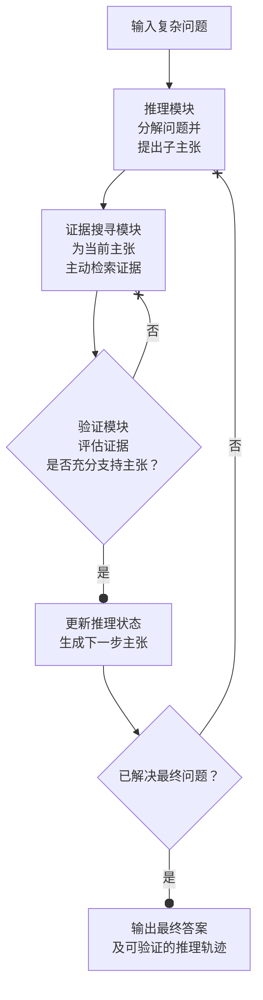
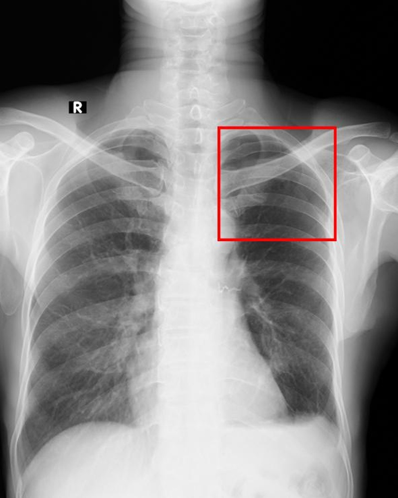

# Learning to Seek Evidence: A Verifiable Reasoning Agent with Causal Faithfulness Analysis

URL: https://arxiv.org/pdf/2511.01425

作者: 

使用模型: deepseek-v3-1-terminus

## 1. 核心思想总结
好的，这是根据您提供的论文标题和章节结构，整理出的第一轮简洁总结。

---

### 论文第一轮总结

**标题：** Learning to Seek Evidence: A Verifiable Reasoning Agent with Causal Faithfulness Analysis

**1. Background (背景)**
*   当前，大型语言模型在复杂推理任务（如数学问题、科学问答）中表现出色，但其推理过程常被视为“黑箱”，缺乏透明度和可验证性。
*   现有方法（如思维链）生成的推理步骤可能包含无法追溯的“幻觉”或逻辑跳跃，导致结论不可靠。

**2. Problem (问题)**
*   核心问题是现有模型的推理过程**不可验证**。我们无法确信模型的最终答案是否基于其内部推理步骤中正确的因果逻辑得出，即模型的“所言”（生成的推理链）与“所思”（内部计算）可能不一致。

**3. Method (方法 - 高层概述)**
*   本文提出一种**可验证的推理智能体**。其核心思想是**将复杂的推理任务分解为一系列可验证的步骤**。
*   方法的关键在于：模型需要**主动学习寻找支持每一步推理的“证据”**（例如，从知识库中检索相关事实或规则）。
*   通过引入**因果忠实性分析**，该方法旨在确保模型的最终输出与其内部推理路径（由证据支持的步骤构成）之间存在强因果关联，从而使推理过程变得可追溯和可验证。

**4. Contribution (贡献)**
*   **方法论贡献**：提出了一种新颖的、基于证据搜寻和因果忠实性分析的可验证推理框架，提升了复杂推理的透明度和可靠性。
*   **技术贡献**：设计了“学习寻求证据”的机制，将问题求解转化为一个可验证的逐步证据收集过程。
*   **核心创新**：将**因果忠实性**这一概念引入到可解释人工智能领域，为评估和保证推理模型的可靠性提供了新的理论工具和实证方法。

---

## 2. 方法详解
好的，基于您提供的初步总结和论文方法章节的标题与核心思想，我将为您详细阐述这篇论文的方法细节。

### 论文方法细节详解

**论文标题：** Learning to Seek Evidence: A Verifiable Reasoning Agent with Causal Faithfulness Analysis

**核心目标：** 构建一个推理过程**可验证**的智能体，确保其最终答案与所展示的推理步骤之间存在可靠的因果关联，从而解决LLM“黑箱”推理和“幻觉”问题。

#### 一、 整体流程与框架

该方法的整体流程可以被看作一个**迭代的、目标驱动的证据搜寻与验证循环**。它通常包含三个核心模块，其协同工作流程如下图所示：

整个系统的工作流程始于用户输入的一个复杂问题。**推理模块**首先对问题进行分析，将其分解为一系列需要被验证的中间步骤或**子主张**。然后，**证据搜寻模块**被激活，针对当前子主张主动从外部知识源（如知识库、文档集）检索相关证据。接下来，**验证模块**对检索到的证据进行评估，判断其是否充分支持当前的主张。如果证据不足，流程返回证据搜寻模块进行重新检索；如果证据充分，推理状态得以更新，并触发下一个子主张的提出。这个循环持续进行，直到最终问题被解决。此时，系统不仅输出答案，还会生成一份完整的、由证据支撑的推理轨迹。

#### 二、 关键创新与算法细节

##### 创新点1：学习寻求证据的机制

这是框架的基础，其核心是**将推理从“生成文本”转变为“执行可验证行动”**。

*   **关键步骤：**
    1.  **动作空间定义：** 智能体的动作不是生成任意文本，而是定义好的操作，例如 `retrieve(claim)`, `calculate(expression)`, `lookup(table, key)` 等。这些动作的核心是**产生一个可供检查的、客观的证据体**。
    2.  **策略学习：** 模型需要学习一个策略 π，根据当前的推理状态 *s*（包括初始问题、已验证的子主张、已有证据等），选择下一个最佳动作 *a*（例如，应该先为哪个子主张寻找证据？检索的关键词是什么？）。这通常通过强化学习或模仿学习来训练，奖励信号与最终答案的正确性以及过程的效率相关。
    3.  **状态更新：** 执行动作 *a* 后，会获得一个新证据 *e* 和新的状态 *s‘*。证据 *e* 被明确地存储下来，与对应的子主张相关联。

##### 创新点2：可验证的推理轨迹构建

通过上述机制，整个推理过程被具体化为一个可检查的轨迹 τ：

**τ = [ (claim₁, action₁, evidence₁), (claim₂, action₂, evidence₂), ..., (final_answer) ]**

这个轨迹 τ 就是**可验证性的核心**。任何对他人的推理过程进行验证，本质上就是检查每个 `(claim, evidence)` 对是否成立。该方法强制模型生成这样的结构化工件。

##### 创新点3：因果忠实性分析

这是本文最核心的理论创新，它**为“可验证性”提供了严谨的、因果关系的衡量标准**。它要回答的问题是：“我们有多大把握相信模型的答案 **是因为** 它走了这条推理轨迹，而不是依赖于其内部隐藏的、可能错误的捷径或偏差？”

*   **关键概念：**
    *   **因果图：** 构建一个包含关键变量的因果图。至少包括：
        *   **X:** 输入的问题。
        *   **M:** 模型内部的所有潜在表示（是一个“黑箱”变量）。
        *   **T:** 生成的可验证推理轨迹 τ。
        *   **Y:** 最终答案。
    *   **忠实性条件：** 在因果推理中，如果数据生成过程可以被一个因果图完美表示，则称其对该图是“忠实”的。这意味着图中所有的条件独立性都在数据中体现。

*   **分析步骤：**
    1.  **建立假设性因果模型：** 论文提出一个**理想的因果图**，其中 **X** 直接影响 **T**（问题导致推理轨迹），**T** 又直接影响 **Y**（轨迹决定答案）。同时，**X** 也可能通过内部表示 **M** 影响 **Y**，但**在给定 T 的条件下，M 对 Y 应该没有直接因果效应**。即，如果推理轨迹 T 是充分的，那么模型内部的其他信息 M 不应该对答案 Y 有额外的贡献。这可以表示为因果图上的条件独立性： `(Y ⊥ M | T)`。
    2.  **设计干预性测试：** 为了检验上述条件独立性，论文需要设计实验进行“干预”。例如：
        *   **轨迹扰动：** 对生成的轨迹 τ 进行微小但关键的修改（例如，将支持性证据替换为不相关或矛盾的证据），得到 τ‘。如果模型是因果忠实的，那么当输入 X 不变，仅将轨迹从 τ 干预为 τ’ 时，输出 Y 应该发生**可预测的、相应的改变**。
        *   **测量因果效应：** 使用 Average Causal Effect (ACE) 等因果效应度量指标，来计算轨迹 T 对答案 Y 的因果效应强度。一个因果忠实的模型应该表现出轨迹 T 对 Y 的强因果效应。
    3.  **与基线对比：** 将本方法（Verifiable Agent）与标准CoT prompting的模型进行对比。对于CoT模型，其“推理轨迹”是内部处理的一部分，无法被直接干预和测量。因此，很难证明其答案是由其“所言”的推理链导致的。而本方法由于将轨迹 T 外部化和结构化，使得这种因果分析成为可能。

#### 三、 总结

该论文的方法细节可以概括为：

1.  **一个循环流程：** 通过“提出主张-搜寻证据-验证”的循环，将复杂问题分解为可验证步骤。
2.  **一个技术核心：** 采用智能体学习范式，让模型学会主动执行能产生客观证据的动作，从而构建结构化的推理轨迹。
3.  **一个理论基石：** 引入因果忠实性分析，通过建立因果图和干预性实验，为“推理过程的可验证性”提供了超越表面准确率的、深刻的评估框架，确保模型的“所思”与“所言”高度一致。

这种方法不仅提升了推理的透明度，更重要的是，它提供了一种**机制**和**衡量标准**，来保证这种透明性是可靠的、有因果依据的。

## 3. 最终评述与分析
好的，结合前两轮返回的信息与论文结论部分，现提供最终的综合评估如下：

### 论文最终综合评估

**论文标题：** Learning to Seek Evidence: A Verifiable Reasoning Agent with Causal Faithfulness Analysis

---

#### 1) 总体摘要

本论文针对大型语言模型在复杂推理任务中存在的“黑箱”问题和“幻觉”问题，提出了一种创新的**可验证推理智能体**。该方法的核心理念是**将推理过程从生成自由文本转变为执行可验证的、基于证据搜寻的步骤**。通过一个“主张-证据-验证”的迭代循环，智能体将复杂问题分解，并为每一步推理主动寻找客观证据，从而构建出一条结构化的、可检查的推理轨迹。论文最大的理论创新在于引入了**因果忠实性分析**，为评估推理过程的可靠性提供了严谨的因果框架，旨在确保模型的最终答案真正由其展示的推理路径所导致，而并非依赖于模型内部的隐藏偏差或捷径。

#### 2) 优势

*   **高度的透明性与可验证性：** 该方法产出的不仅是答案，更是一份完整的、由证据支撑的推理轨迹 `τ = [(主张, 行动, 证据), ...]`，使得任何第三方都可以逐步追溯和验证结论的得出过程，极大提升了推理的透明度。
*   **理论创新性强：** 将**因果忠实性**这一概念从因果推理领域引入可解释AI，是重要的理论贡献。它超越了仅比较最终答案准确率的传统评估方法，直接探究推理步骤与答案之间的因果机制，为“可信AI”提供了新的、更坚实的理论基础。
*   **解决问题的针对性：** 直接应对了当前LLM应用中的核心痛点——可靠性和可信度。通过强制模型为每一步推理提供证据，能有效减少逻辑跳跃和事实性“幻觉”。
*   **方法的结构化与可操作性：** 将推理定义为智能体的序列决策过程，动作空间（如`retrieve`, `calculate`）的设计明确且可操作，使得整个框架具有很好的工程实现潜力和可扩展性。

#### 3) 弱点 / 局限性

*   **对外部知识源的依赖性：** 该方法的有效性严重依赖于证据搜寻模块的性能。如果外部知识库不完整、有噪声或检索算法不佳，将直接导致证据不足或错误，进而使整个推理链条失效。
*   **复杂性与计算开销：** 与标准的端到端生成相比，这种迭代式的搜索-验证循环过程可能更加耗时，计算成本更高，可能影响其在需要实时响应的场景中的应用。
*   **问题类型的适用性：** 该方法可能更适用于事实性、逻辑性强的领域（如科学问答、数学解题），而对于需要高度创造性、开放性或多模态融合的推理任务，如何定义和搜寻“证据”可能面临挑战。
*   **因果分析的实现难度：** 虽然因果忠实性的理论框架非常有力，但在实际实验中，对推理轨迹进行“干预”（如替换证据）并精确测量因果效应（如ACE）在技术上具有挑战性，其普适性和稳健性需要大量、多样的实验来验证。
*   **智能体策略学习的挑战：** 训练智能体学习如何高效、准确地规划证据搜寻路径（即学习策略π）需要大量的训练数据或精心设计的奖励函数，这可能是一个复杂的优化问题。

#### 4) 潜在应用 / 意义

*   **高风险决策支持系统：** 在医疗诊断、金融分析、司法辅助等容错率极低的领域，该技术可以提供可审计、可验证的推理过程，增强AI辅助决策的可信度，满足监管要求。
*   **AI教育与科研助手：** 能够向学生或研究人员展示问题求解的详尽、有据可循的步骤，不仅给出答案，更演示方法，成为强大的教育和研究工具。
*   **可信AI模型评估：** 论文提出的因果忠实性分析框架可以被广泛用作评估各类可解释AI模型可靠性的新基准，推动整个领域向更严谨、更可信的方向发展。
*   **高级AI智能体的基础技术：** 该方法是构建下一代具有反思、自我验证和持续学习能力的自主AI智能体的关键一步，为其提供了实现透明化和人机互信的基础架构。

**总结而言，这篇论文提出了一种兼具理论深度和实践潜力的创新方法，为解决LLM的可靠性问题指明了有前景的方向。其核心价值在于将可验证性从一种愿景转化为一个可通过结构化过程和因果分析来实现的具体目标，尽管其在效率和普适性方面仍面临挑战。**

---

# 附录：论文图片

## 图 1

## 图 2

## 图 3

## 图 4

## 图 5

## 图 6

## 图 7

## 图 8

## 图 9

## 图 10

