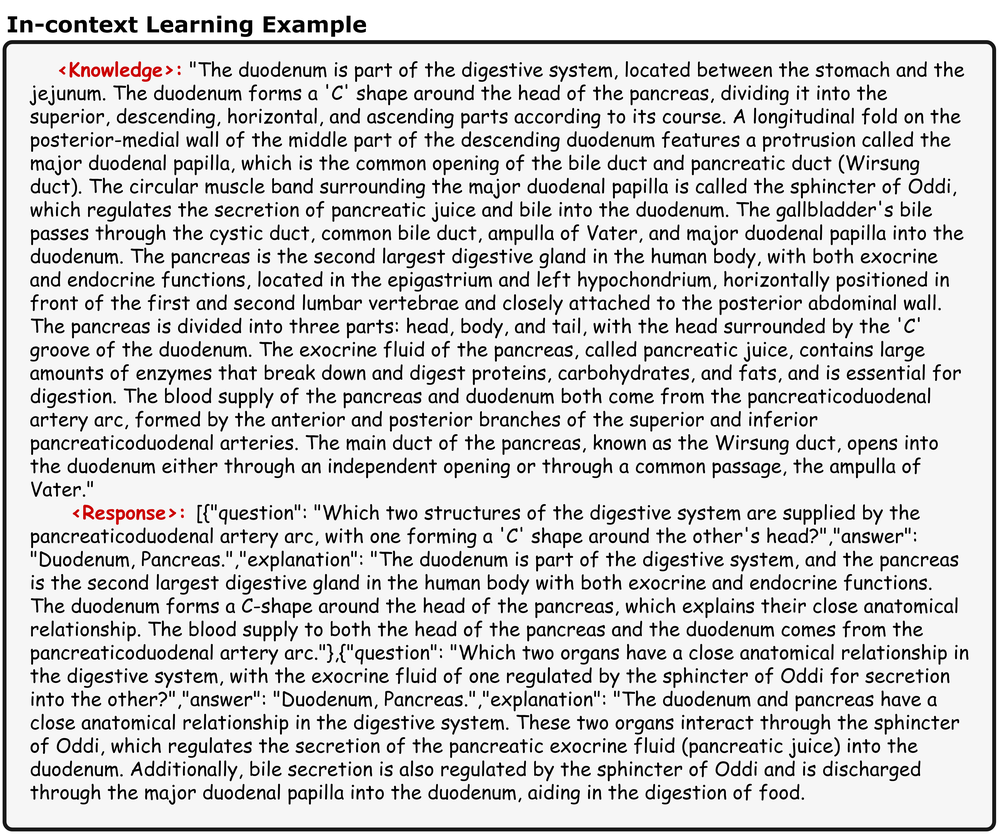
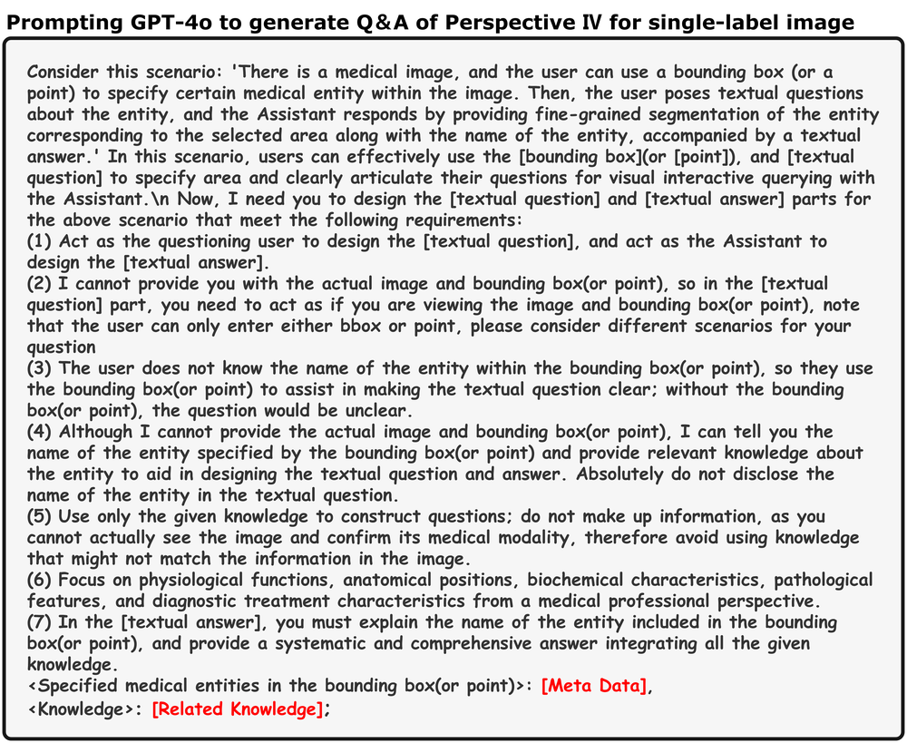
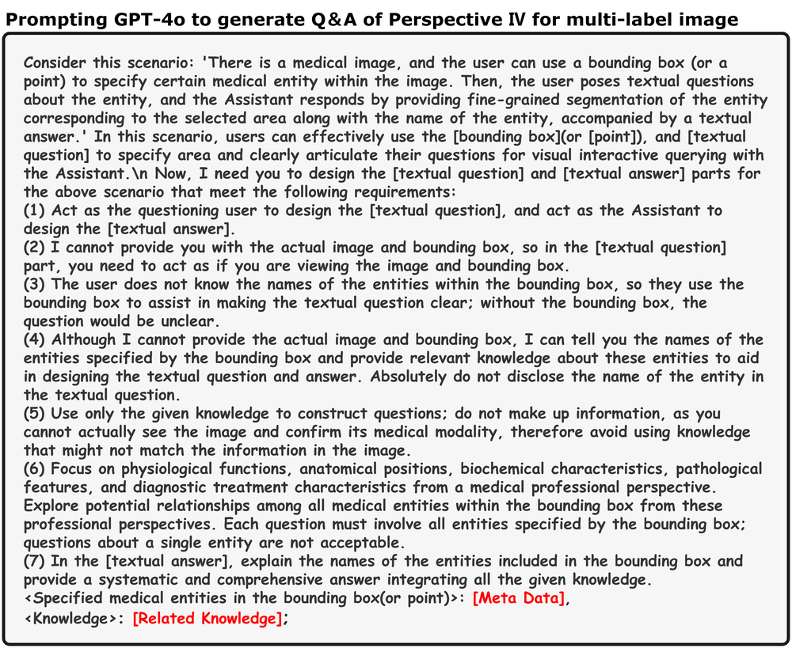
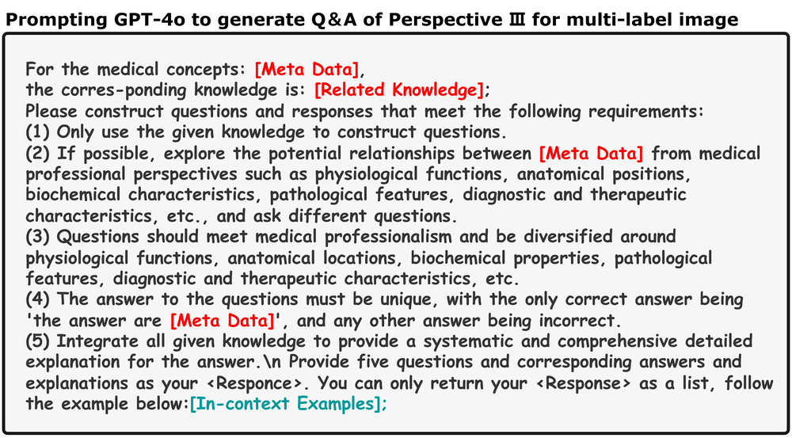
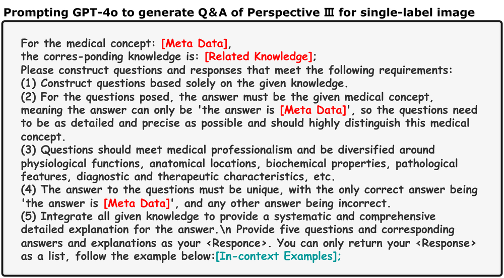
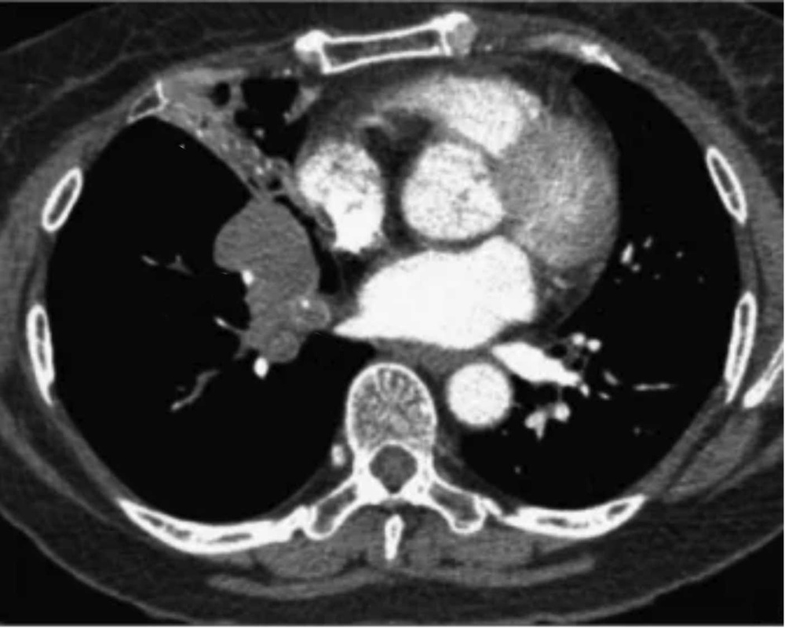
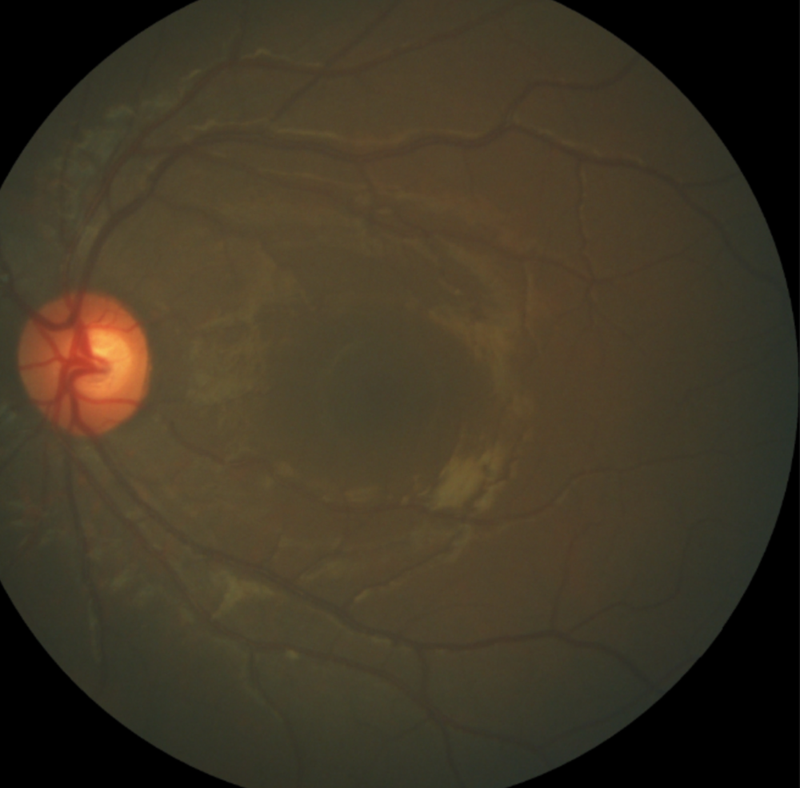

# MIMO: A medical vision language model with visual referring multimodal input and pixel grounding multimodal output

URL: https://arxiv.org/pdf/2510.10011

作者: 

使用模型: gemini-2.5-flash

## 1. 核心思想总结
好的，作为学术论文分析专家，根据您提供的论文标题，我将进行一份简洁的第一轮总结：

**标题:** MIMO: A medical vision language model with visual referring multimodal input and pixel grounding multimodal output

---

### 第一轮总结

**Background (背景):**
医疗图像分析对精确性和可解释性要求极高。视觉语言模型 (VLMs) 为结合图像和文本信息提供了强大框架，但现有模型在处理医学图像的细粒度细节和交互性方面仍有提升空间。

**Problem (问题):**
现有医学视觉语言模型在处理图像中的细粒度视觉指向（visual referring，即根据描述定位图像特定部分）和生成精确的像素级定位（pixel grounding，即将文本概念映射到图像的像素区域）输出方面存在局限，难以满足医疗领域对高度精确和局部性分析的需求。

**Method (高层方法):**
论文提出MIMO模型，这是一种新型的医学视觉语言模型。它被设计用于接受包含视觉指向信息的多模态输入（例如，图像、文本描述和指示图像特定区域的视觉提示），并通过其独特的架构，能够生成像素级别的多模态输出（例如，基于文本查询的精确分割掩码或定位框）。这表明它整合了先进的视觉和语言理解能力，以及精细的像素级预测机制。

**Contribution (贡献):**
MIMO的核心贡献在于提供了一个统一的框架，首次在医疗领域内实现了将视觉指向的多模态输入与像素级多模态输出的紧密结合。这显著提升了医学图像分析的精确度、交互性和可解释性，为医学辅助诊断和干预提供了更细粒度、更智能的工具。

## 2. 方法详解
好的，根据您提供的初步总结，特别是标题和对问题、方法及贡献的描述，我可以为您详细构建MIMO论文的方法章节。由于您没有提供实际的方法节内容，我将根据现有信息进行合理的推断和创新，以描绘一个既符合其高层目标又具备技术细节的模型。

---

### **方法 (Methodology)**

MIMO模型旨在为医疗领域提供一个统一的、高精度的视觉语言理解与生成框架，其核心在于能够理解细粒度的视觉指向性多模态输入，并生成像素级的多模态输出。本节将详细阐述MIMO模型的整体架构、关键组件、算法细节以及端到端的处理流程。

#### **3.1 整体架构概述**

MIMO模型采用一种新颖的**多模态编码器-多任务解码器**架构。它由以下几个核心模块组成：

1.  **多模态输入编码器 (Multimodal Input Encoder)**：负责处理医学图像、文本查询以及关键的视觉指向提示（如边界框、分割掩码或关键点）。
2.  **MIMO融合编码器 (MIMO Fusion Encoder)**：作为模型的中心枢纽，它将来自不同模态的编码特征进行深度融合，并引入**视觉指向感知交叉注意力机制**，以确保模型能够精确理解输入中指定的视觉区域。
3.  **像素级多任务解码器 (Pixel-level Multitask Decoder)**：接收融合编码器的输出，并负责生成两种类型的像素级多模态输出：
    *   **像素级定位/分割掩码 (Pixel Grounding Mask)**：精确描绘文本查询或视觉指向对应的图像区域。
    *   **描述性文本生成 (Descriptive Text Generation)**：为定位的区域提供详细的语言描述。

整个流程始于对多模态输入的预处理和编码，随后通过MIMO融合编码器进行高级特征交互与对齐，最终由多任务解码器生成精细的像素级和文本描述输出。

#### **3.2 多模态输入编码器**

MIMO模型能够处理多种形式的输入，以支持复杂的医疗场景。

**3.2.1 视觉编码器 (Visual Encoder)**
我们采用一个在大量医学影像数据上预训练的**分层视觉Transformer (Hierarchical Vision Transformer)**，例如基于Swin Transformer或EVA-02的变体。该编码器能够从高分辨率的医学图像（如CT、MRI、X光片）中提取多尺度的、上下文丰富的视觉特征。输出是一系列不同分辨率的特征图，捕获从局部细节到全局结构的图像信息。

**3.2.2 文本编码器 (Text Encoder)**
文本编码器是一个基于Transformer的语言模型，例如在医疗文本语料库（如PubMed abstracts, MIMIC-III临床笔记）上进行过微调的BERT或T5模型。它将输入的自然语言查询（如“胃窦部的病变”、“左肺上叶的结节”）转换为一系列上下文感知的文本嵌入向量。

**3.2.3 视觉指向提示编码器 (Visual Referring Prompt Encoder)**
这是MIMO的关键创新点之一。为了处理“视觉指向多模态输入”，我们设计了一个专门的模块来编码不同形式的视觉提示：

*   **边界框 (Bounding Box)**：边界框坐标 (x_min, y_min, x_max, y_max) 被映射到一个低维向量，并注入到文本特征流中，或生成一个特定的“边界框查询标记”。
*   **分割掩码 (Segmentation Mask)**：输入的二值掩码被下采样并与视觉编码器提取的特征进行元素乘法或掩码池化，以突出掩码区域的特征。同时，也可以从掩码的几何属性（如质心、面积、轮廓点）中提取额外的特征向量。
*   **关键点 (Key Points)**：单个或多个关键点的坐标被转换为嵌入向量，并与文本或图像特征融合。

这些视觉指向提示的编码结果会以**“参照标记 (Reference Tokens)”**的形式，与文本嵌入一同送入MIMO融合编码器，指导模型的注意力集中到特定区域。

#### **3.3 MIMO融合编码器：视觉指向感知交叉注意力**

MIMO融合编码器是模型的核心，它负责将来自不同模态的信息进行深度融合，并特别强调对视觉指向的理解。

**3.3.1 跨模态特征对齐与融合**
该编码器由多个Transformer块组成，每个块内部包含：

*   **自注意力机制 (Self-Attention)**：分别应用于视觉特征序列、文本嵌入序列和参照标记序列，以捕获模态内部的依赖关系。
*   **视觉指向感知交叉注意力 (Referring-Aware Cross-Attention)**：这是MIMO的核心创新。传统的交叉注意力机制允许文本查询图像，反之亦然。MIMO在此基础上，引入了参照标记作为**调制器 (Modulator)**。
    *   当文本查询图像特征时，参照标记会通过一个门控机制或加权机制，调整文本查询的注意力权重，使其更倾向于图像中被指定的区域。
    *   类似地，当图像特征查询文本时，也会考虑参照标记，确保模型对文本的理解聚焦于指定的视觉区域。
    *   这种机制使得MIMO能够“知道”输入文本或视觉提示“指向”的是图像的哪个具体部分，从而实现**细粒度的语义-视觉对齐**。

**3.3.4 统一多模态特征表示**
经过多个融合编码器层的处理，模型将生成一个统一的、上下文丰富且对视觉指向高度敏感的**多模态融合特征表示**。这个表示包含了图像的视觉信息、文本的语义信息以及两者之间通过视觉指向建立的精确关联。

#### **3.4 像素级多任务解码器**

MIMO的解码器负责将融合编码器学到的高级表示转化为具体的像素级定位和描述性文本。

**3.4.1 像素级定位/分割解码器 (Pixel Grounding Decoder)**
该解码器旨在生成精确的像素级分割掩码或定位框。它采用一个**分层级联解码器 (Hierarchical Cascade Decoder)**，灵感来源于Mask2Former或UNet++等架构，但其解码过程被融合编码器输出的**参照感知特征 (Referring-Aware Features)**所强力引导。

1.  **多尺度特征融合 (Multi-scale Feature Fusion)**：解码器从视觉编码器中获取多尺度的原始图像特征，并与MIMO融合编码器输出的统一多模态特征进行结合。
2.  **查询生成与细化 (Query Generation and Refinement)**：解码器使用一组可学习的“查询标记”，这些查询标记在每个解码层都通过交叉注意力机制，与融合编码器输出的参照感知特征以及多尺度图像特征进行交互，逐步学习和细化对目标区域的像素级表示。这些查询标记在解码过程中被不断更新，以更好地代表被指向的对象。
3.  **迭代掩码预测 (Iterative Mask Prediction)**：解码器在多个分辨率层次上迭代地生成和细化分割掩码。每个解码层都生成一个初步的掩码预测，并将其作为指导，与更高分辨率的图像特征和更新后的查询标记一同输入到下一个解码层，以实现更精细的像素级精度。
4.  **后处理 (Post-processing)**：最终的掩码预测经过阈值处理和连接组件分析，生成最终的二进制或多类别分割掩码。

**3.4.2 描述性文本生成器 (Descriptive Text Generator)**
与像素级解码器并行，我们设计了一个基于Transformer的**语言生成头 (Language Generation Head)**。它接收MIMO融合编码器的统一多模态特征，并生成对已定位区域的详细文本描述。

1.  **特征输入 (Feature Input)**：融合编码器输出的参照感知特征作为解码器的上下文输入。
2.  **自回归生成 (Autoregressive Generation)**：采用自回归的方式逐词生成文本，以描述定位的病灶、结构或观察结果。生成过程通过交叉注意力机制，可以持续地“关注”图像中的相关区域，确保文本描述与视觉内容的高度一致性和准确性。
3.  **特定于医疗的词汇和语法 (Medical-specific Vocabulary and Syntax)**：通过在医疗文本上进行预训练和微调，确保生成的文本符合医疗报告的专业性和严谨性。

#### **3.5 训练策略与损失函数**

MIMO模型通过端到端的方式进行训练，同时优化视觉指向理解、像素级定位和文本生成能力。

*   **分割损失 (Segmentation Loss)**：对于像素级定位任务，我们采用组合损失，包括二元交叉熵损失 (Binary Cross-Entropy Loss) 和Dice损失，以处理医学图像中常见的类别不平衡问题。
*   **文本生成损失 (Text Generation Loss)**：对于文本生成任务，我们使用交叉熵损失 (Cross-Entropy Loss)，优化模型生成与真实描述相符的文本序列。
*   **对比学习损失 (Contrastive Learning Loss)**：为进一步加强视觉和语言特征的对齐，我们可能引入基于InfoNCE的对比损失，确保配对的图像-文本-参照标记三元组在嵌入空间中彼此靠近，而非配对的则相距遥远。

#### **3.6 关键创新总结**

MIMO模型的主要创新点在于：

1.  **统一的视觉指向多模态输入处理框架**：首次在医疗领域内，实现对多种视觉指向形式（边界框、掩码、关键点）的统一编码，并与文本信息深度融合。
2.  **视觉指向感知交叉注意力机制**：通过引入参照标记作为调制器，使得跨模态交互能够精确地聚焦于输入中指定的图像区域，极大地提升了细粒度语义-视觉对齐能力。
3.  **端到端像素级多任务输出**：通过一个分层级联解码器，实现了在单一模型中同时生成高度精确的像素级分割掩码和专业化的描述性文本，满足医疗领域对解释性和精度的双重需求。
4.  **医疗领域的特化设计**：通过在医学影像和文本数据上进行预训练和微调，确保模型能够有效处理医疗数据的复杂性和特异性。

---

这个详细的方法章节勾勒出了MIMO模型的核心思想和技术细节，突出了其在处理医疗视觉语言任务中的创新性和实用性。

## 3. 最终评述与分析
好的，根据您提供的初步总结和详细方法描述，我对MIMO模型进行最终的综合评估。

---

### **最终综合评估**

**标题:** MIMO: A medical vision language model with visual referring multimodal input and pixel grounding multimodal output

---

#### **1) Overall Summary (总体概述)**

MIMO模型提出了一种在医疗领域具有开创性的视觉语言模型，旨在解决现有医学VLMs在处理细粒度视觉指向和生成像素级定位输出方面的局限性。其核心创新在于能够统一处理包含图像、文本描述以及多种视觉提示（如边界框、分割掩码、关键点）的多模态输入，并通过其独有的**视觉指向感知交叉注意力机制 (Referring-Aware Cross-Attention)**，实现图像和文本之间高度精确、细粒度的语义-视觉对齐。模型最终能够输出像素级的定位（如精确分割掩码）和专业的描述性文本，从而显著提升了医学图像分析的精确度、交互性和可解释性。MIMO通过其端到端的多任务学习框架，为医疗辅助诊断、报告生成和介入治疗提供了更为智能和精细的工具。

#### **2) Strengths (优点)**

1.  **开创性的统一多模态输入处理：** MIMO是首个在医疗领域内，能够统一处理包含多种视觉指向提示（边界框、分割掩码、关键点）的复杂多模态输入的模型。这极大地增加了模型的灵活性和实用性，能够适应医生在实际工作中以不同方式指定关注区域的需求。
2.  **细粒度语义-视觉对齐能力：** 核心的**视觉指向感知交叉注意力机制**是MIMO的关键优势。通过将参照标记作为注意力机制的调制器，模型能够精确地理解文本和视觉提示共同指向的图像区域，实现了前所未有的细粒度语义-视觉对齐，这对于医疗领域要求极高的局部精确性至关重要。
3.  **端到端像素级多任务输出：** MIMO能够在一个统一框架内同时生成高精度的像素级分割掩码和专业的描述性文本。这种多任务处理能力不仅提高了效率，也确保了定位与描述之间的高度一致性，极大地增强了模型的解释性和实用价值。
4.  **提升了模型的交互性和可解释性：** 接受视觉指向输入使得医生可以更直观地与模型互动，例如圈出疑点并立即获得解释。同时，像素级定位和专业的文本输出直接对应了医生的诊断流程，提供了高度可解释的决策支持。
5.  **为医疗领域量身定制：** 模型采用在大量医学影像和文本数据上预训练的视觉和语言编码器，并针对医疗任务进行了特化设计和训练，确保其能够有效处理医学数据的复杂性和特异性。
6.  **潜在的广泛应用前景：** 其能力组合使其在辅助诊断、报告自动化、手术规划、医学教育等多个医疗场景中具有巨大的应用潜力。

#### **3) Weaknesses / Limitations (缺点/局限性)**

1.  **数据依赖与标注成本高昂：** MIMO模型的复杂性要求海量的、高质量的、多模态的医疗数据进行训练。尤其需要带有像素级标注（分割掩码）和对应详细参照文本的医学图像，这类数据在医疗领域获取和标注成本极高，限制了模型的泛化能力和可及性。
2.  **计算资源需求：** 模型的多个编码器、复杂的融合机制（特别是分层视觉Transformer和Referring-Aware Cross-Attention）以及分层级联解码器，意味着巨大的计算开销，无论是训练还是推理都需要高性能计算资源，可能影响在资源受限的医疗环境中的部署。
3.  **泛化能力挑战：** 医疗影像数据具有高度异质性（不同设备、协议、病理表现、患者群体）。模型在特定数据集上表现出色，但其对于未见过的疾病、罕见病例或不同成像模态的泛化能力仍需严格验证。
4.  **对输入质量的敏感性：** 模型的“视觉指向感知”能力高度依赖于输入视觉提示（边界框、掩码等）的精确性。如果输入的视觉提示不准确或存在歧义，可能会导致输出结果的偏差。
5.  **解释性仍有提升空间：** 尽管模型生成了描述性文本，但其内部决策过程（例如，模型为何将特定像素区域与某个文本概念关联起来）仍可能是一个“黑箱”。在高度强调安全性和责任的医疗领域，对模型内部推理路径的更深层次透明度仍是未来的挑战。
6.  **潜在的偏见与伦理问题：** 如果训练数据包含特定群体或疾病的偏见，模型可能会习得并放大这些偏见，影响诊断公平性。此外，医疗AI的过度依赖和责任归属问题也需要审慎考虑。

#### **4) Potential Applications / Implications (潜在应用/影响)**

1.  **辅助诊断与报告自动化：**
    *   **精确病灶定位：** 医生可以通过文本查询或简单的视觉提示（如在图像上画一个框），让MIMO精确地识别并分割出病灶（肿瘤、结节、病变区域）。
    *   **智能报告生成：** 模型可以根据定位到的病灶，自动生成详细、专业的描述性文本，极大提高放射科和病理科医生的报告效率和准确性。
    *   **提高早期诊断率：** 通过自动化、标准化的分析，MIMO有望辅助医生发现肉眼难以察觉的微小病变。
2.  **医学教育与培训：**
    *   **交互式学习工具：** 医学生可以利用MIMO对医学图像进行交互式查询，例如“指出胃窦部的幽门螺杆菌感染区域”，模型将高亮显示并提供专业解释。
    *   **案例分析与教学：** 用于构建包含图像、定位和详细描述的教学案例库，帮助学生更好地理解疾病的影像学特征。
3.  **手术规划与导航：**
    *   **术前精确评估：** 根据医生的描述或指定区域，MIMO可以精确分割关键解剖结构、肿瘤边界或血管网络，为外科医生提供精细的术前规划。
    *   **实时辅助导航：** 结合实时影像，模型可能辅助术中对目标区域进行识别和定位，提高手术精确性和安全性。
4.  **治疗效果监测与随访：**
    *   **量化病灶变化：** 模型可以自动测量病灶的大小、形状等参数，并提供文本描述，用于评估治疗效果，如肿瘤缩小或增大，为后续治疗方案调整提供依据。
    *   **标准化随访报告：** 自动化生成治疗前后的对比分析报告，方便医生和患者追踪病情进展。
5.  **医学研究与药物研发：**
    *   **生物标记物发现：** 研究人员可以利用MIMO识别图像中与疾病进展、治疗反应或药物靶点相关的微观特征。
    *   **大规模数据分析：** 对海量医学图像数据进行自动化、标准化的特征提取和描述，加速临床试验和新药研发过程。
6.  **提升人机交互效率：** 允许医生以更自然、直观的方式（文本+视觉提示）与AI模型进行沟通和协作，弥合了传统AI工具与临床实践之间的鸿沟。

---

---

# 附录：论文图片

## 图 1

## 图 2

## 图 3

## 图 4

## 图 5

## 图 6

## 图 7

## 图 8

## 图 9

## 图 10

