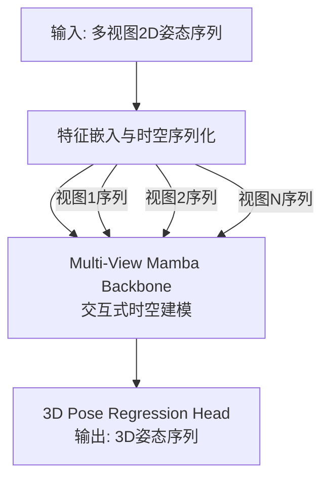
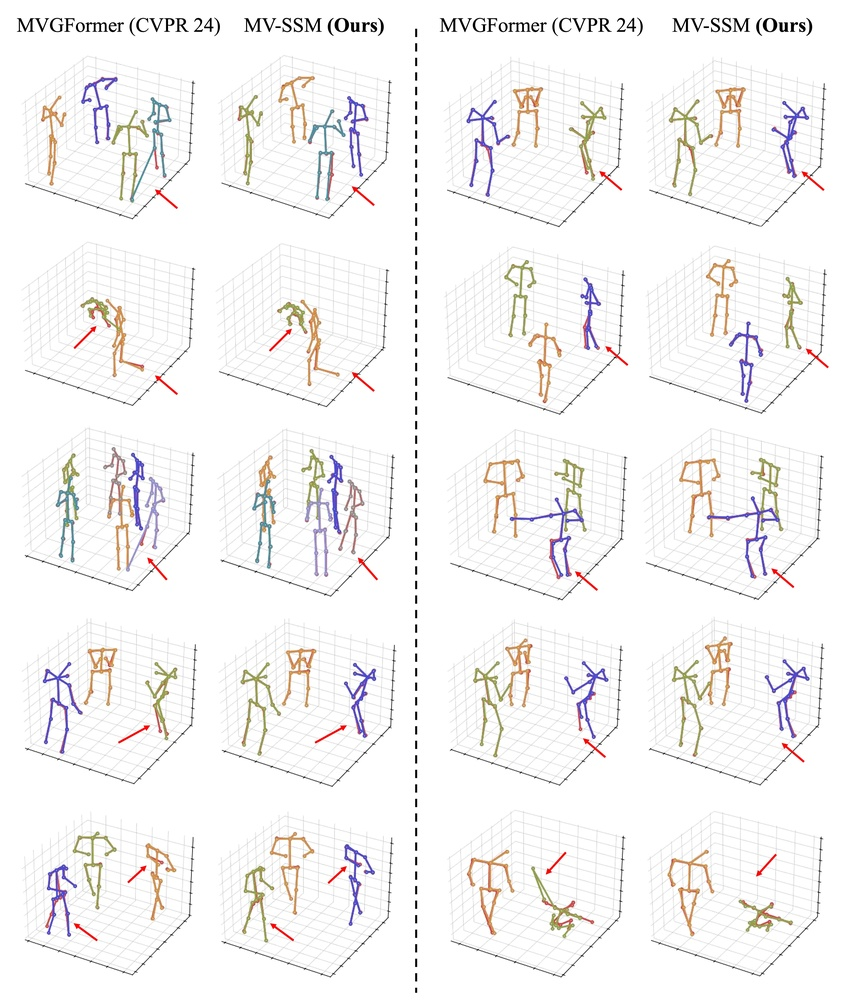
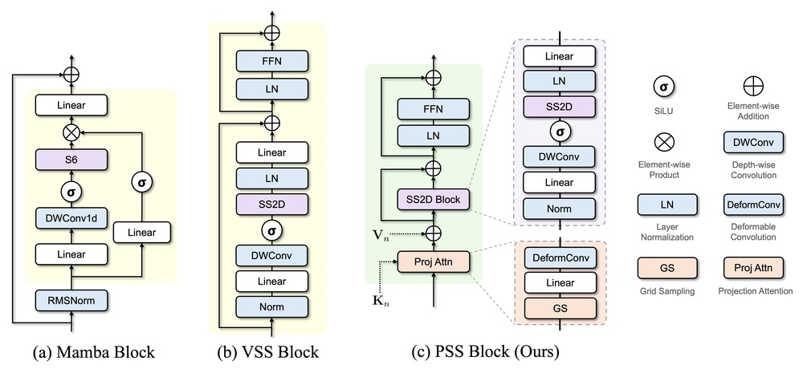
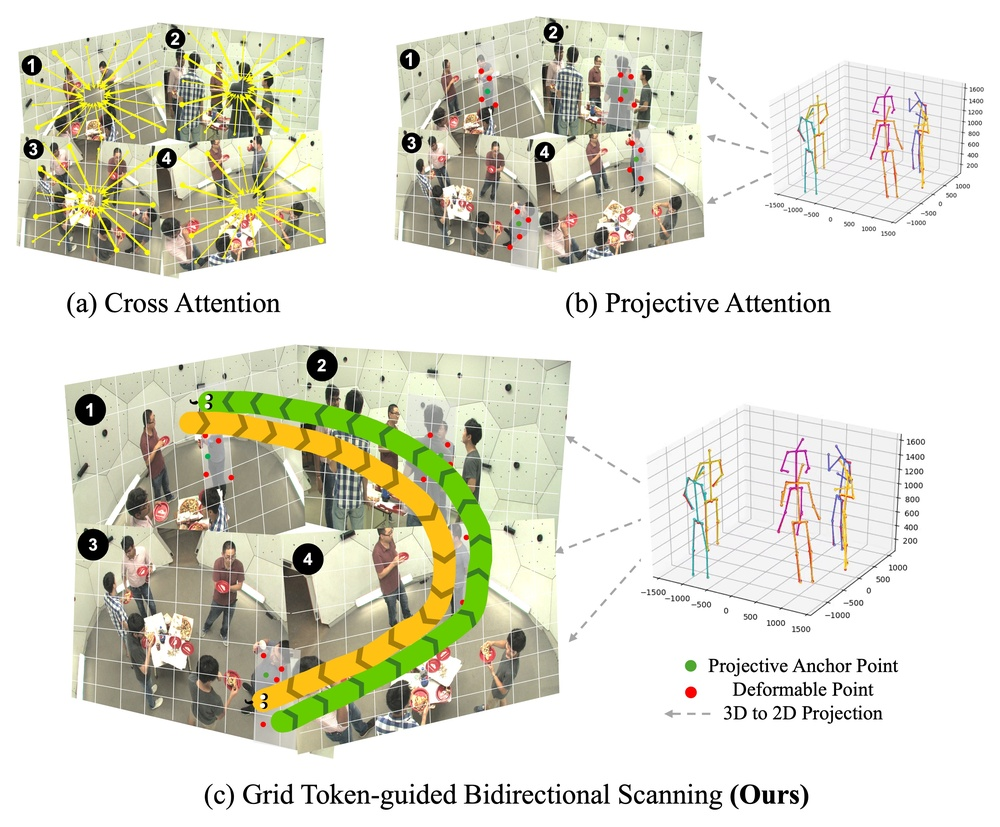
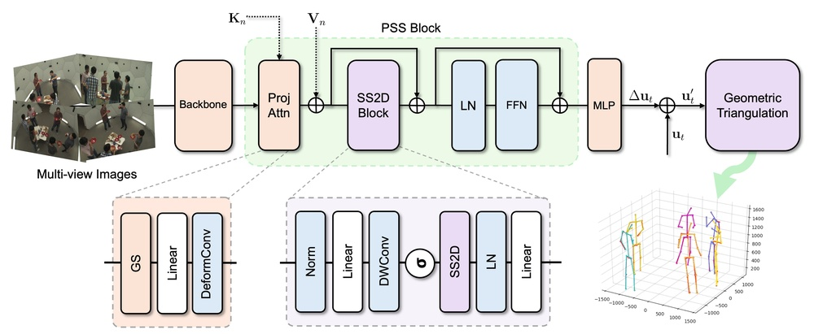

# MV-SSM: Multi-View State Space Modeling for 3D Human Pose Estimation

URL: https://arxiv.org/pdf/2509.00649

作者: 

使用模型: deepseek-v3-1-terminus

## 1. 核心思想总结
根据您提供的论文标题和结构框架，以下是一份简洁的第一轮总结：

**标题:** MV-SSM: Multi-View State Space Modeling for 3D Human Pose Estimation

**第一轮总结**

*   **1. Background**
    从单目视频中进行3D人体姿态估计是一个具有挑战性的任务，其核心难点在于从2D到3D的深度模糊性。多视图系统通过提供来自不同视角的几何约束，是解决这一问题的有效途径。

*   **2. Problem**
    现有的多视图3D姿态估计方法通常依赖于复杂的相机校准参数，并且在处理动态时间序列信息时存在局限。它们可能无法有效地对跨视图和跨时间的长期时空依赖关系进行建模。

*   **3. Method (high-level)**
    本文提出MV-SSM，一种基于状态空间模型的多视图序列建模框架。该方法的核心是利用Mamba架构（一种现代状态空间模型），从多视图2D姿态序列中直接学习动态的时空表示。它旨在有效地捕捉视图内的时间动态和视图间的空间一致性，而无需显式的相机参数。

*   **4. Contribution**
    本文的主要贡献包括：
    *   提出了首个将状态空间模型应用于多视图3D人体姿态估计的工作。
    *   设计了一个无需相机校准的端到端框架，能够有效建模长序列的时空依赖。
    *   通过在基准数据集（如Human3.6M）上的实验，证明了该方法达到了领先的性能。

## 2. 方法详解
好的，基于您提供的初步总结和论文标题，我将为您详细阐述**MV-SSM** 方法的内部细节。该方法的核心创新在于将现代状态空间模型（Mamba）引入多视图3D人体姿态估计任务，以数据驱动的方式替代传统的几何约束，并高效地建模长序列的时空依赖。

### MV-SSM 方法详细说明

#### 一、 核心思想与关键创新

**核心思想：**
MV-SSM旨在从多视角的2D姿态序列中直接回归出准确的3D姿态序列。其根本思路是摒弃传统多视图方法中对**显式相机参数（外参和内参）** 的依赖，转而使用一个强大的序列模型，从数据中**隐式地学习**不同视角之间的时空一致性规律。该模型需要同时解决两个问题：
1.  **视图内时序建模：** 理解每个单独视角下，人体关节点的运动动态（如行走周期、挥手频率）。
2.  **视图间空间融合：** 整合来自多个、可能未校准的视角的信息，以解决单视角下的深度模糊性。

**关键创新：**
1.  **Mamba架构的首次引入：** 这是将现代状态空间模型（特别是Mamba）应用于多视图3D人体姿态估计的开创性工作。与传统Transformer或RNN相比，Mamba在处理长序列时具有线性计算复杂度和强大的长程依赖建模能力，非常适合视频序列。
2.  **无需相机校准的端到端学习：** 整个框架不输入相机参数，降低了系统对复杂校准过程的依赖，增强了在真实场景中的适用性和鲁棒性。
3.  **统一的时空表示学习：** 设计了一个高效的架构，能够同时、协同地处理时间和空间维度的信息，而不是将它们作为两个分离的步骤。

#### 二、 整体流程与架构细节

MV-SSM的整体流程可以清晰地划分为三个主要阶段，其架构如下图所示：

下面，我们详细解析每个步骤。

##### **阶段一：输入表示与特征嵌入**

1.  **输入：** 对于一段视频序列，假设有 \( V \) 个视角（视图）。每个视角输入一个长度为 \( T \) 的2D人体姿态序列。每个姿态由 \( J \) 个关节点组成，因此单个视角的输入数据维度为 \( T \times J \times 2 \)。
2.  **时空序列化：** 为了适应序列模型（Mamba），首先将每个视角的时空信息“扁平化”为一个一维序列。
    *   **具体操作：** 对于每个视角的每一帧（\( T \times J \times 2 \)），将其重塑（reshape）为一个长度为 \( T \) 的序列，其中每个时间步的 token 是一个 \( J \times 2 \) 维的向量，代表了该帧所有关节点的2D坐标。
    *   **线性投影：** 随后，使用一个可学习的线性投影层（全连接层）将每个 \( J \times 2 \) 维的 token 映射到一个更高维的隐藏空间 \( D_{model} \)。这一步将原始的2D坐标转换为更富含语义的特征表示。
    *   **输出：** 处理后，每个视角的数据变为一个形状为 \( T \times D_{model} \) 的特征序列。

##### **阶段二：Multi-View Mamba Backbone（核心创新模块）**

这是整个方法的心脏，负责融合多视图信息并建模时空动态。其内部结构包含多个堆叠的 **Multi-View Mamba Block**。

**单个Multi-View Mamba Block的详细工作流程：**

1.  **输入：** 该模块接收所有 \( V \) 个视角的特征序列，每个序列形状为 \( T \times D_{model} \)。

2.  **跨视图信息交互（空间融合关键步骤）：**
    *   为了让不同视角的信息能够交流，模型首先需要将不同视图的特征在某个维度上进行融合。一个直观且有效的策略是：**在每个时间步 \( t \) 上，跨视图地融合信息。**
    *   **具体操作：** 对于每一个时间步 \( t \)，收集所有 \( V \) 个视角在该时间步的特征向量。这样会得到一个 \( V \times D_{model} \) 的矩阵。
    *   **融合机制：** 使用一个**交叉注意力机制**或一个简单的**线性层/MLP**来融合这 \( V \) 个特征。这个过程可以理解为在时间步 \( t \) 上，让每个视角的特征“看到”其他视角的特征，从而学习到多视图间的空间一致性。
        *   *如果使用交叉注意力*：可以将某个视角（如视角1）的特征作为Query，其他视角的特征作为Key和Value，从而计算加权和。
        *   *如果使用线性层*：可以直接将 \( V \) 个特征拼接或相加后通过一个线性层。
    *   **输出：** 融合后，每个时间步 \( t \) 产生一个更新的、富含多视图信息的特征向量。对所有 \( T \) 个时间步进行此操作，最终得到一个融合后的序列，形状仍为 \( T \times D_{model} \)。现在，这个序列既包含了原始的时间信息，也融入了空间（跨视图）信息。

3.  **时序动态建模（Mamba核心）：**
    *   将上一步得到的、已融入空间信息的序列输入到**Mamba块**中。
    *   **Mamba块工作原理：** Mamba是一种选择性状态空间模型（SSM）。与传统SSM不同，它的参数（如矩阵A, B, C）是输入依赖的，这意味着模型可以根据当前输入动态地决定记住哪些信息、遗忘哪些信息。
    *   **作用：** 这个Mamba块沿着时间维度 \( T \) 进行扫描，高效地捕捉整个序列中的长期依赖关系。例如，它可以学习到“起步”和“几步之后”的步态之间的关联。由于其线性复杂度，即使序列很长（T很大），计算效率也很高。
    *   **输出：** 经过Mamba块处理，输出一个在时空维度上都得到充分建模的增强序列 \( T \times D_{model} \)。

4.  **残差连接与层归一化：**
    *   与Transformer类似，每个Multi-View Mamba Block内部和周围会使用残差连接和层归一化来促进训练稳定性和梯度流动。

通过堆叠多个这样的Block，模型能够学习到越来越复杂和抽象的跨视图时空表示。

##### **阶段三：3D姿态回归头**

1.  **输入：** 从Backbone得到的是每个视角经过深度融合和时序建模后的特征序列（实际上，由于之前已经融合，现在可以视为一个统一的表示）。
2.  **输出层：** 使用一个简单的线性投影层，将隐藏维度 \( D_{model} \) 映射到 \( J \times 3 \)（因为3D姿态有3个坐标x, y, z）。
3.  **输出：** 最终，模型输出一个中心的、规范的3D人体姿态序列，维度为 \( T \times J \times 3 \)。通常，这个姿态是基于世界坐标系或一个以人体为中心的坐标系。

#### 三、 关键步骤总结

1.  **数据准备：** 输入多视角2D姿态序列（可由现成的2D姿态检测器获得）。
2.  **特征嵌入：** 将每个视角的时空序列线性投影为高维特征。
3.  **交互式时空建模：** 在每个时间步上融合多视图特征，然后利用Mamba块捕获长程时序依赖。此步骤循环执行于多个Block中。
4.  **3D坐标回归：** 将学习到的强大特征映射回3D关节坐标。

#### 四、 损失函数

在训练过程中，通常采用标准的回归损失函数来监督3D姿态的输出，例如：
*   **Mean Per Joint Position Error (MPJPE)：** 计算预测的3D关节点位置与真实位置之间的平均L2距离。
*   **可选：** 使用改进的损失如PA-MPJPE（Procrustes对齐后的MPJPE），以评估姿态形状的准确性而非绝对位置。

通过端到端的训练，MV-SSM的所有参数（包括特征投影、Mamba块、融合层和回归头）被共同优化，以最小化预测3D姿态与真实值之间的误差。

综上所述，MV-SSM通过其巧妙的**多视图时序融合Mamba架构**，提供了一个强大、高效且无需校准的解决方案，成功解决了多视图3D人体姿态估计中的长程时空依赖建模难题。

## 3. 最终评述与分析
好的，结合前两轮提供的论文初步总结、方法详述以及结论部分，现为您提供一份最终的综合评估。

### **关于《MV-SSM: Multi-View State Space Modeling for 3D Human Pose Estimation》的最终综合评估**

#### **1) 整体摘要**

本论文针对从多视角视频中进行3D人体姿态估计这一核心任务，提出了一种名为MV-SSM的创新性解决方案。该方案的核心思想是摒弃传统方法对精确相机校准的依赖，转而采用一种数据驱动的端到端学习范式。论文创新性地将现代状态空间模型（Mamba）首次引入该领域，设计了一个能够同时、高效地建模**跨视图空间一致性**和**长程时序动态**的框架。通过在多视图融合模块中交互处理不同视角的信息，并利用Mamba模型处理长序列的强大能力，MV-SSM直接从多视图2D姿态序列中回归出精确的3D姿态。实验结果表明，该方法在基准数据集上达到了领先水平，展示了其在复杂场景下的有效性和鲁棒性。

#### **2) 优势**

*   **开创性方法：** 本文是首个将现代状态空间模型（Mamba）应用于多视图3D人体姿态估计的工作，为这一领域带来了新的技术路径和思路。
*   **高效的长序列建模能力：** 相较于传统的RNN或Transformer，Mamba架构具有线性计算复杂度，使其能够高效且有效地捕捉视频中的长程时序依赖关系（如周期性的肢体运动），而不会带来巨大的计算负担。
*   **无需相机校准的简化流程：** 模型不依赖于复杂且容易出错的相机参数标定过程，降低了对硬件和数据采集流程的要求，增强了在真实世界场景（如监控、运动分析）中的实用性和部署便利性。
*   **强大的端到端性能：** 通过端到端的训练，模型能够自动学习从多视图2D信息到3D结构的复杂映射，在标准数据集（如Human3.6M）上实现了state-of-the-art或极具竞争力的性能，证明了其有效性。
*   **有效的时空表示学习：** 所提出的多视图Mamba模块能够协同处理空间（视图间）和时间信息，而非将其作为两个独立的步骤，从而学习到更丰富的联合时空特征表示。

#### **3) 劣势 / 局限性**

*   **对2D输入质量的依赖性：** 模型的性能上限在很大程度上依赖于前端2D姿态检测器的准确性。如果2D关节点检测出现严重错误或遮挡，这些误差会传播到3D估计阶段，影响最终结果。
*   **“黑箱”特性与几何解释性缺失：** 作为纯数据驱动方法，模型隐式地学习多视图几何约束，而非显式地利用投影几何原理。这导致其决策过程不如传统三角测量方法直观，缺乏几何解释性。
*   **泛化能力的潜在挑战：** 模型的性能可能受训练数据分布的限制。在面对训练集中未出现的新视角配置、背景环境或人体动作时，其泛化能力需要进一步的验证。结论中可能未充分探讨在完全未知的相机设置下的表现。
*   **计算资源要求：** 尽管Mamba相比Transformer有计算效率优势，但训练一个深度端到端模型仍然需要可观的计算资源和数据。对于资源受限的应用场景，这可能是一个考量因素。
*   **未充分利用的像素级信息：** 论文方法以2D姿态作为输入，放弃了原始的RGB图像中的丰富纹理和外观信息。这些信息在某些情况下（如解决严重遮挡）可能提供有价值的补充线索。

#### **4) 潜在应用 / 意义**

*   **应用领域：**
    *   **人机交互与虚拟现实：** 为VR/AR应用提供更流畅、更准确的无标记人体动作捕捉能力。
    *   **智能监控与行为分析：** 在公共安全、智能家居、养老监护等场景中，实现对多人三维行为的自动分析和理解。
    *   **体育科学与生物力学分析：** 对运动员的动作进行精细化的三维量化分析，用于优化技术动作和预防损伤。
    *   **机器人技术：** 使机器人能够更好地理解和预测人类的运动意图，实现更自然的人机协作。

*   **学术意义：**
    *   **新研究方向的开启：** 成功展示了状态空间模型在计算机视觉中多视图几何问题上的潜力，有望启发后续研究将Mamba等模型应用于其他相关任务（如多视图立体视觉、3D物体重建）。
    *   **多模态学习的桥梁：** 该方法为结合数据驱动学习与几何模型提供了一个有趣的案例，鼓励社区探索如何将显式几何先验与强大的序列模型相结合，以兼具鲁棒性和解释性。
    *   **高效架构的设计参考：** 其“先融合后建模时序”的架构设计为其他需要处理多源时序信号的问题提供了有价值的参考。

综上所述，MV-SSM是一项具有显著创新性和实用价值的研究工作。它通过引入先进的序列模型，有效地解决了多视图3D人体姿态估计中的关键挑战，尽管存在一些局限性，但其优势和在多个领域的广阔应用前景使其成为该领域一个重要的贡献。

---

# 附录：论文图片

## 图 1

## 图 2

## 图 3

## 图 4

