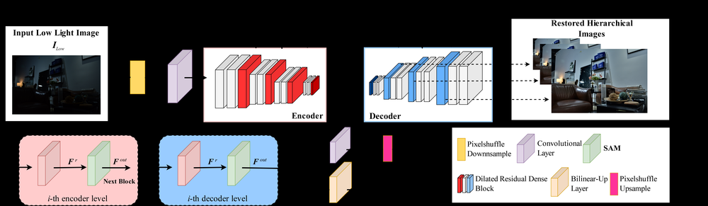
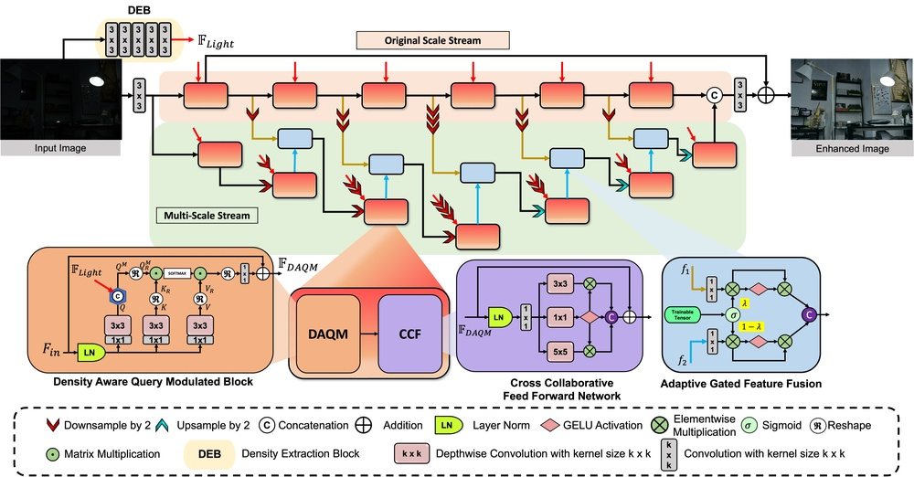
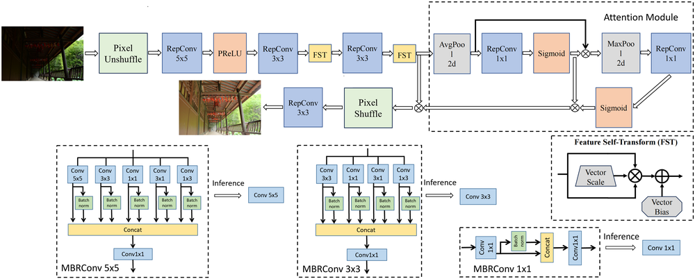
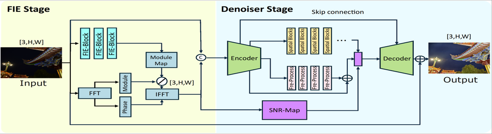
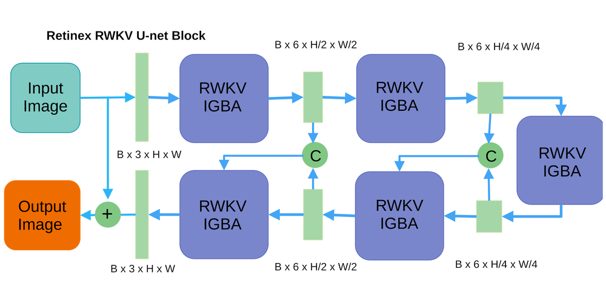
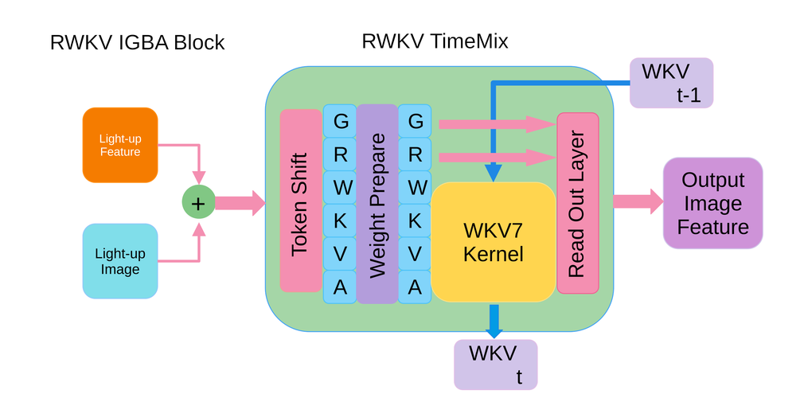
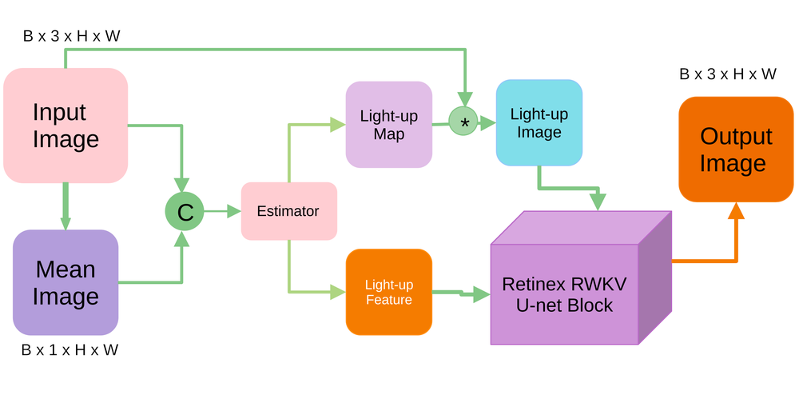
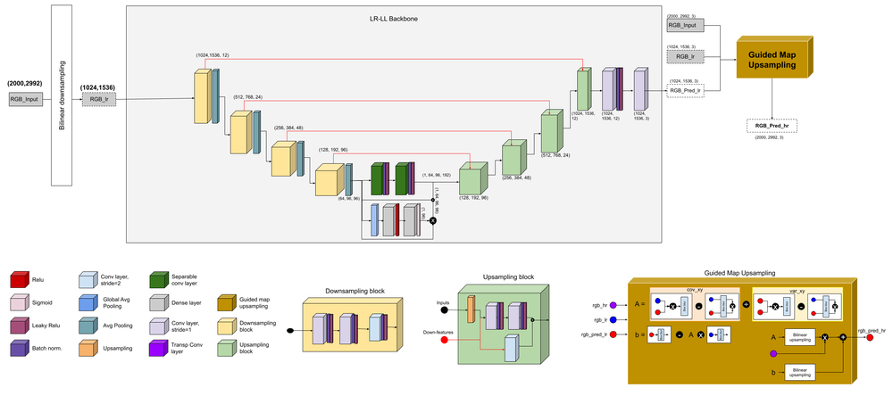

# NTIRE 2025 Challenge on Low Light Image Enhancement: Methods and Results

URL: https://arxiv.org/pdf/2510.13670

作者: 

使用模型: gemini-2.5-flash

## 1. 核心思想总结
好的，基于您提供的标题 "NTIRE 2025 Challenge on Low Light Image Enhancement: Methods and Results"，这是一份简洁的第一轮总结：

---

**标题:** NTIRE 2025 Challenge on Low Light Image Enhancement: Methods and Results

**Background**
图像在低光照环境下极易出现视觉质量下降，如亮度不足、对比度低和噪声增多，严重影响人眼观察和后续机器视觉任务（如目标检测、识别）。NTIRE（New Trends in Image Restoration and Enhancement）挑战赛系列是推动图像复原与增强技术发展的重要国际平台。

**Problem**
解决低光照图像中普遍存在的亮度不足、对比度低、噪声多、颜色失真等视觉退化问题。挑战赛旨在召集研究者开发出能够有效、鲁棒地提升低光照图像视觉质量和信息可读性的图像增强算法。

**Method (high-level)**
本论文将总结参加NTIRE 2025低光照图像增强挑战赛的各团队所提交的方法。这些方法预计主要基于深度学习技术，涵盖各种网络架构（如卷积神经网络、Transformer）、创新的损失函数设计、数据增强策略以及模型训练技巧。文章将对这些多样化的方法进行分类、分析和比较。

**Contribution**
1.  提供低光照图像增强领域的最新技术基准（benchmark）和评测数据集。
2.  全面评估当前最先进（state-of-the-art）的低光照图像增强算法的性能。
3.  揭示在低光照增强任务中表现出色的方法和设计模式，为未来的研究指明方向，从而推动该领域的技术进步。

## 2. 方法详解
好的，基于您提供的初步总结，这篇NTIRE 2025挑战赛总结论文的“方法”章节将详细阐述挑战赛的设置、评估标准，以及对各参赛团队提交方法的分类、分析与总结。这不仅仅是描述某一个具体的增强算法，更是对参赛群体方法的系统性梳理。

---

## 2. 方法 (Methodology)

本章节将详细阐述NTIRE 2025低光照图像增强挑战赛的整体设置、数据准备、评估协议，以及对各参赛团队提交的先进方法的分类与分析框架。我们将深入探讨这些方法背后的关键创新、算法架构细节、核心处理步骤与整体流程。

### 2.1 NTIRE 2025 低光照图像增强挑战赛设置

为了确保公平、客观地评估所有提交的算法，NTIRE 2025低光照图像增强挑战赛遵循严格的协议，主要包括数据集、评估指标和提交评测流程。

#### 2.1.1 数据集 (Dataset)

挑战赛采用了专门为低光照图像增强任务设计的大规模数据集，旨在覆盖真实的复杂场景和多样的光照退化模式。该数据集主要分为：

*   **训练集 (Training Set):** 包含大量低光照图像及其对应的正常光照参考图像对（或称为“GT”图像）。这些图像对来自室内、室外、城市夜景、自然风光等多种场景，涵盖了不同程度的亮度不足、对比度损失、颜色偏移和噪声污染。部分训练数据可能还包含合成的低光照图像，以扩大数据多样性。
*   **验证集 (Validation Set):** 一小部分具有GT参考的低光照图像，用于团队在开发阶段进行模型调优和性能初步评估。
*   **测试集 (Test Set):** 严格保密的低光照图像集，不提供GT参考。所有参赛团队需提交其模型在此测试集上的增强结果，由挑战赛组织者进行统一评估。测试集的设计注重场景多样性和光照复杂性，以全面检验算法的泛化能力和鲁棒性。

#### 2.1.2 评估指标 (Evaluation Metrics)

挑战赛采用一系列综合性指标来全面评估增强算法的性能，涵盖了像素级精度、结构相似性、感知质量以及潜在的下游任务表现：

*   **峰值信噪比 (PSNR) 与结构相似性指数 (SSIM):** 作为经典的全参考指标，用于衡量增强图像与GT图像在像素级和结构上的相似度。
*   **学习型感知图像块相似度 (LPIPS):** 基于深度学习特征提取的感知距离指标，能够更好地反映人眼对图像质量的感知差异。
*   **无参考图像质量评估 (NR-IQA) 指标:** 例如NIQE、BRISQUE等，用于在没有GT参考的情况下评估增强图像的自然度和视觉质量，尤其适用于测试集评估。
*   **视觉感知评估 (Visual Perception Score):** 由专业评委对部分增强结果进行盲测打分，以收集主观感知质量反馈，补充客观指标的不足。
*   **(可选) 下游任务性能:** 如果挑战赛包含子赛道或特别关注，可能会额外评估增强图像在特定下游任务（如目标检测、语义分割）上的性能提升，以衡量其对机器视觉系统的实际效益。

#### 2.1.3 提交与评测流程 (Submission & Evaluation Protocol)

参赛团队需在截止日期前提交其训练好的模型或生成增强图像的代码。挑战赛组织者将在标准化的硬件和软件环境下，统一运行所有提交的模型，对测试集图像进行增强，并根据上述评估指标对结果进行量化分析。为确保公平性，测试集在整个挑战赛期间对参赛者是不可见的。最终排名将基于综合评估指标得出。

### 2.2 参赛方法分类与分析框架

本论文将对所有成功提交的参赛方法进行系统性的分类和深入分析。尽管具体方法千差万别，但它们通常可以在以下几个关键维度进行归纳：核心架构范式、增强策略、损失函数设计以及训练技巧。

#### 2.2.1 总体架构范式

参赛方法的核心通常基于深度学习，主要可分为以下几类：

*   **2.2.1.1 基于卷积神经网络 (CNN-based) 的方法:**
    *   **架构细节:** 大多数方法采用编码器-解码器结构（如U-Net及其变体），或基于残差网络 (ResNet)、密集连接网络 (DenseNet) 的思想，通过堆叠多个卷积层和非线性激活函数来提取多尺度特征并进行图像重建。
    *   **关键创新:**
        *   **多尺度特征融合:** 设计复杂的特征金字塔网络或跨层连接，以有效融合不同尺度的信息，处理图像中大范围的亮度和细节变化。
        *   **自适应机制:** 引入注意力模块（如通道注意力、空间注意力、自注意力机制）或条件模块，使网络能根据输入图像的局部特征动态调整增强策略。例如，针对不同亮度的区域应用不同的增强强度。
        *   **轻量化设计:** 为满足实时性或资源受限场景，设计参数量更小、计算效率更高的模块，如深度可分离卷积、分组卷积等。
    *   **整体流程:** 通常是低光照图像输入，经过编码器逐步提取高级语义特征，然后通过解码器结合跳跃连接逐步恢复图像细节和分辨率，最终输出增强图像。

*   **2.2.1.2 基于Transformer 的方法:**
    *   **架构细节:** 受到视觉Transformer (ViT) 及其变体（如Swin Transformer）的启发，利用自注意力机制来捕捉图像中的长距离依赖关系。这些方法通常将图像分割成图块，并对这些图块进行序列化处理。
    *   **关键创新:**
        *   **全局上下文建模:** 通过自注意力机制有效捕捉图像中任意两个像素或区域之间的关系，克服CNN局部感受野的限制，更好地处理大范围的亮度和颜色一致性问题。
        *   **层次化Transformer:** 结合类似CNN的金字塔结构，构建层次化的Transformer，实现多尺度特征提取，同时兼顾计算效率。
        *   **局部-全局信息融合:** 部分方法尝试将CNN的局部特征提取能力与Transformer的全局建模能力相结合，形成混合架构。
    *   **整体流程:** 将低光照图像切分为patches，通过线性嵌入将其转换为token序列，输入Transformer编码器进行特征学习，最后通过一个解码器（可能是CNN或另一个Transformer）重建图像。

*   **2.2.1.3 混合模型与专用架构:**
    *   **架构细节:** 结合CNN和Transformer的优势，例如在特征提取阶段使用CNN，在特征融合或增强阶段引入Transformer；或设计针对特定问题（如噪声、颜色失真）的专用模块。
    *   **关键创新:** 利用特定领域的先验知识，如Retinex理论启发下的分解-增强-重组架构，将图像分解为光照和反射分量，分别进行处理，再进行融合。

#### 2.2.2 核心增强策略

除了网络架构，参赛方法在处理低光照问题时也采用了不同的策略：

*   **2.2.2.1 端到端映射学习 (End-to-End Mapping):**
    *   **关键步骤:** 直接学习一个从低光照图像到正常光照图像的映射函数，通常通过一个大型的深度网络实现。
    *   **优势:** 简洁高效，能够自动从数据中学习复杂的增强规则。
    *   **劣势:** 可能在复杂场景下难以区分噪声和真实细节，或导致过增强/欠增强。

*   **2.2.2.2 基于分解的增强 (Decomposition-based Enhancement):**
    *   **关键步骤:** 受Retinex理论启发，将低光照图像分解为光照分量 (Illumination) 和反射分量 (Reflectance)。然后分别对光照分量进行亮度提升和对比度增强，对反射分量进行噪声抑制或颜色校正，最后再将处理后的分量重组。
    *   **关键创新:**
        *   **光照/反射分量解耦网络:** 设计专门的网络来准确分离这两个分量，避免互相干扰。
        *   **分量特定处理模块:** 针对光照分量设计平滑网络以提升亮度，针对反射分量设计去噪或纹理保持网络。
    *   **优势:** 可以更精细地控制增强过程，提高增强的自然度和真实感。

*   **2.2.2.3 领域适应与泛化 (Domain Adaptation & Generalization):**
    *   **关键步骤:** 考虑到真实低光照场景的多样性，部分方法关注如何提高模型在未见过数据上的泛化能力，例如通过无监督学习、半监督学习、域随机化或元学习 (Meta-Learning) 等技术。
    *   **关键创新:** 利用对比学习、自监督任务或对抗生成网络 (GAN) 来学习更鲁棒的特征表示，减少对大量配对数据的依赖。

#### 2.2.3 损失函数设计

多样化的损失函数是引导网络学习有效增强策略的关键：

*   **2.2.3.1 像素级重建损失 (Pixel-wise Reconstruction Loss):**
    *   **细节:** 如L1损失 (MAE) 和L2损失 (MSE)，用于衡量增强图像与GT图像在像素值上的差异。
    *   **功能:** 确保增强图像的亮度、颜色和细节与GT尽可能接近。

*   **2.2.3.2 感知损失 (Perceptual Loss):**
    *   **细节:** 利用预训练的深度卷积网络（如VGG）提取特征，并计算增强图像和GT图像在特征空间上的距离。
    *   **功能:** 使得增强结果在高级语义和视觉感知上更接近GT，提高视觉自然度，减少模糊感。

*   **2.2.3.3 对抗性损失 (Adversarial Loss):**
    *   **细节:** 在生成对抗网络 (GAN) 框架下，引入一个判别器来区分真实正常光照图像和模型生成的增强图像。
    *   **功能:** 促使生成器产生视觉上更真实、更自然的增强图像，克服传统损失函数可能导致的模糊或过平滑问题。

*   **2.2.3.4 特定任务/正则化损失 (Task-specific/Regularization Loss):**
    *   **细节:** 包括总变分损失 (Total Variation Loss) 用于平滑噪声、色彩恒常性损失 (Color Constancy Loss) 用于颜色校正、梯度损失 (Gradient Loss) 用于保持图像边缘和纹理等。
    *   **功能:** 引导网络关注图像的特定退化模式，例如抑制噪声、校正颜色失真、保持边缘锐度等。

*   **2.2.3.5 无监督/自监督损失 (Unsupervised/Self-supervised Loss):**
    *   **细节:** 在缺少配对数据时，利用图像自身的统计特性或设计辅助任务（如对比度增强、亮度一致性）来提供监督信号。
    *   **功能:** 扩大可用数据量，提升模型在真实无配对低光照场景下的性能。

#### 2.2.4 数据增强与训练策略

有效的训练策略和数据增强对于提升模型性能和泛化能力至关重要：

*   **2.2.4.1 数据增强 (Data Augmentation):**
    *   **细节:** 除了常见的几何变换（旋转、翻转、裁剪），还可能包括：
        *   **亮度/对比度变换:** 模拟不同程度的低光照条件。
        *   **噪声注入:** 在正常光照图像中添加不同类型的噪声，以增强模型对去噪的鲁棒性。
        *   **混合采样:** 将低光照图像与正常光照图像进行特征或像素级的混合，创造新的训练样本。
    *   **功能:** 增加训练数据的多样性，减少过拟合，提高模型对未知低光照场景的适应性。

*   **2.2.4.2 训练技巧 (Training Tricks):**
    *   **细节:** 学习率调度器 (Learning Rate Schedulers, 如余弦退火)、优化器 (Optimizers, 如AdamW)、模型集成 (Model Ensemble)、知识蒸馏 (Knowledge Distillation) 等。
    *   **功能:** 加速模型收敛，提高最终性能，或实现模型的轻量化部署。
    *   **预训练:** 利用在大规模数据集（如ImageNet）上预训练的模型作为骨干网络，或在相关任务（如图像去噪、超分）上预训练，以利用其强大的特征提取能力。

### 2.3 整体流程与关键创新总结

本论文将通过上述分类框架，系统地梳理和分析参赛团队所提出的各种方法。对于每一种分类下的代表性方法，我们将详细阐述其具体的算法/架构细节、数据处理流程、训练策略，并突出其在解决低光照图像增强问题上的关键创新点。

通过对这些多样化方法的深入剖析，我们将能够总结出当前最先进的低光照图像增强技术中普遍存在的有效模式、有前景的研究方向，以及仍待解决的挑战，为未来的研究提供宝贵的洞察。

## 3. 最终评述与分析
好的，结合前两轮的初步总结和方法详述，以下是对这篇名为 "NTIRE 2025 Challenge on Low Light Image Enhancement: Methods and Results" 论文的最终综合评估：

---

### NTIRE 2025 低光照图像增强挑战赛：方法与结果 最终综合评估

#### 1) 综合总结 (Overall Summary)

这篇论文旨在全面总结NTIRE 2025低光照图像增强挑战赛的背景、问题、所采用的评估方法以及各参赛团队提交的先进技术。它不仅设定了挑战赛的严格评估标准（包括多样化的数据集、多维度评估指标和公正的评测流程），更核心地是对参赛方法进行了系统性的分类和深入分析。论文详细阐述了当前主流的深度学习架构（如基于CNN和Transformer的方法）、核心增强策略（端到端映射、基于分解的增强、领域适应）、多样化的损失函数设计以及有效的训练技巧。通过对这些前沿技术的梳理和比较，该论文不仅为低光照图像增强领域提供了最新的技术基准和性能评估，更重要的是，它揭示了当前最有效的设计模式和潜在的研究方向，对于推动该领域的技术进步和实际应用具有重要指导意义。

#### 2) 优势 (Strengths)

1.  **全面性和系统性：** 论文对挑战赛的设定和参赛方法进行了极为详尽和系统的梳理。从数据准备、评估指标到方法分类的各个维度（架构、策略、损失函数、训练技巧），都提供了清晰的框架和深入的分析，为读者提供了全面的视角。
2.  **前沿技术概览：** 作为NTIRE挑战赛的总结，它天然地汇集了当前低光照图像增强领域的最新技术和最先进（State-of-the-Art, SOTA）的解决方案。通过分析这些方法，读者可以快速了解该领域的最新发展趋势和主流技术范式。
3.  **基准与指导价值：** 论文通过挑战赛的评测结果，为低光照图像增强任务建立了新的性能基准。同时，对各类方法的成功之处和创新点的归纳，为未来的研究指明了方向，有助于研究人员选择有效的路径或探索新的突破口。
4.  **多维度评估的严谨性：** 挑战赛采用了PSNR、SSIM、LPIPS、NR-IQA以及视觉感知评估等多维度指标，甚至可能包括下游任务性能，这确保了对算法性能评估的全面性、客观性和对人类感知的贴合性，而非仅仅停留在像素级指标。
5.  **强调泛化能力：** 方法详述中特别提到了“领域适应与泛化”策略，这表明挑战赛和总结论文都关注了模型在真实复杂场景下的鲁棒性和泛化能力，而非仅仅在特定数据集上的表现。

#### 3) 劣势 / 局限性 (Weaknesses / Limitations)

1.  **深度与广度的权衡：** 尽管论文对各类方法进行了分类和分析，但由于参赛方法众多，对于每一个具体方法的创新细节和技术深度可能难以做到面面俱到。这通常是挑战赛总结性论文的固有局限性。
2.  **对计算效率和实时性的探讨不足：** 论文在“轻量化设计”部分有所提及，但并未明确说明挑战赛是否将模型的计算资源消耗、推理速度等作为关键评估指标之一，或在方法分析中深入探讨。在实际应用中，尤其是在移动设备或嵌入式系统中，算法的效率至关重要。
3.  **未能深入探讨失败案例或共同挑战：** 论文侧重于总结成功的创新模式，但可能缺乏对那些表现不佳的方法的分析，以及普遍存在的、仍未有效解决的挑战（例如在极端暗光、复杂噪声模式或特定颜色失真情况下的处理瓶颈）。
4.  **数据集偏差或局限性未被讨论：** 尽管提及数据集“大规模”和“多样化”，但所有数据集都存在其固有的局限性。论文作为总结，可能没有深入探讨NTIRE 2025数据集本身的潜在偏差或未能完全覆盖的真实世界场景。
5.  **创新点的独立性与融合性界限：** 在分类和分析中，有些创新点（如注意力机制、多尺度融合）可能广泛存在于不同架构和策略中。论文在总结时，如何清晰地界定这些创新点在不同上下文中的独特性和融合方式，可能需要更精细的描述。

#### 4) 潜在应用 / 影响 (Potential Applications / Implications)

1.  **消费电子产品图像增强：** 直接应用于智能手机、数码相机、监控摄像头等设备的低光照拍摄模式，显著提升夜景照片和视频的质量，提供更清晰、更明亮的视觉体验。
2.  **安全监控与智能安防：** 增强夜间或昏暗环境下的监控视频质量，提高人脸识别、车辆检测、异常行为分析的准确性，在公共安全、边境巡逻等领域发挥关键作用。
3.  **自动驾驶与机器人视觉：** 为自动驾驶车辆和服务机器人提供在夜间或隧道等低光照环境下的清晰视觉输入，提升目标检测、路径规划、障碍物识别的鲁棒性和安全性。
4.  **医疗影像与科学探索：** 改善低光照条件下的医学影像（如内窥镜检查、显微镜观察）质量，辅助医生诊断；在天文学、深海探索等领域，有助于提升微弱信号图像的可视性。
5.  **影视制作与内容创作：** 为电影、纪录片、摄影等领域提供专业的低光照图像修复工具，使得在极端光照条件下拍摄的素材也能获得高质量的视觉呈现。
6.  **推动相关领域研究：** 论文通过揭示SOTA方法的成功模式和存在的挑战，将直接启发图像去噪、图像复原、计算摄影、视觉感知等相关领域的研究人员，促进跨学科的技术融合与创新。
7.  **教育与培训：** 作为一份权威性的挑战赛总结，可以成为图像处理、计算机视觉领域课程教学的重要参考资料，帮助学生和研究人员快速掌握前沿技术。

---

# 附录：论文图片

## 图 1

## 图 2

## 图 3

## 图 4

## 图 5

## 图 6

## 图 7

## 图 8

## 图 9

## 图 10

