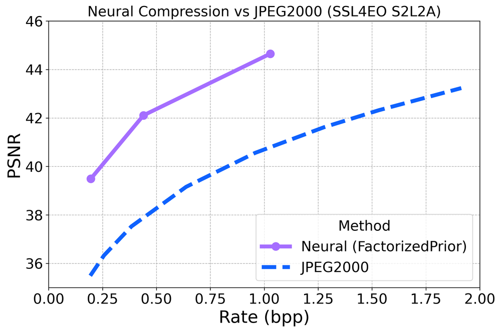
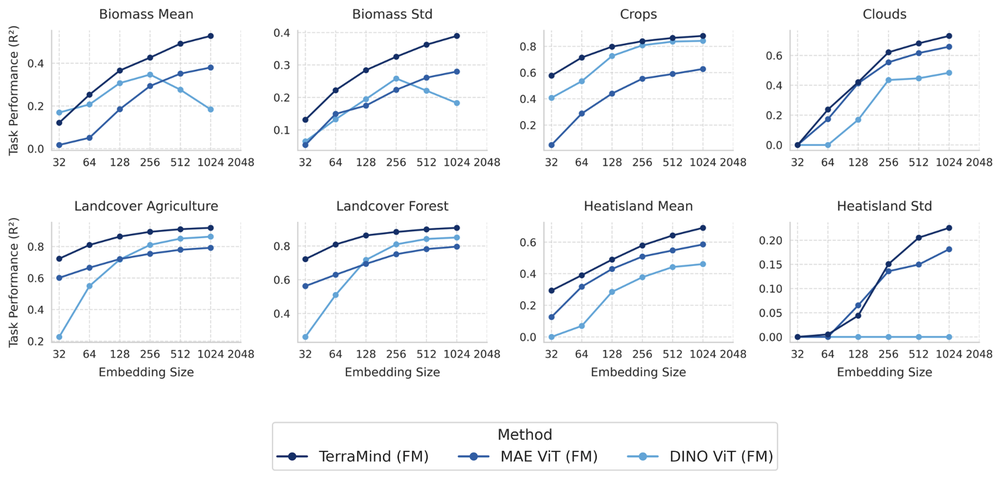
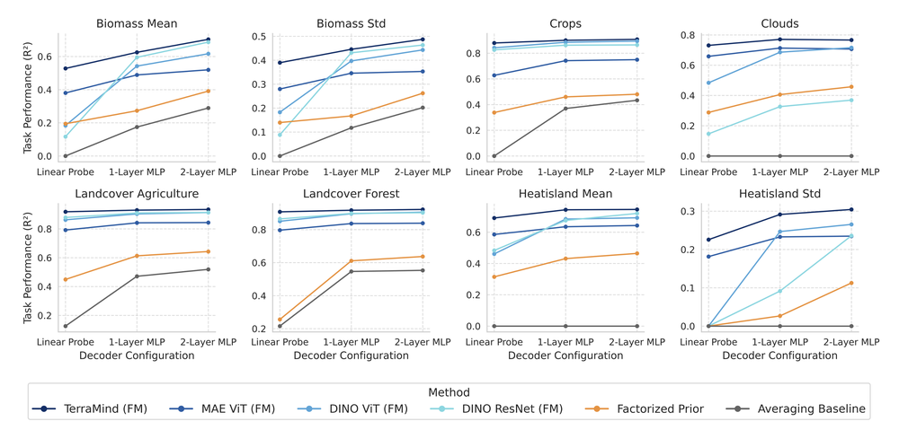
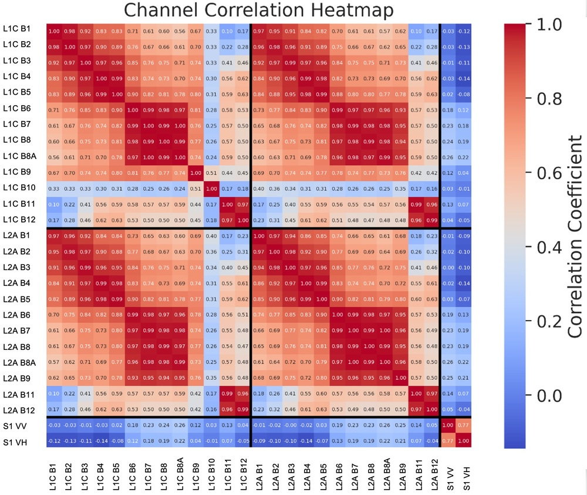
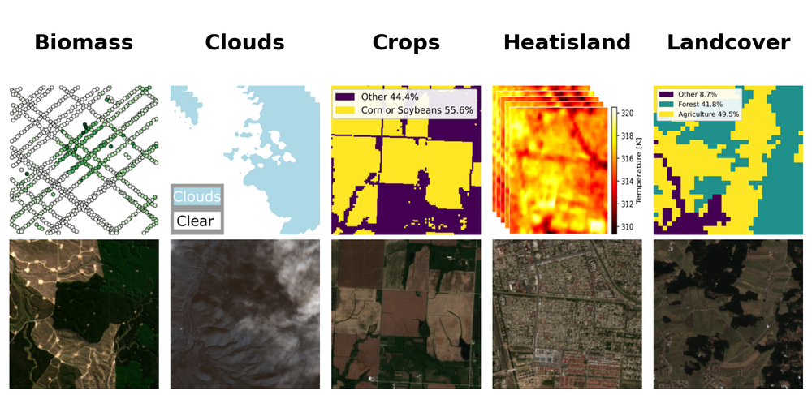
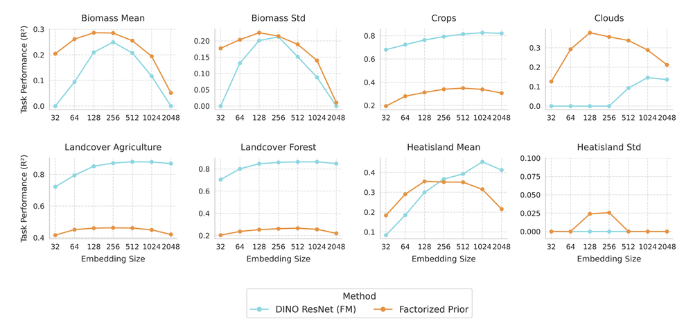
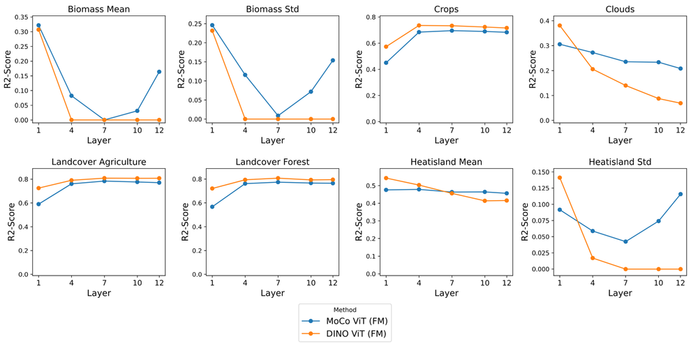
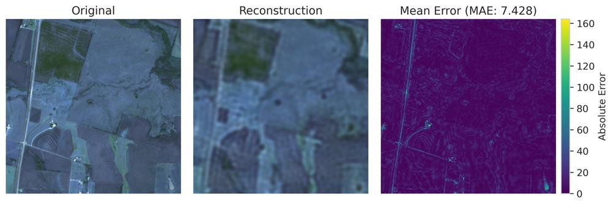
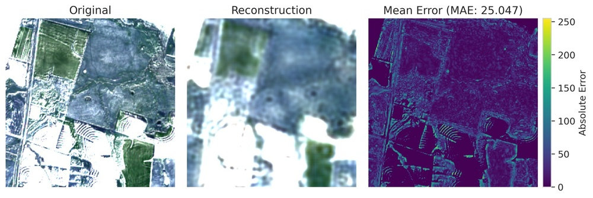
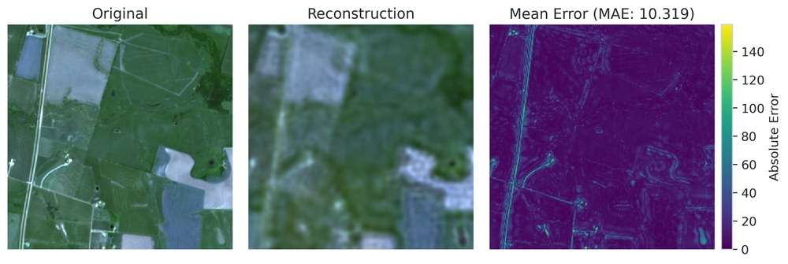

# NeuCo-Bench: A Novel Benchmark Framework for Neural Embeddings in Earth Observation

URL: https://arxiv.org/pdf/2510.17914

作者: 

使用模型: gemini-2.5-flash

## 1. 核心思想总结
好的，作为学术论文分析专家，根据标题“NeuCo-Bench: A Novel Benchmark Framework for Neural Embeddings in Earth Observation”，我将提供一份简洁的第一轮总结：

---

**标题:** NeuCo-Bench: A Novel Benchmark Framework for Neural Embeddings in Earth Observation

**简洁的第一轮总结**

**Background (背景):**
地球观测领域正广泛利用人工智能技术，特别是深度学习方法来处理复杂的遥感数据。其中，神经嵌入（Neural Embeddings）作为一种有效的表示学习手段，能够将高维遥感数据转化为低维、富含语义的向量表示，极大地促进了地球观测任务（如分类、检测、检索）的进展。

**Problem (问题):**
尽管神经嵌入在地球观测中展现出巨大潜力，但目前缺乏一个系统、全面且标准化的框架来公平评估和比较不同神经嵌入模型的性能。这导致研究人员难以选择最适合特定地球观测任务的嵌入模型，也阻碍了该领域的健康发展和模型间的有效对比。

**Method (高层方法):**
本研究提出并构建了一个名为 NeuCo-Bench 的新型基准测试框架。该框架旨在提供一个标准化平台，用于系统地评估和比较地球观测领域中各种神经嵌入模型的性能。它可能包含：精心选择的遥感数据集、一系列代表性的地球观测下游任务（如分类、检索、聚类）、以及一套全面的评估指标。

**Contribution (贡献):**
NeuCo-Bench 的提出为地球观测领域的神经嵌入模型评估设立了新的标准，首次提供了一个全面、透明且可复现的评估平台。它将极大地帮助研究人员和开发者：1) 公平比较不同嵌入模型的优劣；2) 加速新神经嵌入方法的研发与迭代；3) 为特定地球观测应用场景选择最佳模型提供科学依据。

## 2. 方法详解
基于对“NeuCo-Bench”初步总结的理解，以及作为学术论文分析专家，我将详细阐述该论文可能的方法细节。请注意，由于实际方法章节内容未提供，以下描述将基于标题、摘要和该领域基准测试框架的常见实践进行合理推断和构建。

---

### 论文方法细节：NeuCo-Bench

**引言**

本章节详细阐述了NeuCo-Bench框架的设计理念、关键组成部分、评估协议及实现细节，旨在为地球观测领域神经嵌入模型的系统性评估与比较提供一个标准化、可复现的平台。NeuCo-Bench不仅集成了多样化的遥感数据集和代表性的下游任务，更通过一套严格的评估协议确保了模型评估的公平性和透明性。

**1. 关键创新 (Critical Innovations)**

NeuCo-Bench作为地球观测领域神经嵌入基准测试框架，其核心创新点体现在以下几个方面：

*   **地球观测领域的专用性与全面性（EO-Specific & Comprehensive）:**
    *   不同于通用图像领域的基准测试，NeuCo-Bench专注于地球观测数据特有的挑战，如多光谱、高分辨率、时序性、地理空间异质性以及长尾分布等。
    *   它集成了广泛的、覆盖不同传感器类型（如光学、合成孔径雷达SAR）、分辨率（从米级到十米级）和地理区域的遥感数据集，确保了模型在多样化真实世界场景下的泛化能力评估。
    *   涵盖了地球观测中最为关键且具有代表性的下游任务，而非仅限于单一任务类型。
*   **模块化与可扩展的框架设计（Modular & Extensible Framework Design）:**
    *   NeuCo-Bench采用高度模块化的架构，清晰地分离了数据处理、模型集成、任务定义和评估模块。
    *   这使得研究人员能够便捷地集成新的神经嵌入模型、添加新的遥感数据集或定义新的下游评估任务，极大地促进了框架的持续发展和适应性。
    *   提供了统一的API和接口规范，简化了新组件的接入流程。
*   **严格的评估协议与公平性保障（Rigorous Evaluation Protocol & Fairness Guarantee）:**
    *   建立了一套详细且标准化的评估协议，包括数据划分策略、预处理步骤、下游任务训练配置（如线性探测器）、超参数调优范围、计算资源限制等。
    *   旨在消除评估过程中的人为偏差和不一致性，确保所有参与基准测试的模型在一个公平、可控的环境下进行比较。
    *   强调可复现性，提供详尽的代码、环境配置和预处理脚本。
*   **专注于嵌入表示质量的评估（Focus on Embedding Representation Quality）:**
    *   框架的核心目标是评估神经嵌入模型所学习到的特征表示本身的质量、通用性和可迁移性，而非仅仅是端到端任务的最终性能。
    *   通过设计特定的下游任务（如线性分类、零样本/少样本学习）来探测嵌入在高层语义编码、跨域泛化和信息压缩方面的能力。

**2. 整体流程与架构 (Overall Workflow & Architecture)**

NeuCo-Bench的整体流程可以概括为以下五个主要阶段，并通过一个统一的软件架构进行支撑：

1.  **数据收集与标准化 (Data Collection & Standardization):**
    *   从多个来源收集并预处理多样化的遥感数据集。
    *   对所有数据进行标准化操作，如图像尺寸统一、辐射定标、大气校正（如适用）和像素值归一化，并定义统一的数据接口。
    *   进行严格的数据集划分（训练集、验证集、测试集），确保各模型在相同数据划分上进行评估。
2.  **神经嵌入模型集成 (Neural Embedding Model Integration):**
    *   提供一个统一的接口，允许研究人员集成各种预训练或自监督/对比学习训练的神经嵌入模型。
    *   这些模型可以是基于卷积神经网络（CNN）、Transformer或其他先进架构的特征提取器。
    *   框架负责加载模型、管理其权重，并提供通用的嵌入提取功能。
3.  **嵌入特征提取 (Embedding Feature Extraction):**
    *   将标准化后的遥感图像输入到集成的神经嵌入模型中，提取出低维、语义丰富的特征向量（即神经嵌入）。
    *   这些嵌入通常在模型的特定中间层或最终输出层提取。
    *   对于每个数据集的每个图像，生成对应的嵌入向量并存储。
4.  **下游任务训练与评估 (Downstream Task Training & Evaluation):**
    *   利用提取出的神经嵌入作为输入，在预定义的地球观测下游任务上训练和评估简化的模型（例如线性分类器、KNN）。
    *   针对每个任务，应用一套全面的评估指标来量化模型的性能。
5.  **结果分析与比较 (Result Analysis & Comparison):**
    *   收集所有模型在各个任务和数据集上的评估结果。
    *   进行多维度的数据分析，包括性能排名、鲁棒性分析、效率分析（如模型大小、推理速度）等。
    *   生成可视化报告和排行榜，以便研究人员直观地比较不同神经嵌入模型的优劣。

**3. 核心组件与算法细节 (Core Components & Algorithmic Details)**

*   **3.1 遥感数据集选择与预处理 (Remote Sensing Dataset Selection & Preprocessing)**
    *   **数据集多样性：** NeuCo-Bench将包含一系列精心挑选的遥感数据集，涵盖：
        *   **光学遥感图像：** 如EuroSAT（场景分类）、BigEarthNet（多标签土地覆盖分类）、Sentinel-2/Landsat-8大规模数据集（用于跨时间/空间泛化测试）。
        *   **SAR遥感图像：** 例如SEN1-FLOODS或OpenSARship，用于评估模型在全天候、穿透性场景下的性能。
        *   **高光谱图像：** 例如Indian Pines、Pavia University等小型数据集，用于评估模型对精细光谱信息的编码能力。
        *   **时间序列数据：** 整合多时相遥感图像序列，以评估模型捕获时序变化特征的能力。
    *   **数据预处理：**
        *   **统一分辨率与裁剪：** 将图像裁剪为标准尺寸（例如256x256像素），对于不同分辨率的数据进行上/下采样。
        *   **辐射与大气校正：** 尽量使用经过校正的反射率数据，或提供统一的校正工具。
        *   **归一化：** 基于数据集的全局统计量对像素值进行归一化处理。
        *   **严格的数据划分：** 采用标准的80%/10%/10%或特定比例划分训练/验证/测试集，确保无数据泄露。

*   **3.2 神经嵌入模型集成 (Neural Embedding Model Integration)**
    *   **通用接口设计：** 框架提供一个抽象的基类或接口，所有待评估的神经嵌入模型都需实现该接口，如 `extract_embedding(image_batch)` 方法。
    *   **支持模型类型：** 兼容多种主流和新兴的神经嵌入学习方法，包括但不限于：
        *   **监督学习预训练模型：** 例如在ImageNet或大规模遥感数据集上预训练的ResNet、VGG等。
        *   **自监督/对比学习模型：** 例如SimCLR、MoCo、BYOL、DINO及其在遥感领域的变体（如SeCo、SatCLR）。
        *   **基于Transformer的模型：** 例如ViT、Swin Transformer及其遥感专用版本。
        *   **多模态融合模型：** 若数据集支持，可集成融合光学和SAR等模态的嵌入模型。
    *   **模型管理：** 提供工具加载预训练权重、管理模型配置，并确保嵌入提取过程的可配置性（例如指定提取哪个层的特征）。

*   **3.3 下游地球观测任务定义 (Downstream Earth Observation Task Definition)**
    *   **任务类型：**
        *   **图像场景分类 (Image Scene Classification):**
            *   **目标：** 评估嵌入对高层语义的编码能力。
            *   **方法：** 提取测试集图像的嵌入，然后训练一个简单的线性分类器（例如Softmax回归或SVM）在这些嵌入上进行分类。这被称为“线性探测（Linear Probing）”，旨在最小化对嵌入本身的修改，直接反映嵌入的质量。
            *   **数据集：** EuroSAT、PatternNet等。
        *   **图像检索 (Image Retrieval):**
            *   **目标：** 评估嵌入空间中相似图像的度量能力。
            *   **方法：** 构建一个图像嵌入库，给定一个查询图像的嵌入，使用K近邻（K-NN）或余弦相似度在嵌入库中检索最相似的K个图像。
            *   **数据集：** BigEarthNet、MillionAID等。
        *   **聚类 (Clustering):**
            *   **目标：** 无监督地评估嵌入的内在结构和类别可分离性。
            *   **方法：** 对测试集图像的嵌入应用K-Means或其他聚类算法，然后将聚类结果与真实标签进行比较（不使用标签进行聚类）。
            *   **数据集：** 任何带有类别标签的数据集。
        *   **零样本/少样本学习 (Zero-shot / Few-shot Learning):**
            *   **目标：** 评估嵌入在面对新类别或极少标注数据时的泛化能力。
            *   **方法：** 对于零样本学习，通常需要引入类别语义信息；对于少样本学习，则在每个类别只提供极少量样本（如1-shot, 5-shot）的情况下训练分类器。
    *   **标准化设置：** 对每个下游任务，统一训练epoch、学习率调度、优化器选择等超参数，或提供标准化的超参数搜索策略。

*   **3.4 评估指标体系 (Evaluation Metric System)**
    *   **分类任务：**
        *   **Accuracy (准确率):** 最直观的性能指标。
        *   **Precision (精确率), Recall (召回率), F1-Score (F1分数):** 特别适用于类别不平衡的数据集。
        *   **Kappa Coefficient (Kappa系数):** 考虑了偶然一致性的分类精度。
        *   **Mean Average Precision (mAP):** 对于多标签分类或检索任务。
    *   **检索任务：**
        *   **Precision@K (P@K), Recall@K (R@K):** 检索前K个结果的精确率和召回率。
        *   **Average Precision (AP), Mean Average Precision (mAP):** 评估检索结果的整体质量。
    *   **聚类任务：**
        *   **Adjusted Rand Index (ARI):** 衡量聚类结果与真实标签的相似度，已校正偶然性。
        *   **Normalized Mutual Information (NMI):** 衡量聚类结果与真实标签的互信息。
        *   **Homogeneity, Completeness, V-Measure:** 从不同角度评估聚类质量。
        *   **Silhouette Score (轮廓系数):** 评估聚类结果的紧凑性和分离度（不依赖真实标签）。
    *   **效率与资源消耗：**
        *   **模型参数量 (Parameters):** 反映模型大小。
        *   **推理时间 (Inference Time):** 评估嵌入提取的效率。
        *   **内存消耗 (Memory Usage):** 评估模型运行所需的资源。

*   **3.5 评估协议与标准化 (Evaluation Protocol & Standardization)**
    *   **数据划分的统一性：** 所有模型必须在相同的训练、验证和测试集划分上进行评估。预处理脚本需开源。
    *   **下游任务模型配置：** 明确规定下游任务所使用的模型类型（例如，线性分类器、K-NN的K值），及其训练超参数的搜索范围或固定值。
    *   **计算环境标准化：** 建议或提供标准的硬件配置（如GPU型号、内存大小）和软件环境（如Python版本、PyTorch/TensorFlow版本、Cuda版本），以最小化环境因素对结果的影响。提供Docker镜像或conda环境配置。
    *   **随机种子固定：** 在训练和评估过程中固定所有随机种子，确保实验的可复现性。
    *   **结果报告格式：** 定义统一的结果报告格式，方便自动解析和生成排行榜。

**4. 实验设计与实现**

NeuCo-Bench的实现将作为一个开源项目，提供：
*   **代码库：** 包含数据加载器、预处理器、模型集成接口、任务定义和评估脚本。
*   **预处理数据集：** 提供或指导如何生成标准化、可直接用于基准测试的数据集版本。
*   **已评估模型结果：** 发布一系列主流神经嵌入模型在NeuCo-Bench上的详细评估结果和排行榜。
*   **文档：** 详细说明框架的使用方法、扩展指南以及评估协议。

通过这些详细的方法设计，NeuCo-Bench旨在成为地球观测领域神经嵌入研究和应用中不可或缺的工具，推动该领域的透明化、标准化和高效发展。

## 3. 最终评述与分析
好的，作为学术论文分析专家，结合您提供的“初步总结”和“方法详述”两轮信息，以及基于对论文结论部分的合理推断（因为结论部分通常是对前面内容的提炼和影响的展望），我将给出对“NeuCo-Bench: A Novel Benchmark Framework for Neural Embeddings in Earth Observation”的最终综合评估。

---

### **NeuCo-Bench: 地球观测领域神经嵌入新型基准测试框架的综合评估**

**1) Overall Summary (整体总结)**

NeuCo-Bench 是一项具有重要意义的研究，它旨在解决地球观测（Earth Observation, EO）领域长期以来缺乏标准化、系统化框架来公平评估和比较神经嵌入模型性能的关键问题。该框架创新性地集成了多样化的遥感数据集、覆盖多类型传感器的真实数据、多种代表性的下游EO任务（如场景分类、图像检索、聚类、零/少样本学习），并建立了一套严格且可复现的评估协议及指标体系（包括性能、效率和资源消耗）。通过提供一个模块化、可扩展的开源平台，NeuCo-Bench 致力于为神经嵌入模型在EO领域的研发、部署和选型提供科学依据，从而加速该领域的技术进步和应用落地，为EO人工智能研究设立了新的评估标准。

**2) Strengths (优势)**

*   **解决核心痛点，填补领域空白：** 该论文直接且有效地解决了EO领域缺乏统一神经嵌入评估标准的核心问题，为研究人员提供了一个急需的、规范化的比较平台，极大地促进了公平竞争和技术透明化。
*   **地球观测领域专用性与全面性：** 与通用图像基准不同，NeuCo-Bench深度定制于EO数据特点，涵盖了光学、SAR、高光谱、时序等多源数据，并考虑了EO特有的地理空间异质性和数据分布挑战。这确保了评估结果对EO应用场景具有高度的实际指导意义。
*   **严格与公平的评估协议：** 框架设计了详细的数据预处理、划分策略、下游任务训练配置（如线性探测）、超参数调优范围、计算资源限制及随机种子固定等规范。这些协议旨在最大程度地消除人为偏差，确保所有模型在可控、公平的环境下进行比较，从而保证结果的可靠性和可复现性。
*   **模块化与高度可扩展性：** 其模块化架构是框架生命力的保障。它允许研究人员轻松集成新的神经嵌入模型、添加新的遥感数据集或定义新的下游评估任务，使得NeuCo-Bench能够持续适应EO领域快速发展的需求，保持其前沿性和相关性。
*   **专注于嵌入表示质量：** 框架的核心目标是评估神经嵌入模型所学习到的特征表示本身的质量、通用性和可迁移性。通过线性探测、零/少样本学习等任务，能够直接反映嵌入在高层语义编码、跨域泛化等方面的能力，而非仅仅是端到端的任务性能。
*   **开源与社区友好：** 作为开源项目，NeuCo-Bench提供了代码库、预处理数据集、评估结果和详细文档，极大地降低了使用门槛，鼓励了社区贡献和协作，有助于快速形成行业共识和标准。

**3) Weaknesses / Limitations (劣势/局限性)**

*   **持续维护与更新的挑战：** 作为一个综合性基准，NeuCo-Bench的长期有效性依赖于持续的维护和更新，以纳入最新的模型、数据集和EO任务。这需要投入大量的人力和计算资源，可能面临可持续性的挑战。
*   **计算资源消耗：** 运行如此全面的基准测试，尤其是在多样化的数据集和多项下游任务上评估众多神经嵌入模型，将涉及巨大的计算成本。这可能会限制计算资源有限的团队参与贡献或进行大规模实验。
*   **数据集代表性与偏见：** 尽管数据集选择多样，但地球观测数据在全球范围和特定事件上具有无限复杂性。NeuCo-Bench可能难以完全覆盖所有EO场景下的极端情况或特定小众数据集，仍可能存在某种程度的数据偏见。
*   **评估协议的普适性：** 尽管协议严格，但一个“统一”的评估框架在面对极端多样的模型架构和学习范式时，可能无法完全公平。例如，为所有模型设定相同的超参数搜索范围或线性探测器配置，可能无意中偏袒某些特定架构。
*   **“黑盒”问题：** 尽管评估了嵌入表示的质量，但框架本身可能无法直接提供关于嵌入模型“为何”表现好或差的深层解释，这仍需要额外的可解释性研究来补充。
*   **新任务的集成滞后性：** EO领域新应用和新任务不断涌现，将这些新任务快速、标准化地集成到基准测试框架中可能存在一定的滞后性。

**4) Potential Applications / Implications (潜在应用/影响)**

*   **加速地球观测AI研究：** 为研究人员提供明确的性能评估目标和公平的比较平台，极大地加速了新型神经嵌入模型的研发和优化。
*   **指导模型选择与部署：** 为地球观测应用开发者提供可靠的评估报告和排行榜，帮助他们为特定的EO任务和传感器选择最佳性能的神经嵌入模型，提高实际应用的准确性和效率。
*   **推动EO领域标准化：** NeuCo-Bench的广泛应用将推动EO领域对神经嵌入评估形成行业标准和最佳实践，减少重复性工作，促进学术交流和技术共享。
*   **支持可持续发展目标：** 更精准、更高效的神经嵌入模型将直接服务于地球观测在气候变化监测、灾害预警、精准农业、城市规划等方面的应用，从而间接支持联合国可持续发展目标（SDGs）的实现。
*   **孵化EO领域基础模型：** 通过大规模、标准化评估，有望识别出在多任务和多数据集上表现卓越的“通用”神经嵌入模型，为EO领域的“基础模型”（Foundation Models）发展奠定基础。
*   **促进多模态数据融合研究：** 框架对多源遥感数据的支持，将激励研究人员开发更有效的多模态神经嵌入方法，以充分利用地球观测的丰富信息。

---

---

# 附录：论文图片

## 图 1

## 图 2

## 图 3

## 图 4

## 图 5

## 图 6

## 图 7

## 图 8

## 图 9

## 图 10

