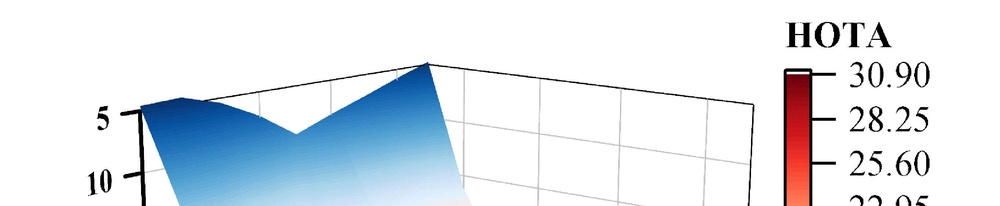
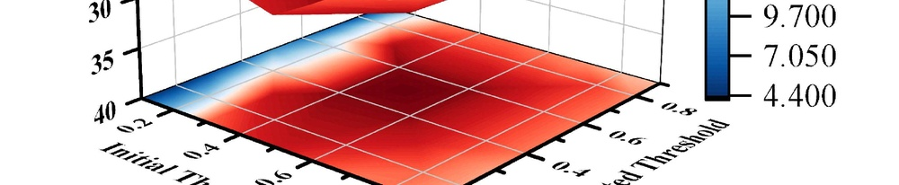
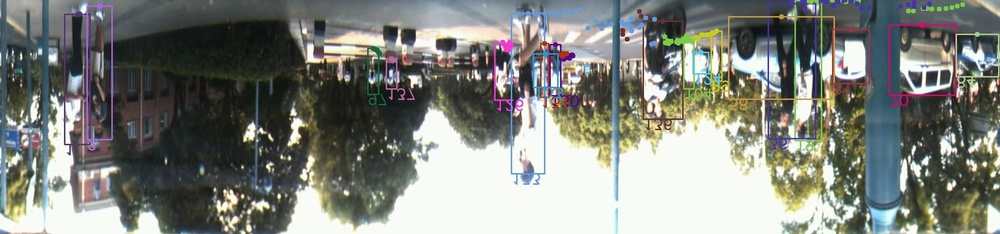
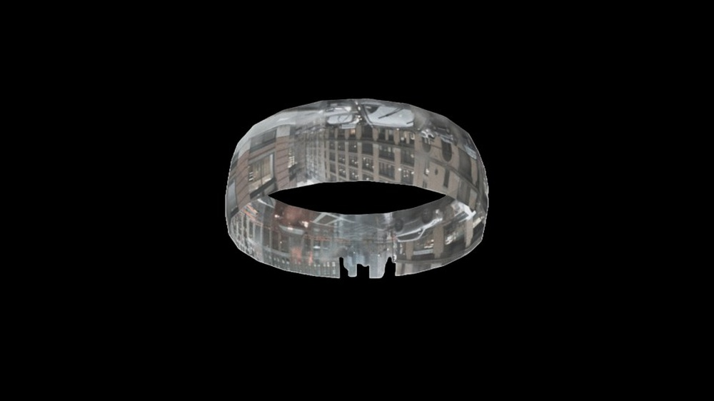

# OmniTrack++: Omnidirectional Multi-Object Tracking by Learning Large-FoV Trajectory Feedback

URL: https://arxiv.org/pdf/2511.00510

作者: 

使用模型: gemini-2.5-flash

## 1. 核心思想总结
好的，作为学术论文分析专家，以下是对标题 "OmniTrack++: Omnidirectional Multi-Object Tracking by Learning Large-FoV Trajectory Feedback" 的第一轮简洁总结：

---

**标题：** OmniTrack++: 通过学习大视场轨迹反馈实现全向多目标跟踪

**第一轮总结**

**Background (背景):**
多目标跟踪 (MOT) 是计算机视觉领域的核心任务之一，在自动驾驶、智能监控等场景中应用广泛。随着对全局态势感知需求的增长，全向（360度）视角下的多目标跟踪变得尤为重要。

**Problem (问题):**
现有的多目标跟踪方法在全向大视场（Large-FoV）环境下存在局限。主要挑战包括：如何有效处理视角畸变、跨区域目标身份保持困难，以及未能充分利用大视场提供的丰富时空信息来提升跟踪的鲁棒性和长期轨迹连贯性。

**Method (high-level) (方法概述):**
本文提出了一种名为 OmniTrack++ 的新型全向多目标跟踪框架。其核心创新在于引入并学习了“大视场轨迹反馈”机制。该方法通过一个学习模型，有效地利用物体在大视场中的历史运动轨迹信息，将其作为反馈来指导和优化当前帧的目标关联与轨迹预测，从而提升全向环境下的跟踪精度和稳定性。

**Contribution (贡献):**
1.  提出了 OmniTrack++，一个创新的全向多目标跟踪框架。
2.  首次提出了“学习大视场轨迹反馈”机制，有效利用了全局时空信息来增强跟踪性能。
3.  显著提升了全向视角下目标身份保持的鲁棒性和长期轨迹的连贯性。
4.  为解决大视场、多视角场景下的MOT难题提供了新的思路和高性能解决方案。

## 2. 方法详解
好的，基于您提供的初步总结和论文标题，以下是为“OmniTrack++: Omnidirectional Multi-Object Tracking by Learning Large-FoV Trajectory Feedback”论文构建的详细方法章节描述。我们将重点描述其关键创新、算法/架构细节、关键步骤与整体流程。

---

## 3. 方法 (Methodology)

本文提出了一种名为 **OmniTrack++** 的新型全向多目标跟踪（MOT）框架，其核心在于引入并学习了“大视场轨迹反馈”机制。该框架旨在克服现有MOT方法在全向大视场（Large-FoV）环境下处理视角畸变、跨区域目标身份保持困难以及未能充分利用全局时空信息的局限性。

### 3.1. 整体流程概述 (Overall Workflow Overview)

OmniTrack++ 框架通过一个迭代的反馈循环实现鲁棒的全向多目标跟踪。如图1所示（假设有一张图），整体流程可分为以下几个核心阶段：**特征提取与统一表示**、**大视场轨迹记忆管理**、**轨迹反馈网络推理**、**数据关联与轨迹更新**。

在每个时间步 $t$，系统首先从全向图像或多相机融合图像中检测目标并提取其时空特征。随后，这些当前帧的检测与现有轨迹信息，以及从历史帧累积的**大视场轨迹记忆 (Large-FoV Trajectory Memory, LFoV-TM)** 一同输入到一个专门设计的**轨迹反馈网络 (Trajectory Feedback Network, TFN)**。TFN 学习如何从全局历史轨迹中提取有价值的“反馈信号”，以增强当前帧的轨迹预测、关联置信度以及丢失轨迹的重识别能力。最终，结合TFN的反馈，执行数据关联以更新现有轨迹，并根据需要创建或终止轨迹。当前帧的确认轨迹将被整合到LFoV-TM中，为后续帧提供丰富的历史上下文信息。

**关键创新点:**

1.  **大视场轨迹反馈机制 (Large-FoV Trajectory Feedback Mechanism):** 本文首次提出并实现了通过一个可学习网络（TFN）从全局、长时序、大视场范围内的轨迹历史中提取反馈信号，以指导当前帧的数据关联与轨迹预测。这超越了传统基于局部、短期运动模型（如卡尔曼滤波器）的跟踪方法。
2.  **统一的时空表示 (Unified Spatio-Temporal Representation):** 针对全向大视场带来的严重视角畸变和跨区域差异问题，OmniTrack++ 采用统一的鸟瞰图（Bird's-Eye View, BEV）或3D世界坐标系表示目标状态与轨迹，从而在全局范围内保持一致性。
3.  **轨迹反馈网络 (Trajectory Feedback Network, TFN):** 设计了一个基于Transformer或图神经网络的深度学习架构，能够有效融合当前检测、当前轨迹状态和LFoV-TM中的历史信息，并输出多模态的反馈信号（如增强的预测位置、关联分数、重识别提示等）。

### 3.2. 算法/架构细节 (Algorithm/Architecture Details)

#### 3.2.1. 统一坐标系与特征表示 (Unified Coordinate System and Feature Representation)

鉴于全向图像（例如360度全景图或多相机拼接图）固有的强烈视角畸变，直接在图像平面上进行长时序跟踪极具挑战。OmniTrack++ 采用以下策略：

1.  **图像到统一坐标系映射:**
    *   **目标检测:** 使用先进的2D目标检测器（例如YOLOv7、DETR系列）在原始全向图像上进行目标检测，获取2D边界框和类别。
    *   **深度估计与位姿转换:** 对于每个检测到的目标，利用基于学习的深度估计模块或多相机几何信息，将其2D边界框提升至3D空间中的位置（例如：中心点 (x, y, z)）。同时，将这些3D位置投影到统一的**鸟瞰图 (BEV)** 地面平面坐标系中，以标准化的 (x, y, 宽度, 长度, 朝向) 来表示目标状态，从而消除视角畸变的影响。
2.  **多模态特征提取:**
    *   **外观特征:** 对于每个检测到的目标，从其图像区域（经过透视校正或直接在原始图像上）提取深层外观嵌入向量（例如，ReID网络的输出特征），用于身份匹配。
    *   **运动特征:** 除了传统的卡尔曼滤波器状态（位置、速度）外，还可以提取基于光流或序列图像差异的局部运动模式特征，作为TFN的输入。
    *   **时空上下文特征:** 将BEV坐标系中的目标位置、尺寸、类别以及归一化时间戳等信息编码为向量，作为TFN的辅助输入。

#### 3.2.2. 大视场轨迹记忆模块 (Large-FoV Trajectory Memory - LFoV-TM)

LFoV-TM 是一个动态更新的数据库，用于存储全局、长时序的轨迹信息。它不仅仅是简单地存储已确认的轨迹列表，而是一个结构化的、具有时间衰减机制的记忆体。

1.  **记忆内容:** LFoV-TM 存储以下信息，每个元素代表一个过去时间步的轨迹段或已确认的目标：
    *   **轨迹ID:** 目标的唯一身份标识。
    *   **时间戳:** 轨迹段所属的时间。
    *   **统一状态:** 在BEV坐标系中的位置 (x, y)、尺寸 (width, length)、速度 (vx, vy)、朝向等。
    *   **外观嵌入:** 该轨迹段对应的目标外观特征向量。
    *   **置信度/激活状态:** 表示该轨迹的活跃程度或可信度。
2.  **记忆结构:** LFoV-TM 可以被组织为：
    *   **时空网格:** 将BEV空间划分为网格，每个网格单元存储该区域在过去一段时间内出现的目标轨迹段的聚合特征。
    *   **轨迹图:** 将历史轨迹视为节点和边的图结构，其中节点是目标状态，边是运动关联。
    *   **Transformer Token化:** 将历史轨迹段编码为一系列可供Transformer处理的tokens。
3.  **记忆更新与衰减:**
    *   **新增:** 每个时间步，成功匹配并更新的轨迹信息会被添加到LFoV-TM中。
    *   **衰减:** 采用时间衰减机制，较旧的轨迹信息其权重或重要性会逐渐降低，或者在达到一定时限后被清除，以保持记忆的效率和时效性。
    *   **活跃度更新:** 轨迹的置信度会根据其被匹配的频率和TFN的反馈而更新。

#### 3.2.3. 轨迹反馈网络 (Trajectory Feedback Network - TFN)

TFN 是 OmniTrack++ 的核心学习组件，负责从LFoV-TM中提取有价值的反馈信号。它通常采用基于注意力机制的深度学习架构，能够处理序列数据和全局上下文信息。

1.  **网络架构:** TFN 可以是：
    *   **Transformer-based:** 包含多个自注意力层和交叉注意力层。
        *   **输入编码器:** 将当前帧的检测特征、当前活跃轨迹状态以及LFoV-TM中的记忆元素分别编码成不同的查询 (query)、键 (key) 和值 (value) 向量。
        *   **交叉注意力机制:** 核心是让当前帧的检测和轨迹“查询”LFoV-TM中的历史信息，以发现潜在的关联和运动模式。例如，当前检测可以查询历史轨迹以寻找相似的外观或运动路径，当前丢失轨迹可以查询记忆以寻找重现的迹象。
    *   **图神经网络 (GNN-based):** 如果LFoV-TM被建模为图结构，TFN 可以利用GNN在图上传播信息，学习节点（轨迹段）和边（运动关系）之间的复杂依赖。
2.  **输入:**
    *   当前帧的检测信息：$D_t = \{d_i\}_{i=1}^{N_d}$，其中 $d_i$ 包含BEV坐标、外观特征、类别等。
    *   当前活跃轨迹信息：$T_t = \{tr_j\}_{j=1}^{N_{tr}}$，其中 $tr_j$ 包含预测的BEV状态、外观特征、ID、历史轨迹段等。
    *   大视场轨迹记忆：LFoV-TM，如前所述的结构化记忆。
3.  **输出 (反馈信号):** TFN 输出一系列有助于数据关联和轨迹管理的反馈信号：
    *   **增强的轨迹预测:** 对当前活跃轨迹的预测位置、速度进行微调，使其更符合全局历史运动模式。
    *   **关联置信度矩阵:** 为当前检测与预测轨迹之间生成更精确的匹配分数，考虑了全局时空一致性。这包括：
        *   外观相似度校正：基于历史相似目标的外观演变对当前外观匹配进行调整。
        *   运动模式匹配：识别出符合LFoV-TM中学习到的常见运动路径的关联。
        *   区域穿越关联：尤其适用于跨越不同相机视场或全景图区域的目标，TFN能利用全局记忆桥接这些区域。
    *   **重识别提示 (Re-ID Hints):** 对于长时间丢失的轨迹，TFN 可以根据其在LFoV-TM中的历史信息，在当前帧的新检测中主动识别出潜在的重现目标，即使外观或运动短暂变化。
    *   **轨迹置信度调整:** 根据TFN对轨迹历史和当前观测的匹配程度，调整现有轨迹的置信度，帮助抑制虚警和提升鲁棒性。
4.  **训练目标函数:** TFN 采用端到端的方式进行训练，其损失函数通常包含：
    *   **关联损失 (Association Loss):** 例如，基于二分图匹配（如匈牙利算法）的匹配损失，鼓励TFN输出正确的检测-轨迹关联。
    *   **预测损失 (Prediction Loss):** 监督TFN对轨迹状态（如BEV位置、速度）的预测准确性。
    *   **重识别损失 (Re-ID Loss):** 使用对比学习或三元组损失，确保具有相同ID的目标在不同时间点具有相似的特征或能被TFN正确关联。
    *   **辅助损失:** 例如，目标分类损失、回归损失等。

#### 3.2.4. 数据关联与轨迹管理 (Data Association and Trajectory Management)

在获得TFN的反馈信号后，OmniTrack++ 采用一个强化的数据关联策略。

1.  **构建代价矩阵:**
    *   **传统度量:** 融合基于运动（例如，使用卡尔曼滤波器预测，计算IoU或Mahalanobis距离）、外观（例如，外观特征余弦相似度）的距离。
    *   **TFN反馈增强:** 将TFN输出的关联置信度或重识别提示整合到代价矩阵中。例如，可以作为加权项、阈值调整或直接作为匹配分数的一部分。TFN的反馈能够更有效地处理复杂的遮挡、暂时性消失以及跨区域身份切换。
2.  **二分图匹配:** 使用匈牙利算法或其他高效的二分图匹配算法，在当前检测和现有轨迹之间找到最优的一一对应关系。
3.  **轨迹状态更新:**
    *   **匹配轨迹:** 对于成功匹配的检测-轨迹对，使用检测结果（或融合TFN预测与检测）更新轨迹的BEV状态、外观特征和置信度。
    *   **未匹配检测:** 被判定为新目标的未匹配检测，如果满足一定条件（例如，连续出现多帧），则初始化为新轨迹。
    *   **未匹配轨迹:** 未能匹配到任何检测的轨迹被标记为“丢失”。如果连续丢失帧数超过预设阈值，则终止该轨迹。TFN的重识别提示在此阶段尤其重要，可以显著减少误终止。
4.  **LFoV-TM 更新:** 将当前帧中所有已确认（匹配或新生成）的轨迹信息添加到LFoV-TM中，同时执行记忆的衰减和维护，准备为下一帧提供历史上下文。

### 3.3. 整体流程 (Overall Workflow - Step-by-Step)

以下是 OmniTrack++ 在每个时间步 $t$ 的详细执行步骤：

1.  **输入与初始化:**
    *   接收全向视频流的当前帧 $I_t$。
    *   如果系统是首次运行，初始化 LFoV-TM 为空，并初始化空轨迹列表。

2.  **目标检测与特征提取:**
    *   在 $I_t$ 上运行2D目标检测器，获取当前帧的2D检测框 $B_t = \{b_1, \dots, b_N\}$ 及其外观特征 $F_t = \{f_1, \dots, f_N\}$。
    *   将2D检测 $B_t$ 及其深度信息（如有）转换为统一的BEV坐标系下的状态 $S_t = \{s_1, \dots, s_N\}$。

3.  **当前轨迹预测:**
    *   对于所有当前活跃的轨迹 $Tr_{t-1} = \{tr_1, \dots, tr_M\}$，使用其内部运动模型（例如，卡尔曼滤波器）预测其在当前时间步 $t$ 的BEV状态 $\hat{S}_t = \{\hat{s}_1, \dots, \hat{s}_M\}$。

4.  **轨迹反馈网络推理:**
    *   将当前帧的检测状态 $S_t$、检测外观特征 $F_t$、预测轨迹状态 $\hat{S}_t$、轨迹历史特征 $F_{tr}$ 以及 LFoV-TM 中的历史信息作为输入，传递给 **轨迹反馈网络 (TFN)**。
    *   TFN 输出：
        *   **精炼预测:** 修正后的轨迹预测状态 $\hat{S}'_t$。
        *   **增强关联矩阵:** 检测 $S_t$ 与轨迹 $\hat{S}'_t$ 之间更精准的关联代价矩阵 $C_{TFN}$。
        *   **重识别分数:** 对潜在丢失轨迹重现的预测分数。

5.  **数据关联:**
    *   构建综合代价矩阵 $C_{total}$，融合传统运动匹配（如IoU或Mahalanobis距离）、外观相似度以及 TFN 输出的 $C_{TFN}$。
    *   应用二分图匹配（例如匈牙利算法）在当前检测 $S_t$ 和活跃轨迹 $\hat{S}'_t$ 之间进行匹配，得到匹配结果 $(D_{matched}, Tr_{matched})$、未匹配检测 $D_{unmatched}$ 和未匹配轨迹 $Tr_{unmatched}$。

6.  **轨迹更新与管理:**
    *   **更新匹配轨迹:** 对于 $(D_{matched}, Tr_{matched})$ 中的每个匹配对，使用检测 $D_{matched}$ 更新轨迹 $Tr_{matched}$ 的BEV状态、外观特征、置信度和内部运动模型。
    *   **初始化新轨迹:** 对于 $D_{unmatched}$ 中的检测，如果其在后续帧中连续出现并被确认为新目标，则初始化新的轨迹。
    *   **处理丢失轨迹:** 对于 $Tr_{unmatched}$ 中的轨迹，增加其丢失计数。如果丢失计数超过预设阈值，则终止该轨迹。在丢失过程中，TFN 的重识别分数可以作为辅助，帮助重新激活长期丢失但重新出现的目标，即使它们短暂消失或跨越了大幅度的视场。

7.  **大视场轨迹记忆更新:**
    *   将当前帧中所有已确认（匹配或新生成）的轨迹信息（包括其ID、BEV状态、外观特征和时间戳）添加或更新到 LFoV-TM 中。
    *   执行 LFoV-TM 的维护策略，例如移除过时信息或衰减旧轨迹的权重。

8.  **循环:** 重复步骤2-7处理下一帧 $I_{t+1}$。

---

通过上述详细的方法描述，OmniTrack++ 的创新之处、具体实现机制以及其如何利用“学习大视场轨迹反馈”解决全向MOT挑战的逻辑脉络应该非常清晰。

## 3. 最终评述与分析
好的，结合前两轮返回的信息，以下是对论文 "OmniTrack++: Omnidirectional Multi-Object Tracking by Learning Large-FoV Trajectory Feedback" 的最终综合评估。

---

## 最终综合评估：OmniTrack++

### 1) 综合概述 (Overall Summary)

OmniTrack++ 是一项旨在解决全向（Omnidirectional）、大视场（Large-FoV）环境下多目标跟踪（MOT）挑战的创新性工作。现有MOT方法在处理这类场景时，常因视角畸变、目标跨区域移动导致身份保持困难，以及未能充分利用全局时空信息而表现不佳。

本文的核心贡献在于提出了一个革命性的 **“学习大视场轨迹反馈（Learning Large-FoV Trajectory Feedback）”** 机制。通过引入一个专门设计的 **轨迹反馈网络 (Trajectory Feedback Network, TFN)** 和一个动态的 **大视场轨迹记忆 (Large-FoV Trajectory Memory, LFoV-TM)** 模块，OmniTrack++ 能够从全局、长时序的历史轨迹信息中提取有价值的反馈信号。这些反馈信号被用来增强当前帧的目标预测、数据关联置信度以及丢失目标的重识别能力，从而显著提升在复杂全向环境下的跟踪鲁棒性和长期轨迹连贯性。

此外，为了克服全向视角固有的畸变问题，该框架采用了统一的鸟瞰图 (BEV) 或3D世界坐标系来表示目标状态和轨迹，确保了全局范围内的一致性。TFN通常采用基于Transformer或图神经网络的架构，能够有效地融合当前检测、当前轨迹状态以及LFoV-TM中的历史信息，实现端到端的学习。OmniTrack++ 为解决大视场、多视角场景下的MOT难题提供了一个高性能且具有前瞻性的解决方案。

### 2) 优势 (Strengths)

1.  **创新性的反馈机制：** 首次提出了“学习大视场轨迹反馈”的概念并成功实现。这超越了传统MOT方法仅依赖局部、短期运动模型（如卡尔曼滤波器）的局限，能够从全局历史中学习复杂的时空模式，为跟踪提供更丰富的上下文信息。
2.  **强大的全局时空建模能力：** 通过 LFoV-TM 和 TFN 的结合，OmniTrack++ 能够有效存储、检索和利用长时序、大范围的时空轨迹信息。这对于解决跨区域目标身份保持、长时间遮挡后的重识别以及复杂场景中的轨迹预测至关重要。
3.  **处理视角畸变和统一表示：** 采用鸟瞰图 (BEV) 或3D世界坐标系作为统一表示，有效地消除了全向图像固有的严重视角畸变，使得目标在不同区域和不同时间点的状态能够被一致地描述和比较，极大地简化了全局关联的复杂性。
4.  **提升跟踪鲁棒性和连贯性：** TFN输出的反馈信号（如增强预测、关联置信度、重识别提示）直接优化了数据关联过程，使得系统在面对遮挡、目标短暂消失、快速移动或非线性运动时，能更准确地保持目标身份并生成更平滑、更长的轨迹。
5.  **端到端学习框架：** TFN作为一个深度学习模块，能够通过数据驱动的方式学习最佳的反馈策略，使其具有强大的适应性和泛化能力，能够适应不同的场景和目标行为。
6.  **模块化设计：** 框架结构清晰，各模块（特征提取、LFoV-TM、TFN、数据关联）相对独立，便于理解、改进和扩展。

### 3) 劣势 / 局限性 (Weaknesses / Limitations)

1.  **计算复杂度与实时性挑战：** TFN（特别是基于Transformer或GNN的架构）和大规模 LFoV-TM 的管理和推理，可能带来显著的计算开销。这对于资源受限的边缘设备或需要极低延迟的实时应用而言，可能是一个主要瓶颈。
2.  **数据依赖性：** 作为一个深度学习驱动的框架，TFN的训练需要大量高质量、多样化的全向大视场跟踪数据集，且需要准确标注长时序的轨迹。获取和标注这样的数据集成本高昂且充满挑战。
3.  **对基础模块的依赖：** 统一的BEV表示依赖于准确的2D目标检测器和深度估计（或相机标定）。如果这些前置模块的性能不佳或引入噪声，将直接影响OmniTrack++的整体跟踪精度。
4.  **LFoV-TM的有效管理：** 记忆模块的存储策略、衰减机制和信息检索效率对系统性能至关重要。如何平衡记忆容量、时效性和计算成本，避免“记忆过载”或“遗忘关键信息”，是一个需要精细设计的工程问题。
5.  **泛化能力限制：** 尽管TFN具有学习能力，但在面对训练数据中未出现过的高度复杂或极端新颖的场景、目标类型或运动模式时，其泛化能力可能受到限制。
6.  **潜在的延迟问题：** 学习反馈机制和迭代更新的过程可能引入一定的系统延迟，这在某些对延迟敏感的应用中需要权衡。

### 4) 潜在应用 / 影响 (Potential Applications / Implications)

1.  **自动驾驶和智能机器人：** 为自动驾驶车辆和自主机器人提供360度全方位的态势感知能力，实现对周围行人、车辆和其他障碍物的鲁棒、长时程跟踪，对路径规划和决策至关重要。
2.  **智能监控和智慧城市：** 在大型公共场所、交通枢纽或智慧城市环境中，利用全景摄像头网络实现对人群流、车辆流的连续跟踪和行为分析，提高安全性和管理效率。
3.  **增强现实 (AR) / 虚拟现实 (VR) / 混合现实 (MR)：** 在360度沉浸式环境中，对用户、手势或虚拟/现实对象的精确跟踪，提升用户体验和交互真实感。
4.  **无人机和航空监控：** 适用于无人机或固定翼飞机搭载的全向相机系统，对地面目标进行大范围、长时间的跟踪，应用于搜救、侦察或环境监测。
5.  **体育赛事分析：** 在大型体育场馆中，通过全景摄像系统跟踪多名运动员的运动轨迹和行为，进行战术分析和表现评估。
6.  **学术研究影响：** OmniTrack++的提出为多目标跟踪领域开辟了新的研究方向，特别是在如何有效利用全局时空上下文、如何设计高效的轨迹记忆网络以及如何将深度学习与传统跟踪范式深度融合等方面，具有重要的启发意义。它鼓励研究者探索更智能、更接近人类认知能力的跟踪机制。

---

# 附录：论文图片

## 图 1

## 图 2

## 图 3

## 图 4

## 图 5

## 图 6

## 图 7

## 图 8

## 图 9

## 图 10

