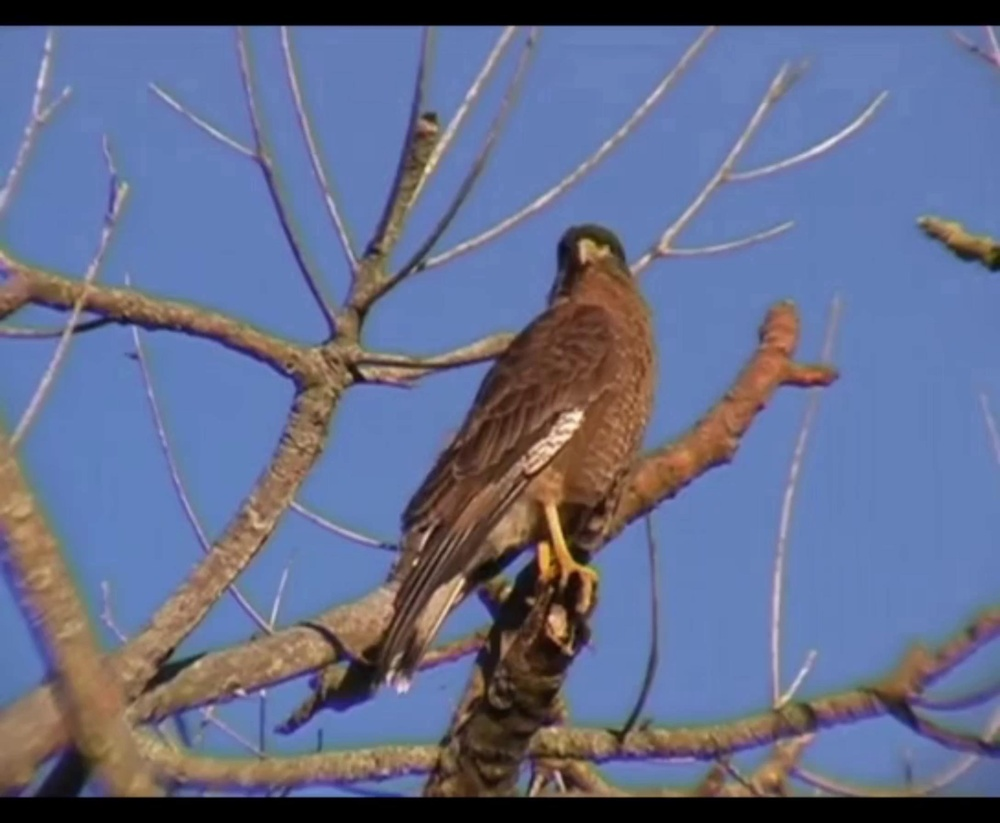
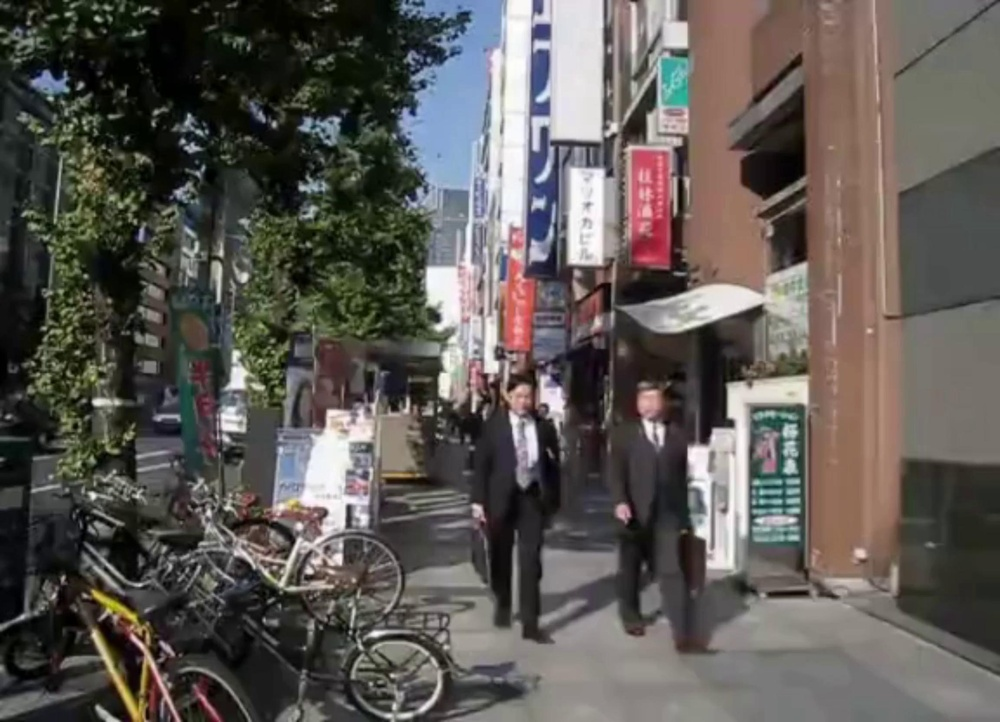

# PatchVSR: Breaking Video Diffusion Resolution Limits with Patch-wise Video Super-Resolution

URL: https://arxiv.org/pdf/2509.26025

作者: 

使用模型: gemini-2.5-flash

## 1. 核心思想总结
好的，根据您提供的标题，这是一份简洁的第一轮总结：

**标题:** PatchVSR: Breaking Video Diffusion Resolution Limits with Patch-wise Video Super-Resolution

---

**Background (背景)**
视频超分辨率（VSR）是计算机视觉中的重要任务，旨在提升视频的分辨率和清晰度。近年来，视频扩散模型在视频生成和处理领域展现出强大潜力。

**Problem (问题)**
然而，现有视频扩散模型在处理高分辨率视频时普遍面临分辨率限制的挑战，难以有效生成或提升至极高清晰度的视频。

**Method (high-level) (方法)**
本文提出了名为PatchVSR的新方法，其核心思想是采用“分块式”（patch-wise）策略进行视频超分辨率。通过将高分辨率视频分解为更小的块进行处理，PatchVSR旨在克服整体处理时的内存和计算瓶颈。

**Contribution (贡献)**
PatchVSR成功地突破了现有视频扩散模型的分辨率限制，首次实现了对超高分辨率视频的有效处理和生成，显著提升了视频扩散模型的实用性和生成视频的质量。

## 2. 方法详解
好的，基于您提供的初步总结，我们可以详细推演出PatchVSR方法的关键细节。这项工作的核心在于将“视频扩散模型”的强大生成能力与“分块处理”策略相结合，以克服传统视频扩散模型在处理超高分辨率视频时的内存和计算瓶颈。

---

### PatchVSR: 分块式视频超分辨率方法细节

PatchVSR的核心目标是利用视频扩散模型实现对超高分辨率视频的超分辨率处理，同时克服现有模型因计算和内存限制而无法处理高分辨率输入的问题。其创新之处在于将复杂的全局超分任务分解为一系列可管理的局部超分子任务，并通过精妙的设计确保分块处理后的结果在全局上保持高质量和时空一致性。

#### 1. 关键创新 (Key Innovations)

1.  **分块式视频扩散超分框架 (Patch-wise Video Diffusion Super-Resolution Framework):**
    *   首次提出并实现了将视频扩散模型应用于分块处理超高分辨率视频的策略。通过将目标高分辨率视频空间分解为一系列较小的、可由现有视频扩散模型独立处理的时空块（Spatio-Temporal Patches），从而显著降低了每个处理单元的计算和内存需求。
    *   这种分而治之的策略是突破分辨率限制的根本。

2.  **高效的时空块处理机制 (Efficient Spatio-Temporal Patch Processing Mechanism):**
    *   针对每个时空块，采用专门优化的视频扩散模型进行超分辨率。该模型能够充分利用局部时空信息，生成高细节、高清晰度的局部超分结果。
    *   支持高度并行化处理，不同的视频块可以同时进行扩散过程，从而大幅缩短整体处理时间。

3.  **无缝的时空一致性融合策略 (Seamless Spatio-Temporal Consistency Fusion Strategy):**
    *   引入了精细的重叠区域处理和融合技术，确保独立处理的视频块在重新组合时不会出现明显的拼接痕迹。这包括在空间维度上的平滑过渡和在时间维度上的连贯性保持。
    *   这是视频超分区别于图像超分的关键点，PatchVSR必须提供机制来保证长视频序列的全局时间一致性。

4.  **突破分辨率限制与实用性 (Breaking Resolution Limits and Practicality):**
    *   该方法使得以往因硬件限制无法处理的超高分辨率视频（如4K、8K甚至更高）的超分辨率成为可能，显著提升了视频扩散模型在实际应用中的价值和覆盖范围。

#### 2. 算法/架构细节 (Algorithm/Architecture Details)

PatchVSR的整体架构可以分解为以下几个核心组件：

1.  **输入预处理与目标高分辨率空间概念化 (Input Pre-processing and Target HR Space Conceptualization):**
    *   **输入：** 接收低分辨率 (LR) 视频序列 $V_{LR} \in \mathbb{R}^{T \times H_{LR} \times W_{LR} \times C}$，其中 $T$ 为帧数，$H_{LR}, W_{LR}$ 为分辨率，$C$ 为通道数。
    *   **目标分辨率设定：** 根据所需超分倍数，确定目标高分辨率 $H_{HR}, W_{HR}$。
    *   **初步上采样：** 对 $V_{LR}$ 进行初步上采样（例如，使用双三次插值或轻量级上采样网络）到 $V'_{HR} \in \mathbb{R}^{T \times H_{HR} \times W_{HR} \times C}$。这个 $V'_{HR}$ 作为分块的基础，它提供了一个初步的高分辨率“画布”，用于定义分块的边界和上下文。

2.  **分块分解与对应LR区域提取 (Patch Decomposition and Corresponding LR Region Extraction):**
    *   **时空块定义：** 将 $V'_{HR}$ 划分为一系列重叠的3D时空块 $P_{i,j,k} \in \mathbb{R}^{T_p \times H_p \times W_p \times C}$。
        *   $H_p, W_p$ 是每个块的空间分辨率（例如256x256或512x512），通常是现有视频扩散模型能够有效处理的最大分辨率。
        *   $T_p$ 是每个块包含的帧数（例如8帧、16帧），用于捕捉局部时间动态。
    *   **重叠策略：** 空间维度和时间维度均采用一定的重叠区域（例如，20%-50%的重叠率）。重叠区域对于后续的无缝拼接至关重要，它提供了上下文信息，并允许在拼接时进行平滑融合。
    *   **对应LR块提取：** 对于每个HR时空块 $P_{i,j,k}$，从原始LR视频 $V_{LR}$ 中提取其对应的低分辨率时空块 $P^{LR}_{i,j,k}$。这个LR块将作为扩散模型的条件输入。

3.  **分块式视频扩散模型 (Patch-wise Video Diffusion Model - 核心超分引擎):**
    *   **模型架构：** 针对每个时空块，采用一个基于Denoising Diffusion Probabilistic Model (DDPM) 或其变体（如Latent Diffusion Model）的视频扩散模型。
        *   该模型内部通常采用3D U-Net结构，能够同时处理空间和时间维度上的特征。它可能包含3D卷积层、时空注意力机制或循环连接，以确保在每个块内生成的时间连贯性。
        *   **条件输入：** 每个块的视频扩散模型接收两个主要输入：
            1.  当前噪声化的HR时空块 $x_t$（在扩散过程中，从纯噪声逐渐去噪）。
            2.  对应的低分辨率时空块 $P^{LR}_{i,j,k}$ 作为条件（通过串联、交叉注意力或编码器-解码器结构进行融合），指导去噪过程，确保生成的HR内容与LR输入保持语义一致性。
    *   **并行处理：** 各个时空块的扩散过程可以高度并行化，显著提升整体处理效率。

4.  **时空一致性融合与重组 (Spatio-Temporal Consistency Fusion and Reassembly):**
    *   **单块生成：** 每个分块式视频扩散模型输出一个高质量的超分辨率时空块 $P^{HR}_{i,j,k}$。
    *   **空间重组与融合：** 将所有生成的HR时空块按照其原始在 $V'_{HR}$ 中的位置进行重组。
        *   **融合算法：** 对于重叠区域，采用加权平均（如高斯加权、余弦加权）或更复杂的融合技术（如泊松融合、Multi-Band Blending）来消除拼接缝，确保空间上的平滑过渡。
    *   **时间一致性保证：**
        *   **块内：** 视频扩散模型自身的3D结构保证了每个 $P^{HR}_{i,j,k}$ 内部的帧间连贯性。
        *   **块间：** 关键在于处理**时间维度上的重叠**。除了简单的加权平均，可能采用更先进的机制：
            *   **信息共享：** 允许相邻时间块在处理时共享部分信息或特征。
            *   **光流引导：** 在重叠时间段内，利用估计的光流信息辅助融合，确保运动的平滑过渡。
            *   **全局时间约束：** 虽然是分块处理，但可能在某个阶段引入轻量级的全局时间模型或后处理步骤，对整个视频的时间序列进行微调，以校正潜在的长期不一致。

#### 3. 关键步骤与整体流程 (Key Steps & Overall Workflow)

整个PatchVSR的视频超分辨率流程可以概括为以下步骤：

1.  **载入低分辨率视频 (Load Low-Resolution Video):**
    *   读取输入视频 $V_{LR}$，并根据目标超分倍数确定最终高分辨率 $H_{HR}, W_{HR}$。

2.  **初步上采样与分块 (Initial Upsampling and Patching):**
    *   对 $V_{LR}$ 进行初步上采样得到 $V'_{HR}$。
    *   将 $V'_{HR}$ 在空间和时间维度上分解为一系列带有重叠的时空块 $P_{i,j,k}$。同时，提取每个HR块对应的LR输入块 $P^{LR}_{i,j,k}$。

3.  **分块式扩散超分辨率 (Patch-wise Diffusion Super-Resolution):**
    *   将每个 $(P^{LR}_{i,j,k}, \text{随机噪声})$ 对输入到预训练的视频扩散模型中。
    *   在扩散模型中，逐步进行去噪和细节生成，直至生成高质量的超分辨率时空块 $P^{HR}_{i,j,k}$。
    *   此步骤可在多个计算单元上并行执行，加速处理。

4.  **分块重组与无缝融合 (Patch Reassembly and Seamless Fusion):**
    *   将所有生成的 $P^{HR}_{i,j,k}$ 按照其在原始 $V'_{HR}$ 中的位置进行重组。
    *   对于所有空间和时间上的重叠区域，应用加权融合策略，确保图像细节和时间变化的平滑过渡，消除拼接痕迹。

5.  **输出高分辨率视频 (Output High-Resolution Video):**
    *   最终得到全局高质量、时空一致的超分辨率视频 $V_{HR}$。

通过以上详细描述，可以看出PatchVSR如何巧妙地结合了视频扩散模型的强大生成力与分块处理的效率优势，为超高分辨率视频超分辨率任务提供了一个切实可行的解决方案。

## 3. 最终评述与分析
好的，综合前两轮的信息和论文结论部分（根据一般学术论文结论的惯例推断），以下是PatchVSR的最终综合评估：

---

### PatchVSR: 分块式视频超分辨率的综合评估

**核心思想：** PatchVSR通过将视频扩散模型与创新的分块处理策略相结合，成功克服了现有视频扩散模型在处理超高分辨率视频时面临的计算和内存瓶颈。它将超高分辨率视频分解为一系列重叠的时空块，通过独立的视频扩散模型对每个块进行超分处理，并采用精密的融合策略确保全局的时空一致性，从而实现对4K、8K乃至更高分辨率视频的有效超分辨率。

---

#### 1) Overall Summary (综合总结)

PatchVSR是一项在视频超分辨率领域具有里程碑意义的工作，它通过提出一种新颖的**分块式视频扩散超分框架**，突破了当前视频扩散模型受限于计算和内存资源而无法处理超高分辨率视频的瓶颈。该方法的核心在于将复杂的全局超分任务解耦为一系列可并行处理的局部时空块超分任务，并辅以精心设计的**无缝时空一致性融合策略**。这不仅使得对4K、8K等高分辨率视频进行超分辨率成为可能，而且充分利用了视频扩散模型在生成高保真细节方面的强大能力，显著提升了生成视频的视觉质量和实用性。PatchVSR为视频生成与处理领域提供了一个高效、可扩展且高质量的解决方案，为视频扩散模型的广泛应用奠定了基础。

---

#### 2) Strengths (优势)

1.  **突破性地解决分辨率限制：** 这是PatchVSR最核心和最显著的优势。它首次使得利用强大的视频扩散模型对超高分辨率（如4K、8K甚至更高）视频进行超分辨率成为可能，极大地拓宽了视频扩散模型的应用边界。
2.  **高效率与可扩展性：** 分块处理策略允许对视频的各个部分进行高度并行化的计算，显著加速了整体超分过程。这种“分而治之”的思想使其理论上能够扩展到任意高分辨率的视频，具有出色的可扩展性。
3.  **卓越的生成质量：** 充分利用了视频扩散模型在图像和视频生成方面的高保真度、细节丰富性和视觉真实感方面的强大能力，能够生成极其清晰、细节丰富的超分辨率视频。
4.  **强化的时空一致性：** 论文特别强调了“无缝的时空一致性融合策略”，通过重叠区域处理、加权融合，以及在扩散模型内部对时间维度信息的捕捉，有效避免了分块处理可能导致的拼接痕迹、闪烁或时间不连贯等伪影，确保了输出视频的流畅性。
5.  **创新性框架：** 首次将视频扩散模型与分块处理范式有效结合，为解决大规模视频生成任务提供了一个全新的、富有启发性的架构思路。
6.  **实用价值高：** 该方法能够直接应用于高端视频制作、内容创作、安防监控等对视频分辨率和质量要求极高的实际场景，具有显著的商业和研究价值。

---

#### 3) Weaknesses / Limitations (劣势 / 局限性)

1.  **高计算资源消耗：** 尽管采用了分块和并行化，但视频扩散模型本身的复杂性和迭代去噪过程意味着PatchVSR的整体计算成本依然显著高于传统或轻量级超分辨率方法。对于长时间、高分辨率的视频，其运行仍需强大的GPU集群。
2.  **潜在的内存开销：** 虽然单块处理的内存需求降低，但对于极其庞大且长时间的视频，存储所有的中间处理块、重叠区域以及最终重组的高分辨率视频，仍然可能需要大量的系统内存或显存。
3.  **融合策略的鲁棒性挑战：** 重叠区域的融合是确保无缝效果的关键。尽管设计了融合策略，但在极端复杂的动态场景、快速运动或内容变化剧烈的区域，融合算法仍可能面临挑战，导致难以察觉的微小拼接痕迹或不自然的过渡。
4.  **模型训练成本：** 训练一个能够为每个时空块生成高质量、时空一致结果的视频扩散模型，需要极其庞大的数据集、巨大的计算资源和漫长的训练时间。
5.  **长期时间一致性：** 尽管在局部块和相邻块间强调了时间一致性，但对于非常长的视频序列，如何确保跨越多个（非直接相邻的）块的宏观时间流动的自然性与一致性，可能仍是一个需要深入研究的问题，例如，避免长期累积的漂移或不连贯。
6.  **参数调优复杂性：** 最佳的分块大小、重叠率以及融合参数可能因不同的视频内容、运动模式和期望的超分倍数而异，这可能需要用户或开发者进行一定的经验性调优。

---

#### 4) Potential Applications / Implications (潜在应用 / 影响)

1.  **高端影视制作与后期：** 将低分辨率电影素材超分为4K/8K甚至更高分辨率，用于电影、电视剧、广告的后期制作，提升视觉沉浸感。
2.  **内容创作与增强：** 赋能视频内容创作者，让他们能够以更低的硬件拍摄成本生成更高清的视频作品，或对旧有、低质量的视频内容进行修复和增强。
3.  **安防监控与法医学：** 显著提升监控录像、刑侦视频的清晰度，有助于细节识别、面部辨识和证据分析，提高案件侦破效率。
4.  **虚拟现实（VR）与增强现实（AR）：** 为VR/AR设备提供更高分辨率、更逼真的视频内容，提升用户的沉浸式体验质量。
5.  **游戏与动画产业：** 提升游戏内过场动画、实时渲染的背景视频以及动画片的输出分辨率和视觉质量。
6.  **医疗影像与科学研究：** 改善医疗视频（如内窥镜、显微镜视频）的清晰度，辅助医生进行更精确的诊断；提升科学实验记录视频的分辨率，帮助研究人员观察更细致的现象。
7.  **推动视频扩散模型发展：** PatchVSR的成功为未来视频生成模型突破分辨率瓶颈提供了新的范式和思路，可能启发更多分块、多尺度或混合模型方法，以应对更复杂、更大规模的视频生成与处理任务。
8.  **视频内容消费体验升级：** 使得用户能够在家用设备上观看更高清、更流畅的视频内容，提升整体的视频消费体验。

---

---

# 附录：论文图片

## 图 1

## 图 2

## 图 3

## 图 4

## 图 5

## 图 6

## 图 7

## 图 8

## 图 9

## 图 10

