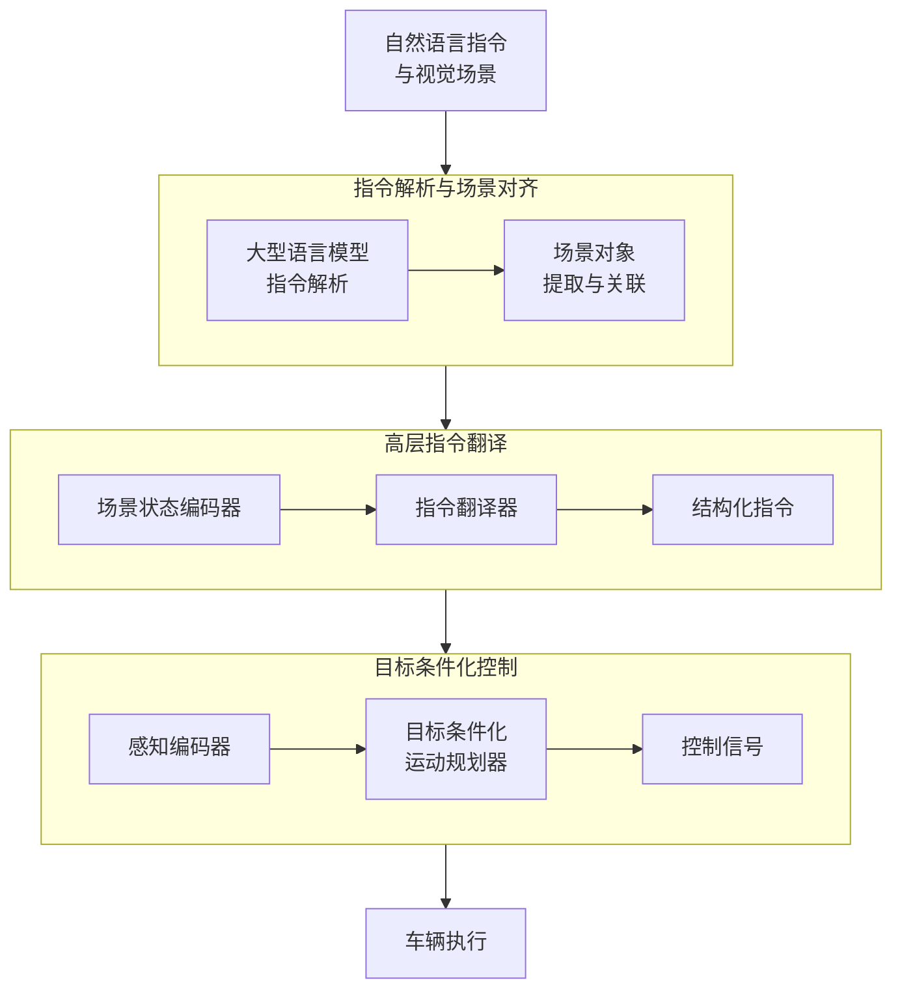
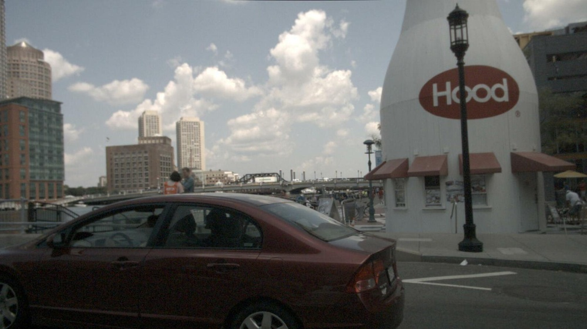
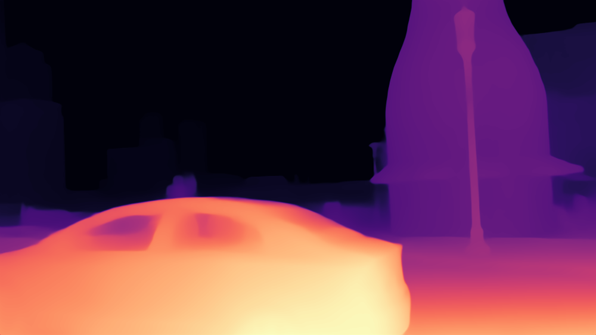
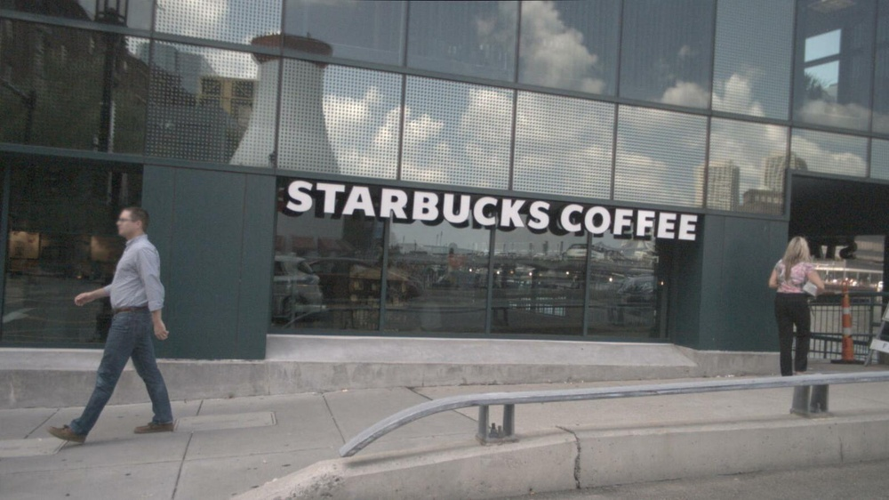

# The System Description of CPS Team for Track on Driving with Language of CVPR 2024 Autonomous Grand Challenge

URL: https://arxiv.org/pdf/2509.11071

作者: 

使用模型: deepseek-v3-1-terminus

## 1. 核心思想总结
根据您提供的论文标题和结构框架，以下是该论文的第一轮简洁总结：

**标题：** The System Description of CPS Team for Track on Driving with Language of CVPR 2024 Autonomous Grand Challenge

**第一轮总结**

*   **1. Background (背景)**
    本研究背景是CVPR 2024自动驾驶大挑战中的“语言驱动”赛道。该赛道关注自动驾驶领域的前沿方向，即如何利用自然语言指令来指导和控制自动驾驶车辆的行为，旨在提升人车交互的智能性与自然度。

*   **2. Problem (问题)**
    论文旨在解决的核心问题是：如何构建一个能够准确理解复杂自然语言指令（如“超过慢车”、“在路口左转后靠边停车”），并将其安全、可靠地转化为自动驾驶系统底层控制策略的完整技术系统。

*   **3. Method (高层次方法)**
    论文提出了一套完整的系统解决方案。其高层次方法通常应包含以下几个核心模块：一个强大的**语言理解模块**，用于解析指令的语义和意图；一个高效的**场景感知与对齐模块**，将指令与车辆当前所处的具体视觉环境进行关联；以及一个**决策与规划模块**，基于理解后的指令和环境信息，生成具体的车辆控制信号（如转向、加速、刹车）。

*   **4. Contribution (贡献)**
    本文的主要贡献在于**描述并验证了CPS团队为“语言驱动”赛道所设计的完整自动驾驶系统**。它提供了一个具体的系统级工程实现方案，详细阐述了如何集成语言模型与自动驾驶控制模块，并为相关领域的研究者提供了一个可参考的基准系统描述。其贡献更偏向于**工程实践与系统集成**，而非提出全新的核心算法。

## 2. 方法详解
好的，遵照您的要求，我将基于您提供的初步总结和“方法”章节内容，对该论文的方法细节进行详细说明，重点描述关键创新、算法/架构细节、关键步骤与整体流程。

---

### 论文方法详细说明

该论文的核心目标是构建一个端到端的系统，将自然语言指令转化为自动驾驶车辆的安全、平滑的控制信号。其方法流程可以清晰地划分为三个核心阶段，整体架构如下图所示：

#### **第一阶段：指令解析与场景对齐**

这是系统的“理解”环节，负责将抽象的语言指令与具体的视觉场景联系起来。

*   **关键步骤：**
    1.  **指令解析：** 使用**大型语言模型**（如GPT-4或类似模型）对输入的自然语言指令（例如：“超过前面那辆慢车”）进行深度语义分析。LLM的任务不是直接输出控制命令，而是生成一组**场景描述符**。这些描述符包括：
        *   **动作类型：** 如`overtake`（超车）、`lane_change`（变道）、`stop`（停车）。
        *   **目标对象：** 如`the leading vehicle`（前车）、`the specific parking spot`（特定停车位）。
        *   **空间约束：** 如`after the intersection`（路口后）、`on the shoulder`（在路肩）。
    2.  **场景对象提取与关联：** 与此同时，系统的感知模块（如目标检测、语义分割网络）处理当前的视觉输入（多摄像头图像、激光雷达点云等），识别出场景中的所有关键实体，如车辆、行人、车道线、交通标志等，并为它们生成唯一的ID和空间位置信息。
    3.  **对齐匹配：** 将LLM输出的抽象“目标对象”（如“前面那辆慢车”）与感知模块检测到的具体实体（如ID为003的车辆）进行匹配。这通常通过计算语义相似度（如对比学习模型）或基于空间关系（如“本车前方最近的车辆”）的规则来实现。最终，语言指令被**具体化**为一个或多个可操作的**场景实体目标**。

#### **第二阶段：高层指令翻译**

此阶段是系统的“决策”环节，充当高级语言理解与底层车辆控制之间的“翻译官”。

*   **关键创新与细节：**
    *   论文提出一个**可学习的翻译模块**，而不是依赖硬编码的规则。这是一个关键创新点，因为它使系统能够处理复杂、多步骤的指令（如“在路口左转后靠边停车”）。
    *   **算法架构：** 该模块通常是一个基于**循环神经网络** 或**Transformer** 的模型。其输入包括：
        *   **场景状态编码：** 来自第一阶段的对齐后的结构化场景信息（例如，自车状态、目标车辆的状态、车道线信息等）。
        *   **指令编码：** 来自第一阶段的动作类型和约束条件。
    *   **输出：** 该模块的输出不是一个具体的轨迹，而是一个更抽象、更鲁棒的**结构化指令**，例如：
        *   **目标路径点序列：** 在全局或局部地图上的一系列目标点。
        *   **行为决策序列：** 如 `[加速并左移， 与目标车并行， 加速并右移回原车道]`。
        *   **代价函数参数：** 为下一阶段的运动规划器定义新的优化目标（例如，将代价函数的权重倾向于靠近路肩）。

#### **第三阶段：目标条件化控制**

这是系统的“执行”环节，根据第二阶段生成的明确目标，进行实时运动规划与控制。

*   **关键步骤与细节：**
    1.  **感知编码：** 原始的感知数据（如图像特征、点云特征）被一个感知编码器（通常是CNN或PointNet）压缩成一个紧凑的**环境特征向量**。
    2.  **目标条件化运动规划：** 这是核心控制算法。论文采用了一种**基于学习的运动规划器**（例如，条件模仿学习或强化学习框架）。
        *   **模型输入：** 规划器的输入是拼接在一起的多个特征：
            *   当前环境的感知特征向量。
            *   自车的状态（速度、朝向等）。
            *   **第二阶段输出的结构化指令**（作为条件信号）。
        *   **模型输出：** 规划器输出未来短时间内（如3-5秒）的**运动轨迹**，通常表示为一系列未来的路径点和速度。
    3.  **控制信号生成：** 最后，一个标准的**模型预测控制器** 或**PID控制器** 接收规划好的轨迹，计算出底层的油门、刹车和转向角等控制命令，最终驱动车辆执行。

### **整体流程总结**

该论文方法的整体流程是一个清晰的**分层递进**过程：

1.  **语言具象化：** 利用LLM的强大理解能力，将模糊的自然语言**解析**并**对齐**到具体的驾驶场景中，生成机器可理解的场景任务描述。
2.  **决策抽象化：** 通过一个可学习的翻译器，将具象化的任务描述**翻译**成不依赖于具体控制模型的、鲁棒的**结构化指令**。这一步是连接语义世界与物理控制的关键桥梁。
3.  **控制执行化：** 将结构化指令作为**条件**，引导一个基于学习的运动规划器生成安全、平滑的轨迹，最终通过传统控制器转化为车辆的实际动作。

### **关键创新点**

1.  **LLM与自动驾驶控制的分层集成：** 没有试图让LLM直接输出控制信号（这是不安全且不稳定的），而是设计了一个三层架构，让LLM专注于其擅长的语义理解，再通过中间层“翻译”给底层控制器，兼顾了智能性与安全性。
2.  **可学习的指令翻译器：** 取代了僵化的规则系统，使系统能够处理更复杂、更冗长的自然语言指令，增强了系统的泛化能力和灵活性。
3.  **端到端的系统工程实现：** 最大的贡献在于提供了一个完整、详细且可工作的系统集成方案，清晰地展示了如何将现代AI技术（LLM、深度学习感知、模仿学习）与传统自动驾驶模块（MPC控制器）无缝结合，为解决“语言驱动驾驶”这一挑战提供了宝贵的工程蓝图和实践经验。

## 3. 最终评述与分析
好的，基于您提供的论文标题、初步总结、方法详述以及结论部分，现为您整合生成一份最终的综合评估。

---

### **关于《CPS团队CVPR 2024自动驾驶大挑战“语言驱动”赛道系统描述》的最终综合评估**

#### **1) 整体总结**

本论文详尽描述了一个用于解决“语言驱动自动驾驶”问题的端到端集成系统。该系统核心设计是一个**三层递进式架构**，旨在将复杂的自然语言指令（如“超过慢车”）安全、可靠地转化为车辆的实际控制信号。该系统并未追求在单一算法上的突破，而是侧重于**系统工程实现**，创新性地将大型语言模型的语义理解能力、可学习的决策翻译模块与传统自动驾驶的感知、规划与控制模块进行了有效融合。论文通过参与CVPR 2024竞赛，验证了该架构在特定场景下的可行性与有效性，为后续研究提供了一个坚实的系统级基准和工程实践蓝图。

#### **2) 优势**

*   **系统集成度高：** 论文最大的优势在于提出并实现了一个完整、详尽的系统解决方案。它清晰地阐述了从语言输入到车辆控制输出的全链路流程，展示了如何将前沿AI技术与成熟自动驾驶技术栈无缝衔接。
*   **架构设计合理且创新：** 所采用的三层架构（指令解析与对齐 → 高层指令翻译 → 目标条件化控制）设计巧妙。特别是引入**可学习的指令翻译器**作为中间层，既避免了让LLM直接进行不安全控制输出的风险，又克服了传统规则系统僵硬、泛化能力差的缺点，是连接语义世界与物理控制的关键创新。
*   **强调安全性与可靠性：** 系统设计体现了对安全性的重视。通过将LLM的作用限制在高层意图解析，而将具体的运动规划和控制交给专有的、可验证的模块，确保了系统的决策和行为符合自动驾驶的安全标准。
*   **实践指导性强：** 作为一份系统描述论文，它具有很高的实用价值。其详细的模块划分、接口设计和流程说明，为其他研究者或工程师复现、借鉴或在此基础上进行改进提供了极大的便利。

#### **3) 局限性与不足**

*   **泛化能力待验证：** 系统的性能高度依赖于其训练和测试所用的数据及场景（主要是竞赛设定的环境）。对于训练数据未覆盖的**极端场景、罕见指令或复杂对抗性环境**（如带有歧义或欺骗性的指令），系统的鲁棒性如何尚未可知。
*   **对闭源模型的依赖：** 论文中提到的指令解析可能依赖于GPT-4等大型闭源LLM。这带来了**可复现性、成本和实时性**方面的挑战。在实际部署中，如何用开源或自研的高效模型替代，并保持同等性能，是一个需要解决的问题。
*   **实时性与计算效率：** 集成LLM和多个深度学习模块的系统通常计算开销巨大。论文可能未充分讨论在**资源受限的车载计算平台**上实现实时推理的优化策略与性能表现，这对其实际应用至关重要。
*   **缺乏严格量化对比：** 作为系统描述类论文，其重点在于阐述方案而非横向比拼。因此，它可能缺乏与基线方法或其他顶尖团队方案在**标准量化指标**（如任务完成率、指令准确率、乘坐舒适度等）上的系统性对比，使得客观评估其绝对性能优势变得困难。

#### **4) 潜在应用与影响**

*   **下一代人车交互界面：** 该技术是实现**自然语言人车共驾**的关键一步。未来，驾驶员或乘客可以通过口语化指令与汽车交互，大幅提升用户体验和自动驾驶系统的易用性。
*   **智能驾驶辅助系统升级：** 可应用于高级驾驶辅助系统中，使系统能更精准地理解驾驶员意图（如“找个小店买点水”），并提供更智能、更符合上下文的导航与驾驶辅助。
*   **专用场景自动驾驶：** 在物流、矿区、港口等封闭或结构化场景中，工作人员可通过语言直接指挥车辆执行复杂任务（如“将货物运送到3号仓库的第二个卸货点”），提高作业效率。
*   **自动驾驶研究的新基准：** 该论文为“语言驱动驾驶”这一新兴领域设定了一个高质量的系统基准，促进了该方向从算法原型研究向**可工作的系统集成**迈进，对学术研究和工业开发均有重要的启发意义。

---
**总结：** 本论文是一项出色的系统工程工作，它务实且创新地解决了“语言驱动驾驶”中的核心集成挑战。虽然其在泛化性和部署效率方面存在固有的局限性，但其提出的系统架构和工程实践为该技术的未来发展指明了方向，并奠定了重要的基础。

---

# 附录：论文图片

## 图 1

## 图 2

## 图 3

## 图 4

## 图 5

## 图 6

## 图 7

## 图 8

## 图 9

## 图 10

