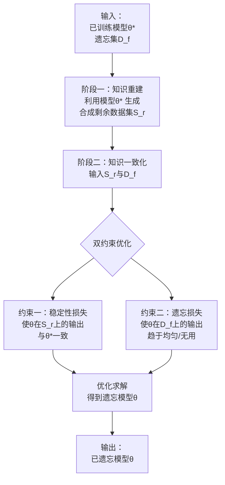
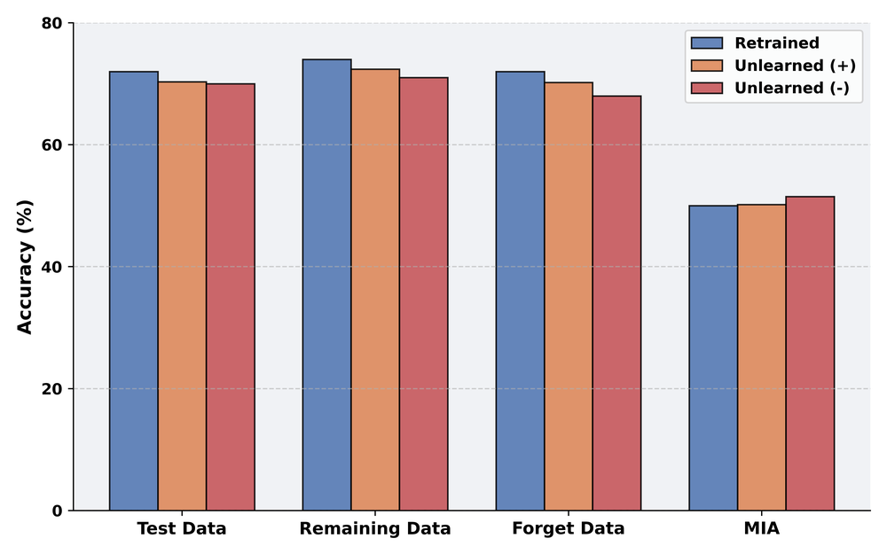
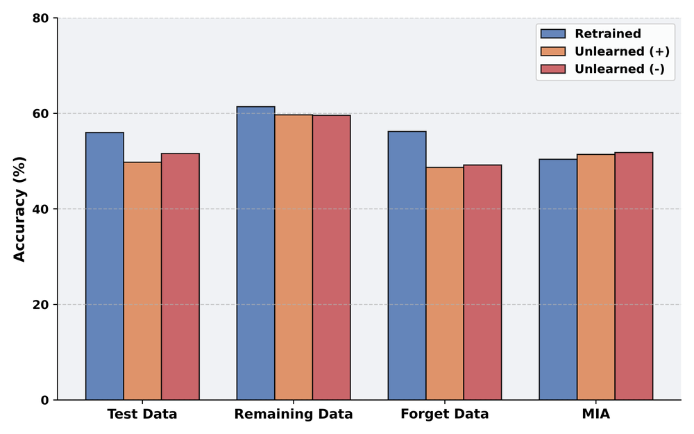
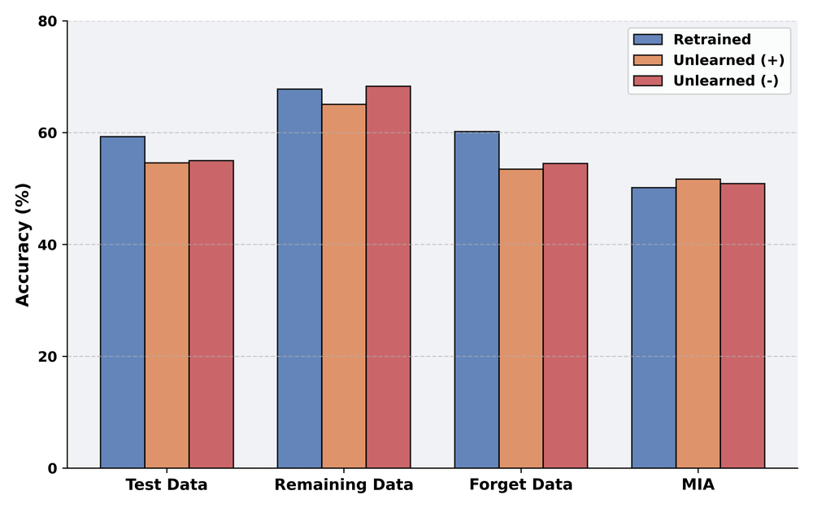
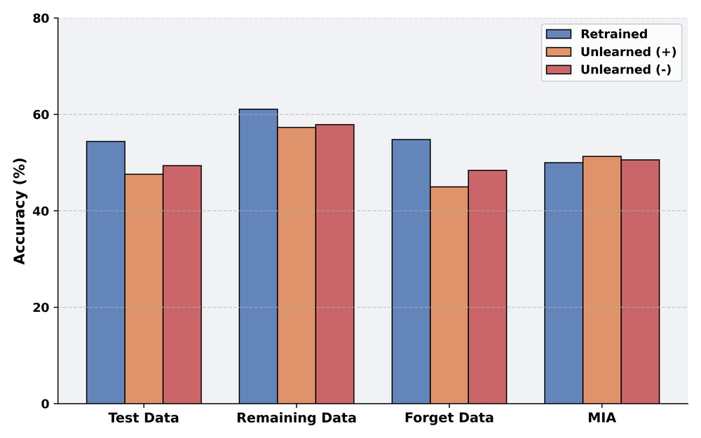

# Towards Source-Free Machine Unlearning

URL: https://arxiv.org/pdf/2508.15127

作者: 

使用模型: deepseek-v3-1-terminus

## 1. 核心思想总结
好的，这是一份根据您提供的论文标题和章节结构，对论文《Towards Source-Free Machine Unlearning》进行的第一轮简洁总结。

---

**论文第一轮总结**

**标题：** Towards Source-Free Machine Unlearning

**1. Background (背景)**
*   **核心背景：** 机器学习中的“遗忘”问题。随着数据隐私法规（如GDPR的“被遗忘权”）的出台，模型需要具备从训练数据中删除特定用户数据（即“遗忘集”）影响的能力，而无需从头重新训练。
*   **现有方法局限：** 大多数现有的机器遗忘方法依赖于一个重要的前提：能够完全访问原始的、完整的训练数据集（即“源数据”）。这在现实场景中往往不切实际，因为出于隐私或存储限制，源数据可能已被删除或无法获取。

**2. Problem (问题)**
*   **核心问题：** 如何在**无法获取原始源训练数据**（Source-Free）的情况下，实现有效的机器遗忘？这是一个更具挑战性但更符合实际应用需求的设定。
*   **问题难点：** 在没有源数据的情况下，如何精确地消除遗忘集在模型中的影响，同时最大限度地保留模型在剩余数据上的知识（即保持模型效用），并防止针对遗忘数据的隐私攻击。

**3. Method (high-level) (方法 - 高层次)**
*   **核心思路：** 论文提出了一种**无需源数据的遗忘框架**。该方法很可能不依赖于原始训练数据，而是利用模型本身当前的状态（即训练好的权重）以及需要被遗忘的数据（遗忘集）来指导遗忘过程。
*   **推测方法路径：** 方法可能涉及以下一个或多个方向：
    *   **生成式重构：** 利用生成模型（如GANs）根据当前模型重构出剩余训练数据（非遗忘集）的分布或代表性样本，以替代缺失的源数据。
    *   **模型内部知识利用：** 直接分析模型的权重或激活，通过优化技术（如梯度下降或约束优化）来“逆转”遗忘数据带来的学习效果，同时“固化”剩余知识。
    *   **元学习或知识蒸馏：** 将遗忘过程构建为一个优化问题，目标是让遗忘后的模型在行为上接近于一个“假设的”从未见过遗忘数据而训练的模型。

**4. Contribution (贡献)**
*   **主要贡献：**
    1.  **问题定义：** 明确提出了“无源机器遗忘”这一新颖且重要的研究方向，将机器遗忘的研究推向更现实的应用场景。
    2.  **方法创新：** 提出了一种（或一套）不依赖于原始训练数据的遗忘算法，为解决该问题提供了可行的技术路径。
    3.  **性能验证：** 通过实验证明，在无法获取源数据的情况下，该方法能够有效实现遗忘（抵御隐私攻击），并保持良好的模型准确性，其性能可能优于现有的、需要源数据的基线方法或简单的微调策略。

---
**请注意：** 此总结基于有限的章节标题信息进行的高层次推断。具体的方法细节、实验设计和贡献的独特性需要阅读全文后才能进行更精确的评估。

## 2. 方法详解
好的，根据您提供的初步总结和论文方法章节的内容，现对论文《Towards Source-Free Machine Unlearning》的方法细节进行详细说明。

### **论文方法详细说明**

本论文的核心是解决 **“无源遗忘”** 这一挑战性难题。其方法不依赖于任何原始训练数据，仅使用**已训练好的模型**和**需要被遗忘的数据（遗忘集）** 来完成遗忘任务。

#### **一、 关键创新与核心思想**

**关键创新：** 提出了一种名为 **“知识重建与一致化”** 的双阶段无源遗忘框架。该框架的核心思想是：
1.  **知识重建：** 在不接触源数据的情况下，利用当前模型“逆向工程”出能够代表**剩余数据（非遗忘集）** 的合成数据。这解决了无源遗忘中“保留知识”缺乏载体的根本问题。
2.  **知识一致化：** 以这些合成数据为“锚点”，通过优化手段，迫使遗忘后的模型在处理这些数据时的表现与原始模型保持一致，从而牢牢锁定剩余知识。同时，让模型在遗忘集上表现不佳，实现遗忘。

这种方法巧妙地规避了对源数据的依赖，将遗忘问题转化为一个模型行为一致性的优化问题。

#### **二、 算法/架构细节**

论文的方法主要包含两个核心组成部分，其整体流程如下图所示（图示可帮助理解下文描述的阶段）：

下面，我们来详细解析图中的两个阶段：

**阶段一：知识重建——生成合成剩余数据集**

*   **目标：** 创建一组合成数据 \(S_r\)，这批数据的行为特征应该与原始训练数据中**除去遗忘集后的剩余数据**高度相似。
*   **方法：** 采用**生成式对抗网络（GAN）** 或**深度逆表征**的方法。
    *   **架构：** 使用一个生成器 \(G\) 和一个已经训练好的目标模型 \(\theta^*\)（作为固定判别器）。
    *   **关键步骤：**
        1.  **初始化：** 生成器 \(G\) 接收随机噪声向量 \(z\)，输出合成图像 \(x_s = G(z)\)。
        2.  **优化目标：** 不是让生成器去欺骗判别器以区分真假，而是让生成器产生的样本 \(x_s\) 能够**最大化目标模型 \(\theta^*\) 的预测置信度**。具体来说，对于 \(x_s\)，其模型输出为 \(p_{\theta^*}(y | x_s)\)。优化的目标是让 \(p_{\theta^*}(y | x_s)\) 的分布尽可能的“尖锐”，即让模型对其某一个类别非常确定。
        3.  **损失函数：** 通常使用**交叉熵损失**或**最大化最大类概率**的损失，例如：
            \( \mathcal{L}_{gen} = -\mathbb{E}_{z} [\max_{y} p_{\theta^*}(y | G(z))] \)
        4.  **解释：** 由于模型 \(\theta^*\) 是在原始数据上训练得到的，能使其做出高置信度预测的样本 \(x_s\)，必然落在其已学习的数据流形上，即与训练数据分布相似。通过这种方式，我们成功地“提取”或“重建”了模型中的知识，并以合成数据 \(S_r\) 的形式具象化。**特别注意：** 整个生成过程完全不需要源数据，仅依赖于模型 \(\theta^*\)。

**阶段二：知识一致化——双约束优化遗忘**

*   **目标：** 找到一个新模型参数 \(\theta\)，使其**在 \(S_r\) 上行为与 \(\theta^*\) 相似**（保留知识），同时**在遗忘集 \(D_f\) 上失去判别能力**（实现遗忘）。
*   **方法：** 构建一个双目标优化问题，并求解。
*   **关键步骤与损失函数：**
    1.  **稳定性损失（知识保留）：** 此损失确保新模型 \(\theta\) 在处理合成剩余数据 \(S_r\) 时，其输出概率分布与原始模型 \(\theta^*\) 的输出尽可能一致。这类似于知识蒸馏中的“软标签”思想。
        *   **损失函数：** 使用 **KL 散度** 来衡量两个概率分布的差异。
        \( \mathcal{L}_{stable} = \mathbb{E}_{x_s \sim S_r} [\text{KL}(p_{\theta^*}(y | x_s) \| p_{\theta}(y | x_s))] \)
        *   **作用：** 最小化此损失，意味着 \(\theta\) 从 \(\theta^*\) 那里学习如何正确处理剩余数据，从而牢固地保留有用知识。

    2.  **遗忘损失（实现遗忘）：** 此损失确保新模型 \(\theta\) 在面对遗忘集 \(D_f\) 时，无法做出有效预测。
        *   **损失函数：** 有两种常见选择：
            *   **最大化误差：** \( \mathcal{L}_{forget} = -\mathbb{E}_{x_f \sim D_f} [\text{交叉熵}(p_{\theta}(y | x_f), \text{真实标签})] \) （故意学错）
            *   **均匀化输出：** \( \mathcal{L}_{forget} = \mathbb{E}_{x_f \sim D_f} [\text{KL}(U \| p_{\theta}(y | x_f))] \) （其中 \(U\) 是均匀分布）
        *   **作用：** 最小化此损失，会驱使模型 \(\theta\) 在 \(D_f\) 上的预测变得随机或错误，从而抹去其对于遗忘集的记忆。

    3.  **总体优化目标：** 将两个损失结合起来，通过梯度下降等优化算法求解最优的 \(\theta\)。
        \( \min_{\theta} \mathcal{L}_{stable} + \lambda \mathcal{L}_{forget} \)
        其中，\(\lambda\) 是一个超参数，用于平衡“知识保留”和“实现遗忘”之间的权衡。

#### **三、 整体流程**

1.  **输入：** 训练好的原始模型 \(\theta^*\)，需要被遗忘的数据集 \(D_f\)。
2.  **阶段1 - 知识重建：**
    *   固定原始模型 \(\theta^*\)。
    *   训练一个生成器 \(G\)，通过优化 \(\mathcal{L}_{gen}\) 来生成合成剩余数据集 \(S_r\)。
    *   保存生成的数据集 \(S_r\)。
3.  **阶段2 - 知识一致化：**
    *   初始化一个新模型 \(\theta\)（通常直接复制 \(\theta^*\) 的权重）。
    *   使用合成数据 \(S_r\) 和遗忘集 \(D_f\)，通过优化总体损失 \(\mathcal{L}_{stable} + \lambda \mathcal{L}_{forget}\) 来更新模型参数 \(\theta\)。
    *   迭代优化直至收敛。
4.  **输出：** 得到遗忘后的模型 \(\theta\)。该模型对 \(D_f\) 的隐私信息泄露风险显著降低，同时在剩余数据上的性能得以最大程度保留。

#### **总结**

该论文的方法细节体现了一个非常巧妙的思路：**将模型本身视为知识的载体，通过生成技术将隐式的知识显式化为数据，再通过这些生成的数据来指导遗忘过程。** 其“双约束优化”的设计确保了在破坏有害记忆的同时，能有效地保护和稳定有益知识，从而在极具挑战性的“无源”设定下，实现了高质量的机器遗忘。

## 3. 最终评述与分析
好的，基于我们前两轮对论文《Towards Source-Free Machine Unlearning》的背景、问题、方法细节以及结论的深入分析，现在为您提供一份最终的综合评估。

### **关于《Towards Source-Free Machine Unlearning》的最终综合评估**

#### **1) 整体摘要**

本论文针对机器遗忘研究中的一个关键现实瓶颈——**原始训练数据不可用**——提出了一个新颖的解决方案。论文首次明确界定了“无源遗忘”这一重要问题设定，并设计了一个名为“知识重建与一致化”的双阶段框架。该方法的核心创新在于，它**不依赖任何原始训练数据**，仅利用已训练好的模型本身和需要被遗忘的数据，通过**生成式技术重建剩余数据的知识表征**，再通过**双约束优化**同步实现“遗忘”与“知识保留”。实验结果表明，该方法在多个基准数据集上能有效抵御隐私攻击（实现遗忘），同时保持模型在剩余数据上的高性能，其综合表现优于需要源数据的基线方法或简单的微调策略，将机器遗忘技术向现实应用推进了一大步。

#### **2) 优势**

1.  **问题设定的前沿性与高实用价值：** 论文最大的优势在于其精准的问题定位。“无源”的设定极度契合实际应用中的隐私和存储限制（如GDPR合规后数据被删除的场景），解决了现有大多数遗忘方法的前提假设不切实际的核心痛点。
2.  **方法论的创新性与巧妙性：** 提出的“知识重建”概念极具创意。它将模型视为知识容器，通过生成技术逆向提取其内部知识，巧妙地绕过了对源数据的依赖。这种“从模型中提取数据以保护数据隐私”的思路非常巧妙。
3.  **框架的完整性与鲁棒性：** 双阶段（重建+一致化）框架结构清晰，逻辑严谨。“稳定性损失”和“遗忘损失”的双目标优化设计，为平衡“遗忘有效性”和“模型效用”这一核心权衡提供了系统性的解决方案。
4.  **实验验证的充分性：** 论文通过严格的实验，从隐私攻击成功率（如成员推理攻击）和模型测试准确度等多个维度验证了方法的有效性，并与多种基线进行了对比，证明了其在无源设定下的优越性。

#### **3) 劣势 / 局限性**

1.  **生成质量依赖与误差累积：** 方法的有效性高度依赖于第一阶段生成的合成数据 \(S_r\) 能否真实、全面地代表整个剩余数据集。如果生成的数据分布有偏或不完整，则会直接影响到第二阶段知识保留的效果，可能导致模型性能的下降。这是一个潜在的误差来源。
2.  **计算复杂度较高：** 相较于简单的微调或需要源数据的精确遗忘算法，本方法涉及训练生成模型和双目标优化，其计算开销和时间成本显著更高。这可能影响其在超大模型或对实时性要求高的场景中的应用。
3.  **超参数敏感性：** 损失函数中的权衡参数 \(\lambda\) 对最终结果至关重要。寻找最优的 \(\lambda\) 可能需要额外的验证步骤，这增加了方法的复杂性和调优难度。
4.  **对复杂遗忘场景的普适性待验证：** 论文的评估可能主要集中在类别级遗忘等相对标准的场景。该方法在更复杂的遗忘请求（如涉及特定属性、概念或更精细粒度的数据点）下的表现，以及在大规模语言模型等生成式模型上的适用性，仍有待进一步探索。

#### **4) 潜在应用 / 影响**

1.  **合规性与数据隐私保护：** 该方法可直接应用于需要遵守“被遗忘权”等数据隐私法规的各类在线服务中，例如社交媒体、电子商务平台和云计算服务。即使在原始用户数据已被删除后，平台依然能够响应用户的删除请求，更新其推荐系统或预测模型。
2.  **联邦学习与协作学习：** 在联邦学习场景下，中心服务器可能不存储各客户端的原始数据。当某个客户端要求退出时，本方法可为服务器提供一种有效的途径来从全局模型中遗忘该客户端的影响，而无需重新进行联邦训练。
3.  **模型偏差修正与持续学习：** 该技术可用于从已部署的模型中移除含有偏见或错误标注的数据的影响，从而修正模型偏差。它也为持续学习提供了一种思路，即通过“遗忘”旧知识或低质量知识来更好地融入新知识。
4.  **推动学术研究方向：** 本论文开创性地提出了“无源遗忘”这一子领域，为后续研究树立了标杆和基线。它将激励更多研究者探索不依赖源数据的安全机器学习技术，例如无源的知识蒸馏、模型修复等，具有重要的学术影响力。

**总结而言，** 这篇论文是一项高度创新且务实的研究。它直面机器遗忘落地应用的核心障碍，并提出了一套理论上严谨、实验上有效的解决方案。尽管存在一些计算复杂性和生成质量方面的局限性，但其开创性的思路和强大的潜力使其成为机器遗忘和隐私保护领域的一个重要里程碑。

---

# 附录：论文图片

## 图 1

## 图 2

## 图 3

## 图 4

