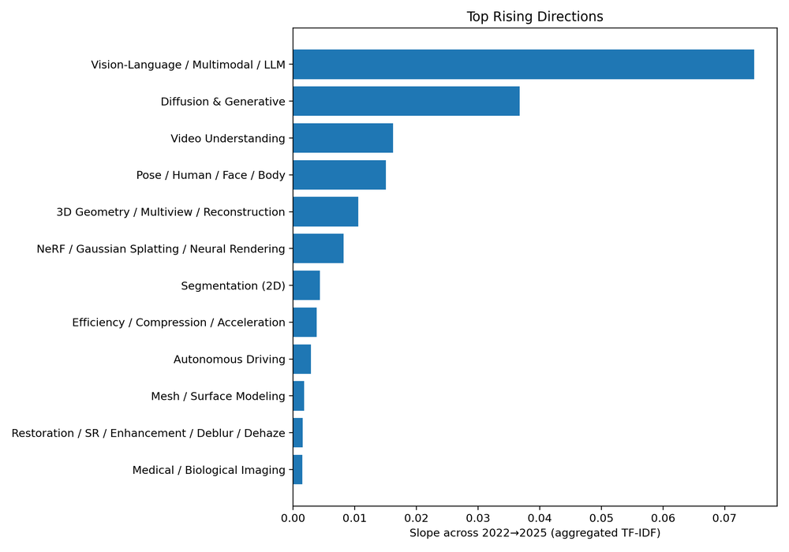
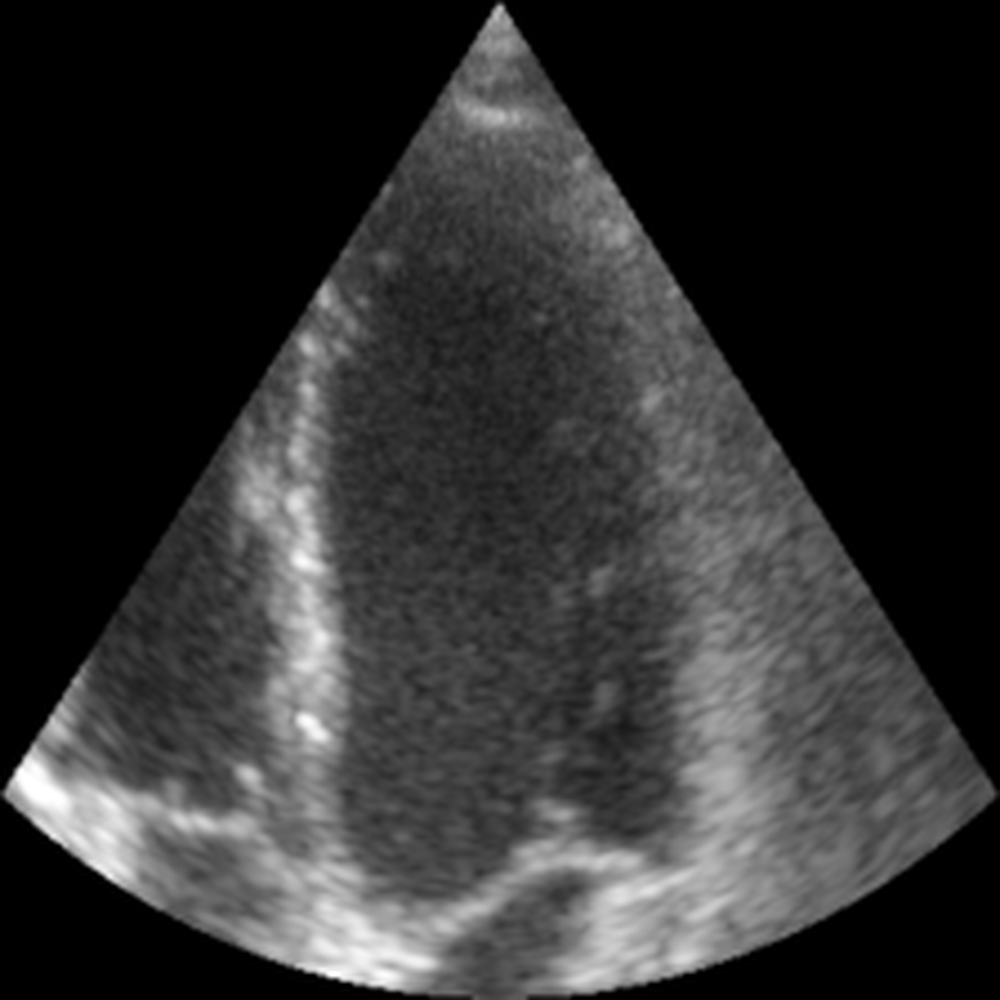

# Vision Language Models: A Survey of 26K Papers

URL: https://arxiv.org/pdf/2510.09586

作者: 

使用模型: gemini-2.5-flash

## 1. 核心思想总结
这是一份基于标题和通用论文结构推断的简洁第一轮总结：

---

**标题:** Vision Language Models: A Survey of 26K Papers

**第一轮总结**

**Background (背景):**
视觉语言模型（VLM）结合了计算机视觉和自然语言处理的能力，在多模态人工智能领域展现出巨大潜力并取得了快速发展。它们能够理解和处理视觉与文本信息之间的复杂关系，是当前AI研究的核心前沿之一。

**Problem (问题):**
随着VLM领域的飞速发展，相关研究论文数量呈爆炸式增长（本研究涉及约2.6万篇），导致研究人员难以全面、系统地掌握其演进脉络、技术范式、主要挑战和未来趋势。领域知识分散，缺乏一个权威且综合性的梳理与分析。

**Method (方法 - 高层):**
本研究将对约2.6万篇视觉语言模型相关论文进行大规模、系统性的文献综述。方法可能包括：构建全面的文献检索策略、利用自动化工具进行数据挖掘和主题建模、对文献进行多维度分类和归纳、分析领域内发展趋势和热点。

**Contribution (贡献):**
1.  **全面梳理:** 提供了迄今为止最全面、最深入的视觉语言模型研究图景。
2.  **知识体系:** 构建了清晰的VLM分类体系和技术发展路线图，有助于研究人员理解其复杂性。
3.  **趋势洞察:** 识别了领域内的关键技术突破、当前热点、未解决的挑战和未来潜在的研究方向。
4.  **参考指引:** 为新入行者提供了快速入门的指南，并为资深研究人员提供了深化理解和拓展研究思路的权威参考。

## 2. 方法详解
好的，基于初步总结和标题信息，我们可以推断出这是一项大规模、系统性的文献计量学与内容分析相结合的综述研究。以下是该论文的方法细节的详细说明：

---

### **论文方法细节：对26K篇视觉语言模型论文的系统性综述**

本研究旨在对视觉语言模型（VLM）领域内约2.6万篇论文进行大规模、系统性、多维度的文献综述与分析，以构建全面的知识图谱、识别核心技术范式、揭示发展趋势及未解决挑战。鉴于论文数量的巨大，本方法将高度依赖自动化工具与先进的自然语言处理（NLP）技术，辅以专家的人工校审与验证。

#### **1. 整体流程（Overall Workflow）**

本研究的方法流程可分为以下五个主要阶段：

1.  **文献检索与收集 (Literature Retrieval & Collection)：** 制定全面的检索策略，从多个权威数据库中收集原始文献数据。
2.  **数据预处理与筛选 (Data Preprocessing & Filtering)：** 对收集到的数据进行清洗、去重、元数据提取和初步相关性筛选。
3.  **多维度数据分析与挖掘 (Multi-dimensional Data Analysis & Mining)：** 运用定量文献计量学和定性内容分析技术，包括主题建模、聚类分析、趋势分析等。
4.  **知识体系构建与趋势洞察 (Knowledge System Construction & Trend Insight)：** 基于分析结果，构建VLM分类体系，绘制技术发展路线图，并识别关键突破、挑战与未来方向。
5.  **综述撰写与验证 (Review Writing & Validation)：** 整合所有发现，撰写综述报告，并进行内部与外部的专家评审，确保内容的准确性与权威性。

#### **2. 关键创新 (Key Innovations)**

本研究方法的核心创新点在于：

1.  **大规模自动化分析框架：** 针对2.6万篇论文的庞大规模，传统人工综述方式不可行。本研究开发并应用了一套结合了先进NLP技术（如深度语义嵌入、话题模型）和文献计量学工具的自动化分析框架，实现了对海量文献的高效、深度处理。
2.  **深度语义层面的主题与趋势挖掘：** 区别于简单的关键词共现分析，本方法利用如BERT、RoBERTa等预训练语言模型的嵌入（embedding）能力，对论文摘要、标题甚至全文（如果可获取）进行深度语义表征，进而通过聚类算法（如HDBSCAN、K-means++）识别出更细粒度、语义连贯的研究主题和技术栈，并追踪其演变。
3.  **跨维度知识图谱构建：** 不仅仅停留在技术分类，本研究方法还通过整合时间（发表年份）、空间（机构/国家）、引用网络（影响力）、主题（技术栈/应用场景）等多个维度的数据，构建了一个动态、多视角的VLM领域知识图谱，而非静态的分类目录。这有助于揭示技术间的依赖关系、创新路径及不同社区的贡献。
4.  **挑战与机遇的量化与定性结合识别：** 结合定量分析（如特定主题的增长停滞、引用热度下降）和定性分析（如从论文未来工作部分或结论中提取共同问题），系统性地识别VLM领域当前面临的未解决挑战和未来潜在的研究机遇。

#### **3. 算法/架构细节 (Algorithm/Architecture Details)**

为处理和分析2.6万篇论文，将采用以下核心算法与技术：

*   **文献元数据提取与清洗：**
    *   使用`Scrapy`或其他网络爬虫框架从学术数据库API或网页抓取数据。
    *   采用`pandas`进行数据框管理，利用正则表达式（`re`库）和`fuzzywuzzy`进行高效的标题、作者、摘要等字段的清洗、标准化和去重。
*   **语义嵌入与降维：**
    *   **预训练语言模型 (PLMs)：** 采用如Sentence-BERT (SBERT) 或专门针对科学文献训练的模型（如SciBERT），将每篇论文的标题和摘要（或关键词）转换为高维度的语义向量（embeddings）。
    *   **降维算法：** 使用UMAP (Uniform Manifold Approximation and Projection) 或 t-SNE (t-Distributed Stochastic Neighbor Embedding) 将高维语义向量降维到2D或3D空间，以便进行可视化和辅助聚类。
*   **主题建模与聚类：**
    *   **层次密度聚类 (HDBSCAN)：** 适用于处理大规模、高维度的语义向量，能够识别出不同密度和形状的聚类，并自动发现最佳的聚类数量，对于发现嵌套或不规则的研究主题非常有效。
    *   **混合主题模型：** 结合传统LDA (Latent Dirichlet Allocation) 或NMF (Non-negative Matrix Factorization) 与基于PLM的聚类结果。HDBSCAN的聚类结果可以作为LDA或NMF的先验知识，使得传统主题模型能更准确地提取每个语义簇内部的关键词分布，从而更好地解释主题。
    *   **命名实体识别 (NER)：** 训练或使用预训练的NER模型识别论文中出现的特定技术名称、模型架构、数据集等实体，辅助构建技术路线图。
*   **引用网络分析：**
    *   **图数据库 (Graph Database)：** 如Neo4j，用于存储论文、作者、机构、引用关系，便于进行图遍历和复杂查询。
    *   **图算法：** PageRank用于评估论文或作者的影响力；社区检测算法（如Louvain、Girvan-Newman）用于识别研究社区或子领域。
*   **可视化工具：**
    *   `Matplotlib`, `Seaborn`, `Plotly` 或专门的文献计量学可视化工具（如`VOSviewer`）用于生成出版趋势图、关键词共现网络、引用网络图、主题演化图等。

#### **4. 关键步骤与细节 (Key Steps & Detailed Procedures)**

1.  **文献检索与收集：**
    *   **检索范围：** 覆盖主要学术数据库（如IEEE Xplore, ACM Digital Library, Web of Science, Scopus, arXiv, Google Scholar）。
    *   **检索策略：** 制定多组关键词组合，包括核心词（"Vision Language Model", "Multimodal AI", "Cross-modal Understanding"）、相关技术词（"Image-Text Learning", "VQA", "Captioning", "Grounding", "Alignment"）及其同义词或缩写，并考虑时间范围（如2014年至今）。
    *   **数据导出：** 导出包含标题、作者、摘要、发表年份、期刊/会议、DOI、关键词和引用信息等元数据。

2.  **数据预处理与筛选：**
    *   **数据清洗与去重：** 合并来自不同数据库的数据，通过DOI、标题和作者组合进行精确去重。清洗元数据中的格式错误和乱码。
    *   **相关性筛选：**
        *   **初步自动化筛选：** 基于标题和摘要中的特定关键词密度（如包含"vision"和"language"或其变体的同时出现）进行过滤，排除明显不相关的论文。
        *   **抽样人工校验：** 对自动化筛选后的结果进行随机抽样，由领域专家进行人工阅读，评估筛选策略的准确性，并根据反馈调整参数。

3.  **多维度数据分析与挖掘：**
    *   **定量文献计量分析：**
        *   **发表趋势分析：** 按年份统计论文数量，揭示领域增长态势。
        *   **关键词共现分析：** 构建关键词共现网络，识别核心研究概念和热点。
        *   **作者与机构分析：** 识别高产作者、影响力机构及其合作网络。
        *   **引用分析：** 识别高被引论文、关键思想源头及知识传播路径。
    *   **深度语义主题分析：**
        *   **文本预处理：** 对摘要和标题进行分词、去除停用词、词干化/词形还原。
        *   **语义嵌入：** 使用Sentence-BERT等模型将预处理后的文本转换为向量。
        *   **主题聚类：** 应用HDBSCAN对语义向量进行聚类，每个簇代表一个潜在的研究主题。
        *   **主题解释：** 对每个聚类内部的论文进行关键词提取（TF-IDF，TextRank）和高频词统计，结合人工审阅，为每个簇赋予有意义的主题标签。
        *   **主题演化：** 追踪同一主题在不同年份的论文数量、关键词变化，揭示主题的兴衰和演变。
    *   **技术路线图构建：**
        *   结合主题分析和NER结果，识别VLM领域的核心技术栈、模型架构（如Transformer-based, CNN-RNN Hybrid）、任务类型（如VQA, Image Captioning, Visual Grounding）。
        *   根据论文发表时间，构建这些技术和任务的发展时间线，展示它们是如何相互影响、迭代演进的。

4.  **知识体系构建与趋势洞察：**
    *   **VLM分类体系：** 基于主题聚类和人工归纳，构建一个层次化的VLM分类体系，可能涵盖：
        *   **按模型架构：** Encoder-Decoder, Multimodal Transformer, Diffusion Models等。
        *   **按任务类型：** VQA, Image Captioning, Text-to-Image Generation, Visual Grounding, Multimodal Reasoning等。
        *   **按数据模态融合方式：** Early Fusion, Late Fusion, Cross-Attention等。
        *   **按应用领域：** 医疗、机器人、人机交互等。
    *   **关键技术突破与里程碑：** 识别在特定时间点上对领域产生深远影响的论文和技术。
    *   **挑战与未来趋势：** 综合分析各主题的现状、发展瓶颈、以及高被引论文的讨论，结合近期研究的热点和新兴关键词，预测未来研究方向（如具身智能、多模态安全性与伦理、更高效的训练方法、长视频理解等）。

5.  **综述撰写与验证：**
    *   **结构化撰写：** 根据构建的知识体系和洞察，系统性地组织综述内容，确保逻辑清晰、论证严谨。
    *   **数据可视化：** 大量使用图表、网络图、时间线等可视化元素，直观展示分析结果。
    *   **专家评审：** 邀请VLM领域的资深专家对综述草稿进行评审，获取反馈，确保内容的深度、广度和准确性，特别是对主题划分、趋势判断和挑战识别的权威性。

通过上述详细的方法步骤和算法应用，本研究能够有效地处理海量文献，提供一个前所未有的、深入且全面的视觉语言模型领域综述，为研究者提供清晰的指引和未来的研究方向。

## 3. 最终评述与分析
基于前两轮详细信息，特别是对方法论的深入理解，我们可以对这份“Vision Language Models: A Survey of 26K Papers”给出最终的综合评估。

---

### **最终综合评估：Vision Language Models: A Survey of 26K Papers**

这份针对2.6万篇视觉语言模型（VLM）论文的系统性综述，通过其大规模的分析范围和创新的方法论，有望成为VLM领域的一个里程碑式贡献。

---

#### **1) Overall Summary (总体概述)**

本研究旨在应对视觉语言模型领域爆炸式增长的文献量（涉及约2.6万篇论文），通过一种大规模、系统性且高度自动化的文献综述方法，为研究人员提供一个全面、深入且权威的VLM领域图景。该研究利用先进的自然语言处理（NLP）技术，如深度语义嵌入、层次密度聚类和知识图谱构建，对海量文献进行多维度分析。最终，它构建了一个清晰的VLM分类体系，揭示了技术演进脉络、识别了核心研究主题、当前挑战与未来趋势，并为VLM社区提供了一个宝贵的知识体系和研究指南。其核心价值在于将传统人工综述的深度与自动化分析的广度及效率相结合，有效解决了信息过载的难题。

---

#### **2) Strengths (优势)**

1.  **前所未有的广度与深度 (Unprecedented Breadth and Depth):**
    *   **规模巨大:** 综述了约2.6万篇论文，这是目前VLM领域乃至整个AI领域文献综述中极罕见的规模，确保了对领域发展的全面覆盖。
    *   **多维分析:** 不仅停留在表面分类，通过整合时间、引用、主题和技术等多个维度，构建了动态、多视角的知识图谱，揭示了更深层次的内在联系。

2.  **方法论的创新性与先进性 (Innovative and Advanced Methodology):**
    *   **高度自动化与智能化:** 面对海量数据，开发并应用了一套结合爬虫、文本预处理、深度语义嵌入（如Sentence-BERT）、高级聚类算法（HDBSCAN）和图数据库（Neo4j）的自动化分析框架，极大提高了分析效率和精度。
    *   **深度语义挖掘:** 区别于传统的关键词共现分析，利用预训练语言模型进行深度语义嵌入，能够识别出更细粒度、语义连贯的研究主题及其演变，这对于理解复杂的技术趋势至关重要。
    *   **量化与定性结合:** 综合运用文献计量学（定量）和深度内容分析（定性），确保了研究结果既有数据支撑的严谨性，又有人工解读的深刻性。

3.  **对领域的核心贡献与价值 (Core Contributions and Value to the Field):**
    *   **构建权威知识体系:** 为VLM领域建立了一个结构化、层次化的分类体系和技术发展路线图，解决了领域知识分散、缺乏系统梳理的痛点。
    *   **洞察发展趋势与挑战:** 精准识别了VLM领域的关键技术突破、新兴热点、未解决的挑战（如具身智能、多模态安全性）和未来潜在的研究方向，为研究人员指明了道路。
    *   **高实用性与参考价值:** 对于新入行的研究者，它提供了快速理解领域全貌的指南；对于资深学者，则可作为深化理解、拓展思路的权威参考。

4.  **结果的可视化与可解释性 (Interpretability and Visualization of Results):**
    *   强调使用多种可视化工具（如网络图、时间线、聚类图），能够直观地展示复杂的分析结果，增强了综述的易读性和影响力。

---

#### **3) Weaknesses / Limitations (劣势 / 局限性)**

1.  **自动化处理的固有局限性 (Inherent Limitations of Automated Processing):**
    *   **语义误解风险:** 尽管使用了先进的NLP模型，但机器对复杂语义和研究意图的理解仍可能存在偏差，尤其是在处理特定领域术语的细微差异时。例如，模型可能难以区分同一个术语在不同上下文中的微妙含义。
    *   **数据质量依赖:** 大规模自动化分析高度依赖原始文献数据的质量（元数据完整性、摘要准确性等）。任何输入数据的噪音或错误都可能被放大并影响分析结果的准确性。
    *   **“黑箱”问题:** 深度学习模型在主题识别过程中可能缺乏完全的透明度，导致某些主题的解释需要更多的人工干预和验证。

2.  **文献检索和覆盖的潜在偏差 (Potential Bias in Literature Retrieval and Coverage):**
    *   **检索策略的完备性:** 尽管制定了全面的检索策略，仍可能因关键词选择或数据库覆盖范围的限制，遗漏部分小众或新兴的研究工作。
    *   **语言偏向:** 论文标题和方法描述暗示主要关注英文文献。非英文（如中文、日文等）的VLM研究，即便其影响力可能不容小觑，也可能被低估或忽略。
    *   **预印本与正式发表差异:** arXiv等预印本平台的纳入会带来更及时的信息，但也可能包含未经同行评审的、质量参差不齐的工作。

3.  **时效性挑战 (Timeliness Challenge):**
    *   VLM领域发展速度极快，一项如此大规模的综述从数据收集、分析到发表需要较长时间，这可能导致其部分内容在发表时已不再是最新进展。领域热点和前沿技术迭代迅速，综述的“新鲜度”会持续下降。

4.  **深度解读的局限性 (Limitations in Deep Interpretation):**
    *   尽管能够识别技术趋势和挑战，但机器难以捕捉到具体技术背后的深层创新思想、理论突破或实验设计上的巧思。这些往往需要资深专家进行细致的、逐篇的阅读和分析才能全面把握。

---

#### **4) Potential Applications / Implications (潜在应用 / 影响)**

1.  **研究与开发 (Research and Development):**
    *   **研究入门与导航:** 为新进入VLM领域的研究生、博士生或科研人员提供一个清晰的路线图，帮助他们快速了解领域全貌、核心概念、关键技术和发展历程。
    *   **研究方向指引:** 帮助资深研究者识别未被充分探索的研究空白、新兴热点和有前景的未来方向（如多模态具身智能、长视频理解、高效模型训练、多模态伦理与安全），从而制定更具前瞻性的研究计划。
    *   **合作与引用依据:** 识别领域内的关键作者、机构和高影响力论文，促进学术合作，并作为撰写自身论文时引用和背景介绍的重要参考。
    *   **避免重复研究:** 通过对现有研究的全面梳理，帮助研究者避免不必要的重复工作，提高研究效率。

2.  **教育与培训 (Education and Training):**
    *   **课程设计与教学资源:** 为高校教师设计VLM、多模态AI等相关课程提供权威的知识框架和教学素材，帮助学生系统学习该领域的知识体系。
    *   **教材与科普:** 可作为编写VLM领域专业教材或面向公众的科普读物的重要参考资料。

3.  **产业与政策制定 (Industry and Policy Making):**
    *   **技术趋势洞察:** 为科技公司、初创企业提供VLM领域最新的技术发展趋势、主流技术栈和潜在应用场景的洞察，辅助其产品研发、技术选型和战略规划。
    *   **投资决策参考:** 风险投资机构可依据综述识别VLM领域内最具潜力的技术方向和创新公司，为投资决策提供有力支撑。
    *   **政策制定与科研资助:** 政府部门和科研资助机构可以依据综述中对挑战和未来趋势的分析，制定更精准的科研资助政策，引导国家在VLM领域的战略性发展和布局。

4.  **元科学研究 (Metascience Research):**
    *   该研究本身也可作为元科学领域的一个优秀案例，展示如何利用先进的AI技术处理和分析海量学术文献，推动文献计量学和科学发现过程的智能化。

---

# 附录：论文图片

## 图 1

## 图 2

## 图 3

