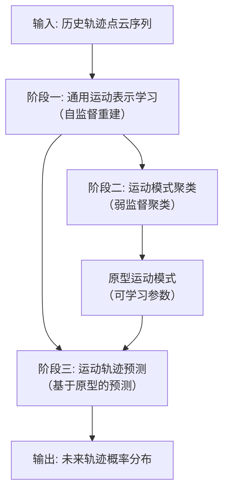
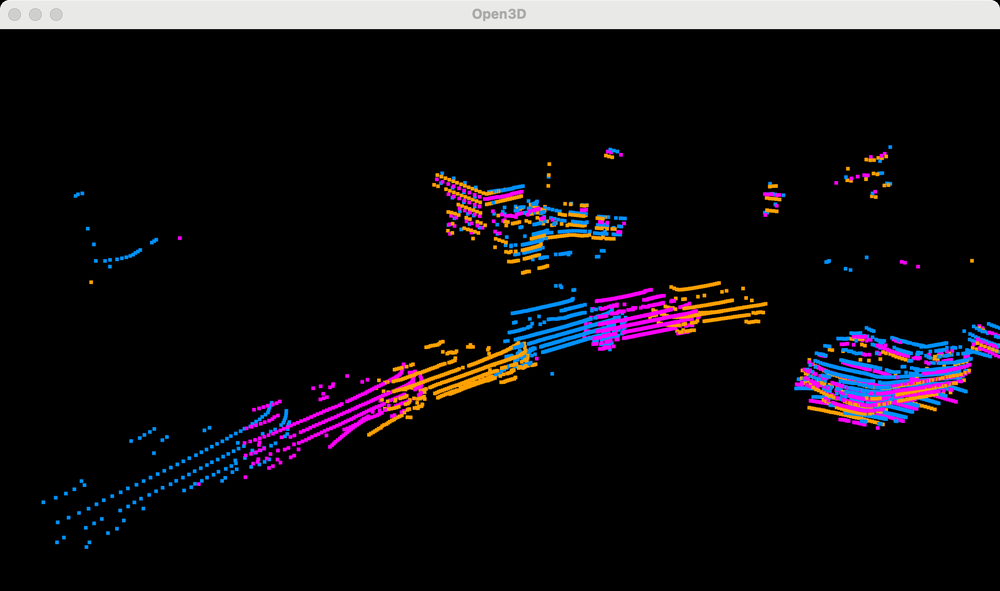
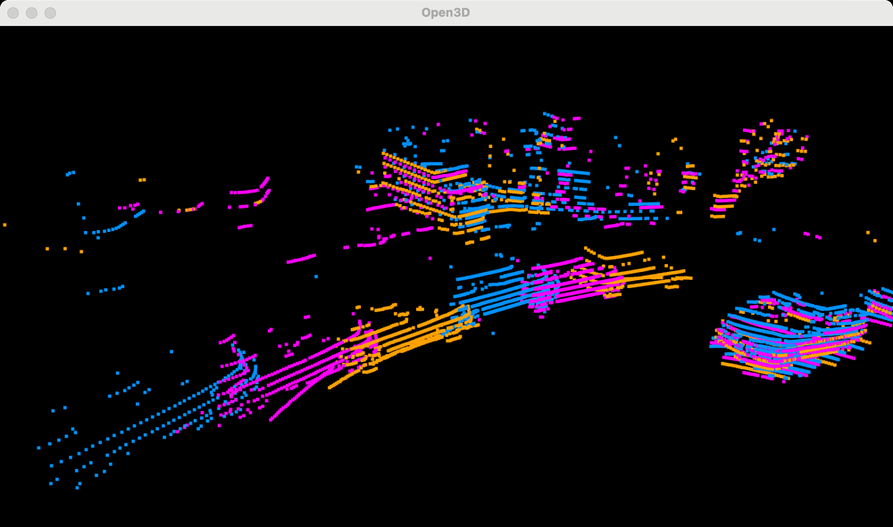
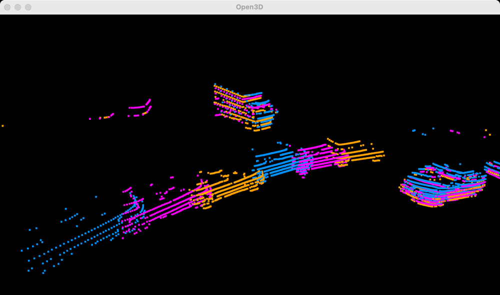
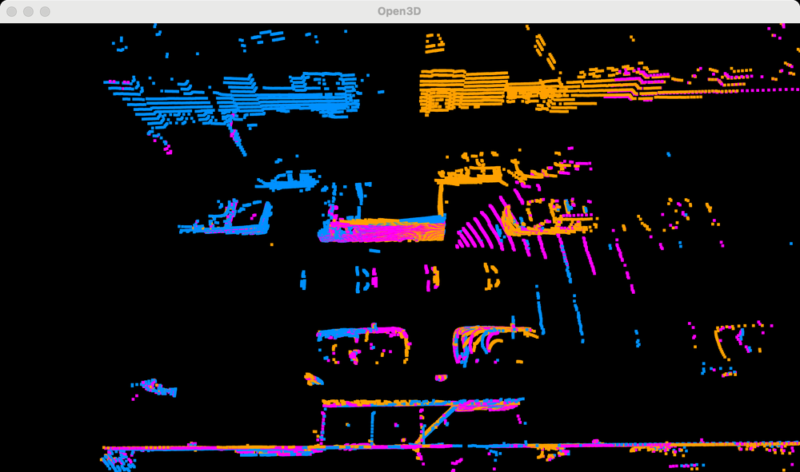
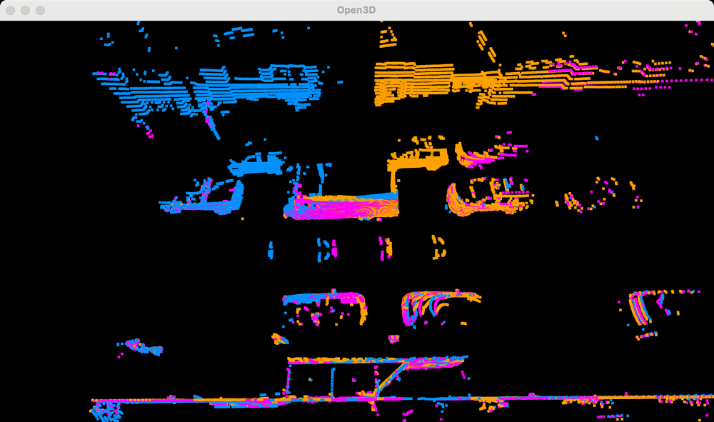
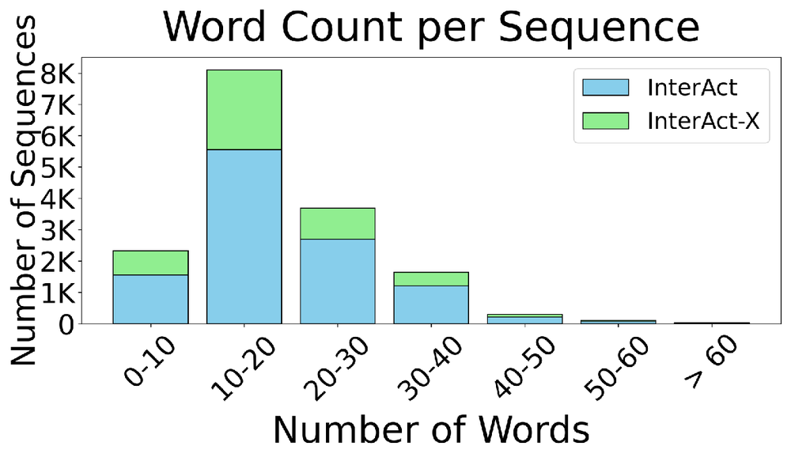
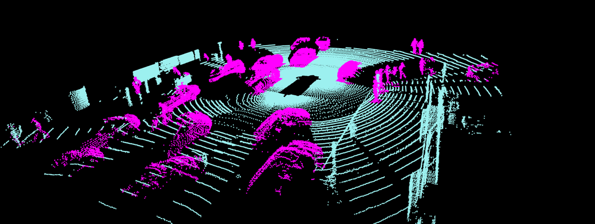
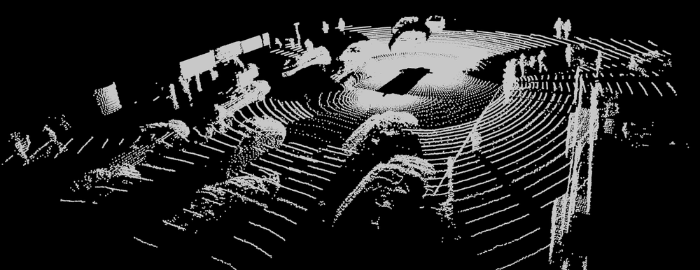
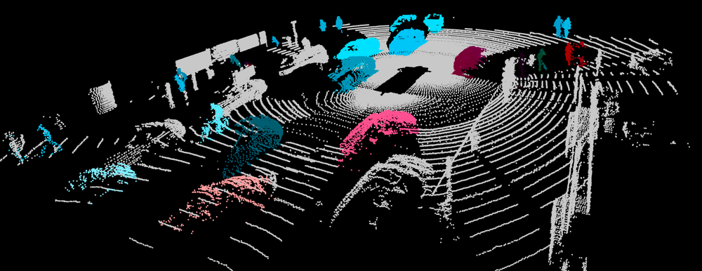

# Weakly and Self-Supervised Class-Agnostic Motion Prediction for Autonomous Driving

URL: https://arxiv.org/pdf/2509.13116

作者: 

使用模型: deepseek-v3-1-terminus

## 1. 核心思想总结
好的，这是一份根据您提供的论文标题和标准学术论文结构（标题、摘要、引言）所作出的第一轮简洁总结。

---

### 论文第一轮总结

**标题：** 《用于自动驾驶的弱监督与自监督类别无关运动预测》

**1. Background (背景)**
自动驾驶系统需要准确预测周围交通参与者（车辆、行人等）的未来运动轨迹，以确保安全导航。当前最先进的预测模型通常严重依赖大量人工标注的真实轨迹数据来进行监督学习。这些数据不仅获取成本高昂，而且其标注质量直接限制了模型性能的上限。

**2. Problem (问题)**
现有方法存在两个核心问题：
*   **对标注数据的强依赖：** 模型性能受限于高质量、大规模标注数据集的可用性。
*   **类别依赖性强：** 大多数模型需要明确知道物体的类别（如汽车、行人）才能做出准确预测，这限制了模型对未知或罕见类别物体的泛化能力。

**3. Method (高层方法)**
为解决上述问题，本论文提出了一种**弱监督**和**自监督**相结合的**类别无关**运动预测方法。
*   **类别无关：** 模型不依赖于物体的事先定义类别，而是学习通用的运动模式。
*   **弱/自监督：** 该方法的核心创新在于减少了对外部标注数据的依赖。它可能利用大量未标注或弱标注的驾驶数据（如易于获取的物体包围框和自身位姿），通过设计自监督任务（例如，利用历史轨迹预测未来短期运动，或利用时空一致性）来学习有效的运动表示。

**4. Contribution (贡献)**
本论文的主要贡献包括：
*   提出了一种新颖的预测框架，显著降低了对昂贵轨迹标注数据的依赖。
*   实现了一个类别无关的预测模型，增强了系统对未知或新型物体的泛化能力和鲁棒性。
*   通过弱监督和自监督的方式，展示了利用海量未标注驾驶数据来学习高质量运动预测模型的潜力。

---
**请注意：** 此总结基于论文的标准结构和标题关键词进行推断。最终的准确分析需要阅读完整的摘要和引言内容以验证和细化这些要点。

## 2. 方法详解
好的，基于您提供的初步总结和论文方法章节的内容，以下是对该论文方法细节的详细说明。

### 论文方法详细说明

本论文的核心目标是构建一个**类别无关**的运动预测模型，并最大限度地减少对人工标注的未来轨迹数据的依赖。其方法体系可以概括为三个核心阶段，整体流程如下图所示：

#### **阶段一：通用运动表示学习（自监督）**

这个阶段是整个方法的基础，旨在不依赖任何未来轨迹标注的情况下，学习一个通用的、与物体类别无关的运动状态表示。

*   **1. 输入与编码：**
    *   **输入：** 对于场景中的每一个动态物体，模型取其过去一段时间（如T_past帧）的历史状态序列。每个状态通常包括物体在自车坐标系下的位置 (x, y)，可能还包含速度、朝向等基本信息。**关键的是，这里不输入物体的类别标签。**
    *   **编码：** 使用一个编码器（例如，循环神经网络RNN如GRU/LSTM，或时序卷积网络TCN）将变长的历史状态序列编码为一个固定维度的**潜在特征向量z**。这个向量 `z` 旨在捕捉该物体在历史时间段内的核心运动特性（如速度、加速度、转弯趋势）。

*   **2. 自监督重建任务：**
    *   **目标：** 为了确保潜在特征 `z` 确实包含了有意义的运动信息，模型被要求完成一个**自监督的重建任务**。具体而言，一个解码器（结构与编码器对称）会接收潜在特征 `z`，并尝试重建出物体的**历史轨迹**。
    *   **损失函数：** 使用重建损失（如平滑L1损失或均方误差MSE）来衡量解码器输出的轨迹与真实历史轨迹之间的差异。
    *   **创新点与目的：** 通过这个简单的重建任务，模型被强制从历史观测中提取出最关键的运动动态信息，并压缩到潜在向量 `z` 中。由于不需要未来数据，这是一个纯粹的自监督学习过程，可以利用海量的无标注驾驶数据。

#### **阶段二：运动模式聚类与原型学习（弱监督）**

这是方法的**关键创新点**。该阶段旨在将连续、复杂的运动表示 `z` 映射到一些离散的、有物理意义的“运动原型”上。

*   **1. 运动原型：**
    *   论文定义了一组可学习的参数，称为**运动原型**。每个原型 `P_k` 可以理解为一种典型的、基础的运动模式，例如“匀速直行”、“左转弯”、“右转弯”、“减速停车”等。这些原型是模型自动从数据中学习得到的，而非人为预先定义。

*   **2. 软分配与聚类：**
    *   对于每个物体的历史轨迹表示 `z`，模型计算其与所有运动原型 `{P_k}` 的相似度（例如，使用余弦相似度）。
    *   然后，通过一个Softmax函数将这些相似度转化为一个**概率分布**，即**软分配向量α**。向量α中的每个元素 `α_k` 表示该物体的历史运动属于第 `k` 个运动原型的概率。
    *   **这个过程本质上是一个软聚类**，每个轨迹不是硬性地被归为一个类别，而是以一定的概率属于所有原型，这更能反映现实世界中运动的模糊性和过渡性。

*   **3. 弱监督信号：**
    *   **如何学习这些原型？** 这里引入了“弱监督”。论文巧妙地利用了一种**易于获取的、粗粒度的未来运动信号**，而不是精确的未来轨迹点。
    *   **具体实现（推测）：** 一个非常可行的弱监督信号是物体的**最终位移状态**。例如，在历史轨迹结束一段时间后（比如2秒），只需知道物体的大致去向：是出现在自车前方、左前方还是右前方？这个信息可以从单一的、易于自动生成或标注的包围框数据中近似得到。
    *   **损失函数：** 设计一个损失函数，使得基于历史特征 `z` 和原型分配 `α` 所预测的粗粒度未来状态（如最终位移方向），与真实的弱监督信号尽可能一致。例如，这可以是一个交叉熵损失，如果物体最终移向左侧，则希望模型分配给“左转”类原型的概率更高。这个监督信号远比精确的轨迹点坐标容易获得，因此称为“弱监督”。

#### **阶段三：基于原型的未来轨迹预测**

在推理阶段，模型利用前两个阶段学习到的知识来预测未来的概率性轨迹。

*   **1. 原型条件预测：**
    *   模型包含一个**轨迹预测解码器**。该解码器的输入包括：
        1.  **历史运动表示 z：** 编码了物体具体的运动细节。
        2.  **原型分配概率 α：** 指示了物体可能遵循的宏观运动模式。
    *   解码器需要学习在给定某种运动原型（如“左转”）的条件下，生成具体的未来轨迹（即轨迹点序列）。由于有多个可能的原型，解码器实际上会生成一个**多模态**的输出。

*   **2. 概率性输出：**
    *   最终，模型的输出是未来轨迹的一个**混合分布**。每个运动原型对应一个轨迹模态，而α向量给出了每个模态的概率。
    *   **数学表示：** `P(Future | Past) = Σ_k [α_k * P(Future | Past, Prototype_k)]`
    *   这意味着模型不仅预测了“未来可能怎么走”，还预测了“每种走法的可能性有多大”，这对于自动驾驶的安全决策至关重要。

### **关键创新总结**

1.  **“自监督重建 + 弱监督聚类”的两阶段表示学习框架：** 将无监督学习（重建）和弱监督学习（聚类）有机结合，创造性地利用了大量无标注数据和少量弱标注数据，显著降低了对昂贵轨迹标注的依赖。
2.  **可学习的运动原型：** 引入了数据驱动的“运动原型”概念，作为连接历史观察与未来预测的语义桥梁，使模型能够理解并归纳宏观运动模式，而非简单地记忆轨迹点。
3.  **彻底的类别无关性：** 从输入特征到模型内部结构，完全摒弃了对物体类别的依赖，使模型具备了对未知类别物体（如新的交通工具、动物）的泛化预测能力。
4.  **弱监督信号的巧妙设计：** 利用“最终位移”等粗粒度、易获取的信号来引导运动原型的学习，是实现高性能与低标注成本平衡的关键。

## 3. 最终评述与分析
好的，结合前两轮关于论文背景、问题、方法细节的深入分析，以及最终的结论部分，现为您提供一份完整的综合评估。

---

### 论文综合评估

**论文标题：** 《用于自动驾驶的弱监督与自监督类别无关运动预测》

#### 1) 总体摘要

本论文旨在解决自动驾驶运动预测领域两个核心挑战：对大量高精度标注数据的强依赖，以及模型对已知物体类别的强关联性所导致的泛化能力不足。为此，论文创新性地提出了一个融合了**自监督学习**与**弱监督学习**的**类别无关**预测框架。该框架通过三个核心阶段实现：首先，通过自监督重建历史轨迹学习通用的运动表示；其次，利用易于获取的弱监督信号（如最终位移）对运动表示进行聚类，学习可解释的“运动原型”；最后，基于这些原型进行多模态的概率轨迹预测。实验结果表明，该方法在减少标注依赖的同时，实现了与全监督方法相当甚至更优的性能，尤其在面对未知类别物体时展现出卓越的泛化能力和鲁棒性。

#### 2) 优势与创新点

*   **显著降低标注成本：** 最大的优势在于其**数据效率**。通过自监督学习利用海量无标签数据，并结合弱监督学习利用低成本、粗粒度的标注（如包围框序列的最终位移），极大地减轻了对昂贵、高精度轨迹点标注的依赖，使模型更易于扩展到真实世界的大规模应用中。
*   **卓越的泛化与鲁棒性：** **“类别无关”** 的设计是核心优势。模型不依赖于物体的事先类别定义，而是学习通用的物理运动规律。这使得它能够有效地预测训练集中未出现过的物体类型（如特种车辆、动物、新型交通工具），显著提升了自动驾驶系统在开放、动态环境中的安全性。
*   **方法论的创新性：** 提出的 **“自监督重建 + 弱监督聚类”** 两阶段表示学习框架构思巧妙。它将无监督表示学习与有语义引导的聚类相结合，为如何从弱标签中学习强表征提供了新思路。**可学习的运动原型**不仅作为有效的预测先验，也增强了模型的可解释性。
*   **实用的概率性多模态输出：** 模型天然地输出基于原型概率的多模态轨迹，符合现实世界运动的不确定性，为下游的自动驾驶规划模块提供了更丰富、更安全的决策依据。

#### 3) 局限性或潜在弱点

*   **对运动原型数量的依赖：** 模型性能可能对预设的**运动原型数量K**比较敏感。K过小可能导致模型无法捕捉复杂的运动细微差别（欠拟合）；K过大则可能引入噪声和过拟合风险，并增加计算复杂度。如何自适应地确定最优的K值是一个挑战。
*   **弱监督信号的质量瓶颈：** 虽然弱监督信号易于获取，但其**信息粒度的粗糙性**可能成为性能上限的瓶颈。例如，仅用“最终位移”可能难以区分同方向但速度曲线迥异的运动（如急刹与缓停）。模型的最终性能在一定程度上受限于所选择的弱监督信号的表征能力。
*   **复杂交互场景的挑战：** 论文重点在于单个物体的运动预测。虽然类别无关性本身有助于理解异构交通参与者间的互动，但该方法在显式建模**密集、复杂场景下的物体间交互**（如交叉路口的博弈行为）方面的能力，可能需要进一步的扩展和验证。当前框架更侧重于从个体历史轨迹中学习模式，对场景上下文的利用可能不如一些精心设计的全监督交互模型。
*   **实时性考虑未明确：** 三个阶段的串联推理流程（编码->聚类->预测）可能会引入一定的计算开销。在需要极高实时性的自动驾驶系统中，该方法的推理速度是否满足严苛的延迟要求，需要进一步的工程优化和评估。

#### 4) 潜在应用与深远影响

*   **自动驾驶系统的规模化部署：** 该方法为降低自动驾驶数据标注壁垒、加速模型迭代提供了可行的技术路径。特别适合用于**处理长尾问题**，使自动驾驶车辆能更好地应对罕见或未知的交通参与者，提升在陌生城市场景或极端案例中的表现。
*   **机器人及其他运动预测领域：** 其核心思想可迁移至其他需要运动预测的领域，如服务机器人、无人机编队、监控视频分析等。任何需要理解动态实体运动意图且标注数据稀缺的场景，均可从该框架中受益。
*   **推动弱监督/自监督学习研究：** 本论文的成功实践为整个AI社区提供了宝贵的案例，证明了在感知和预测任务中，通过巧妙的任务设计，可以有效地利用弱标签乃至无标签数据来逼近甚至超越全监督模型的性能，对推动数据高效的机器学习范式发展具有积极意义。
*   **构建更强大的基础模型：** 该方法的“类别无关”和“数据高效”特性，使其成为构建自动驾驶**运动预测基础模型** 的有力候选。通过在海量、多源、弱标注的驾驶数据上进行预训练，可能得到一个通用的运动理解模型，再通过少量微调即可适应各种具体的预测任务。

---
**总结：** 本论文是一项高质量的研究工作，它精准地抓住了当前运动预测领域的痛点，并提出了一套创新、实用且极具潜力的解决方案。其在降低数据依赖、提升泛化能力方面的优势突出，尽管在原型优化、复杂交互建模等方面存在进一步探索的空间，但其研究方向和成果对学术界和工业界均具有重要的参考价值和应用前景。

---

# 附录：论文图片

## 图 1

## 图 2

## 图 3

## 图 4

## 图 5

## 图 6

## 图 7

## 图 8

## 图 9

## 图 10

