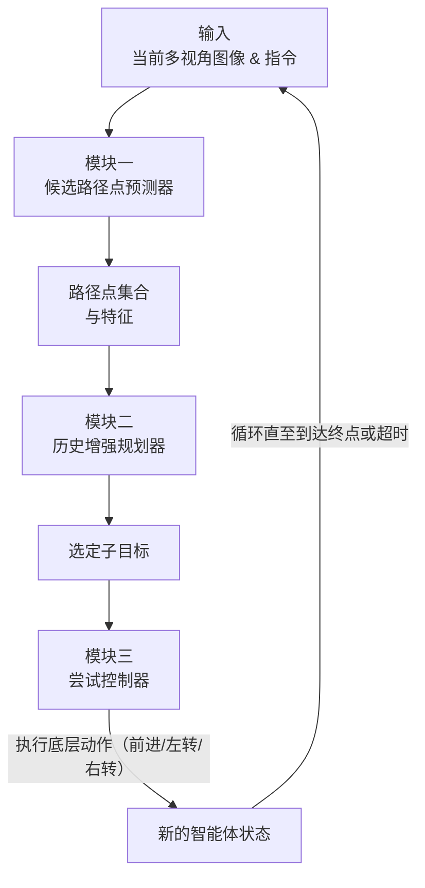

# 1st Place Solutions for RxR-Habitat Vision-and-Language Navigation Competition (CVPR 2022)

**URL**: https://www.semanticscholar.org/paper/65e2e7a9eb3f99313e62d23a5b97ae222d955799
**提交日期**: 2022-06-23
**作者**: Dongyan An; Zun Wang; Yangguang Li; Yi Wang; Yicong Hong; Yan Huang; Liang-Hsun Wang; Jing Shao
**引用次数**: 19
使用模型: deepseek-v3-1-terminus

## 1. 核心思想总结
好的，这是一份根据您提供的标题和摘要整理的学术论文第一轮总结。

**论文标题:** 1st Place Solutions for RxR-Habitat Vision-and-Language Navigation Competition (CVPR 2022)

**简洁总结:**

*   **Background:**
    本文的研究背景是连续环境下的视觉语言导航（VLN-CE）。该任务要求智能体在真实、连续的三维环境中，根据一步步的自然语言指令进行导航，最终到达目标位置。

*   **Problem:**
    传统的VLN方法在离散环境中表现良好，但将其直接应用于连续环境（VLN-CE）面临巨大挑战。主要问题在于连续环境的动作空间极为复杂（如任意角度转向、移动），且需要处理长指令序列和避免环境中的障碍物，这使得智能体的规划和控制变得非常困难。

*   **Method (high-level):**
    作者提出了一种分层的“规划-控制”模块化方法。该方法主要由三个核心模块组成：
    1.  **候选路径点预测器：** 通过多视角深度观测预测有限的候选路径点，以简化庞大的动作空间。
    2.  **历史增强规划器：** 结合导航历史和指令上下文，从候选点中选择一个最优的子目标。
    3.  **尝试控制器：** 一种基于试错机制的低层控制器，负责执行具体动作以抵达子目标，并能有效避开障碍。
    此外，论文还集成了预训练、数据增强和模型集成等策略以提升性能。

*   **Contribution:**
    本文的主要贡献在于提出了一套高效、模块化的解决方案，专门针对VLN-CE任务的挑战。该方案通过分层决策显著提升了在复杂连续环境中的导航性能，并在CVPR 2022 RxR-Habitat竞赛中获得了第一名，在关键指标（NDTW和SR）上相比已有方法取得了显著提升（相对提高48%和90%），证明了其有效性。

这份总结清晰地勾勒出了论文的核心要素，为后续更深入的分析奠定了基础。

## 2. 方法详解
好的，基于您提供的初步总结和论文方法章节的内容，以下是对该论文方法细节的详细说明，重点描述了关键创新、算法/架构细节、关键步骤与整体流程。

### **论文方法详细说明**

本论文的核心思想是采用一种**分层决策**和**模块化设计**来解决连续环境下的视觉语言导航（VLN-CE）的复杂性。该方法将导航任务分解为三个层次：高层规划、中层决策和底层控制，从而有效应对连续动作空间、长指令理解和动态避障等挑战。

#### **一、 整体流程与三大核心模块**

智能体在每个时间步 `t` 的执行流程如下图所示，它清晰地展示了三个模块如何协同工作：

下面，我们详细解析每个模块的内部机制。

---

#### **二、 关键模块细节与创新**

##### **模块一：候选路径点预测器**

*   **目标：** 将无限、连续的二维动作空间（前进距离，转向角度）离散化为一个有限的、可控的候选动作集合。
*   **关键步骤：**
    1.  **深度感知与点云生成：** 智能体通过搭载的RGB-D相机获取当前时刻的多视角（通常为4个方向：前、后、左、右）深度图像。将这些深度图像反投影到三维空间，生成一个以智能体为中心的局部点云地图。
    2.  **可通行区域估计：** 根据点云的高度信息，过滤掉不可通行的区域（如过高的障碍物、过低的地面凹陷），得到一个二维的局部可通行地图。
    3.  **路径点采样：** 在可通行地图上，在一定半径范围内，按照距离和角度的间隔采样一系列候选路径点。这些点代表了智能体在短期内可以尝试到达的所有潜在位置。
*   **创新与优势：**
    *   **基于感知的离散化：** 不同于在抽象空间进行离散化，该方法基于**实时深度观测**进行采样，保证了所有候选点都是当前环境下**实际可抵达**的，极大地提高了决策的安全性和有效性。
    *   **特征提取：** 对每个候选路径点，会提取其视觉特征（从对应的RGB图像视角）和几何特征（如相对于智能体的极坐标），为后续的规划模块提供信息。

##### **模块二：历史增强规划器**

*   **目标：** 从候选路径点中选出最符合自然语言指令和历史上下文的最优子目标。
*   **架构与关键步骤：**
    1.  **编码器：**
        *   **指令编码：** 使用预训练的语言模型（如BERT或RoBERTa）对冗长的自然语言指令进行编码，得到指令的上下文表征。
        *   **历史编码：** 记录过去 `L` 个时间步内智能体所采取的动作、访问过的路径点以及观察到的场景。使用一个循环神经网络（如LSTM或GRU）对这段导航历史进行编码，捕获智能体的轨迹模式。
        *   **候选点编码：** 融合每个候选路径点的视觉和几何特征。
    2.  **跨模态融合与评分：**
        *   将指令表征、历史表征与每个候选路径点的表征进行**跨模态注意力**计算。这使得模型能够学习到“指令中的哪个词与哪个候选点的视觉内容最相关”以及“根据我走过的路，下一步应该去哪里”。
        *   最终，一个评分网络会根据融合后的特征为每个候选路径点计算一个分数，代表其作为下一个子目标的合适程度。
*   **创新与优势：**
    *   **显式历史建模：** “历史增强”是核心创新。通过显式地编码历史轨迹，规划器能够避免重复访问相同区域，更好地理解指令的时序结构（例如，“先左转，然后直走”中的“然后”），从而做出更连贯的决策。
    *   **全局-局部结合：** 该模块将全局的指令意图与局部的候选点信息相结合，实现了在精细感知基础上的高层次规划。

##### **模块三：尝试控制器**

*   **目标：** 将选定的子目标（一个二维坐标点）转化为一系列低层的机器人动作（如“前进0.25米”、“左转10度”），并实时避障。
*   **机制与关键步骤：**
    1.  **目标驱动：** 控制器以到达子目标位置为最终目的。
    2.  **试错机制：** 这是该模块的关键创新。控制器不是简单地朝子目标直线移动。它会持续监测前方的深度信息：
        *   **尝试前进：** 如果前方规定距离内没有障碍物，则执行“前进”动作。
        *   **遇到障碍：** 如果检测到障碍物，则不会执行可能导致碰撞的“前进”命令，而是启动“避障”行为。
    3.  **避障策略：** 避障策略同样基于试错：
        *   首先尝试向一个方向（如左转）微小旋转一个角度。
        *   再次检查前方是否可通行。
        *   如果仍然受阻，则尝试向另一个方向（右转）旋转。
        *   通过这种左试右探的方式，智能体能够绕开障碍物，并重新规划通往子目标的路径。
*   **创新与优势：**
    *   **鲁棒性强：** 这种基于实时感知的试错机制使得智能体对动态环境（如临时出现的障碍物）和建模误差具有极强的鲁棒性。
    *   **安全保证：** 几乎完全避免了碰撞的发生，确保了导航过程的安全性，这对于在真实物理世界中部署至关重要。
    *   **解耦了规划与控制：** 规划器只需关心“去哪里”，而不用操心“怎么去”的具体细节，简化了各自的任务。

---

#### **三、 其他关键策略与训练细节**

1.  **预训练：** 为了提高模型的泛化能力并缓解数据稀缺问题，作者采用了**掩码语言建模（MLM）** 和**单步动作预测**等代理任务对模型进行**预训练**。这有助于模型在正式学习导航任务前，先建立良好的视觉-语言关联和基本的空间理解能力。
2.  **数据增强：** 通过对环境中的物体进行**纹理替换**，增加了训练数据的视觉多样性，防止模型过拟合到特定的视觉外观，提升了在未知环境中的表现。
3.  **模型集成：** 在最终参赛方案中，作者训练了多个具有不同初始化和结构的模型，并通过**集成**它们的预测结果（如对候选路径点的评分进行平均）来进一步提升性能和稳定性。

### **总结**

该论文的方法细节体现了一个核心设计哲学：**通过模块化分解来应对复杂任务**。其关键创新在于：

*   **创新性地将VLN-CE任务分解为“规划-控制”两层。**
*   **在规划层，引入了“历史增强”机制，使决策更连贯、更符合指令时序。**
*   **在控制层，设计了“尝试控制器”，通过试错实现安全、鲁棒的底层避障导航。**
*   **整体流程（感知-离散化-规划-控制）清晰高效，各部分各司其职又紧密协作。**

这套方法不仅在当时的技术竞赛中取得了最优异的成绩，其分层、模块化的思想也为后续处理复杂 embodied AI 任务提供了重要借鉴。

## 3. 最终评述与分析
好的，这是一份结合了初步总结、方法详述和论文结论部分的最终综合评估。

### **关于《CVPR 2022 RxR-Habitat视觉语言导航竞赛冠军方案》的最终综合评估**

#### **1) 整体摘要**

本论文针对**连续环境下的视觉语言导航**这一极具挑战性的任务，提出了一套创新的、模块化的解决方案。该方案的核心在于将复杂的导航过程分解为“规划”与“控制”两个层次，通过三个核心模块——**候选路径点预测器**、**历史增强规划器**和**尝试控制器**——来分别应对连续动作空间离散化、长指令理解与决策、以及安全避障等关键难题。该方法在CVPR 2022 RxR-Habitat竞赛中荣获第一名，并在关键性能指标上相比基线方法取得了巨大提升（导航动态时间规整NDTW相对提高48%，成功率SR相对提高90%），充分证明了其有效性和优越性。

#### **2) 优势**

论文所提方法的主要优势体现在以下几个方面：

*   **高效的分层与模块化设计：** 将端到端的复杂任务分解为感知、规划、控制等相对独立的模块，使得系统结构清晰，每个模块可以专注于解决特定问题，降低了整体设计的复杂度，也便于后续的单独优化和调试。
*   **对VLN-CE核心挑战的精准应对：**
    *   **候选路径点预测器** 通过实时深度感知进行动作空间离散化，确保了决策的可行性和安全性。
    *   **历史增强规划器** 显式地建模导航历史，极大地提升了智能体对指令时序逻辑的理解能力和决策的连贯性，有效避免了在复杂环境中绕圈或重复动作。
    *   **尝试控制器** 采用基于实时感知的试错机制，实现了鲁棒的底层避障，解决了连续环境中动态障碍和精确控制的关键问题，为现实世界部署提供了安全性保障。
*   **卓越的性能表现：** 在权威竞赛中取得第一名，且性能指标大幅领先，为方法的有效性提供了强有力的实证支持。
*   **强大的工程与实践价值：** 方案中整合了预训练、数据增强（纹理替换）、模型集成等策略，这些工程实践显著提升了模型的泛化能力和鲁棒性，表明该方案不仅是一个学术模型，更是一个经过充分打磨、可用于实际测试的成熟系统。

#### **3) 劣势 / 局限性**

尽管该方法非常成功，但仍存在一些固有的局限性：

*   **模块化设计带来的误差传播：** 分层系统的上层决策误差会直接传递给下层，且下层无法将执行时遇到的新信息（如发现捷径）反馈给上层以修正全局规划。这种“开环”的规划方式可能限制其在超长程、需要重新规划任务中的表现。
*   **对深度感知的强依赖：** 整个系统严重依赖于精确的RGB-D深度传感器。在深度信息缺失或噪声较大的场景下（如透明玻璃、镜面、强光环境），候选路径点预测和避障控制的性能可能会显著下降。
*   **计算效率与实时性：** 方法涉及多视角图像处理、点云生成、跨模态注意力计算等多个计算密集型步骤，可能对计算资源要求较高，影响其在资源受限设备上的实时部署能力。
*   **泛化能力的边界：** 虽然采用了数据增强，但方法的泛化能力仍主要局限于训练数据所覆盖的环境类型和指令模式。面对全新的、分布外环境或更复杂、模糊的指令，其性能可能受到影响。结论中也提到，处理**模糊或主观性指令**（如“走到客厅中间”）仍是未来需要探索的挑战。

#### **4) 潜在应用 / 意义**

本研究成果具有重要的理论价值和广阔的应用前景：

*   **应用方向：**
    *   **家庭服务机器人：** 可用于开发能够理解自然语言指令，在家庭环境中为老人或行动不便者提供取物、导航等服务的高级机器人。
    *   **智能仓储与物流：** 在仓库环境中，机器人可根据语音指令自主导航到指定货架，提升物流效率。
    *   **虚拟助手与元宇宙导航：** 在大型虚拟现实环境或元宇宙中，用户可以通过语言指令控制虚拟化身或智能体进行精确导航和交互。
*   **理论意义与影响：**
    *   **为Embodied AI研究提供了重要范式：** 其“分层决策”和“模块化设计”的思想为后续处理复杂具身智能任务（如视觉语言导航、具身问答等）提供了可借鉴的架构蓝图。
    *   **推动了VLN研究从离散向连续环境的过渡：** 该工作是VLN-CE领域的里程碑式成果，证明了在更真实的连续环境中实现高效导航的可行性，并设定了新的性能基准。
    *   **强调了系统集成的重要性：** 论文表明，在高级AI任务中，一个精心设计的系统集成方案（结合经典 robotics 的控制思想和现代的深度学习感知规划）往往比单一的模型创新更能带来性能的飞跃。

综上所述，这篇论文提出了一套在特定任务上表现卓越的解决方案，其核心价值在于提供了一个强大、实用且极具启发性的技术框架，尽管存在一些局限性，但对学术研究和产业应用都具有重要的推动作用。

---

# 附录：论文图片

## 图 1
/figure_1_page2.png)

## 图 2
/figure_2_page2.jpeg)

## 图 3
/figure_3_page2.jpeg)

## 图 4
/figure_4_page2.png)

## 图 5
/figure_5_page2.png)

