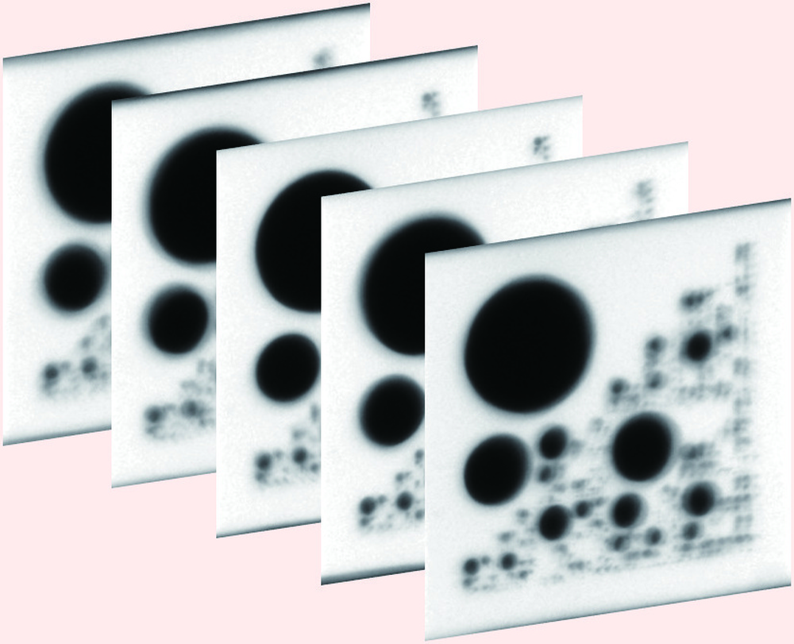
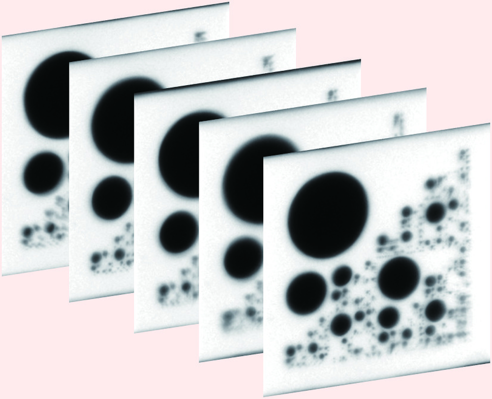
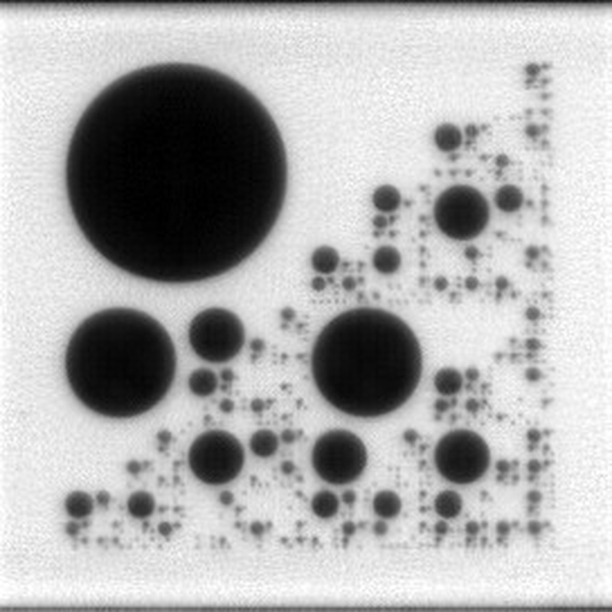
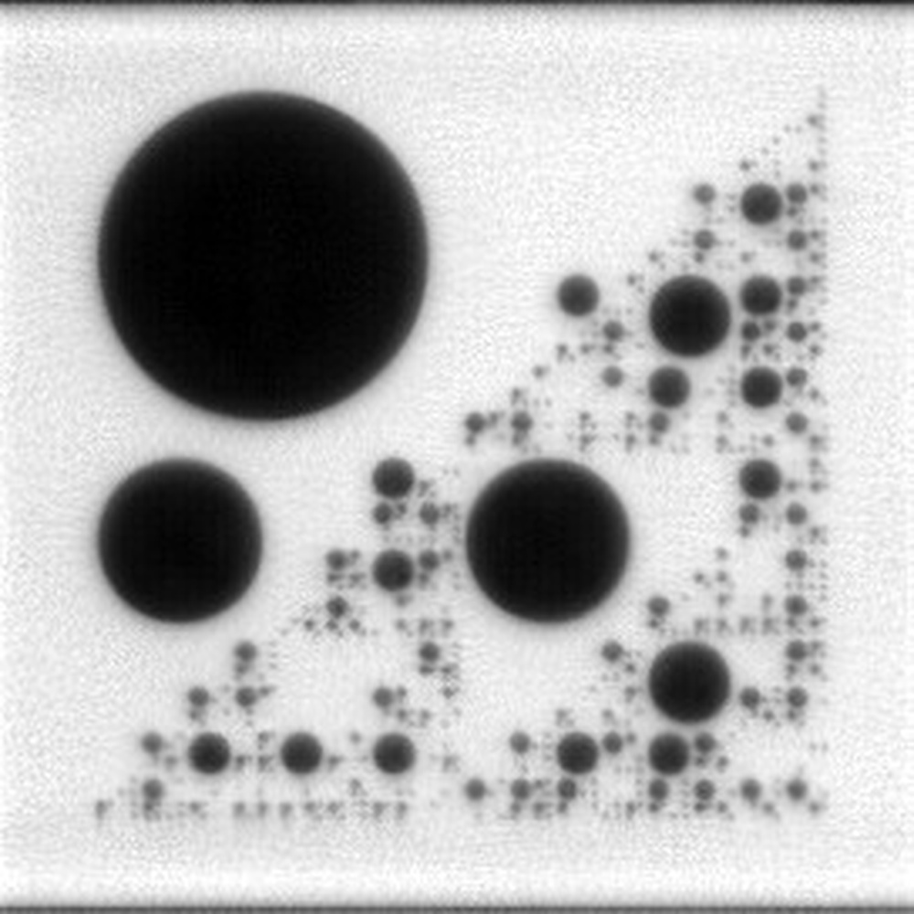
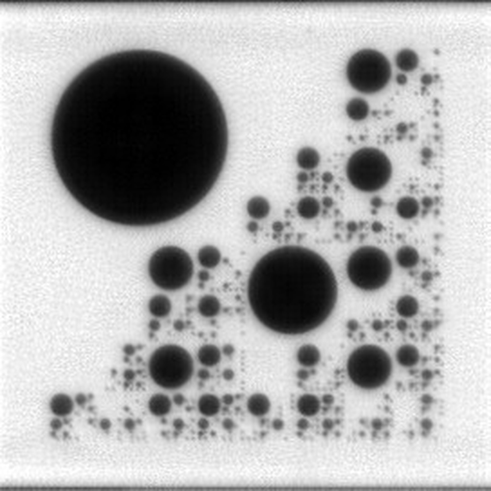
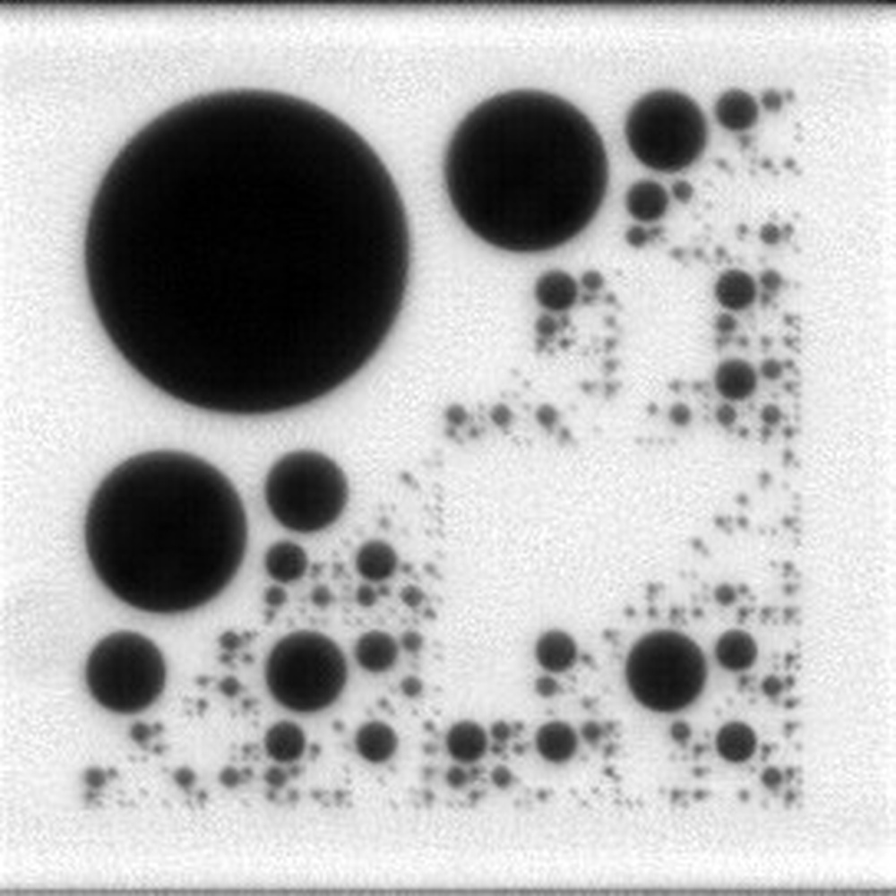
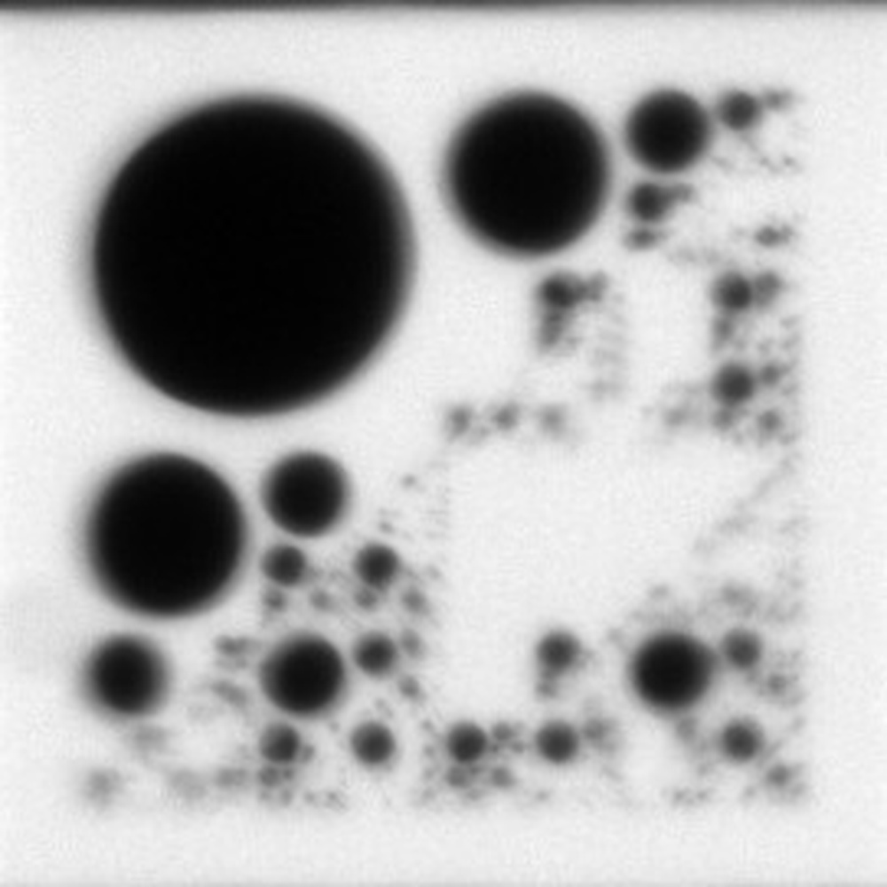
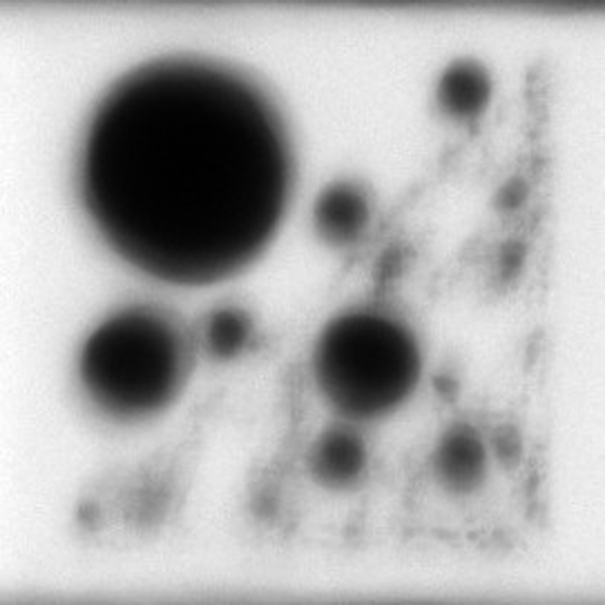

# 1st Solution Places for CVPR 2023 UG2+ Challenge Track 2.2-Coded Target Restoration through Atmospheric Turbulence

**URL**: https://www.semanticscholar.org/paper/dd1e0076c938aec9c5776bd6e7d76667a0147883
**提交日期**: 2023-06-15
**作者**: Shengqi Xu; Shuning Cao; Haoyue Liu; Xu Xiao; Yi Chang; Luxin Yan
**引用次数**: 0
使用模型: deepseek-v3-1-terminus

## 1. 核心思想总结
这是一份针对该技术报告的简洁第一轮总结，按四个部分组织：

**Background (背景)**
该研究旨在解决大气湍流对图像造成的畸变问题，特别是在CVPR 2023 UG2+挑战赛的特定背景下。大气湍流会导致观测到的图像序列产生严重的几何畸变和模糊，给后续的目标识别与分析带来巨大困难。

**Problem (问题)**
核心问题是如何从一系列因大气湍流而严重扭曲和模糊的图像帧中，恢复出一幅高质量、清晰的静态图像。这是一个典型的图像复原与增强任务，需要同时处理几何失真和光学模糊。

**Method (高层次方法)**
作者提出了一个高效的多阶段处理框架：
1.  **图像配准**：首先对扭曲的帧进行对齐，以抑制几何畸变。
2.  **帧选择与平均**：基于图像清晰度筛选出最清晰的一组已配准帧，并进行平均，得到一个基本无几何失真但整体模糊的图像。
3.  **基于学习的去模糊**：使用深度学习模型去除平均图像中的残余模糊。
4.  **后处理**：应用后处理技术进一步优化最终输出图像的质量。

**Contribution (贡献)**
本方案的主要贡献在于提出了一个鲁棒且高效的多阶段框架，该框架成功融合了传统的图像处理技术（配准、筛选、平均）与基于学习的高级复原方法（去模糊），从而能够有效处理不同类型的大气湍流畸变。该方案在CVPR 2023 UG2+挑战赛的最终测试中表现优异，获得了第一名的成绩。

## 2. 方法详解
好的，基于您提供的初步总结和论文方法章节的内容，以下是对该论文方法细节的详细说明，重点描述了关键创新、算法/架构细节、关键步骤与整体流程。

### **论文方法详细说明**

该论文的核心是解决大气湍流导致的复杂图像退化问题。其方法是一个精心设计的、**多阶段串联的混合框架**，巧妙地将**传统图像处理技术的鲁棒性**与**数据驱动深度学习模型的强大复原能力**相结合。

#### **一、 整体流程概述**

该方法的整体流程可以清晰地划分为四个顺序执行的阶段，如下图所示（此处为文字描述）：

`输入湍流序列` → **1. 几何畸变校正（配准与平均）** → `中间清晰但模糊图像` → **2. 模糊消除（深度学习去模糊）** → `初步复原图像` → **3. 质量增强（后处理）** → `最终高质量输出图像`

这个流程的关键在于，它将一个极其困难的**联合优化问题**（同时解决几何畸变和光学模糊）分解为两个相对更容易解决的**子问题**：
1.  **首先解决几何畸变**：使用传统方法稳定、高效地对齐图像序列，消除帧间抖动和形变。
2.  **再解决光学模糊**：在获得一张几何稳定的图像后，使用深度学习模型专门负责去模糊，提升清晰度。

这种分解策略是该方法的**关键创新之一**，它避免了直接端到端学习复杂湍流效应的困难，提高了方案的可行性和鲁棒性。

---

#### **二、 关键步骤与算法/架构细节**

##### **阶段一：几何畸变校正（多帧配准与平均）**

此阶段的目标是从剧烈晃动的输入序列中，产生一张**无几何畸变但整体模糊**的“清晰模板”图像。

*   **1. 关键帧选择与参考帧确定**
    *   **步骤**：首先从输入序列中选取质量相对较高的一个子集。论文中提到使用**清晰度评估函数**（例如，基于图像梯度的能量函数）对每一帧进行打分，选择得分最高的前 `K` 帧（如50帧）作为后续处理的**关键帧**。
    *   **创新/细节**：从这 `K` 帧关键帧中，选择**清晰度最高的一帧**作为**参考帧**。所有其他帧都将向该参考帧对齐。这确保了配准的基准是序列中质量最好的图像，为后续步骤奠定了良好基础。

*   **2. 鲁棒的多帧配准**
    *   **算法**：采用基于**特征点**的配准方法。
        1.  **特征提取**：使用诸如 **SIFT** 或 **SuperPoint** 等特征检测器，在参考帧和每一帧待配准帧上提取关键点和对应的特征描述符。
        2.  **特征匹配**：对每一对图像（参考帧 vs. 当前帧），进行特征描述符的匹配，找到对应的特征点对。
        3.  **变换模型估计**：使用**鲁棒估计算法（如 RANSAC 或 MAGSAC**）来拟合一个几何变换模型（通常是**单应性矩阵 Homography**），该模型能够描述当前帧到参考帧的全局几何畸变。RANSAC 的作用是剔除错误的匹配点（外点），确保估计出的变换矩阵不受噪声干扰，这是保证配准精度的**关键细节**。
    *   **创新/细节**：与传统方法不同，该方法强调**鲁棒性**。通过RANSAC等机制，它能有效处理由于湍流造成的局部非刚性形变和匹配错误，确保估计出的全局变换是准确的。

*   **3. 帧平均与模板生成**
    *   **步骤**：将所有配准后的关键帧，根据估计出的单应性矩阵进行**重采样和变换**，使其与参考帧对齐。然后，对这些对齐后的帧进行**像素级平均**（通常是简单平均），生成一张融合图像。
    *   **效果**：平均操作能有效**抑制随机噪声**，并通过对多帧信息的融合，**抵消大部分由湍流引起的几何畸变**。最终得到的是一张背景稳定、物体轮廓清晰，但整体比较模糊的“清晰模板”图像。

##### **阶段二：基于学习的去模糊**

此阶段的目标是去除第一阶段输出图像中的残余模糊，恢复出细节丰富的清晰图像。

*   **模型选择与核心架构**
    *   **主干网络**：论文采用了 **NAFNet** 作为去模糊模型的核心架构。
    *   **关键创新/细节**：
        *   **NAFNet 的优势**：NAFNet 是一种高效的图像复原网络，其核心思想是简化传统的注意力机制。它用**简单的门控机制（Gating Mechanism）** 和 **Channel Attention** 的替代方案（如使用 **LayerNorm** 和 **1x1 卷积**）来捕获特征之间的关系，在保持高性能的同时，大幅减少了计算复杂度和参数量。
        *   **为什么选择 NAFNet**：该方案看重其**“简洁即最好”** 的设计哲学。对于竞赛场景，一个快速、轻量且性能强大的模型至关重要。NAFNet 避免了像 Transformer 那样复杂的自注意力计算，使得训练和推理更高效。

*   **训练策略与数据**
    *   **数据**：为了训练去模糊模型，需要使用成对的模糊-清晰图像数据。论文可能利用了竞赛组织方提供的数据集，或自建的合成湍流数据集。
    *   **损失函数**：通常结合多种损失函数来优化模型，例如：
        *   **L1 损失**：保证像素级的重建精度。
        *   **多尺度结构相似性损失**：保证复原图像在结构上和清晰图像保持一致。
        *   **感知损失/对抗损失（可能使用）**：进一步提升图像的视觉真实感。

##### **阶段三：后处理**

此阶段是对深度学习模型输出的进一步微调，以提升整体视觉质量。

*   **关键技术**
    *   **对比度受限的自适应直方图均衡化（CLAHE）**：
        *   **作用**：用于**增强图像的局部对比度**。特别是在去模糊后，图像可能仍存在局部对比度不足的问题。CLAHE 可以有效地拉大灰度差异，使细节更突出，同时又避免了普通直方图均衡化可能带来的过度增强和噪声放大问题。
    *   **锐化滤波（如非锐化掩模 USM）**：
        *   **作用**：施加轻微的锐化效果，**进一步强化边缘和纹理**，使图像看起来更加清晰、锐利。这一步需要谨慎调整参数，避免引入光晕伪影。

---

### **总结：核心创新与优势**

1.  **分而治之的混合框架**：最大的创新在于将问题分解为“先校正几何，再去除模糊”的串联流程。这比端到端的单一模型更稳定、更易实现，且效果显著。
2.  **鲁棒的传统预处理流程**：在配准阶段，通过**清晰度筛选、鲁棒特征匹配（RANSAC）和多帧平均**，构建了一个非常稳固的几何校正基础，为后续深度学习模型提供了高质量的输入。
3.  **高效先进的深度学习组件**：选用 **NAFNet** 作为去模糊引擎，体现了对模型效率与性能的平衡，确保了方案在竞赛环境下的快速迭代和高效推理。
4.  **精细化的后处理**：简单的 **CLAHE 和锐化** 操作，以极低的计算成本进一步提升了最终结果的视觉质量，是画龙点睛之笔。

该方案的成功证明，在面对复杂、复合型的图像退化问题时，一个精心设计的、融合了传统智慧和现代深度学习优势的混合策略，往往能比纯粹的端到端深度学习模型表现出更强的鲁棒性和实用性。

## 3. 最终评述与分析
好的，结合前两轮返回的信息（初步总结与方法详述）与论文的结论部分，以下是针对该大气湍流图像复原技术的最终综合评估：

### **最终综合评估**

#### 1) 总体摘要 (Overall Summary)
本论文提出并实现了一个高效、鲁棒的多阶段混合框架，专门用于解决由大气湍流引起的复杂图像退化问题。该框架的核心思想是“分而治之”，将极具挑战性的**几何畸变与光学模糊的联合复原问题**，分解为**先校正几何、再去除模糊**的两个相对独立的子问题。方案首先利用传统的图像处理技术（基于清晰度筛选的鲁棒配准与多帧平均）生成一张几何稳定但整体模糊的“清晰模板”，然后采用先进的轻量级深度学习网络（NAFNet）进行去模糊，最后辅以细致的后处理（如CLAHE）进一步提升视觉质量。该方案在CVPR 2023 UG2+挑战赛的最终测试中荣获第一名，充分证明了其有效性和优越性。

#### 2) 优势 (Strengths)
*   **高鲁棒性与实用性**：该方案最大的优势在于其鲁棒性。通过将传统方法与深度学习相结合，它避免了纯粹端到端深度学习模型在面对复杂、不可预测的湍流畸变时可能出现的训练不稳定或泛化能力差的问题。传统配准流程为整个系统提供了一个稳定可靠的基础。
*   **创新性的问题分解策略**：“先几何校正，后去模糊”的串联流程是方案成功的关键。这种分解策略简化了问题的复杂度，使得每个阶段都能专注于解决一个特定类型的退化，提高了方法的可行性和效果。
*   **高效性与性能平衡**：在深度学习组件的选择上，采用了高效简洁的NAFNet，而非计算量巨大的模型。这体现了对计算效率和复原性能的良好平衡，使方案更适合实际应用场景。
*   **优异的竞赛成绩**：在权威的CVPR UG2+挑战赛中获得第一名，为该方案的有效性提供了强有力的客观证据，表明其性能在当时达到了领先水平。
*   **流程清晰，可解释性强**：与“黑箱”式的端到端模型相比，该多阶段框架的每个步骤都有明确的物理意义和功能，便于研究者理解和进一步优化。

#### 3) 弱点与局限性 (Weaknesses / Limitations)
*   **对序列帧数量的依赖**：该方法的核心第一阶段严重依赖于输入图像序列的多帧信息。如果可用的清晰帧数量不足，或者序列中存在大量质量极低的帧，可能会影响配准和平均的效果，进而限制最终复原质量。
*   **假设全局几何变换的局限性**：配准阶段使用单应性矩阵（Homography）建模湍流畸变，这假设了图像间的畸变是全局的、仿射的。然而，强烈的大气湍流可能包含**局部、非刚性的形变**，此时全局变换模型可能无法完全校正所有畸变，导致残余的几何误差。
*   **深度学习模型的泛化能力**：去模糊模块NAFNet的性能依赖于其训练数据。如果遇到与训练数据分布差异极大的新型湍流或场景，其去模糊效果可能会下降。模型的泛化能力是需要持续关注的问题。
*   **后处理参数的主观性**：对比度增强和锐化等后处理步骤的参数需要人工调整，可能存在一定的主观性，不同的参数设置可能会对最终视觉效果产生影响，需要谨慎优化。

#### 4) 潜在应用与意义 (Potential Applications / Implications)
*   **军事与安防**：提升通过长距离大气通道（如海上、沙漠、边境）进行观测的成像质量，用于增强目标侦查、监视和识别的能力。
*   **天文观测**：帮助校正地基望远镜因大气抖动（视宁度）造成的星体图像模糊，获得更清晰的天体照片。
*   **交通监控与遥感**：改善城市中因热浪湍流或远距离监控造成的车牌、人脸识别困难，以及提升航空遥感图像的质量。
*   **方法论启示**：该方案的成功为处理其他类型的复合图像退化问题（如透过散射介质成像、水下成像）提供了重要的方法论启示。它证明了**混合式框架**——即结合传统物理模型/方法和数据驱动的深度学习——在处理复杂逆问题时的巨大潜力，指引了未来研究的一个有前景的方向。

---

# 附录：论文图片

## 图 1

## 图 2

## 图 3

## 图 4

## 图 5

## 图 6

## 图 7

## 图 8

## 图 9

## 图 10

