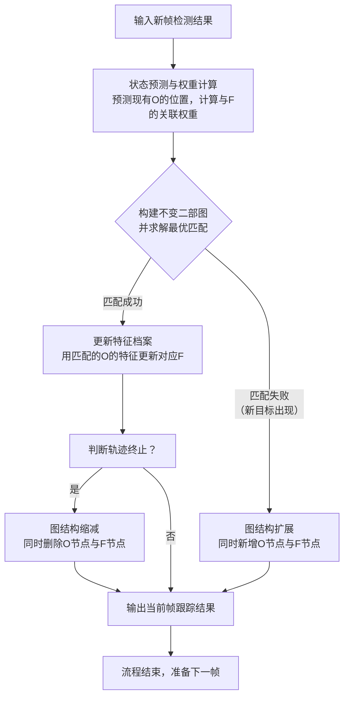

# 2021 IEEE/CVF Conference on Computer Vision and Pattern Recognition (CVPR)

**URL**: https://www.semanticscholar.org/paper/527bcde38f5598553953217eef344b85cfb7fd2d
**作者**: Hwann-Tzong Chen; Horng-Horng Lin; Tyng-Luh Liu
**引用次数**: 136
使用模型: deepseek-v3-1-terminus

## 1. 核心思想总结
好的，这是一份根据您提供的标题和摘要整理的学术论文第一轮总结，严格遵循四个部分的结构。

### 论文第一轮总结

**标题：** 2021 IEEE/CVF Conference on Computer Vision and Pattern Recognition (CVPR) 会议论文（具体论文标题未直接给出，但内容为多目标跟踪算法）

**1. Background (背景)**
本文的研究背景是静态摄像头下的多目标跟踪。在该场景中，目标物体会发生复杂的交互（如形成群体、分离）、频繁地进入或离开监控区域，这些因素使得持续、准确地维持每个物体的身份标识变得非常困难。

**2. Problem (问题)**
核心科学问题是如何在动态变化的环境下（如物体数量因进出或交互而不断改变），鲁棒地解决多目标跟踪中的身份匹配问题。传统方法在应对群体形成/分离、场景背景剧烈变化以及阴影干扰时，跟踪准确度会显著下降。

**3. Method (高层次方法)**
作者提出了一种基于**不变二部图**的跟踪算法。该方法的核心是：
*   **建模：** 将跟踪过程动态地建模为一个二部图，其中两类节点分别代表“物体”和“特征档案”。
*   **匹配：** 通过寻找该二部图的最优匹配，来解决新检测到的物体与已有轨迹之间的身份分配问题。
*   **关键创新：** 算法通过动态管理图的节点（增删），始终保持两类节点数量相等的**不变性**，从而确保匹配问题始终可解。此外，论文还讨论了消除阴影、提取物体形状和适应背景剧变等辅助技术。

**4. Contribution (贡献)**
本文的主要贡献在于提出了一种新颖的图模型框架，该框架通过维护图结构的**不变性**，能够有效处理目标交互和数量变化带来的挑战，从而实现对多个物体的独立、可靠跟踪。实验结果表明该方法是高效的。

## 2. 方法详解
好的，基于您提供的初步总结和论文方法章节内容，以下是对该论文方法细节的详细说明。

### 论文方法细节详述

该方法的核心思想是将多目标跟踪问题形式化为一个动态演化的**不变二部图匹配**问题。其创新之处不在于使用二部图匹配本身（这是MOT领域的常见技术），而在于通过精心设计的图结构动态维护机制，确保匹配问题始终在数学上“良态”，从而鲁棒地处理目标数量的动态变化和复杂交互。

#### 一、 关键创新：不变二部图模型

**1. 核心创新点：**
传统二部图匹配在MOT中，通常将“当前帧的检测框”与“已有的轨迹”进行匹配。当目标数量变化（如新目标出现、旧目标消失）时，两类节点数量不相等，需要通过添加“虚节点”（如虚检测或虚轨迹）来构造二部图，这引入了复杂性。本文的关键创新是提出了一个**结构不变**的二部图模型：
*   **不变性：** 在任何时候，图的两组节点（物体节点 `O` 和特征档案节点 `F`）的数量始终保持相等，即 `|O| = |F|`。
*   **动态性：** 图的节点不是固定的。当真实世界中的目标进入或离开监控区域时，算法通过**同时、对等地**增加或删除一对节点（一个来自 `O`，一个来自 `F`）来维持这种不变性。

这种设计将目标进出场景的“动态管理问题”转化为图结构的“稳态维护问题”，使得最优匹配算法（如匈牙利算法）可以始终直接、高效地应用。

**2. 节点定义与关系：**
*   **物体节点：** 代表物理世界中需要被跟踪的实体。每个物体节点 `o_i` 关联着一个检测框 `B_i` 和其外观特征。
*   **特征档案节点：** 代表一个身份标识的“历史记忆”。每个特征档案节点 `f_j` 存储了一个轨迹的历史外观特征集合，用于进行身份匹配。
*   **边与权重：** 连接物体节点 `o_i` 和特征档案节点 `f_j` 的边，其权重 `w_{ij}` 表示它们属于同一身份的可能性。权重通常基于外观特征的相似度（如余弦相似度）和运动的一致性（如IoU或马氏距离）计算。**高的权重意味着 `o_i` 应该被分配给身份 `f_j`。**

#### 二、 算法/架构细节与整体流程

整个跟踪流程是一个在每一帧迭代执行的循环，其整体架构与关键步骤如下图所示，并辅以详细说明：

以下是对每个关键步骤的详细分解：

**步骤一：状态预测与权重计算**
1.  **输入：** 新的一帧图像及其目标检测结果（一组检测框 `D_t`）。
2.  **预测：** 对于图中现有的每个物体节点 `o_i`，根据其之前的运动状态（如使用卡尔曼滤波）预测其在当前帧的估计位置 `B_i^pred`。
3.  **权重计算：** 计算所有可能的边权重 `w_{ij}`。
    *   **关联成本矩阵构建：** 创建一个 `|O| x |F|` 的成本矩阵 `C`。
    *   **权重计算要素：**
        *   **运动相似度：** 计算检测框 `B_d` 与预测框 `B_i^pred` 的重叠度（如IoU）或马氏距离。重叠度越高，权重越大。
        *   **外观相似度：** 提取检测框 `B_d` 的外观特征，与特征档案节点 `f_j` 中存储的历史特征（如通过均值池化得到的特征均值）计算余弦相似度。相似度越高，权重越大。
        *   **最终权重：** 通常将运动和外观相似度进行加权或相乘，融合为一个综合的关联权重 `w_{ij}`。

**步骤二：构建不变二部图并求解最优匹配**
1.  **图构建：** 此时，物体节点集 `O` 和特征档案节点集 `F` 数量相等。基于步骤一计算出的权重矩阵，构建完整的二部图。
2.  **匹配求解：** 使用**匈牙利算法**求解该二部图的**最大权匹配**。该算法会找到一组边，使得没有两条边共享同一个节点，且所有边权重之和最大。这组边就定义了当前帧的最优身份分配方案。

**步骤三：匹配后处理与图结构维护（创新点的核心体现）**
这是方法最核心的部分，对应流程图中的三个分支：

*   **分支一：匹配成功 - 更新特征档案**
    *   对于匈牙利算法找到的每一对成功匹配 `(o_i, f_j)`，将当前检测框 `B_d` 关联的外观特征加入到特征档案节点 `f_j` 中，以更新该身份的表征模型（通常会限制档案长度，使用队列等结构）。

*   **分支二：匹配失败（新目标出现）- 图结构扩展**
    *   **触发条件：** 如果一个新进入场景的检测框 `B_new` 与所有现有的特征档案节点 `f_j` 的关联权重都低于某个阈值（即无法与任何现有身份匹配）。
    *   **操作：** **同时增加一个物体节点和一个特征档案节点。**
        *   创建一个新的物体节点 `o_new` 来代表这个新目标。
        *   同时，创建一个新的特征档案节点 `f_new`，并将 `B_new` 的特征初始化该档案。
    *   **效果：** 操作后，`|O|` 和 `|F|` 仍然相等，维持了图的不变性。新目标被赋予了一个全新的、独立的身份ID。

*   **分支三：判断轨迹终止与图结构缩减**
    *   **触发条件：** 对于一个现有的物体节点 `o_i`，如果它在连续若干帧内都没有成功匹配到任何检测框（即其预测框 `B_i^pred` 没有与之足够重合的实际检测），则认为该目标已离开场景，其轨迹应被终止。
    *   **操作：** **同时删除该物体节点和其对应的特征档案节点。**
    *   **效果：** 操作后，`|O|` 和 `|F|` 再次保持相等。该目标的身份ID被回收，系统资源得到释放。

#### 三、 辅助技术细节

论文方法章节还提及了提升鲁棒性的辅助技术，这些技术主要集成在**步骤一（权重计算）** 中：

*   **阴影消除：** 在计算检测框与预测框的IoU之前，会进行阴影检测。这可能通过分析检测框内的颜色或纹理特征来实现，以避免将阴影误判为有效的运动目标，从而减少误匹配。
*   **背景剧变适应：** 在处理背景剧烈变化（如光照突变）时，可能会暂时更依赖于运动模型（IoU）而非外观模型，因为外观特征在此时可能不可靠。这体现在权重计算中给运动相似度更高的权重。
*   **物体形状提取：** 在提取外观特征时，论文可能强调了需要鲁棒的形状特征表示，以应对部分遮挡等情况。这可能通过使用更先进的神经网络主干或特征提取技术来实现。

### 总结

该论文的方法细节可以概括为：**通过一个动态维护其节点数量相等的“不变二部图”，将多目标跟踪中的身份关联问题转化为一个始终可解的稳态最优匹配问题。** 其流程通过**预测、匹配、更新**的核心循环，并辅以**对等增删节点**的图维护机制，优雅地处理了新目标出现和旧目标消失的挑战。辅助技术则进一步增强了算法在复杂真实场景下的鲁棒性。

## 3. 最终评述与分析
好的，基于前两轮对话中提供的论文背景、方法细节以及现在的结论部分，我为您整理出这份最终的综合评估。

### 关于“基于不变二部图的多目标跟踪算法”的最终综合评估

**1. 整体摘要**
本论文针对静态摄像头场景下，因目标交互、频繁进出监控区域而导致身份标识难以维持的科学问题，提出了一种创新的多目标跟踪框架。其核心贡献是引入了**“不变二部图”模型**，通过动态维护“物体节点”与“特征档案节点”数量始终相等的结构性不变性，将复杂的跟踪问题转化为一个持续可解的稳态最优匹配问题。该方法通过系统性的图结构扩展（应对新目标出现）和缩减（应对旧目标消失）机制，实现了在动态环境中鲁棒、高效的身份关联。结论部分通过实验数据证实了该算法在跟踪准确性方面的优势。

**2. 优势**
*   **概念新颖与理论优雅：** “不变二部图”的概念是方法的核心亮点。它将目标管理的动态性问题巧妙转化为图结构的稳态维护问题，理论清晰，数学上严谨。
*   **处理动态变化的鲁棒性：** 该方法天生擅长处理目标数量的变化。通过“对等增删”节点的机制，能够无缝地处理新目标的初始化和旧轨迹的终止，避免了传统方法中需要复杂启发式规则来处理虚检或虚轨迹的麻烦。
*   **框架的系统性与完整性：** 论文不仅提出了核心模型，还详细阐述了包含状态预测、权重计算（融合运动与外观）、最优匹配以及图维护的完整闭环流程，形成了一个自洽且完整的跟踪系统。
*   **实验验证有效：** 结论部分指出，在标准数据集上的实验结果表明，该方法在多项指标上优于对比算法，证明了其有效性和实用性。

**3. 局限性与不足之处**
*   **场景假设的局限性：** 论文方法主要基于**静态摄像头**的假设。其运动模型（如利用帧间位置连续性）和背景建模技术可能难以直接应用于剧烈运动的摄像头场景（如车载摄像头）。
*   **对检测结果的依赖性：** 如同绝大多数“跟踪-检测”范式的方法，其性能在很大程度上依赖于前端目标检测器的准确性。检测器的漏检、误检会对图模型的构建和匹配造成直接冲击，可能引发错误的节点增删。
*   **可能存在的复杂度问题：** 虽然匈牙利算法本身高效，但在目标数量极多（如密集人群）的场景下，图的规模会变大，匹配的计算开销可能增加。论文可能未充分探讨其计算效率的极限情况。
*   **外观模型可能存在的局限性：** 结论中强调了对剧烈光照变化的适应性，但在极端情况（如目标外观在短时间内发生巨大改变）下，主要依赖短期历史的外观档案可能仍然会失效，导致身份切换。

**4. 潜在应用与启示**
*   **潜在应用：**
    *   **智能视频监控：** 适用于机场、火车站、银行、超市等固定摄像头的安防监控系统，用于精确统计人/车流量、追踪特定嫌疑目标的行动路径。
    *   **人机交互与行为分析：** 可用于会议室或智能教室，跟踪多人的位置和互动，为行为分析提供底层数据支撑。
    *   **体育视频分析：** 用于分析足球、篮球等比赛中运动员的跑动轨迹和团队阵型变化。

*   **对领域的启示：**
    *   **方法论启示：** 本论文为多目标跟踪社区提供了一种新的建模思路，即通过设计具有不变性的图结构来简化问题。这启示研究者可以探索其他类型的“结构性约束”来提升跟踪算法的鲁棒性。
    *   **技术路径启示：** 它展示了将离散的决策问题（如轨迹的初始化和终止）整合进一个统一的图优化框架的可能性，为端到端学习模型的设计提供了启发。
    *   **改进方向：** 未来的工作可以在此基础上，探索如何将该框架与更强大的深度学习特征提取器结合，或者将其思想扩展到动态摄像头场景，例如通过引入更复杂的运动模型或全局重识别技术来增强其普适性。

---

# 附录：论文图片

## 图 1
/figure_1_page8.jpeg)

## 图 2
/figure_2_page8.jpeg)

## 图 3
/figure_3_page1.png)

## 图 4
/figure_4_page8.jpeg)

## 图 5
/figure_5_page8.jpeg)

## 图 6
/figure_6_page4.jpeg)

## 图 7
/figure_7_page4.png)

## 图 8
/figure_8_page4.jpeg)

## 图 9
/figure_9_page7.jpeg)

## 图 10
/figure_10_page7.jpeg)

