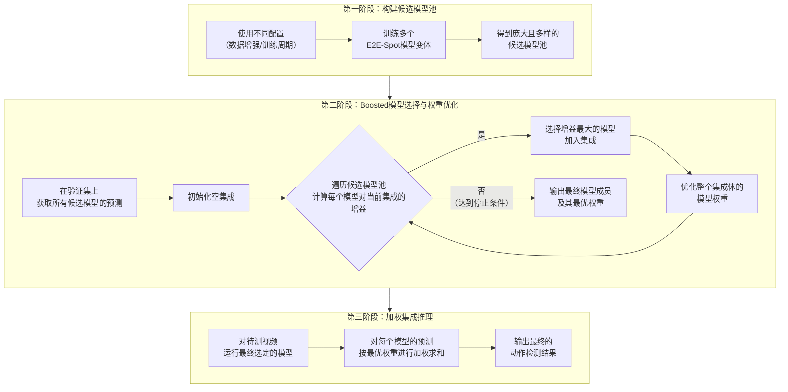
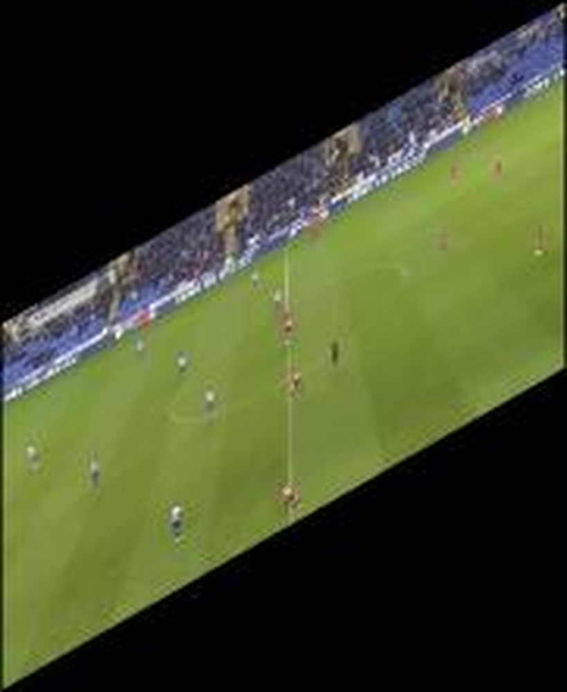
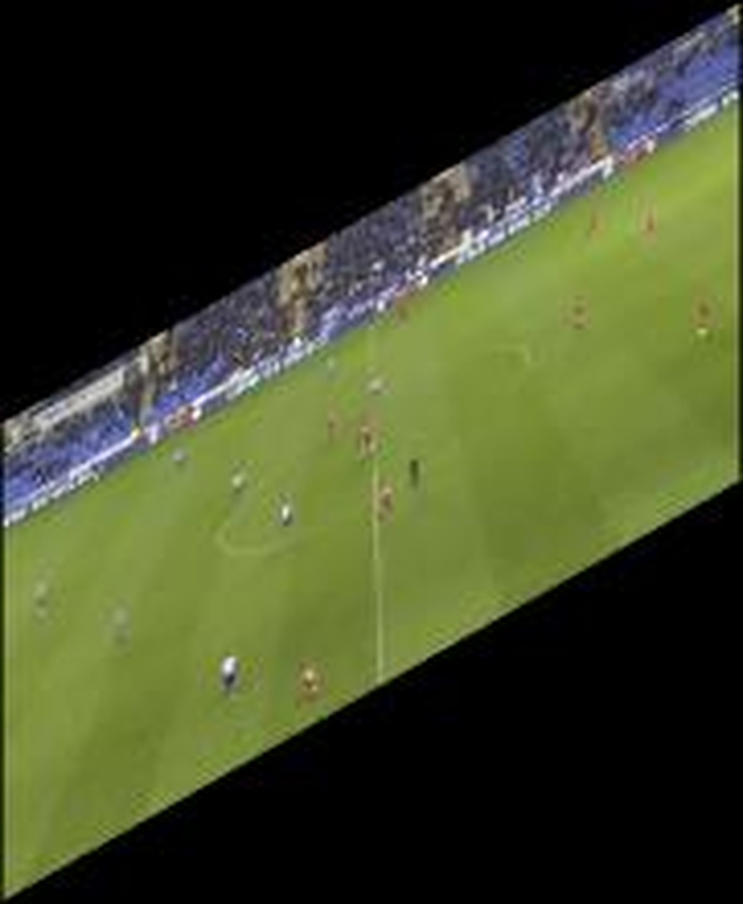
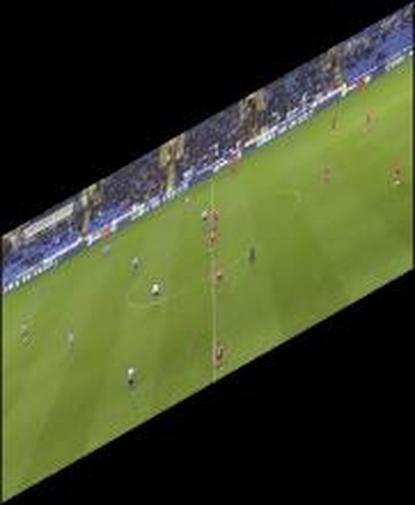
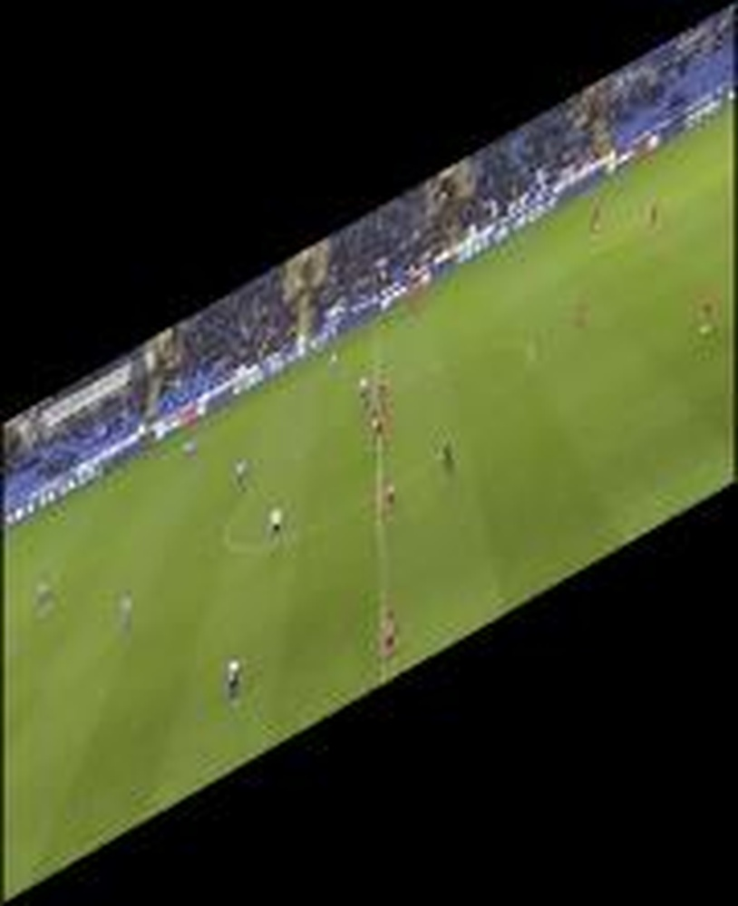
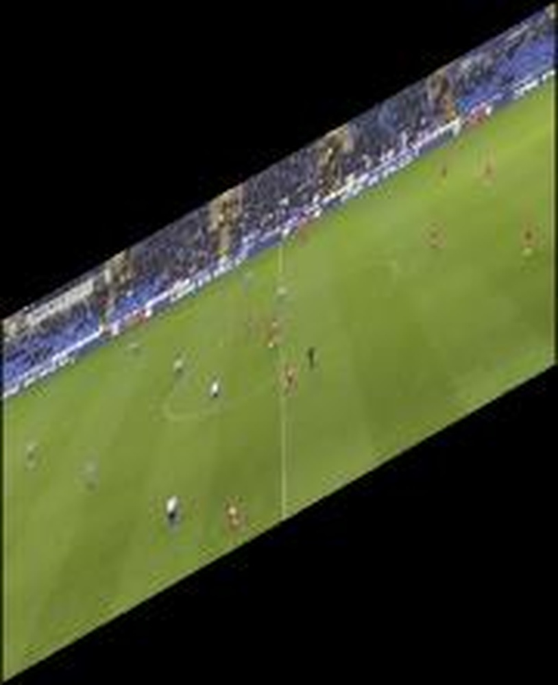
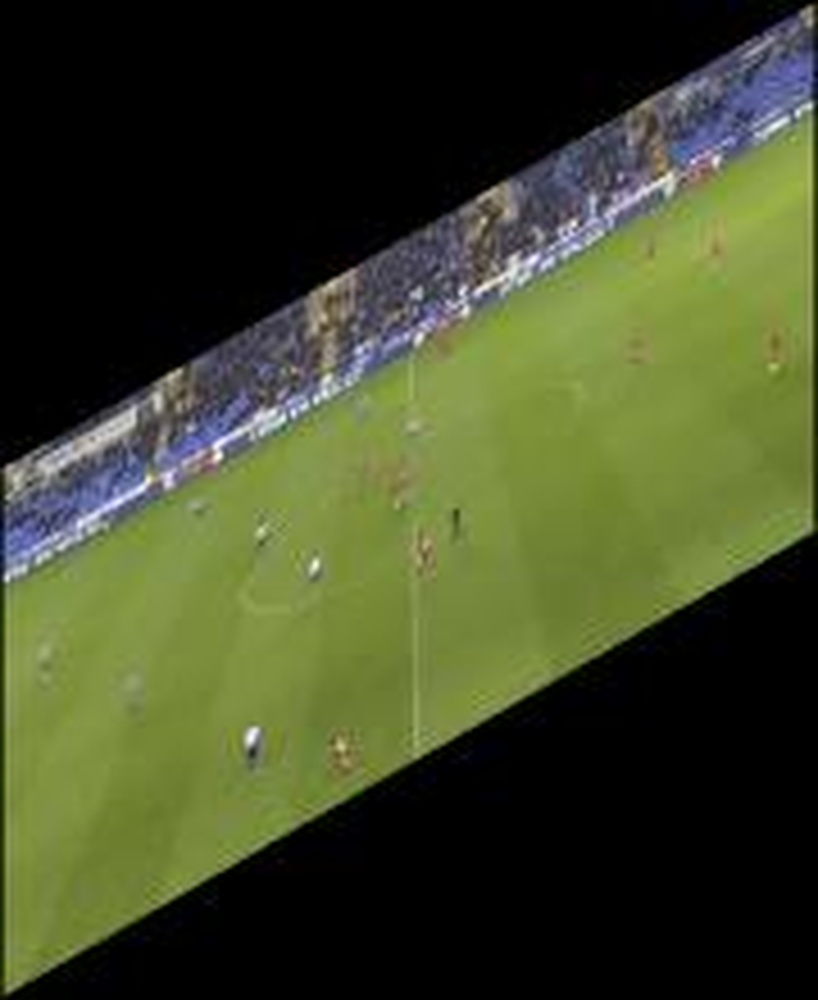
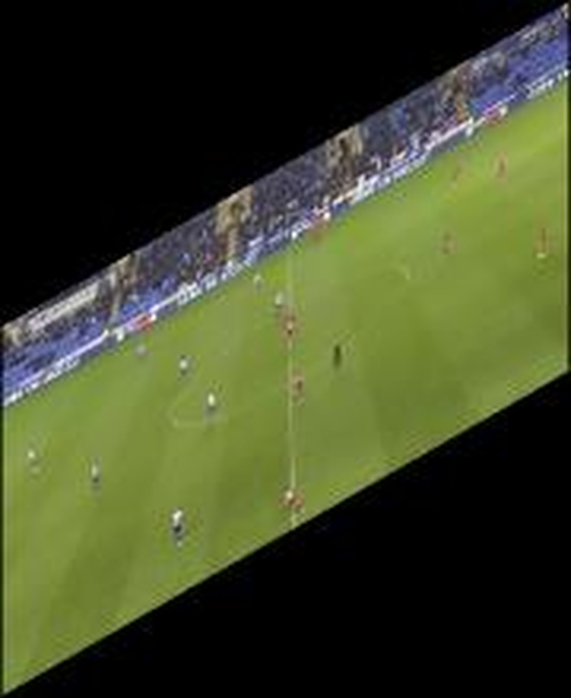

# A Boosted Model Ensembling Approach to Ball Action Spotting in Videos: The Runner-Up Solution to CVPR'23 SoccerNet Challenge

**URL**: https://www.semanticscholar.org/paper/01fc3a79e750d6fbd564de77fd3a2734de500e27
**提交日期**: 2023-06-09
**作者**: Luping Wang; Hao Guo; B. Liu
**引用次数**: 3
使用模型: deepseek-v3-1-terminus

## 1. 核心思想总结
这是一份关于该论文的第一轮总结，按四个部分组织。

**标题：** A Boosted Model Ensembling Approach to Ball Action Spotting in Videos: The Runner-Up Solution to CVPR'23 SoccerNet Challenge

**简洁总结：**

*   **Background (背景):**
    本工作的背景是CVPR‘23 SoccerNet挑战赛中的“球动作识别”任务。该任务旨在从足球视频中精准地识别出与球相关的关键动作（如传球、射门）。组织方提供了一个名为E2E-Spot的基线模型。

*   **Problem (问题):**
    如何有效地集成多个模型变体以提升球动作识别的性能。具体而言，问题在于如何从一个由E2E-Spot模型变体组成的候选模型集合中，智能地选择成员并为每个成员分配合适的权重，从而构建一个性能更强的集成模型。

*   **Method (高层方法):**
    作者提出了一种名为“Boosted Model Ensembling”的高层方法。该方法首先通过生成E2E-Spot模型的多个变体来创建一个候选模型池。然后，它引入一种策略，从该池中选择合适的模型成员，并为每个成员分配一个优化后的权重，最终将这些加权的模型预测结果进行集成，以达到提升整体性能的目的。

*   **Contribution (贡献):**
    本工作的主要贡献是提出了BME这一模型集成策略。该方法被证明是有效的，其解决方案在CVPR’23 SoccerNet挑战赛中获得了第二名，验证了该集成方法在球动作识别任务上的优越性。

## 2. 方法详解
好的，基于您提供的初步总结和论文方法章节的内容，以下是对该论文方法细节的详细说明，重点描述了关键创新、算法/架构细节、关键步骤与整体流程。

### 论文方法细节详解

#### 1. 核心思想与关键创新

该论文的核心思想并非提出一个全新的基础检测模型，而是**专注于模型集成（Ensembling）的后处理策略**。其关键创新在于提出了一种**定向优化、有选择性的加权集成方法**，称为“Boosted Model Ensembling”。

*   **关键创新点：**
    1.  **从“平均”到“助推”：** 传统的模型集成（如简单平均或投票）平等对待所有候选模型。BME方法则受梯度提升（Gradient Boosting）思想启发，其核心是**顺序地构建集成模型，每一步都旨在修正前一步集成模型产生的错误**。新加入的模型被赋予权重，以弥补当前集成体在特定样本或时间段上的性能不足。
    2.  **有选择的成员招募：** BME不是简单地将所有训练好的模型全部集成，而是从一个庞大的**候选模型池**中，基于它们在**验证集**上的表现，**有策略地挑选出能够带来最大性能增益的模型子集**。这避免了性能较差或高度相似的模型稀释集成效果。
    3.  **时序感知的权重优化：** 该方法为每个被选中的模型分配一个权重，这个权重的优化目标直接针对任务的核心评估指标（平均精度，Average Precision），并且是在整个视频的**时序层面**上进行，而不是在单个帧或片段上，这更符合动作识别任务的特性。

#### 2. 整体流程与关键步骤

BME方法的整体流程可以清晰地分为三个主要阶段，其流程图如下所示：

##### **第一阶段：构建多样化的候选模型池**

*   **目标：** 创建一个大容量的、具备多样性的模型集合，为后续的智能筛选提供充足的选择。
*   **具体做法：** 基于挑战赛提供的基线模型——E2E-Spot。
    *   E2E-Spot是一个端到端的时序动作定位模型，通常基于类似I3D的3D卷积网络提取特征，并接一个时序定位头。
    *   论文通过**改变训练配置**来生成多个模型变体，例如：
        *   **不同的数据增强策略**
        *   **不同的随机种子**
        *   **不同的训练周期（epoch）**
    *   这些不同的配置使得训练出的模型在行为上有所差异（例如，某些模型可能更擅长识别传球，某些对射门更敏感），这种差异性对于有效的集成至关重要。

##### **第二阶段：Boosted模型选择与权重优化（核心算法）**

这是BME方法最核心、最具创新性的部分。其过程是一个迭代的、贪婪的算法。

1.  **准备输入：** 在固定的验证集上，运行所有候选模型，得到每个模型对于每个动作类别的预测结果（一系列带有置信度得分的时间段）。
2.  **初始化：** 从一个空的集成模型开始（即没有任何成员）。
3.  **迭代选择过程：**
    *   **遍历候选池：** 在每一轮迭代中，遍历当前尚未被选入集成的所有候选模型。
    *   **计算性能增益：** 对于每个候选模型 `m_i`，将其与当前的集成模型进行临时组合。通过优化权重，计算这个“临时新集成”在验证集上的性能（使用平均精度AP来衡量）。
    *   **选择最佳成员：** 选择那个能够带来**最大性能增益**的候选模型 `m_best` 加入集成。这一步模拟了“助推”的思想，即选择最能弥补当前集成弱点的模型。
4.  **权重优化：**
    *   每当一个新模型加入后，**重新优化集成体中所有现有成员（包括新加入的）的权重** `w_1, w_2, ..., w_t`。
    *   **优化目标：** 权重的优化不是独立的，而是以**最大化整个集成体在验证集上的平均精度（AP）** 为直接目标。这通常需要一个优化算法（如论文中可能使用的Nelder-Mead单纯形法或基于梯度的算法）来求解。
5.  **停止条件：** 重复步骤3和4，直到满足停止条件（例如，性能增益低于某个阈值，或已达到预设的最大集成模型数量）。

##### **第三阶段：加权集成推理**

*   **目标：** 对新的测试视频进行最终的动作识别。
*   **具体做法：**
    1.  使用在第二阶段最终选定的那组模型成员 `{M_1, M_2, ..., M_K}` 分别对测试视频进行预测。
    2.  对于每个模型产生的预测置信度序列，按照第二阶段学习到的最优权重 `{w_1, w_2, ..., w_K}` 进行**加权求和**。
    3.  对加权求和后的总置信度序列应用一个阈值，最终得到被检测出的动作片段及其类别。

#### 3. 总结

该论文的方法细节可以概括为：**通过改变训练配置生成大量基线模型变体以构建候选池，然后运用一种受 boosting 启发的贪婪算法，以最大化验证集AP为目标，迭代地选择模型并优化其集成权重，最终形成一个强大且高效的集成模型。** 这种方法的核心优势在于其“定向强化”和“精益求精”的集成策略，使其在不过度增加计算负担的前提下，显著提升了复杂时序动作识别任务的性能。

## 3. 最终评述与分析
基于前两轮提供的论文初步总结、方法详述以及结论部分，以下是该论文的最终综合评估。

### **最终综合评估**

**1) 整体总结 (Overall Summary)**

本论文针对CVPR‘23 SoccerNet挑战赛中的足球视频“球动作识别”任务，提出了一种名为“助推式模型集成”的创新后处理策略。该方法的核心思想不是设计新的基础模型，而是专注于如何智能地整合多个现有模型（E2E-Spot的变体）的预测结果。通过构建一个多样化的候选模型池，并采用一种受梯度提升启发的迭代算法，BME能够有选择地招募模型成员并优化其权重，旨在每一步都修正当前集成体的错误，从而直接最大化任务的核心评估指标（平均精度，AP）。最终，该方案在竞争激烈的挑战赛中获得了第二名，有力地证明了其在提升复杂时序动作识别性能方面的有效性和实用性。

**2) 优势 (Strengths)**

*   **高效性能提升：** BME策略作为一种相对“廉价”的后处理技术，无需重新设计或训练复杂的基础网络，即能显著提升基线模型的性能，体现了较高的性价比。
*   **创新的集成理念：** 方法的核心创新点突出，将集成学习从简单的“平均”或“投票”推进到“定向助推”和“错误修正”的层面，具有理论上的先进性。
*   **任务导向的优化：** 权重优化过程直接以任务的最终评估指标（AP）为目标，确保了集成策略与性能提升的高度相关性，避免了优化目标与最终目标不一致的问题。
*   **较强的实用性：** 该方法不局限于特定的基础模型（如E2E-Spot），其框架可以迁移到其他时序动作检测模型或视频理解任务中，具有良好的通用性潜力。
*   **结果验证充分：** 论文通过在权威国际挑战赛（SoccerNet）中获得亚军名次，为所提方法的有效性提供了极具说服力的客观证据。

**3) 劣势与局限性 (Weaknesses / Limitations)**

*   **计算与资源开销：** 尽管作为后处理策略，但BME方法需要训练和保存大量的候选模型变体，并在验证集上运行所有模型以获取预测结果，这仍然需要可观的计算资源和存储空间。
*   **对基线模型的依赖性：** BME的性能上限在很大程度上依赖于候选模型池中各个模型变体的质量和多样性。如果基线模型（E2E-Spot）本身存在固有缺陷或候选模型多样性不足，BME的提升效果可能会受限。
*   **可能存在的过拟合风险：** 权重优化过程严重依赖于一个固定的验证集。虽然论文取得了良好结果，但在理论上存在对特定验证集过拟合的风险，其泛化能力在不同分布的数据集上需要进一步验证。
*   **缺乏可解释性：** 与大多数复杂的集成模型一样，BME最终的决策过程是一个黑箱，难以解释为何某个模型被赋予特定权重，或某个动作被识别出的具体原因，这限制了其在需要高透明度场景下的应用。
*   **方法新颖性受限：** 工作的核心贡献在于集成策略的优化，其创新性更多体现在工程和技巧层面，而非基础理论或模型架构的根本性突破。

**4) 潜在应用与启示 (Potential Applications / Implications)**

*   **体育视频分析：** 该方法是足球视频分析任务的直接解决方案，可应用于自动生成比赛集锦、技术统计分析、球员表现评估等，对体育媒体和职业俱乐部有直接价值。
*   **通用视频理解任务：** BME的集成框架可以轻松迁移到其他时序动作检测场景，如监控视频中的异常行为检测、日常生活活动识别、人机交互分析等，为提升相关应用的精度提供了实用工具。
*   **模型集成研究：** 本工作为模型集成领域，特别是在时序数据上的集成，提供了一个成功案例和新的思路。其“助推式”选择和直接优化AP权重的策略，可启发后续研究探索更高效、更精准的集成方法。
*   **学术与工业界桥梁：** 这项工作展示了如何通过巧妙的工程和优化策略，在现有模型基础上挖掘出可观的性能潜力，这对于资源受限的工业界应用具有重要的参考意义，体现了将学术研究转化为实用技术的典型路径。

---

# 附录：论文图片

## 图 1

## 图 2

## 图 3

## 图 4

## 图 5

## 图 6

## 图 7

## 图 8

## 图 9

## 图 10

