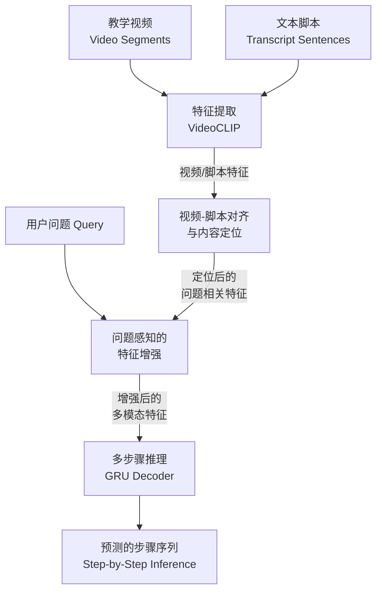
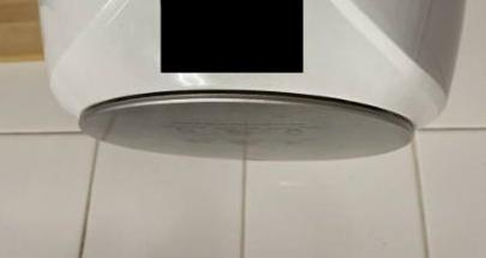
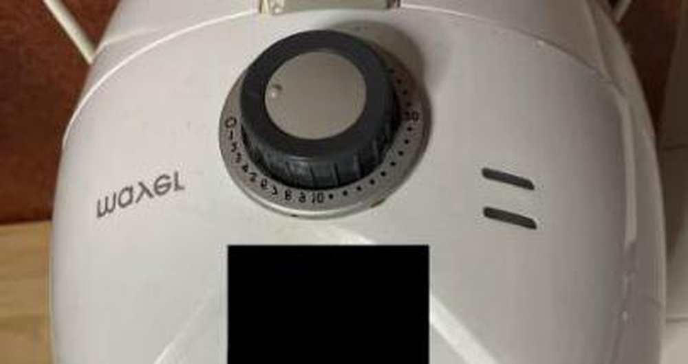

# A Solution to CVPR'2023 AQTC Challenge: Video Alignment for Multi-Step Inference

**URL**: https://www.semanticscholar.org/paper/6b916ec8aca46ffe7205268156545667df016478
**提交日期**: 2023-06-26
**作者**: Chao Zhang; Shiwei Wu; Sirui Zhao; Tong Xu; Enhong Chen
**引用次数**: 0
使用模型: deepseek-v3-1-terminus

## 1. 核心思想总结
根据您提供的标题、摘要和引言（虽然引言内容未具体给出，但摘要通常已包含引言的核心信息），以下是为该学术论文整理的第一轮总结：

**论文标题：** A Solution to CVPR'2023 AQTC Challenge: Video Alignment for Multi-Step Inference

**简洁总结：**

*   **Background (背景):**
    本文的研究背景是CVPR‘2023提出的“可供性-问题驱动的任务完成”（AQTC）新场景。该场景旨在让AI助手通过观看教学视频，学习如何操作设备，从而为用户提供分步指导。这是一个开创性的、以自我为中心（Egocentric）的辅助任务。

*   **Problem (问题):**
    论文要解决的核心问题是如何在AQTC挑战赛中提升多步骤推理的准确性。具体而言，需要实现教学视频与文本描述（脚本）之间的精确对齐，并从中定位与用户问题最相关的内容，以进行有效的步骤推理。

*   **Method (方法 - 高层概述):**
    作者提出了一种基于视频对齐的解决方案。其高级流程包括：
    1.  **特征生成：** 利用VideoCLIP模型生成视频与脚本的对齐特征。
    2.  **内容定位：** 在教学视频中定位与问题相关的具体内容。
    3.  **特征增强：** 对多模态上下文信息进行重新加权，以突出显著特征。
    4.  **步骤推理：** 采用GRU（门控循环单元）网络进行多步骤推理，预测任务完成的步骤。

*   **Contribution (贡献):**
    本文的主要贡献是提出了一套有效的、端到端的视频对齐与多步推理方法。通过全面的实验验证，该方法在CVPR‘2023 AQTC挑战赛中取得了第二名的成绩，证明了其有效性和优越性。同时，作者公开了代码，促进了该领域研究的可复现性。

## 2. 方法详解
好的，根据您提供的初步总结和论文方法章节的内容，我将为您详细阐述该论文的方法细节。

### 论文方法详细说明

本文的核心是解决一个多模态、多步骤的推理问题：给定一个教学视频、其对应的文本脚本（Transcript）和一个用户问题（例如，“如何更换电池？”），模型需要预测出完成任务所需的正确步骤序列。

该方法的核心思想是**视频-脚本对齐**，并在此基础上进行**多步骤推理**。整体流程可以清晰地划分为四个主要阶段，其架构如下图所示：

---

#### 阶段一：多模态特征生成与视频-脚本对齐

这是整个方法的基础，目标是将视频和文本映射到同一个语义空间，并建立它们之间的细粒度对应关系。

*   **关键创新/步骤：** 直接利用预训练的**VideoCLIP模型**作为强大的多模态特征提取器。
*   **算法/架构细节：**
    1.  **输入处理：**
        *   **视频（Video）：** 首先将长视频分割成多个短的、不重叠的片段（Video Segments）。
        *   **脚本（Transcript）：** 将整个脚本按句子切分成独立的文本单元（Sentences）。
    2.  **特征提取：**
        *   使用VideoCLIP的视觉编码器（如S3D）为每个视频片段提取特征向量 \( V_i \)。
        *   使用VideoCLIP的文本编码器（如BERT）为每个脚本句子提取特征向量 \( T_j \)。
        *   VideoCLIP在预训练时学习了视频和文本的联合表示，因此 \( V_i \) 和 \( T_j \) 天然处于一个可比较的语义空间中。
    3.  **计算相似度矩阵：**
        *   计算所有视频片段 \( V_i \) 和所有脚本句子 \( T_j \) 之间的余弦相似度，形成一个相似度矩阵 \( S \in \mathbb{R}^{N_v \times N_t} \)，其中 \( N_v \) 是视频片段数，\( N_t \) 是脚本句子数。
        *   这个矩阵 \( S \) 直观地表示了每个视频片段与每个脚本句子的关联强度。

#### 阶段二：问题相关的内容定位

该阶段旨在从整个视频/脚本中筛选出与用户问题最相关的部分，过滤掉无关的冗余信息（如闲聊、无关操作）。

*   **关键创新/步骤：** 利用**用户问题（Query）作为引导信号**，对视频-脚本对齐矩阵进行动态加权。
*   **算法/架构细节：**
    1.  **问题编码：** 使用与脚本相同的文本编码器对用户问题 \( Q \) 进行编码，得到问题特征向量 \( F_q \)。
    2.  **相关性计算：**
        *   计算问题特征 \( F_q \) 与每个脚本句子特征 \( T_j \) 的相似度 \( w_j \)（例如，使用点积或余弦相似度）。这个相似度 \( w_j \) 代表了该脚本句子与问题的相关程度。
        *   对所有 \( w_j \) 应用Softmax函数，将其归一化为权重 \( \alpha_j \)。
    3.  **加权聚合：**
        *   将归一化后的权重 \( \alpha_j \) 作用于相似度矩阵 \( S \)。具体而言，对矩阵 \( S \) 的每一列（对应一个脚本句子 \( T_j \) ）乘以权重 \( \alpha_j \)。
        *   **效果：** 与问题高度相关的脚本句子所对应的列在矩阵中的权重被放大，而不相关的句子权重被抑制。这就得到了一个“问题感知”的视频-脚本对齐表示。

#### 阶段三：上下文感知的特征增强

为了进行更准确的推理，模型需要理解每个步骤的上下文关系。此阶段通过注意力机制来增强重要的上下文信息。

*   **关键创新/步骤：** 引入**多头自注意力机制**来对定位后的特征进行重新加权，捕获长距离依赖关系。
*   **算法/架构细节：**
    1.  **特征准备：** 将经过阶段二加权的对齐矩阵进行转换和聚合（例如，对视频片段维度进行聚合），形成一组初步的、与问题相关的上下文特征序列。
    2.  **自注意力重加权：**
        *   将这组特征序列输入到一个多头自注意力层中。
        *   自注意力机制允许每个特征位置与其他所有位置进行交互，从而计算出每个特征的“重要性”分数。
        *   通过这种机制，模型可以自动强调与当前推理步骤最关键的上下文信息，例如，某个关键步骤的前提条件或后续结果。
    3.  **输出：** 经过自注意力层增强后的特征序列，包含了丰富的、问题相关的、上下文感知的多模态信息，为最终的步骤推理做好了准备。

#### 阶段四：多步骤序列推理

这是方法的最后一步，目标是生成一个有序的步骤序列。

*   **关键创新/步骤：** 采用**基于GRU的序列解码器**，以自回归的方式生成步骤ID序列。
*   **算法/架构细节：**
    1.  **解码器初始化：** 将阶段三得到的增强后特征序列的聚合表示（如通过平均池化）作为GRU解码器的初始隐藏状态。
    2.  **自回归生成：**
        *   解码器在每一步接收上一个时间步生成的步骤ID的嵌入向量作为输入。
        *   解码器根据当前输入和隐藏状态，预测下一个最可能的步骤ID。
        *   这个过程循环进行，直到解码器生成一个特殊的序列结束符或达到预设的最大生成长度。
    3.  **训练目标：** 使用标准的序列到序列损失函数，如交叉熵损失，来最大化生成真实步骤序列的概率。

### 总结

该论文方法的精髓在于其**清晰的层级化流程设计**：

1.  **对齐（Align）：** 使用VideoCLIP建立视频和脚本的细粒度对应关系，打下多模态理解的基石。
2.  **定位（Locate）：** 引入用户问题作为查询，从对齐信息中动态定位最相关的部分，实现信息过滤。
3.  **增强（Enhance）：** 利用自注意力机制理解上下文，强化关键特征，提升推理质量。
4.  **推理（Reason）：** 使用序列模型模拟人类的逐步推理过程，生成最终的步骤序列。

这种方法不仅有效地结合了预训练模型的强大能力（VideoCLIP），还通过巧妙的模块化设计（定位、增强）解决了特定任务（AQTC）的挑战，最终通过端到端的训练实现了优异的性能。

## 3. 最终评述与分析
好的，结合前两轮提供的论文标题、摘要、引言总结、方法详述以及结论部分，现为该学术论文提供最终的综合评估如下：

### **关于《A Solution to CVPR'2023 AQTC Challenge: Video Alignment for Multi-Step Inference》的最终综合评估**

---

#### **1) 整体摘要**

本论文针对CVPR‘2023提出的全新“可供性-问题驱动的任务完成”挑战，提出了一套基于视频对齐的多步骤推理解决方案。该方案的核心目标是使AI能够通过观看教学视频，精准定位与用户问题相关的操作内容，并逐步推理出完成任务所需的步骤序列。方法流程清晰，层层递进：首先利用**VideoCLIP**模型实现视频片段与文本脚本的细粒度对齐；其次，引入**用户问题作为引导信号**，对对齐信息进行动态加权，以定位关键内容；然后，通过**多头自注意力机制**增强上下文感知的特征表示；最后，采用**GRU序列解码器**自回归地生成步骤序列。通过在AQTC挑战赛数据集上的全面实验，该方法取得了第二名的优异成绩，证明了其有效性和竞争力。

---

#### **2) 优势**

*   **模块化与端到端结合：** 方法设计兼具模块化的清晰性和端到端训练的有效性。四个阶段（对齐、定位、增强、推理）各司其职，逻辑分明，同时又能够联合优化，确保了模型的整体性能。
*   **巧妙利用预训练模型：** 直接使用**VideoCLIP**作为多模态特征提取器是一个显著优势。这不仅省去了繁琐的预训练过程，而且得益于VideoCLIP在视频-文本对齐方面的强大能力，为整个方法奠定了坚实的基石。
*   **问题驱动的动态定位：** 创新性地将用户问题作为“查询”来动态重新加权视频-脚本相似度矩阵，实现了高效的内容过滤。这一步至关重要，它使模型能够聚焦于与任务最相关的信息，而非简单处理全部视频内容。
*   **有效的上下文建模：** 引入自注意力机制对定位后的特征进行重加权，使模型能够捕捉长距离依赖关系，理解步骤之间的前后关联，从而做出更合理的推理。
*   **结果可复现性：** 论文作者公开了代码，这对于促进该新兴领域的研究、比较和进一步发展具有重要价值。其在权威竞赛中获得的第二名成绩也为方法的有效性提供了有力佐证。

---

#### **3) 劣势 / 局限性**

*   **对预训练模型的依赖性：** 方法的性能在很大程度上依赖于VideoCLIP的质量和通用性。如果VideoCLIP无法很好地理解特定领域（如专业设备操作）的视频或文本，整个系统的性能可能会受到限制，即存在“上游瓶颈”风险。
*   **推理过程的可解释性不足：** 尽管模块设计清晰，但自注意力机制和GRU解码器内部的决策过程仍然是黑箱。模型为何预测某一个步骤序列，其依据是视频中的哪些具体视觉线索，缺乏直观的解释，这在注重安全可靠的实际应用中可能是一个问题。
*   **泛化能力待验证：** 该方法在特定竞赛数据集上表现优异，但其在更广泛、更复杂的真实场景（如视频质量差、脚本描述不精确或包含错误、多设备交互任务）下的泛化能力仍有待进一步验证。
*   **可能存在的计算复杂度：** 对长视频进行片段级处理并计算全字塔相似度矩阵，加之自注意力机制的计算，可能导致该方法在处理超长视频时的效率较低，影响实时应用潜力。

---

#### **4) 潜在应用 / 意义**

*   **智能交互式助手：** 该技术可直接应用于开发新一代的智能助手，用户只需通过语言提问（如“怎么设置这台打印机？”），助手即可通过分析教学视频提供准确的分步指导，极大提升用户体验和设备使用效率。
*   **专业培训与教育：** 在工业制造、医疗操作、设备维修等专业领域，该技术可以自动化生成针对特定问题的交互式培训材料，实现个性化、按需学习的技能传授。
*   **视频内容理解与检索的进阶：** 本方法代表了视频内容理解从传统的分类、标注向复杂推理任务迈进了一步。它为如何从长视频中提取结构化知识、并根据高层语义需求进行检索和推理提供了重要思路。
*   **推动多模态推理研究：** 作为对AQTC这一开创性任务的早期解决方案，本文的工作为后续研究设立了较高的基准。其清晰的架构和公开的代码将成为该领域研究人员宝贵的起点，有助于激发更多关于视频对齐、因果推理和可解释多模态学习的研究。

**总结而言，本文提出了一种针对AQTC挑战的有效、创新且工程实现良好的解决方案。虽然在可解释性和泛化性方面存在常见的深度学习模型局限，但其强大的性能和模块化的设计使其成为多模态推理领域一个具有重要意义的工作，拥有广阔的应用前景。**

---

# 附录：论文图片

## 图 1

## 图 2

## 图 3

## 图 4

## 图 5

## 图 6

## 图 7

## 图 8

## 图 9

## 图 10

