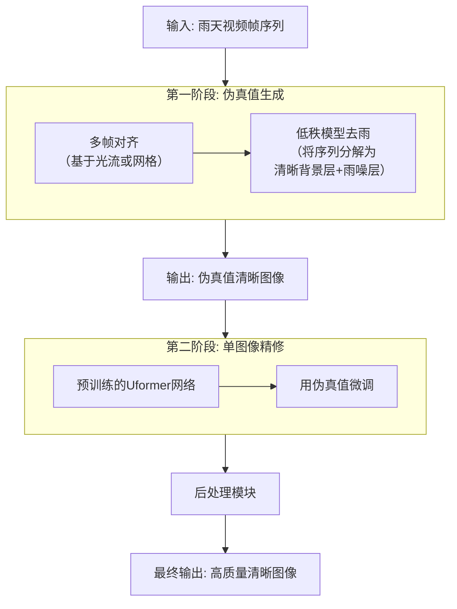
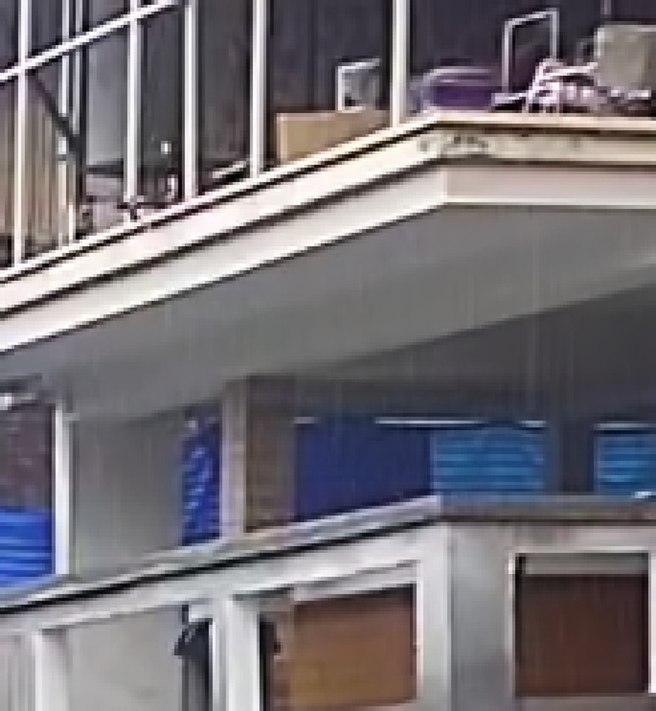
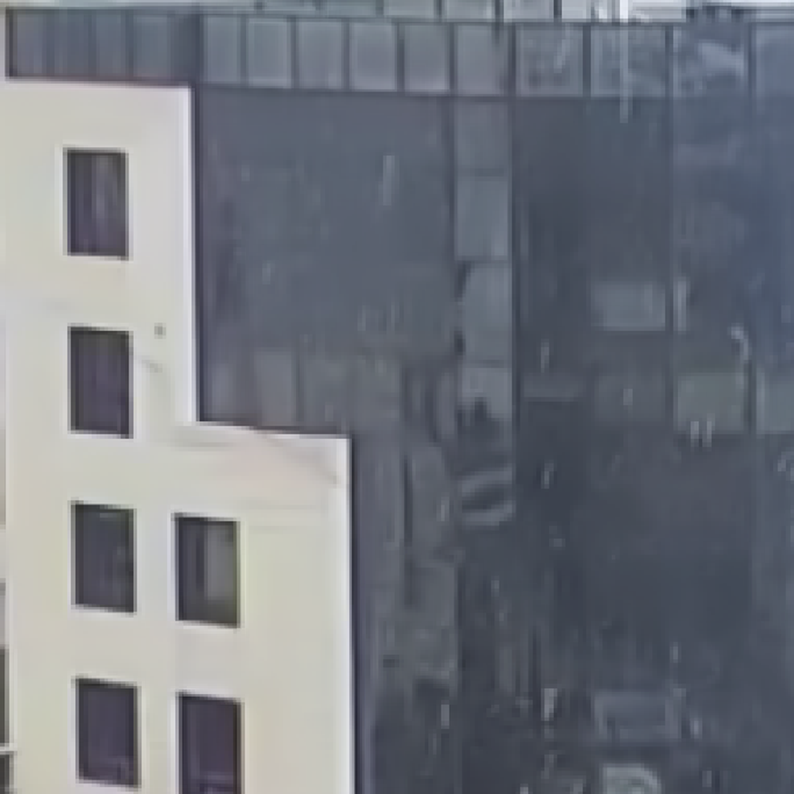
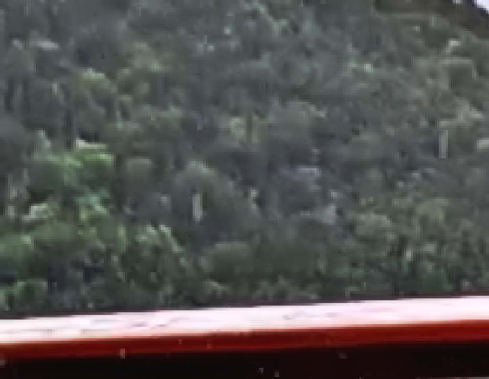
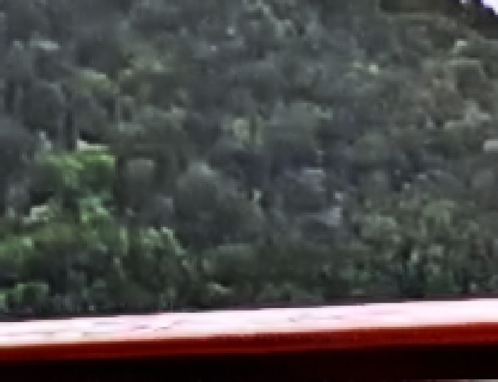
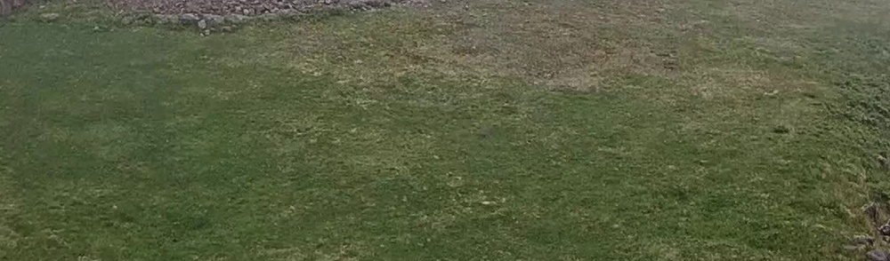
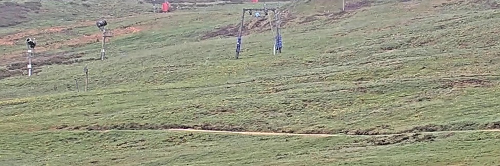
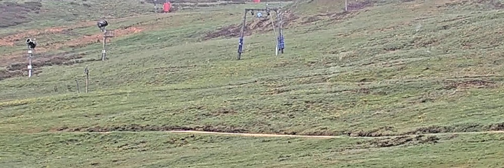
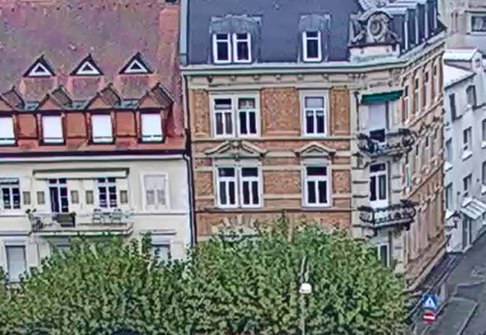
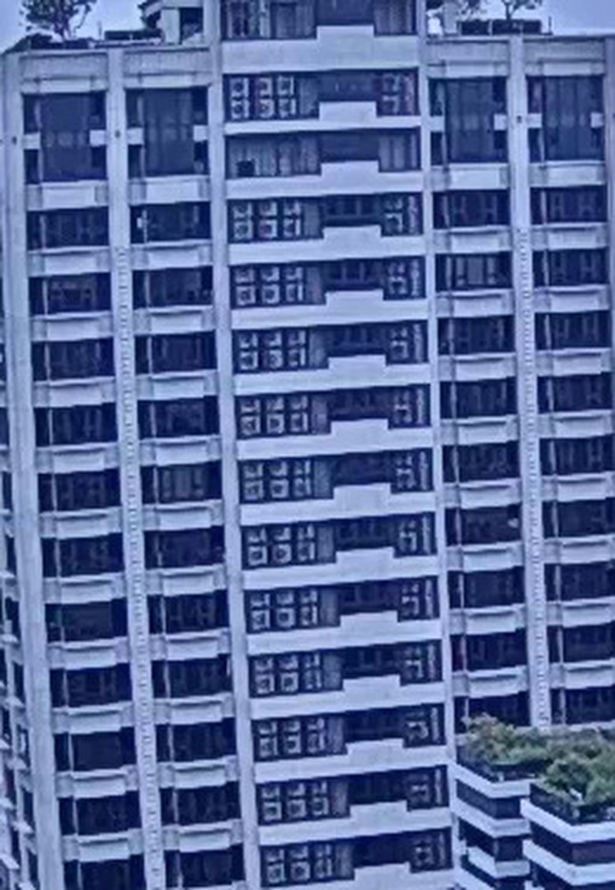

# A Two-Stage Real Image Deraining Method for GT-RAIN Challenge CVPR 2023 Workshop UG2 + Track 3

**URL**: https://www.semanticscholar.org/paper/c1e276ec613c0f4e3d6f00e8d5814eaa45874528
**提交日期**: 2023-05-13
**作者**: Y. Guo; Xu Xiao; Xiao-Xu Wang; Yi Li; Yi Chang; Luxin Yan
**引用次数**: 2
使用模型: deepseek-v3-1-terminus

## 1. 核心思想总结
这是一份针对该论文的第一轮总结，内容基于提供的标题和摘要。

**标题：** A Two-Stage Real Image Deraining Method for GT-RAIN Challenge CVPR 2023 Workshop UG2 + Track 3

**第一轮总结**

*   **Background (背景)**
    该研究旨在解决真实场景下的图像去雨问题，特别是针对CVPR 2023 UG2+ Track 3的GT-RAIN挑战赛。该任务的目标是从一系列雨天视频帧中重建出清晰的图像。

*   **Problem (问题)**
    真实世界中的雨景图像往往包含复杂的退化，如密集雨线、雨雾等，这给单一图像或视频去雨方法带来了巨大挑战。现有方法可能在处理此类复杂、重度雨雾序列时，其恢复图像的视觉质量和客观指标（如PSNR和SSIM）仍有待提升。

*   **Method (核心方法)**
    论文提出了一种高效的两阶段去雨框架：
    1.  **第一阶段（伪真值生成）**：利用一种基于低秩模型的视频去雨方法，充分融合多帧对齐的雨天图像信息，生成一个高质量的“伪真值”清晰图像。
    2.  **第二阶段（单图像精修）**：采用基于Transformer的单图像去雨网络（Uformer），首先在大型真实雨图数据集上进行预训练，然后使用第一阶段生成的伪真值进行微调，以进一步提升图像恢复质量。最后，还引入了一个综合图像后处理模块来优化视觉效果。

*   **Contribution (贡献)**
    1.  提出了一个精心设计的、结合了视频信息与强大单图像先验的两阶段去雨框架，能够有效处理重度雨雾序列。
    2.  该方法在GT-RAIN挑战赛的最终测试中取得了优异的成绩，在平均结构相似性（SSIM）指标上排名第一，在平均峰值信噪比（PSNR）指标上排名第二，证明了其有效性。
    3.  公开了代码，有利于重现性和后续研究。

## 2. 方法详解
好的，基于您提供的初步总结和论文方法章节的内容，以下是对该论文方法细节的详细说明，重点阐述了关键创新、算法/架构细节、关键步骤与整体流程。

### **论文方法详细说明**

该论文的核心思想是**分而治之**，通过两个优势互补的阶段来解决复杂真实雨景下的视频去雨难题。第一阶段利用视频的时序信息生成一个高质量的“伪真值”，第二阶段则利用强大的单图像先验对该“伪真值”进行精修和增强。

#### **一、 整体流程概述**

整个方法的流程可以清晰地分为两个主要阶段和一个后处理步骤，其整体工作流如下图所示：

---

#### **二、 第一阶段：伪真值生成（基于低秩模型的视频去雨）**

**1. 关键目标：**
利用一段连续雨天视频帧（例如，挑战赛提供的15帧序列），生成一张对应于序列中间帧的、高质量的清晰图像，作为第二阶段的“伪真值”或“指导图像”。

**2. 关键创新与动机：**
- **动机：** 单一图像去雨方法缺乏时序信息，在处理重度雨雾时容易产生伪影或细节丢失。而视频序列中，清晰的背景是相对稳定的（可视为低秩成分），而雨滴、雨线是快速变化的（可视为稀疏噪声成分）。
- **创新：** 采用**低秩与稀疏分解** 这一数学模型来形式化问题。该方法不依赖于大型深度学习模型，而是通过优化理论将整个序列分解为一个清晰的背景层和一个包含雨噪的动态层。

**3. 算法/架构细节：**
- **问题建模：** 假设观测到的雨天视频帧序列可以表示为：
  \( O = B + R \)
  其中，\( O \) 是观测矩阵（每一列是一帧展开的向量），\( B \) 是清晰的背景层（低秩矩阵），\( R \) 是雨噪层（稀疏矩阵）。
- **核心优化模型：** 采用类似**鲁棒主成分分析（RPCA）** 的变体。其优化目标函数通常形式为：
  \( \min_{B, R} \|B\|_* + \lambda \|R\|_1 \quad \text{s.t.} \quad O = B + R \)
  其中：
  - \( \|B\|_* \) 是矩阵 \( B \) 的核范数，用于约束背景层的低秩特性。
  - \( \|R\|_1 \) 是矩阵 \( R \) 的L1范数，用于约束雨噪层的稀疏性。
  - \( \lambda \) 是权衡两个项重要性的正则化参数。
- **关键步骤：**
  1.  **帧对齐：** 由于相机或物体运动，序列中的帧需要先进行对齐。论文可能使用了光流估计或网格变换（如仿射/单应性变换）将所有帧与参考帧（通常是中间帧）对齐，以消除全局运动，确保低秩假设的有效性。
  2.  **低秩分解求解：** 使用优化算法（如增广拉格朗日乘子法、交替方向乘子法等）求解上述目标函数，最终将序列分解为 \( B \) 和 \( R \)。
  3.  **提取伪真值：** 分解得到的背景层 \( B \) 中对应于参考帧的那一列，就是生成的“伪真值”清晰图像。

**4. 优势：**
- 能够有效利用多帧信息，恢复出在单帧中被严重遮挡的背景细节。
- 生成的“伪真值”在结构上较为准确，为第二阶段提供了可靠的监督信号。

---

#### **三、 第二阶段：单图像精修（基于Transformer的Uformer网络）**

**1. 关键目标：**
以第一阶段生成的“伪真值”为训练目标，对一个强大的单图像去雨网络进行微调，使其能够学习到从单一雨天输入到高质量清晰输出的复杂映射，从而进一步提升图像的视觉质量和恢复细节。

**2. 关键创新与动机：**
- **动机：** 低秩模型生成的结果有时可能过于平滑，缺乏纹理细节，或者在某些区域存在残留伪影。而基于深度学习的单图像去雨网络，特别是Transformer架构，在捕捉长距离依赖和图像细节恢复方面表现出色。
- **创新：** 采用了**两阶段训练策略** 和 **Uformer架构**。
  - **两阶段训练：** 先在大型公开的真实雨图数据集（如Rain13K）上进行**预训练**，让网络学习通用的去雨先验知识。然后，再在本次挑战赛的数据上，使用本方法第一阶段生成的、更匹配当前任务的“伪真值”进行**微调**。这避免了网络从小批量或质量不一的伪真值中过拟合，提升了泛化能力。
  - **Uformer架构：** 选择了Uformer作为骨干网络，因为它结合了UNet的编码器-解码器结构（适合底层视觉任务）和Transformer的自注意力机制（擅长建模全局关系）。

**3. 算法/架构细节：**
- **网络架构（Uformer）：**
  - **编码器：** 逐步下采样提取多尺度特征。每个阶段包含基于窗口的自注意力模块，用于在局部窗口内计算注意力，降低计算复杂度，同时能有效捕捉上下文信息。
  - **解码器：** 逐步上采样恢复图像分辨率。通过跳跃连接融合编码器对应尺度的特征，保留空间细节。
  - **核心组件：** 使用**局部增强前馈网络（LeFF）** 代替标准的前馈网络，能更好地保留局部上下文信息，这对于恢复图像纹理至关重要。
- **训练策略：**
  1.  **预训练：** 使用损失函数（如L1损失、Charbonnier损失或感知损失）在大型数据集Rain13K上训练Uformer网络。输入是单张雨天图像，目标是数据集中配对的清晰图像。
  2.  **微调：** 将预训练好的模型加载进来，使用挑战赛提供的训练视频序列。对于每个序列，输入是中间帧的雨天图像，训练目标则是第一阶段为该序列生成的“伪真值”图像。这个过程使网络专门化，以适应挑战赛数据的特定雨型和退化模式。

---

#### **四、 后处理模块**

**1. 关键目标：**
对第二阶段输出的图像进行最后的润色，主要解决颜色保真度和整体视觉观感问题。

**2. 关键步骤与细节：**
- **颜色校正：** 雨天图像通常存在色偏和对比度下降的问题。后处理模块可能包含自动的颜色平衡、对比度拉伸或伽马校正等操作，使输出图像的颜色更加自然、鲜艳。
- **锐化增强：** 可能应用轻度的自适应锐化滤波器，以进一步增强图像的边缘清晰度，使细节更加突出。
- **该模块的特点：** 通常基于传统的图像处理技术或轻量的可学习滤波器，其目标是进行全局调整而非复杂的结构修复，因此计算开销小，但能有效提升主观视觉效果。

### **总结**

该论文的方法细节体现了**系统工程上的精巧设计**而非单一的算法突破。其成功的关键在于：

1.  **异构融合：** 将**基于模型的低秩分解方法**（强在利用时序信息、理论保证）与**基于数据驱动的深度学习Transformer方法**（强在细节恢复、表达能力强）有机结合，取长补短。
2.  **两阶段训练策略：** 通过“预训练+微调”的策略，既利用了大数据集的通用先验，又适应了特定任务的需求，有效防止了过拟合，保证了模型的鲁棒性。
3.  **端到端优化思维：** 虽然分为多个阶段，但每个阶段的目标都明确服务于最终输出，并通过后处理模块进行画龙点睛，形成了一个完整高效的解决方案。

这套方法在GT-RAIN挑战赛中取得的优异成绩，证明了其在处理复杂真实世界图像去雨问题上的有效性和优越性。

## 3. 最终评述与分析
好的，结合前两轮返回的信息与论文的结论部分，现给出对该论文的最终综合评估如下：

### **综合评估**

**1) 整体摘要 (Overall Summary)**
本论文针对CVPR 2023 UG2+ GT-RAIN挑战赛，提出了一种创新的两阶段真实图像去雨方法。该方法的核心思想是**融合视频的时序信息与单图像先验模型的细节恢复能力**。第一阶段，采用基于低秩模型的视频去雨技术，从多帧对齐的雨天序列中生成高质量的“伪真值”清晰图像；第二阶段，利用基于Transformer的Uformer网络，首先在大型真实雨图数据集上预训练，再使用第一阶段的伪真值进行微调，以实现对单张输入雨图的精细去雨和细节增强，最后辅以后处理模块优化视觉效果。该方法在挑战赛的测试集上取得了顶尖的成绩（SSIM排名第一，PSNR排名第二），证明了其处理复杂真实雨景的有效性。

**2) 优势 (Strengths)**
*   **有效的异构框架融合：** 论文最大的亮点在于巧妙地将基于模型的低秩分解方法与基于数据驱动的深度学习方法相结合。前者擅长利用视频时序信息恢复被严重遮挡的背景结构，后者则精于捕捉全局上下文并恢复丰富的纹理细节，两者优势互补，形成了强大的协同效应。
*   **精巧的训练策略：** 第二阶段的“预训练+微调”策略设计得非常合理。先在大型公开数据集（Rain13K）上学习通用去雨先验，再使用任务相关的伪真值进行针对性微调，有效避免了模型过拟合，增强了泛化能力和鲁棒性。
*   **卓越的性能表现：** 该方法在极具挑战性的真实世界基准测试（GT-RAIN）中获得了客观指标（PSNR, SSIM）的领先排名，为其有效性提供了强有力的、可量化的证据。
*   **较强的工程实用性与复现性：** 整个方法流程清晰，模块化程度高。论文公开了代码，为后续研究和实际应用提供了良好的基础，体现了研究的可重复性。

**3) 局限性与不足 (Weaknesses / Limitations)**
*   **计算复杂度与效率问题：** 两阶段串行处理流程必然导致较高的计算成本和较长的处理时间。第一阶段的低秩分解是计算密集型任务，第二阶段的Transformer网络也参数量大、推理速度相对较慢。这可能会限制该方法在实时或资源受限场景（如移动设备、实时视频处理）中的应用。
*   **对伪真值质量的依赖性：** 第二阶段网络的性能高度依赖于第一阶段生成的伪真值的质量。如果视频序列中存在剧烈运动导致帧对齐失败，或雨雾极其复杂导致低秩假设不成立，伪真值质量会下降，进而可能将错误信息传递给第二阶段网络，影响最终结果。
*   **方法创新性的局限：** 该方法更多地体现为一种**精巧的工程集成与策略组合**，其核心组件（低秩模型、Uformer）本身并非由本文首创。其主要贡献在于如何将这些现有技术有效地组合起来解决特定问题，在基础算法层面的原创性相对有限。
*   **泛化能力未充分验证：** 论文的评估主要集中在GT-RAIN挑战赛的特定数据集上。虽然成绩优异，但其在更广泛、更多样化的真实雨景数据集上的泛化能力尚未可知，可能存在对特定数据分布过拟合的风险。

**4) 潜在应用与启示 (Potential Applications / Implications)**
*   **实际应用：**
    *   **自动驾驶与辅助驾驶系统：** 提升在恶劣雨天环境下车载摄像头的感知能力，改善目标检测、语义分割等任务的准确性，保障行车安全。
    *   **视频监控：** 提高雨天监控视频的清晰度，便于更准确地识别行人、车辆和关键细节。
    *   **消费电子与摄影：** 集成到手机或相机中，作为一项计算摄影功能，帮助用户直接拍摄出更清晰的雨天照片或视频。
    *   **遥感与航拍图像处理：** 用于清除气象遥感图像或航拍图像中的雨雾干扰，提升图像分析的精度。
*   **对研究领域的启示：**
    *   **多模态/多阶段融合的思路：** 本论文的成功为图像复原领域提供了一个范例，即通过融合不同范式（模型驱动与数据驱动）的方法来解决复杂问题，这一思路可推广到其他图像复原任务（如去雾、去雪、视频去模糊等）。
    *   **“伪真值”的有效利用：** 展示了如何在缺乏完美真实数据（GT）的情况下，通过其他技术途径生成高质量的监督信号来训练深度网络，这对处理真实世界退化问题具有重要的借鉴意义。
    *   **针对特定比赛的工程优化经验：** 文中详尽的流程（包括数据对齐、模型选择、训练策略、后处理）为参与类似国际学术竞赛提供了宝贵的实战经验和技术路线参考。

---

# 附录：论文图片

## 图 1

## 图 2

## 图 3

## 图 4

## 图 5

## 图 6

## 图 7

## 图 8

## 图 9

## 图 10

