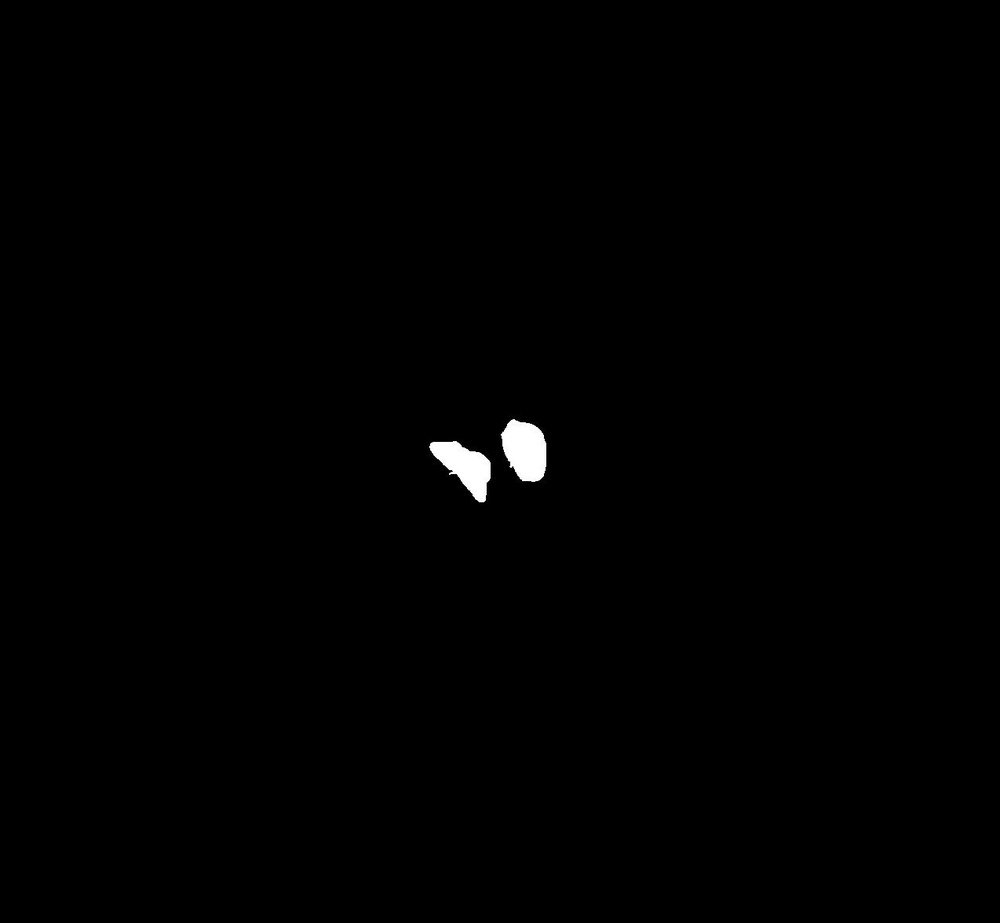
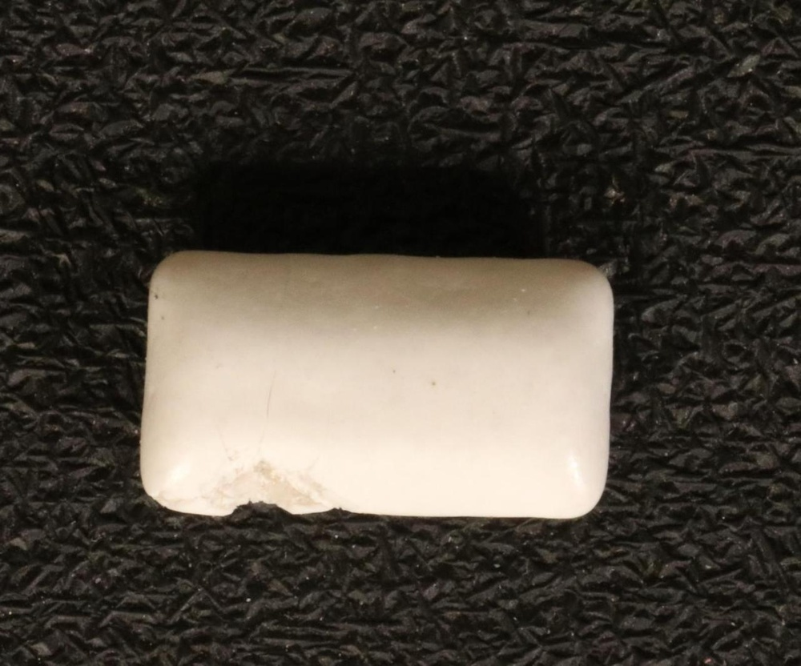
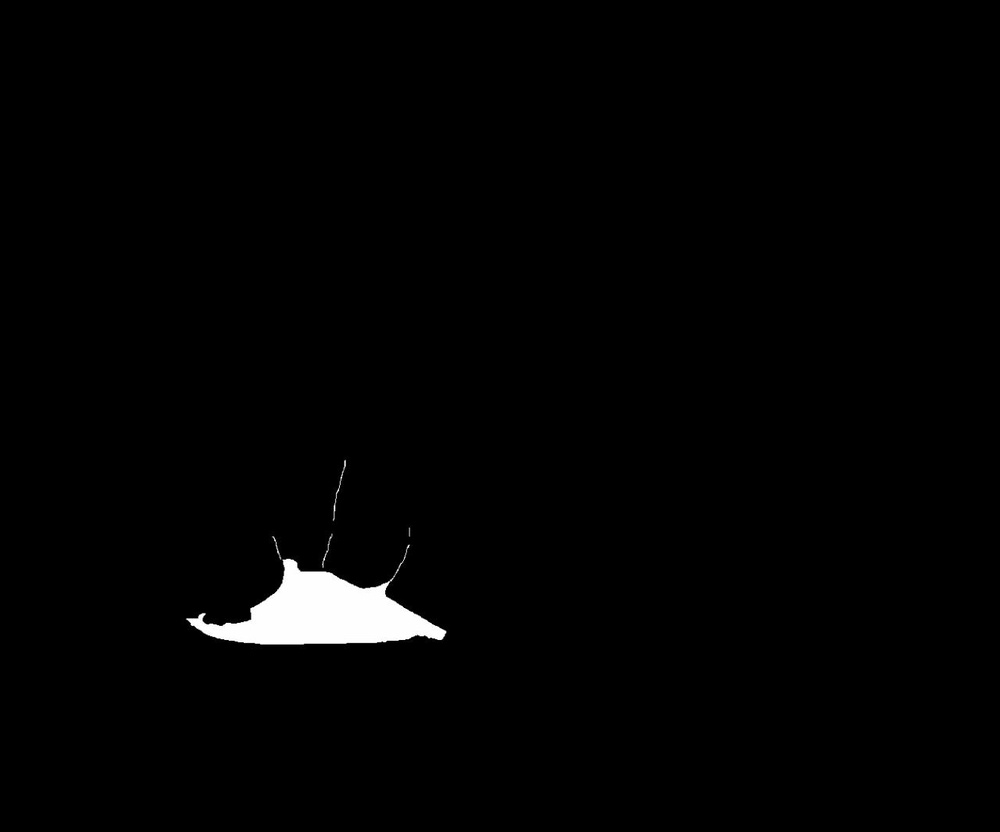
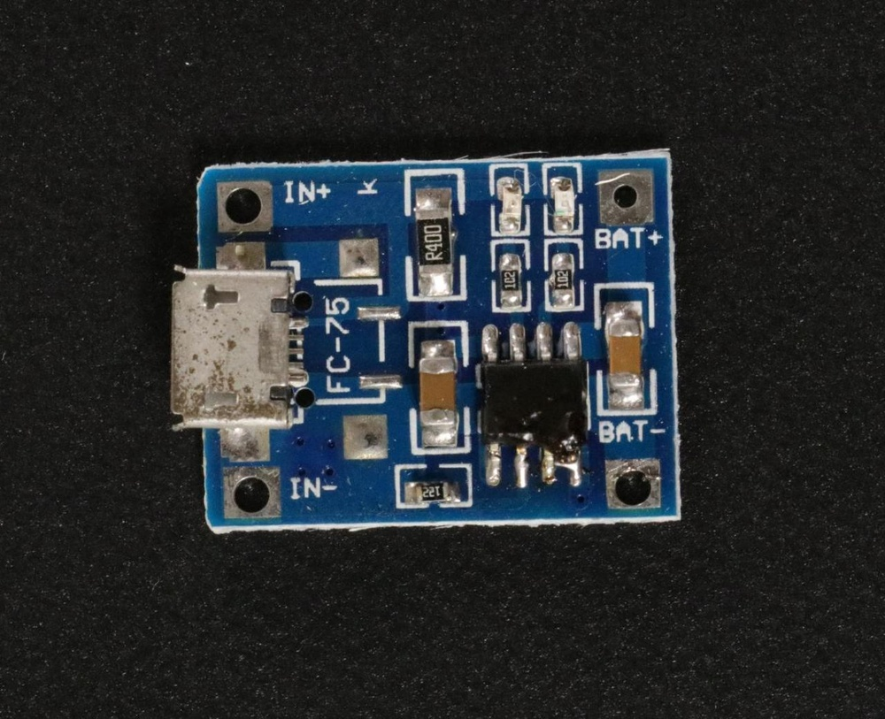
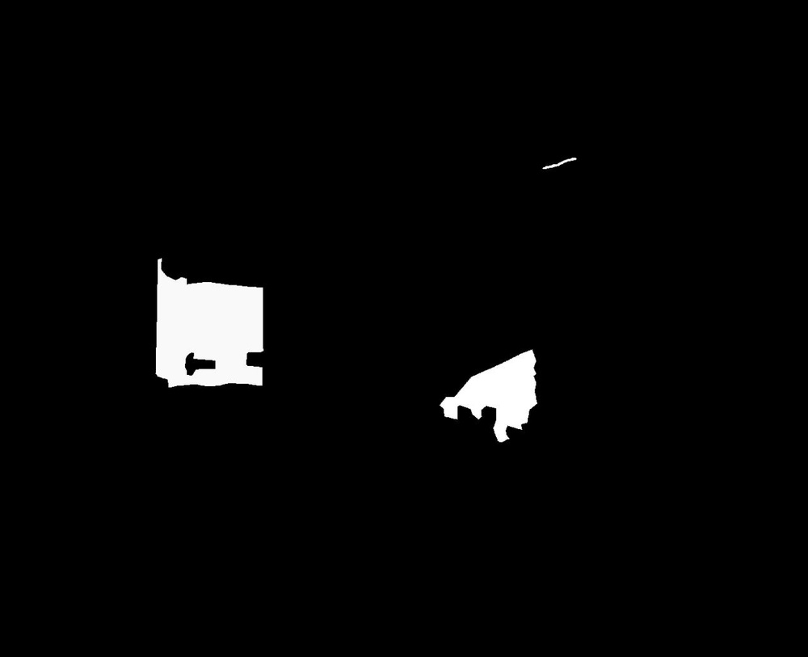
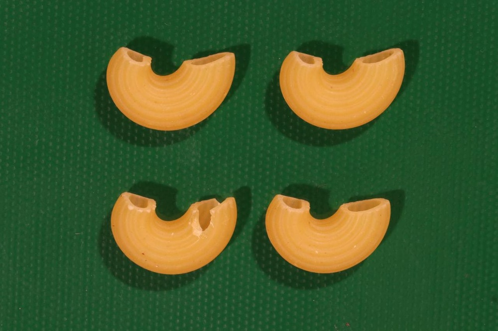

# A Zero-/Few-Shot Anomaly Classification and Segmentation Method for CVPR 2023 VAND Workshop Challenge Tracks 1&2: 1st Place on Zero-shot AD and 4th Place on Few-shot AD

**URL**: https://www.semanticscholar.org/paper/2dca371dca1a5bd0a91fbb5ac3bf255932dc5b19
**提交日期**: 2023-05-27
**作者**: Xuhai Chen; Yue Han; Jiangning Zhang
**引用次数**: 135
使用模型: deepseek-v3-1-terminus

## 1. 核心思想总结
作为学术论文分析专家，以下是根据您提供的标题和摘要整理的第一轮总结：

**标题：** 一种用于CVPR 2023 VAND研讨会挑战赛赛道1和2的零样本/少样本异常分类与分割方法：零样本异常检测第一名，少样本异常检测第四名

**简洁总结**

**1. 背景**
该研究旨在解决工业视觉检测中的核心挑战。由于工业产品种类繁多，开发一个能够快速适应众多类别、且无需或仅需少量正常参考图像的单一模型，是一个极具前景的研究方向。这项工作参与了CVPR 2023视觉异常与新颖性检测挑战赛的零样本和少样本赛道。

**2. 核心问题**
如何在“零样本”（完全没有正常样本参考）和“少样本”（仅有极少量正常样本参考）的苛刻条件下，实现对工业图像的高精度异常分类与像素级分割。

**3. 高层次方法**
*   **零样本设定：** 核心方法是基于CLIP模型进行改造。通过增加额外的线性层，将输入图像的特征映射到CLIP的联合嵌入空间中，使其能够与描述“正常”和“异常”的文本特征进行比对，从而生成异常热力图。
*   **少样本设定：** 在零样本方法的基础上，当有正常参考图像可用时，引入多个记忆库来存储这些参考图像的特征。在测试阶段，将测试图像的特征与记忆库中的正常特征进行比较，以检测异常。

**4. 主要贡献**
*   **有效解决方案：** 提出了一种统一的框架，能够同时处理零样本和少样本异常检测任务。
*   **卓越性能：** 在权威挑战赛中验证了方法的有效性。在零样本赛道获得总排名第一，其分割任务的F1分数比第二名显著高出0.0489。在少样本赛道获得总排名第四，其中分类F1分数（0.8687）在所有参赛队伍中排名第一。
*   **实践价值：** 为需要快速适应新产品的工业质检应用提供了实用且强大的技术路径。

## 2. 方法详解
好的，基于您提供的初步总结和论文方法章节内容，以下是对该论文方法的详细说明，重点描述了关键创新、算法/架构细节、关键步骤与整体流程。

### **论文方法详细说明**

本论文的核心是提出一个统一的框架，以解决工业视觉异常检测中的两大挑战：**零样本异常检测** 和 **少样本异常检测**。该方法巧妙地结合了预训练视觉-语言模型（CLIP）的强大泛化能力和基于记忆库的特征匹配技术。

#### **一、 整体流程与核心思想**

方法的整体流程可以概括为两个阶段：**1）特征提取与映射** 和 **2）异常分数计算**。其核心思想在于，无论是零样本还是少样本设定，最终都是通过计算测试图像与“正常”概念之间的差异来检测异常。

*   **零样本设定**：将“正常”和“异常”视为抽象的文本概念。通过CLIP模型，将测试图像的特征与这些文本提示词（如“一张正常产品的照片”、“一张有缺陷的产品的照片”）的特征进行相似度比较。
*   **少样本设定**：将“正常”定义为给定的一组正常参考图像所构成的特征集合。通过将测试图像的特征与这个“正常特征记忆库”进行匹配，来识别偏离正常模式的异常。

#### **二、 关键创新点**

1.  **基于CLIP的零样本异常热图生成**：这是该方法最主要的创新。它没有像传统方法那样在ImageNet等自然图像数据集上预训练特征提取器，而是直接利用CLIP的图像-文本对齐能力。通过引入一个简单的**投影层**，将图像局部特征（来自CLIP的ViT图像编码器）映射到与CLIP文本特征兼容的语义空间，从而可以直接进行像素级的文本-图像相似度计算，生成高质量的异常热力图。
2.  **统一框架下的双模式处理**：该方法使用几乎相同的骨干网络和流程处理两种截然不同的任务（零样本和少样本）。只需简单地“开关”记忆库模块，即可在两种模式间切换。这种设计提高了方法的实用性和简洁性。
3.  **针对工业场景的文本提示工程**：论文强调了为CLIP模型设计合适的文本提示词对于零样本性能至关重要。他们通过实验确定了最有效的提示词模板，这是实现高精度检测的关键一步。

#### **三、 算法/架构细节**

该方法的架构如下图所示（请根据文字描述理解）：

整个系统主要包含以下几个核心组件：

**1. 特征提取器：CLIP模型**
*   **图像编码器**：采用CLIP的Vision Transformer（ViT）作为图像编码器。输入图像被分割成多个图像块（patches），然后通过ViT处理。论文利用了ViT最后一层Transformer块产生的**patch token特征**，这些特征包含了丰富的局部视觉信息。
*   **文本编码器**：采用CLIP的文本编码器。输入是预先定义好的文本提示词，例如 `“A photo of a normal product”`（正常产品照片）和 `“A photo of a defective product”`（缺陷产品照片）。文本编码器将这些提示词编码为文本特征向量。

**2. 关键组件：投影层**
*   **目的**：CLIP的图像特征和文本特征虽然在一个联合空间内，但直接使用ViT的patch token特征与文本特征计算相似度效果不佳。这是因为这些patch token特征在训练时并未直接与文本特征对齐。
*   **结构**：论文引入了一个简单的**线性层（全连接层）** 作为投影层。该层将每个patch token的特征向量（通常是512维或768维）投影到一个新的特征空间，使得投影后的图像局部特征能够与CLIP的文本特征进行有效的余弦相似度计算。

**3. 核心模块：正常特征记忆库（仅用于少样本设定）**
*   **构建**：在少样本设定下，给定少量（如1张、2张、4张）正常参考图像。将这些图像依次通过上述的特征提取器和投影层，得到每一张参考图像所有patch位置的投影后特征。然后将所有这些特征向量存储在一个记忆库中。
*   **作用**：记忆库代表了当前被检测产品类别的“正常”外观模式。

#### **四、 关键步骤详解**

**步骤一：预处理与特征提取**
1.  将输入图像（测试图像或参考图像）调整到固定尺寸，并送入CLIP的ViT图像编码器。
2.  从ViT编码器的最后一层提取所有图像块对应的patch token特征。假设图像被分为N个块，则得到N个特征向量 `{v_i}_{i=1}^N`。
3.  将这些patch token特征通过**投影层**，得到投影后的特征 `{v'_i}_{i=1}^N`。

**步骤二：异常分数计算（此步骤因模式而异）**

**A. 零样本模式：**
1.  **文本特征编码**：使用CLIP文本编码器对预设的正负面提示词进行编码，得到“正常”文本特征 `t_normal` 和“异常”文本特征 `t_anomaly`。
2.  **像素级相似度计算**：对于测试图像的每一个投影后的patch特征 `v‘_i`，分别计算它与 `t_normal` 和 `t_anomaly` 的余弦相似度，得到 `S_i_normal` 和 `S_i_anomaly`。
3.  **生成异常热力图**：每个位置的异常分数可以简单地计算为 `S_i_anomaly - S_i_normal`。这个值越大，表示该位置越像“异常”而不像“正常”。将所有位置的异常分数组合并上采样到原图尺寸，即得到像素级的异常热力图。
4.  **图像级异常分类**：可以对整个热力图的异常分数进行聚合（如取最大值或平均值），得到一个图像级的异常分数，用于判断整张图像是否异常。

**B. 少样本模式：**
1.  **构建记忆库**：在测试开始前，先用所有可用的正常参考图像执行**步骤一**，并将得到的所有投影特征 `{v‘_ref}` 存入记忆库。
2.  **特征匹配**：对于测试图像的每一个投影后的patch特征 `v‘_i`，在记忆库中寻找其**最相似的K个近邻特征**（K-NN）。
3.  **计算异常分数**：该位置的异常分数由 `v‘_i` 与其K个近邻特征的平均相似度决定。相似度越低，异常分数越高。具体公式通常为 `1 - average_similarity`。
4.  **生成热力图与分类**：同零样本模式，将所有位置的异常分数组合成热力图，并聚合得到图像级分数。

**步骤三：后处理与输出**
*   对生成的异常热力图进行简单的后处理（如高斯平滑）以去除噪声。
*   根据任务要求，输出像素级的异常分割图（通过阈值化热力图得到）和图像级的正常/异常分类结果。

### **总结**

该论文的方法是一个设计精巧且高效的解决方案。其强大之处在于：
*   **零样本能力**：通过**投影层**桥接CLIP的图像与文本模态，实现了真正的零样本异常定位，无需任何训练或正常样本。
*   **少样本精度**：通过引入**记忆库**，将少样本问题转化为直观的特征匹配问题，利用少量正常样本快速适应新类别，提升了检测精度。
*   **实用性与统一性**：统一的架构使其非常适用于实际工业应用，能够根据可用的参考图像数据灵活地在两种模式间切换，为快速部署到新产品线提供了便利。

这种方法在CVPR 2023 VAND挑战赛中取得的优异成绩，充分证明了其在解决工业异常检测关键难题上的有效性和先进性。

## 3. 最终评述与分析
好的，结合前两轮提供的初步总结、方法详述以及论文的结论部分，现为您提供一份最终的综合评估。

### **关于《一种用于CVPR 2023 VAND研讨会挑战赛的零样本/少样本异常检测方法》的最终综合评估**

#### **1. 整体总结**

本论文提出了一种基于CLIP视觉-语言模型的统一框架，旨在解决工业异常检测中极具挑战性的**零样本**和**少样本**场景。该方法的核心创新在于通过一个简单的**投影层**，将CLIP模型提取的图像局部特征与其文本特征空间对齐，从而能够直接通过计算图像区域与“正常”、“异常”文本概念的相似度来生成像素级异常热力图。在少样本设定下，该方法进一步引入**基于记忆库的特征匹配**，利用少量正常样本精化检测结果。该框架在CVPR 2023 VAND挑战赛中得到了充分验证，在零样本赛道荣获第一名，在少样本赛道获得第四名（其中分类任务排名第一），证明了其卓越的有效性和实用性。

#### **2. 优势**

*   **强大的零样本泛化能力**：该方法最显著的优点是无需任何正常样本进行训练即可实现高质量的异常检测与分割。这使其能够“开箱即用”地快速适应无数种新的工业产品类别，解决了传统方法需要为每个类别收集大量数据并重新训练的瓶颈。
*   **统一的灵活架构**：框架设计精巧，通过简单地启用或禁用记忆库模块，即可无缝切换于零样本和少样本两种模式。这种统一性极大地增强了方法的实用价值，使其能够灵活应对不同数据可用性的实际工业场景。
*   **卓越的竞赛性能**：在权威的国际学术竞赛中取得顶级排名，尤其是零样本分割任务F1分数显著领先第二名，以及少样本分类任务排名第一，为方法的有效性提供了强有力的、客观的实证支持。
*   **巧妙利用预训练模型**：该方法没有从头开始训练模型，而是创造性地挖掘并微调了大规模预训练模型CLIP的潜力，将其在自然图像上的强大语义理解能力成功迁移至工业缺陷检测领域，实现了高性能与高效率的平衡。

#### **3. 局限性与不足之处**

*   **对CLIP模型和文本提示词的依赖**：方法的性能在很大程度上依赖于CLIP模型本身的能力及其训练数据分布。对于CLIP未曾见过或难以理解的缺陷类型，检测效果可能受限。同时，检测效果对预设的文本提示词（如“正常”、“异常”的具体表述）较为敏感，需要精心设计和调试。
*   **计算复杂度与效率问题**：虽然论文未明确强调，但基于ViT的特征提取和（在少样本模式下）大规模的K近邻搜索在计算上可能比较耗时，特别是在处理高分辨率图像或需要实时检测的场景下，可能对硬件资源有较高要求。
*   **细节分割能力可能受限**：依赖于ViT的patch特征可能导致生成的热力图边界不够精细，对于非常细小或边界模糊的缺陷，其像素级分割的精度可能不及一些专门设计的分割模型。
*   **泛化性的边界**：尽管在挑战赛的数据集上表现优异，但该方法在更极端、更复杂的工业环境（如严重遮挡、光照剧变、背景干扰大）下的鲁棒性和泛化能力仍有待于在更广泛的真实场景中进行验证。

#### **4. 潜在应用与影响**

*   **工业质量检测**：这是最直接的应用领域。该方法特别适用于**新产品快速上线**和**小批量、多品类**的生产线。当企业引入一款新产品时，可以立即使用零样本模式进行初步检测，随后只需收集少量正常样本即可切换到更精确的少样本模式，极大缩短了模型部署周期和成本。
*   **开放世界视觉理解**：该方法展示了利用先验知识（CLIP）和少量示例解决未知类别视觉任务的潜力。其思路可以推广到其他开放世界视觉任务中，如**新颖性检测**、**开放词汇分割**等，即识别出训练数据中未曾出现过的物体或概念。
*   **少样本学习研究**：该工作为少样本学习，特别是基于预训练模型的少样本适应，提供了一个成功的范例。其“投影层+记忆库”的简洁设计思路，对后续研究如何更高效地将大模型能力迁移到下游任务具有重要的启发意义。
*   **自动化机器学习**：该方法降低了应用高级计算机视觉技术的门槛，使得非专家用户也能通过提供简单的文本描述或极少数例子，来构建一个可用的异常检测系统，推动了AI应用的民主化。

**结论**：本论文是一项高质量、高实用性的研究工作。它精准地抓住了工业异常检测领域的核心痛点，并提出了一种创新、简洁且高效的解决方案。尽管存在一些依赖于预训练模型和计算效率方面的局限性，但其在权威竞赛中取得的优异成绩和清晰的应用前景，使其成为零样本/少样本异常检测领域的一个重要进展，具有显著的学术价值和广阔的工业应用潜力。

---

# 附录：论文图片

## 图 1

## 图 2

## 图 3

## 图 4

## 图 5

## 图 6

## 图 7

## 图 8

## 图 9

## 图 10

