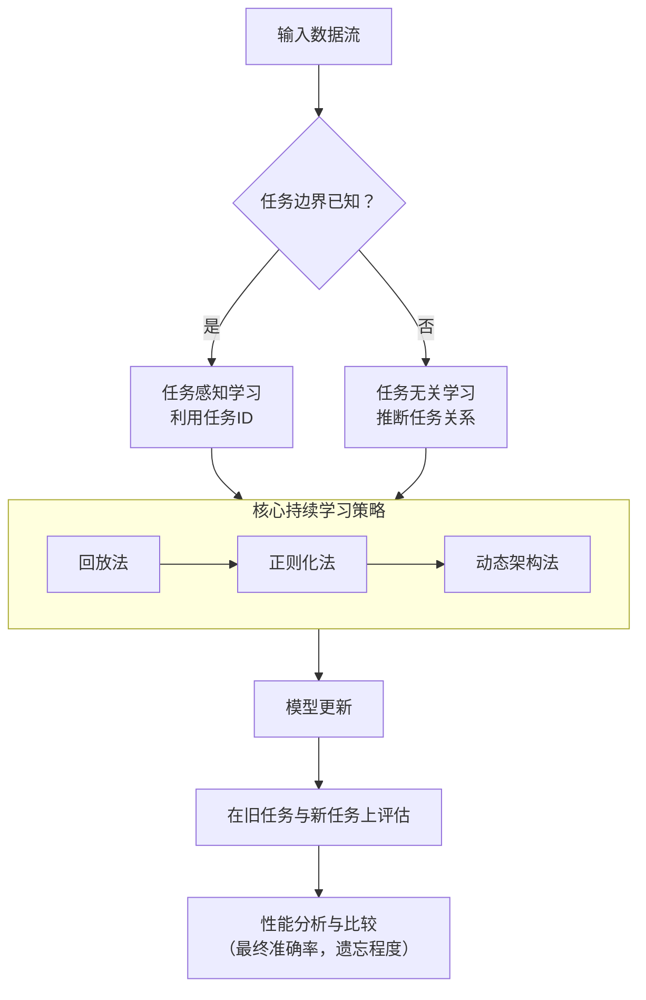
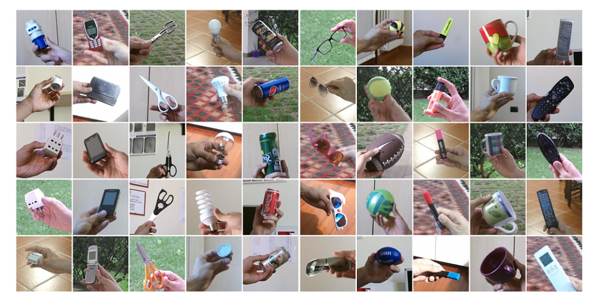
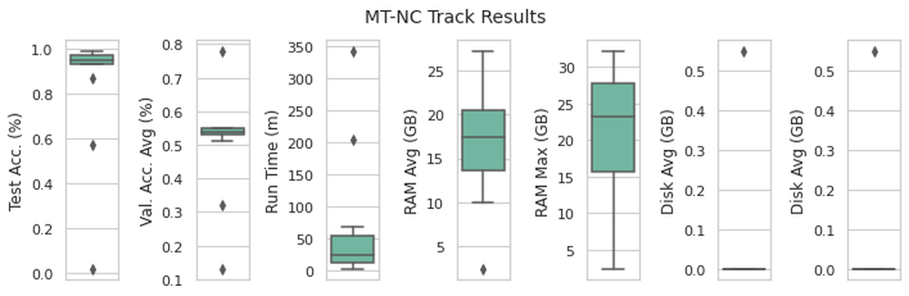
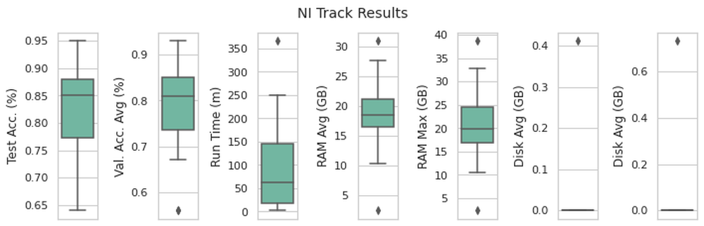
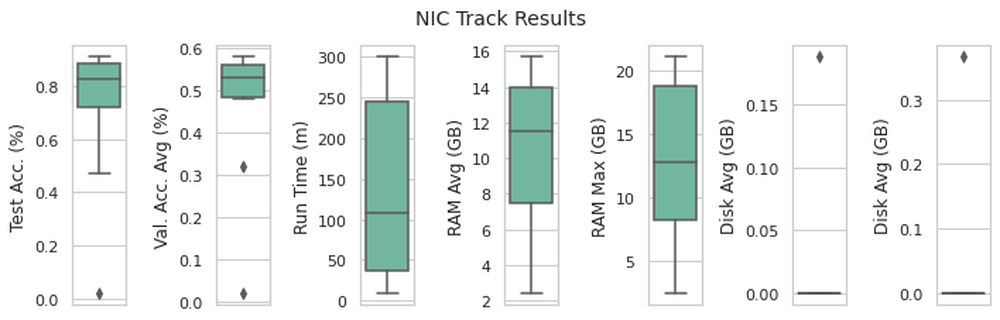
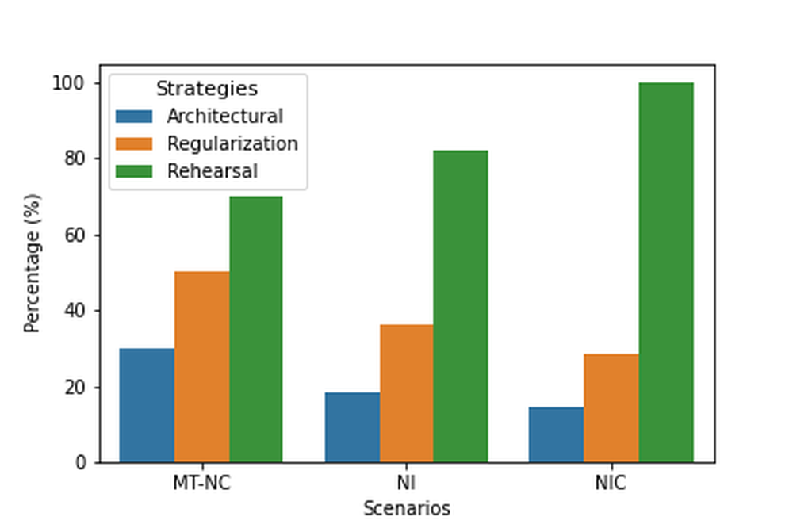

# CVPR 2020 Continual Learning in Computer Vision Competition: Approaches, Results, Current Challenges and Future Directions

**URL**: https://www.semanticscholar.org/paper/1b8295853d9239836c43b3ec8f83787448de08cc
**提交日期**: 2020-09-14
**作者**: Vincenzo Lomonaco; Lorenzo Pellegrini; Pau Rodríguez López; Massimo Caccia; Qi She; Yu Chen; Quentin Jodelet; Ruiping Wang; Zheda Mai; David Vázquez; G. I. Parisi; Nikhil Churamani; Marc Pickett; I. Laradji; D. Maltoni
**引用次数**: 48
使用模型: deepseek-v3-1-terminus

## 1. 核心思想总结
根据您提供的论文标题和引言，本第一轮总结如下：

**Background (背景)**
计算机视觉领域的持续学习（Continual Learning）旨在解决模型在顺序学习多个任务时出现的“灾难性遗忘”问题，即学习新任务后会遗忘旧任务的知识。该领域是迈向通用人工智能的关键一步，吸引了学术界和工业界的广泛关注。为推动此方向的研究，CVPR 2020 举办了第二届持续学习竞赛。

**Problem (问题)**
竞赛的核心问题是：如何设计一种学习系统，使其能够在不遗忘已学任务的情况下，持续、高效地从非独立同分布的数据流中学习新任务？具体挑战包括处理任务边界模糊或未知的场景（即“任务无关”持续学习），以及评估模型在旧任务和新任务上的整体性能平衡。

**Method (high-level) (方法 - 高层次概述)**
竞赛组织者提供了一个大规模数据集（Seq-CIFAR-100 和 Seq-miniImageNet）和统一的评估协议。参赛者提交的解决方案涵盖了多种持续学习的主流方法，主要包括：基于正则化的方法（通过约束参数变化来保护旧知识）、基于动态架构的方法（为不同任务扩展网络结构）和基于回放的方法（存储部分旧数据并与新数据一起训练）。竞赛特别关注了任务无关的评估设置。

**Contribution (贡献)**
本文的主要贡献在于对CVPR 2020持续学习竞赛进行了全面总结。它系统地回顾和比较了不同参赛队伍提出的先进方法，分析了它们的相对性能与优劣。此外，文章基于竞赛结果，清晰地指出了当前持续学习领域面临的主要挑战，并为未来的研究方向提供了有价值的见解和指引。

## 2. 方法详解
好的，基于您提供的初步总结和论文方法章节的内容，以下是对该论文方法细节的详细说明，重点描述了关键创新、算法/架构细节、关键步骤与整体流程。

---

### **论文方法细节详述**

本文的方法章节核心并非提出一种单一的新算法，而是**系统性地总结、分类和评估了CVPR 2020持续学习竞赛中顶尖参赛方案所采用的技术路线**。其“方法”体现在构建一个统一的评估框架，并对多种持续学习策略进行细致的剖析和比较。

#### **一、 关键创新与核心方法框架**

论文方法部分的核心创新点在于：

1.  **统一的评估基准构建：** 这不是一个单纯的竞赛结果报告，而是构建了一个标准化的、可复现的持续学习研究平台。它定义了**标准数据集、精确的评估协议、以及清晰的赛道划分**，为公平比较不同方法提供了基础。
2.  **多维度方法学分类与融合分析：** 论文没有停留在简单的性能排名，而是深入到底层技术，将顶尖方案归类到持续学习的三大主流范式中，并重点分析了**如何将这些范式中的技术进行有效融合**，这揭示了当前最有效的技术趋势。
3.  **对“任务无关”设置的重点关注：** 竞赛特别强调了任务无关评估，这与现实场景更接近。论文对此设置的参赛方法进行了深入解读，分析了处理模糊任务边界的技术策略，这是对持续学习领域的一个重要贡献。

#### **二、 算法/架构细节与关键技术**

论文将参赛方案中表现优异的方法归纳为三大类，并详细阐述了每类中的关键技术与代表性算法。

**1. 基于回放的方法 - 主流与基石**
这是竞赛中最流行且最有效的一类方法。其核心思想是保存一小部分旧任务的数据（称为“记忆缓冲区”或“情节记忆”），在学习新任务时与新数据一起训练。

*   **关键创新/细节：**
    *   **高效记忆管理策略：** 如何选择和更新记忆缓冲区中的数据是关键。论文提到的方法包括：
        *   **随机选择：** 简单随机采样。
        *   **基于效用的选择：** 根据样本的“重要性”进行选择，例如选择模型难以分类的样本（最具信息量的样本）或最具代表性的原型。
    *   **回放策略的优化：**
        *   **一致性约束/知识蒸馏：** 在回放过程中，不仅使用旧数据的标签，更重要的是利用旧模型对这批数据的输出作为“软目标”来约束新模型的训练，从而更有效地保留旧知识。这通常与**知识蒸馏** 技术结合。
        *   **对抗性回放：** 一些方法引入生成对抗网络来生成旧数据的伪样本，以扩充记忆缓冲区，减少对真实数据的依赖。

**2. 基于正则化的方法 - 约束参数变化**
这类方法不存储旧数据，而是通过向损失函数中添加正则化项，约束模型参数在学新任务时不要偏离旧任务太远。

*   **关键创新/细节：**
    *   **重要性权重计算：** 核心是确定每个参数对于旧任务的重要性。论文中提到的代表性算法是**EWC** 的变种。
        *   **流程：** 学完一个任务后，计算模型参数（通常是权重）的Fisher信息矩阵或基于梯度的重要性度量，重要性高的参数在后续学习中被施加更强的约束（惩罚其变化）。
    *   **与其他方法的融合：** 纯正则化方法在竞赛中表现通常不如回放方法。但论文指出，**将正则化作为辅助手段与回放方法结合**是常见且有效的策略，例如在回放训练的基础上增加参数正则化，形成双重保护。

**3. 基于动态架构的方法 - 扩展网络容量**
这类方法通过为每个新任务分配独立的网络模块（如额外的神经元、层或子网络）来避免任务间的干扰。

*   **关键创新/细节：**
    *   **任务标识符的隐式推断：** 在任务无关的设置下，模型无法获得明确的任务ID。因此，动态架构方法的关键创新是**如何自动检测新任务并触发网络扩展**。
        *   **算法流程：** 当新数据到来时，模型会基于输入数据与现有网络模块的“匹配度”进行计算。如果匹配度低于某个阈值，则判定为新任务，并动态添加新的子网络或参数。
    *   **参数效率与剪枝：** 为了避免网络无限膨胀，先进的方法会引入参数剪枝策略，在扩展的同时淘汰冗余参数，保持模型的紧凑性。

#### **三、 关键步骤与整体流程**

论文所总结的竞赛方法流程可以概括为以下几个关键步骤，下图清晰地展示了这一过程：

**流程详解：**

1.  **初始化与赛道划分：**
    *   所有方法从一个共同的基准模型（如ResNet-18）开始。
    *   流程首先分为两大评估赛道：**任务感知**（已知任务边界）和**任务无关**（未知任务边界）。这是所有方法面临的第一个关键分支。

2.  **顺序学习循环：**
    *   模型按顺序接收任务T1, T2, ..., Tn的数据。
    *   对于每个新任务Tk：
        *   **数据准备：** 如果是回放方法，会从记忆缓冲区中取出少量旧数据，与当前新任务Tk的数据混合。
        *   **模型训练/更新：**
            *   **回放法：** 使用混合数据训练模型，并通常结合一致性损失（如蒸馏损失）和正则化损失。
            *   **正则化法：** 仅使用Tk的数据训练，但总损失函数包含原始分类损失和针对重要参数的正则化项。
            *   **动态架构法：** 推断Tk是否为全新任务，如果是则扩展网络，然后使用Tk的数据训练新添加的参数，同时固定或弱约束旧参数。
        *   **记忆更新（针对回放法）：** 学完Tk后，按照既定策略（如随机、基于效用）更新记忆缓冲区，纳入Tk的部分样本。

3.  **评估与分析：**
    *   在整个学习过程结束后或过程中，在**所有已学任务**的测试集上评估模型的最终性能。
    *   论文使用核心指标（如平均准确率、遗忘程度）来分析不同方法的整体效果，并深入比较不同技术融合策略（如“回放+正则化”）的优势与短板。

综上所述，这篇论文的方法章节通过构建一个严谨的评估框架，并对参赛的先进持续学习算法进行解构、归类和对比，清晰地描绘了当时领域内的技术前沿图景，特别是揭示了**基于回放的方法（尤其是与蒸馏、正则化技术融合的策略）在解决灾难性遗忘问题上的有效性和优越性**，并为后续研究指明了方向。

## 3. 最终评述与分析
好的，结合前两轮返回的信息与论文的结论部分，以下是对这篇关于CVPR 2020持续学习竞赛的论文的最终综合评估。

### **最终综合评估**

**1) 整体总结**
本论文对CVPR 2020持续学习竞赛进行了全面且深入的总结，其核心价值在于构建了一个标准化的评估基准，并对参赛的先进持续学习方法进行了系统性的剖析和比较。论文明确指出，在应对持续学习的核心挑战——“灾难性遗忘”问题上，**基于回放的方法是目前最有效和主流的技术路线**。尤其重要的是，论文揭示了将回放策略与知识蒸馏、正则化等技术融合是提升性能的关键。此外，论文重点关注的“任务无关”评估设置，为将持续学习技术应用于更贴近现实的场景提供了重要见解。总体而言，该工作不仅是一份竞赛报告，更是对持续学习领域发展现状的一次重要盘点，为后续研究树立了标杆并指明了方向。

**2) 优势**
*   **基准性与系统性：** 论文通过统一定义的数据集（Seq-CIFAR-100, Seq-miniImageNet）、评估协议和赛道（任务感知 vs. 任务无关），为持续学习领域创建了一个公平、可复现的基准平台，极大促进了不同方法间的可比性。
*   **深刻的洞察力：** 论文超越了简单的性能排名，深入到底层技术，归纳出三大技术范式（回放、正则化、动态架构），并重点分析了**技术融合的趋势**（如“回放+蒸馏+正则化”），指出了当前最优性能背后的核心驱动因素。
*   **前瞻性与实用性：** 论文特别强调并深入分析了“任务无关”这一更具挑战性和实用价值的设置，引导领域关注任务边界模糊的真实应用场景，对推动技术落地具有重要意义。
*   **清晰的指引性：** 基于竞赛结果，论文清晰地总结了现有方法的有效性，并指出了未来研究的潜在突破口，对领域内的研究人员具有很高的参考价值。

**3) 局限性与不足**
*   **方法的局限性（基于论文结论）：** 论文本身并未提出新算法，而是对现有方法进行总结。因此，其结论也反映了当时持续学习技术本身固有的局限性：
    *   **回放方法的存储依赖：** 表现最佳的回放方法仍需存储部分旧数据，这在数据隐私要求严格或存储资源极度受限的场景中可能不适用。
    *   **正则化方法的性能瓶颈：** 纯正则化方法在性能上普遍不及回放方法，表明仅靠约束参数变化来防止遗忘的能力存在上限。
    *   **动态架构方法的可扩展性挑战：** 动态架构方法面临模型容量随着任务数量线性增长的风险，其可扩展性和参数效率仍是待解决的关键问题。
*   **竞赛范围的局限性：** 竞赛的评估场景（如特定的数据集、任务序列）毕竟是有限的，论文结论在更复杂或差异巨大的任务流中的普适性仍需进一步验证。

**4) 潜在应用与启示**
*   **学术启示：** 论文为持续学习研究提供了明确的路线图。未来的工作可以：
    *   致力于开发更高效、更隐私安全的**无数据回放技术**（如使用生成模型）。
    *   探索将回放策略与其他范式更深层次的**融合架构**。
    *   在更复杂的**任务无关**和**在线学习**场景下进行创新。
*   **实际应用前景：** 竞赛中验证的有效技术可直接推动诸多现实应用的发展：
    *   **自适应系统：** 构建能够终身学习、不断适应新环境或新用户需求的智能系统，如个性化推荐系统、智能家居助手。
    *   **机器人技术：** 使机器人能够在非结构化环境中连续学习新技能，而不会遗忘旧技能。
    *   **医疗影像分析：** 让模型能够持续学习来自不同医院、不同设备的新疾病数据，同时保持对既往疾病诊断的准确性。
    *   **资源受限设备：** 论文对方法效率的分析有助于筛选适合在边缘设备上运行的持续学习算法。

综上所述，这篇论文通过一次高水平的竞赛，成功地对持续学习领域进行了一次“CT扫描”，清晰呈现了其技术脉络、现状与挑战，对该领域的发展起到了承前启后的重要作用。

---

# 附录：论文图片

## 图 1

## 图 2

## 图 3

## 图 4

## 图 5

