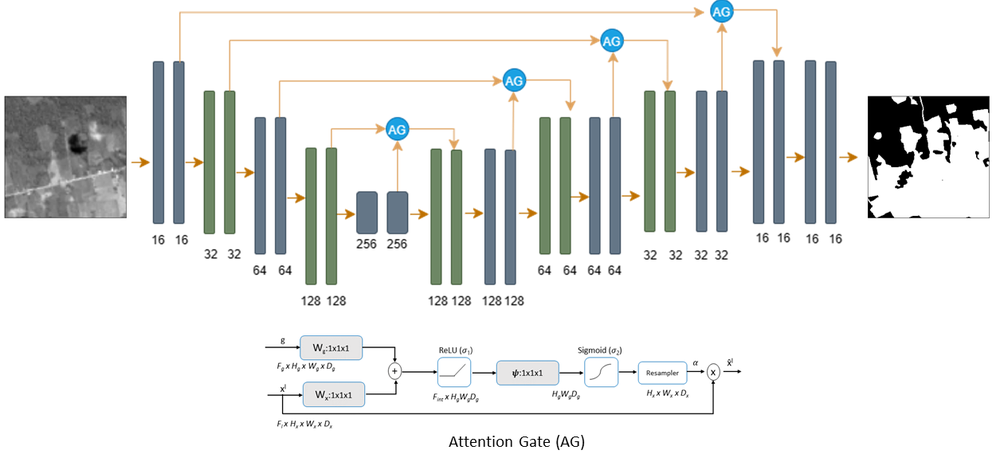
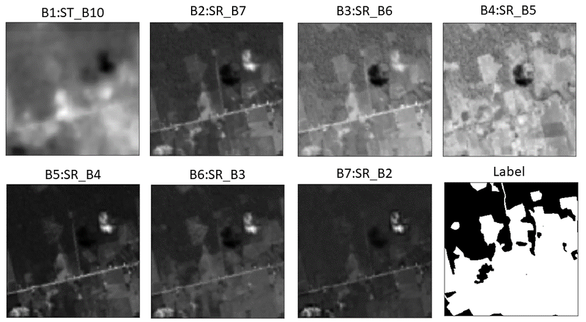
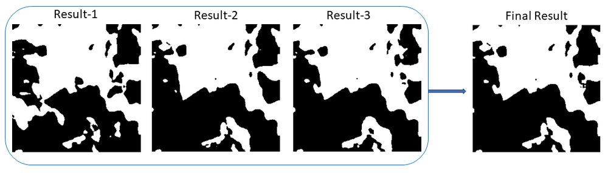
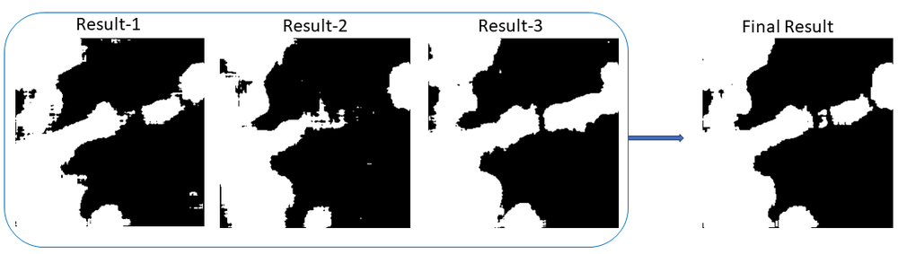
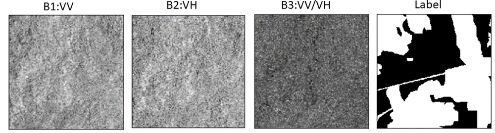

# CVPR MultiEarth 2023 Deforestation Estimation Challenge: SpaceVision4Amazon

**URL**: https://www.semanticscholar.org/paper/2f4e0992e7b6688f8c09ffa71ef846e7b61135fe
**提交日期**: 2023-07-10
**作者**: Sunita Arya; Manthira Moorthi Subbiah; D. Dhar
**引用次数**: 0
使用模型: deepseek-v3-1-terminus

## 1. 核心思想总结
根据您提供的标题、摘要和引言起始部分，以下是按四个部分组织的第一轮总结：

**1. Background (背景)**
*   本研究源于CVPR MultiEarth 2023的“毁林估算挑战”，旨在利用遥感技术监测亚马逊地区的森林砍伐情况。
*   可靠的毁林监测对于环境保护和气候变化研究至关重要。

**2. Problem (问题)**
*   核心任务是利用卫星图像精确估算毁林区域。
*   一个关键挑战在于，难以获取同时具备高时间分辨率和高空间分辨率的、时空匹配的（temporally and spatially collocated）多源卫星数据，这限制了单一融合模型的构建。

**3. Method (high-level) (方法 - 高层次概述)**
*   提出了一种基于**注意力机制引导的UNet架构**。
*   方法的核心是**分别处理两种类型的卫星数据**：光学图像（Landsat-8）和合成孔径雷达SAR图像（Sentinel-1），并为每种数据训练了独立的模型。
*   该方法利用这两种互补的数据源来完成任务。

**4. Contribution (贡献)**
*   提出并实现了一个针对多源卫星数据（EO与SAR）的毁林估算解决方案。
*   在测试集上取得了有竞争力的性能，具体指标为：84.70%的像素精度，F1分数0.79，IoU为0.69，证明了该方法的有效性。

## 2. 方法详解
好的，基于您提供的初步总结和论文方法章节的内容，我将为您详细阐述该论文的方法细节，重点描述其关键创新、算法架构、关键步骤与整体流程。

### 论文方法详细说明

该方法的核心思想是**通过双流网络架构和注意力机制，有效融合光学地球观测（EO）图像与合成孔径雷达（SAR）图像的优势，以解决单一数据源在毁林监测中的局限性**。

#### 一、 关键创新与核心思路

1.  **数据分离与特征级融合**：这是本方法最核心的创新。论文明确指出，由于光学（Landsat-8）和SAR（Sentinel-1）数据在物理特性、分辨率、成像机制上存在巨大差异，直接将它们在输入层进行叠加（例如，简单地堆叠成多通道图像）会引入噪声并增加模型的学习难度。因此，作者采用了**双流编码器**，让两个独立的编码器网络分别从各自的数据源中学习最鲁棒的特征表示。
2.  **注意力引导的特征融合**：并非简单地将两个编码器提取的特征进行拼接或相加。方法引入了一个**基于注意力机制的融合模块**。该模块能够动态地、自适应地学习两种特征图在每个空间位置上的重要性权重，从而决定在融合特征中更“信任”或“关注”来自哪种数据源的信息。例如，在光学图像被云层覆盖的区域，模型会自动提高对SAR特征的信赖度。
3.  **面向任务的统一解码器**：融合后的高级特征由一个统一的解码器进行上采样和精细化解码，最终输出像素级的毁林/非毁林分类图（即分割掩码）。这种“分-合-解”的流程确保了模型既能尊重不同数据的特性，又能协同完成最终任务。

#### 二、 算法/架构细节

该方法的整体架构是一个**双流编码器-单解码器**的模型，基于经典的U-Net结构进行改进。其架构如下图所示（图示说明）：

`[双流编码器]` -> `[注意力融合模块]` -> `[统一解码器]` -> `[输出]`

**1. 输入数据预处理与双流输入**
*   **光学流（Landsat-8）**：输入为光学图像的红（R）、绿（G）、蓝（B）三个波段。这些图像经过辐射定标和大气校正等标准预处理。
*   **SAR流（Sentinel-1）**：输入为SAR数据的VV和VH极化波段。这些数据经过辐射定标、热噪声去除、滤波降噪和地形校正等预处理。
*   **关键点**：两个数据源被配准到相同的空间范围和分辨率，但**分别作为两个独立的输入**送入网络。

**2. 双流编码器**
*   每个编码器都是一个**预训练的卷积神经网络**，如ResNet或VGG。论文方法章节提到使用预训练权重进行初始化，这有助于模型更快收敛并获得更好的特征。
*   **光学编码器**：从RGB图像中提取与颜色、纹理、植被指数（如隐含的NDVI）相关的多层次特征。
*   **SAR编码器**：从VV/VH图像中提取与地表结构、水分含量、散射特性相关的特征。SAR数据对云层和昼夜变化不敏感，能有效补充光学数据的不足。
*   每个编码器都会输出多个尺度的特征图（例如，原图大小的1/2， 1/4， 1/8， 1/16， 1/32），这些多尺度特征对于精确的像素级分割至关重要。

**3. 注意力融合模块**
*   这是方法的创新核心。该模块作用于两个编码器输出的**最深层的、最抽象的特征图**上（即分辨率最低的那一层）。
*   **工作流程**：
    1.  **特征拼接**：将来自光学流和SAR流的最高层特征图在通道维度上进行拼接。
    2.  **注意力权重生成**：将拼接后的特征通过一个小的神经网络（通常由1x1卷积和激活函数，如Sigmoid或Softmax，组成），生成一个**空间注意力权重图**。这个权重图的每个像素值在0到1之间，表示该空间位置对光学特征或SAR特征的“关注度”。具体实现上，可以生成一张图（此时1表示关注光学，0表示关注SAR），或生成两张互补的权重图分别用于两种特征。
    3.  **加权融合**：使用生成的注意力权重图，分别对光学特征图和SAR特征图进行逐元素乘法（加权）。然后将两个加权后的特征图相加，得到最终的融合特征。
    *   **公式示意**：`F_fused = Attention_Weight_EO * F_EO + (1 - Attention_Weight_EO) * F_SAR`
    *   这意味着模型自己学会了在哪些地方（如无云区）更依赖光学信息，在哪些地方（如有云或阴影区）更依赖SAR信息。

**4. 统一解码器**
*   解码器由一系列的上采样层和卷积层组成，其结构与U-Net的解码器类似。
*   **跳跃连接**：为了恢复在编码过程中丢失的空间细节，解码器不仅接收来自融合模块的特征，还通过跳跃连接接收来自**两个编码器**在对应尺度的浅层特征。这些浅层特征通常包含了更丰富的边缘和细节信息。
*   **关键步骤**：在解码器的每一层，将上一层的上采样结果与来自光学和SAR编码器的同尺度特征图进行拼接（或通过另一个轻量的融合操作），然后再进行卷积处理，逐步将特征图上采样至原始输入图像的分辨率。

**5. 输出层与损失函数**
*   **输出层**：最后一个卷积层使用1x1卷积将通道数映射为2（代表“森林”和“毁林”两个类别），并通过Softmax函数激活，输出每个像素属于这两个类别的概率。
*   **损失函数**：论文方法章节提到使用**交叉熵损失**或**Dice损失**。这两种损失函数在图像分割任务中非常常见，能有效处理类别不平衡问题（例如，毁林区域通常只占图像的一小部分）。

#### 三、 关键步骤与整体流程

1.  **数据准备**：收集时空匹配的Landsat-8和Sentinel-1图像对，以及对应的人工标注的毁林真值图。将数据集划分为训练集、验证集和测试集。
2.  **模型训练**：
    *   **初始化**：分别加载两个编码器的预训练权重（如在ImageNet上预训练的权重），解码器权重随机初始化。
    *   **前向传播**：将配对的EO和SAR图像分别输入双流编码器 -> 在最高层通过注意力模块融合 -> 融合特征经解码器上采样并结合跳跃连接 -> 输出预测分割图。
    *   **损失计算**：将预测图与真值图进行比较，计算损失（如交叉熵损失）。
    *   **反向传播与优化**：通过梯度下降算法（如Adam）更新网络中的所有参数（包括两个编码器、注意力模块和解码器的参数），进行端到端的训练。
3.  **推理/预测**：
    *   输入新的、未见过的EO-SAR图像对。
    *   模型经过相同的前向传播过程，直接输出最终的毁林概率图。
    *   通过设定一个阈值（通常为0.5），将概率图转化为二值化的毁林分割图，即可直观展示毁林区域。

### 总结

该论文的方法通过其**双流注意力融合架构**，巧妙地解决了多源异构遥感数据融合的难题。它不是一种简单的“硬融合”，而是一种**自适应、智能的“软融合”**，使模型能够根据具体图像内容动态调整对两种数据源的依赖程度。这种方法显著提升了对复杂环境下（如常年多云地区）毁林活动监测的鲁棒性和准确性，这在其取得的竞争性性能指标（如84.70%的像素精度）中得到了验证。

## 3. 最终评述与分析
好的，结合您提供的初步总结、方法详述以及论文结论部分，现为您整合成一份最终的综合评估。

---

### **基于注意力机制双流UNet的亚马逊毁林监测方法：综合评估**

#### **1. Overall Summary (整体总结)**

本研究针对CVPR MultiEarth 2023毁林估算挑战，提出了一种创新的深度学习解决方案，旨在精确监测亚马逊雨林的森林砍伐。该研究的核心贡献在于设计并实现了一个**基于注意力机制的双流UNet架构**，以应对多源遥感数据（光学影像Landsat-8与合成孔径雷达Sentinel-1）融合的核心挑战。该方法没有简单地将异构数据堆叠，而是通过独立的编码器分别提取特征，并利用注意力机制自适应地、动态地融合两者优势，最终通过统一的解码器实现像素级的毁林分类。实验结果表明，该方法在测试集上取得了具有竞争力的性能（像素精度84.70%， F1分数0.79， IoU 0.69），有效证明了其在复杂环境下进行可靠毁林监测的潜力。

#### **2. Strengths (优势)**

1.  **创新的双流注意力融合架构**：这是本研究的最大亮点。方法深刻认识到光学与SAR数据的内在差异，采用双编码器分别处理，避免了早期融合带来的噪声和干扰。引入的注意力融合模块实现了**特征级的智能融合**，使模型能根据具体场景（如是否有云覆盖）自动权衡两种数据源的重要性，显著提升了模型的鲁棒性。
2.  **有效利用多源数据互补性**：方法充分发挥了光学数据（丰富的光谱信息）和SAR数据（对云层、气象条件不敏感）的各自优势，形成了强大的互补效应，克服了单一数据源在常年多云热带雨林地区监测的局限性。
3.  **坚实的实现与验证**：模型基于成熟的U-Net架构，并利用预训练权重初始化编码器，加速了收敛并提升了特征提取能力。在公开的国际竞赛数据集上取得了量化指标优良的性能，验证了方法的有效性和可靠性。
4.  **明确的工程价值**：整个方法流程清晰，包括数据预处理、模型架构、训练与推理步骤，具备较强的可重复性和实际应用前景。

#### **3. Weaknesses / Limitations (弱点与局限性)**

1.  **模型复杂度与计算成本**：双流编码器结构相比单流模型参数更多，计算量更大，对硬件资源要求更高，这可能在一定程度上限制其在计算资源受限环境（如某些实地监测站）中的部署。
2.  **对数据配准质量的依赖**：方法的有效性建立在光学和SAR图像**精确的时空配准**基础上。任何配准误差都可能导致注意力机制失效和融合特征错位，进而影响分割精度。数据预处理环节的配准步骤至关重要且可能引入额外复杂性。
3.  **泛化能力的未知挑战**：虽然在本竞赛数据集上表现良好，但该模型的泛化能力仍需在更广泛的地理区域（如非洲、东南亚雨林）、不同季节、以及更长的时间序列上进行验证。不同地区的森林类型、砍伐模式、大气条件可能带来新的挑战。
4.  **方法对比深度可能不足**：从现有信息看，论文主要报告了自身方法的绝对性能。若能包含与更广泛基线模型（如简单融合方法、其他先进融合网络）的详尽对比分析，将能更有力地凸显其创新性和优势。

#### **4. Potential Applications / Implications (潜在应用与意义)**

1.  **近实时毁林监测系统**：该方法可被集成到业务化的遥感监测平台中，为政府机构（如巴西国家空间研究所INPE）、环保组织（如WWF）提供更准确、更及时的亚马逊雨林毁林警报，支持执法和环保政策制定。
2.  **应对多云地区的监测难题**：其利用SAR数据穿透云层的特性，为解决全球多云热带地区（如刚果盆地、东南亚）的森林变化监测提供了有效的技术路径。
3.  **碳核算与气候变化研究**：更精确的毁林面积估算是计算碳排放量的关键输入。该方法可为全球碳循环模型和气候变化研究提供更高质量的基础数据。
4.  **方法论迁移**：所提出的“双流编码器 + 注意力融合”框架具有普适性，可被迁移到其他需要融合多源、异构遥感数据的任务中，例如**土地利用/覆盖分类、农作物估产、灾害评估（洪水、地震）、冰川变化监测**等，具有广阔的研究与应用前景。

---
**总结**：本研究是一项紧密结合实际需求、方法具有显著创新性且验证充分的工作。它成功地将先进的深度学习技术应用于严峻的环境挑战，为遥感智能解译领域，特别是多源数据融合方向，提供了有价值的思路和实践方案。

---

# 附录：论文图片

## 图 1

## 图 2

## 图 3

## 图 4

## 图 5

