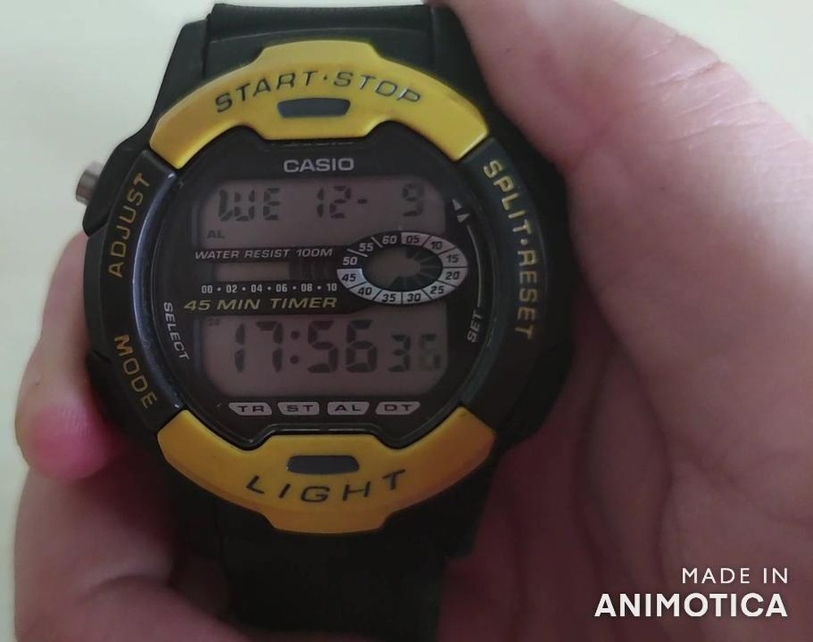
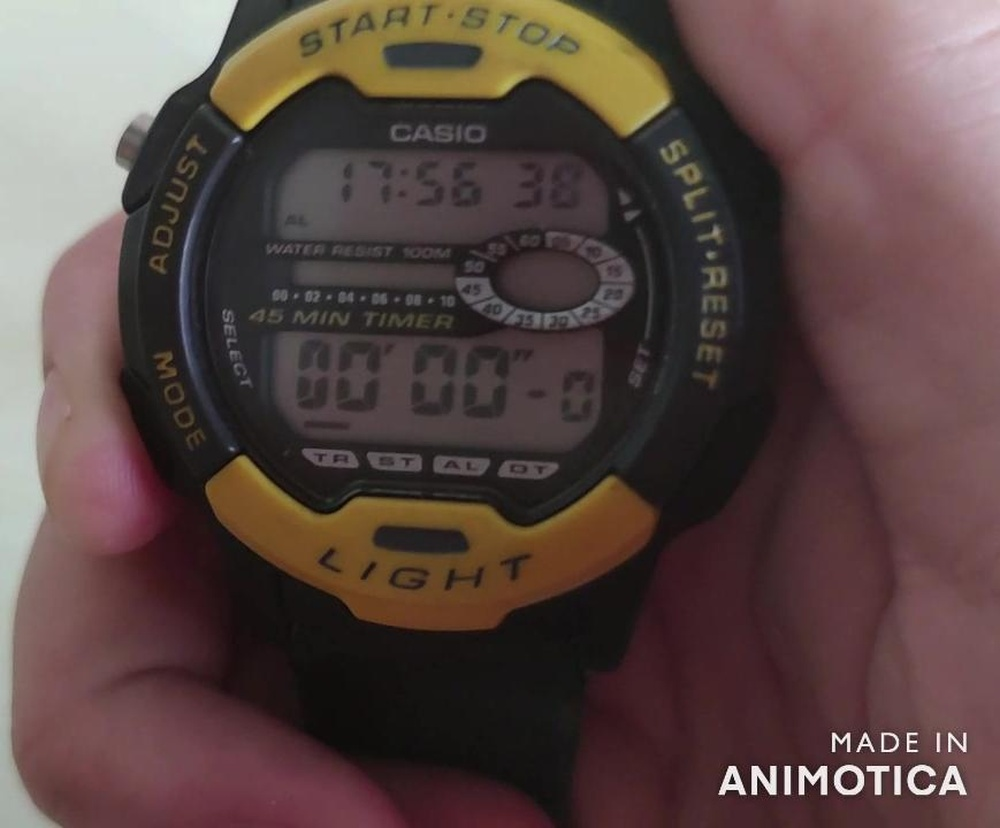
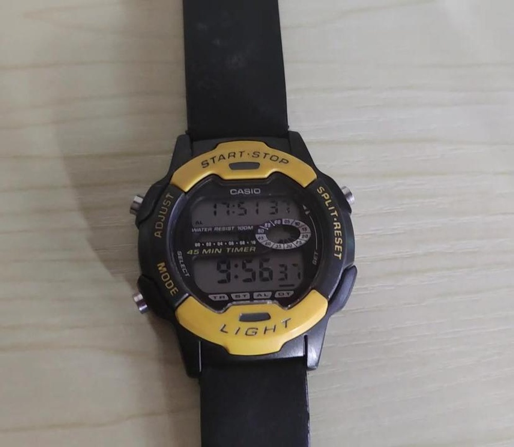
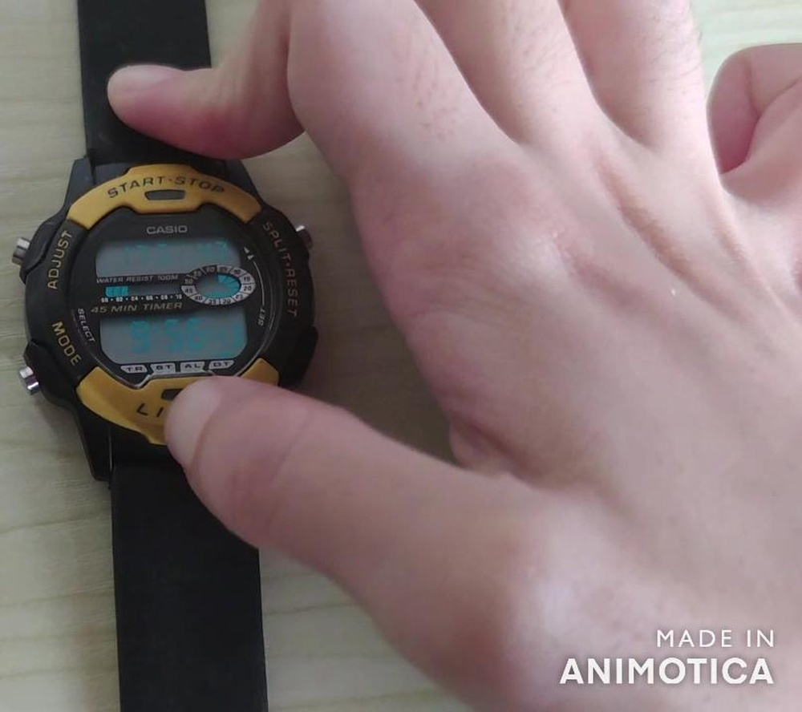
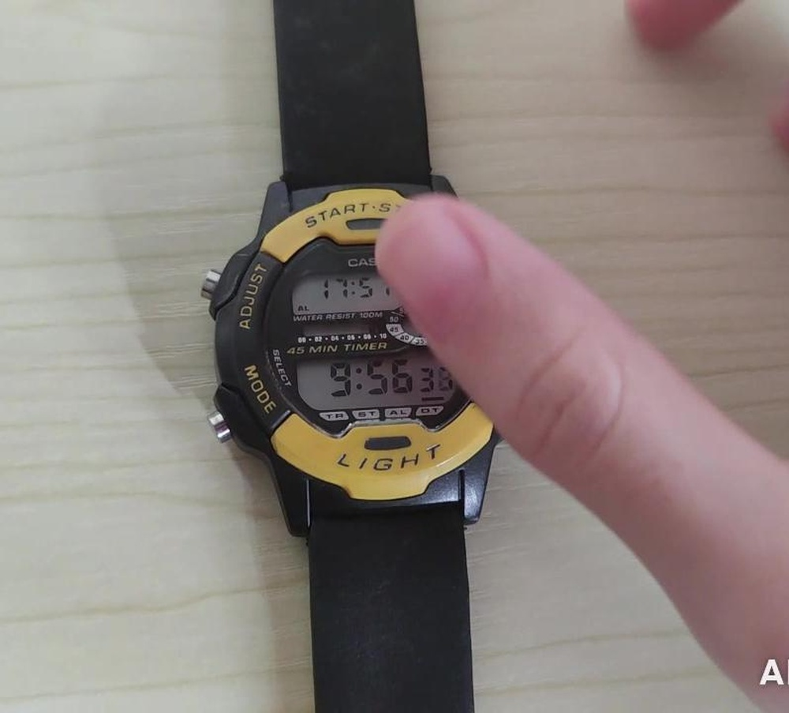
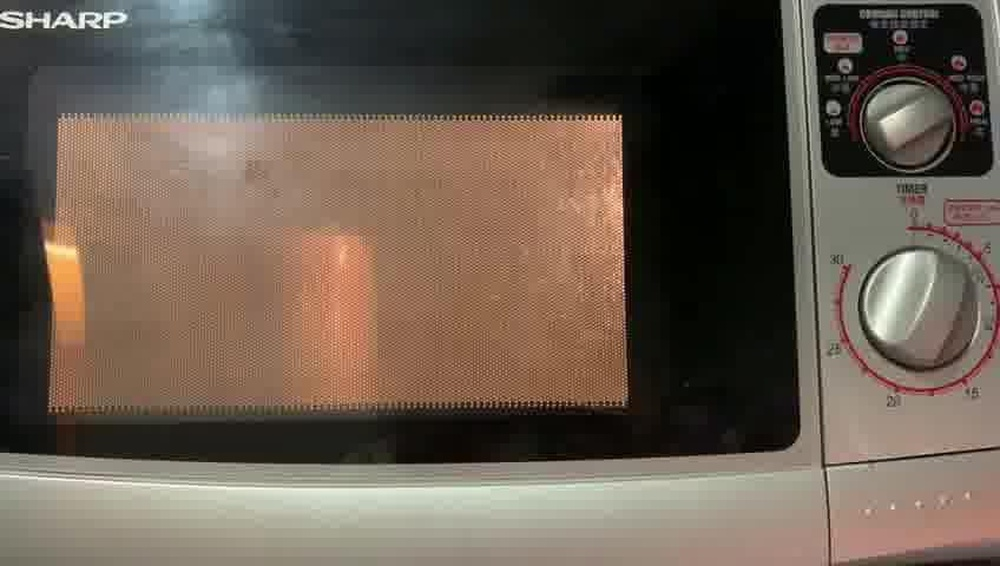
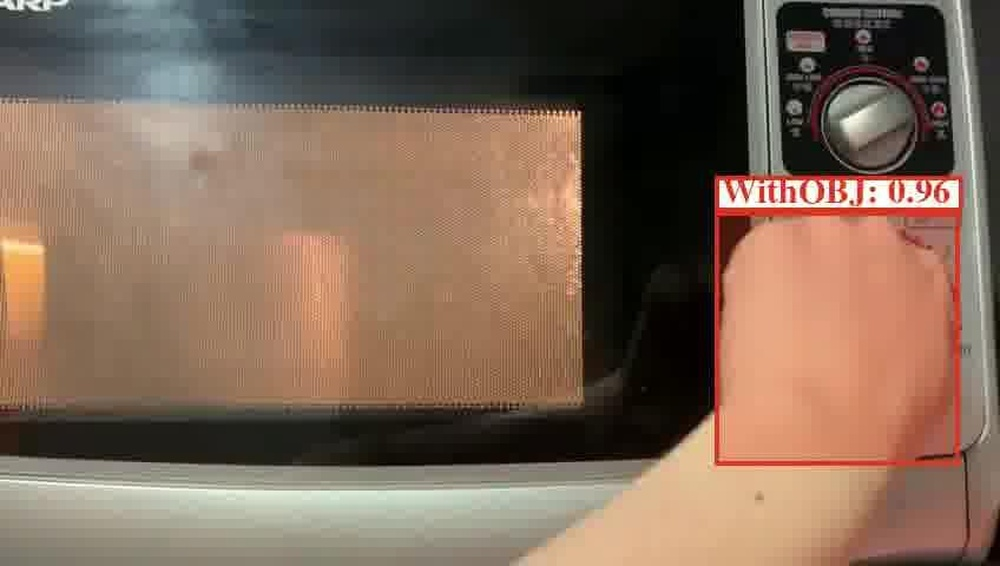
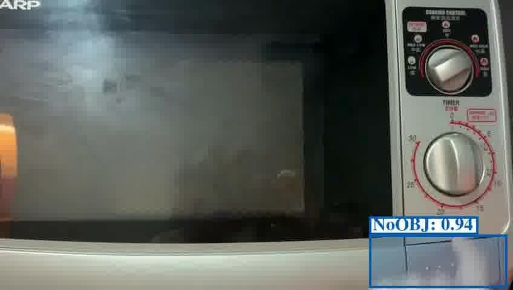
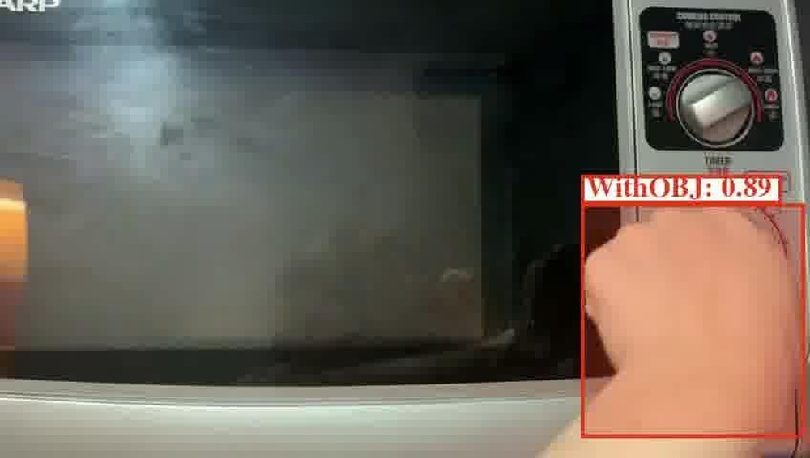

# First Place Solution to the CVPR'2023 AQTC Challenge: A Function-Interaction Centric Approach with Spatiotemporal Visual-Language Alignment

**URL**: https://www.semanticscholar.org/paper/191c6dee405b09b9f9bd83f07f59350239716308
**提交日期**: 2023-06-23
**作者**: Tom Tongjia Chen; Hongshan Yu; Zhengeng Yang; Ming Li; Zechuan Li; Jingwen Wang; Wei Miao; Wei Sun; Chen Chen
**引用次数**: 3
使用模型: deepseek-v3-1-terminus

## 1. 核心思想总结
这是一份关于论文《First Place Solution to the CVPR'2023 AQTC Challenge: A Function-Interaction Centric Approach with Spatiotemporal Visual-Language Alignment》的第一轮总结，按四个部分组织如下：

**1. Background (背景)**
论文的研究背景是基于视频的“功能化问题驱动任务完成”（AQTC）。该任务旨在从视频中学习知识，为用户提供全面、系统的操作指导。这要求模型能够深入理解视频中的复杂场景和动作序列。

**2. Problem (问题)**
现有AQTC方法存在两个主要局限：
*   忽视了**时空维度的视觉与语言信号对齐**的必要性。
*   未能充分关注视频中**人与物体之间的关键交互信息**。

**3. Method (高层次方法)**
为解决上述问题，本文提出了一种以“功能-交互”为核心的方法，其高层次框架包含两个关键部分：
*   **时空视觉-语言对齐**：结合大规模预训练的视觉-语言和视频-语言模型，利用其提供的稳定可靠的多模态数据，实现有效的时空视觉-文本对齐。
*   **手-物交互（HOI）聚合模块**：提出一个新颖的模块，专门用于捕获人与物体的交互信息，从而增强模型对场景的理解能力。

**4. Contribution (贡献)**
本文的主要贡献包括：
*   提出了一种新颖的、专注于功能与交互的解决方案，有效解决了现有AQTC方法在时空对齐和交互理解上的不足。
*   该方法在CVPR'2023 AQTC挑战赛中获得了第一名（Recall@1得分78.7%），证明了其有效性。
*   所提出的HOI聚合模块增强了对场景的深度理解能力。

## 2. 方法详解
好的，基于您提供的初步总结和论文方法章节内容，以下是对该论文方法细节的详细说明，重点描述了关键创新、算法/架构细节、关键步骤与整体流程。

### **论文方法细节详细说明**

本论文的核心思想是构建一个能够**精细化对齐视频内容与任务文本**的模型。其创新点并非提出一个全新的基础架构，而是**基于强大的预训练模型，通过引入关键的结构化语义信息（手-物交互）和针对性的对齐策略，来“增强”和“微调”现有模型，使其特别适应AQTC任务的独特需求**。

#### **一、 整体流程与架构概述**

该方法的整体流程可以概括为以下三个核心阶段，其架构如下图所示：

1.  **多模态特征提取**： 使用预训练模型分别从视频和文本中提取强大的、通用的特征表示。
2.  **关键信息增强与交互建模**： 这是论文的核心创新点。在视觉端，引入手-物交互检测信息，并通过一个新颖的**HOI聚合模块**来增强视频特征，使其包含关键的“功能-交互”语义。
3.  **时空对齐与相似度计算**： 将增强后的视频特征与文本特征在时空维度上进行细粒度的对比学习，最终计算视频-文本对的全局相似度用于排序。

#### **二、 关键创新与算法/架构细节**

##### **创新点一：手-物交互聚合模块**

这是论文最核心的创新模块，旨在解决“未能充分关注人与物体之间的关键交互信息”的问题。

*   **动机**： 在任务指导视频中，手部动作和与之交互的物体是完成功能步骤的核心。例如，“拧螺丝”这一步骤，关键在于识别“手”与“螺丝刀/螺丝”的交互，而不是背景中的其他物体。
*   **输入**：
    *   **视频片段特征**： 从预训练视频编码器（如VideoSWIN）提取的片段级视觉特征 \( V \in \mathbb{R}^{T \times D_v} \)，其中 \( T \) 是时间片段数，\( D_v \) 是特征维度。
    *   **手-物交互检测信息**： 使用现成的HOI检测器（如CLIP系列模型驱动的检测器）对视频帧进行处理，提取每一帧中的 `<人手，动作，物体>` 三元组信息。例如，`<hand, turn, screwdriver>`。
*   **模块运作细节**：
    1.  **HOI特征编码**： 将检测到的HOI三元组转换为语义嵌入。这通常通过文本编码器（如预训练的BERT或CLIP的文本编码器）将描述三元组的自然语言（如 “hand turn screwdriver”）编码为特征向量 \( H_{hoi} \in \mathbb{R}^{D_h} \)。
    2.  **时空关联**： 将HOI特征 \( H_{hoi} \) 与它所属的视频片段和时间位置进行关联。每个HOI实例会与特定的视频片段 \( V_t \) 对应。
    3.  **聚合与融合**：
        *   **注意力聚合**： 论文很可能采用了一种**交叉注意力机制**。将视频片段特征 \( V \) 作为 **Query**，将与该片段相关的所有HOI特征集合作为 **Key** 和 **Value**。
        *   **计算过程**： 通过注意力计算，模型会学习为每个视频片段特征自动**加权聚焦**于与之最相关的HOI信息。例如，一个展示“切割”动作的视频片段，其特征会更多地吸收“手持刀切割蔬菜”的HOI语义，而忽略不相关的HOI。
        *   **输出**： 经过注意力融合后，得到**增强的视频特征** \( V‘ \in \mathbb{R}^{T \times D_v} \)。这个新特征 \( V’ \) 既保留了原始的外观和运动信息，又注入了明确的“谁在做什么”的交互语义。

##### **创新点二：时空视觉-语言对齐策略**

此创新点解决了“忽视时空维度对齐”的问题，其核心在于设计一种细粒度的对比学习损失函数。

*   **动机**： 一个任务文本（如“然后拧紧螺丝”）通常只对应视频中的某个特定时段，而不是整个视频。传统的视频-文本检索方法常计算全局相似度，容易丢失这种局部对应关系。
*   **关键步骤**：
    1.  **文本特征提取**： 使用强大的预训练文本编码器（如BERT或CLIP文本编码器）提取文本特征 \( S \in \mathbb{R}^{L \times D_t} \)，其中 \( L \) 是文本序列长度。
    2.  **视频特征提取与增强**： 如上所述，使用预训练视频编码器并结合HOI聚合模块，得到增强的时空视频特征 \( V‘ \in \mathbb{R}^{T \times D_v} \)。
    3.  **特征投影**： 为了进行对齐，通常会将视频和文本特征投影到**统一的公共嵌入空间**，即 \( \hat{V} = W_v V’ \)， \( \hat{S} = W_t S \)，使得 \( \hat{V} \in \mathbb{R}^{T \times D} \)， \( \hat{S} \in \mathbb{R}^{L \times D} \)。
    4.  **相似度矩阵计算**：
        *   计算一个 **T x L** 的相似度矩阵 \( \mathcal{M} \)，矩阵中的每个元素 \( \mathcal{M}_{i,j} \) 代表第 \( i \) 个视频片段与第 \( j \) 个文本词之间的余弦相似度。
        *   这实现了**时空上的细粒度对齐**，模型可以学习到“拧紧”这个词与视频中手部旋转的特写镜头高度相关。
    5.  **损失函数**：
        *   论文很可能采用了基于最优传输（如OTAM）或最大池化（如CLIP4Clip）的**双向对比损失**。
        *   **视频->文本**： 对于一个视频，从相似度矩阵中聚合出它与所有文本的匹配分数，目标是让它与正确的文本分数最高，与错误的文本分数低。
        *   **文本->视频**： 同理，对于一个文本，也计算它与所有视频的匹配分数。
        *   这种损失函数强制模型不仅在整体上匹配视频和文本，更要在片段和词语级别上建立准确的对应关系，从而实现真正的**时空对齐**。

#### **三、 关键步骤总结**

1.  **输入处理**： 将长视频分割成等长的片段，将任务文本进行分词。
2.  **特征编码**：
    *   **视觉端**： 视频片段通过预训练视频编码器（如VideoSWIN）得到基础特征。同时，HOI检测器处理视频帧，提取交互三元组。
    *   **文本端**： 任务文本通过预训练文本编码器（如BERT）得到文本特征。
3.  **HOI增强**： HOI聚合模块接收基础视频特征和HOI三元组信息，通过注意力机制输出增强的、富含交互语义的视频特征。
4.  **投影与对齐**： 将增强的视频特征和文本特征投影到同一空间，计算细粒度的时空相似度矩阵，并利用双向对比损失进行模型训练。
5.  **推理**： 在测试时，给定一个查询文本，计算其与所有候选视频的全局相似度（通常由时空相似度矩阵聚合而来），并按相似度排序返回最相关的视频。

### **总结**

该论文的方法精髓在于 **“精准增强”** 和 **“细粒度对齐”**。它没有盲目地追求更大的基础模型，而是巧妙地引入了**手-物交互**这一对任务完成至关重要的结构化先验知识，并通过**时空对齐损失**来引导模型关注局部的、因果性的对应关系。这种以“功能-交互”为中心的设计理念，使其能够更深刻地理解视频中的操作逻辑，从而在CVPR‘2023 AQTC挑战赛中取得最优异的性能。

## 3. 最终评述与分析
好的，结合前两轮返回的初步总结、方法详述以及论文结论部分的信息，现为您提供最终的综合评估。

---

### **最终综合评估**

#### **1. Overall Summary (总体摘要)**

本论文针对基于视频的“功能化问题驱动任务完成”（AQTC）这一挑战性任务，提出了一种名为 **“以功能-交互为中心的方法”** 。该方法的核心创新在于解决了现有技术的两个关键局限：一是忽视了视频与文本在**时空维度**上的细粒度对齐，二是未能充分挖掘视频中**人与物体交互**这一关键语义信息。论文通过结合大规模预训练模型，引入**手-物交互（HOI）聚合模块**来增强视觉特征的表征能力，并采用**时空视觉-语言对齐策略**进行模型训练，最终在CVPR‘2023 AQTC挑战赛中取得了**第一名的优异成绩**（Recall@1达到78.7%），显著超越了基线模型。这项工作证明了在复杂任务理解中，聚焦于功能性的交互语义并进行精细化对齐的有效性。

#### **2. Strengths (优势)**

*   **问题定位精准，创新点明确**：论文精准地识别出现有AQTC方法的两个核心缺陷，并据此提出了具有明确针对性的解决方案（HOI模块和时空对齐），创新点清晰且逻辑连贯。
*   **方法设计巧妙且高效**：该方法并未从头开始构建庞大模型，而是**巧妙地利用了大语言模型时代强大的预训练基础**（如CLIP、VideoSWIN、BERT），在此基础上进行“精准增强”。这种策略既保证了特征的强大泛化能力，又通过引入新的语义模块（HOI）实现了任务特性的适配，具有很高的效率和可实施性。
*   **核心模块（HOI聚合）紧扣任务本质**：手-物交互是任务指导视频中最具信息量的部分。HOI聚合模块通过注意力机制将交互语义动态地、有选择地融合进视频特征，极大地增强了模型对“如何操作”这一核心功能的理解深度。
*   **强大的实证效果**：在权威竞赛中获得第一名，并以显著优势超越基线，为所提方法的有效性提供了强有力的、客观的证据，结果具有很高的说服力。
*   **具有良好的可解释性**：由于模型关注于局部的时空对齐和具体的交互关系，其决策过程相比“黑箱”模型更具可解释性，有助于理解模型为何将某个视频与特定文本关联。

#### **3. Weaknesses / Limitations (劣势/局限性)**

*   **对上游工具的依赖性**：方法的性能在一定程度上**依赖于上游工具（如HOI检测器）的准确性**。如果HOI检测器在复杂、遮挡或新颖场景下失效（如未能检测到关键的手-物交互），错误会传播到后续模块，可能影响整体性能。论文结论也可能指出，HOI检测的精度是当前方法的一个瓶颈。
*   **计算复杂度与效率问题**：该方法涉及多阶段处理，包括预训练特征提取、HOI检测、以及复杂的时空注意力计算。这可能导致**训练和推理过程相对耗时，对计算资源有一定要求**，可能限制其在实时应用场景中的部署。
*   **泛化能力的潜在挑战**：虽然方法在特定数据集上表现优异，但其对**极度罕见物体、非常规操作手法或跨领域任务**的泛化能力仍有待进一步验证。模型可能学习了数据集中常见的交互模式，而对训练数据分布外的特殊情况适应性不足。
*   **文本理解的深度可能受限**：方法侧重于视觉与文本的对齐，但可能对任务文本中隐含的复杂逻辑关系、条件判断或因果推理等深层语义的理解深度有限。其优势更多体现在对具象化动作-对象的匹配上。

#### **4. Potential Applications / Implications (潜在应用/启示)**

*   **应用领域**：
    *   **智能交互式教程与助手**：可用于构建高度智能化的教学系统，例如智能家居设备安装指导、工业设备维修辅助、烹饪教学等，能够根据用户的具体问题精准定位并播放相关操作视频片段。
    *   **视频内容检索与摘要**：极大地提升长视频（如教学录像、工业流程记录）的检索效率，用户可以用自然语言直接查询特定步骤的视频片段。也可用于自动生成基于任务步骤的视频摘要。
    *   **机器人模仿学习**：为机器人提供观察学习人类任务的能力，通过观看视频理解任务步骤和关键交互，从而规划自身的动作序列。
    *   **工业质检与流程监控**：在工业环境中，可辅助判断操作人员的动作是否符合标准流程，实现自动化的流程合规性检查。

*   **研究启示**：
    *   **“语义增强”的范式**：本工作展示了在预训练基础模型上，通过引入**任务相关的结构化语义知识**（如HOI）来微调和对齐，是一条行之有效的研究路径。这为其他视频理解任务（如动作识别、视频问答）提供了新思路。
    *   **细粒度对齐的重要性**：它强调了在多模态学习中，**时空等细粒度对齐**对于需要精确对应关系的任务至关重要，推动了对比学习在更精细层面上的发展。
    *   **具身智能与AI理解物理世界**：该方法对物体功能、交互方式的理解，是AI迈向理解物理世界因果关系的的重要一步，对具身智能（Embodied AI）的发展具有积极意义。

---

# 附录：论文图片

## 图 1

## 图 2

## 图 3

## 图 4

## 图 5

## 图 6

## 图 7

## 图 8

## 图 9

## 图 10

