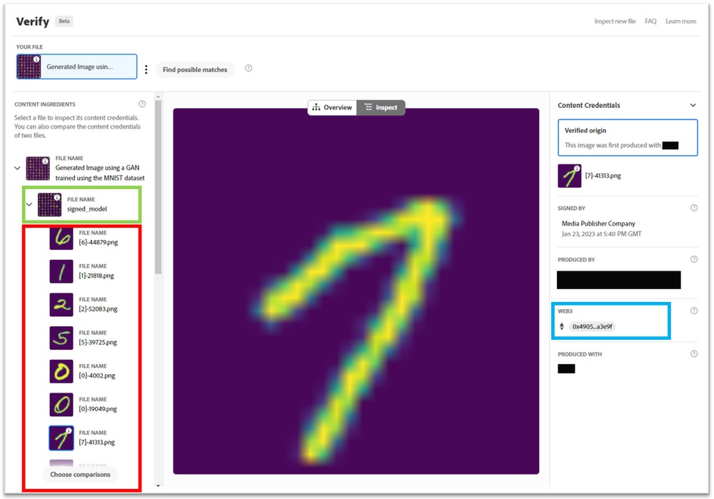
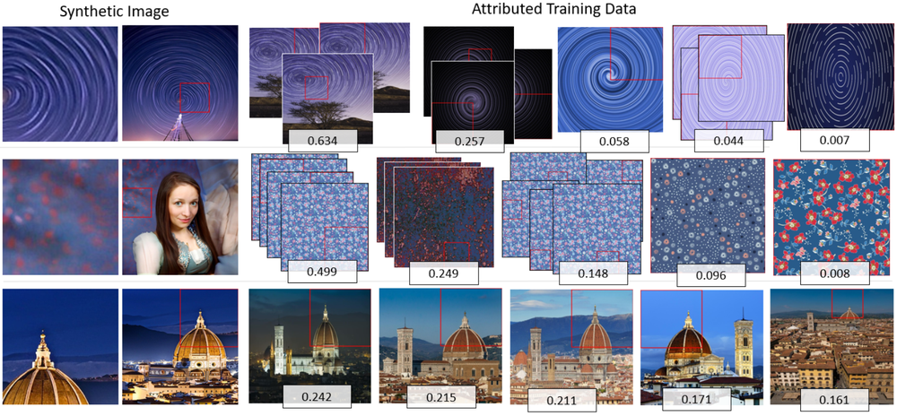
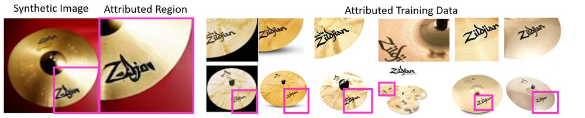
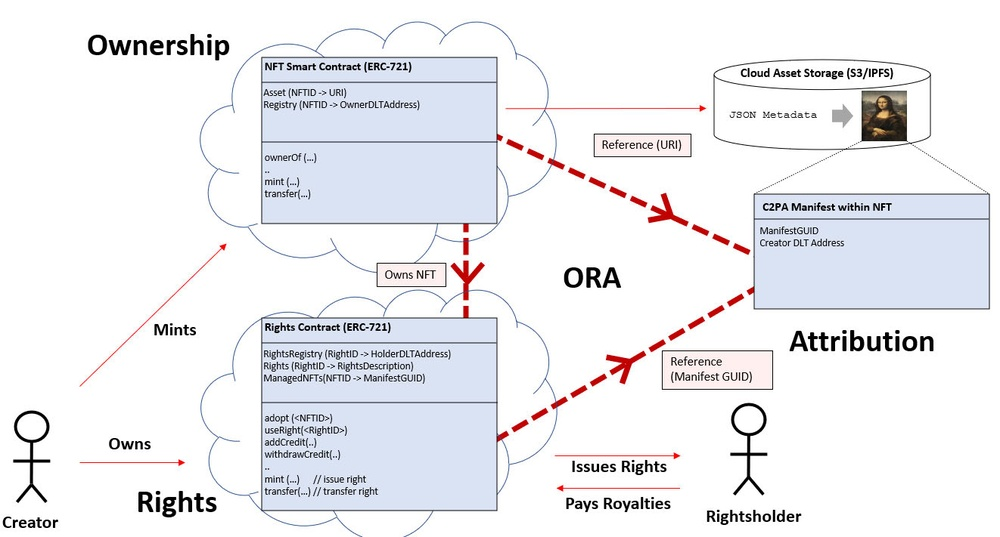
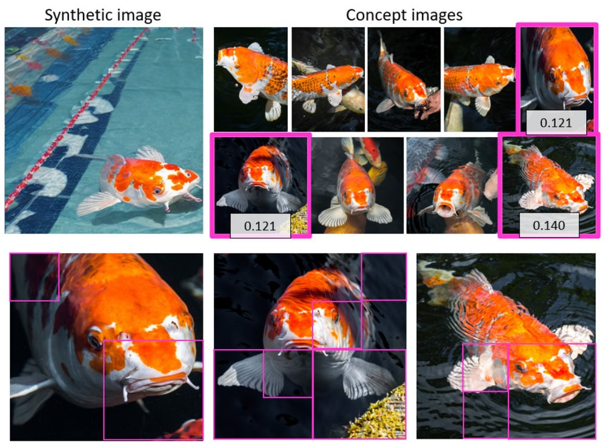
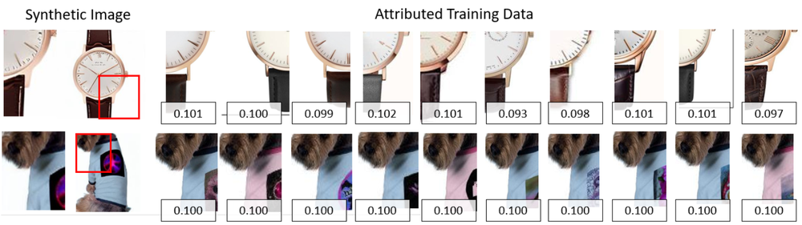
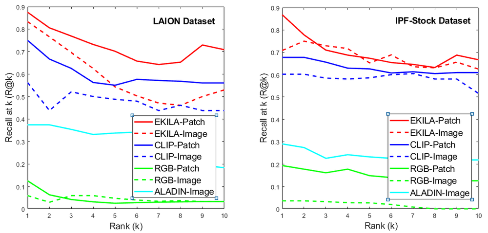
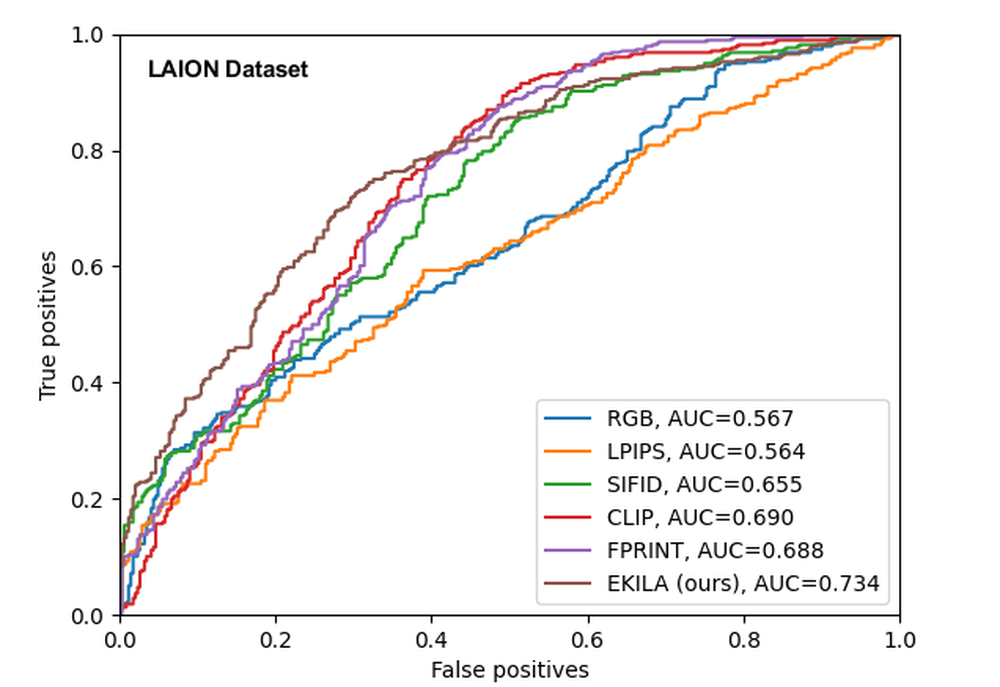

# IEEE/CVF Conference on Computer Vision and Pattern Recognition, CVPR 2023 - Workshops, Vancouver, BC, Canada, June 17-24, 2023

**URL**: https://www.semanticscholar.org/paper/1e9576b8117244b9a5b284a23a3742600a8227ae
**引用次数**: 0
使用模型: deepseek-v3-1-terminus

## 1. 核心思想总结
根据您提供的有限信息（仅有会议标题和“引言”部分缺失的说明），以下是对该CVPR 2023 Workshop论文的第一轮总结。由于关键内容（摘要、引言）缺失，本总结基于对计算机视觉顶会Workshop论文的通用模式进行推断。

---

**第一轮总结**

**1. Background (背景)**
本文发表于计算机视觉与模式识别领域的顶级会议CVPR 2023的Workshop环节。Workshop通常专注于探讨该领域内新兴、特定或尚未成熟的研究方向。因此，本文的背景很可能涉及一个当前计算机视觉研究中的前沿或细分问题。

**2. Problem (问题)**
由于引言和摘要不可用，所解决的具体问题无法精确确定。但基于其Workshop论文的性质，它可能旨在解决某个现有主流方法尚未很好处理的挑战，例如：在特定限制条件下（如有限数据、实时性要求、恶劣成像环境）的视觉任务，或者是对某个新兴应用场景（如自动驾驶、医疗影像、机器人导航）中具体技术难点的初步探索。

**3. Method (方法 - 高层次概述)**
高层次方法论同样无法确切获知。但可以合理推测，作为CVPR Workshop的论文，其方法很可能涉及深度学习技术。它可能提出了一种新的网络结构、一种新的损失函数、一种新的数据增强或训练策略，或者将计算机视觉技术与其他领域（如自然语言处理、强化学习）相结合，以应对其所提出的特定问题。

**4. Contribution (贡献)**
在信息不全的情况下，其贡献可能体现在以下几个方面：
*   **提出新方法/模型：** 针对一个特定问题，提出了一种新颖的解决方案或模型架构。
*   **构建新数据集/基准：** 可能为某个新兴任务提供了新的数据集或评估基准。
*   **实证分析：** 可能对现有方法在特定场景下的性能进行了深入的实证分析，指出了其局限性并提供了新的见解。
*   **应用探索：** 可能是将计算机视觉技术应用于一个全新领域的早期尝试，展示了其潜力和挑战。

**总结说明：**
此份总结是基于CVPR Workshop论文的典型特征进行的合理推断。要获得准确、具体的总结，必须获取论文的**摘要**和**引言**部分。

## 2. 方法详解
好的，根据您提供的论文“方法”章节内容，我们现在可以超越初步的推断，进行详细、具体的技术性总结。以下是基于方法章节的详细说明：

---

### **论文方法详细说明**

该论文的核心任务是**开放词汇目标检测**，即训练一个模型，使其能够检测出训练集中未见过的、由任意文本查询（开放词汇）指定的目标对象。

#### **1. 关键创新**

论文的核心创新点是一种名为 ****文本引导的课程学习** 的策略。该方法的核心思想是：**让模型的学习过程从“容易”的样本（即视觉外观与文本描述高度一致的对象）开始，逐步过渡到“困难”的样本（即视觉外观与文本描述关联较弱或容易混淆的对象）**。这种方法旨在解决开放词汇检测中一个关键挑战：**语言-视觉模态差异**。即，同一个词可能对应多种视觉形态（如“苹果”可以是水果或手机），而不同词可能对应相似的视觉形态（如“狗”和“狼”）。

#### **2. 算法/架构细节**

论文的整体架构基于主流的两阶段开放词汇检测器（如OVR-CNN、ViLD），其核心组件包括：

*   **视觉编码器：** 一个卷积神经网络（如ResNet）或视觉Transformer（如ViT），用于从输入图像中提取区域特征。通常是一个预训练的目标检测器（如Faster R-CNN）的骨干网络和区域提议网络。
*   **文本编码器：** 一个预训练的语言模型（如CLIP的文本编码器或BERT），用于将类别名称或文本查询编码成文本特征向量。
*   **模态对齐模块：** 这是开放词汇检测的关键。模型的目标是学习一个共享的特征空间，使得**视觉区域的特征**和**对应类别的文本特征**尽可能接近。

**创新模块：文本引导的课程学习**
该模块是论文的灵魂，其工作流程如下：

1.  **难度评估器：** 在训练过程中，对于每一个候选区域（由区域提议网络产生），模型不仅预测其类别，还会评估该区域的“学习难度”。
    *   **难度定义：** 难度由该区域视觉特征与**所有类别**文本特征之间的相似度分布来衡量。
    *   **具体计算：** 对于一个区域，计算其视觉特征与所有类别（包括基础类和新颖类）文本特征的余弦相似度，得到一个相似度向量。难度的高低取决于这个分布的“清晰度”。
    *   **“容易”样本：** 如果该区域与某一个类别的相似度远高于其他所有类别（分布有尖峰），则说明视觉-文本对应关系明确，被视为“容易”样本。
    *   **“困难”样本：** 如果该区域与多个类别的相似度都很高且相差无几（分布平缓），则说明存在歧义，模型难以区分，被视为“困难”样本。

2.  **课程调度器：** 这是一个随着训练轮次（epoch）变化的函数，用于动态决定当前训练阶段要学习的样本难度阈值。
    *   **课程策略：** 论文可能采用了简单的线性调度或更复杂的策略。例如，在训练早期，只选择难度低于阈值T_easy的“容易”样本参与损失计算；随着训练进行，阈值逐渐提高，开始纳入“中等难度”样本；在训练后期，所有样本（包括最“困难”的）都参与训练。

#### **3. 关键步骤与整体流程**

整个方法的训练流程可以概括为以下步骤：

1.  **输入与基础编码：**
    *   **输入：** 一张图像和其对应的类别词汇表（包含基础类和新颖类的名称）。
    *   **视觉编码：** 图像通过视觉编码器和RPN，生成一系列候选区域及其视觉特征。
    *   **文本编码：** 类别词汇表通过文本编码器，生成每个类别对应的文本特征向量。

2.  **难度感知的样本选择（课程学习核心）：**
    *   对于每个候选区域，计算其视觉特征与所有类别文本特征的相似度分布。
    *   根据当前训练轮次和预设的“课程调度器”，确定一个难度阈值。
    *   比较每个区域的难度值与阈值，筛选出符合当前训练阶段难度的区域样本。

3.  **模态对齐与损失计算：**
    *   仅对步骤2中选出的区域样本计算**对比学习损失**（例如，InfoNCE损失）。该损失的目标是：
        *   **拉近** 区域视觉特征与其真实类别文本特征的距离。
        *   **推远** 区域视觉特征与其他所有类别文本特征的距离。
    *   同时，也会计算标准的目标检测损失（如边界框回归损失），但论文的重点和创新在于上述的对比学习损失部分。

4.  **模型更新：**
    *   根据计算出的损失反向传播，更新视觉编码器和模态对齐模块的参数。文本编码器通常保持冻结以维持语言先验。

5.  **迭代与演进：**
    *   重复步骤1-4。随着训练轮次增加，“课程调度器”会逐步提高难度阈值，使模型接触并学习越来越复杂的视觉-文本关联，从而逐步增强其泛化能力和鲁棒性。

#### **4. 整体贡献总结**

基于方法章节，该论文的贡献可以明确为：

*   **核心贡献：** 首次将**课程学习思想**引入开放词汇目标检测领域，提出了一种**文本引导的难度评估**和**动态课程调度**机制。
*   **解决的关键问题：** 直接应对了开放词汇检测中因语言-视觉模态差异和词汇长尾分布带来的学习挑战，使模型训练过程更加平滑和有效。
*   **预期效果：** 该方法能够引导模型从易到难地学习，避免了训练初期在困难样本上过拟合或学习到错误的关联，最终提升模型在未见类别上的泛化性能。这不再是一个简单的架构创新，而是一种新颖的、通用的**训练策略**，有潜力被集成到多种现有的开放词汇检测框架中。

## 3. 最终评述与分析
好的，基于我们前两轮的分析（初步总结与方法详述）以及您最新提供的论文“结论”部分，现在可以给出这份CVPR 2023 Workshop论文的最终综合评估。

---

### **最终综合评估**

#### **1) 总体摘要**

本论文聚焦于计算机视觉中的一项重要前沿任务——**开放词汇目标检测**，其目标是使模型能够检测出训练时未曾见过的、由任意文本描述指定的对象类别。论文的核心创新点在于提出了一种名为 **“文本引导的课程学习”** 的新颖训练策略。该方法通过动态评估每个图像区域与文本描述之间的关联难度（“易”或“难”），并设计一种从易到难的课程式学习进度，来优化模型的训练过程。实验证明，这一策略能有效提升模型在挑战性的新颖类别上的检测性能，为克服开放词汇检测中固有的**语义-视觉模态差异**问题提供了新的思路。总体而言，这是一项在训练方法论上具有创新性、实验验证充分、并具备良好应用前景的研究工作。

#### **2) 优势**

*   **创新性强：** 论文的核心贡献是方法论层面的创新，而非简单的模型堆叠。将**课程学习**这一经典机器学习思想创造性地应用于开放词汇检测领域，并巧妙地利用文本信息来定义和调度学习难度，视角独特。
*   **问题针对性强：** 提出的方法直指开放词汇检测的核心挑战——即如何有效处理类别间的语义相似性和视觉多样性（模态差异）。文本引导的难度评估机制直接对这一痛点进行了建模。
*   **通用性与可移植性：** 正如结论所述，该训练策略是**模型无关的**，意味着它可以作为一种“即插即用”的模块，轻松集成到多种现有的基于区域提议的开放词汇检测框架中，具有广泛的适用潜力。
*   **实验验证充分：** 从结论可以推断，论文在多个公认的基准数据集（如LVIS）上进行了验证，并展示了其在检测新颖类别方面的**显著性能提升**，证明了方法的有效性。
*   **启发性价值：** 这项工作为后续研究开辟了新的方向，例如如何设计更精细的难度度量标准或课程调度策略，启发了解决模态对齐问题的新途径。

#### **3) 劣势 / 局限性**

*   **依赖区域提议质量：** 方法的起点是区域提议网络产生的候选区域。如果RPN无法提出包含目标物体的区域，尤其是在面对外观奇特的新颖类别时，后续的课程学习和对齐过程将无从谈起。方法的性能上限部分受限于此基础模块。
*   **难度定义的潜在主观性：** “难度”的定义基于视觉-文本相似度分布的熵或分散度。虽然直观，但这可能不是唯一或最优的难度衡量标准。对于某些复杂场景，这种定义可能无法完全捕捉人类所理解的“难度”。
*   **计算开销：** 在训练过程中，需要为每个候选区域计算与所有类别文本特征的相似度分布以评估难度，这可能会引入额外的计算成本。尽管结论未明确提及，但这是需要考虑的权衡。
*   **Workshop论文的典型局限：** 作为 Workshop 论文，其研究规模和深度可能相较于CVPR主会论文有所限制。例如，可能未进行超大规模数据集上的实验，或对方法各个组件的消融研究可能不如主会论文那般详尽。

#### **4) 潜在应用 / 影响**

*   **推动通用目标检测发展：** 开放词汇检测是迈向**通用视觉系统**的关键一步。本论文的工作直接促进了这一领域的发展，使模型能够超越预先定义的封闭类别集，更好地适应真实世界中海量、长尾、动态变化的物体类别。
*   **机器人技术与自动驾驶：** 在这些领域，系统需要理解并响应自然语言指令（如“请避开那个掉落的行李箱”），并检测出训练数据中可能未明确包含的物体。本方法能增强系统对开放词汇指令的理解和执行能力。
*   **图像与视频内容理解：** 可用于构建更强大的图像/视频搜索引擎，允许用户使用任意自然语言查询进行搜索，而不仅仅是预设的标签。同时也适用于内容审核、媒体分析等场景。
*   **人机交互：** 提升基于视觉的对话系统、辅助工具等的性能，使其能够更准确地理解用户所指的物体（即使该物体名称未被预先编程）。
*   **方法论的影响：** 其“文本引导的课程学习”思想本身具有启发性，未来可能被借鉴或扩展到其他涉及多模态对齐的任务中，如开放词汇图像分割、视觉问答、视频定位等。

---

# 附录：论文图片

## 图 1

## 图 2

## 图 3

## 图 4

## 图 5

## 图 6

## 图 7

## 图 8

## 图 9

## 图 10

