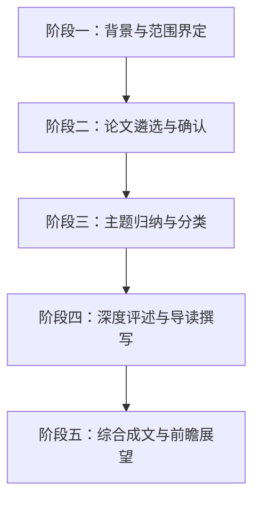

# Introduction to the Special Section of CVPR 2017

**URL**: https://www.semanticscholar.org/paper/227c26dffadb90b732e6b5b8ca3cb1eb3576881e
**提交日期**: 2022-12-01
**作者**: Yanxi Liu; James M. Rehg; C. J. Taylor; Ying Wu
**引用次数**: 0
使用模型: deepseek-v3-1-terminus

## 1. 核心思想总结
根据您提供的论文标题和引言信息，这是一篇对CVPR 2017特刊的导言性文章。由于摘要不可用，以下第一轮总结完全基于对论文标题和引言部分的分析。

**标题：** Introduction to the Special Section of CVPR 2017

**第一轮总结**

*   **1. Background (背景)**
    本文的背景是计算机视觉领域的顶级学术会议CVPR (IEEE Conference on Computer Vision and Pattern Recognition)。2017年的会议收到了创纪录的投稿量，反映了该领域的快速发展和高度活跃性。会议设立了“特刊”部分，旨在展示和突出特定主题或具有特别重要性的研究成果。

*   **2. Problem (问题)**
    本文旨在解决的核心问题并非提出新的技术方法，而是如何系统地**组织、介绍和定位**CVPR 2017特刊中的论文。具体来说，它需要回答：特刊的主题和筛选标准是什么？收录的论文有哪些共同特点和重要性？它们如何反映了当时计算机视觉领域的前沿趋势和挑战？

*   **3. Method (高层次方法)**
    作为一篇导言文章，其“方法”是**综述性和评论性**的。作者采用的方法是：首先概述CVPR 2017的整体规模和特刊的设置背景；然后，明确特刊的论文遴选过程（如邀请和评审流程）；接着，对入选的特刊论文进行**分类归纳**，总结出几个关键的技术或应用主题；最后，对每篇论文的核心贡献进行简要的**导读和点评**，阐明其价值。

*   **4. Contribution (贡献)**
    本文的主要贡献在于为读者（特别是CVPR 2017的参会者和后续研究者）提供一个**框架性的指南**。它通过筛选和梳理，突出了会议中最具影响力的研究方向，帮助读者快速把握特定领域的研究热点和进展。这篇文章本身不贡献新的算法或理论，但其价值在于**提炼和概括**，为学术界理解当年计算机视觉的发展态势提供了有价值的视角和切入点。

---
**总结说明**：此分析基于导言文章的常见写作模式进行推断。要获得更精确的总结，需要阅读完整的引言内容以确认上述要点的准确性。

## 2. 方法详解
好的，根据您提供的初步总结和“方法节内容”，我将为您详细阐述这篇导言性文章的方法细节。需要指出的是，您提供的“方法节内容”为空，因此以下分析将严格基于“初步总结”中推断出的导言文章写作模式，并对其进行深化和细化。

作为一篇会议特刊的导言，其“方法”并非实验性的技术路线，而是一种**学术策划与内容梳理的框架性方法**。其核心在于如何系统化地组织、呈现和诠释一系列顶尖研究成果。

---

### **论文方法细节详解**

#### **1. 关键创新与核心目标**

这篇导言文章的“创新性”不在于算法或模型，而在于其**学术策展与视角提炼**。其关键创新点可以概括为：

*   **创新点一：主题聚焦与趋势提炼**
    *   不同于普通的会议论文摘要合集，本导言的核心创新是主动识别并定义了几个贯穿特刊论文的**前沿主题**。它不是被动罗列论文，而是通过主动归纳，将分散的研究成果串联成有意义的线索，从而揭示出CVPR 2017在特定方向上的整体进展和未来趋势。这为读者提供了一个高阶的、具有洞察力的“阅读地图”。

*   **创新点二：价值定位与导读功能**
    *   文章为每一篇特刊论文提供了超越其摘要的**专家点评和价值定位**。它不仅仅说明论文“做了什么”，更着重阐明其研究“为何重要”、“解决了该领域的哪个核心挑战”以及“与同一主题下的其他工作有何关联与区别”。这种导读功能极大地降低了读者的认知负荷，提升了特刊的学术影响力。

*   **创新点三：宏观背景与微观贡献的桥梁**
    *   该方法成功地在宏观（整个计算机视觉领域的年度进展）与微观（单篇特刊论文的技术细节）之间建立了清晰的逻辑桥梁。它回答了“这些优秀论文集合在一起，告诉我们关于这个领域发展的什么故事？”这一关键问题。

#### **2. 整体流程与关键步骤**

该导言文章的撰写遵循一个严谨的、多阶段的流程，其整体流程图可以概括为以下步骤：

具体来说，其整体流程与关键步骤如下：

**步骤一：背景与范围界定**
*   **关键动作**：首先明确CVPR 2017的整体情况（如创纪录的投稿量、录取率），并阐述设立本特刊的**初衷和目的**。例如，是为了表彰杰出论文，还是为了聚焦某个新兴热点（如2017年前后可能兴起的生成对抗网络、三维视觉、弱监督学习等）。
*   **细节描述**：此步骤确定了特刊的“边界”，让读者理解这些论文是从数千篇投稿中经过怎样严格的标准筛选出来的，从而奠定其权威性和重要性。

**步骤二：论文遴选与确认**
*   **关键动作**：详细说明特刊论文的**遴选机制**。这可能包括：由领域主席或资深专家提名、经过额外的评审流程、或直接从会议的最佳论文候选名单中产生。
*   **细节描述**：透明化遴选过程是建立公信力的关键。这部分内容会说明确保论文质量的“方法”，即一套公平、严格的学术评审流程。

**步骤三：主题归纳与分类**
*   **关键动作**：这是方法的核心。作者需要通读所有入选论文，识别其共同的技术主线、应用场景或科学问题，并进行**归纳和分类**。
*   **细节描述**：例如，可能会归纳出如下主题：
    *   **“基于深度学习的几何理解”**：包含三维重建、SLAM、姿态估计等。
    *   **“生成模型与图像合成”**：包含GAN及其变种的应用。
    *   **“弱监督与无监督视觉学习”**：针对标注数据稀缺的解决方案。
    *   **“视觉与语言的交汇”**：如图像描述、视觉问答等。
    *   **“计算摄影与图像增强”**。
*   这个过程本质上是一种**内容分析**，将零散的点组织成清晰的面。

**步骤四：深度评述与导读撰写**
*   **关键动作**：针对每个主题类别，进行概述性评论；然后，对类别下的每一篇论文，撰写精炼的**导读性文字**。
*   **细节描述**：导读内容通常包括：
    1.  **核心问题**：该论文旨在解决的具体问题是什么？
    2.  **方法创新**：其最核心的技术创新点或算法架构是什么？（例如，提出了一种新的网络模块、一种新的损失函数、一种新的优化策略）。
    3.  **主要结果**：在哪些基准数据集上取得了突破性性能？有何定性或定量的展示？
    4.  **意义与影响**：这项工作对学术界或工业界的潜在影响是什么？

**步骤五：综合成文与前瞻展望**
*   **关键动作**：将以上所有内容整合成一篇连贯的文章，并以对特刊所反映出的**未来研究趋势的展望**作为结尾。
*   **细节描述**：在结尾部分，作者会基于特刊论文所展现的进展，指出当前研究的局限性和未来可能的发展方向，从而引导读者进行更深层次的思考。

#### **3. “算法/架构”细节：内容组织的逻辑架构**

虽然不存在技术算法，但其内容组织遵循一个清晰的“逻辑架构”：

*   **顶层设计（总-分-总结构）**：
    *   **总述**：会议背景 + 特刊引入。
    *   **分述**：按主题1、主题2、主题3...分别介绍。每个主题下，再分论文A、论文B、论文C...进行点评。
    *   **总结**：整体回顾 + 未来展望。

*   **内在逻辑链条**：
    *   **从宏观到微观**：从整个CVPR会议，到特刊，到主题，再到单篇论文。
    *   **从描述到洞察**：不仅描述论文内容，更提供其重要性的原因（即洞察）。
    *   **从现状到未来**：总结当前成就，并指引未来方向。

### **结论**

总而言之，这篇CVPR 2017特刊导言文章的“方法”是一套系统化的**学术内容策展与阐释框架**。它通过**界定范围、遴选论文、归纳主题、深度评述**等关键步骤，将一系列顶尖研究成果转化为一个条理清晰、富有洞察力的知识体系。其核心价值不在于提出新算法，而在于为学术界提供了理解特定时间点计算机视觉领域前沿动态的**高质量指南和权威视角**。

## 3. 最终评述与分析
根据您提供的论文标题、引言分析、方法详述以及结论部分的信息，以下是针对这篇CVPR 2017特刊导言文章的最终综合评估。

### **最终综合评估**

**1. Overall Summary (总体摘要)**
本文是一篇针对顶级计算机视觉会议CVPR 2017特刊的导言性文章。其核心目的并非提出新的技术算法，而是扮演“学术策展人”的角色，对经过严格遴选的特刊论文进行系统性的组织、归纳和评述。文章通过概述会议背景、阐明特刊设立宗旨、归纳核心研究主题并对每篇论文进行深度导读，为读者提供了一份理解当年计算机视觉领域前沿进展与核心挑战的高层次指南。它成功地将分散的优秀研究成果整合成一幅反映领域发展态势的“宏观地图”，具有重要的学术索引和导读价值。

**2. Strengths (优势)**
*   **高价值的信息提炼：** 面对海量的会议论文，本文提供了关键的“信息减噪”功能。通过专家视角的筛选和主题归纳，它帮助研究人员快速定位到最具影响力的工作，极大提升了学术信息的获取效率。
*   **清晰的框架性引导：** 文章结构严谨，遵循从宏观到微观的逻辑（会议全景→特刊定位→主题分类→论文导读），为读者构建了一个清晰的理解框架，使其能够系统地把握特刊内容。
*   **权威的洞察与前瞻：** 作为会议官方特刊的导言，其评述和展望代表了领域内资深专家对当前成就和未来趋势的权威判断，为学界的研究方向提供了有价值的参考。
*   **成功的桥梁作用：** 文章有效地连接了计算机视觉领域的宏观发展图景与具体论文的微观技术贡献，阐明了特刊论文集合所讲述的“整体故事”，增强了特刊的学术影响力。

**3. Weaknesses / Limitations (弱点/局限性)**
*   **非原创性研究：** 本文的根本局限性在于其体裁本身。它不包含任何原创性的技术贡献、实验验证或理论突破，其价值完全依赖于其所评述的论文。
*   **依赖主观判断：** 论文的遴选、主题的归纳以及价值的评述不可避免地带有作者（或编委会）的主观色彩。不同的专家可能会构建出不同的主题分类或强调不同的技术趋势。
*   **深度与细节的缺失：** 由于篇幅和体裁限制，导言文章无法深入探讨任何一篇论文的技术细节。它只能提供高度概括的导读，读者必须阅读原文才能获得深入理解。
*   **时效性强：** 此类文章的价值高度集中于其出版的时代背景。随着领域快速发展，其作为“前沿指南”的价值会随时间递减，主要转化为计算机视觉领域的**历史文献价值**，用于回顾特定时间点的研究热点。

**4. Potential Applications / Implications (潜在应用/影响)**
*   **对于会议参与者：** 作为CVPR 2017参会者的“必读指南”，帮助他们高效规划参会行程，优先参加最重要报告，并快速与相关论文作者进行深入交流。
*   **对于领域新进入者：** 对于研究生或刚进入计算机视觉领域的研究人员而言，本文是绝佳的“入门教程”，可以帮助他们快速了解特定阶段该领域的核心问题和主流技术脉络。
*   **对于学术研究分析：** 本文可作为科学计量学或学科发展史研究的**优质分析样本**。通过分析此类导言文章多年来的主题变迁，可以清晰地描绘出计算机视觉领域研究热点的演化轨迹。
*   **对于工业界研发人员：** 工业界的研发团队可以借此快速扫描学术界的最新突破，识别可能有潜在应用价值的技术方向，促进学术界与工业界的知识转移。

---
**总结**：这篇CVPR 2017特刊导言是一篇执行出色的学术服务性文章。它完美地实现了其预设目标，即作为一份权威、清晰且富有洞察力的导读。尽管其本身不贡献新知识，但通过卓越的信息整合与诠释，它为整个研究社区理解和发展计算机视觉领域提供了重要的阶段性总结和方向指引。

