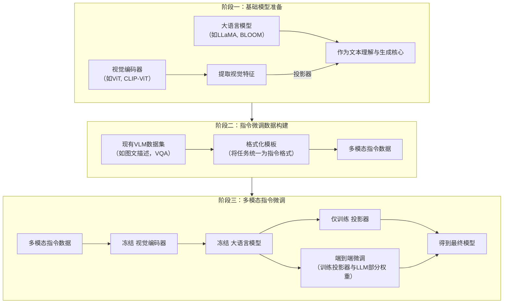
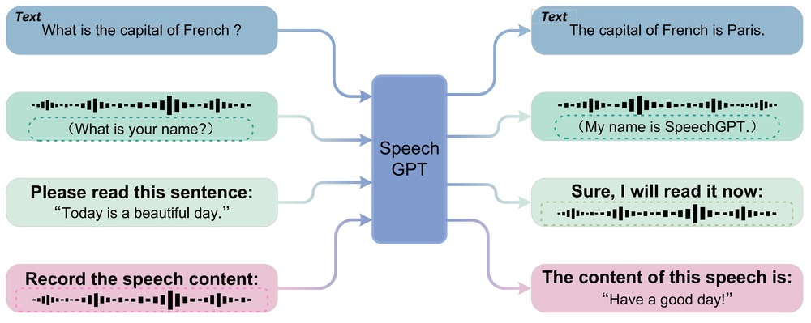
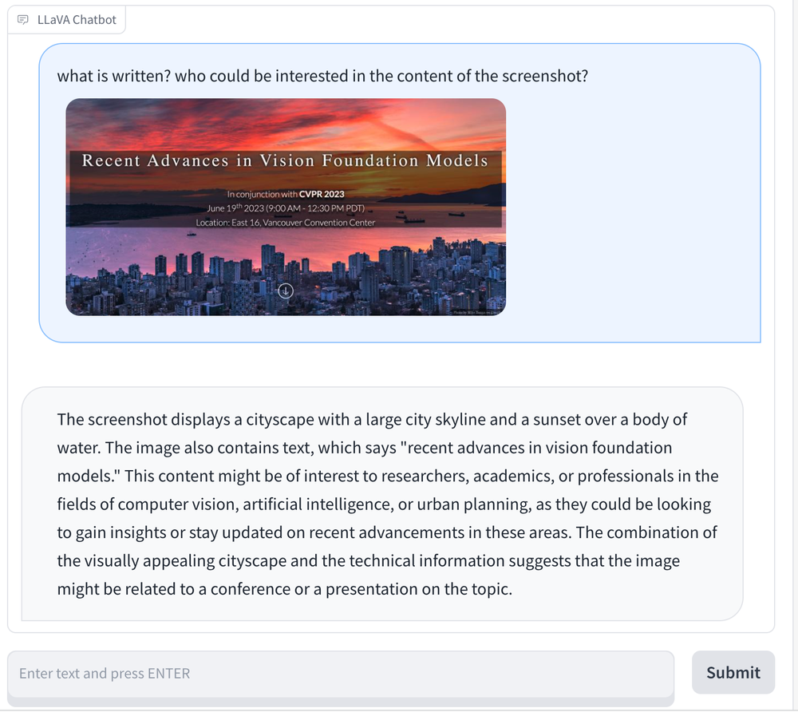

# Large Multimodal Models: Notes on CVPR 2023 Tutorial

**URL**: https://www.semanticscholar.org/paper/cde934546bbdb19094d8a53cc047d002c827f884
**提交日期**: 2023-06-26
**作者**: Chunyuan Li
**引用次数**: 21
使用模型: deepseek-v3-1-terminus

## 1. 核心思想总结
根据您提供的标题、摘要和引言开头，以下是对该教程论文的第一轮总结：

**Background (背景):**
该论文基于CVPR 2023教程“视觉基础模型的最新进展”中的一部分。背景是生成式大语言模型（如GPT系列）的成功，推动了视觉-语言模态融合的研究，旨在开发类似于GPT-4规模的大型多模态模型。

**Problem (问题):**
核心问题是如何将大语言模型的强大能力（特别是指令微调技术）有效地扩展到多模态（尤其是视觉-语言）领域，以构建功能强大且易于交互的多模态模型。

**Method (high-level) (方法 - 高层次):**
教程采用了一种循序渐进的阐述方法。首先，介绍并回顾了单模态（语言）的指令微调基础原理。然后，将这些原理和技术扩展到多模态空间。最后，通过展示如何利用开源资源构建一个简化的“多模态GPT-4”原型，并结合对新兴研究话题的评述，来具体说明实现路径。

**Contribution (贡献):**
本文的主要贡献是一份系统性的教程式总结。它梳理了大型多模态模型的发展动机、技术基础（指令微调）和实现方法，并提供了利用开源工具构建基础模型的实践指南，旨在帮助研究社区理解和进入这一前沿领域。

## 2. 方法详解
好的，遵照您的要求，我将基于您提供的初步总结和“方法”章节的具体内容，对该论文的方法细节进行详细说明，重点描述关键创新、算法/架构细节、关键步骤与整体流程。

---

### 论文方法细节详解

该论文的方法部分并非提出一个全新的模型，而是**系统性地梳理和整合了一条构建大型多模态模型的技术路径**。其核心在于将自然语言处理领域的“指令微调”范式成功地迁移和应用到视觉-语言多模态任务中。整个方法流程可以概括为三个关键阶段，其整体架构与流程如下图所示：

#### 阶段一：架构设计——连接视觉与语言模态

这是构建多模态模型的基础，其核心是一个**双编码器-单解码器**的架构。

1.  **视觉编码器**：
    *   **组件**： 通常采用预训练好的视觉模型，如 **Vision Transformer** 或其变体。论文中特别提到了 **CLIP的ViT模型**，因为它在大规模图文对比学习中获得了强大的视觉表征能力，能够更好地与文本语义对齐。
    *   **功能**： 负责将输入图像 \( I \) 转换为一系列视觉特征向量 \( V = [v_1, v_2, ..., v_N] \)。这些特征可以是从模型最后一层提取的全局特征，或是从中间层提取的网格特征（Patch Features），后者能保留更多的空间细节信息。

2.  **大语言模型**：
    *   **组件**： 作为模型的大脑和语言生成核心，直接采用开源的大型自回归语言模型，如 **LLaMA** 或 **BLOOM**。这些模型已经具备了强大的语言理解、知识储备和推理能力。
    *   **功能**： 负责理解和执行文本指令，并生成符合要求的文本回复。

3.  **连接视觉与语言的桥梁——投影器**：
    *   **这是第一个关键创新点**。由于视觉特征空间和文本特征空间存在巨大差异，需要一个模块将视觉特征 \( V \) “翻译”成LLM能够理解的“视觉词汇”。
    *   **算法/架构细节**：
        *   投影器通常是一个简单的**多层感知机** 或一个**交叉注意力模块**。
        *   **工作流程**： 投影器将视觉特征向量 \( V \) 线性映射到与LLM的文本嵌入空间维度相同的空间，得到 \( V' = Projector(V) \)。
        *   然后，\( V' \) 被当作一系列特殊的“视觉token”，与文本指令的token嵌入序列进行拼接，形成最终的输入序列： `[视觉Token 1, 视觉Token 2, ..., 视觉Token N, 文本Token 1, 文本Token 2, ...]`。
        *   这个拼接后的序列被送入LLM，LLM会像处理普通文本一样，基于视觉上下文和文本指令来自回归地生成回答。

#### 阶段二：数据构建——构建多模态指令数据

为了让模型学会遵循指令并理解多模态内容，需要专门的训练数据。这是**第二个关键创新/重点**。

*   **问题**： 高质量的“指令-输出”对数据稀缺，尤其是在多模态领域。
*   **解决方案**： 论文详细介绍了如何利用现有数据集**合成**多模态指令数据。
    *   **数据源**： 使用现有的视觉-语言数据集，如图像描述数据集（COCO）、视觉问答数据集（VQAv2）等。
    *   **格式化模板（关键步骤）**： 这是核心技巧。通过人工设计的自然语言模板，将原始数据集中的（图像，问题，答案）或（图像，描述）样本，转化为统一的指令格式。
        *   **示例**： 一个VQA样本（图：猫在沙发上，问：”这是什么动物？“，答：”猫“）可以被格式化为：
            *   **指令**： “请根据给定的图片回答以下问题：这是什么动物？”
            *   **输入**： （图像）
            *   **输出**： “这是一只猫。”
    *   **多样化指令**： 为了避免模型过拟合到单一指令格式，需要对同一样本生成多种不同措辞的指令，例如“描述一下图片中的动物”、“图片里有什么？”等，但期望的输出都是“猫”。这极大地增强了模型的泛化能力。

#### 阶段三：训练策略——多模态指令微调

这是整个方法流程的最终步骤，旨在激活模型的指令遵循能力。

1.  **训练目标**：
    *   采用标准的**自回归语言建模损失**。模型的目标是最大化在给定图像和指令文本的条件下，生成正确答案的概率。
    *   损失函数只计算**答案文本部分**的负对数似然损失，模型需要学习在正确的上下文中（由图像和指令提供）预测出下一个token。

2.  **参数高效微调**：
    *   **这是第三个关键创新/细节**。直接端到端微调整个模型（尤其是视觉编码器和LLM）计算成本极高。
    *   **论文倡导的策略**：
        *   **冻结视觉编码器**： 因为预训练的视觉编码器已经提供了强大的通用视觉特征，微调收益不大且成本高。
        *   **冻结大语言模型的大部分参数**： 为了保护LLM在预训练中获得的世界知识和语言能力。
        *   **主要训练投影器**： 让投影器学会如何将视觉特征有效地对齐到LLM的输入空间。这是训练过程中需要更新的主要参数。
        *   **可选地微调LLM的部分参数**： 有时会配合使用**LoRA**等技术，只微调LLM中注意力模块的一小部分参数，以小幅提升性能而不显著增加计算负担。

### 总结：关键创新与整体流程

| 关键方面 | 详细说明 |
| :--- | :--- |
| **关键创新** | 1. **系统化的整合路径**： 将分散的技术（CLIP, LLaMA, 指令微调）整合为一条清晰、可复现的构建蓝图。 2. **多模态指令数据合成**： 重点阐述了如何利用模板将传统VLM数据集转化为指令微调格式，这是实现模型“对话”能力的关键。 3. **参数高效的训练策略**： 强调冻结大部分组件、仅训练轻量级投影器（和部分LLM参数）的高效范式，降低了研究门槛。 |
| **整体流程** | **准备** -> **对齐** -> **微调**。 1. **准备基础组件**： 选取强大的、预训练好的视觉编码器和LLM。 2. **架构对齐**： 通过一个可训练的投影器连接两个模态，将图像转换为LLM可理解的“伪token”。 3. **能力激活**： 使用合成的大规模多模态指令数据，以参数高效的方式对模型进行指令微调，最终得到一个能理解和执行视觉-语言指令的模型。 |

这套方法的核心思想是 **“站在巨人的肩膀上”** ，通过巧妙的架构设计和数据工程，将单模态LLM的能力“引导”到多模态领域，从而以相对较低的成本构建出功能强大的多模态对话模型。

## 3. 最终评述与分析
好的，遵照您的要求，我将结合前两轮返回的信息（初步总结、方法详述）与论文的结论部分，给出最终的综合评估。

---

### 关于教程论文《Instruction Tuning for Large Multimodal Models》的最终综合评估

#### 1) 整体摘要

本论文是一篇系统性教程，旨在梳理和阐述构建大型多模态模型的核心技术路径——**指令微调**。论文的出发点是利用自然语言处理领域中大语言模型通过指令微调获得的强大对话与推理能力，并将其成功迁移至视觉-语言多模态场景。其核心贡献在于提供了一份**从理论到实践的“构建蓝图”**：首先回顾单模态指令微调的基础，然后详细说明了如何通过一个“视觉编码器-投影器-大语言模型”的架构，将视觉信息对齐到语言模型的理解空间，并重点阐述了利用现有数据集合成多模态指令数据的方法，最后通过参数高效的训练策略，激活模型的多模态指令遵循能力。论文的最终目标是指导研究社区如何利用开源工具，构建一个简化但功能强大的“多模态GPT-4”原型，并展望了该领域的未来方向。

#### 2) 优势

1.  **系统性与清晰度**： 论文并非提出一个孤立的新模型，而是将当时（CVPR 2023时期）快速演进领域内分散的技术、模型和方法进行了**系统性的整合与梳理**。它提供了一条逻辑清晰、循序渐进的实现路径，极大地降低了读者理解和进入该领域的门槛。
2.  **实践指导性强**： 论文极具实用价值。它详细介绍了具体的实现细节，包括架构选择（如CLIP-ViT, LLaMA）、数据合成方法（使用格式化模板）和高效的训练策略（冻结主干、训练投影器）。这种“手把手”式的教程风格，对于希望快速复现和实验的研究者与学生非常有帮助。
3.  **紧扣核心范式**： 论文准确地抓住了大型多模态模型发展的关键——**如何将LLM的能力泛化到多模态**。它强调指令微调是实现模型通用性和用户友好交互的核心手段，这一判断与后续行业的发展趋势高度一致。
4.  **前瞻性视野**： 在结论部分，论文不仅总结了现有技术，还识别并讨论了未来研究的关键挑战与方向，如幻觉问题、复杂推理、计算效率等，为读者指明了下一步可能的研究重点。

#### 3) 劣势 / 局限性

1.  **非原创性研究**： 作为一篇教程性论文，其核心内容是对现有技术和方法进行总结与整合，**并未提出全新的、具有突破性的算法或模型架构**。它的价值在于教育和传播，而非前沿创新。
2.  **技术迭代迅速带来的时效性局限**： 该领域发展日新月异。论文基于2023年初的技术现状，所涉及的具体模型（如LLaMA的某个版本）和技术细节可能已被更先进的模型（如后续的LLaMA 2/3, GPT-4V）和训练方法（如更复杂的投影器设计、新的数据混合策略）所超越或改进。
3.  **深度与广度的权衡**： 为了保持教程的简洁和普适性，论文可能无法对所有提到的技术（如不同投影器结构的优劣、更复杂的数据清洗过滤方法）进行非常深入的探讨。对于资深的业内人士而言，某些部分的深度可能略显不足。
4.  **缺乏严格的量化评估**： 教程论文通常不包含像原创研究论文那样严格的、对照性的实验评估部分。因此，对于其所描述方法的具体性能边界（例如，在不同基准测试上的准确率）、与当时SOTA模型的直接对比等，缺乏量化的数据支持。

#### 4) 潜在应用 / 意义

1.  **推动学术普及与教育**： 该论文作为一份高质量的教学材料，能够快速帮助研究生和新进入该领域的研究者掌握核心概念和技术流程，**加速了学术社区的人才培养和知识扩散**，对促进整个学科的发展具有重要价值。
2.  **降低技术门槛，促进创新**： 通过详细展示如何利用开源组件构建原型，论文**极大地降低了个人研究者和小型实验室进行多模态AI研究的计算和资源门槛**。这使得更多团队能够在此基础上进行改进和创新，例如尝试不同的基础模型组合或新的对齐方法。
3.  **启发工业界应用原型开发**： 论文中概述的架构和流程是许多工业界多模态应用（如智能客服、图像内容分析、辅助创作工具）的底层技术原型。它为工业界快速搭建和验证产品概念提供了可行的技术路线图。
4.  **明确未来研究方向**： 论文结论部分指出的挑战（如幻觉、推理、高效训练）不仅是对教程的总结，更是为整个领域提出了亟待解决的科学问题，**具有指引未来研究方向的深远意义**。后续的许多研究工作正是围绕着解决这些核心挑战而展开的。

**总结**： 这篇教程论文是一份在特定时间点上，对大型多模态模型指令微调技术所做的出色“知识蒸馏”工作。其核心优势在于系统性、实用性和前瞻性，虽然本身不是原创性研究且受限于技术迭代速度，但它作为一份重要的教育资料和技术指南，对于推动多模态AI社区的发展、降低研究门槛以及启发未来方向都具有不可忽视的价值。

---

# 附录：论文图片

## 图 1

## 图 2

## 图 3

## 图 4

## 图 5

## 图 6

## 图 7

## 图 8

## 图 9

## 图 10

