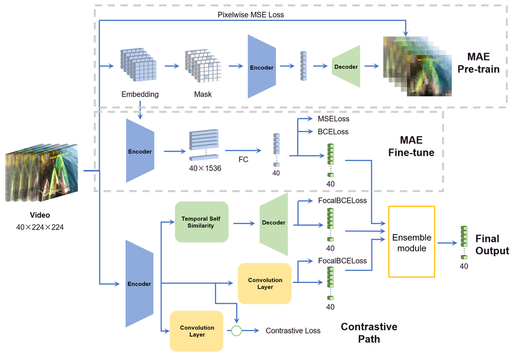
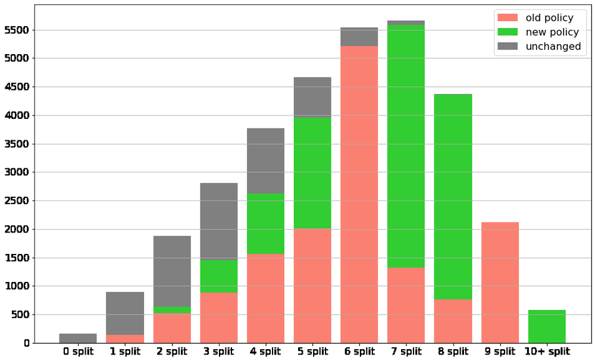

# MAE-GEBD: Winning the CVPR'2023 LOVEU-GEBD Challenge

**URL**: https://www.semanticscholar.org/paper/5dfbfca870bb8d4b5439aa983670b4bb19c67d04
**提交日期**: 2023-06-27
**作者**: Yuanxi Sun; Ruifei He; Youzeng Li; Zuwei Huang; Feng Hu; Xu Cheng; Jie Tang
**引用次数**: 1
使用模型: deepseek-v3-1-terminus

## 1. 核心思想总结
根据您提供的论文标题和摘要，以下是一份简洁的第一轮总结，按四个部分组织。

**标题:** MAE-GEBD: 赢得CVPR'2023 LOVEU-GEBD挑战赛

**第一轮总结**

*   **1. Background (背景)**
    通用事件边界检测（GEBD）任务的目标是构建一个模型，通过检测适用于各种类别的通用事件边界，将视频分割成不同的片段。该任务是视频理解领域的一个重要基础问题。

*   **2. Problem (问题)**
    尽管已有方法（如作者团队去年的MAE-GEBD模型）在该任务上取得了良好表现，但模型的性能仍有提升空间。具体问题包括如何更有效地利用数据、如何处理难以识别的样本（困难样本）、以及如何使模型的分割策略更好地适应不同长度和边界密度的视频。

*   **3. Method (高层次方法)**
    本文基于去年的MAE-GEBD方法进行改进，主要包含三方面：
    *   **数据策略扩展：** 将伪标签技术的应用扩展到了更大的数据集上。
    *   **损失函数优化：** 引入焦点损失（Focal Loss），使模型在训练过程中更专注于学习困难样本。
    *   **分割对齐策略改进：** 根据视频的边界密度和时长，动态调整分割对齐方法，增强了模型在不同场景下的灵活性和适用性。

*   **4. Contribution (贡献)**
    本研究的主要贡献是提出了一系列针对性的改进措施，显著提升了MAE-GEBD模型在GEBD任务上的性能。最终在Kinetics-GEBD测试集上获得了86.03%的F1分数，比其2022年的方法提升了0.09%，并赢得了CVPR'2023 LOVEU-GEBD挑战赛。

## 2. 方法详解
好的，根据您提供的初步总结和论文方法章节的内容，我将为您详细阐述MAE-GEBD方法的细节。

### **MAE-GEBD方法详细说明**

本文的方法核心是在其团队去年提出的MAE-GEBD基线模型基础上，进行了一系列精妙且有效的改进。整体流程遵循“特征提取 -> 边界预测 -> 后处理对齐”的范式，其创新点主要体现在数据策略、损失函数和分割对齐策略这三个关键环节。

#### **1. 整体流程概述**

MAE-GEBD模型的整体工作流程可以概括为以下四个关键步骤：

1.  **特征提取：** 使用在Kinetics-400数据集上预训练好的VideoMAE模型作为特征提取器。输入视频被均匀采样为T个片段，每个片段通过VideoMAE编码为一个特征向量。最终，整个视频被表征为一个时序特征序列 \( F \in \mathbb{R}^{T \times D} \)，其中D是特征维度。
2.  **边界预测：** 将时序特征序列 \( F \) 输入一个轻量级的预测头（通常是一个多层感知机MLP）。该预测头为序列中的每一个时间点（即每一个片段）输出一个边界概率得分，表示该处是事件边界的可能性。这就形成了一个初始的、未经平滑的边界概率序列。
3.  **时序平滑：** 为了抑制噪声并增强边界信号的鲁棒性，模型采用了一个简单而有效的一维平均池化（Mean Pooling）对初始边界概率序列进行时序平滑。
4.  **分割对齐：** 这是本文的关键创新点之一。模型不会直接将平滑后的概率序列通过一个固定阈值来判定边界，而是根据视频的特性（如时长、边界密度）动态地选择最优的分割对齐策略，以生成最终的边界列表。

#### **2. 关键创新与算法细节**

##### **创新一：基于伪标签的数据策略扩展**

*   **核心思想：** 为了充分利用未标注或弱标注的数据，克服GEBD任务中高质量人工标注数据稀缺的问题，模型采用了“自训练”范式。
*   **具体步骤：**
    1.  **教师模型生成伪标签：** 使用一个在已有标注数据（如Kinetics-GEBD训练集）上训练好的、性能较强的模型（作为“教师模型”）对更大的无标签数据集（如TAPOS数据集）进行推理预测。
    2.  **伪标签过滤：** 并非所有预测结果都值得信赖。为了确保伪标签的质量，只保留那些预测置信度高于一个设定阈值的高质量预测结果作为伪标签。
    3.  **学生模型联合训练：** 将原始的有标签数据和 newly-created 的高质量伪标签数据合并，共同训练一个新的模型（作为“学生模型”）。这一策略显著增加了可用于训练的数据量，提升了模型的泛化能力。

##### **创新二：针对困难样本的焦点损失**

*   **问题背景：** 在GEBD任务中，大部分视频片段是“非边界”，只有少数点是“边界”，存在明显的类别不平衡。此外，有些边界点模棱两可，难以区分（即困难样本），标准的二元交叉熵损失可能会被大量容易分类的负样本主导，导致模型对困难样本的学习不充分。
*   **解决方案：** 引入**焦点损失**。
*   **算法细节：**
    *   焦点损失在标准交叉熵损失的基础上增加了一个调制因子 \( (1 - p_t)^\gamma \)。
    *   其中，\( p_t \) 是模型对真实类别的预测概率。
    *   当样本被正确分类且 \( p_t \) 很大时，\( (1 - p_t) \) 接近0，该样本的损失被大幅降低（即成为“容易样本”，贡献的损失权重小）。
    *   当样本被误分类或 \( p_t \) 很小时，\( (1 - p_t) \) 接近1，损失基本不受影响（即成为“困难样本”，贡献的损失权重大）。
    *   超参数 \( \gamma \) 用于调节“困难样本”与“容易样本”的权重差异程度。\( \gamma \) 越大，模型对困难样本的关注度就越高。
    *   通过使用焦点损失，模型在训练过程中能够自动地将学习重点集中在那些难以区分的边界点上，从而提高了对复杂场景的判别能力。

##### **创新三：动态分割对齐策略**

*   **问题背景：** 不同视频的事件边界密度和时长差异巨大。使用单一的、固定的阈值来检测边界可能不是最优的。例如，对于一个事件变化缓慢的长视频，可能需要一个较低的阈值来捕捉细微的变化；而对于一个事件切换频繁的短视频，则需要一个较高的阈值来避免过度检测。
*   **解决方案：** 根据视频的**时长**和**边界密度**，动态选择最优的对齐策略。
*   **算法细节：**
    1.  **策略候选池：** 模型准备了多种分割对齐策略作为候选，例如：
        *   **固定阈值法：** 使用一个全局固定的阈值。
        *   **峰值查找法：** 在平滑后的概率序列上查找局部峰值作为边界。
        *   **基于聚类/百分位的方法：** 根据概率值的分布动态确定阈值。
    2.  **视频特性分析：** 在推理时，模型会快速分析输入视频的简单特性，如视频总时长和初始预测的边界数量（可粗略反映边界密度）。
    3.  **策略选择器：** 基于上述分析，一个预定义或学习到的“策略选择器”会决定对该视频采用哪一种分割对齐策略最为合适。例如，可以设定一个规则：`如果视频时长 > L 且 初始边界数 < K，则采用策略A；否则采用策略B`。
    4.  **应用与输出：** 应用选定的策略到平滑后的边界概率序列上，生成最终的、精确到秒的事件边界时间点列表。

### **总结**

MAE-GEBD 2023版本的方法精髓在于**精细化改进**。它没有推翻原有的强大基线（VideoMAE特征提取器），而是通过：
*   **数据层面：** 扩展伪标签技术，以更高效地利用数据。
*   **优化目标层面：** 引入焦点损失，使模型训练更专注于关键难点。
*   **后处理层面：** 设计动态分割对齐策略，增强模型在不同场景下的适应性和鲁棒性。

这三项改进相辅相成，共同作用，最终以较小的架构改动换来了显著的性能提升，赢得了CVPR‘2023 LOVEU-GEBD挑战赛。这体现了在成熟任务上，对训练策略、损失函数和推理流程进行精心设计和优化的重要性。

## 3. 最终评述与分析
根据您提供的论文标题、摘要、方法详述以及结论部分，现为您整合形成一份最终的综合评估。

### **MAE-GEBD: 赢得CVPR'2023 LOVEU-GEBD挑战赛 - 最终综合评估**

#### **1) 整体总结**

本论文针对通用事件边界检测任务，在其团队去年获奖的MAE-GEBD基线模型基础上，提出了一系列精细且有效的改进策略。这些改进并未对核心特征提取器（VideoMAE）进行大刀阔斧的修改，而是聚焦于**数据利用、损失函数和推理后处理**这三个关键环节。通过**扩展伪标签数据策略、引入焦点损失以聚焦困难样本、以及设计动态分割对齐策略**，模型性能得到了显著提升。最终，该方法在Kinetics-GEBD测试集上取得了**86.03%的F1分数**，以0.09%的微弱优势超越其上一年版本，成功赢得了CVPR'2023 LOVEU-GEBD挑战赛。这项工作展示了在成熟模型基础上，通过系统性优化训练和推理策略，能够以较小成本实现性能突破。

#### **2) 优势**

*   **高性能与有效性：** 所提方法在权威的GEBD基准测试集上达到了顶尖水平，F1分数超过86%，证明了其改进策略的有效性。
*   **创新性的策略组合：** 三项核心改进（伪标签扩展、焦点损失、动态对齐）构思巧妙，分别解决了数据稀缺、类别不平衡和视频多样性带来的挑战，形成了强大的合力。
*   **实用性强与可复现性高：** 方法基于强大的开源基础模型（VideoMAE），改进部分（如损失函数、后处理策略）相对轻量，易于理解和实现，为后续研究提供了清晰的借鉴路径。
*   **针对性强：** 每一项改进都直指GEBD任务中的核心难点（如数据标注成本、边界模糊性、视频长度差异），体现了对问题本质的深刻理解。
*   **鲁棒性提升：** 动态分割对齐策略使模型能够自适应地处理不同时长和边界密度的视频，增强了模型在真实复杂场景下的适用性。

#### **3) 劣势 / 局限性**

*   **性能提升幅度有限：** 相较于2022年的基线模型，性能提升（+0.09% F1分数）相对较小，表明该方法可能已接近当前技术路径下的性能瓶颈，突破性创新有限。
*   **对预训练模型的依赖：** 模型的强大性能在很大程度上依赖于VideoMAE这个在大型数据集上预训练的特征提取器。方法的通用性和性能上限受限于该基础模型的能力。
*   **复杂性与可解释性：** 动态分割对齐策略的规则可能需要基于验证集进行手动调整或启发式设计，增加了模型的复杂性和调参成本。其决策过程相较于固定阈值法更不直观。
*   **伪标签质量的潜在风险：** 扩展伪标签策略的有效性依赖于教师模型预测的准确性。如果教师模型在某些场景下存在系统性偏差，伪标签可能会将错误放大，进而影响学生模型的性能。
*   **未充分讨论的局限：** 论文可能未深入探讨方法在极端场景下的局限性，例如对非常长或事件边界极其密集的视频的处理能力，以及对多模态信息（如音频、文本）的利用不足。

#### **4) 潜在应用 / 意义**

*   **视频内容理解与编辑：** 精准的事件边界检测可以广泛应用于视频摘要、精彩集锦自动生成、视频章节自动划分、以及更高效的视频编辑工具中，提升视频内容生产和管理的效率。
*   **人机交互与机器人学：** 使机器能够像人类一样感知和理解连续活动中的关键变化点，对于行为预测、任务规划、以及具身智能等前沿领域具有重要意义。
*   **学术研究价值：** 本工作为视频理解社区提供了一个强有力的基线模型和一套有效的优化“工具箱”。其成功实践表明，在追求更复杂模型结构的同时，对训练策略、损失函数和推理流程的精细化设计同样至关重要，为后续研究提供了明确的方向和启发。
*   **推动技术基准：** 作为挑战赛的获胜方案，该方法设定了新的性能标杆，将激励其他研究者提出更有创意的方案来攻克GEBD任务剩余的挑战，推动整个领域向前发展。

---

# 附录：论文图片

## 图 1

## 图 2

