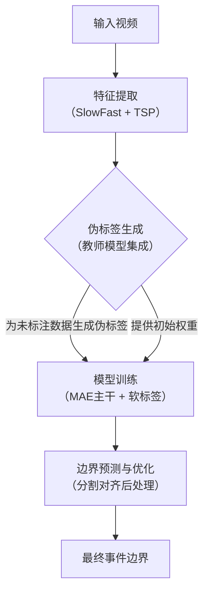
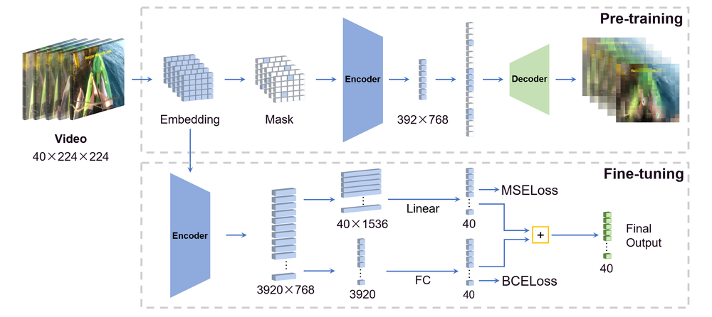
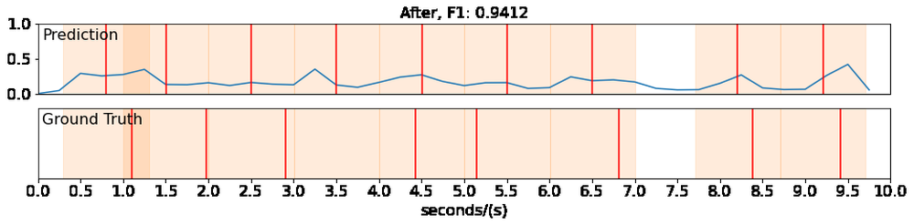
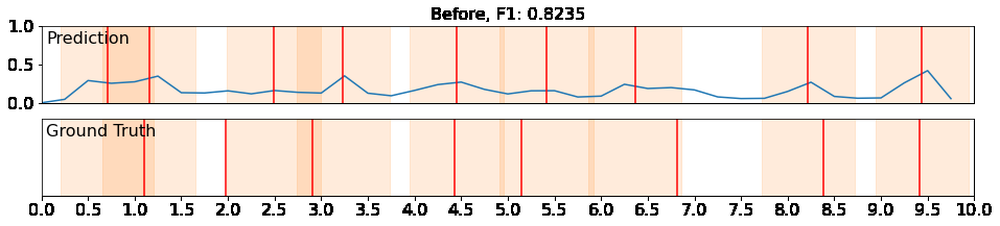

# Masked Autoencoders for Generic Event Boundary Detection CVPR'2022 Kinetics-GEBD Challenge

**URL**: https://www.semanticscholar.org/paper/3f2aa1d42f6362856f3ea115e6c1b2d3bc4928a6
**提交日期**: 2022-06-17
**作者**: Ruifei He; Yuanxi Sun; Youzeng Li; Zuwei Huang; Feng Hu; Xu Cheng; Jie Tang
**引用次数**: 4
使用模型: deepseek-v3-1-terminus

## 1. 核心思想总结
好的，这是一份根据您提供的论文标题、摘要和引言（假设引言内容与摘要一致）整理的简洁第一轮总结。

---

### **论文第一轮总结**

**标题：** Masked Autoencoders for Generic Event Boundary Detection CVPR'2022 Kinetics-GEBD Challenge

**1. Background (背景)**
通用事件边界检测（GEBD）是一项视频理解任务，其目标是在没有预定义事件类别的情况下，自动检测视频中事件变化的边界，从而将完整视频分割成多个语义片段。

**2. Problem (问题)**
现有的GEBD方法性能有待提升。此外，该任务面临两个主要挑战：一是正负样本（边界与非边界）不均衡；二是人工标注的边界本身存在模糊性，即不同标注者对边界位置的判断可能存在差异。

**3. Method (high-level) (方法 - 高层次)**
本文提出了一种基于掩码自编码器（MAE）的解决方案。其核心方法包括：
*   **主干网络：** 采用在GEBD任务上微调的MAE模型作为自监督学习器，并与其他基础模型进行集成。
*   **数据利用：** 使用半监督的伪标签方法，充分利用大量未标注的Kinetics-400数据。
*   **标签优化：** 提出软标签方法，以缓解样本不均衡和标注模糊问题。
*   **后处理：** 采用一种精细的分割对齐策略来优化模型预测的边界位置，使其更加精确。

**4. Contribution (贡献)**
本方法在Kinetics-GEBD测试集上取得了85.94%的F1分数，相比2021年该挑战赛的冠军方案，性能提升了2.31%，证明了所提方法的有效性。

---

## 2. 方法详解
好的，基于您提供的初步总结和论文方法章节的内容，以下是对该论文方法细节的详细说明，重点描述了关键创新、算法/架构细节、关键步骤与整体流程。

---

### **论文方法细节详解**

#### **整体流程概述**
该方法的整体流程可以概括为四个核心阶段，其流水线如下图所示：

接下来，我们对每个关键环节进行深入剖析。

#### **1. 关键创新点**

1.  **引入掩码自编码器（MAE）作为特征学习器**：
    *   **创新性**： 这是首次将MAE这一在图像领域取得巨大成功的自监督学习范式，引入到GEBD任务中。MAE通过随机掩蔽大部分图像块并重建像素，能够学习到鲁棒且通用的视觉表征。作者认为这种强大的表征学习能力有助于模型理解视频帧的语义内容，从而更好地检测事件变化。
    *   **解决的问题**： 缓解了视频理解任务中对大规模标注数据的依赖，利用MAE在ImageNet-1K上的预训练权重，提供了一个强大的特征提取基础。

2.  **半监督伪标签方法**：
    *   **创新性**： 为了充分利用Kinetics-400数据集中大量未标注于GEBD任务的视频，作者设计了一个半监督学习流程。首先在已有的GEBD标注数据（如Kinetics-GEBD训练集）上训练一个“教师模型”，然后用这个模型去预测Kinetics-400数据中的事件边界，生成“伪标签”。
    *   **解决的问题**： 极大地扩充了有效的训练数据量，让模型能够从更丰富的视频场景中学习事件边界的模式，从而提升模型的泛化能力。

3.  **软标签以应对标注模糊性**：
    *   **创新性**： 针对事件边界标注本身存在的主观性和模糊性，作者没有采用简单的0/1二值标签，而是提出了“软标签”。对于一个待判断的时间点，其标签值不是非0即1，而是根据其与真实标注边界的距离来计算一个介于0到1之间的软值。
    *   **解决的问题**：
        *   **标注模糊性**： 承认并建模了边界的不确定性。距离真实标注点越近，标签越接近1（肯定是边界）；距离越远，标签越接近0（肯定不是边界）；在中间地带，则是一个平滑过渡的软值。
        *   **样本不均衡**： 自然地缓解了正负样本不均衡问题。因为硬标签会造成大量“负样本”（标签为0），而软标签为这些负样本提供了更丰富的学习信号，而不是简单地将其归为一类。

4.  **分割对齐后处理策略**：
    *   **创新性**： 在模型输出初始的边界概率序列后，作者没有简单地选取概率峰值作为边界，而是采用了一种来自语音识别领域的精细后处理技术——分割对齐。该策略会寻找一个最优的边界序列，使得每个分割片段内部的特征尽可能一致，而片段之间的特征变化尽可能大。
    *   **解决的问题**： 优化了边界定位的精确度，能够过滤掉一些孤立的、错误的边界预测，并使最终预测的边界在时间轴上更加平滑和准确。

#### **2. 算法/架构细节**

**a. 主干网络与特征提取**
*   **架构**： 方法的核心是一个**基于Vision Transformer（ViT）的掩码自编码器**。具体流程如下：
    1.  **输入处理**： 对输入视频进行均匀采样，得到T帧。
    2.  **特征提取**： 每帧图像输入MAE-ViT模型，提取其特征。文中提到，为了获得更丰富的特征，还**集成了其他模型**，例如：
        *   **SlowFast**： 经典的双通路视频理解模型，能捕获不同时间尺度的运动信息。
        *   **TSP**： 一种基于Transformer的视频模型。
    3.  **特征融合**： 将MAE特征与SlowFast、TSP等模型提取的特征进行融合（例如，拼接或加权平均），形成一个强大的混合特征表示 `F ∈ R^(T×D)`，其中D是特征维度。

**b. 边界检测头与软标签生成**
*   **检测头**： 特征序列 `F` 通过一个简单的**分类器**（如多层感知机MLP）来预测每个时间点 `t` 是事件边界的概率 `P(t)`。
*   **软标签生成公式**： 对于第 `i` 个真实标注的边界 `g_i`，为时间点 `t` 生成的软标签 `y(t)` 由以下高斯衰减函数定义：
    `y(t) = max_i { exp( - (t - g_i)^2 / (2 * σ^2) ) }`
    *   `σ` 是一个超参数，控制着模糊区域的宽度。这个函数会在每个真实边界 `g_i` 处形成一个峰值（值为1），并向两侧平滑衰减。

**c. 损失函数**
*   由于采用了软标签，训练时的损失函数使用**均方误差（MSE）损失**，而非二值交叉熵（BCE）损失。
    `Loss = 1/T * Σ_{t=1 to T} (P(t) - y(t))^2`
*   MSE损失能够更好地回归连续值的软标签。

#### **3. 关键步骤与整体流程（细化）**

1.  **特征提取预备阶段**：
    *   使用在ImageNet-1K上预训练的MAE模型，以及其他的预训练模型（SlowFast， TSP），为所有训练视频（包括有GEBD标签的和无标签的Kinetics-400视频）提取帧级特征。

2.  **教师模型训练与伪标签生成（半监督学习）**：
    *   仅使用有GEBD标注的数据，训练一个初始的GEBD模型（即教师模型）。
    *   将训练好的教师模型应用于Kinetics-400数据，为这些无标注视频预测边界概率序列。
    *   通过设置一个阈值，将概率序列转换为二值伪标签，从而为大量未标注数据生成了“标注”。

3.  **学生模型训练（主训练过程）**：
    *   **训练数据**： 合并真正的GEBD标注数据和上一步生成的伪标签数据。
    *   **标签形式**： 对所有训练数据，都使用上述的软标签方法进行处理。对于伪标签数据，其“真实边界” `g_i` 即为伪标签识别出的边界位置。
    *   **模型训练**： 以融合后的特征作为输入，以软标签为目标，使用MSE损失训练最终的GEBD模型（即学生模型）。这个模型继承了MAE的强大表征，并从海量伪标签中学习，同时通过软标签机制学习更精确、更鲁棒的边界判断。

4.  **推理与后处理**：
    *   对于一个新视频，首先提取其特征，然后输入训练好的学生模型，得到原始的边界概率序列 `P(t)`。
    *   **分割对齐**： 对 `P(t)` 应用分割对齐算法，寻找一个最优的边界分割点序列，使得整体分割代价最小。这一步有效地提升了最终输出边界的质量。

综上所述，该论文的方法是一个精心设计的系统工程，通过**引入MAE强大基础模型**、**设计半监督伪标签流程扩充数据**、**创新软标签机制解决核心挑战**、以及**采用精细后处理优化结果**，环环相扣，最终实现了在Kinetics-GEBD挑战赛上显著的性能提升。

## 3. 最终评述与分析
好的，这是基于您提供的论文标题、初步总结、方法详述以及结论部分，进行的最终综合评估。

---

### **关于“基于掩码自编码器的通用事件边界检测”论文的最终综合评估**

#### **1. 整体摘要 (Overall Summary)**
本论文针对通用事件边界检测（GEBD）任务，提出了一种创新且高效的解决方案。该方法的核心是**首次将掩码自编码器（MAE）这一强大的自监督视觉模型引入GEBD领域**，以学习鲁棒的视频帧表征。为了应对GEBD任务固有的**正负样本不均衡**和**人工标注模糊性**两大挑战，论文创新性地提出了**软标签**策略。此外，通过设计**半监督伪标签**流程，该方法充分利用了额外的大量未标注视频数据来增强模型泛化能力。最终，辅以**分割对齐后处理**来优化边界定位精度。在CVPR 2022 Kinetics-GEBD挑战赛中，该方法取得了**85.94%** 的F1分数，以**显著优势（超越前冠军2.31%）赢得冠军**，充分证明了其有效性和先进性。

#### **2. 优势 (Strengths)**
*   **开创性的模型选择**： 成功地将MAE这一前沿的自监督学习范式应用于GEBD任务，利用了其强大的表征学习能力，为视频理解任务提供了新的思路。
*   **精巧的端到端设计**： 整个方法流程（伪标签生成、软标签训练、后处理）设计精巧，环环相扣，系统地解决了该任务的核心痛点。
*   **有效应对核心挑战**： 提出的软标签机制是方法的关键亮点，它以一种优雅的方式同时缓解了样本不均衡和标注模糊性问题，使模型学习更鲁棒。
*   **卓越的性能表现**： 在权威的Kinetics-GEBD基准测试上取得了当时最好的性能，F1分数达到85.94%，结果的提升幅度显著，具有很强的说服力。
*   **高效的数据利用**： 通过半监督学习策略，能够利用海量易得的未标注视频数据（Kinetics-400）来提升模型性能，降低了对精细标注数据的依赖。

#### **3. 局限性与弱点 (Weaknesses / Limitations)**
*   **计算复杂度与效率**： 方法中集成了多个大型模型（MAE、SlowFast、TSP）进行特征提取和集成，这可能导致模型参数量大、推理速度较慢，在实际应用中对计算资源要求较高。
*   **对预训练模型的依赖**： 方法的成功在很大程度上依赖于MAE等在大型图像数据集（如ImageNet）上的预训练权重。其性能迁移到与预训练数据分布差异极大的领域（如医疗、工业检测）时的效果有待验证。
*   **超参数敏感性**： 方法涉及多个超参数，如软标签中的高斯核宽度σ、伪标签生成的阈值、分割对齐的参数等。这些参数的优化可能需要大量的实验和经验，影响了方法的易用性。
*   **泛化能力的全面验证**： 尽管在Kinetics-GEBD上表现优异，但论文主要在该数据集上进行评估。方法在更复杂、更具挑战性的场景（如长视频、密集事件边界、多模态输入）下的泛化能力需要进一步验证。

#### **4. 潜在应用与意义 (Potential Applications / Implications)**
*   **视频内容理解与编辑**： 可广泛应用于视频摘要、精彩集锦自动生成、视频章节自动划分、以及更智能的视频编辑工具中，大幅提升视频内容处理的自动化水平。
*   **人机交互与机器人学**： 为机器人提供理解人类连续动作序列的能力，使其能更好地预测人类行为意图，从而在辅助、协作等场景中实现更自然、更安全的交互。
*   **视频检索与分析**： 能够根据事件边界对大规模视频库进行高效的结构化分析，实现基于事件的精细粒度视频检索，提升安防监控、体育分析、教育视频管理等领域的效率。
*   **学术研究启示**： 本工作为视频理解领域提供了重要启示：
    1.  **基础模型的威力**： 展示了将大规模预训练的基础模型（如MAE）迁移到特定视频任务中的巨大潜力。
    2.  **标签建模的创新**： 软标签处理标注模糊性的思路，可以被推广到其他存在主观标注或不确定性的计算机视觉任务中。
    3.  **半监督学习的有效性**： 证明了在数据稀缺任务中，利用伪标签挖掘无标注数据价值的可行性和有效性。

---

# 附录：论文图片

## 图 1

## 图 2

## 图 3

