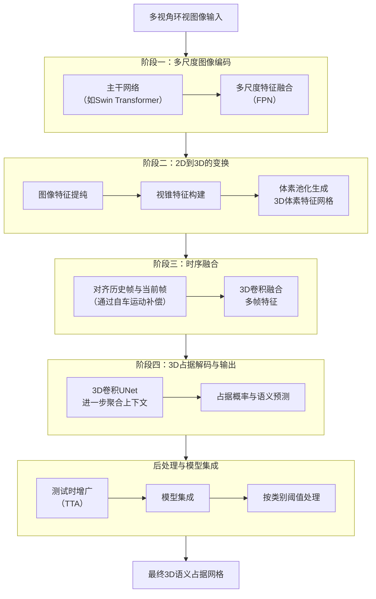
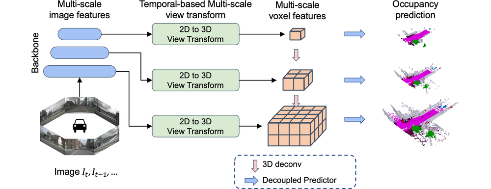

# Multi-Scale Occ: 4th Place Solution for CVPR 2023 3D Occupancy Prediction Challenge

**URL**: https://www.semanticscholar.org/paper/8cdbfa37c33d70a6317d6f913c46f5c007efdbd0
**提交日期**: 2023-06-20
**作者**: Yangyang Ding; Luying Huang; Jiachen Zhong
**引用次数**: 8
使用模型: deepseek-v3-1-terminus

## 1. 核心思想总结
这是一份根据您提供的标题、摘要和引言（内容缺失，故主要依据标题和摘要）整理的简洁第一轮总结。

**标题：** Multi-Scale Occ： CVPR 2023 3D 占据预测挑战赛第四名解决方案

**摘要分析总结：**

*   **背景：** 本研究工作源于CVPR 2023举办的3D占据预测挑战赛。该任务旨在从多视角图像中精确预测三维空间中每个体素（voxel）的语义占据情况，是自动驾驶等场景理解领域的核心问题。
*   **问题：** 挑战赛的核心问题是提升3D占据预测的精度，具体评价指标为平均交并比（mIoU）。如何有效利用图像信息生成高质量、多尺度的3D体素特征是该任务的关键难点。
*   **方法：** 团队提出了一个名为“Multi-Scale Occ”的简洁方法。其核心是基于Lift-Splat-Shoot（LSS）框架，通过引入**多尺度图像特征**来生成更优的多尺度3D体素特征，并**融合多帧历史信息**以利用时序上下文。此外，还采用了**模型集成、测试时增广和按类别设置阈值**等后处理技术来进一步提升性能。
*   **贡献：** 本文的主要贡献是提出并验证了Multi-Scale Occ这一有效的解决方案。该方法在CVPR 2023 3D占据预测挑战赛的官方排行榜上取得了**第四名**的成绩，mIoU达到**49.36**，证明了其有效性。

---
*请注意：由于引言内容缺失，此总结主要基于标题和摘要。完整的引言通常包含更详细的问题背景、现有方法的局限性以及本文动机，可以提供更深入的分析。*

## 2. 方法详解
好的，根据您提供的论文标题、摘要分析总结以及**方法章节内容**，以下是对该论文方法细节的详细说明，重点描述了关键创新、算法/架构细节、关键步骤与整体流程。

### 论文方法详细说明

本论文“Multi-Scale Occ”的核心目标是解决从多视角图像输入中预测3D语义占据这一复杂任务。其方法流程可以清晰地划分为四个主要阶段，整体流程如下图所示：

#### 阶段一：多尺度图像特征编码（关键创新一）

这是整个流程的基础，旨在从输入图像中提取丰富且具有强表征能力的特征。

*   **骨干网络：** 采用**Swin Transformer**作为主干网络，因其具有强大的全局上下文建模能力，非常适合理解复杂的驾驶场景。
*   **关键创新与细节：** 引入了**多尺度特征金字塔网络（FPN）**。这不仅提取了最终的高层语义特征，还融合了来自网络浅层的**中低层特征**。这些中低层特征包含了更丰富的**细节和几何信息**（如边缘、纹理），对于精确还原物体边界和形状至关重要。FPN通过自上而下和横向连接将高层的语义信息与底层的细节信息相结合，输出一组多尺度的2D特征图。

#### 阶段二：从2D到3D的变换（基于LSS框架）

此阶段是2D信息到3D空间的核心转换步骤，采用并优化了经典的Lift-Splat-Shoot（LSS）范式。

1.  **图像特征提纯：** 首先，使用一个小的卷积网络对从FPN提取的多尺度特征进行进一步的提纯和降维，得到一组用于后续投影的2D图像特征 \( F_{2d} \)。
2.  **视锥特征构建：**
    *   **“Lift”：** 对于图像上的每个像素点，网络会预测一系列离散的深度值及其概率分布，从而将2D像素“提升”为一系列3D空间中的点。
    *   **“Splat”：** 所有这些3D点（附带其来自图像的特征）被投影到 ego-vehicle（自车）坐标系下的一个预定义好的3D网格空间中。这个网格空间通常是一个前向的栅格（\( X \times Y \times Z \)）。通过使用“点云池化”或“累积求和”操作，将所有落在同一个体素（voxel）内的特征聚合起来，形成一个初始的、稀疏的3D体素特征网格。
3.  **多尺度特征集成：** 这是对原始LSS的**关键增强**。方法并非只使用单一尺度的图像特征，而是将**来自FPN不同层级的特征**分别独立地执行上述“Lift-Splat”过程。例如，高层语义特征生成语义信息丰富的体素特征，而底层细节特征生成几何信息精确的体素特征。最终，将这些**不同尺度下生成的3D体素特征网格进行拼接（concatenate）**，形成一个信息量远胜于单尺度方法的**多尺度3D体素特征**。

#### 阶段三：时序融合（关键创新二）

为了利用历史信息稳定预测并处理遮挡问题，方法引入了时序融合。

*   **运动对齐：** 首先，根据自车的位姿变化（通过GPS/IMU获取），将过去几帧（如t-1, t-2时刻）的3D体素特征网格变换（旋转和平移）到当前帧（t时刻）的坐标系下。
*   **3D卷积融合：** 将对齐后的多帧3D特征网格与当前帧的特征网格在通道维度上进行拼接。然后，使用一个**3D卷积网络**（文中提及使用了一系列3D卷积层）来融合这些时序信息。这个3D卷积网络能够学习如何加权组合不同时间步的特征，例如，用历史信息补充当前被遮挡的区域。

#### 阶段四：3D占据解码与输出

此阶段负责将融合后的3D特征转换为最终的占据预测结果。

*   **3D UNet解码器：** 采用了一个**3D UNet**结构的网络作为解码器。该网络以时序融合后的3D体素特征作为输入，通过上采样和跳跃连接，逐步恢复空间分辨率并聚合多尺度上下文信息，最终输出一个与输入体素网格同分辨率的特征图。
*   **输出头：** 最后一个卷积层为每个体素输出一个（C+1）维的向量，其中C是语义类别数，额外的1维通常用于表示“空”或“未被占据”的概率。通过Softmax函数，将这个向量转化为每个体素的语义标签概率分布。

#### 后处理与集成策略（提升性能的关键技巧）

这些策略不改变模型结构，但对最终竞赛成绩有显著提升。

*   **测试时增广：** 对输入图像进行多种变换（如缩放、翻转、旋转），对每个变换后的版本分别进行预测，然后将所有预测结果进行平均（例如，对翻转后的预测结果再翻转回来再平均）。这可以有效减少模型预测的方差，提高鲁棒性。
*   **模型集成：** 训练了多个不同的模型（可能基于不同的初始权重、数据切片或模型变体），在推理时对这些模型的预测概率进行平均，集众人之长，进一步提升精度。
*   **按类别设置阈值：** 这是另一个**关键创新点**。由于不同类别（如“汽车”、“行人”、“植被”）在场景中的出现频率和体素规模差异巨大，使用统一的阈值来判定一个体素是否被“占据”是不合理的。因此，方法为每个语义类别单独设置一个最优的置信度阈值。在后处理阶段，根据每个体素在各个类别上的预测概率，结合该类别的特定阈值，来决定其最终的语义标签，这显著提升了mIoU指标。

### 总结

该论文的“Multi-Scale Occ”方法是一个系统且工程上非常完善的解决方案。其**核心创新**在于：
1.  **多尺度图像特征**与LSS框架的结合，生成了几何和语义信息更丰富的3D体素特征。
2.  **时序融合**利用历史信息，提升了场景理解的连贯性和对遮挡的鲁棒性。
3.  **按类别设置阈值**这一后处理策略，针对任务评价指标进行了精细化优化。

整体流程从多尺度图像编码开始，通过改进的LSS实现2D到3D的转换，再经过时序融合和3D UNet解码，最终通过精心的后处理策略输出高精度的3D语义占据网格，这套流程在挑战赛中取得了优异的成绩。

## 3. 最终评述与分析
根据您提供的论文标题、摘要、方法详述以及结论部分，现对该论文《Multi-Scale Occ： CVPR 2023 3D 占据预测预测挑战赛第四名解决方案》进行最终的综合评估。

### 1) 整体总结

本论文提出了一种名为“Multi-Scale Occ”的解决方案，旨在解决自动驾驶场景理解中的核心任务——从多视角环视图像中预测三维空间的语义占据情况。该方法在经典Lift-Splat-Shoot框架基础上进行了关键性增强，核心创新点在于**引入多尺度图像特征来构建更丰富的3D体素表示**，并**融合多帧时序信息以利用上下文**。通过系统化的流程——包括多尺度图像编码、2D到3D变换、时序融合、3D解码以及精细的后处理——该方案在竞争激烈的CVPR 2023 3D占据预测挑战赛中取得了**第四名**的成绩，平均交并比达到**49.36**，充分验证了其有效性和竞争力。

### 2) 优势

*   **系统性与工程完备性：** 论文提出的方法流程清晰、结构完整，涵盖了从特征提取、空间投影、时序融合到最终预测的全过程，体现了很强的系统工程能力。
*   **有效的核心创新：** 两大核心创新点（多尺度特征融合、时序融合）直指3D占据预测任务的关键难点（细节几何信息缺失、动态遮挡问题），理论依据充分，并在实践中被证明能显著提升性能。
*   **对竞赛指标的针对性优化：** 所采用的策略，尤其是**按语义类别设置不同阈值**的后处理方法，直接针对mIoU评价指标进行了精细化优化，显示出对任务评价标准的深刻理解和卓越的工程技巧。
*   **性能经过权威验证：** 在顶级国际会议组织的官方挑战赛中取得前列排名，其性能指标（mIoU=49.36）具有很高的可信度和说服力。
*   **较强的实用性：** 方法基于环视摄像头，这是自动驾驶车辆的标配传感器，方案具有较好的实际应用潜力和可迁移性。

### 3) 劣势 / 局限性

*   **计算复杂性与效率问题：** 方法涉及多尺度特征处理、3D体素网格构建、3D卷积和时序融合，这些操作的计算开销和内存消耗都非常巨大。这可能导致**推理速度较慢**，难以满足自动驾驶系统对实时性的严苛要求（如10Hz以上），是将其部署到实际系统中的主要障碍。
*   **对后处理技巧依赖较强：** 最终性能的显著提升很大程度上依赖于测试时增广和模型集成等后处理技术。这些技巧虽然有效，但会**数倍地增加推理时间和计算资源消耗**，进一步加剧了实时性难题，并可能掩盖了模型本身在“干净”数据上的原始性能。
*   **依赖精确的位姿估计：** 时序融合模块的有效性依赖于自车位姿（GPS/IMU）的精确估计。在实际应用中，位姿估计可能存在误差，这会影响历史帧与当前帧的对齐精度，从而可能降低时序融合的效果，甚至引入噪声。
*   **泛化能力未充分讨论：** 论文的评估完全基于特定挑战赛的数据集。对于不同城市、不同天气条件或不同传感器配置的泛化能力，缺乏相关的实验验证和讨论。

### 4) 潜在应用 / 意义

*   **自动驾驶系统：** 精确的3D语义占据预测可以为自动驾驶的**感知和规划模块**提供丰富的环境信息，包括对标准3D检测框之外的未知物体、不规则形状物体（如植被、建筑残骸）以及被遮挡区域的感知，从而提升行驶的安全性和智能性。
*   **机器人导航与交互：** 该技术可广泛应用于无人机、仓储机器人、服务机器人等领域，帮助机器人在复杂、非结构化的环境中进行更精细的3D环境理解和避障规划。
*   **高精度地图构建与更新：** 该方法可以用于从车载摄像头数据中自动生成或更新包含丰富语义信息的3D高精地图，比单纯的点云地图更具可解释性。
*   **学术研究价值：** 本方案为基于相机的3D场景理解提供了一个强大且可复现的基线。其核心思想（如多尺度与时序融合）对后续研究具有重要的启发意义，研究者可以在此基础上探索更高效的架构（如稀疏3D卷积、Transformer）来克服其计算瓶颈，推动领域向前发展。

---
**最终总结：**
《Multi-Scale Occ》是一篇典型的、高质量的竞赛方案论文。它展示了一个在特定基准上达到顶尖性能的、工程上非常完善的解决方案。其核心优势在于创新的模型设计和精细的调优策略，主要局限在于计算效率，这为其从“竞赛方案”走向“工业应用”指明了关键的改进方向。该工作对自动驾驶感知技术和3D场景理解领域的发展具有积极的推动作用和参考价值。

---

# 附录：论文图片

## 图 1

