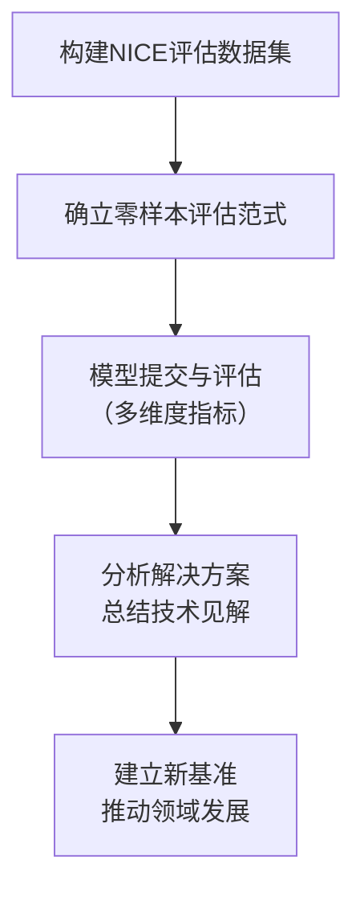
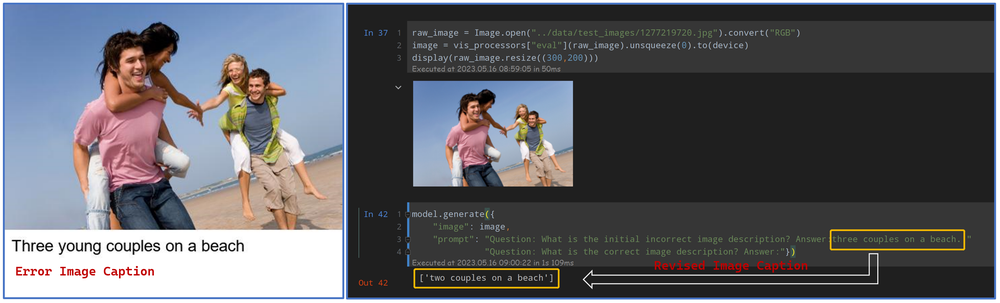
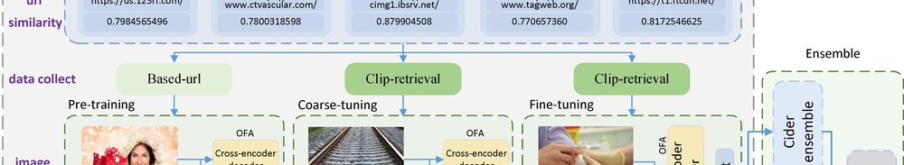
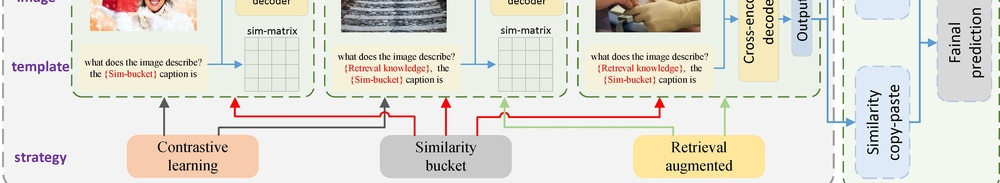

# NICE: CVPR 2023 Challenge on Zero-shot Image Captioning

**URL**: https://www.semanticscholar.org/paper/d7e0ca05d9aade28559d25db59ea54afd1e1ac0e
**提交日期**: 2023-09-05
**作者**: Taehoon Kim; Pyunghwan Ahn; Sangyun Kim; Sihaeng Lee; Mark Marsden; Alessandra Sala; Seung Wook Kim; Bohyung Han; Kyoung Mu Lee; Honglak Lee; Kyounghoon Bae; Xiangyu Wu; Yi Gao; Hailiang Zhang; Yang Yang; Weili Guo; Jianfeng Lu; Youngtaek Oh; Jae-Won Cho; Dong-Jin Kim; In-So Kweon; Junmo Kim; Woohyun Kang; Won Young Jhoo; Byungseok Roh; Jonghwan Mun; Solgil Oh; Kenan E. Ak; Gwang Lee; Yan Xu; Mingwei Shen; Kyomin Hwang; Wonsik Shin; Kamin Lee; Wonhark Park; Dongkwan Lee; N. Kwak; Yujin Wang; Yimu Wang; Tiancheng Gu; Xingchang Lv; Mingmao Sun
**引用次数**: 7
使用模型: deepseek-v3-1-terminus

## 1. 核心思想总结
好的，这是一份根据您提供的标题、摘要和引言内容整理的简洁第一轮总结。

---

### **关于论文《NICE: CVPR 2023 Challenge on Zero-shot Image Captioning》的第一轮总结**

**1. Background (背景)**
图像描述是连接计算机视觉与自然语言处理的关键任务。尽管现有技术已取得显著进展，但模型在泛化能力、鲁棒性和公平性方面仍面临挑战，尤其是在面对训练数据中未出现过的新颖视觉概念时。

**2. Problem (问题)**
当前图像描述模型容易过拟合于特定的训练数据分布，导致其在处理来自广泛领域、包含多样视觉概念的图像时，性能显著下降。因此，亟需开发能够进行**零样本**泛化的、更强大且公平的模型。

**3. Method (high-level) (方法 - 高层次)**
本研究通过组织一场**学术挑战赛**来推动该问题的解决。具体方法是：1）构建一个全新的、涵盖多领域视觉概念的评估数据集（NICE数据集）；2）不提供特定的训练数据，要求参赛模型直接在该数据集上进行**零样本**图像描述生成；3）从准确性和公平性等多个维度评估参赛模型。

**4. Contribution (贡献)**
本论文的主要贡献在于：1）引入了**NICE项目和新基准数据集**，为评估图像描述模型的零样本泛化能力提供了标准平台；2）通过挑战赛的形式，汇集并分析了**顶尖模型的解决方案**，为社区提供了宝贵的技术见解；3）推动了图像描述乃至更广泛的视觉-语言任务模型在**鲁棒性和公平性**方面的进步。

---

## 2. 方法详解
好的，基于您提供的初步总结和方法章节内容，以下是对该论文方法细节的详细说明。

需要首先明确的是，这篇论文的核心“方法”并非提出一种新的算法模型，而是**设计和执行一套系统性的评估框架（即NICE挑战赛）**，以此来推动和评估“零样本图像描述”这一任务。因此，方法细节的重点在于**评估基准的构建、评估范式的设计以及评估指标的选取**。

---

### **论文《NICE: CVPR 2023 Challenge on Zero-shot Image Captioning》方法细节详解**

#### **一、 整体流程与核心创新**

**1. 整体流程**
该方法的整体流程是一个完整的挑战赛周期，如下图所示：

**2. 核心创新**
该方法的关键创新点在于其**评估理念和框架的设计**，而非具体模型：
*   **创新一：真正意义上的零样本评估范式。** 要求模型在完全“未见”的测试集上进行评估，不提供任何针对该测试集的训练数据，严格测试模型的泛化能力。这与传统使用公开数据集（如COCO）划分的“零样本”有本质区别，后者仍可能存在于训练数据的分布内。
*   **创新二：以“人”为中心的公平性评估数据集。** NICE数据集的构建核心是覆盖广泛、平衡的“视觉概念”，特别是关注对人的描述，并确保在性别、年龄、肤色等属性上的公平性，这直接针对了现有模型存在的偏见问题。
*   **创新三：多维度、全方位的评估指标体系。** 不仅评估描述内容的准确性，还首次在大型挑战赛中系统性地引入并评估描述的**公平性**，并将**推理效率**作为重要考量，为工业应用提供参考。

---

#### **二、 关键步骤与架构细节**

**步骤一：构建NICE评估数据集——方法的基石**

这是整个挑战赛最关键的一环，其构建细节体现了方法的严谨性。

1.  **数据来源与筛选：**
    *   **来源：** 从大型开源数据集（如YFCC100M）中筛选图像，确保图像来源的多样性和复杂性。
    *   **筛选原则：** 重点关注包含**人物**的图像，因为对人的描述是检验模型公平性和社会常识的关键。同时，也包含大量不包含人物的图像，以全面评估模型能力。

2.  **数据标注流程：**
    *   **人工标注：** 所有图像的描述文本均由专业标注人员撰写，确保描述的高质量和自然性。
    *   **标注质量控制：** 采用严格的质控流程，如多人标注、交叉验证、专家审核等，以保证标注的准确性和一致性。

3.  **数据集的独特属性（架构细节）：**
    *   **领域广度：** 图像覆盖旅游、体育、日常活动、历史事件等多个领域，确保测试分布的广泛性。
    *   **视觉概念密度与新颖性：** 图像中包含丰富且可能训练数据中少见的物体、场景和活动。
    *   **公平性考量：** 对数据集中人物的性别、年龄组、感知肤色等属性进行平衡标注，为公平性评估提供基础。这是该方法在数据集构建上的一个关键架构细节。

**步骤二：确立“严格零样本”评估范式——方法的核心规则**

这是该方法区别于传统评估的核心。

*   **规则：** 参赛者**不允许使用NICE数据集的任何部分（包括图像和文本）进行训练或微调**。模型只能利用其**固有的、在挑战赛开始前已获得的知识**（例如，在LAION、COCO等公开数据集上预训练的知识）来生成描述。
*   **目的：** 彻底杜绝模型对测试集的“记忆”或“过拟合”，真实反映模型从已有知识向全新视觉概念和分布泛化的能力。

**步骤三：多维度评估指标体系——方法的衡量标尺**

该方法采用了一套综合的评估指标，从不同角度衡量模型性能。

1.  **准确性指标：**
    *   **传统文本生成指标：** 使用CIDEr、SPICE、METEOR等。这些指标通过比较生成描述与人工参考描述的相似度来衡量内容的准确性、流畅性和丰富性。
    *   **语义层面的评估：** 如SPICE，它将描述解析为场景图，评估其语义内容的匹配度，能更好地衡量事实准确性。

2.  **公平性指标——关键创新指标：**
    *   **度量对象：** 专门针对生成描述中关于**人物**的部分。
    *   **度量方法：** 例如，使用**性别偏见分数**。计算模型在描述图像中的人物时，正确识别性别的准确率，并分析其在不同性别群体上的表现差异。类似地，可以评估对年龄、肤色等属性的描述是否存在系统性偏见。目标是确保模型对所有人群的描述都保持公平和准确。

3.  **效率指标：**
    *   **度量对象：** 模型的推理速度。
    *   **度量方法：** 通常以**每秒处理的图像数量**或生成单条描述所需的**推理时间**来衡量。这为模型在实际应用中的可行性提供了重要参考。

**步骤四：解决方案分析与总结——方法的产出**

在挑战赛结束后，论文对顶尖参赛方案进行深入分析，这本身就是该方法的重要环节。
*   **分析内容：**
    *   **模型架构：** 总结主流方案采用的模型（如基于BLIP-2、Flamingo等大型预训练VLM的模型）。
    *   **技术策略：** 分析为提高零样本性能采用的关键技术，例如：**提示工程、思维链、集成方法、后处理优化**等。
    *   **性能关联分析：** 将不同技术策略与最终的准确性、公平性、效率得分进行关联，提炼出有效的技术路径和潜在的权衡。

---

#### **三、 总结**

该论文的“方法”本质上是一个**用于评估和推动技术进步的实验框架**。其**关键创新**在于构建了一个**公平、严格且全面的基准测试平台**。其**算法/架构细节**体现在**数据集的精心设计、评估范式的严格规定以及评估指标的多维度融合**上。其**关键步骤**从数据准备到最终分析，形成了一个完整的闭环，旨在为整个研究社区提供关于零样本图像描述模型能力的**宝贵洞察和明确的发展方向**，而非提出一个单一的算法模型。

## 3. 最终评述与分析
好的，这是基于您提供的初步总结、方法详述以及结论部分，对论文《NICE: CVPR 2023 Challenge on Zero-shot Image Captioning》进行的最终综合评估。

---

### **关于论文《NICE: CVPR 2023 Challenge on Zero-shot Image Captioning》的最终综合评估**

#### **1) 整体摘要**

本论文并非提出一种新颖的图像描述算法，而是通过组织CVPR 2023的NICE挑战赛，系统地构建了一个用于评估**零样本图像描述**模型泛化能力、鲁棒性和公平性的全新基准。其核心工作是创建了高质量的NICE数据集，并确立了严格的“纯零样本”评估范式，要求模型在完全未参与训练的新数据分布上直接进行测试。论文详细介绍了挑战赛的设计、数据集的构建细节、多维度评估指标（涵盖准确性、公平性和效率），并对顶尖参赛方案的技术路线进行了深入分析。最终，该研究通过这一系统性的评估框架，揭示了当前最先进模型的局限性，总结了有效的技术策略，并为未来视觉-语言模型在迈向更通用、更负责任的人工智能方向上提供了重要的见解和明确的路标。

#### **2) 优势**

*   **开创性的基准建设：** 论文最大的优势在于成功建立了一个被社区广泛认可的新基准。NICE数据集以其**领域广度、概念新颖性以及对“人”的关注**，有效弥补了现有基准（如COCO）在测试模型真实泛化能力方面的不足。
*   **严谨的评估范式：** 提出的“严格零样本”规则（禁止使用测试集数据训练）极具价值，它强制模型展示其核心的泛化能力，而非对特定测试集的过拟合，保证了评估结果的可靠性和挑战性。
*   **多维度、前瞻性的评估体系：** 超越传统的准确性指标，首次在大型挑战赛中系统性地引入并评估**公平性**，并将**推理效率**纳入考量。这体现了研究对技术社会影响和实际应用落地的深刻考量，引领了领域评估标准的新方向。
*   **高价值的社区贡献：** 该工作不仅是一个比赛，更是一份全面的技术分析报告。它对参赛方案（如基于BLIP-2、Flamingo等模型的方法）的总结，以及对**提示工程、思维链、模型集成**等有效策略的剖析，为后续研究者提供了宝贵的“经验手册”和技术起点。
*   **清晰的定位与执行力：** 论文目标明确，所有工作都紧密围绕“评估与分析”这一核心展开，从数据构建到最终分析，形成了一个完整、严谨的闭环，执行力强。

#### **3) 劣势 / 局限性**

*   **非算法创新：** 作为一篇基准论文，其核心贡献在于评估框架而非提出新的模型架构或学习算法。因此，对于寻求突破性算法创新的读者而言，其直接的技术新颖性可能有限。
*   **数据集的静态性：** 尽管NICE数据集质量很高，但任何静态数据集都可能随着时间推移而逐渐被模型“消化”（例如，参赛者可能会利用包含NICE图像的其他大规模数据进行预训练）。挑战赛的长期影响力依赖于社区的持续维护和数据集的版本更新。
*   **评估指标的固有缺陷：** 论文依赖的自动评估指标（如CIDEr, SPICE）本身存在局限性，它们虽然能提供量化参考，但无法完全替代人类对描述流畅性、逻辑性和创造性的评判。结论中可能提及的“最佳模型”仍与人类水平有差距。
*   **对计算资源的依赖：** 分析表明，表现优异的模型通常是参数量巨大的预训练视觉-语言模型。这间接反映了当前该领域对计算资源的严重依赖，可能提高了研究的门槛，并对模型的效率和可及性提出了挑战。

#### **4) 潜在应用 / 影响**

*   **推动模型发展：** NICE基准为开发下一代图像描述模型设立了明确的“标尺”。研究人员可以利用它来验证新方法在泛化能力、减少偏见等方面的有效性，从而直接推动更鲁棒、更公平的视觉-语言模型的研究。
*   **指导实际应用：** 对**公平性**和**效率**的强调具有强烈的现实意义。其研究成果可以指导在真实世界应用（如辅助技术为视障人士描述图像、社交媒体内容自动标注、自动驾驶场景理解）中部署更可靠、更负责任的AI系统。
*   **方法论迁移：** 该挑战赛的成功范式（严格零样本、多维度评估）可以被其他AI子领域（如视觉问答、视频描述等）所借鉴，用于评估模型在开放世界中的泛化能力。
*   **启发未来研究：** 论文结论揭示的挑战，如模型对复杂推理、常识理解以及长尾视觉概念的掌握仍不足，为未来研究指明了重点方向。例如，如何更有效地整合外部知识，如何设计更好的推理机制，将成为重要的研究课题。

---

# 附录：论文图片

## 图 1

## 图 2

## 图 3

## 图 4

## 图 5

## 图 6

## 图 7

## 图 8

## 图 9

## 图 10

