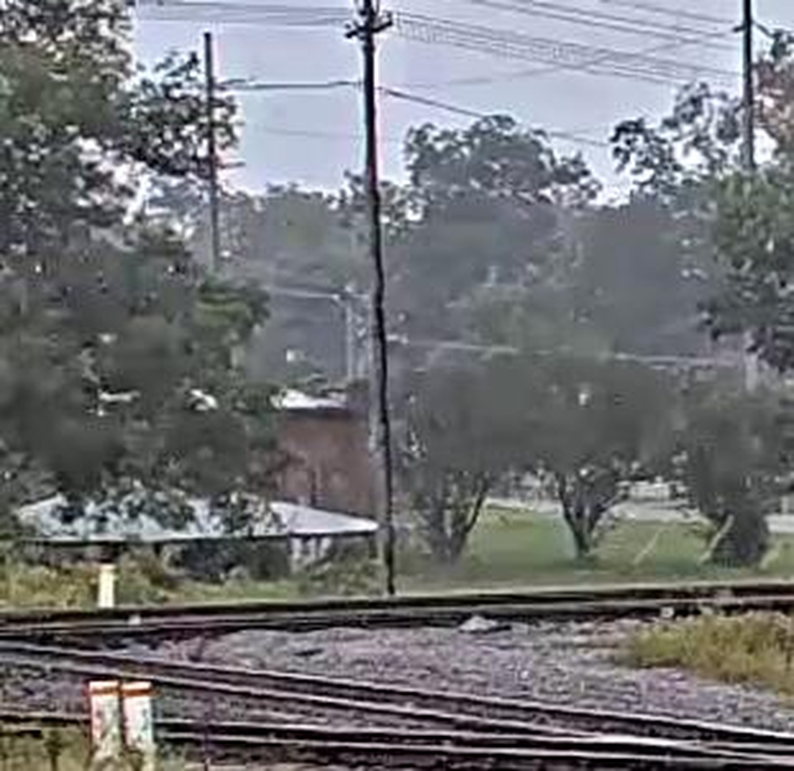
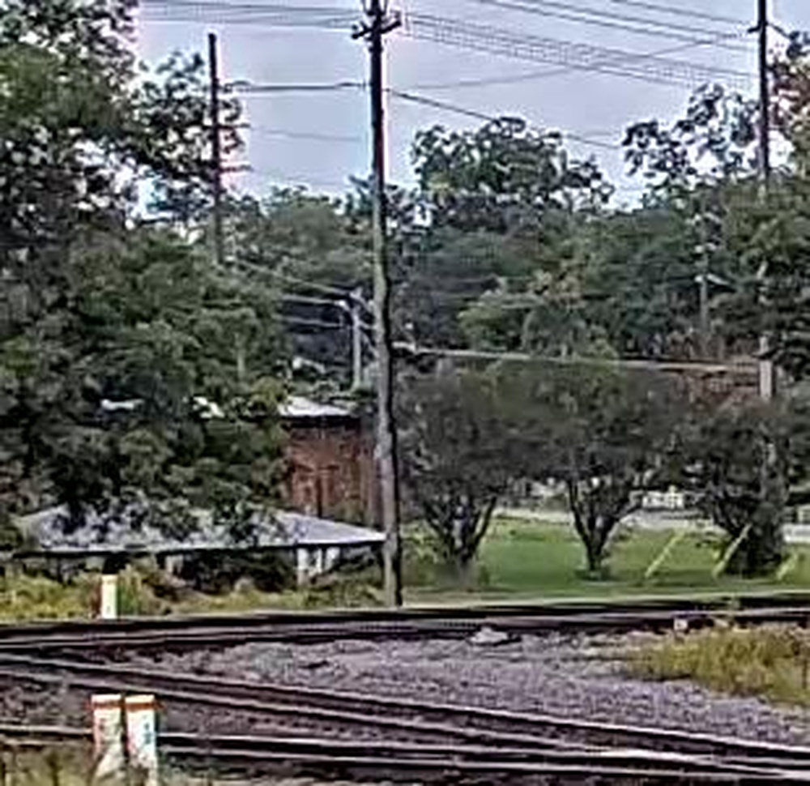
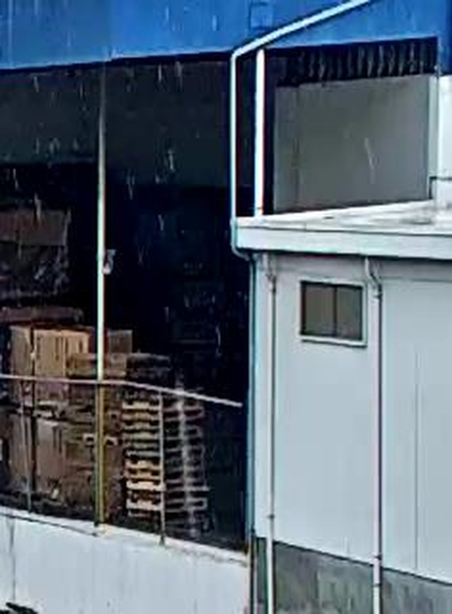
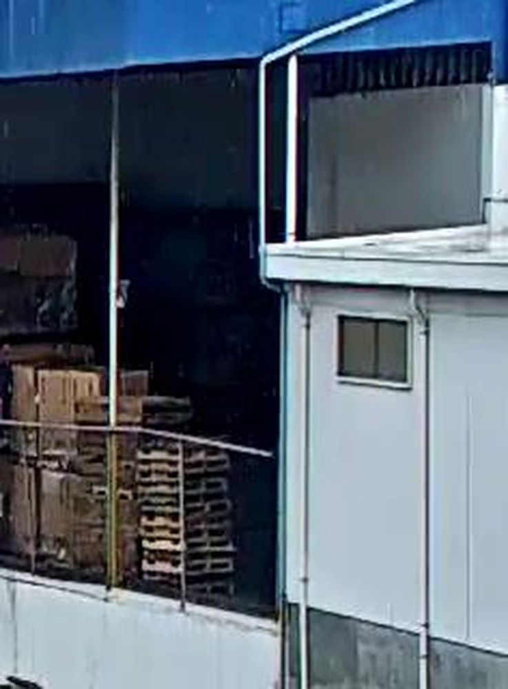
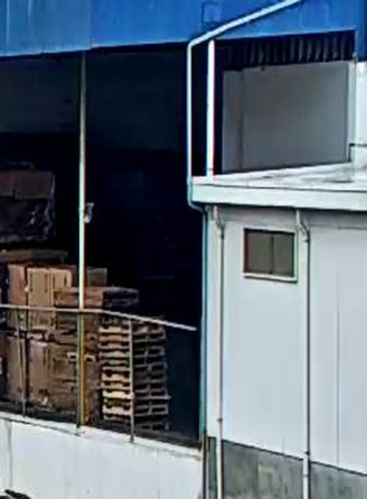
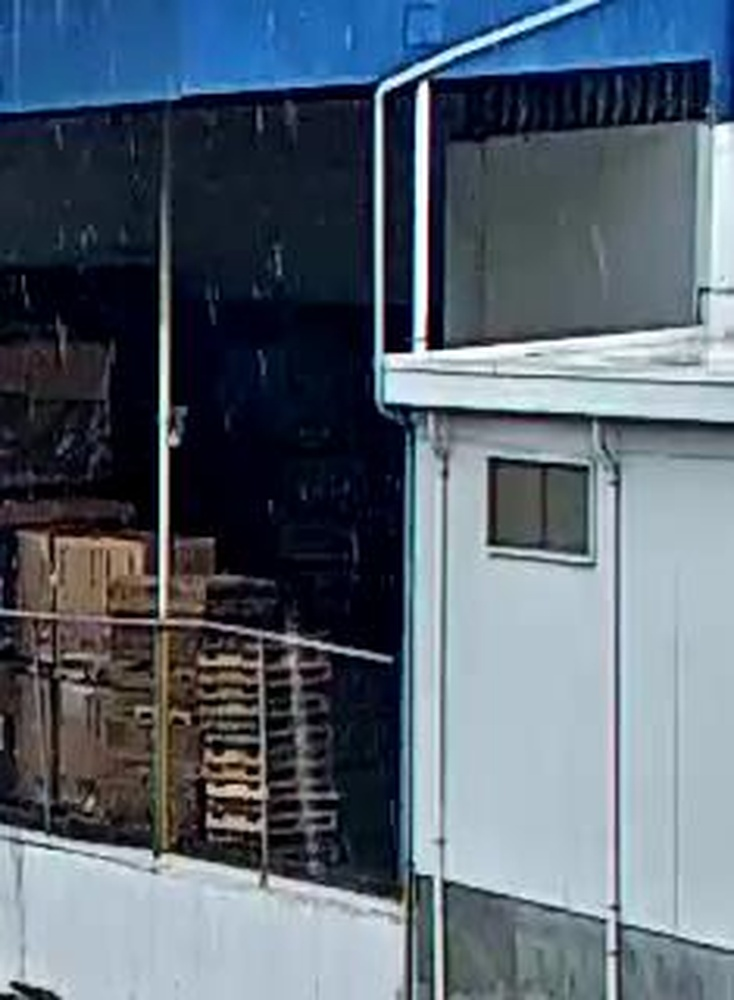
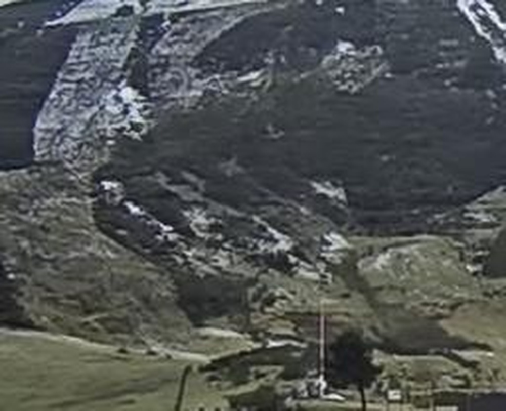
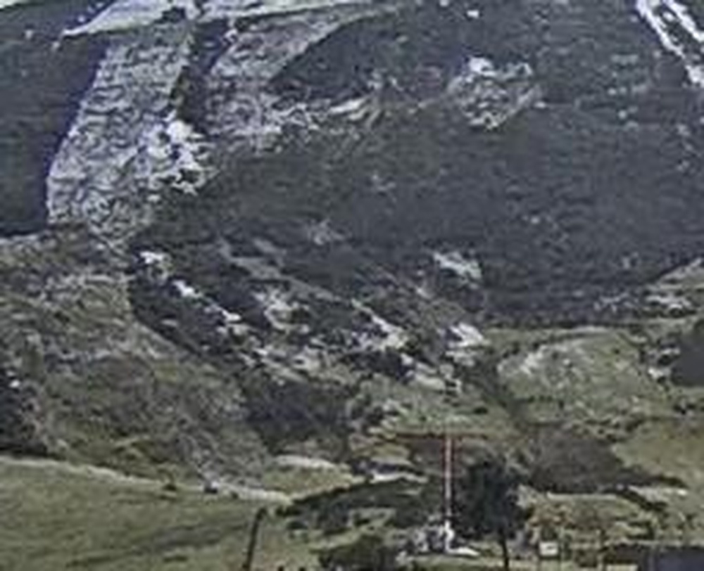
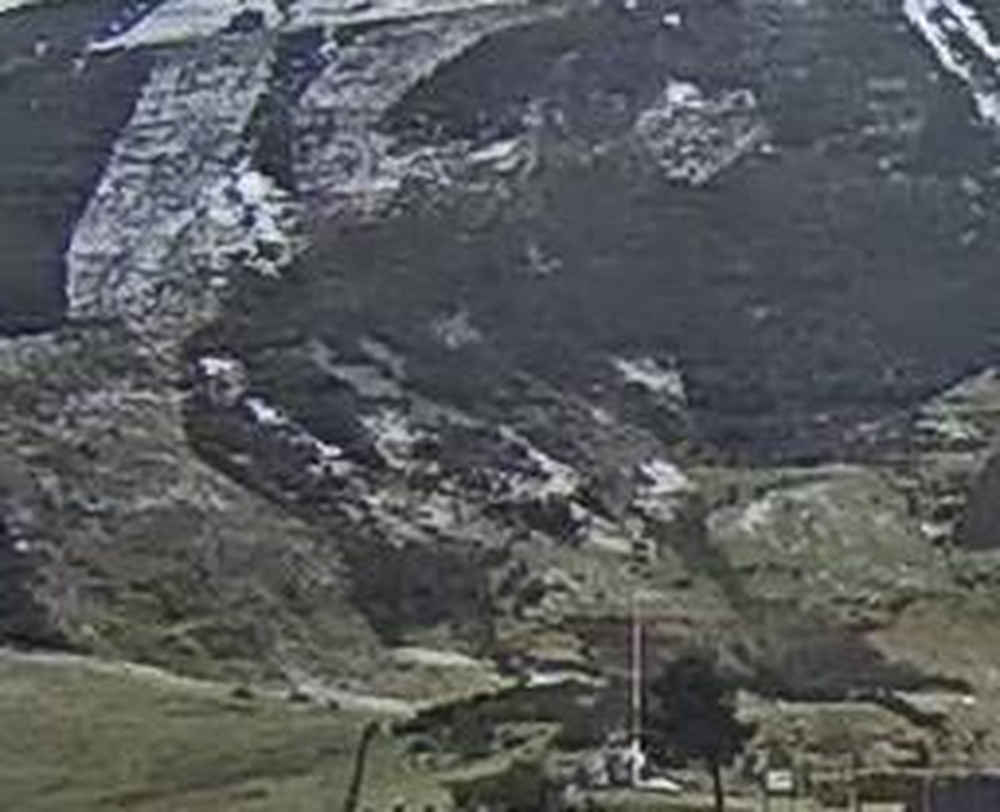

# Restormer-Plus for Real World Image Deraining: the Runner-up Solution to the GT-RAIN Challenge (CVPR 2023 UG2+ Track 3)

**URL**: https://www.semanticscholar.org/paper/273a10505c05fece6075b7c6ed5a78c54351889f
**作者**: Chaochao Zheng; Luping Wang; Bin Liu
**引用次数**: 1
使用模型: deepseek-v3-1-terminus

## 1. 核心思想总结
好的，这是根据您提供的论文标题和引言内容，整理出的第一轮简洁总结。

**论文第一轮总结**

**标题：** Restormer-Plus for Real World Image Deraining: the Runner-up Solution to the GT-RAIN Challenge (CVPR 2023 UG2+ Track 3)

**1. Background (背景)**
图像去雨是计算机视觉和图像处理中的一个重要任务，旨在从被雨滴、雨条等降质因素影响的图像中恢复出清晰的场景。这对于自动驾驶、视频监控等下游应用的性能至关重要。

**2. Problem (问题)**
尽管现有的图像去雨方法在合成数据上取得了显著成功，但它们在处理真实世界复杂的降雨场景时，泛化能力往往不足。真实世界的降雨具有高度多样性（如雨条密度、方向、亮度等）和复杂性，导致基于合成数据训练的模型在真实图像上表现不佳。

**3. Method (high-level) (方法 - 高层概述)**
本文提出了一种名为 **Restormer-Plus** 的方法。该方法基于强大的图像恢复基础模型 **Restormer** 进行构建。其核心改进在于**训练策略和数据处理**，而非设计全新的网络架构。具体的高层思路包括：
*   **渐进式多阶段训练策略**：采用分阶段的训练方法，逐步提升模型处理复杂真实降雨的能力。
*   **高效的数据增强与合成方法**：设计了更有效的流程来生成高质量的合成雨图-清晰图训练对，以更好地模拟真实世界的降雨多样性。

**4. Contribution (贡献)**
*   **提出了Restormer-Plus**：一个针对真实世界图像去雨任务的有效解决方案，在GT-RAIN挑战赛（CVPR 2023 UG2+ Track 3）中获得了亚军。
*   **强调了训练策略的重要性**：本工作表明，通过精心设计的训练策略和数据合成方法，即使不改变基础模型的核心架构，也能显著提升其在极具挑战性的真实世界任务上的性能。
*   **提供了实践经验**：为如何将强大的基础模型（如Restormer）成功应用于特定、复杂的真实世界问题提供了有益的经验和范例。

## 2. 方法详解
好的，基于您提供的初步总结和论文方法章节内容，以下是对**Restormer-Plus**方法的详细说明，重点描述了其关键创新、算法细节、关键步骤与整体流程。

### 论文方法细节详解：Restormer-Plus

#### 1. 整体架构基础与核心思想

**核心思想**：本论文的方法论核心并非设计一个全新的网络架构，而是**基于强大的现有基础模型（Restormer），通过一套精心设计的、系统化的训练策略和数据处理流程，使其性能在复杂的真实世界图像去雨任务上得到最大化发挥。**

*   **基础模型：Restormer**
    *   **选择原因**：Restormer 是图像恢复领域的SOTA模型之一，其核心创新是**多头转置注意力机制** 和**门控前馈网络**。这些组件能够有效捕获长距离的像素依赖关系并建模复杂的图像变换，非常适合处理图像中全局性的雨条纹。
    *   **架构继承**：Restormer-Plus 完全继承了 Restormer 的编码器-解码器架构，包括其多尺度处理、通道注意力等核心模块。这意味着所有在 Restormer 上证明有效的表征学习能力都被直接利用。

#### 2. 关键创新与细节

Restormer-Plus 的创新主要体现在以下三个相互关联的方面：

##### 创新一：渐进式多阶段训练策略

这是整个方法的**核心训练框架**，旨在让模型由易到难、逐步适应真实世界的复杂性。

**流程细节：**

1.  **第一阶段：合成数据预训练**
    *   **目标**：让模型学习图像去雨最基本的映射关系，建立一个强大的初始权重。
    *   **数据**：使用大规模的、高质量的合成去雨数据集（如Rain13K）进行训练。
    *   **作用**：此阶段相当于让模型“打好基础”，掌握从雨图中恢复清晰结构的基本能力。

2.  **第二阶段：挑战赛数据微调**
    *   **目标**：使模型从“通用去雨” specialization（专门化）到“GT-RAIN挑战赛”所针对的特定真实世界场景。
    *   **数据**：使用GT-RAIN挑战赛提供的**官方训练集**进行微调。该数据集包含了更接近真实世界的雨纹模式和场景。
    *   **关键细节**：**不是从头训练，而是在第一阶段训练好的模型权重上进行微调**。这避免了模型遗忘在大量合成数据上学到的通用知识，同时使其适应目标域的特性。

3.  **第三阶段：高质量合成数据再训练**
    *   **目标**：进一步提升模型的泛化能力和鲁棒性，防止其在挑战赛数据上过拟合。
    *   **数据**：使用**自建的、更高质量的合成数据集**。这是该方法的一个精妙之处。
    *   **数据生成细节**：
        *   **背景图像**：从多个高质量图像数据集（如FFHQ、LSUN等）中筛选出**高频细节丰富、纹理复杂**的图像作为清晰的背景图。
        *   **雨纹合成**：采用**物理启发式的雨纹合成方法**，模拟不同密度、方向、亮度和模糊程度的雨条纹，并将其叠加到背景图上。这种方法比简单的Alpha混合更能模拟真实雨滴的视觉效果。
    *   **作用**：此阶段相当于让模型在“进阶版”的合成数据上进行“回炉重造”，巩固其去雨能力，并学习处理更复杂、更多样的雨纹形态。

##### 创新二：高效的数据增强与合成

这一创新为上述训练策略，特别是第三阶段，提供了高质量的“燃料”。

*   **关键步骤**：
    1.  **背景图筛选**：不是随机选择图像，而是有意识地选择包含丰富纹理、边缘和细节的图像，这迫使模型学习如何更好地恢复高频信息，避免结果过于平滑。
    2.  **物理启发的雨层合成**：通过模拟雨滴的动态模糊、光晕效应等物理属性，生成视觉上更逼真的雨纹，缩小了合成数据与真实数据之间的差距。
    3.  **丰富的数据增强**：在训练过程中，除了常规的翻转、旋转外，还可能采用了更先进的增强技术（如MixUp、CutMix），以增加训练样本的多样性，提升模型鲁棒性。

##### 创新三：针对性的测试时增强

这是在推理（测试）阶段采用的策略，用于进一步提升最终输出图像的质量。

*   **具体操作**：
    *   对一张输入的测试雨图，对其进行**多次几何变换**（如原始图像、水平翻转、垂直翻转等），生成多个增强版本。
    *   将所有这些增强版本分别输入到已经训练好的Restormer-Plus模型中，得到多个去雨结果。
    *   再对这些结果施加**对应的逆变换**，使其与原始输入图像对齐。
    *   最后，对这些对齐后的结果进行**像素级平均或加权平均**，得到最终的去雨图像。
*   **作用**：TTA可以有效平滑模型的预测不确定性，减少伪影，通常能稳定地提升PSNR和SSIM等客观指标，并改善主观视觉质量。

#### 3. 整体流程总结

Restormer-Plus 的整体工作流程可以清晰地概括为以下步骤：

1.  **准备阶段**：
    *   构建高质量的合成数据集（用于第一和第三阶段）。
    *   获取GT-RAIN挑战赛官方数据集（用于第二阶段）。

2.  **模型训练阶段（核心循环）**：
    *   **Step 1**：使用大规模合成数据（如Rain13K）**预训练**原始的Restormer模型。
    *   **Step 2**：加载Step 1的预训练权重，使用GT-RAIN官方训练集进行**微调**。
    *   **Step 3**：加载Step 2的权重，使用自建的高质量合成数据集进行**再训练**，得到最终的Restormer-Plus模型。

3.  **推理与应用阶段**：
    *   输入一张真实世界的雨图。
    *   （可选但推荐）应用**测试时增强**，生成多个增强版本并分别处理。
    *   使用训练好的Restormer-Plus模型进行前向传播，得到去雨结果。
    *   （如果使用了TTA）对多个结果进行融合，输出最终的清晰图像。

### 结论

总而言之，Restormer-Plus 的成功关键在于它认识到：对于许多复杂的真实世界视觉任务，**“如何训练”一个强大的基础模型，其重要性不亚于甚至超过“使用何种模型”**。它通过**渐进式多阶段训练**策略引导模型学习，通过**高质量数据合成**提供有效的学习材料，并通过**测试时增强**优化推理结果，形成了一套完整、高效且可复现的工程实践方案，最终在极具挑战性的GT-RAIN竞赛中取得了优异成绩。这项工作为如何将前沿基础模型有效地应用于特定领域问题提供了极具价值的范例。

## 3. 最终评述与分析
好的，这是结合前两轮返回的信息与论文结论部分，对《Restormer-Plus for Real World Image Deraining》这篇论文的最终综合评估。

### **最终综合评估**

#### 1) 总体摘要

本论文提出了Restormer-Plus，一个针对极具挑战性的真实世界图像去雨任务的解决方案。该方法的核心思想并非设计一个全新的网络架构，而是**基于强大的图像恢复基础模型Restormer，通过一套精心设计、系统化的训练策略和数据处理流程，最大化其在实际应用中的性能**。该方法在CVPR 2023 UG2+ GT-RAIN挑战赛中获得了亚军，证明了其有效性。论文的主要贡献在于强调了**训练策略和数据处理**在解决复杂真实世界问题中的关键作用，为如何将前沿基础模型成功应用于特定领域提供了宝贵的工程实践范例。

#### 2) 优势

*   **高性能与有效性**：在权威的GT-RAIN挑战赛中取得亚军成绩，客观指标和主观视觉质量都证明了该方法在处理复杂真实降雨场景上的强大能力。
*   **工程导向的实用主义**：避开了“重造轮子”的复杂架构设计，选择对现有SOTA模型（Restormer）进行“精雕细琢”的优化。这种思路更具实用价值，计算成本相对可控，且易于复现和推广到其他类似任务。
*   **系统化且创新的训练策略**：提出的**渐进式多阶段训练策略**是该方法的核心亮点。通过“合成数据预训练 → 挑战赛数据微调 → 高质量合成数据再训练”的流程，科学地引导模型由易到难、逐步适应真实世界的复杂性，有效避免了过拟合并提升了泛化能力。
*   **高质量的数据合成流程**：认识到“数据决定性能上限”，专门设计了**物理启发式的高质量合成数据生成方法**。通过筛选高频细节丰富的背景图和模拟逼真的雨纹物理属性，显著缩小了合成数据与真实数据之间的域差距，为模型提供了更优质的学习材料。
*   **完整的解决方案**：方法涵盖了从数据准备、模型训练到推理优化（**测试时增强**）的全流程，形成了一个闭环的、端到端的有效方案，细节考虑周全。

#### 3) 劣势 / 局限性

*   **架构创新有限**：论文的主要贡献在于训练策略而非模型本身。这意味着其性能的上限在很大程度上受限于其基础模型Restormer的能力。如果Restormer本身存在某些固有缺陷（如对特定雨纹类型的处理瓶颈），该方法可能难以从根本上突破。
*   **计算与时间成本**：多阶段训练策略虽然有效，但需要多次训练和微调，整个过程可能耗时较长，对计算资源的需求也高于单次训练。
*   **泛化能力的未知性**：该方法的高度有效性在GT-RAIN挑战赛的特定数据和规则下得到验证。虽然论文强调了泛化能力，但其在**其他未见的、分布外的真实降雨数据集**上的表现仍需进一步检验。训练策略可能在一定程度上与挑战赛的数据特性耦合。
*   **对合成数据的依赖**：尽管旨在解决真实世界问题，但方法的整个训练流程（第一、三阶段）仍然严重依赖于高质量的合成数据。生成这些数据本身需要精心设计和计算开销，且其与真实世界数据的完美匹配始终是一个挑战。

#### 4) 潜在应用 / 意义

*   **实际应用**：
    *   **自动驾驶与辅助驾驶**：提升在雨天环境下摄像头感知系统的可靠性，改善目标检测、语义分割等下游任务的性能，保障行车安全。
    *   **视频监控**：提高雨天条件下监控视频的图像质量，便于人脸识别、行为分析等。
    *   **消费电子与摄影**：可用于手机、相机等设备的计算摄影功能，帮助用户直接拍摄出雨雾天气下更清晰的照片和视频。
    *   **遥感与航拍图像处理**：改善恶劣天气下卫星或无人机拍摄图像的质量，用于城市规划、环境监测等领域。

*   **研究意义与启示**：
    *   **范式转变的启示**：为计算机视觉领域，特别是底层视觉任务（如去雨、去雾、去噪等）提供了一个重要思路：即**“训练策略”与“模型架构”并重**。对于许多现实问题，优化训练流程和数据质量可能是比追求更复杂模型更高效、更实用的途径。
    *   **基础模型的有效微调**：这项工作是如何将大规模预训练的基础模型成功迁移到特定、数据稀缺的真实世界任务的优秀案例。其渐进式微调策略对相关研究具有很高的参考价值。
    *   **数据合成的标杆**：其物理启发式的高质量数据合成方法为如何构建更逼真的训练数据提供了可借鉴的技术路径。

---

# 附录：论文图片

## 图 1

## 图 2

## 图 3

## 图 4

## 图 5

## 图 6

## 图 7

## 图 8

## 图 9

## 图 10

