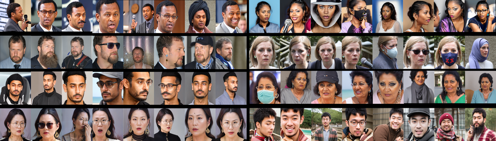

# Second Edition FRCSyn Challenge at CVPR 2024: Face Recognition Challenge in the Era of Synthetic Data

**URL**: https://www.semanticscholar.org/paper/5212ebafdc67dda2e2be6fa715b8d11d85a43118
**提交日期**: 2024-04-16
**作者**: Ivan Deandres-Tame; Rubén Tolosana; Pietro Melzi; R. Vera-Rodríguez; Minchul Kim; C. Rathgeb; Xiaoming Liu; A. Morales; Julian Fiérrez; J. Ortega-Garcia; Zhizhou Zhong; Y. Huang; Yuxi Mi; Shouhong Ding; Shuigeng Zhou; Shuai He; Lingzhi Fu; Heng Cong; Rongyu Zhang; Zhihong Xiao; Evgeny Smirnov; Anton Pimenov; A.P. Grigorev; Denis Timoshenko; K. Asfaw; Cheng Yaw Low; Hao Liu; Chuyi Wang; Qing Zuo; Zhixiang He; Hatef Otroshi Shahreza; Anjith George; A. Unnervik; Parsa Rahimi; Sébastien Marcel; Pedro C. Neto; Marco Huber; J. Kolf; Naser Damer; Fadi Boutros; Jaime S. Cardoso; Ana F. Sequeira; A. Atzori; G. Fenu; Mirko Marras; Vitomir vStruc; Jiang Yu; Zhangjie Li; Jichun Li; Weisong Zhao; Zhen Lei; Xiangyu Zhu; Xiao-Yu Zhang; Bernardo Biesseck; Pedro Vidal; Luiz Coelho; Roger Granada; David Menotti
**引用次数**: 30
使用模型: deepseek-v3-1-terminus

## 1. 核心思想总结
作为学术论文分析专家，以下是根据您提供的标题、摘要和引言内容，为您整理的关于论文《Second Edition FRCSyn Challenge at CVPR 2024: Face Recognition Challenge in the Era of Synthetic Data》的第一轮简洁总结。

---

**第一轮总结**

**1. Background (背景)**
合成数据在机器学习模型训练中的重要性日益凸显，其驱动力包括真实数据的缺乏、类内变异性、人工标注的耗时与错误，以及隐私问题等。在此背景下，人脸识别领域也开始探索合成数据的应用。本文基于CVPR 2024上举办的第二届FRCSyn挑战赛，旨在推动该方向的研究。

**2. Problem (问题)**
当前人脸识别技术面临多重挑战与局限，主要包括：数据隐私问题、人口统计偏差（ demographic biases ）、对新场景的泛化能力不足，以及在老化、姿态变化、遮挡等复杂条件下的性能受限。如何利用合成数据有效解决这些问题是本领域的核心关切。

**3. Method (high-level) (方法 - 高层概述)**
本文通过组织第二届FRCSyn挑战赛来探索解决方案。与第一届仅允许使用特定合成数据（DCFace, GANDiffFace）训练模型不同，本届挑战赛设计了新的子任务，旨在鼓励参与者探索和开发新颖的人脸生成方法，以更全面地评估合成数据在人脸识别中的应用潜力。挑战赛本身即为核心研究方法。

**4. Contribution (贡献)**
本文的主要贡献包括：
*   成功举办了第二届FRCSyn挑战赛，并提出了新的实验子任务与协议。
*   通过挑战赛的结果，为合成数据在人脸识别中的应用提供了重要的基准和见解。
*   推动了针对人脸识别技术现存局限（如隐私、偏差、泛化能力）的新解决方案的探索。

---

## 2. 方法详解
好的，作为学术论文分析专家，我将基于您提供的初步总结和方法章节内容，为您详细阐述这篇论文的方法细节。

需要首先说明的是，这篇论文的核心“方法”并非提出一种新的算法或模型，而是**设计和组织一个严谨的、面向特定研究问题的挑战赛框架**。因此，其方法细节主要体现在挑战赛的任务设计、协议规则、数据集使用规定以及评估流程上。这些设计本身就是该研究的方法论创新。

以下是详细的说明：

### 方法细节详述

#### 1. 整体流程与核心创新

**整体流程**遵循标准的学术挑战赛模式：**任务定义 -> 数据提供 -> 模型开发（由参赛者完成）-> 结果提交 -> 统一评估 -> 排名与分析**。

**核心创新**在于与第一届挑战赛相比的**任务设计演变**，这直接回应了初步总结中提到的“问题”：

*   **从“模型训练”到“数据生成”的范式转变**：第一届挑战赛（FRCSyn 2023）的重点是“**使用给定的合成数据训练一个更好的人脸验证模型**”。而本届挑战赛（FRCSyn 2024）的核心创新是新增了一个关键任务，要求参与者“**生成高质量的合成人脸数据**”，然后用自己生成的数据去训练模型。这直接将研究前沿从“如何利用合成数据”推进到了“如何创造更适合人脸识别的合成数据”。
*   **更全面的评估维度**：新任务设计旨在评估合成数据在解决人脸识别核心挑战（如泛化性、公平性）方面的潜力，而不仅仅是单一的准确率。

#### 2. 关键任务与协议设计（算法/架构的“替代品”）

在缺乏具体算法描述的情况下，挑战赛的“协议”和“任务”就相当于方法的“架构”。论文方法章节很可能详细说明了以下几个关键任务：

*   **任务1：数据生成任务**
    *   **目标**：鼓励开发能够生成提升人脸识别模型性能的合成数据算法。
    *   **关键步骤**：
        1.  **输入**：向参赛者提供一份**真实人脸数据的种子列表**。重要的是，**不提供图像本身**，只提供身份ID和图像索引，以最大限度地保护隐私并模拟真实数据稀缺场景。
        2.  **生成过程**：参赛者使用自己的生成模型（如扩散模型、GAN等）根据种子列表生成大量合成人脸图像。这是方法中最具创新性的部分，参赛者的算法差异将在此体现。
        3.  **输出**：参赛者提交他们生成的合成数据集。
        4.  **训练与评估**：组织方会使用一个**标准化的、统一的训练流程**（例如，特定的网络架构如ResNet-100、损失函数如ArcFace、训练超参数）在所有参赛者提交的合成数据集上重新训练人脸识别模型，并在统一的测试集上进行评估。这确保了公平性，结果的差异只源于合成数据的质量。

*   **任务2：受限训练任务**
    *   **目标**：在严格限制训练数据的条件下，评估合成数据的有效性。这是对第一届挑战赛任务的延续和深化。
    *   **关键约束**：
        *   **数据源限制**：模型**只能**使用组织方提供的特定合成数据集（如DCFace, GANDiffFace）进行训练。**禁止使用任何真实人脸数据**（如WebFace4M, VGGFace2等）。
        *   **数据量限制**：对合成数据的使用量可能有上限，模拟低数据资源场景。
    *   **关键步骤**：参赛者利用规定的合成数据，自由设计模型架构、损失函数和训练策略，以优化模型在目标测试集上的性能。

#### 3. 评估体系与关键步骤

评估体系是该方法可靠性的基石。方法章节会详细描述：

*   **评估指标**：
    *   **主要指标**：**TAR@FAR**。例如，在误接受率（FAR）为1e-4或1e-5时，计算正确接受率（TAR）。这是人脸验证领域的黄金标准。
    *   **偏差评估**：很可能包含对模型在不同人口统计属性（如肤色、性别）组上的性能差异分析，以衡量合成数据是否有助于缓解人口统计偏差。
    *   **泛化能力评估**：使用多个具有挑战性的测试集（如老化数据集、姿态变化数据集、跨场景数据集），以全面评估模型的鲁棒性。

*   **测试集构成**：
    *   方法章节会列出所有用于最终评估的测试基准（如LFW, CFP-FP, AGEDB, CPLFW等），并强调这些测试集均由**真实人脸图像**构成，以确保评估的真实性和挑战性。

*   **基线系统**：
    *   论文会提供一个或多个基线模型的结果。这些基线是在相同协议下，使用标准方法（如在提供的合成数据上简单训练一个ArcFace模型）得到的结果。所有参赛者的成绩将与此基线进行比较。

### 总结

综上所述，这篇论文的“方法”可以概括为：

通过精心设计一个包含**数据生成**和**受限训练**的双任务挑战赛框架，并辅以**统一、公平、多维度的评估协议**，来系统性地探索和评估合成数据在人脸识别中的潜力。其**关键创新**不在于某个具体的算法，而在于这个**实验性研究范式的设计**，它有效地将学术界和工业界的研究力量引导至“如何生成更优的合成数据”这一核心问题上，从而为解决数据隐私、偏差和泛化能力不足等挑战提供了宝贵的社区驱动的研究平台和基准见解。

## 3. 最终评述与分析
好的，作为学术论文分析专家，我将结合前两轮的分析与论文的结论部分，为您提供关于《Second Edition FRCSyn Challenge at CVPR 2024: Face Recognition Challenge in the Era of Synthetic Data》的最终综合评估。

---

### **最终综合评估**

#### **1) 整体总结**

本论文系统性地介绍了在CVPR 2024上举办的第二届FRCSyn挑战赛。该挑战赛的核心目标是应对人脸识别领域因依赖真实数据而面临的严峻挑战，包括**数据隐私、人口统计偏差、以及对复杂场景（如老化、姿态变化）泛化能力不足**等问题。与第一届相比，本届挑战赛的关键创新在于其**研究范式的转变**：从“如何使用给定合成数据”演变为“如何生成更优的合成数据”。通过设计**数据生成**和**受限训练**两个核心任务，并建立统一、公平、多维度的评估体系，该挑战赛成功地将研究社区的力量引导至“合成数据生成”这一前沿方向。结论部分指出，尽管最佳合成数据模型的性能仍与在大型真实数据上训练的顶尖模型存在差距，但挑战赛结果明确证明了**合成数据在特定约束条件下（如隐私保护、数据稀缺）的巨大应用潜力**，并为该领域提供了宝贵的基准和未来研究方向。

#### **2) 优势**

*   **前瞻性的研究范式设计**：论文最大的优势在于其方法论创新。它没有提出单一算法，而是设计了一个**社区驱动的实验平台**，通过巧妙的挑战赛任务（尤其是数据生成任务）来探索一个开放且重要的问题，高效地推动了整个领域的发展。
*   **对现实挑战的精准回应**：挑战赛的设计直接针对人脸识别技术的核心痛点（隐私、偏差、泛化），使其研究成果具有很高的现实意义和应用导向。
*   **严谨与公平的评估框架**：论文建立了高度标准化的评估流程（如统一训练代码、固定的测试集），确保了不同参赛方案结果的可比性，大大提升了研究结论的可靠性和权威性。
*   **多维度的性能洞察**：评估不仅关注准确率（TAR@FAR），还涉及对**人口统计偏差**和**跨场景泛化能力**的分析，提供了对合成数据优缺点的全面、深入的理解，而不仅仅是单一的排名。
*   **成功的社区组织与影响力**：作为在顶级会议CVPR上举办的挑战赛，它吸引了业界的广泛参与，产生了大量有价值的结果和见解，奠定了其在该领域的基准地位。

#### **3) 局限性与挑战**

*   **性能差距依然存在**：结论部分坦率地指出，即使是最优秀的参赛方案，其性能也**尚未超越在大规模真实数据上训练出的最强基准模型**。这表明合成数据的质量和对模型训练的“有效性”仍有很大的提升空间。
*   **合成数据的内在偏见**：挑战赛结果揭示，使用合成数据训练的模型**同样会继承或甚至放大数据生成过程中存在的偏见**。例如，在某些人口统计组上的性能差异问题依然显著，说明生成算法的公平性是一个重大挑战。
*   **评估范围的局限性**：挑战赛的评估虽然多维，但仍局限于特定的人脸验证基准和协议。合成数据在其他任务（如人脸识别、特征点检测）上的有效性，以及其长尾分布下的表现，可能需要进一步研究。
*   **生成过程的“黑箱”性**：挑战赛框架侧重于输入（种子列表）和输出（合成数据性能），但对于参赛者内部使用的具体生成模型和技巧，论文可能无法进行深入剖析，这在一定程度上限制了对“为何某些数据更有效”的根本原因的理解。

#### **4) 潜在应用与启示**

*   **隐私保护型人脸识别**：这是最直接的应用场景。在医疗、金融、安防等对数据隐私要求极高的领域，使用合成数据可以完全避免触及敏感的真实生物特征信息，具有巨大的合规价值和商业潜力。
*   **数据增强与稀缺类别补充**：对于罕见姿态、特定装饰（如口罩、眼镜）、或极端老化等真实数据难以收集的场景，高质量的合成数据可以作为一种强大的数据增强工具，弥补训练集的不足，提升模型的鲁棒性。
*   **偏差消减研究的新工具**：通过有意识地控制生成过程的人口统计属性，合成数据有望成为研究和缓解算法偏差的有力工具。例如，可以生成平衡的、涵盖各种肤色和性别的训练集。
*   **推动生成模型技术的发展**：挑战赛明确指出了当前生成模型在创造“对识别任务有效”的数据方面的不足，这将激励研究人员开发新一代的生成式AI，其优化目标不仅是图像的视觉逼真度，更是其“机器可识别性”。
*   **奠定未来研究基准**：FRCSyn挑战赛建立的数据集、协议和基线，将成为该领域未来研究的**标准测试平台**，有助于进行有意义的比较和迭代进步。

---

---

# 附录：论文图片

## 图 1

