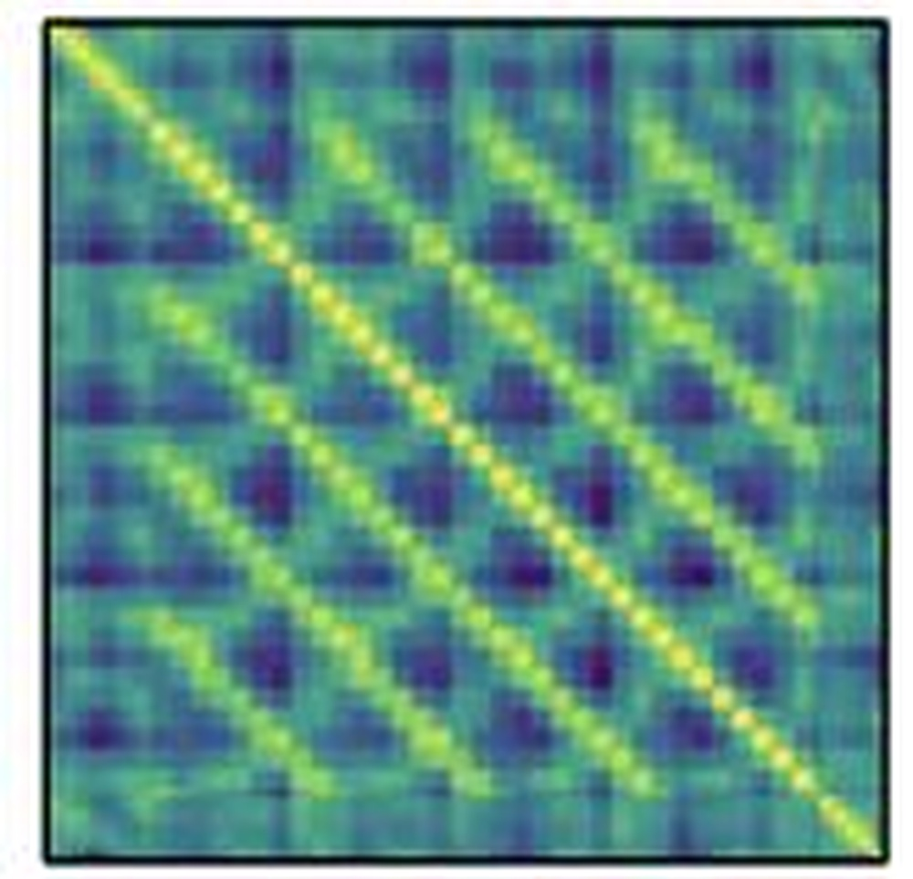

# Submission to Generic Event Boundary Detection Challenge@CVPR 2022: Local Context Modeling and Global Boundary Decoding Approach

**URL**: https://www.semanticscholar.org/paper/19bc3f362c116412a5f5218b3459e95d639e4fc6
**提交日期**: 2022-06-30
**作者**: Jiaqi Tang; Zhaoyang Liu; Jing Tan; Chen Qian; Wayne Wu; Limin Wang
**引用次数**: 1
使用模型: deepseek-v3-1-terminus

## 1. 核心思想总结
这是一份针对论文《Submission to Generic Event Boundary Detection Challenge@CVPR 2022: Local Context Modeling and Global Boundary Decoding Approach》的第一轮简洁总结。

**1. Background (背景)**
*   **研究领域**： 视频理解中的通用事件边界检测。
*   **核心任务**： 自动检测视频中人类自然感知到的事件边界点，即场景或活动发生变化的时刻。该任务对于视频内容解析至关重要。

**2. Problem (问题)**
*   **核心挑战**： 通用事件边界具有多样化的模式（例如，场景切换、物体进出、动作改变），这使得构建一个统一的、鲁棒的检测模型非常困难。

**3. Method (方法 - 高层次概述)**
*   **核心思想**： 提出一种双子网络架构，分别从局部和全局视角处理问题。
*   **方法流程**：
    1.  **局部上下文建模子网络**： 负责感知视频中多样化的边界模式，生成强大的视频特征表示和初步的局部边界置信度。
    2.  **全局边界解码子网络**： 基于局部子网络提供的特征和置信度，从整个视频的全局视角出发，推理并最终解码出精确的事件边界。

**4. Contribution (贡献)**
*   **方法创新**： 提出了一种新颖的“局部建模-全局解码”框架，专门针对GEBD任务中边界模式多样性的挑战。
*   **性能卓越**： 在Kinetics-GEBD测试集上取得了85.13%的F1分数，相比基线方法性能提升超过22%（绝对值），证明了该方法的有效性。
*   **资源开放**： 公开了代码，有利于推动该研究领域的可复现性和进一步发展。

## 2. 方法详解
好的，基于您提供的初步总结和论文方法章节的内容，以下是对该论文方法细节的详细说明，重点突出了其关键创新、算法/架构细节、关键步骤与整体流程。

### 论文方法详细说明

该论文的核心是提出一个名为 **“局部上下文建模与全局边界解码”** 的双子网络框架，以应对通用事件边界检测中边界模式多样化的核心挑战。其基本逻辑是：先通过一个强大的局部网络“感受”和“提名”可能的边界点，再通过一个全局网络“审视”整个视频序列，对初步提名进行精炼和最终决策。

#### 一、 整体流程概述

整个方法的流程可以清晰地分为三个主要阶段，其整体架构如下图所示：

```
[输入视频片段] 
     |
     v
1. 特征提取 (Backbone Network)
     | (提取每个视频帧的视觉特征)
     v
2. 局部上下文建模子网络 (Local Context Modeling)
     | (生成局部边界置信度序列和增强后的特征序列)
     v
3. 全局边界解码子网络 (Global Boundary Decoding)
     | (输出最终的、精确的事件边界概率序列)
     v
[预测的边界点序列]
```

1.  **特征提取**：使用一个预训练的2D或3D卷积神经网络作为主干网络，对输入的视频片段进行逐帧或逐片段特征提取，得到一个初始的视觉特征序列。
2.  **局部上下文建模**：将初始特征序列输入到局部上下文建模子网络。该网络的核心是一个**局部Transformer编码器**，它通过自注意力机制捕捉每个点周围局部窗口内的上下文信息，输出两个结果：
    *   **增强的上下文特征序列**：每个点的特征都融入了其局部邻域的信息。
    *   **局部边界置信度序列**：一个初步的、基于局部信息的边界概率分数序列。
3.  **全局边界解码**：将局部子网络输出的**增强特征序列**和**局部置信度序列**进行融合，作为全局边界解码子网络的输入。该网络的核心是一个**全局Transformer解码器**，它通过全局自注意力机制，对整个视频序列的所有点进行关系推理，最终输出一个经过全局上下文信息精炼的、更准确的**最终边界概率序列**。

---

#### 二、 关键创新与核心组件细节

##### 创新一：局部上下文建模子网络

*   **关键创新点**： 使用**局部自注意力机制**来专门建模多样化的边界模式。
*   **要解决的问题**： 不同类型的边界（如场景切换、物体出现）在局部表现出的模式差异很大。一个全局的、密集的注意力机制可能会引入不相关的远距离信息干扰，而一个简单的卷积网络感受野有限，难以捕捉复杂的局部变化模式。
*   **算法/架构细节**：
    *   **基础结构**： 一个标准的Transformer编码器层堆叠而成。
    *   **核心机制 - 局部窗口自注意力**： 这是该子网络的核心创新。它将整个特征序列划分为多个固定大小的、不重叠的**局部窗口**。自注意力计算**仅限于每个窗口内部**。这意味着，对于序列中的任何一个点，它只能关注到其所在窗口内的邻近点。
    *   **作用**：
        1.  **高效性**： 相比全局注意力，计算复杂度大大降低。
        2.  **专注性**： 迫使模型专注于学习局部窗口内（例如，边界点前后几秒钟）的特定变化模式，如帧间差异、运动突变等，这正好对应了各种具体的事件边界。
        3.  **特征增强**： 输出的特征序列中，每个点的特征都包含了其局部上下文信息，比原始视觉特征更具判别力。
    *   **输出**：
        *   通过一个简单的线性分类头，基于增强后的局部特征，为序列中的每个时间点预测一个初步的边界概率（局部置信度）。
        *   同时，将增强后的特征序列传递给下一个子网络。

##### 创新二：全局边界解码子网络

*   **关键创新点**： 将局部子网络的输出作为“查询”，通过**全局自注意力机制**进行边界解码，实现全局推理。
*   **要解决的问题**： 仅凭局部信息容易产生误报（False Positive）。例如，一个快速但非边界性的动作可能被局部模型误判为边界。人类判断边界时，会潜意识地参考整个视频的故事流或活动进程。因此，需要从全局视角来消除局部歧义，确认真正的边界。
*   **算法/架构细节**：
    *   **灵感来源**： 借鉴了机器翻译中Transformer的“编码器-解码器”架构思想。在这里，局部子网络充当了“编码器”的角色，而本子网络充当了“解码器”的角色。
    *   **输入构造**：
        *   **Key/Value**： 来自局部子网络的**增强特征序列**。它包含了丰富的局部上下文信息。
        *   **Query**： 将**局部边界置信度序列**通过一个线性层进行变换，作为初始的查询向量序列。这相当于将局部模型的“初步猜测”交给全局模型进行验证和修正。
    *   **核心机制 - 全局交叉注意力**： 解码器中的每一层都会执行全局交叉注意力操作。具体来说，每个“查询”点都会与整个序列的所有“键/值”点进行交互。
    *   **作用**：
        1.  **全局推理**： 每个点现在可以“看到”视频的全部信息。例如，一个被局部模型高度怀疑为边界的点，如果全局模型发现它在整个视频的活动中是连贯的，就可能调低其概率。
        2.  **关系建模**： 可以学习到边界点之间的相互关系，例如，两个连续的事件边界之间通常会有一定的时间间隔。
        3.  **决策精炼**： 基于全局信息，对局部的初步决策进行校准和精炼，输出更可靠、更平滑的最终边界概率序列。
    *   **输出**： 通过最终的分类头，输出每个时间点是事件边界的最终概率。

---

#### 三、 关键步骤总结

1.  **数据预处理与特征提取**： 对输入视频进行采样，得到帧序列，并用预训练的主干网络提取基础视觉特征 \( F = \{f_1, f_2, ..., f_T\} \)。
2.  **局部边界提名**：
    *   将 \( F \) 输入**局部上下文建模子网络**。
    *   网络在局部窗口内计算自注意力，得到增强特征 \( F_{local} \)。
    *   由 \( F_{local} \) 预测出局部置信度序列 \( C_{local} \)。
3.  **全局边界精炼**：
    *   将 \( F_{local} \) 和 \( C_{local} \) 融合，作为**全局边界解码子网络**的输入。
    *   解码器通过全局交叉注意力，让序列中每个点都与整个序列的特征进行交互。
    *   输出最终的、经过全局推理的边界概率序列 \( P_{final} \)。
4.  **后处理**： 对 \( P_{final} \) 应用阈值（如0.5）和非极大值抑制，得到最终的离散边界点预测结果。

### 总结

该论文方法的精髓在于其 **“分而治之”** 的策略：

*   **局部建模子网络** 像一个 **“侦察兵”** ，负责在前线细致地观察和汇报所有可疑的“动静”（局部变化），并给出初步判断。
*   **全局解码子网络** 则像一个 **“总指挥官”** ，坐在指挥部里，拥有整个战场（视频全局）的地图。它综合所有侦察兵汇报的情报，进行全局形势研判，最终做出精确的决策，排除虚假情报，确认真正的关键节点（事件边界）。

这种分工协作的架构，有效地结合了局部感知的敏感性和全局推理的可靠性，从而在应对复杂多样的通用事件边界检测任务中取得了卓越的性能。

## 3. 最终评述与分析
根据您提供的初步总结、方法详述以及论文结论部分，以下是关于论文《Submission to Generic Event Boundary Detection Challenge@CVPR 2022: Local Context Modeling and Global Boundary Decoding Approach》的最终综合评估。

### 最终综合评估

**1. Overall Summary (总体总结)**
该论文针对视频理解中的核心任务——通用事件边界检测，提出了一种新颖的“局部上下文建模与全局边界解码”框架。该框架的核心创新在于通过分工明确的双子网络结构来应对GEBD任务中边界模式多样化的根本挑战。局部建模子网络（基于局部Transformer）负责感知和提名视频中多样的局部边界模式，而全局解码子网络（基于全局Transformer）则从整个视频序列的视角出发，对局部提名进行推理和精炼，最终输出精确的边界。该方法在Kinetics-GEBD基准测试集上取得了85.13%的F1分数，性能显著超越基线，证明了其有效性，并为相关研究提供了有价值的思路和可复现的代码。

**2. Strengths (优势)**
*   **架构设计巧妙**：提出的“局部感知-全局推理”双子网络架构逻辑清晰，符合人类认知事件边界的过程（先局部观察，再全局确认），有效解决了局部模式多样性与全局一致性约束之间的矛盾。
*   **性能卓越**：在权威数据集上取得了当时领先水平的性能（85.13% F1分数），相比基线有超过22个百分点的巨大提升，具有很强的说服力。
*   **技术创新性强**：成功地将Transformer的局部自注意力和全局交叉注意力机制引入GEBD任务，局部窗口注意力高效且专注地捕捉了多样化的边界模式，而全局解码器则创新性地利用局部置信度作为查询，实现了高效的边界决策精炼。
*   **可复现性与贡献**：论文公开了源代码，促进了研究的透明度和该领域的进一步发展，体现了良好的学术实践。

**3. Weaknesses / Limitations (弱点/局限性)**
*   **计算复杂度考量**：尽管局部窗口注意力降低了计算量，但全局解码子网络中的全局长程注意力机制仍然可能带来较高的计算开销，尤其是在处理极长视频序列时，其效率可能成为实际应用的瓶颈。
*   **对预训练主干网络的依赖**：方法的性能在一定程度上依赖于用于初始特征提取的预训练CNN（2D或3D）模型的质量和泛化能力。主干网络的能力上限可能制约整个方法的性能。
*   **泛化能力的全面验证**：虽然论文在Kinetics-GEBD上取得了优异结果，但方法在更多样化、更复杂（如包含大量镜头运动、快速剪辑）的真实世界视频数据集上的泛化能力，可能需要进一步的验证。
*   **方法复杂性**：双阶段、双Transformer的架构相对于一些简单模型而言较为复杂，在模型部署和调试方面可能需要更多的工程努力。

**4. Potential Applications / Implications (潜在应用/意义)**
*   **视频内容分析与编辑**：该技术可广泛应用于视频摘要、视频标签生成、精彩集锦自动剪辑、视频结构化索引等，大幅提升视频内容处理的自动化水平。
*   **人机交互与机器人技术**：对于需要理解人类行为连续流的应用场景（如监控异常行为检测、机器人任务观察与学习），精确的事件边界检测是进行高级时序理解的基础。
*   **学术研究启示**：
    *   **方法论启示**：该研究为其他涉及时序边界检测或变化点检测的任务（如动作分割、音频事件检测）提供了“局部建模+全局解码”的有效范式。
    *   **技术启示**：展示了Transformer架构，特别是其局部和全局注意力机制在视频时序建模中的强大潜力，推动了相关技术在该领域的深入应用。
    *   **领域发展**：其卓越的性能和开源代码为GEBD领域设立了新的高标准，激励后续研究在此基础上进行改进和创新。


---

# 附录：论文图片

## 图 1


## 图 2


## 图 3


## 图 4


## 图 5


## 图 6


## 图 7


## 图 8


