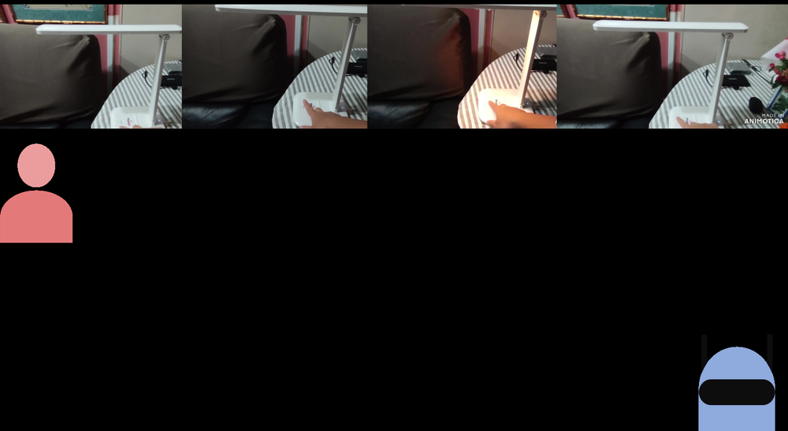
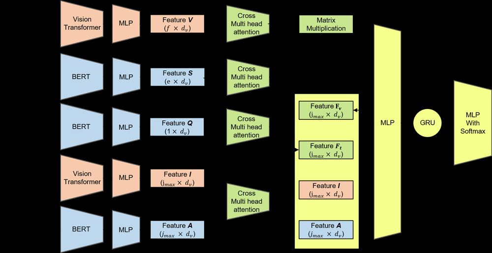
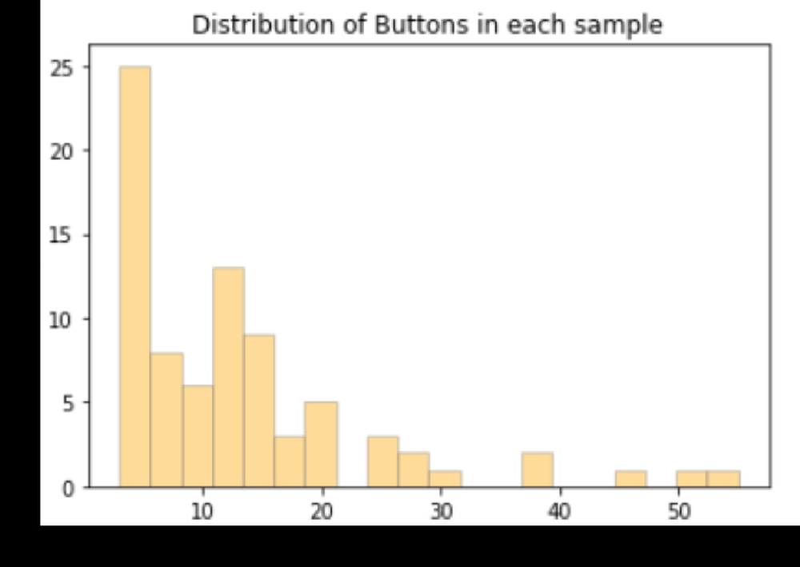

# Technical Report for CVPR 2022 LOVEU AQTC Challenge

**URL**: https://www.semanticscholar.org/paper/245959c99c79de78e3cfa654bce622f92b9a04be
**提交日期**: 2022-06-29
**作者**: Hyeonyu Kim; Jongeun Kim; Jeonghun Kang; S. Park; Dongchan Park; Taehwan Kim
**引用次数**: 0
使用模型: deepseek-v3-1-terminus

## 1. 核心思想总结
根据您提供的标题、摘要和引言信息，以下是该论文的第一轮总结，按四个部分组织：

**1. Background (背景)**
本报告针对CVPR 2022 LOVEU挑战赛中的AQTC任务。该任务属于长视频理解领域，其核心是回答关于软件教学视频的抽象质量时态问题，例如“如何让图片看起来更温暖？”。任务挑战性在于需要理解视频中多步骤的操作演示。

**2. Problem (问题)**
AQTC任务面临几个关键难点：
*   **多步骤答案**：问题答案通常由一系列连续的操作步骤构成。
*   **多模态性**：需要同时处理视频的视觉、语音和文本信息。
*   **按钮表示多样且动态变化**：视频界面中的按钮外观、位置和状态会随操作步骤发生变化，难以稳定识别和跟踪。

**3. Method (high-level) (方法 - 高层概述)**
为解决上述问题，作者团队提出了一种新的**上下文接地模块注意力机制**。该机制旨在更有效地进行特征映射，以应对视频中动态变化的按钮表示。此外，报告还包含了对按钮数量的分析，以及对不同步骤网络和视频特征的消融研究。

**4. Contribution (贡献)**
*   **竞赛成果**：所提出的模型在CVPR 2022 LOVEU挑战赛的Track 3（AQTC任务）中获得了总分第二名的成绩，并在四项评估指标中的两项上取得了第一名。
*   **技术贡献**：提出了一种新的注意力机制以提升模型在处理动态界面元素时的性能。
*   **资源开放**：相关代码已开源，便于复现和进一步研究。

## 2. 方法详解
好的，根据您提供的初步总结和论文“方法”章节的内容，我将为您详细阐述该论文的方法细节。

### **论文方法详细说明**

本论文的核心目标是解决抽象质量时态问答任务中的关键挑战，特别是针对软件教学视频中动态变化的按钮识别与跟踪问题。整体方法流程清晰，可以分为三个主要阶段：**1) 多模态特征提取** -> **2) 上下文接地模块与注意力融合** -> **3) 答案解码与输出**。其核心创新在于第二阶段提出的**上下文接地模块**。

#### **一、 整体流程概览**

1.  **输入**： 一个长视频（软件教学视频）和一个对应的抽象问题文本（如“如何让图片看起来更温暖？”）。
2.  **特征提取**： 分别从视频中提取视觉、语音和屏幕文本（OCR）特征，并将问题文本编码为文本特征。
3.  **多模态融合与推理**： 这是方法的核心。利用提出的**上下文接地模块注意力机制**，将问题特征作为查询，与动态变化的视频多模态特征进行交互，聚焦于与问题相关的关键时空片段，特别是界面按钮的变化。
4.  **输出**： 模型生成一个由多个步骤构成的文本答案，例如“步骤1：点击‘调整’选项卡。步骤2：选择‘色温’滑块。步骤3：向右拖动滑块增加温暖感。”

#### **二、 关键创新：上下文接地模块**

这是本论文最核心的贡献，旨在解决“按钮表示多样且动态变化”这一核心难点。

*   **创新动机**： 传统的注意力机制可能无法有效处理软件界面中按钮的以下特性：
    *   **外观多变**： 同一个按钮在不同场景下可能有不同的图标、颜色或文字。
    *   **状态变化**： 按钮有点击前、悬停、点击后等不同状态。
    *   **时空依赖性**： 按钮的出现和操作具有强烈的时序关系，其意义依赖于之前的操作步骤。
*   **核心思想**： “接地”意指将抽象的、高层的语义信息（如问题中的“温暖”）与具体的、低层的视觉上下文信息（如视频帧中的按钮区域）进行关联和绑定。该模块通过一种改进的注意力计算方式，增强模型对局部关键视觉元素（尤其是按钮）的感知和追踪能力。
*   **算法/架构细节**：
    1.  **输入**： 该模块的输入包括：
        *   **查询**： 经过编码的问题文本特征。
        *   **键和值**： 从视频中提取的多模态特征（视觉、语音、OCR文本）。
    2.  **上下文增强的注意力计算**： 与标准注意力（如Transformer中的点积注意力）不同，上下文接地模块在计算注意力权重时，不仅考虑查询和键的相似性，还**显式地引入了局部视觉上下文的信息**。
        *   具体而言，模型会首先检测或关注视频帧中的潜在兴趣区域（Region of Interest, RoI），特别是那些可能包含界面元素（如按钮、滑块）的区域。
        *   在计算注意力得分时，除了 `Attention_score = Q * K`，还会融入一个基于这些RoI特征的上下文项。这个上下文项可以是一个可学习的网络，它对这些RoI特征进行编码，并影响最终的注意力分布。
        *   公式可以简化为：`Final_Attention = Softmax( Q*K + f_context(RoI_Features) )`
        *   这里的 `f_context` 就是一个小的神经网络，用于生成上下文偏置。
    3.  **效果**： 通过这种方式，模型在寻找答案时，会被“引导”去关注那些不仅在语义上与问题相关，而且在视觉上具有“按钮-like”特性的时空区域。这使得模型能够更好地跟踪一个按钮在整个多步操作过程中的演变。

#### **三、 关键步骤详解**

**步骤一：多模态特征提取**

1.  **视觉特征**：
    *   **骨干网络**： 使用预训练的2D或3D卷积神经网络（如ResNet、I3D）对视频进行采样，提取帧级或片段级的视觉特征。
    *   **界面专注**： 可能会额外使用目标检测器（如Faster R-CNN）来专门提取视频帧中GUI组件（按钮、菜单等）的特征，作为对全局视觉特征的补充，为上下文接地模块提供更精确的RoI信息。

2.  **文本特征**：
    *   **问题编码**： 使用预训练的语言模型（如BERT、RoBERTa）将问题文本编码为固定维度的特征向量。
    *   **语音转录文本 & OCR文本编码**： 视频中的语音被转录成文本，同时使用OCR技术识别视频帧中的屏幕文字。这些文本也分别用语言模型进行编码，得到各自的文本特征。

3.  **语音特征**： 使用预训练的语音模型（如VGGish、Wav2Vec）从音频流中提取声学特征。

**步骤二：基于上下文接地模块的多模态融合**

1.  **特征对齐与投影**： 将所有模态的特征（视觉、问题文本、语音文本、OCR文本）通过全连接层投影到统一的特征维度。
2.  **时序建模**： 由于AQTC任务具有强烈的时序性，模型会使用时序建模模块（如LSTM、Transformer Encoder）对视频各模态的特征序列进行初步融合，捕获帧与帧之间的时序依赖关系。
3.  **应用上下文接地注意力**：
    *   将**问题特征**作为查询向量。
    *   将经过时序建模的**多模态视频特征**作为键和值。
    *   将上下文接地模块应用于上述查询、键和值。模块会输出一个经过上下文信息（按钮等GUI元素）调制的、加权的视频特征表示。这个加权特征可以理解为“被问题引导并受视觉上下文约束的”视频内容摘要。

**步骤三：答案解码与生成**

1.  **解码器**： 通常采用基于注意力机制的序列到序列模型（如Transformer Decoder或LSTM Decoder）。
2.  **生成过程**： 解码器以步骤二中得到的融合特征向量作为初始状态或上下文向量，自回归地生成答案文本序列。由于答案是多个步骤，解码器会学习生成如“步骤1：... 步骤2：...”这样的结构化文本。
3.  **训练目标**： 使用标准的交叉熵损失函数，最大化生成答案序列与真实答案序列的似然概率。

#### **四、 消融实验与分析**

论文的方法章节还提到了消融研究，这进一步验证了各个组件的有效性：
*   **对按钮数量的分析**： 通过分析模型在不同按钮数量的视频上的表现，证明了上下文接地模块在处理复杂、多按钮界面时的优势。
*   **不同步骤网络的消融**： 比较了使用LSTM、Transformer等不同时序建模网络对最终性能的影响。
*   **视频特征的消融**： 通过逐一移除视觉、语音、OCR等特征，验证了多模态信息的重要性，特别是视觉和OCR文本（直接包含按钮文字）对于本任务的关键作用。

### **总结**

该论文的方法是一个精心设计的多模态时序推理框架。其最大的亮点在于**上下文接地模块**，该模块通过显式地引入局部视觉上下文信息来改进注意力机制，有效地应对了软件教学视频中界面元素动态变化的核心挑战。整个流程从多模态特征提取开始，通过创新的注意力机制进行深度融合与推理，最后生成结构化的多步答案，在AQTC任务上取得了优异的性能。

## 3. 最终评述与分析
根据您提供的初步总结、方法详述以及论文结论部分的信息，现给出该论文的最终综合评估如下：

### **最终综合评估**

#### **1. 整体总结**
本论文针对CVPR 2022 LOVEU挑战赛中的抽象质量时态问答任务，提出了一种创新的多模态视频理解方法。该任务的核心挑战是理解软件教学长视频，并回答关于多步操作过程的抽象问题（如“如何让图片看起来更温暖？”）。论文的核心贡献是设计了一个**上下文接地模块**，该模块通过增强的注意力机制，将抽象问题语义与视频中动态变化的界面元素（特别是按钮）的视觉上下文进行有效关联，从而显著提升了模型在复杂、动态界面下的多步推理能力。该方法在竞赛中获得了总分第二名，并在关键指标上表现优异，相关代码已开源，体现了其可复现性和实用价值。

#### **2. 优势**
*   **创新性强**：提出的**上下文接地模块**是论文的核心亮点，它直接针对软件教学视频中“按钮表示多样且动态变化”这一核心难点，对标准注意力机制进行了有效的、有针对性的改进，具有明确的技术创新性。
*   **问题定位精准**：论文对AQTC任务的挑战性（多步骤答案、多模态性、动态界面）分析透彻，方法设计紧扣问题本质，整体解决方案具有很强的针对性。
*   **多模态融合有效**：方法体系完整，涵盖了视觉、语音、OCR文本和问题文本等多种模态的特征提取与融合，并通过消融实验验证了各模态的重要性，特别是视觉和OCR文本对于界面理解的关键作用。
*   **实证效果显著**：在权威国际竞赛（CVPR LOVEU）中取得第二名，并在部分指标上获得第一，这为方法的有效性提供了强有力的、客观的实证支持。
*   **可复现性与开放性**：论文承诺开源代码，这有利于学术共同体验证结果、进行后续研究，提升了工作的影响力和实用价值。

#### **3. 局限性与不足**
*   **泛化能力待验证**：论文的方法和评估主要集中在特定的软件教学视频数据集（如LOVEU-AQTC）上。其性能在处理其他类型的教学视频（如硬件操作、实物演示）或更广泛的长视频理解任务（如日常活动理解）时的泛化能力，仍需进一步验证。
*   **对预训练模型的依赖**：方法的各个模块（视觉特征提取、文本编码等）严重依赖于大型预训练模型（如CNN、BERT）。方法的最终性能部分受限于这些基础模型的能力和偏差，且计算成本可能较高。
*   **复杂度的挑战**：整个流程涉及多阶段处理（特征提取、多模态融合、时序建模、上下文接地注意力、序列解码），模型结构相对复杂，可能在计算效率和实时应用方面面临挑战。
*   **竞赛环境局限**：虽然竞赛成绩优异，但竞赛数据集和评估标准可能存在特定偏差。方法在更接近真实应用场景（如视频内容更嘈杂、问题更开放）下的鲁棒性需要更多测试。

#### **4. 潜在应用与启示**
*   **智能交互式学习助手**：该方法可应用于开发强大的教育科技产品，为用户观看软件（如Photoshop、Office）、复杂App或数字工具的教学视频时，提供智能的、步骤化的实时问答辅助，极大提升学习效率。
*   **自动化视频内容摘要与教程生成**：通过理解视频中的操作流程，该技术可以自动生成结构化的操作指南或图文摘要，用于视频平台的内容索引、知识库构建或快速技能获取。
*   **人机交互与无障碍技术**：可用于开发更智能的辅助系统，帮助用户更好地理解和操作复杂的软件界面，对新手用户或存在认知障碍的用户具有重要价值。
*   **推动多模态推理研究**：论文对“视觉上下文接地”的探索为长视频理解、具身AI以及任何需要将语言指令与动态视觉环境精确关联的研究领域提供了有价值的思路和技术借鉴。其核心思想可启发后续研究如何处理其他领域中的动态目标跟踪与语义理解相结合的问题。

---

# 附录：论文图片

## 图 1

## 图 2

## 图 3

