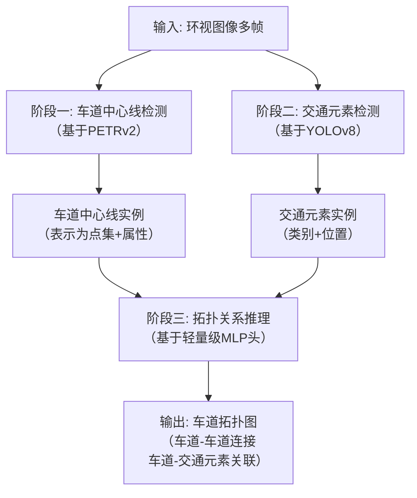
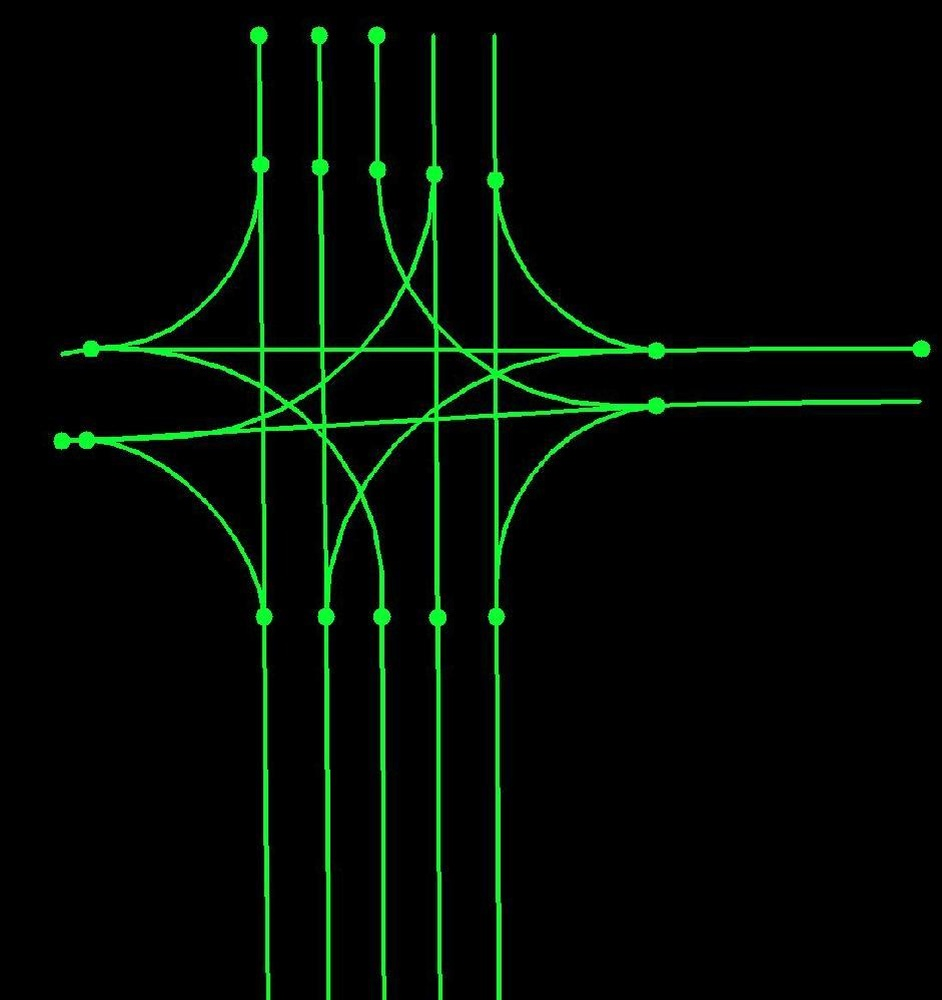
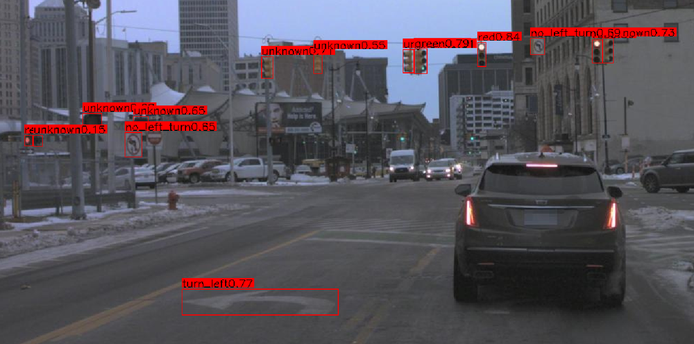
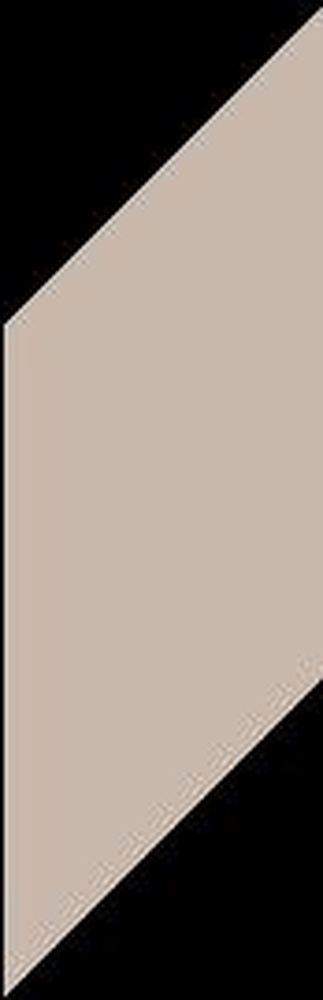
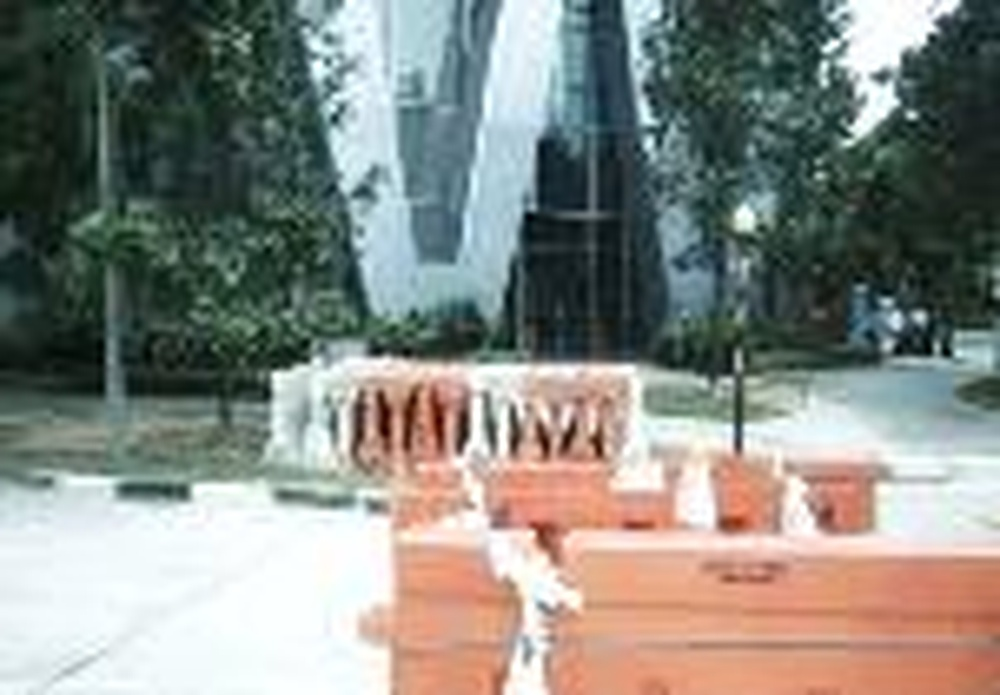
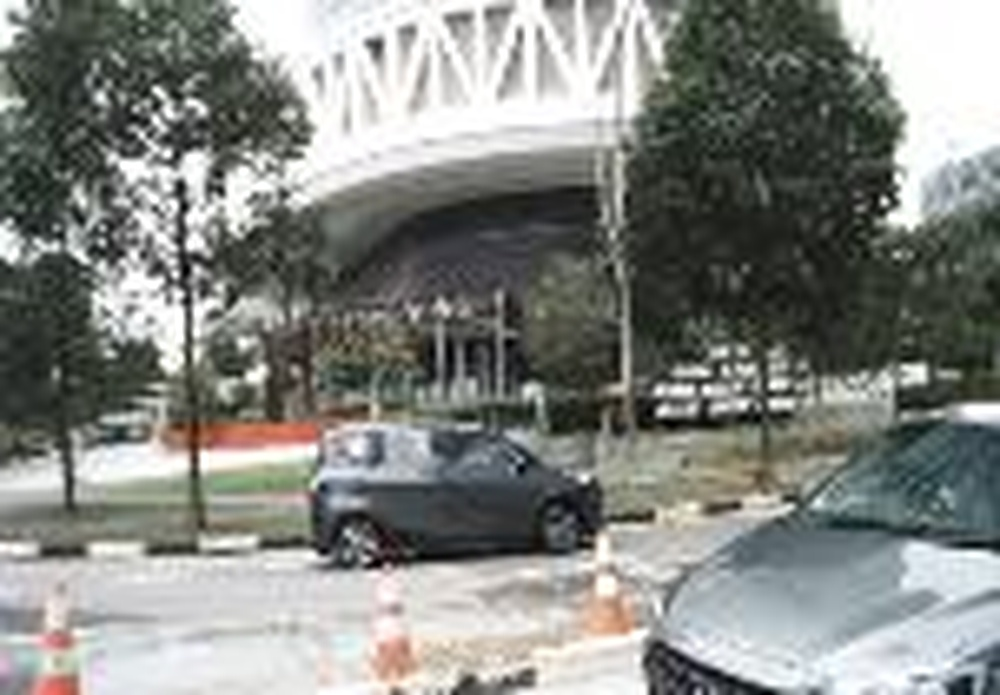

# The 1st-place Solution for CVPR 2023 OpenLane Topology in Autonomous Driving Challenge

**URL**: https://www.semanticscholar.org/paper/31b1be9372490aa222dfe9d914d6c8157c264302
**提交日期**: 2023-06-16
**作者**: Dongming Wu; Fan Jia; Jiahao Chang; Zhuoling Li; Jian‐Yuan Sun; Chunrui Han; Shuailin Li; Yingfei Liu; Zheng Ge; Tiancai Wang
**引用次数**: 14
使用模型: deepseek-v3-1-terminus

## 1. 核心思想总结
根据提供的标题、摘要和引言内容，以下是该学术论文的第一轮总结：

**标题：** CVPR 2023 OpenLane Topology 自动驾驶挑战赛的冠军解决方案

**简洁总结：**

*   **Background：** 该研究源于CVPR 2023的OpenLane Topology自动驾驶挑战赛。其核心背景是，自动驾驶系统的车道拓扑结构推理对于理解复杂道路场景至关重要，而该任务依赖于对车道中心线和交通元素（如交通灯、标志）的精确感知。
*   **Problem：** 需要解决的具体问题是，在OpenLaneV2数据集上实现高精度的车道拓扑结构预测。这要求模型不仅能检测出车道线和交通元素，还能推理出它们之间的连接关系（拓扑），这是一个更具挑战性的高层次场景理解任务。
*   **Method：** 论文提出了一种多阶段的高性能框架。具体而言：1）利用强大的PETRv2检测器来检测车道中心线；2）采用流行的YOLOv8检测器来识别交通元素；3）设计了一个简单而有效的基于MLP（多层感知机）的预测头，用于综合前两步的信息并进行最终的车道拓扑关系推理。
*   **Contribution：** 该方法在OpenLaneV2测试集上取得了55%的拓扑分数（OLS），以超过第二名8个百分点的显著优势赢得了挑战赛冠军，证明了所提方案的有效性。其中，为拓扑预测专门设计的轻量级MLP头是一个关键贡献。

## 2. 方法详解
好的，根据您提供的初步总结和论文方法章节的内容，以下是对该论文方法细节的详细说明，重点描述了关键创新、算法/架构细节、关键步骤与整体流程。

### **论文方法详细说明**

本论文的方法核心是一个**多阶段、模块化**的框架，旨在高效且精准地解决车道拓扑结构推理这一复杂任务。其整体流程可以清晰地划分为三个核心阶段：**1）车道中心线检测**、**2）交通元素检测**、**3）车道拓扑关系推理**。

#### **一、 整体流程概述**

该方法的整体工作流程如下图所示，体现了清晰的阶段划分和数据流向：

#### **二、 关键阶段与算法细节**

##### **阶段一：车道中心线检测（基于PETRv2）**

*   **骨干网络与特征提取**：采用 **PETRv2** 作为基础检测器。PETRv2 是一种先进的 3D 目标检测框架，其优势在于能够统一地处理多视角、多时间戳（帧）的图像输入。
*   **3D 位置编码**：PETRv2 通过引入 3D 坐标位置先验，将图像特征提升到 3D 空间，这使得模型能够更好地理解场景的几何结构，对于需要精确空间位置的车道线检测至关重要。
*   **查询解码与输出**：模型使用一组可学习的“车道查询”，通过 Transformer 解码器与 3D 特征图进行交互，最终输出车道中心线的实例。每个实例包含：
    *   **点集坐标**：一系列密集的、有序的 3D 点（X, Y, Z），用于精确描述车道中心线的形状。
    *   **置信度分数**：该车道线存在的概率。
    *   **其他属性**：如车道线的类型（实线、虚线等）等。

***细节洞察***：选择 PETRv2 而非纯 2D 检测器，是因为拓扑关系推理强烈依赖于车道线在 3D 空间中的精确几何和位置关系。PETRv2 的多帧和 3D 感知能力为后续拓扑推理打下了坚实的几何基础。

##### **阶段二：交通元素检测（基于YOLOv8）**

*   **检测器选择**：采用 **YOLOv8** 这一高效、精准的单阶段 2D 目标检测器来识别交通元素。
*   **检测目标**：交通元素主要包括**交通灯**和**交通标志**。
*   **输出内容**：对于每个检测到的交通元素，YOLOv8 提供：
    *   **边界框**：在图像坐标系中的位置。
    *   **类别标签**：如“红灯”、“绿灯”、“停止标志”、“限速标志”等。
    *   **置信度分数**。

***细节洞察***：交通元素的检测相对独立，且更侧重于语义信息的识别而非精确的 3D 几何。YOLOv8 在速度和精度上的平衡，使其成为此任务的理想选择。后续步骤会将这些 2D 检测结果与 3D 车道线进行关联。

##### **阶段三：车道拓扑关系推理（基于轻量级MLP头）**

这是本论文的**核心创新点**。该方法没有采用复杂的图神经网络或关系 Transformer，而是设计了一个**简单却极其有效**的基于 MLP 的预测头。

*   **输入准备**：
    1.  **车道线实例化表示**：将第一阶段得到的每条车道中心线（点集）转换为一个固定维度的特征向量。例如，可以对所有点进行采样或池化，得到一个统一的特征表示 \( F_{lane_i} \)。
    2.  **交通元素实例化表示**：将第二阶段检测到的每个交通元素（如交通灯）也转换为一个特征向量 \( F_{object_j} \)，其中包含了其类别、图像位置等信息。
    3.  **关系对构建**：为了推理拓扑，模型需要评估任意两个实例之间的关系。主要构建两种关系对：
        *   **车道-车道对**：评估两条车道中心线是否首尾相连。
        *   **车道-交通元素对**：评估一个交通元素是否与某条车道中心线存在关联（如该交通灯控制该车道）。

*   **基于MLP的关系预测头**：
    *   **输入层**：对于一对实例（如 Lane_A 和 Lane_B），将它们对应的特征向量 \( F_A \) 和 \( F_B \) 进行拼接（Concatenation），形成一个联合特征向量。
    *   **隐藏层**：该联合特征向量随后通过一个仅包含几层全连接层（MLP）的轻量级网络。
    *   **输出层**：MLP 的最后输出一个分数或概率，表示该对实例之间存在连接或关联关系的置信度。
    *   **阈值判断**：设定一个阈值，当预测分数超过该阈值时，即认为存在拓扑关系。

*   **关键创新与优势**：
    *   **简单高效**：相比于复杂的图模型，MLP 头的结构非常简单，计算开销极小，训练稳定，且不易过拟合。
    *   **有效性**：实验证明，这个简单的设计足以捕捉到车道线和交通元素之间的局部空间和语义关系。前提是前两阶段的感知提供了高质量、富含信息的实例特征。
    *   **模块化**：这种设计使得整个框架高度模块化。可以独立地升级车道检测器或交通元素检测器（例如，当有更先进的模型出现时），而无需重新设计整个拓扑推理模块。

#### **三、 关键创新总结**

1.  **实用的多阶段框架**：没有追求端到端的“黑箱”模型，而是采用务实的分治策略，将复杂任务分解为三个成熟的子任务，确保了每个环节的稳定性和高性能。
2.  **轻量级MLP拓扑头**：这是本方案最核心的创新。它证明了对于车道拓扑推理任务，在拥有强感知基础的前提下，一个极其简单的关系评估模块就能达到甚至超越复杂模型的效果，实现了“四两拨千斤”的设计哲学。
3.  **技术与工程的完美结合**：方案的成功在于巧妙地**选择和集成**了当时最先进的检测器（PETRv2, YOLOv8），并将创新点聚焦于任务最关键的“关系推理”瓶颈上，而非重复造轮子。这体现了强大的工程洞察力。

综上所述，该冠军解决方案通过一个结构清晰、创新点突出的多阶段框架，成功解决了自动驾驶中的车道拓扑推理难题。其核心在于利用强大的感知模块获取高质量的实例，再通过一个简单有效的轻量级MLP头进行关系预测，最终以显著优势赢得了比赛。

## 3. 最终评述与分析
好的，结合前两轮提供的标题、摘要、引言、方法详述以及结论部分的信息，现给出对该学术论文《CVPR 2023 OpenLane Topology 自动驾驶挑战赛的冠军解决方案》的最终综合评估。

---

### **最终综合评估**

#### 1) Overall Summary (整体总结)
本论文详细介绍了在CVPR 2023 OpenLane Topology挑战赛中夺冠的解决方案。该方案旨在解决自动驾驶领域一个核心且具有挑战性的问题：从多视角环视图像中**推理车道中心线与交通元素（交通灯、标志）之间的拓扑关系**，从而构建出描述道路场景可通行结构的“车道拓扑图”。论文提出了一个**多阶段、模块化的务实框架**：首先利用PETRv2模型进行高精度的3D车道中心线检测，其次采用YOLOv8模型进行高效的2D交通元素检测，最后创新性地设计了一个**轻量级的多层感知机（MLP）预测头**，来综合前两步的信息并完成最终的车道-车道连接及车道-交通元素关联的推理。该方案在极具挑战性的OpenLaneV2数据集测试集上取得了**55%的拓扑关系分数（OLS）**，以显著优势（超过第二名8个百分点）赢得冠军，证明了其卓越的有效性。

#### 2) Strengths (优势)
*   **卓越的性能表现**：在权威竞赛和标准数据集上取得压倒性胜利，结果为方案的有效性提供了最强有力的实证支持。
*   **巧妙的核心创新**：最大的亮点在于其**“简单而有效”的设计哲学**。没有采用复杂且难以训练的图神经网络或Transformer关系模型，而是创新地使用一个轻量级MLP头进行关系推理，该设计计算高效、训练稳定，且效果出众，体现了“四两拨千斤”的智慧。
*   **务实的工程架构**：采用**模块化、分阶段**的策略，将复杂问题分解为几个成熟的子任务（3D车道检测、2D目标检测、关系推理）。这种设计不仅使得每个模块可以独立优化和升级（例如，未来可轻松替换更先进的检测器），也提升了整个系统的可解释性和稳定性。
*   **强大的技术选型与集成**：并非从零开始，而是**精妙地集成**了当时各自领域内最先进的模型（PETRv2用于3D车道检测，YOLOv8用于交通元素检测），充分发挥了这些模型在特定子任务上的优势，体现了强大的工程集成能力。
*   **坚实的几何基础**：选择具备3D感知和多帧时序处理能力的PETRv2作为车道检测器，为拓扑关系推理提供了准确的空间几何信息，这比纯2D方法更具优势。

#### 3) Weaknesses / Limitations (劣势与局限性)
*   **误差传播风险**：作为多阶段管道式框架，其**性能高度依赖于前序模块的准确性**。如果车道检测或交通元素检测出现错误（如漏检、误检），这些错误会直接传播并影响最终拓扑关系的正确性，系统缺乏端到端的纠错机制。
*   **泛化能力存疑**：方案在OpenLaneV2数据集上进行了充分验证，但其在**其他数据集或极端、罕见场景（如恶劣天气、严重遮挡、非常规道路结构）下的泛化能力**尚未可知。模型的性能可能受限于训练数据的分布。
*   **实时性考量不足**：论文重点强调了精度，但未详细讨论整个多阶段系统的**推理速度或计算效率**。尽管MLP头本身很轻量，但结合PETRv2和YOLOv8两个检测器后，整体框架能否满足自动驾驶系统严格的实时性要求，是一个需要评估的潜在问题。
*   **关系推理的局限性**：简单的MLP头虽然有效，但其**关系建模能力可能不如更复杂的图模型**。它擅长处理成对的局部关系，但在需要全局上下文推理或处理高度复杂的交互场景时，其上限可能低于更复杂的模型。

#### 4) Potential Applications / Implications (潜在应用与启示)
*   **自动驾驶系统**：该技术可直接应用于**高精度地图的自动生成与更新、自动驾驶车辆的实时场景理解与决策规划模块**，帮助车辆更准确地理解车道连接规则和交通规则，提升行驶安全性和流畅性。
*   **学术研究启示**：
    *   **挑战“模型越复杂越好”的固有观念**：本论文的成功为学术界提供了一个重要启示，即在某些任务中，**简洁高效的模型设计可能比一味追求模型复杂度更具性价比和实用性**。
    *   **模块化设计的价值**：证明了在深度学习时代，精心设计的模块化管道仍然是解决复杂问题的有效途径，特别是在需要组合多种模态能力的任务中。
    *   **为后续研究奠定基础**：该框架和其强大的基线性能可作为未来研究的坚实基础。例如，研究者可以尝试用端到端模型来优化它，或者探索如何将MLP头的关系建模能力与图模型的全局推理能力相结合。
*   **工业界应用**：除了自动驾驶，该技术还可用于**智慧交通系统中的道路基础设施数字化、交通流仿真分析**等领域，为城市规划和交通管理提供数据支持。

---
**总结论**：这篇论文描述了一个在特定竞赛任务中取得巨大成功的优秀解决方案。其核心价值在于通过极简的创新设计，在强大的基础模块上实现了性能突破，展示了卓越的工程洞察力和实用性。尽管存在多阶段框架固有的局限性，但其出色的结果和简洁的核心思想对自动驾驶领域乃至更广泛的复杂结构化预测任务都具有重要的参考价值和启发意义。

---

# 附录：论文图片

## 图 1

## 图 2

## 图 3

## 图 4

## 图 5

## 图 6

## 图 7

## 图 8

## 图 9

## 图 10

